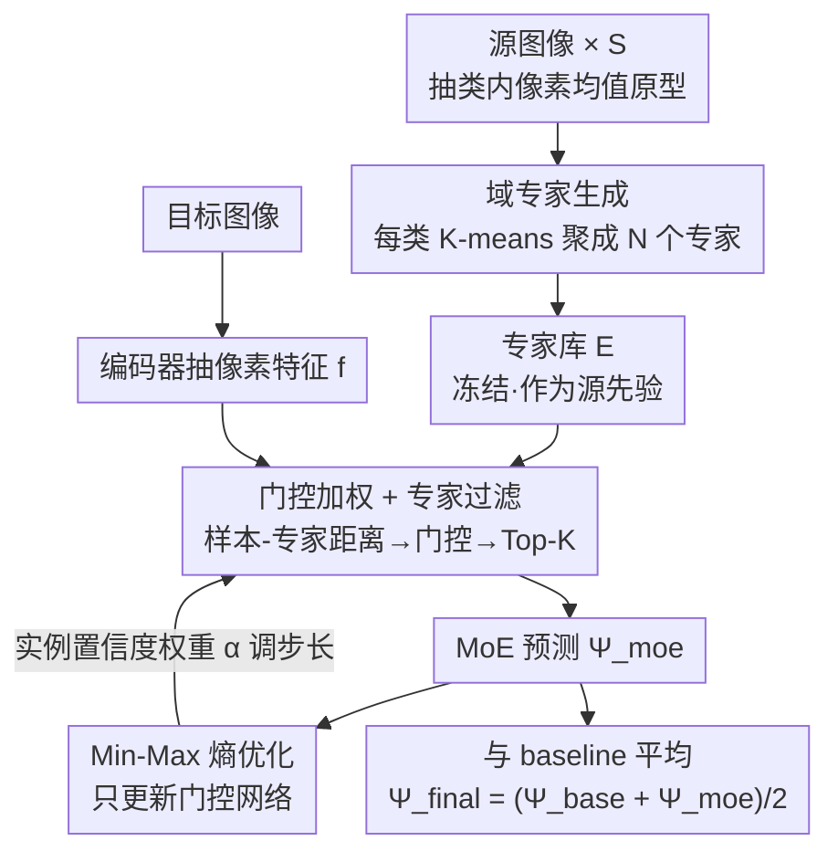

# Mixture of Prototypes for Test-time Adaptive Segmentation

**会议**: CVPR 2026  
**论文**: [CVF Open Access](https://openaccess.thecvf.com/content/CVPR2026/html/Li_Mixture_of_Prototypes_for_Test-time_Adaptive_Segmentation_CVPR_2026_paper.html)  
**领域**: 语义分割 / 测试时自适应  
**关键词**: 测试时自适应, 语义分割, 混合专家(MoE), 原型聚类, 熵优化

## 一句话总结
把传统 TTA-Seg 里"每类一个原型"的做法升级为"每类一簇专家"——用 K-means 把源域类内原型聚成多个专家、用门控网络按样本动态加权融合，并用 min-max 熵优化只更新门控，在 Cityscapes→ACDC、GTA5→真实 等基准上刷出 TTA / 持续 TTA 新 SOTA。

## 研究背景与动机
**领域现状**：测试时自适应分割（TTA-Seg）要在部署阶段把一个源域训练好的分割模型，无监督地适配到分布漂移（如雾、夜、雨、雪等恶劣天气）的测试数据上。由于隐私等原因测试时拿不到源数据，主流做法是在源域训练阶段把每个类的像素特征求平均，存成**类原型（class-wise prototype）**，测试时用这些原型作为源知识的代理来引导适配。

**现有痛点**：作者指出"每类一个原型"这条流水线有两处硬伤。其一在源域侧——把一整个类压成一个平均向量，等于默认类内分布是单峰的，**抹掉了源域同类样本之间的多样性**（同一类"道路"在白天/黑夜/不同城市下特征差异巨大）。其二在测试侧——原型以"与实例无关"的方式套用到所有测试样本上，**忽略了不同测试样本承受的分布漂移程度不同**：一张浓雾图和一张轻雨图被同一套原型同等对待显然不合理。此外，更新原型（动量/反传）会吸收并累积错误伪标签，固定原型又无法缩小域差。

**核心矛盾**：单一原型在"代表性"和"自适应性"上都不够——它既不能刻画类内分布的多样性，又不能随测试实例动态调整源知识的使用方式。

**本文目标**：让源知识既能表达类内多样性，又能在测试时按实例动态调用。拆成两个子问题：(1) 怎样在源域侧把一个类表示得更丰富；(2) 怎样在测试时按样本-知识相关性动态融合。

**切入角度**：作者把混合专家（MoE）范式搬进 TTA-Seg——既然一个原型不够，那就为每个类准备**多个专家**（每个专家对应类内一个子分布），再用一个门控网络按"当前样本与各专家的相关性"动态分配权重。

**核心 idea**：用"每类多专家 + 门控动态融合 + min-max 熵优化"替代"每类单原型 + 静态套用"，在不动主干参数的前提下完成即插即用的测试时适配。

## 方法详解

### 整体框架
方法分两个阶段。**源域训练阶段**：对每张源图按类求像素特征均值得到大量局部原型，再对每个类的原型集合做 K-means 聚类，把它们浓缩成 $N$ 个**域专家**，作为源分布的先验知识保存下来（不再需要源数据）。**测试适配阶段**：来一张目标图，编码器抽出像素特征，计算每个像素与各类专家的距离、过门控网络得到权重，经 Top-K 过滤后加权聚合成 MoE 预测 $\Psi_{moe}$；再用 min-max 熵损失（配合实例级置信度权重 $\alpha$）**只反传更新门控网络**，主干和专家全程冻结；最终预测取 MoE 与原 baseline 预测的平均。

### 关键设计

**1. 域专家生成：用聚类把"单原型"拆成"多专家"以保留类内多样性**

针对"一类压成一个平均向量抹掉源域多样性"这个痛点，作者不再把每个类当成不可分的整体。源域训练时，对每张源样本 $s$ 按类取像素特征均值得到局部原型 $p_c^s$，遍历全部 $S$ 张源图后每个类 $c$ 拥有一个原型集合 $P_c=\{p_c^s\}_{s=1}^{S}$。关键一步是对这个集合做 K-means，聚成 $N$ 个有代表性的专家：$E_c=\text{K-means}(P_c, N)$，其中 $N\ll S$。这样每个类不再是一个点，而是 $N$ 个分别刻画类内不同子分布（如不同光照/场景下的"道路"）的专家。聚类相比直接保留所有原型，既压缩了存储和算力，又比"求一个总均值"保留了多峰结构。消融里作者还对比了 FPS 采样和 Autoencoder 两种替代生成方式，K-means 在四种天气下都最优，说明"聚类得到的中心比采样点或重建点更能当可靠的源先验"。

**2. 门控动态融合 + 专家过滤：按实例相关性加权、并剔除帮倒忙的专家**

针对"原型与实例无关地套用、忽略各样本漂移程度不同"的痛点，作者引入门控网络做实例级动态融合。对测试像素特征 $f$，先算它到类 $c$ 各专家的平均欧氏距离矩阵 $x_c^n=\frac{1}{hw}\sum_{(i,j)}\lVert F_{(i,j)}-e_n\rVert_2$，再过门控网络得到门控值 $G=\mathcal{G}(X)$；类 $c$ 的聚合距离是各专家距离的门控加权和 $D(f,E_c)=\sum_{n=1}^{N} g_n\cdot\lVert f-e_n\rVert_2$。这样不同测试样本会拿到不同的专家权重，天然实现"逐实例"调用源知识。

但域差会让一些专家携带源域特有模式、反而干扰适配，于是再加一道 **Top-K 过滤**：$G_c=\text{Softmax}(\text{TopK}(G_c, K))$，其中 $\text{TopK}$ 把非 Top-K 的门控值置为 $-\infty$。这个 Top-K 也是逐样本独立挑选的，等于按每个样本自身的漂移情况动态决定"信哪几个专家"。单像素的最终类别预测由各类聚合距离的负 softmax 给出：$\Psi_{moe}=\text{Softmax}([-D(f,E_1),\dots,-D(f,E_C)]^\top)$——离哪类专家簇越近，该类得分越高。

**3. Min-Max 熵优化：既要预测自信、又要逼门控用满所有专家**

只用熵最小化来更新门控会把系统推向局部最优——**门控塌缩到永远只用少数几个专家**，多样性白费。作者因此设计了一个一压一拉的 min-max 目标。一方面对 MoE 预测做**熵最小化**降低预测不确定性、促进适配：

$$\mathcal{L}_{min}=-\frac{1}{hw}\sum_{(i,j)}\sum_{c=1}^{C}\Psi_{moe}^c(i,j)\log\Psi_{moe}^c(i,j).$$

另一方面对门控值（即专家选择的概率分布）做**熵最大化**，逼门控均衡地用上所有专家、避免对少数专家过度依赖：

$$\mathcal{L}_{max}=\frac{1}{C}\sum_{c=1}^{C}\Big(\frac{1}{N}\sum_{n=1}^{N} g_n\log g_n\Big).$$

这一最小化预测熵、最大化门控熵的组合是本文最核心的优化思想：图 3 显示加了 $\mathcal{L}_{max}$ 后各样本门控值的平均熵明显更高，证实它确实缓解了"专家塌缩"，让模型在保持自信预测的同时把专家库用满。

**4. 实例置信度加权：用高置信像素占比 α 自适应调节更新步长**

不同目标样本与专家的契合度不同，若对所有样本用同一更新速率，门控网络的权重更新会不稳。作者用一个置信度引导的权重 $\alpha$ 来量化当前样本的域漂移：

$$\alpha=\frac{1}{hw}\sum_{(i,j)}\delta\big(\max_c\Psi(i,j)>Q\big),$$

即 baseline 预测中高置信像素（最大类概率超阈值 $Q$）所占的比例。$\alpha$ 高说明模型对该样本本就自信、域漂移小，就**加快更新**让门控大胆吸收目标域信息；$\alpha$ 低则**谨慎更新**。总损失写成 $\mathcal{L}_{total}=\alpha\cdot(\mathcal{L}_{min}+\beta\cdot\mathcal{L}_{max})$，门控网络是系统里唯一可学习的参数，其梯度与 baseline 主干解耦，专家纯作源先验——这赋予整个 MoE 模块**即插即用**的优势。最终像素预测取 MoE 与 baseline 的平均 $\Psi_{final}=\frac{1}{2}(\Psi_{baseline}+\Psi_{moe})$，让两路预测互相加强。

### 损失函数 / 训练策略
源域训练阶段只负责抽原型 + K-means 生成专家，不改主干。测试阶段唯一可学习参数是门控网络（一个 $C\times C$ 的线性层），用 $\mathcal{L}_{total}=\alpha\cdot(\mathcal{L}_{min}+\beta\cdot\mathcal{L}_{max})$ 在线反传更新。关键超参（Cityscapes→ACDC）：每类专家数 $N=14$、Top-K 的 $K=7$、$\beta=0.01$、置信阈值 $Q=0.69$；batch size=1，单张 Tesla T4 即可跑。

## 实验关键数据

### 主实验

Cityscapes→ACDC 的 TTA 任务（mIoU，四种天气均值）：

| 方法 | Fog | Night | Rain | Snow | Mean-mIoU↑ |
|------|-----|-------|------|------|-----------|
| Source | 69.1 | 40.3 | 59.7 | 57.8 | 56.7 |
| TENT | 69.0 | 40.3 | 59.9 | 57.7 | 56.7 |
| CoTTA | 70.9 | 41.2 | 62.6 | 59.8 | 58.6 |
| BECoTTA (MoE) | 71.5 | 42.5 | 63.3 | 59.6 | 59.2 |
| SVDP | 71.6 | 42.7 | 64.2 | 60.2 | 59.7 |
| **Ours** | **72.9** | **43.1** | 63.5 | **62.8** | **60.6** |

GTA5→真实（Sim-to-Real TTA，mIoU）：

| 方法 | Cityscapes | BDD100K | Mapillary | Avg↑ |
|------|-----------|---------|-----------|------|
| Source | 35.87 | 29.89 | 38.67 | 34.81 |
| SITA | 40.64 | 32.94 | 37.80 | 37.13 |
| MedBN | 39.06 | 33.03 | 39.64 | 37.24 |
| **Ours** | **42.26** | **33.97** | **40.90** | **39.04** |

在持续 TTA（CTTA，三轮循环）上 Mean mIoU 达 **62.5**，超过 SVDP(61.3)、C-MAE(61.8)、Hybrid(62.0)，且同为 MoE 架构的 BECoTTA 在相同设置下被领先约 **3.4%**；门控网络只带来 +2.33% FLOPs（+76G / 3252G）的可忽略开销。

### 消融实验

CTTA（Cityscapes→ACDC 子域，Avg mIoU）：

| 配置 | $\mathcal{L}_{min}$ | EF | $\mathcal{L}_{max}$ | IW | Avg |
|------|:---:|:---:|:---:|:---:|:---:|
| #0 | | | | | 61.1 |
| #1 | ✓ | | | | 57.9 |
| #2 | ✓ | ✓ | | | 61.7 |
| #3 | ✓ | ✓ | ✓ | | 62.0 |
| #4 | ✓ | ✓ | | ✓ | 62.0 |
| #5 | ✓ | ✓ | ✓ | ✓ | **62.4** |

（EF=专家过滤 Top-K，IW=实例加权）

### 关键发现
- **专家过滤是稳定器**：只用 $\mathcal{L}_{min}$（#1）反而比不优化（#0）掉 3.2%，因为门控调整不稳定；加上专家过滤后（#2）立刻回到 61.7，比 #1 提升 3.8%——说明剔除"帮倒忙的源特有专家"对在线适配至关重要。
- **$\mathcal{L}_{max}$ 防专家塌缩**：图 3/5 显示加 $\mathcal{L}_{max}$ 后门控熵更高、各专家平均权重更均衡，避免了只用少数专家；最终配 IW 后达到最佳 62.4。
- **K-means 优于 FPS/AE**：四种天气下聚类生成的专家全面优于最远点采样和自编码器，验证"聚类中心比采样点/重建点更能当可靠源先验"。
- **超参敏感性**：$N=14$ 能较好捕捉源域多样性；$K$、$\beta$ 在合理区间内 mIoU 平稳，$\beta=0.01$ 为佳。

## 亮点与洞察
- **"单原型→专家簇"的视角很自然**：把 TTA 里普遍用的类原型直接接上 MoE，既保留类内多样性又复用了成熟的门控机制，是一处低成本却有效的范式升级。
- **min-max 熵是点睛之笔**：一边压预测熵求自信、一边升门控熵防塌缩，简洁地解决了"有多专家却只用一个"的退化问题——这个"最大化选择熵"的 trick 可迁移到任何带门控/路由的稀疏模型，用来对抗路由塌缩。
- **真·即插即用**：专家是冻结先验、只反传一个 $C\times C$ 门控线性层，梯度与主干解耦，FLOPs 仅 +2.33%，避免了改主干带来的灾难性遗忘——这对持续 TTA 场景尤其友好。
- **置信度比例 $\alpha$ 当自适应学习率**：用"高置信像素占比"量化域漂移并调节更新步长，是个轻量又直觉的全局信号，可借鉴到其他在线自适应任务里做步长调度。

## 局限与展望
- **专家数 $N$ 需预设且固定**：K-means 的簇数对所有类统一取 14，没有按类内真实多样性自适应；类间分布复杂度差异大时这可能次优。
- **依赖源域训练阶段可控**：专家必须在有标签源域离线生成，对"只有黑盒源模型、拿不到源训练过程"的场景不适用。
- **评测局限于驾驶场景分割**：基准都是 Cityscapes/ACDC/GTA5/BDD/Mapillary 这类自动驾驶语义分割，是否迁移到医学、遥感等其他分割域未验证。
- **最终预测简单平均 baseline 与 MoE**：$\frac{1}{2}(\Psi_{base}+\Psi_{moe})$ 的等权融合略显朴素，可能存在按样本动态融合的提升空间。

## 相关工作与启发
- **vs BECoTTA（同为 MoE 做 CTTA）**：BECoTTA 构造**域特定专家**并强调域-专家对齐；本文用**域共享专家**、推动域无关的专家利用，并用 min-max 优化鼓励多样化专家选择。相同设置下本文领先约 3.4%，说明域共享 + 选择熵最大化更利于测试时适配。
- **vs TENT / SURGEON（更新主干参数类）**：它们通过调 BN 或权重梯度适配，易因连续更新导致灾难性遗忘；本文冻结主干、只更新门控，规避遗忘的同时保持高精度。
- **vs DePT / VDP / SVDP（视觉提示类）**：这些方法学习图像级视觉提示，可能干扰图像本身的空间信息；本文不引入提示，靠源专家先验 + 门控融合引导，在 ACDC 上 mIoU 更高。
- **vs DIGA / SITA（无反传非参数类）**：它们效率高但学习能力有限、难充分捕捉目标域语义分布；本文只反传门控这一小模块，在效率与精度间取得更好折中。

## 评分
- 新颖性: ⭐⭐⭐⭐ 把 MoE 接进 TTA-Seg 并配 min-max 熵防塌缩，思路清晰且组合得当，但各组件单看较常规。
- 实验充分度: ⭐⭐⭐⭐ TTA / Sim-to-Real / 持续 TTA 三任务多基准 + 完整消融与超参分析，较扎实；场景偏驾驶分割。
- 写作质量: ⭐⭐⭐⭐ 动机推导和方法叙述清楚，公式完整，图表对照到位。
- 价值: ⭐⭐⭐⭐ 即插即用、开销极小且刷新 SOTA，对实际部署的测试时适配有较强实用价值。

<!-- RELATED:START -->

## 相关论文

- [\[CVPR 2026\] Test-Time Multi-Prompt Adaptation for Open-Vocabulary Remote Sensing Image Segmentation](test-time_multi-prompt_adaptation_for_open-vocabulary_remote_sensing_image_segme.md)
- [\[CVPR 2026\] The Golden Subspace: Where Efficiency Meets Generalization in Continual Test-Time Adaptation](the_golden_subspace_where_efficiency_meets_generalization_in_continual_test-time.md)
- [\[ICCV 2025\] Correspondence as Video: Test-Time Adaption on SAM2 for Reference Segmentation in the Wild](../../ICCV2025/segmentation/correspondence_as_video_test-time_adaption_on_sam2_for_reference_segmentation_in.md)
- [\[ICML 2025\] IT³: Idempotent Test-Time Training](../../ICML2025/segmentation/it3_idempotent_test-time_training.md)
- [\[CVPR 2026\] PromptMoE: A Segmentation Refinement Framework Leveraging Mixture of Experts for Improved Prompting](promptmoe_a_segmentation_refinement_framework_leveraging_mixture_of_experts_for_.md)

<!-- RELATED:END -->
