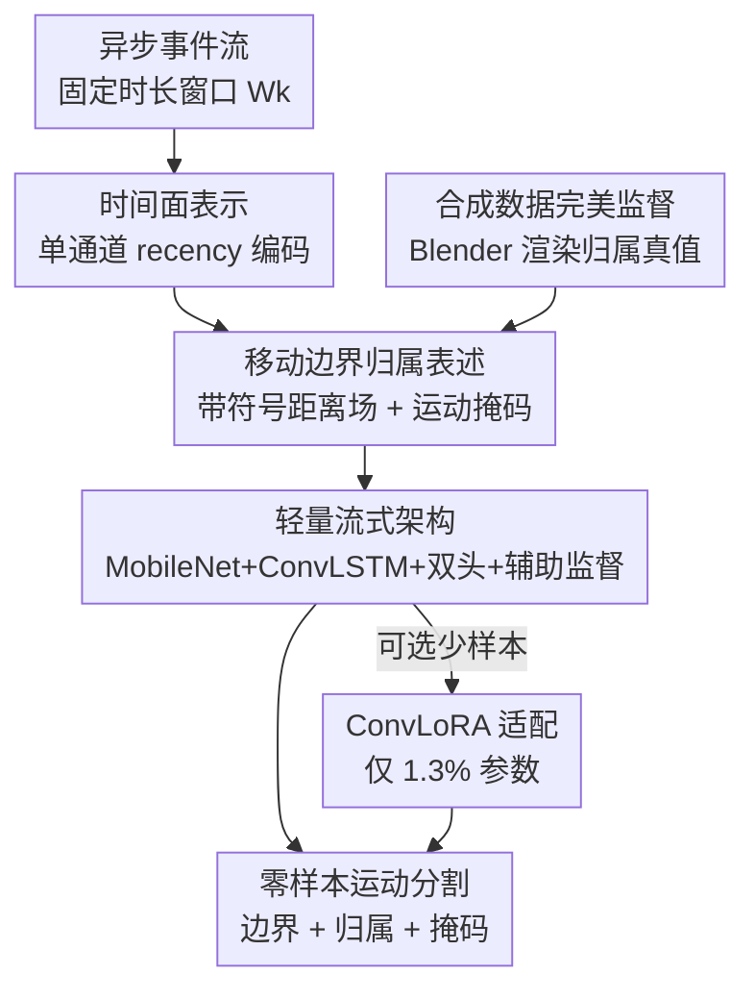

# Moving Border Ownership for Event-based Motion Segmentation

**会议**: CVPR 2026  
**论文**: [CVF Open Access](https://openaccess.thecvf.com/content/CVPR2026/html/Hua_Moving_Border_Ownership_for_Event-based_Motion_Segmentation_CVPR_2026_paper.html)  
**领域**: 事件相机 / 运动分割  
**关键词**: 事件相机, 运动分割, 边界归属, 合成数据, 零样本泛化

## 一句话总结
这篇论文把事件相机的运动分割重新表述为「移动边界归属（moving border ownership）」预测——既检测运动边界，又判断边界哪一侧属于前景运动物体；用 Blender 合成数据做完美监督训练一个轻量的 time-surface + MobileNet + ConvLSTM 网络，纯合成训练即可零样本迁移到 EED / EVIMO1 / EVIMO2 / EMSMC 四个真实数据集，达到事件域 SOTA，并以 200 FPS 实时运行。

## 研究背景与动机

**领域现状**：事件相机（neuromorphic event sensor）在运动边界处提供最精确的信息，天然适合做独立运动物体分割。已有方法分两类：一类是模型驱动的几何方法（对比度最大化 contrast maximization、运动聚类、光流聚类），靠拟合运动模型把事件分到不同运动层；另一类是学习驱动的方法，直接从事件表示回归运动掩码。

**现有痛点**：当相机本身也在动时，事件流里同时混着自运动（ego-motion）和物体运动，两者必须解耦才能分割。模型驱动的几何方法假设很重（要预设运动层数、时间窗、各种阈值）、计算慢；学习方法泛化能力差——大多 per-dataset 训练，换个传感器或数据集就掉点，真正能跨数据集零样本迁移的极少。无监督域适应（UDA）虽然能从 RGB/光流迁到事件，但仍需一个 adaptation 阶段。

**核心矛盾**：现有学习管线只产出「移动物体掩码」这一种表示，丢掉了一个对遮挡推理至关重要的线索——边界归属（border ownership），即一条边界两侧到底哪边是前景、哪边是背景。没有归属信息，物体互相遮挡、前后穿插时分割就会糊。

**本文目标**：训练一个既能定位移动物体、又能预测其边界与边界归属的轻量模型，且**只在合成数据上训练、零样本迁移到真实数据**，不做任何 per-dataset 调参。

**切入角度**：作者从生物视觉受到启发——Meister 等人的神经科学工作发现，物体与背景运动的分离早在视网膜神经节细胞（retinal ganglion cells）就开始了，一部分细胞选择性地响应物体运动，实现早期的前景—背景分离。这暗示移动物体检测可以是一个简单、鲁棒的早期机制。作者认为有效的运动分割不该只学物体位置，还要学边界和边界归属，呼应生物视觉里的关键计算。

**核心 idea**：把运动分割转化为「归属感知的边界理解」——用一个**带符号距离的归属场（ownership-signed distance field）**取代单纯的二值掩码，让监督集中在事件真正发生的运动边界处，遮挡推理作为分割的副产品自然涌现。

## 方法详解

### 整体框架

整个系统是一个流式（streaming）的「时间面输入 → 空间编码 → 时序记忆 → 双头解码」管线，外加一套合成数据生成与可选的少样本适配。输入是固定时长窗口内的异步事件流，先压成单通道时间面（time surface）；MobileNetV3 编码器抽空间特征，ConvLSTM 在窗口之间维持时序记忆；U-Net 风格解码器上采样到原分辨率，分出两个并行预测头——一个回归带符号的边界归属场 $\hat{b}_k$，一个用 sigmoid 输出运动掩码 $\hat{m}_k$。训练监督全部来自一个 Blender 合成数据集（它能给出完美的实例分割、深度、运动掩码，从而自动构造归属真值）。推理时模型纯靠合成权重零样本跑真实数据；遇到难迁移的数据集，再用 ConvLoRA 做极小参数量的少样本微调。

### 关键设计

**1. 移动边界归属表述：用带符号距离场把"哪边是前景"编码进监督**

这是全文的概念核心，直接针对「只学物体掩码、丢了遮挡线索」这个痛点。作者不再让网络回归二值掩码，而是回归一个连续的、带符号的归属场。构造方式是：边界像素定义为在 4-连通邻域里位于两个或更多实例交界处的像素，每个这样的像素**归属于深度最近**（离虚拟相机最近）的那个实例，被拥有的边界像素目标值设为 $0$；对前景实例内部的每个像素，计算它到该实例最近的「被拥有边界」的欧氏距离，取负并截断到 $[-10, 0]$。于是归属场从边界处的 $0$ 平滑过渡到物体深处的 $-10$，背景和无标注区域（如无穷远的场景泄漏）赋一个哨兵值并排除出监督。

这样设计有两点好处：其一，符号本身就编码了「哪一侧是前景」——边界一侧是负值（属前景）、另一侧是背景哨兵，遮挡关系由深度定义、由符号自然表达；其二，距离场是连续可微的，比二值掩码梯度更稳，且把学习焦点压到事件真正密集的运动边界附近。消融显示，去掉归属监督只用二值掩码，EVIMO2 零样本从 81.55 掉到 76.00 mIoU，边界更糊、假阳性更多——归属场比二值掩码提供了实质上更丰富的空间线索。

**2. 合成数据完美监督：用 Blender 管线造出真实数据给不出的归属真值**

边界归属在真实事件数据上几乎拿不到真值——噪声、有限时间分辨率、标定误差都让它无法可靠标注。作者用 BlenderProc 驱动的渲染管线绕开这个问题：把 Replica 数据集的真实室内场景（公寓、办公室、酒店房间，18 种房型）和 ShapeNet 的多样动态物体（从 52,472 个物体里采样，每个场景放 3–8 个）组合，物体沿随机 3D Lissajous 轨迹运动，相机走带抖动的轨道路径，相机与物体都用三次样条平滑保证物理上合理的速度曲线。以 1200 FPS（真实世界等效）渲染 640×480 序列，再用 V2E 的对数强度阈值模型（正负阈值在 0.1–0.3 采样）模拟事件，并加入 leak / shot 噪声。

关键在于：每一帧都同时拿到 RGB、深度、实例分割、二值运动掩码。实例分割给出精确物体边界，深度不连续编码遮挡，三者合起来就能**自动构造**前面那个带符号归属场，把监督精确放在事件相机真正有测量的位置。整个训练集 716 个序列、每序列 360–500 帧、1.6TB，离线光线追踪渲染保证照片级真实度以缩小 sim-to-real gap。消融还发现：即便有 EVIMO2 真值，纯合成训练（81.55）反而比纯真实训练（74.52）更好——因为合成数据提供更干净的边界/归属监督和远更大、无噪的覆盖面。

**3. 轻量流式架构：time-surface + MobileNet + ConvLSTM + 双头 + 辅助深监督**

这一设计回应「要实时、要轻量、还要保持时序上下文」的需求。输入表示用单通道时间面 $T_k(u) = \frac{t_{\text{last}}(u) - \tau_k}{\Delta t}$，即窗口内每个像素最后一次事件的归一化新近度，无事件的像素置零。因为跨窗口的时序上下文交给循环隐状态去维持，所以**不需要多帧堆叠**，输入永远是单通道、预处理极简。

主干是 MobileNetV3-Large，所有 BatchNorm 换成 GroupNorm（保证 batch size=1 的流式推理稳定）。编码器输出处接一个 ConvLSTM 单元 $h_k = \text{ConvLSTM}(\phi(T_k), h_{k-1})$，隐状态在一个场景内向前滚动、跨场景边界重置，给模型时序记忆而无需堆多帧。U-Net 风格解码器带 skip connection 上采样到原分辨率，分出边界头 $\hat{b}_k = g_b(h_k)$ 和运动头 $\hat{m}_k = \sigma(g_m(h_k))$。此外在解码器中间各尺度挂辅助预测头（deep supervision），用相同的损失形式监督，让锐利的边界结构在解码早期就涌现、改善梯度流。整个模型 16.8M 参数，在 RTX 2080Ti 上 200 FPS，约为实时的 2×，吞吐 6,522 events/ms。

**4. ConvLoRA 少样本适配：冻结主干、只调 1.3% 参数桥接 sim-to-real**

对于零样本仍不够好、想再上一档的真实数据集，作者用卷积低秩适配器（ConvLoRA）做可选的少样本微调。合成预训练后冻结主干，只优化轻量适配器，且只把它们插在**域偏移最严重的解码器和预测头**，通用编码器保持不变。这样仅增加 1.3% 可训练参数，就把 EVIMO2 从强零样本 81.55 推到 85.12 mIoU，超过最好的模型驱动方法 VCM（84）。设计的巧处在于把「通用特征提取」和「域特定输出」解耦——编码器学到的运动/边界表示是跨域通用的，真正需要适配的是输出端的统计差异。

### 损失函数 / 训练策略

总损失是边界归属回归损失加运动掩码分割损失，并在多尺度上施加。边界损失是带空间权重的 MSE：

$$L_b = \frac{1}{|\Omega|}\sum_{u\in\Omega}\omega_k(u)\big(\hat{b}_k(u) - b_k(u)\big)^2,$$

其中权重 $\omega_k(u)$ 强调边界附近的窄带——距边界 10 像素内的像素权重为 10，其余为 1，逼网络把边界定位学准。运动掩码用标准逐像素二值交叉熵 $L_m$。多尺度聚合把每个辅助头的预测双线性上采样到全分辨率、用有效监督集 $\Omega$ 掩码后用同样损失监督，单窗口总目标为 $L_k = L_b + L_m + \sum_{s\in S}\alpha_s(L_b^{(s)} + L_m^{(s)})$，辅助损失权重 $\alpha_s = 0.5$，在所有训练窗口上最小化 $\sum_k L_k$。

## 实验关键数据

### 主实验

EVIMO1 上五个场景的零样本对比（mIoU，本文未在 EVIMO1 训练）：

| 方法 | 模态 | Table | Box | Floor | Plain Wall | Fast Motion | 平均↑ |
|------|------|-------|-----|-------|------------|-------------|-------|
| EMSGC（模型驱动） | Event | 55 | 24 | 18 | 24 | 43 | 32.8 |
| SpikeMS | Event | 50 | 65 | 53 | 63 | 38 | 53.8 |
| GConv | Event | 51 | 60 | 55 | 80 | 39 | 57 |
| EVDodgeNet | Event+Flow | 70 | 67 | 61 | 72 | 60 | 66 |
| EVIMO | Event+Flow+Depth | 79 | 70 | 59 | 78 | 67 | 70.6 |
| **本文（零样本）** | **Event** | 74 | 77 | 69 | 65 | 63 | **69.6** |

本文仅用事件、零样本就达到 69.6 平均 mIoU，逼平用了事件+光流+深度的 EVIMO 管线（70.6），且远超此前所有纯事件学习方法。EVIMO2 主结果与微调对比：

| 方法 | 模态 | mIoU↑ |
|------|------|-------|
| EMSGC（模型驱动） | Event | 64.38 |
| MSEE | Event | 77.4 |
| VCM（模型驱动 SOTA） | Event | 84 |
| UDA | RGB+Event | 63.4 |
| SemanticAided | Semantic+Depth | 79.82 |
| **本文（零样本）** | Event | 81.55 |
| **本文（ConvLoRA 微调）** | Event | **85.12** |

零样本就超过依赖额外线索的学习方法，微调后超过模型驱动 SOTA。EED 数据集上检测率平均 90%，在 Occlusions 和 Background 上拿到满分 100，印证「归属感知边界推理对遮挡/复杂前景—背景关系尤其有利」。

### 消融实验

| 配置 | EVIMO2 mIoU | 说明 |
|------|-------------|------|
| 完整（归属监督） | 81.55 | 带符号距离归属场 |
| 仅二值运动掩码 | 76.00 | 去掉归属监督，掉 5.55，边界更糊、假阳性更多 |
| 纯真实训练 | 74.52 | 只用 EVIMO2 真实数据训练 |
| 纯合成训练 | 81.55 | 合成监督更干净、覆盖更大，反超真实 |
| 合成 1×（1200FPS） | 80.02 | 帧率/事件密度对照 |
| 合成 4×（4800FPS） | 81.55 | 提升边际 |
| 合成 8×（9600FPS） | 81.39 | 收益递减 |

### 关键发现
- **归属监督是涨点主因**：去掉边界归属、只用二值掩码，EVIMO2 零样本掉 5.55 mIoU（81.55→76.00），且边界质量、假阳性都明显变差——证明「学边界归属」而非「学物体掩码」是核心创新。
- **合成 > 真实**：即便有 EVIMO2 真值，纯合成训练（81.55）也高于纯真实训练（74.52），因为合成提供无噪、海量、边界/归属精确的监督。
- **帧率提升收益递减**：用 SuperSloMo 把渲染帧率从 1200 升到 9600 FPS，事件密度只小幅上升、mIoU 几乎不变（80.02→81.55→81.39）——一旦每帧像素运动 ≤1px，多帧不再产生更丰富的事件，帧渲染不是瓶颈。
- **失败模式**：在光照变化、慢速运动、高传感器噪声、运动视差（仅靠运动线索无法消歧归属）场景下退化更明显；快速运动反而对当前表示问题不大。

## 亮点与洞察
- **把"边界归属"提升为一等表示**：以往事件运动分割只输出运动掩码，本文用带符号距离场把「哪侧是前景」直接编码进监督，让遮挡推理成为分割的副产品而非额外模块——这个表述上的转变是最"啊哈"的地方。
- **合成完美监督反超真实数据**：真实事件数据给不出可靠的归属真值，作者干脆用 Blender 造出完美监督，并实证合成训练优于真实训练，给「事件相机数据稀缺」这一痛点提供了一条干净的解法路径。
- **生物视觉动机落到实处**：从视网膜神经节细胞早期前景—背景分离出发，不是泛泛而谈，而是直接对应到「学边界+归属」的具体设计选择。
- **可迁移 trick**：带符号距离场 + 边界窄带加权 MSE 这套监督，思路可迁移到任何「需要前景—背景/遮挡关系」的密集预测任务（如视频物体分割、遮挡边界检测）。

## 局限与展望
- **依赖清晰稳定的边界事件**：方法最可靠的前提是移动物体边界产生清晰稳定的事件结构；慢速运动、高噪声、挑战性光照、运动视差下退化明显（作者承认）。
- **只处理移动物体的图—地分离**：当前表述针对移动物体的归属感知分割，不处理纯自运动下所有静态图—地边界的一般情况。
- **ConvLoRA 适配仅在 EVIMO2 验证**：跨更多传感器/环境的适配尚未验证，是明确的未来工作。
- **合成—真实仍有 gap**：尽管合成训练效果好，光照变化等 event-statistics shift 仍是具体失败模式；可考虑在合成阶段加入更强的光照/噪声域随机化来进一步收窄 gap。

## 相关工作与启发
- **vs 模型驱动几何方法（EMSGC / contrast maximization / VCM）**：它们靠运动补偿/光流拟合运动模型再聚类事件到运动层，假设重、需预设层数/时间窗/阈值、计算慢；本文用学习直接预测归属场，零样本 81.55 已逼近 VCM（84），微调后 85.12 反超，且实时。优势是无需 per-scene 调参，劣势是需要大规模合成训练。
- **vs 纯事件学习方法（SpikeMS / GConv / EVIMO）**：它们只产出运动掩码、多 per-dataset 训练且泛化差，或要 event+flow+depth 多模态；本文仅用事件、纯合成训练就零样本跨四个数据集，靠的是把边界归属作为一等监督。
- **vs 无监督域适配（UDA）**：UDA 从 RGB/光流迁到事件能在 EVIMO2/MOD++ 涨点，但仍需 adaptation 阶段；本文目标是无需适配的纯合成零样本迁移，ConvLoRA 只是可选加成。
- **vs 图像域边界归属（随机森林 / 几何—学习方法）**：图像里归属靠凸性、对比、纹理等静态外观线索；本文强调在运动物体上、运动线索提供物理上无歧义的图—地证据，把归属从图像搬到事件域并与运动分组紧耦合。

## 评分
- 新颖性: ⭐⭐⭐⭐⭐ 把运动分割重述为「移动边界归属」预测、用带符号距离场编码遮挡，是事件域里少见且干净的表述创新。
- 实验充分度: ⭐⭐⭐⭐ 四个真实数据集零样本 + 多组消融（归属监督/合成vs真实/帧率/运行时）覆盖到位；归属真值在真实数据缺失，部分对比只能间接。
- 写作质量: ⭐⭐⭐⭐ 按数据流顺序讲方法、动机与生物视觉衔接清晰；少数公式排版（如截断、哨兵值）需对照原文。
- 价值: ⭐⭐⭐⭐⭐ 纯合成训练零样本达 SOTA、16.8M 参数 200FPS 实时，对事件相机机器人/自动驾驶实用价值高。

<!-- RELATED:START -->

## 相关论文

- [\[CVPR 2026\] DIMOS: Disentangling Instance-level Moving Object Segmentation](dimos_disentangling_instance-level_moving_object_segmentation.md)
- [\[CVPR 2026\] GeoMotion: Rethinking Motion Segmentation via Latent 4D Geometry](geomotion_rethinking_motion_segmentation_via_latent_4d_geometry.md)
- [\[ECCV 2024\] Un-EVIMO: Unsupervised Event-based Independent Motion Segmentation](../../ECCV2024/segmentation/un-evimo_unsupervised_event-based_independent_motion_segmentation.md)
- [\[CVPR 2026\] SPOT: Spatiotemporal Prompt Optimization for Motion-Stabilized MLLM-Guided Video Segmentation](spot_spatiotemporal_prompt_optimization_for_motion-stabilized_mllm-guided_video_.md)
- [\[ECCV 2024\] Unsupervised Moving Object Segmentation with Atmospheric Turbulence](../../ECCV2024/segmentation/unsupervised_moving_object_segmentation_with_atmospheric_turbulence.md)

<!-- RELATED:END -->
