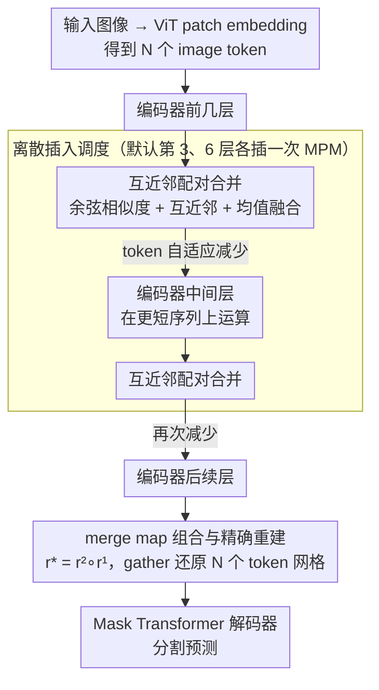

# MPM: Mutual Pair Merging for Efficient Vision Transformers

**会议**: CVPR 2026  
**arXiv**: [2604.05718](https://arxiv.org/abs/2604.05718)  
**代码**: 无  
**领域**: 分割  
**关键词**: Token合并, 语义分割, Vision Transformer, 推理加速, 无训练方法

## 一句话总结

提出 Mutual Pair Merging (MPM)，一个无参数、无训练的 ViT token 合并模块，通过互近邻配对+均值融合来减少序列长度，在 ADE20K 上 ViT-Tiny 的 Raspberry Pi 5 延迟降低 60%，H100 上 FlashAttention-2 下吞吐量提升 20%，mIoU 下降控制在 3% 以内。

## 研究背景与动机

1. **领域现状**：Vision Transformer 在语义分割中表现优秀，但自注意力的 $O(N^2)$ 复杂度使得推理成本随分辨率增加而快速上升。减少序列长度（token reduction）是加速的自然思路，已有方法包括 token 剪枝/选择（DynamicViT、EViT）和 token 聚合/合并（ToMe、ALGM）。

2. **现有痛点**：(a) 大多数 token reduction 工作针对分类任务，分割任务需要重建像素级对齐的稠密特征，对 token reduction 有更严格的约束；(b) 现有方法常报告 FLOPs 或理论加速比，但在现代加速器（如带 FlashAttention 的 GPU）上，合并操作的开销可能抵消甚至反转预期增益；(c) 许多方法需要微调或额外训练参数，阻碍即插即用部署。

3. **核心矛盾**：token reduction 在理论上减少了计算量，但 (a) 在分割中需要重建完整 token 序列给解码器，(b) 在优化过的 GPU 核心上，合并操作的额外开销可能抹平加速收益，(c) 变长序列需要 padding 影响批处理吞吐。

4. **本文目标** 设计一个真正能在端到端墙钟时间上提速的、无训练的分割专用 token 合并方法，并诚实地量化包含合并开销在内的实际延迟。

5. **切入角度**：用最简单的设计——互近邻配对+均值融合——来最小化开销，通过离散的插入位置选择（而非连续阈值/保留率）来控制速度-精度权衡，并保存合并映射做精确重建。

6. **核心 idea**：在特征空间中用余弦相似度找互近邻 token 对并平均合并，通过整数 merge map 实现 gather 式精确重建，使分割解码器无需任何修改。

## 方法详解

### 整体框架

输入图像经 ViT patch embedding 得到 $N$ 个 image tokens。MPM 模块被插入到 ViT 编码器的特定层之前（默认第 3 层和第 6 层，0-based index 2 和 5）。每次插入将 token 数量减少（最多减半但实际取决于数据），后续层在更少的 token 上运算。编码完成后，用保存的 merge map 通过 gather 操作恢复原始 $N$ 个 token 的序列，然后送入标准的 Mask Transformer 解码器做分割预测。

### 关键设计

**1. 互近邻配对合并：用对称条件杜绝合并冲突**

token 合并最棘手的问题是"谁该跟谁合"。如果只让每个 token 单向去找最像自己的邻居，会出现一个"热门" token 被好几个 token 同时抢着合并的冲突，ToMe 为此要做一次二部图匹配来仲裁，逻辑偏重。MPM 换了个更干净的判据：先把所有 image token 做 L2 归一化，算出稠密余弦相似度矩阵 $S = \tilde{X}\tilde{X}^\top$；对每个 token $i$ 取它的最相似邻居 $b(i) = \arg\max_{j \neq i} S_{ij}$，但**只有当两个 token 互相把对方当成最近邻**（$b(i)=j$ 且 $b(j)=i$）时才允许配对合并，取较小索引当代表、特征取两者均值，落单的 token（没有互近邻）原样保留。

互近邻这个对称条件天然保证了配对的唯一性和确定性：一个 token 最多只会出现在一个互近邻对里，不存在抢夺，也就不需要任何匹配仲裁。整个过程没有可学习参数、不依赖随机性、也不用调阈值。它的另一个好处是压缩率**自适应**——理论上一轮最多消掉 50% 的 token，但现实里并非每个 token 都恰好有互近邻，所以实际减少量会随图像内容自然浮动，内容越均质合并越多，纹理越复杂合并越少。

**2. 多阶段 merge map 组合与精确重建：让解码器一无所知**

分割解码器（如 Mask Transformer）默认收到的是完整的 $\frac{H}{P} \times \frac{W}{P}$ 网格特征，token 一旦在编码阶段被合并、序列变短，解码器就对不上号了。MPM 的解决办法是把"怎么合的"完整记下来：每次 MPM 调用都返回一个整数映射向量 $r$，记录每个原始 token 指向哪个合并后的代表。当 MPM 被插入两次时，两段映射用一次索引复合就能串起来——

$$r^{(*)}(i) = r^{(2)}\big(r^{(1)}(i)\big)$$

编码全部结束后，只需一步 gather $Z_{\text{img}}^{\uparrow}[i] = Z_{\text{img}}[r^{(*)}(i)]$ 就能把短序列还原成原始 $N$ 个 token 的完整网格。这是纯复制操作（被合并掉的 token 拿回它代表的那份特征），既保持了原始的光栅扫描顺序，又完全不动解码器一行代码。举个直观的过程：1024 个 token 在第 3 层被合到约 800、第 6 层再合到约 650，编码都在更短的序列上跑；到解码前用复合后的 $r^{(*)}$ 一次 gather，650 个特征被"摊"回 1024 个槽位，解码器看到的还是规整的网格。正因为重建是事后查表而非反卷积，任意插入多少次 MPM 都不会破坏空间对齐。

**3. 离散插入调度：把速度-精度旋钮做成"无旋钮"**

绝大多数 token reduction 方法靠一个连续超参（保留率、相似度阈值）来调速度-精度权衡，而这种参数往往要跨数据集甚至跨场景重新校准。MPM 干脆取消了连续旋钮：压缩多少完全由互近邻的自然稀疏性决定，唯一能调的是**在哪几层插入 MPM**——默认在第 3 层和第 6 层（0-based 的 index 2 和 5）各插一次。插得越早，后续层省的计算越多、加速越大，但精度损失也越大；插得越晚则相反。这是一组离散的位置选择，而不是一个要细调的实数。

这种"无旋钮"设计在固定场景的在线部署里特别值钱：像安防摄像头这种 7×24 跑同一画面的场合，光照、天气、场景统计会随时间漂移，一个白天调好的阈值到夜里可能就不合适了，而 MPM 的合并行为是根据每帧实际内容现算的，自然跟着场景走。论文给出的对照很说明问题——同一画面白天和黑夜下，夜间因细节减少会少合并约 6% 的 token，整个适应过程不需要任何人为调参。

### 损失函数 / 训练策略

MPM 是完全无训练的模块，直接插入预训练好的 ViT 编码器即可使用，不引入任何可学习参数，也不需要微调。

## 实验关键数据

### 主实验（ADE20K，H100 无 FlashAttention）

| 模型 | 方法 | mIoU | GFLOPs | FPS (B=32) |
|------|------|------|--------|------------|
| Seg-T/16 | 无合并 | 38.1 | 25 | 660 |
| Seg-T/16 | ToMe | 38.1 | ~19 | 751 |
| Seg-T/16 | ALGM* | 38.9 | ~16.7 | 665 |
| Seg-T/16 | **MPM(2,5)** | 37.6 | ~17.6 | **831** |
| Seg-B/16 | 无合并 | 48.5 | 258 | 133 |
| Seg-B/16 | **MPM(2,5)** | 48.0 | ~184 | **177** |
| Seg-L/16 | 无合并 | 51.7 | 800 | 47 |
| Seg-L/16 | **MPM(2,5)** | 50.4 | ~496 | **74** |

### 跨平台延迟对比

| 平台 | ViT-T 原始 | MPM | 加速比 |
|------|-----------|-----|--------|
| Raspberry Pi 5 (B=1) | 1.06 FPS | 1.71 FPS | 1.61× |
| Raspberry Pi 5 (B=2) | 1.05 FPS | 1.75 FPS | 1.67× |
| H100 FA2 (B=32, ViT-L) | 375 FPS | 456 FPS | 1.22× |

### 消融实验（插入位置影响）

插入位置越早，压缩越多、加速越大、精度损失越大。默认的 (2,5) 在多个数据集和模型规模上提供了一致的 Pareto 最优权衡。

### 关键发现

- **实际墙钟增益与 FLOPs 减少不完全成正比**：在有 FlashAttention-2 的 H100 上，FLOPs 减少 38% 但 FPS 仅提升 22%（ViT-L），因为 FA2 本身极度优化了注意力计算
- **在 Raspberry Pi 5 上增益最大**：边缘设备缺乏并行化优化，token 数量的减少直接转化为延迟的线性下降
- **合并操作的局部性**：尽管 MPM 是全局配对（无局部约束），实际中大多数互近邻对发生在空间邻近的 patch 之间——方法自然发现了空间局部性
- **mIoU 下降控制良好**：最大模型 Seg-L/16 从 51.7 降到 50.4（-1.3），最小模型 Seg-T/16 从 38.1 降到 37.6（-0.5）
- **跨数据集一致**：在 ADE20K、Pascal Context、Cityscapes 上均保持合理的加速-精度权衡

## 亮点与洞察

- **诚实的效率评估**是这篇论文最大的亮点：很多 token reduction 工作只报告 FLOPs，本文在 Raspberry Pi 5 和 H100（有/无 FlashAttention-2）上测量包含合并开销的端到端延迟，并分离了 merge+reconstruction 时间。这为该方向设立了更高的评估标准
- **"无旋钮"设计哲学**值得借鉴：通过互近邻的自然稀疏性实现自适应压缩（不是每个 token 都找得到互近邻），避免了需要跨数据集调整的超参数。这对在线部署尤其有价值
- **简单即有效**：整个方法就是余弦相似度 + 互近邻 + 平均值 + gather，没有任何可学习参数，但在多个平台上实现了与更复杂方法（如需要训练的 CTS、ALGM）相当甚至更好的加速

## 局限与展望

- mIoU 下降虽然不大但始终存在，对精度要求极高的医疗分割等场景可能不适用
- 与 ALGM 等需微调的方法相比，MPM 在 mIoU 上通常略低（ALGM 有时甚至提升 mIoU），说明无训练方法在精度上有天花板
- 互近邻配对的 $O(N^2)$ 相似度计算本身有开销，虽然目前足够小但在超高分辨率下可能成为瓶颈
- 没有探索与其他加速技术（如知识蒸馏、量化）的结合
- 变长序列对批处理的影响分析不够深入——padding 策略可能影响实际吞吐

## 相关工作与启发

- **vs ToMe**：ToMe 使用二部图匹配 + 固定合并率，MPM 使用互近邻 + 自适应率。在分割任务上 MPM 的 FPS 通常更高（831 vs 751 on Seg-T/16），因为互近邻计算开销更低
- **vs ALGM**：ALGM 是分割专用的最强 baseline，使用局部→全局的两阶段合并策略且需训练。MPM 的 mIoU 略低但是完全无训练、更即插即用
- **vs CTS**：CTS 需要训练策略网络来决定 token 共享，虽然推理时也是固定策略，但对分布偏移不鲁棒。MPM 每帧都根据实际内容计算合并

## 评分

- 新颖性: ⭐⭐⭐ 核心思路（互近邻合并）非常简单，技术上的新颖度有限，但"无旋钮+分割重建"的设计定位有独特价值
- 实验充分度: ⭐⭐⭐⭐⭐ 三个分割数据集、四种模型规模、三个硬件平台（Pi5/H100/H100+FA2）、多种batch size的端到端延迟，在效率评估方面树立了标杆
- 写作质量: ⭐⭐⭐⭐ 方法描述精确，设计选择的动机解释清晰，对局限性的讨论坦诚
- 价值: ⭐⭐⭐⭐ 对 token reduction 在分割任务中的实际收益提供了清晰的量化证据，对边缘部署有实用价值

<!-- RELATED:START -->

## 相关论文

- [\[ICLR 2026\] Revisiting \[CLS\] and Patch Token Interaction in Vision Transformers](../../ICLR2026/segmentation/revisiting_cls_and_patch_token_interaction_in_vision_transformers.md)
- [\[NeurIPS 2025\] Vision Transformers with Self-Distilled Registers](../../NeurIPS2025/segmentation/vision_transformers_with_self-distilled_registers.md)
- [\[ICLR 2026\] Thicker and Quicker: A Jumbo Token for Fast Plain Vision Transformers](../../ICLR2026/segmentation/thicker_and_quicker_a_jumbo_token_for_fast_plain_vision_transformers.md)
- [\[ICCV 2025\] LeGrad: An Explainability Method for Vision Transformers via Feature Formation Sensitivity](../../ICCV2025/segmentation/legrad_an_explainability_method_for_vision_transformers_via_feature_formation_se.md)
- [\[CVPR 2025\] DA-VPT: Semantic-Guided Visual Prompt Tuning for Vision Transformers](../../CVPR2025/segmentation/da-vpt_semantic-guided_visual_prompt_tuning_for_vision_transformers.md)

<!-- RELATED:END -->
