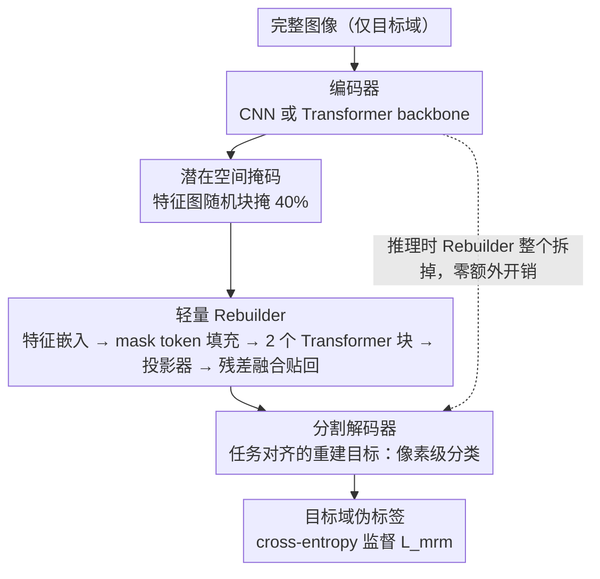

# Masked Representation Modeling for Domain-Adaptive Segmentation

**会议**: CVPR 2026  
**arXiv**: [2509.13801](https://arxiv.org/abs/2509.13801)  
**代码**: 无  
**领域**: 语义分割 / 域自适应 / 自监督学习  
**关键词**: 无监督域自适应, 掩码表示建模, 语义分割, 辅助任务, 特征重建  

## 一句话总结
提出在潜在空间而非输入空间做掩码建模的辅助任务MRM，通过轻量级Rebuilder模块对编码器特征做掩码-重建并用分割损失监督，在GTA→Cityscapes上为四种UDA基线平均带来+2.3 mIoU提升，推理时零额外开销。

## 背景与动机
无监督域自适应(UDA)语义分割需要将源域标注知识迁移到无标注目标域。对比学习等辅助自监督任务已被证明能提升特征判别性，但掩码图像建模(MIM, 如MAE)在UDA分割中几乎无人探索。核心原因有二：(1) MIM需要修改输入结构（遮掉patch只送可见部分），与DeepLab、DAFormer等分割架构不兼容；(2) MIM的像素级重建目标与分割的语义分类目标不一致，存在优化冲突。

## 核心问题
如何将掩码建模的优势（全局上下文理解、特征鲁棒性）引入UDA语义分割，同时解决架构兼容性和目标对齐两大问题？

## 方法详解

### 整体框架

MRM 想把掩码建模的好处（全局上下文、特征鲁棒性）引进 UDA 分割，又不踩 MAE 那两个坑（改输入结构、目标不对齐）。它是一个即插即用的辅助任务：完整图像过编码器得到特征 $f_t$，在**特征空间**里随机掩掉 40% 区域，由一个轻量 Rebuilder 把被掩部分重建出来，重建后的特征再送进原分割解码器做像素级分类、用伪标签监督。训练完 Rebuilder 直接拆掉，推理跟原模型一模一样、零额外开销。总损失为 $\mathcal{L} = \mathcal{L}_{sup} + \mathcal{L}_{uda} + \lambda \mathcal{L}_{mrm}$。

### 关键设计

**1. 在潜在空间而非输入空间做掩码：保证和任何分割架构兼容**

MAE 只把可见 patch 送进编码器，这一步就和 DeepLab、DAFormer 等分割架构的输入处理不兼容。MRM 反过来——编码器照常吃完整图像，掩码只发生在编码器输出的特征图上做随机块掩码。这样无论 backbone 是 CNN 还是 Transformer 都不用改输入结构，掩码建模才第一次能"挂"进现成的 UDA 流程。

**2. 轻量 Rebuilder：小到训练完能整个拆掉**

Rebuilder 刻意做得很轻：特征嵌入（线性变换 + 空间插值到 16×16×512）→ 掩码/填充（可学习 mask token 替代被掩区域）→ 仅 2 个 Transformer 块 → 投影器（转置卷积恢复原分辨率）。重建只替换被掩区域，用残差融合 $f_r = M_s \odot f_o + (1-M_s) \odot f_t$ 把重建结果贴回去。它训练时和主网络联合优化、推理时完全移除，所以掩码率取 40%（低于 MAE 的 75%）——容量小，掩太狠语义会不可逆丢失。

**3. 任务对齐的重建目标：重建后做分类而不是回像素**

MAE 重建的是原始像素值，这个回归目标和分割的语义分类目标存在优化冲突。MRM 把重建后的特征直接送分割解码器做像素级分类（cross-entropy + 伪标签），让辅助任务的目标和主任务完全一致。消融把这点坐实了：像素级回归反而 −0.3 mIoU，而分类目标带来 +3.8 mIoU——目标对齐与否几乎决定了这个辅助任务有用还是有害。

### 损失函数 / 训练策略

MRM 损失为目标域伪标签的 cross-entropy 分类损失，权重 $\lambda=1.0$。关键是**只在目标域图像上**用 MRM（源域上反而有害——会把特征往源域分布拉）。另一条经验是 MRM 必须同时训练编码器和解码器才有最佳效果，冻结任一者增益都会下降。

## 实验关键数据

| 基线方法 | GTA→CS (baseline) | GTA→CS (+MRM) | 提升 | Synthia→CS (+MRM) | 提升 |
|--------|------|------|------|------|------|
| DACS | 52.1 | 55.9 | +3.8 | 55.8 | +7.5 |
| DAFormer | 68.3 | 70.3 | +2.0 | 62.6 | +1.7 |
| HRDA | 73.8 | 75.4 | +1.6 | 67.1 | +1.3 |
| MIC | 75.9 | **77.5** | +1.6 | 68.1 | +0.8 |

MIC+MRM达到77.5 mIoU，超越当时所有SOTA方法（QuadMix 76.1、GANDA 74.5）。

### 消融实验要点
- **掩码率40%最优**：低于MAE的75%，因为MRM的Rebuilder容量更小，过高掩码率使语义信息丧失不可逆
- **仅掩码无重建有害(-0.2)**：说明特征空间的掩码造成不可逆语义丢失，重建过程是关键
- **重建目标对比**：像素回归(-0.3) < 教师特征重建(+1.4/+1.6) < **像素分类(+3.8)**，辅助任务必须与主任务目标对齐
- **应用域选择**：仅目标域(+3.8) > 源+目标域(+3.1) > 仅源域(+0.8)，MRM的本质是目标域自适应正则化
- **跨架构泛化**：ResNet50/101、MiT-B2/B3、DeepLabV2/V3+均有效，增益+2.1~+4.6

## 亮点
- **极致简洁**：一个公式说清楚核心设计（潜在空间掩码+分类重建），且完全即插即用，推理零开销
- MRM通过information bottleneck视角的分析很有说服力：掩码相当于结构化噪声注入，减少$I(Z;X)$同时保留$I(Z;Y)$
- 发现"像素重建目标对分割任务有害"这一反直觉结论对社区有参考价值
- 仅在目标域应用MRM才有效，揭示了辅助任务在UDA中的正确使用方式

## 局限与展望
- Rebuilder容量有限（仅2个Transformer块），扩大容量时训练不稳定
- 仅验证了UDA设置，能否推广到domain generalization、source-free UDA等更广泛设置未知
- 掩码策略较简单（均匀随机），语义引导的掩码可能带来更大增益
- 仅适用于像素级分类任务，深度估计、全景分割等需要进一步研究

## 与相关工作的对比
- **vs MAE/MIM**：MAE在输入空间掩码并重建像素，与分割架构不兼容且目标不对齐。MRM在特征空间掩码并用分类目标重建，完美兼容且效果更好
- **vs 对比学习辅助任务（SePiCo, PiPa）**：对比学习只增强编码器特征，MRM同时训练编码器和解码器，提供更全面的正则化
- **vs MIC**：MIC在图像空间做掩码一致性（类似高比例CutOut），MRM在特征空间做掩码重建，两者正交互补——MIC+MRM达到77.5 mIoU

## 启发与关联
- "将复杂的自监督任务在潜在空间而非输入空间执行"这一思路可以推广到其他视觉任务——比如视频理解中的时序掩码建模
- 辅助任务的目标必须与主任务对齐——这对设计新的预训练或微调策略有指导意义
- 可以考虑将MRM与知识蒸馏结合，用教师模型的特征作为重建目标的增强

## 评分
- 新颖性: ⭐⭐⭐⭐ 核心思想（特征空间掩码+分类重建）简洁但有效，虽然组件不全新，组合方式巧妙
- 实验充分度: ⭐⭐⭐⭐⭐ 四种基线×两个基准、详尽消融、多架构泛化验证、理论分析，非常完整
- 写作质量: ⭐⭐⭐⭐⭐ 结构清晰，motivation和设计选择的逻辑链非常连贯
- 价值: ⭐⭐⭐⭐ 作为即插即用模块，对UDA分割社区有直接实用价值

<!-- RELATED:START -->

## 相关论文

- [\[CVPR 2026\] SARMAE: Masked Autoencoder for SAR Representation Learning](sarmae_masked_autoencoder_for_sar_representation_learning.md)
- [\[CVPR 2026\] Seeing Beyond: Extrapolative Domain Adaptive Panoramic Segmentation](seeing_beyond_extrapolative_domain_adaptive_panoramic_segmentation.md)
- [\[CVPR 2026\] Heuristic Self-Paced Learning for Domain Adaptive Semantic Segmentation under Adverse Conditions](heuristic_self-paced_learning_for_domain_adaptive_semantic_segmentation_under_ad.md)
- [\[CVPR 2026\] Mixture of Prototypes for Test-time Adaptive Segmentation](mixture_of_prototypes_for_test-time_adaptive_segmentation.md)
- [\[CVPR 2026\] Structure-Aware Representation Distillation for Tiny-Dense Object Segmentation](structure-aware_representation_distillation_for_tiny-dense_object_segmentation.md)

<!-- RELATED:END -->
