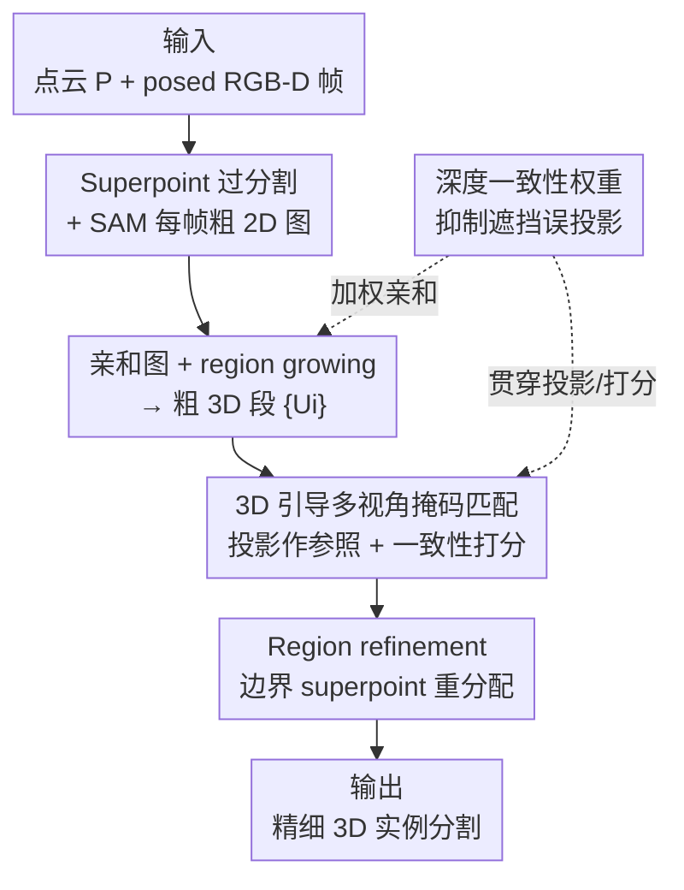

# MV3DIS: Multi-View Mask Matching via 3D Guides for Zero-Shot 3D Instance Segmentation

**会议**: CVPR 2026  
**论文**: [CVF Open Access](https://openaccess.thecvf.com/content/CVPR2026/html/Zhao_MV3DIS_Multi-View_Mask_Matching_via_3D_Guides_for_Zero-Shot_3D_CVPR_2026_paper.html)  
**代码**: https://github.com/zybjn/MV3DIS  
**领域**: 3D视觉 / 实例分割  
**关键词**: 零样本3D实例分割, 多视角一致性, SAM, 掩码匹配, 深度一致性

## 一句话总结
MV3DIS 把"粗 3D 分割块的投影"当作跨视角的公共参照来匹配并筛选 SAM 产生的 2D 掩码，再用一致的 2D 掩码反过来精修 3D 实例，从而在不依赖视频跟踪、不需要任何 3D 标注的前提下，把零样本 3D 实例分割的 mAP 在 ScanNetV2 上推到 38.5（超过前 SOTA 4.5）。

## 研究背景与动机
**领域现状**：传统 3D 实例分割（Mask3D 等）依赖大量人工标注的 3D 数据做有监督训练，在闭集上效果好但泛化差、标注昂贵。借着 SAM 这类 2D 视觉基础模型的零样本分割能力，近期一类方法（SAM3D、SAI3D、Open3DIS 等）改走"无训练"路线：用 SAM 对每帧出 2D 掩码，再把这些掩码当作引导，把 3D 几何基元（superpoint）合并成实例级片段，实现零样本 3D 实例分割。

**现有痛点**：这些方法几乎都**逐帧独立处理**，且只依赖 2D 指标（如 SAM 的 prediction IoU score）来决定每帧的分割图。这带来两个连锁问题：① 同一个 3D 物体在不同视角下被切成不一致的 2D 掩码——某一帧里破碎的小掩码可能在合并成单张分割图时覆盖掉完整物体掩码；② 这种跨视角的 2D 不一致直接传导到 3D，把一个物体在三维里切成好几块（over-segmentation / 碎片化）。SAM2Object 试图用 SAM2 的视频跟踪能力来强化视角一致性，但跟踪方法怕运动模糊、会误差累积，而且只能处理连续视频、对稀疏多视角数据集束手无策。

**核心矛盾**：根因在于现有方法**在 2D 空间里判断一致性**，却忽略了天然存在的 3D 先验。同一物体在各视角下的 2D 掩码本应共享同一块 3D 几何，但纯 2D 指标看不到这层约束，所以无法把"哪几张掩码其实是同一个物体"关联起来。

**本文目标**：(a) 在不引入 3D 标注、不依赖视频时序的前提下，让跨视角的 2D 掩码对同一物体保持一致；(b) 在 2D→3D 投影中抑制遮挡造成的错误对应。

**切入角度**：作者的观察是——粗粒度的 3D 分割块本身就是一个**视角无关的公共参照系**。把粗 3D 段投影到每一帧，就能用"哪些 2D 掩码覆盖了同一块 3D 几何"来判断它们是不是同一物体，从而绕开纯 2D 指标。

**核心 idea**：用"粗 3D 段的投影"作为跨视角公共参照来匹配 2D 掩码，并用 3D 覆盖分布度量它们的一致性（coarse-to-fine：粗分割→3D 引导匹配筛掩码→精修 3D 实例）。

## 方法详解
### 整体框架
输入是一帧序列的 posed RGB-D（图像 $I_t$、深度 $D_t$、内参 $K_t$、外参 $E_t$）外加场景点云 $P\in\mathbb{R}^{N_p\times3}$，输出是场景内所有前景物体的 3D 实例掩码。整个流程是 coarse-to-fine 两阶段：

**(a) 粗 3D 实例分割**：先用 graph-cut 把点云过分割成 superpoint $\{S_i\}$（几何相近的小块点，数量远小于原始点，既提效率又注入几何先验）；再用 Grounding-DINO + SAM 对每帧出 2D 掩码，经 NMS（按 SAM 的 IoU score）去冗余后合并成每帧一张粗分割图 $\{L^C_t\}$；最后基于这些 2D 图构建 superpoint 间的亲和图并用 region growing 合并成粗 3D 段 $\{U_i\}$。

**(b) 3D 实例精修**：把每个粗 3D 段投影到各帧，做 **3D 引导掩码匹配**，关联出跨视角一致的 2D 掩码、生成精修分割图 $\{L^R_t\}$；再用这些一致掩码重算亲和度，做 **region refinement** 把边界 superpoint 重分配到最一致的实例上。贯穿两阶段的还有一个 **深度一致性权重**，用来压制遮挡点带来的投影歧义。

### 关键设计

**1. 3D 引导多视角掩码匹配：把粗 3D 段当跨视角公共参照来对齐 2D 掩码**

这是全文核心，直接针对"逐帧独立、纯 2D 指标 → 跨视角不一致"的痛点。先把点云用针孔相机模型投到第 $t$ 帧：齐次点 $p=(x,y,z,1)^\top$ 的相机坐标 $p_c=E_t p$，像素位置 $(u,v)=(\tilde u/\tilde w,\tilde v/\tilde w)$。一个点是否可见由二值指示器决定：

$$I_{vis}(p,I_t)=\mathbb{1}(0\le u<W \wedge 0\le v<H)\cdot\mathbb{1}(|z_c-d|<\alpha d)$$

其中 $d$ 是该像素的实测深度，$\alpha=0.05$ 是相对容差。把每个粗 3D 段 $U_i$ 投到各帧后，用两个可见度比率挑候选掩码：帧可见度 $V^f_{i,t}$（$U_i$ 在第 $t$ 帧可见投影点占总点数的比例）和掩码可见度 $V^m_{i,t,j}$（落在掩码 $m_{t,j}$ 内的可见点占该帧可见点的比例），候选集为

$$G_i=\{(t,j)\mid V^f_{i,t}>\tau_f \text{ and } V^m_{i,t,j}>\tau_m\},\quad \tau_f=0.3,\ \tau_m=0.9$$

关键一步是怎么判断候选里哪些掩码"真的是同一物体"。作者定义 **3D 覆盖分布**：对每个候选掩码 $m_{t,j}$ 构造一个覆盖向量 $v_{t,j}\in\mathbb{R}^{N_u}$，第 $k$ 维 $v^k_{t,j}=\bar w^d_{k,t,j}\cdot V^m_{k,t,j}$，记录"第 $k$ 个粗 3D 段在这张掩码里占了多少（且按深度可靠度加权）"。同一物体的掩码应当覆盖相似的 3D 段，于是掩码一致性分用余弦相似度衡量：

$$s_{i,t,j}=\frac{1}{|G_i|-1}\sum_{(t',j')\in G_i\setminus\{(t,j)\}}\frac{v_{t,j}\cdot v_{t',j'}}{\lVert v_{t,j}\rVert\lVert v_{t',j'}\rVert}$$

最后按一致性分做 NMS，抑掉不一致的掩码，每帧合并成精修分割图 $\{L^R_t\}$。妙在它**完全靠 3D 几何（覆盖分布）来强制视角一致，不碰视频跟踪、不依赖相邻帧时序**，因此对稀疏多视角数据集也适用——这正是 SAM2Object 那类跟踪方法做不到的。

**2. 深度一致性权重：把"踩着阈值边缘的遮挡点"软性降权，而不是硬切**

可见性指示器 $I_{vis}$ 用一个硬阈值 $|z_c-d|<\alpha d$ 过滤深度差太大的点，但**贴着阈值的遮挡点仍会被误判为可见**（如把隔断、桌子的点错投到显示器/椅子掩码上），污染后续匹配和亲和度。作者给每个点一个连续的深度一致性权重：

$$w^d_p=1-\frac{|z_c-d|}{\alpha d}$$

深度差越大权重越低，近阈值点的影响被平滑压低而非一刀切。这个点级权重会聚合成段级权重，既参与掩码匹配里覆盖向量的加权 $\bar w^d_{k,t,j}$（公式 4，对落入掩码的可见点取平均深度一致性），也参与粗阶段亲和度的加权 $\bar w^d_{i,t}$（公式 7）。相比只用二值可见性，连续权重让"可靠投影多发言、可疑投影少发言"，从而提升 3D→2D 对应的鲁棒性。

**3. Region refinement：用精修后的一致掩码纠正 region growing 的边界误分配**

粗阶段的 region growing 有个结构性毛病：superpoint 被分给"第一个达到合并阈值 $\tau_{merge}$ 的区域"，而非"亲和度最高的区域"。这种贪心在**边界 superpoint** 上最容易出错，且误差会累积、损害最终实例。精修阶段用从一致掩码 $\{L^R_t\}$ 重算的亲和度来纠偏：对每个边界 superpoint，允许它在相邻区域间调整、重分配到亲和度最高的那个区域，迭代到收敛或触发停止条件。这一步专门修"固定阈值合并"留下的系统性边界错误，是消融里第一块贡献（+2.2 mAP）。

> 三块设计正好对应作者消融里的 RR / 3DG-MM / DCW 三个组件；粗阶段的亲和图构建与 region growing 是承接它们的脚手架：亲和度 $A^t_{i,j}$ 取 superpoint 在 2D 分割图上标签直方图的余弦相似度（公式 6），跨帧用边权 $\varphi_{i,j,t}=\bar w^d_{i,t}\bar w^d_{j,t}\bar w^v_{i,t}\bar w^v_{j,t}$ 加权汇总（公式 8-9），其中 $\bar w^v$ 是可见度权重。

### 损失函数 / 训练策略
本方法**完全无训练**：不优化任何参数，全靠现成的 graph-cut、Grounded-SAM / SAM2 与几何投影规则。关键超参为深度容差 $\alpha=0.05$、候选阈值 $\tau_f=0.3$ / $\tau_m=0.9$、合并阈值 $\tau_{merge}=0.5$；视角采样率因数据集而异（ScanNetV2/200 用 10%，ScanNet++ 用 5%）。

## 实验关键数据

### 主实验
ScanNetV2、ScanNet200、ScanNet++ 三个数据集上的类无关（class-agnostic）3D 实例分割：

| 数据集 | 指标 | 本文 (Ours) | 之前 SOTA | 提升 |
|--------|------|------|----------|------|
| ScanNetV2 | mAP / AP50 / AP25 | 38.5 / 60.2 / 76.2 | SAM2Object 34.0 / 52.7 / 70.3 | +4.5 / +7.5 / +5.9 |
| ScanNet200 | AP50 / AP25 | 54.7 / 69.7 | SGS-3D 51.3 / 64.6 | +3.4 / +5.1 |
| ScanNet++ | mAP / AP50 / AP25 | 22.0 / 36.7 / 51.7 | SAM2Object 20.2 / 34.1 / 48.7 | +1.8 / +2.6 / +3.0 |

值得注意的是，在 ScanNet200 上 MV3DIS 的 54.7 AP50 / 69.7 AP25 甚至**超过了在 ScanNet200 上全监督训练的 Mask3D**（51.2 / 57.1）；而在更难的 ScanNet++ 上，仅在 ScanNetV2 训练的 Mask3D（9.9 mAP）反而不如多个零样本方法，说明有监督方法换域后泛化差。

语义实例分割（ScanNet200，借 OpenMask3D 的标签分配）：单标签 mAP 15.5、多标签 mAP 20.5，分别超 SAM2Object / Open3DIS 2.2 / 2.3；尾类（Tail）AP 达 18.9，比 OpenMask3D 高 4.0，显示对稀有类更好的泛化。

### 消融实验
| 配置 (RR / 3DG-MM / DCW) | mAP | AP50 | AP25 | 说明 |
|------|------|------|------|------|
| baseline（仅粗分割） | 33.3 | 51.3 | 70.1 | 起点 |
| + RR | 35.5 | 53.2 | 72.1 | 区域精修纠正边界误分配 +2.2 |
| + RR + 3DG-MM | 37.0 | 57.6 | 74.2 | 加掩码匹配，一致性更高 +1.5 |
| + RR + 3DG-MM + DCW（Full） | 38.5 | 60.2 | 76.2 | 加深度权重 +1.5，全套 +5.2 |

超参敏感性（ScanNetV2）：

| 超参 | 取值 → mAP | 最优 |
|------|-----------|------|
| 深度容差 $\alpha$ | 0.01→37.4 / 0.05→38.5 / 0.10→37.9 / 0.20→36.0 | 0.05 |
| 合并阈值 $\tau_{merge}$ | 0.3→33.4 / 0.5→38.5 / 0.6→38.0 / 0.9→31.7 | 0.5 |

### 关键发现
- 三个组件贡献相当（+2.2 / +1.5 / +1.5），其中 3DG-MM 对 AP50 拉动最猛（53.2→57.6），印证"提升多视角一致性 → 更准的亲和度 → 更准的 3D 分割"这条因果链。
- $\alpha$ 和 $\tau_{merge}$ 都呈"先升后降"：$\alpha$ 太小丢弃过多有效投影点、太大引入遮挡点污染亲和度；$\tau_{merge}$ 太低过度合并欠分割、太高合并不足过分割。
- 稀疏视角下尤其稳：随采样视角从 1%→20% 性能稳步上升并持续压过 SAI3D / SAM3D；**仅用 2% 视角就超过用 20% 视角的 SAI3D**，而 SAM3D 的相邻帧合并策略在超过 5% 后就难以再聚合信息。
- 定性上能切出比 GT 更细的粒度（把网口、电源插座从墙面分出来，而 GT 把它们并进墙里）。

## 亮点与洞察
- **"3D 段投影当公共参照"是个干净的去跟踪方案**：以往强一致性要么靠视频跟踪（怕模糊、限连续视频），MV3DIS 直接用几何覆盖分布做跨视角关联，既适配稀疏视角又无误差累积——这个"用 3D 几何替代时序"的思路可迁移到任何"2D 基础模型 lift 到 3D"的任务（如开放词表 3D 检测、3D 场景图）。
- **连续深度权重 vs 二值可见性**：把硬阈值遮挡判断软化成 $w^d_p=1-|z_c-d|/(\alpha d)$，让近阈值的可疑点"少发言而非被一刀切"，是个简单但通用的投影鲁棒化 trick，可直接搬到任意 3D→2D 投影聚合里。
- **覆盖向量 + 余弦相似度做掩码一致性打分**很优雅：把"是否同一物体"转化为"是否覆盖相似的 3D 段集合"，避免了任何外观/特征相似度，纯几何即可。
- 全程无训练却能在 ScanNet200 反超全监督 Mask3D，是对"基础模型零样本 + 强几何先验"路线的一次有力背书。

## 局限与展望
- 强依赖 SAM/Grounded-SAM/SAM2 的 2D 掩码质量与几何过分割（graph-cut superpoint）质量，若 2D 掩码本身崩了，3D 引导匹配也救不回来。
- region refinement 的"停止条件"、合并里结合欧氏距离与点数的加权细节都放在 supplementary，正文不完整，复现需查附录（⚠️ 部分算法细节以原文/附录为准）。
- 多个阈值（$\alpha,\tau_f,\tau_m,\tau_{merge}$）需按数据集调，跨域迁移时鲁棒性存疑；超参分析也只在 ScanNetV2 做。
- 只验证室内 RGB-D 场景（ScanNet 系/Replica/Matterport3D），室外、动态场景、无深度（纯 RGB 多视角）下是否成立未知。
- 复杂度方面，需把每个粗 3D 段投影到所有候选帧并两两算覆盖向量余弦，帧数/段数大时计算量值得关注，论文未给运行时分析。

## 相关工作与启发
- **vs SAM3D / SAI3D / Open3DIS**：它们逐帧独立、靠 2D 的 SAM score 决定分割图，忽略 3D 先验 → 跨视角不一致、3D 碎片化；本文用粗 3D 段投影做公共参照强制一致性，ScanNetV2 上 mAP 38.5 显著高于 Open3DIS 的 31.5。
- **vs SAM2Object**：它靠 SAM2 视频跟踪做一致性，受运动模糊/误差累积影响且只能处理连续视频；本文靠几何覆盖分布、不依赖时序，稀疏视角也成立，三项指标各高 4.5/7.5/5.9。
- **vs Mask3D（全监督）**：Mask3D 闭集强但靠 3D 标注、换域泛化差（ScanNet++ 上只有 9.9 mAP）；本文零样本无训练，在 ScanNet200 AP50 反超 Mask3D。
- **vs OpenMask3D（开放词表语义）**：它用 Mask3D 出类无关掩码再配 CLIP；本文类无关掩码质量更高，尾类 AP 18.9 高出 4.0，说明上游掩码质量对开放词表识别影响很大。

## 评分
- 新颖性: ⭐⭐⭐⭐ "3D 段投影作公共参照 + 覆盖分布一致性打分"是干净且有效的去跟踪新机制，但仍属"SAM lift 到 3D"成熟范式内的改进。
- 实验充分度: ⭐⭐⭐⭐⭐ 5 数据集、类无关+语义两套设置、完整三组件消融与双超参敏感性、视角稀疏度分析，覆盖很全。
- 写作质量: ⭐⭐⭐⭐ 逻辑清晰、公式完整、图示到位，唯部分合并/精修算法细节甩到附录。
- 价值: ⭐⭐⭐⭐ 无训练即超全监督 Mask3D，方法可迁移到其他 2D→3D lifting 任务，且已开源，实用价值高。

<!-- RELATED:START -->

## 相关论文

- [\[CVPR 2026\] Universal 3D Shape Matching via Coarse-to-Fine Language Guidance](universal_3d_shape_matching_via_coarse-to-fine_language_guidance.md)
- [\[CVPR 2026\] Cross-Domain Few-Shot Segmentation via Multi-view Progressive Adaptation](cross-domain_few-shot_segmentation_via_multi-view_progressive_adaptation.md)
- [\[CVPR 2026\] CompetitorFormer: Mitigating Query Conflicts for 3D Instance Segmentation via Competitive Strategy](competitorformer_mitigating_query_conflicts_for_3d_instance_segmentation_via_com.md)
- [\[CVPR 2026\] DSS: Discover, Segment, and Select for Zero-shot Camouflaged Object Segmentation](discover_segment_and_select_a_progressive_mechanism_for_zero-shot_camouflaged_ob.md)
- [\[CVPR 2026\] Unsupervised Multi-Scale Segmentation of 3D Subcellular World with Stable Diffusion Foundation Model](unsupervised_multi-scale_segmentation_of_3d_subcellular_world_with_stable_diffus.md)

<!-- RELATED:END -->
