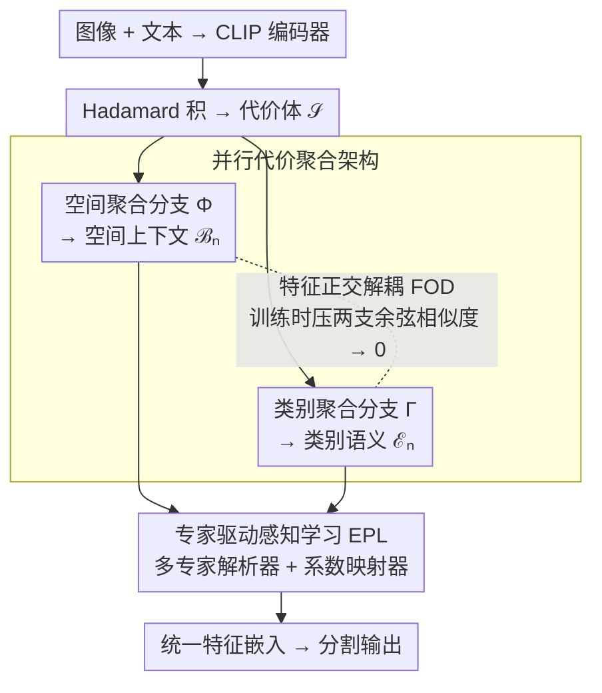

# PCA-Seg: Revisiting Cost Aggregation for Open-Vocabulary Semantic and Part Segmentation

**会议**: CVPR 2026  
**arXiv**: [2603.17520](https://arxiv.org/abs/2603.17520)  
**代码**: [https://github.com/NUST-Machine-Intelligence-Laboratory/PCA-Seg](https://github.com/NUST-Machine-Intelligence-Laboratory/PCA-Seg)  
**领域**: 语义分割 / 开放词汇分割  
**关键词**: 开放词汇分割, 代价聚合, 并行架构, 专家驱动学习, 特征正交解耦

## 一句话总结

PCA-Seg 提出并行代价聚合(Parallel Cost Aggregation)范式替代传统的串行空间-类别聚合架构，通过专家驱动感知学习(EPL)模块高效整合语义和空间上下文流，并用特征正交解耦(FOD)策略消除两种知识流的冗余，每个并行块仅增加 0.35M 参数即在 8 个开放词汇语义和部件分割基准上达到 SOTA。

## 研究背景与动机

1. **领域现状**：开放词汇语义和部件分割(OSPS)借助 CLIP 等视觉语言模型的强大图文对齐能力实现任意类别分割。主流方法（如 CAT-Seg、DeCLIP、PartCATSeg）从代价体(cost volume)中提取图文对齐线索。
2. **现有痛点**：现有方法采用串行架构——先空间聚合再类别聚合（或反之），这导致类别级语义和空间上下文之间产生知识干扰。例如，空间聚合可能扭曲卡车类别的语义，后续类别聚合进一步放大偏差，导致误分类。
3. **核心矛盾**：串行架构的级联行为使一种信息的聚合会触发另一种信息聚合的连锁反应，两种知识不可避免地互相污染。
4. **本文目标**：设计并行架构使两种聚合独立操作，同时解决如何高效整合独立的知识流的挑战。
5. **切入角度**：观察到简单并行（单卷积同时捕获两种信息）效果反而下降 0.2%，说明需要精心设计的整合机制。
6. **核心 idea**：并行聚合 + 多专家解析器多视角融合 + 正交化解耦消除冗余。

## 方法详解

### 整体框架

这篇论文要解决的是开放词汇分割里代价聚合的一个老问题：以 CAT-Seg 为代表的方法把"空间聚合"和"类别聚合"串成一条流水线，先做完一种再做另一种，结果两种信息会互相污染。PCA-Seg 的做法是把这条串行流水线拆成两条并行支路，再想办法把两支的知识干净地合回来。

整体流程是：图像和文本先过 CLIP 编码器，两者做 Hadamard 积得到代价体 $\mathcal{S}$；代价体同时喂给空间聚合分支和类别聚合分支，分别得到空间上下文特征 $\mathcal{B}_n$ 和类别语义特征 $\mathcal{E}_n$；接着由 EPL 模块把两支的互补知识解析并融合成统一表示，同时 FOD 损失在训练时把两支约束成正交，确保它们提供的是真正不同维度的信息，而不是互相重叠的冗余。

### 关键设计

**1. 并行代价聚合架构：把串行流水线拆成两条独立支路**

串行架构的麻烦在于级联效应——先做空间聚合时已经把卡车这类目标的语义结构扭曲了一点，后面的类别聚合接着在被扭曲的特征上继续放大偏差，两种知识在传递链上不可避免地互相污染。PCA-Seg 把更新规则从串行的 $\mathcal{V}_{n+1} = \Gamma_n(\Phi_n(\mathcal{V}_n))$ 改成并行的两条：

$$\mathcal{B}_n = \Phi_n(\mathcal{V}_n), \quad \mathcal{E}_n = \Gamma_n(\mathcal{V}_n)$$

其中 $\Phi_n$ 是空间聚合、$\Gamma_n$ 是类别聚合，两者都直接读同一份输入 $\mathcal{V}_n$、互不依赖，融合的活全部交给后面的 EPL。这样空间聚合不会先一步弄脏类别语义，类别聚合也不会反过来干扰空间结构。代价也很小：每个并行块只多 0.35M 参数和 0.96G 显存（串行块本身约 0.33M），几乎是"免费"换来的解耦。

**2. 专家驱动感知学习（EPL）：把两条支路的互补知识高效合回来**

拆成并行后，新问题是怎么把两支合起来——作者发现最朴素的做法（一个卷积同时吃两种信息）反而比串行还差 0.2%，说明融合不能糊弄。EPL 用两个组件来做这件事。一是多专家解析器（ME-Parser），它不是一次性融合，而是用多组权重从两条流里各取一个视角的互补特征，每个"专家"盯着不同侧面，避免单次融合把两支的互补性平均掉。二是系数映射器（Co-Mapper），它把语义和空间特征降维后学习出一张逐像素的自适应权重图，用来强调专家解析结果中真正关键的区域，最后把多专家的结果加权汇成一份统一、鲁棒的特征嵌入。多视角解析加上像素级自适应加权，正是简单单卷积融合所缺的——这也是并行架构能反超串行的关键。

**3. 特征正交解耦（FOD）：从源头逼两条流提供不同的知识**

即便有了 EPL，如果两条支路学到的东西高度重叠，多专家解析也榨不出多少额外信息。FOD 的想法是直接在知识源头上动手：类别语义和空间上下文本就该是两个独立维度，那就用一个正交化解耦损失把两支表示的余弦相似度往零压，强制它们正交。两支越正交，意味着各自携带的信息越不冗余、互补性越强，EPL 能从中解析出的多样化知识也越多。消融里 FOD 单独带来 +0.9% 的提升，正说明"减少冗余"对学到多样化表示是实打实有用的，而不只是锦上添花。

### 损失函数 / 训练策略

标准分割交叉熵损失 + FOD 正交化损失。遵循 CAT-Seg / PartCATSeg 的训练协议。

## 实验关键数据

### 主实验

| 数据集 | 指标 (mIoU↑) | 之前 SOTA | PCA-Seg | 提升 |
|--------|-------------|----------|---------|------|
| A-150 (语义) | mIoU | 14.9 (DeCLIP) | 15.6 | +0.7 |
| PAS-20b (语义) | mIoU | 81.3 (H-CLIP) | 82.4 | +1.1 |
| ADE-Part-234 (O) | mIoU | 24.1 (PartCATSeg) | 25.3 | +1.2 |
| Pascal-Part-116 (H) | hIoU | 43.8 (PartCATSeg) | 45.1 | +1.3 |

在语义分割和部件分割的 8 个基准上均达到 SOTA。

### 消融实验

| 配置 | mIoU (A-150) | 说明 |
|------|-------------|------|
| 串行基线 (CAT-Seg) | 14.9 | 原始串行架构 |
| 并行基线 (单卷积) | 14.7 | 简单并行反而下降 |
| +EPL | 15.3 | 多专家融合提升 |
| +FOD | 15.6 | 正交化进一步提升 +0.9% |

### 关键发现

- 简单并行不如串行（-0.2%），必须有 EPL 才能发挥并行优势
- FOD 在 A-150 上提升 0.9%，说明减少冗余对学习多样化知识至关重要
- 参数效率极高：每个并行块仅增加 0.35M 参数（vs 串行块 0.33M）
- 在部件分割上提升更大，可能因为部件级需要更精细的空间-语义解耦

## 亮点与洞察

- **知识干扰的发现**：清晰地指出串行架构中空间和类别聚合的级联干扰问题，可视化证据充分
- **正交化的妙用**：用正交约束确保两种信息流的独立性，简单有效
- **极低参数开销**：每个块仅增加 0.35M 参数，几乎"免费"获得性能提升

## 局限与展望

- 仍基于 CLIP 的 ViT 注意力层微调，受限于 CLIP 的视觉表示能力
- 正交化是硬约束，某些场景下类别和空间信息可能确实需要交互
- 未在 3D 分割或视频分割上验证
- 未来可探索更灵活的知识流交互方式

## 相关工作与启发

- **vs CAT-Seg/DeCLIP**: 它们用串行聚合，PCA-Seg 用并行聚合消除干扰
- **vs PartCATSeg**: PCA-Seg 的并行设计在部件分割上优势更明显
- **vs H-CLIP**: H-CLIP 在双曲空间操作，PCA-Seg 在欧式空间用正交化实现类似的表示解耦

## 评分

- 新颖性: ⭐⭐⭐⭐ 并行聚合替代串行是有见地的设计改进
- 实验充分度: ⭐⭐⭐⭐⭐ 8 个基准的全面评测
- 写作质量: ⭐⭐⭐⭐ 动机分析充分，可视化清晰
- 价值: ⭐⭐⭐⭐ 对开放词汇分割的代价聚合范式有指导意义

<!-- RELATED:START -->

## 相关论文

- [\[CVPR 2025\] Fine-Grained Image-Text Correspondence with Cost Aggregation for Open-Vocabulary Part Segmentation](../../CVPR2025/segmentation/fine-grained_image-text_correspondence_with_cost_aggregation_for_open-vocabulary.md)
- [\[CVPR 2026\] SPAR: Single-Pass Any-Resolution ViT for Open-Vocabulary Segmentation](spar_single-pass_any-resolution_vit_for_open-vocabulary_segmentation.md)
- [\[CVPR 2026\] Semantic Alignment in Hyperbolic Space for Open-Vocabulary Semantic Segmentation](semantic_alignment_in_hyperbolic_space_for_open-vocabulary_semantic_segmentation.md)
- [\[CVPR 2026\] HOPS: Hierarchical Open-vocabulary Part Segmentation with Attention-Aware Filtering and Affinity-Guided Enhancement](hops_hierarchical_open-vocabulary_part_segmentation_with_attention-aware_filteri.md)
- [\[CVPR 2026\] Test-Time Multi-Prompt Adaptation for Open-Vocabulary Remote Sensing Image Segmentation](test-time_multi-prompt_adaptation_for_open-vocabulary_remote_sensing_image_segme.md)

<!-- RELATED:END -->
