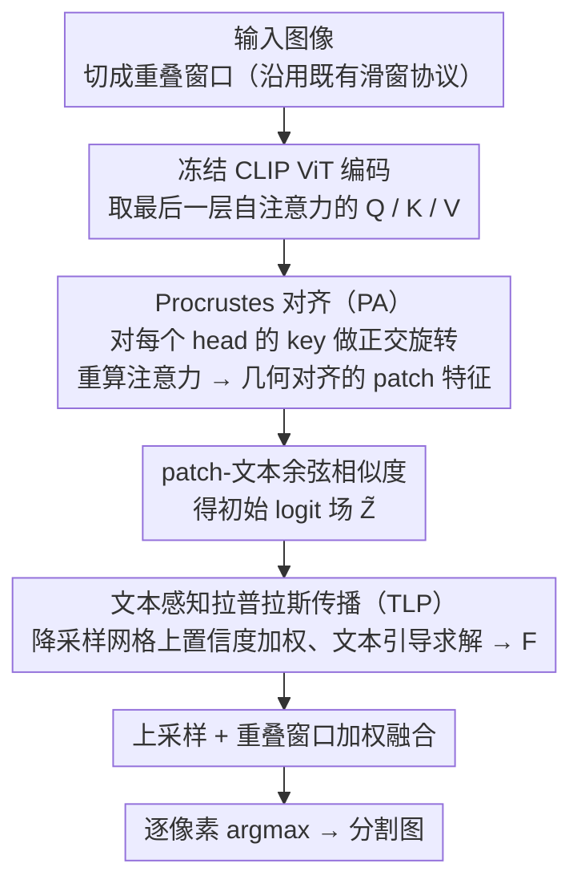

# PEARL: Geometry Aligns Semantics for Training-Free Open-Vocabulary Semantic Segmentation

**会议**: CVPR 2026  
**arXiv**: [2603.21528](https://arxiv.org/abs/2603.21528)  
**代码**: [https://github.com/PGSmall/PEARL](https://github.com/PGSmall/PEARL)  
**领域**: 语义分割 / 开放词汇  
**关键词**: 开放词汇语义分割, 训练免微调, Procrustes对齐, 拉普拉斯传播, CLIP

## 一句话总结

PEARL 提出了一种基于 Procrustes 对齐和文本感知拉普拉斯传播的两步推理方法，在不引入额外训练或辅助骨干网络的前提下，通过修正 CLIP 最后一层自注意力中 key-query 的几何失配并利用文本语义引导标签传播，在训练免开放词汇语义分割上达到了新的 SOTA。

## 研究背景与动机

**领域现状**：开放词汇语义分割（OVSS）允许模型在推理时通过自然语言指定类别集合来对每个像素进行分类。当前主流做法分为训练式和训练免两大路线：训练式方法通过学习解码器或轻量适配器来增强 CLIP 的密集预测能力；训练免方法则保持骨干网络冻结，仅修改推理过程。

**现有痛点**：训练免方法面临两大核心问题。第一，CLIP 的对比预训练强调全局图文对齐而非密集预测，导致视觉编码器顶层的自注意力被少数背景主导方向支配，patch 特征的几何结构与文本原型之间存在严重失配，使 patch-text 相似度不稳定。第二，文本通常仅被用作分类器，很少参与像素间信息交换的治理——尽管文本空间中的类别关系能指示哪些类别应相互增强、哪些应保持分离。

**核心矛盾**：现有方法多在下游进行平滑处理（如 DenseCRF、PAMR），但这只是"治标不治本"——当源头几何就是错的，后续的平滑只能缓解症状而非消除根因。另一些方法引入辅助视觉骨干（如 DINOv2），增加了复杂度和延迟。

**本文目标**（1）在注意力分数形成的源头修正 token 几何结构；（2）将文本从简单的标签器转变为结构性先验，引导像素间的语义传播。

**切入角度**：作者观察到 CLIP ViT-B/16 的 attention map 中，vanilla CLIP 弥散且偏向背景，NACLIP 虽改善但碎片化严重。通过在最后自注意力层对 key 做正交 Procrustes 旋转，可使输出特征更好地与 query 子空间对齐。

**核心 idea**：先用正交 Procrustes 对齐修复注意力几何，再用文本感知的拉普拉斯传播将语义一致性扩散到全图——align-then-propagate。

## 方法详解

### 整体框架

PEARL 的整条流程建立在冻结的 CLIP ViT 上、不训练任何参数，核心是「先对齐、再传播」（align-then-propagate）两步。它沿用既有训练免 OVSS 的滑窗推理协议——高分辨率图像先被切成若干重叠窗口、逐窗处理。每个窗口经 ViT 编码后，在**最后一层自注意力块**里插入 **Procrustes 对齐（PA）**：对每个 head 的 key 做正交旋转使其对齐 query 子空间，再用修正后的 key 重算注意力，得到几何对齐的 patch 特征。这些特征与冻结文本编码器生成的类别原型做余弦相似度，得到初始 logit 场 $\widetilde{Z}$。随后 **文本感知拉普拉斯传播（TLP）** 在一个降采样网格上对 logit 场做置信度加权、文本引导的图拉普拉斯求解，输出精炼分数 $F$。最后把各窗口结果上采样、按重叠权重融合回全图，逐像素取 argmax 得到分割图。

### 关键设计

**1. Procrustes 对齐（PA）：在注意力源头把 key 旋回 query 的子空间**

CLIP 顶层自注意力的麻烦在于 key 和 query 虽然都来自同一组 patch，却被对比预训练拉到了两套不太一致的基底上，再加上少数高范数的背景 token 和 CLS 把方向带偏，patch 特征和文本原型的余弦相似度就变得飘忽。PA 的做法是只对 key 动手、不碰 value：对每个 head，先用 query 的范数给每个 token 加权、算出 query 和 key 的加权质心并去中心化（高范数背景 token 和 CLS 的影响在这一步被压下去），再求解一个正交 Procrustes 问题

$$R^* = \arg\min_{R \in O(d)} \|K_c R - Q_c\|_F^2,$$

它的闭式解就是交叉协方差 $K_c^\top Q_c$ 做 SVD 后的正交因子 $UV^\top$。去中心化只用来求 $R^*$；真正旋转的是**原始** key（$\widetilde{K}=KR^*$），再在同一个注意力块里用 $\widetilde{K}$ 重算一遍注意力分数和输出。之所以选正交映射（而不是任意线性变换），是因为正交旋转只改方向、不改局部幅值，修的恰好是 patch 特征在 query 子空间里的方向性一致性——这正是余弦相似度看重的东西。代价也很低，每个 head 只多一个 $d \times d$ 的 SVD 和两次 $N \times d$ 矩阵乘；若想完全避开 SVD，还能用 Newton-Schulz 迭代近似出正交因子。

**2. 文本感知拉普拉斯传播（TLP）：让文本类别关系来主持像素间的信息交换**

PA 修好的相似度场虽然几何对齐了，但仍是逐 patch 独立预测的、空间上不连贯。一般方法会在下游接 DenseCRF / PAMR 做平滑，但那是类别无关的、只看像素邻近。TLP 想让文本来当这场平滑的"裁判"：把 logit 场下采样到一个 $H_g \times W_g$ 的小网格、建成 4-连通图，然后做一次置信度加权、文本引导的图拉普拉斯求解。每个节点有多大发言权由数据信任度 $\rho_i$ 决定，它同时看 softmax 后的峰值概率（这个像素本身判得有多确定）和文本先验一致性 $u_i = p_i^\top G p_i$；相邻两点之间能不能互相传播则由边权 $a_{ij}$ 控制，它把图像梯度边检测 $b_{ij}^{img}$（保护物体边界、不让平滑越界）和文本一致性门控 $g_{ij} = p_i^\top G p_j$（语义相近的类别才放行）乘在一起。最终的精炼 logit 是下面这个凸二次目标的解：

$$\mathcal{L}(F_g) = \frac{1}{2}\sum_i \rho_i \|F_{g,i} - Z_{g,i}\|^2 + \frac{\tau}{2}\sum_{(i,j)} a_{ij}\|F_{g,i} - F_{g,j}\|^2,$$

第一项把结果拉回初始预测 $Z_g$、第二项鼓励相邻节点趋同，在小网格上用共轭梯度法几步就能解出来。这里的关键变量是文本原型相似度矩阵 $G$，它编码了类别之间的共现/语义关系，使得"猫"和"狗"这类相近类别在传播时能互相增强、而无关类别保持分离——比类别无关的平滑更有的放矢，也比再挂一个 DINOv2 骨干来构图要简洁得多。

### 损失函数 / 训练策略

PEARL 完全无需训练——所有超参数均为固定常量（温度 $\tau_s$、网格大小 $H_g \times W_g$、边检测 $\kappa$ 等），推理时即插即用。

## 实验关键数据

### 主实验

在 8 个标准 OVSS 基准上的 mIoU (%) 对比，所有方法均使用 CLIP ViT-B/16，无额外骨干：

| 数据集 | PEARL | NACLIP | SFP | SCLIP | ClearCLIP |
|--------|-------|--------|-----|-------|-----------|
| V21 (w/ bg) | **64.1** | 58.9 | 56.8 | 59.1 | 51.8 |
| PC60 (w/ bg) | **35.1** | 32.2 | 32.3 | 30.4 | 32.6 |
| Object (w/ bg) | **37.3** | 33.2 | 32.1 | 30.5 | 33.0 |
| V20 | **86.9** | 79.7 | 83.4 | 80.4 | 80.9 |
| PC59 | **38.6** | 35.2 | 36.0 | 34.1 | 35.9 |
| City | **37.6** | 35.5 | 34.1 | 32.2 | 30.0 |
| ADE | **19.4** | 17.4 | 18.1 | 16.1 | 16.7 |
| **平均** | **43.2** | 39.4 | 39.6 | 38.2 | 38.1 |

与使用额外骨干的方法对比：PEARL (43.2) 超过 CASS+DINOv3 (42.2)，且不需要任何辅助模型。

### 消融实验

| 配置 | 平均 mIoU | V21 | PC59 | City |
|------|----------|-----|------|------|
| Vanilla CLIP (无 PA 无 TLP) | 13.8 | 18.6 | 11.2 | 6.7 |
| 仅 PA | 40.6 | 59.2 | 35.3 | 35.0 |
| 仅 TLP | 29.3 | 35.4 | 25.0 | 20.5 |
| PA + TLP (完整) | **43.2** | **64.1** | **38.6** | **37.6** |

TLP 作为即插即用模块应用于其他方法的效果：

| 方法 | 原始平均 | +TLP 平均 | 提升 |
|------|---------|----------|------|
| SCLIP | 38.2 | 42.2 | +4.0 |
| NACLIP | 39.4 | 42.3 | +2.9 |
| SFP | 39.6 | 41.5 | +1.9 |

### 关键发现

- PA 是最大贡献者，将平均 mIoU 从 13.8 提升到 40.6（+26.8），说明修复注意力源头的几何是关键
- TLP 与 PA 互补，在 PA 基础上再提升 2.6 个点；TLP 也能即插即用地为其他方法带来 2-4 个点的提升
- 即使不使用任何辅助骨干，PEARL 也超过了使用 DINOv2/DINOv3 的方法（如 CASS 42.2）
- 在像素精度（pAcc）上，PEARL 也达到无辅助骨干最佳的 67.2%，甚至超过 CASS+DINOv3 (67.0%)

## 亮点与洞察

- **Procrustes 对齐**是全文最核心的 trick：它直接在注意力计算处进行正交旋转修正，成本极低（一个 $d \times d$ SVD），效果显著（+26.8 mIoU）。这种思路——在特征空间做闭式正交对齐而非学习参数——值得在其他视觉-语言密集预测任务中推广。
- **文本不只是分类器**，PEARL 巧妙地将文本原型间的相似度矩阵用作图传播的结构约束。这个insight可迁移到其他密集预测任务：比如在 open-vocabulary detection 中，用文本类别关系约束 NMS 或后处理。
- 整个方法完全无训练、无外部数据、无辅助模型，设计极其简洁——only two steps with fixed constants。

## 局限与展望

- 在 ADE20K 等细粒度 stuff 类别上仍有差距（19.4 vs ProxyCLIP 19.7），CLIP 的通用 prompt 对罕见 stuff 类别的区分力有限
- 当"tree"和"mountain"等语义相近类别的低频纹理相似时，缺乏深度/形状线索会导致混淆
- 网格大小需要针对数据集手动设置（City 用 224×224，其他用 80×80），自适应网格尺度选择可进一步优化
- Procrustes 对齐是全局的单一正交映射，对不同语义区域的 key-query 失配可能不够精细——区域自适应的对齐可能更好

## 相关工作与启发

- **vs NACLIP**: NACLIP 通过修改注意力的邻近掩码来增强局部性，但碎片化问题严重。PEARL 从几何对齐根源修复，效果更好且不引入人工局部性约束
- **vs CASS (CVPR'25)**: CASS 使用 DINOv2/DINOv3 辅助骨干进行视觉上下文图构建，设计复杂且需额外模型。PEARL 以更简洁的方式（单一 CLIP）在平均 mIoU 上超过 CASS+DINOv3
- **vs ProxyCLIP**: ProxyCLIP 也依赖 DINOv2 进行 region grouping，在 ADE 上表现更好但总体弱于 PEARL

## 评分

- 新颖性: ⭐⭐⭐⭐ 正交 Procrustes 对齐应用于 CLIP 自注意力修正是全新的切入点，文本感知拉普拉斯传播也有新意
- 实验充分度: ⭐⭐⭐⭐⭐ 8 个基准、全面消融、即插即用验证、像素精度补充报告，非常完整
- 写作质量: ⭐⭐⭐⭐⭐ 从观察→insight→方法形成清晰的逻辑链，数学推导严谨且在概念上讲得很清楚
- 价值: ⭐⭐⭐⭐ 将训练免 OVSS 性能推到超过使用辅助骨干的方法，实际应用价值高

<!-- RELATED:START -->

## 相关论文

- [\[CVPR 2026\] Looking Beyond the Window: Global-Local Aligned CLIP for Training-free Open-Vocabulary Semantic Segmentation](looking_beyond_the_window_global-local_aligned_clip_for_training-free_open-vocab.md)
- [\[CVPR 2026\] The Power of Prior: Training-Free Open-Vocabulary Semantic Segmentation with LLaVA](the_power_of_prior_training-free_open-vocabulary_semantic_segmentation_with_llav.md)
- [\[CVPR 2026\] Direct Segmentation without Logits Optimization for Training-Free Open-Vocabulary Semantic Segmentation](direct_segmentation_without_logits_optimization_for_training-free_open-vocabular.md)
- [\[CVPR 2026\] ReAttnCLIP: Training-Free Open-Vocabulary Remote Sensing Image Segmentation via Re-defined Attention in CLIP](reattnclip_training-free_open-vocabulary_remote_sensing_image_segmentation_via_r.md)
- [\[ICCV 2025\] Training-Free Class Purification for Open-Vocabulary Semantic Segmentation](../../ICCV2025/segmentation/training-free_class_purification_for_open-vocabulary_semantic_segmentation.md)

<!-- RELATED:END -->
