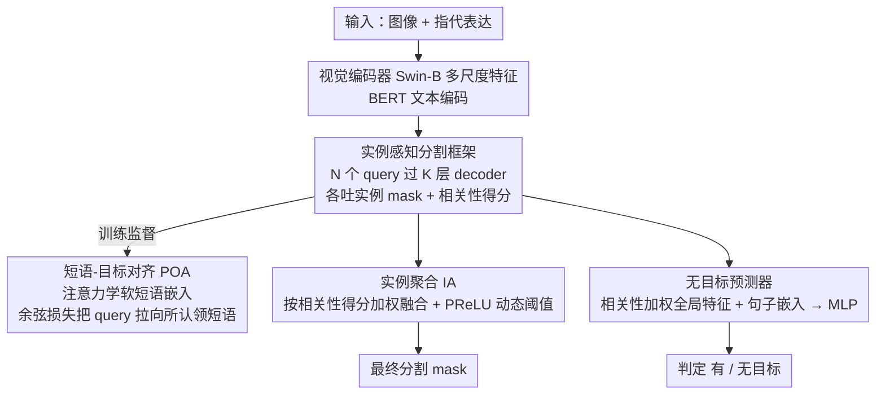

# Phrase-Instance Alignment for Generalized Referring Segmentation

**会议**: CVPR 2026  
**arXiv**: [2411.15087](https://arxiv.org/abs/2411.15087)  
**代码**: [https://eronguyen.github.io/InstAlign](https://eronguyen.github.io/InstAlign)  
**领域**: 图像分割  
**关键词**: 广义指代分割, 短语-实例对齐, 实例级推理, 多目标分割, 无目标检测

## 一句话总结

本文提出 InstAlign，将广义指代分割 (GRES) 重构为实例级推理问题，通过短语-目标对齐 (POA) 损失建立语言短语与视觉实例的细粒度对应关系，并用相关性加权聚合机制统一处理多目标和无目标场景，在 gRefCOCO 上 cIoU 提升 3.22%、N-acc 提升 12.25%。

## 研究背景与动机

1. **领域现状**：广义指代分割 (GRES) 是经典指代分割 (RES) 的扩展，要求模型处理"两个左边的人"、"所有的车"甚至"沙发上的大象"（图中无大象）等表达——描述可能对应多个对象或零个对象。现有 GRES 方法（如 ReLA、LQMFormer、MABP 等）仍然采用"基于区域"的策略，对整个表达直接预测一个前景二值 mask。

2. **现有痛点**：这种一次性预测单个 mask 的做法把丰富的语言结构"压扁"成了一个无差别区域——模型无法分辨同一表达中各短语对应的不同视觉实例，导致对相关实例的过分割或欠分割。例如，描述"左边的两条狗"时，现有方法容易把两条狗合并成一个 blob 或只分割到一条。

3. **核心矛盾**：问题根源在于缺乏**实例级监督**——现有查询式架构虽然有多个 object query，但只监督最终合并后的 mask，各 query 没有被迫去"专精"到不同实例，导致 query 之间纠缠不清、语义模糊。

4. **本文目标** (a) 如何让每个 object query 自动对应一个独立的视觉实例？(b) 如何建立 query 与表达中各短语的显式对齐？(c) 如何在多目标和无目标场景下统一推理？

5. **切入角度**：作者观察到，指代表达天然具有可分解的短语结构（"left dog" vs "right dog"），若模型能先做实例感知分割再做短语对齐，就能获得可解释且准确的分割。

6. **核心 idea**：将 GRES 从"直接预测合并 mask"重构为"短语条件实例分割 + 相关性加权聚合"，通过显式的 POA 损失实现 query-to-phrase 的细粒度监督。

## 方法详解

### 整体框架

GRES 的难点在于一句话可能指向多个对象、也可能一个都不指。InstAlign 的破题方式是不再让模型对整句话直接吐一张前景 mask，而是先把图像里"可能被指代的东西"拆成一组独立实例，再让语言去逐一认领。具体地，输入一张图和一句指代表达，先用视觉编码器抽多尺度特征、BERT 编码文本 token；然后 $N$ 个可学习 object query 穿过 $K$ 层 transformer decoder，与视觉、文本特征反复交互，每个 query 最终吐出一张实例 mask $\hat{s}_i$ 和一个相关性得分 $\hat{p}_i$；训练时一个专门的对齐损失逼着每个 query 去对应表达中的某个短语；推理时把所有实例 mask 按各自的相关性得分加权融合成最终 mask，同时一个轻量分类器根据这些得分判断"到底有没有目标"。四个设计环环相扣：实例感知给了 query "各管一摊"的能力，POA 让 query 知道自己该管哪个短语，IA 把它们的输出软融合，no-target 预测器复用同一套得分判断是否无目标。

### 关键设计

**1. 实例感知分割框架（Instance-aware Segmentation）：先把场景拆成实例，再谈指代**

以往 GRES 方法虽然也用了多个 object query，但只拿最终合并后的那张 mask 去算 loss，结果各个 query 没有被逼着分工，互相纠缠、语义模糊。InstAlign 直接给每个 query 加上实例级监督：以 Mask2Former 为骨干，但在 decoder 里注入文本条件，做 query–视觉–文本的双向交叉注意力，让 $N$ 个 query 各自吐出一张实例 mask $\hat{s}_i$ 和一个相关性得分 $\hat{p}_i$。训练时用匈牙利匹配把预测实例和 ground-truth 实例一一配对，匹配代价为

$$\mathcal{L}_{\text{match}}(i,j) = \lambda_{\text{score}}\mathcal{L}_{\text{score}}(\hat{p}_i,1) + \lambda_{\text{mask}}\mathcal{L}_{\text{mask}}(\hat{s}_i, s_j)$$

配上的 query 同时学 mask 和得分，没配上的 query 只被压着把得分学成 0。这是 GRES 里第一次引入实例级监督，相当于强行让每个 query "专精"一个对象，从根上拆掉了 query 之间的纠缠。

**2. 短语-目标对齐损失（Phrase-Object Alignment, POA）：让每个 query 自己认领对应的短语**

光把 query 拆成实例还不够——模型还得知道"left dog"这个短语该由哪个 query 负责，否则面对"左边的两条狗"仍可能张冠李戴。POA 给的是显式的短语-实例对应监督，分三步走。先用缩放点积注意力算出每个 query 到各文本 token 的相关性矩阵 $R_k = \text{softmax}(Q_k T_k^\top / \sqrt{C})$；再用它对文本特征加权求和，得到每个 query 的"软短语嵌入" $P_k = R_k T_k$——注意这里不需要任何外部句法解析器，短语边界是注意力权重自己学出来的；最后用余弦相似度损失 $\mathcal{L}_{\text{phrase}}(i) = 1 - \text{sim}(Q_k^i, P_k^i)$ 把 query 嵌入往它认领的短语嵌入上拉，这个损失以系数 $\lambda_{\text{phrase}}$ 一并算进匈牙利匹配代价。与过去那种隐式跨模态注意力相比，POA 提供的是直接的、可监督的对应关系，所以在消歧义（区分两条狗）和组合表达（属性+关系）上提升明显，可视化也能看到 query 确实自动"认领"了各自的短语。

**3. 实例聚合模块（Instance Aggregation, IA）：用得分把实例 mask 软融合，而不是硬挑**

拿到一堆带得分的实例 mask 后，怎么合成最终答案？硬选择（挑得分最高的几个）很容易漏掉相关实例或误纳无关实例。IA 改用完全可微的连续加权：

$$\mathcal{M}_{\text{merged}} = \text{Sigmoid}\Big(\sum_{i=1}^N \hat{p}_i \cdot \sigma(\hat{s}_i)\Big)$$

其中 $\sigma(\cdot)$ 是 PReLU 激活，充当一个可学习的动态阈值来压背景噪声。因为整条聚合路径可微，模型能在多目标和组合表达下平滑地分配权重，而不是在离散选择里二选一。消融显示这个 PReLU 阈值并非可有可无，它带来约 +0.8% cIoU 和 +1.5% N-acc。

**4. 无目标预测器（No-target Predictor）：复用同一套得分判断"图里压根没有"**

GRES 还要能识别"沙发上的大象"这种图中根本不存在的描述。InstAlign 没有另起炉灶，而是直接复用 mask 推理用的那套相关性表示：把相关性加权的全局 query 特征 $Q_{\text{global}} = \sum_i \hat{p}_i \cdot Q^i$ 与句子级文本嵌入 $T_{\text{sen}} = \text{Average}(T_K)$ 拼起来送进一个 MLP 分类器。直觉是当所有 query 的相关性得分都偏低时——也就是没有哪个实例敢认领这句话——模型就判定无目标。设计上统一又轻量，消融显示 $Q_{\text{global}}$ 和 $T_{\text{sen}}$ 缺一不可。

### 一个例子：分割"左边的两条狗"

以一张有左右两条狗、外加一只猫的图、表达"the two dogs on the left"为例，看四个模块怎么接力。100 个 object query 进 decoder 与图文特征交互后，假设其中第 12、37 号 query 分别锁定了左侧两条狗、各吐出一张实例 mask 和较高得分（如 0.9、0.85），其余大量 query 落在背景或那只猫上、得分压到接近 0。训练阶段，POA 算出第 12 号 query 对 "left" / "dog" 这些 token 的相关性最高，于是它的软短语嵌入指向 "left dog"，余弦损失把这个 query 拉向该短语；第 37 号 query 同理认领另一条狗——两条狗不再被合成一个 blob。IA 把所有 mask 按得分加权：两条狗的 mask 以 0.9、0.85 权重保留，猫和背景因得分趋零被 PReLU 阈值压掉，融合出干净的双狗 mask。最后 no-target 预测器看到有 query 给出高得分，判定"有目标"。若换成"沙发上的大象"，所有 query 得分都低、$Q_{\text{global}}$ 整体疲软，预测器就翻成"无目标"。

### 损失函数 / 训练策略

总损失为 $\mathcal{L}_{\text{total}} = \lambda_{\text{merged}}\mathcal{L}_{\text{merged}} + \lambda_{\text{inst}}\mathcal{L}_{\text{inst}} + \lambda_{\text{nt}}\mathcal{L}_{\text{nt}}$。使用 Swin-B 作为视觉编码器（ImageNet22K 预训练），BERT 作为文本编码器，9 层 transformer decoder，100 个 object query，输入 480×480，batch 32，AdamW，20 epochs，4 张 A5000 约 24 小时。

## 实验关键数据

### 主实验

| 数据集 | 指标 | InstAlign | 之前 SOTA | 提升 |
|--------|------|-----------|-----------|------|
| gRefCOCO val | cIoU | 68.94% | 65.72% (MABP) | +3.22% |
| gRefCOCO val | gIoU | 74.34% | 70.94% (LQMFormer) | +3.40% |
| gRefCOCO val | N-acc | 79.72% | 67.47% (LQMFormer) | +12.25% |
| gRefCOCO testA | cIoU | 73.22% | 71.85% (CoHD) | +1.37% |
| Ref-ZOM test | mIoU | 70.81% | 69.81% (CoHD) | +1.00% |
| Ref-ZOM test | Acc | 94.23% | 93.34% (CoHD) | +0.89% |

值得注意的是，InstAlign 仅用 Swin-B 骨干，规模远小于 LLM-based 方法（如 SAM4MLLM-8B），但在 cIoU/gIoU 上全面超越后者，且 N-acc 领先幅度高达 13+ 个百分点。

### 消融实验

| 配置 | cIoU | gIoU | N-acc | 说明 |
|------|------|------|-------|------|
| 无实例监督 | 63.33 | 66.95 | 70.56 | 退化为 ReLA 式方法 |
| Mask2Former 监督 | 66.26 | 70.32 | 76.19 | +2.93% cIoU |
| + POA (完整模型) | 68.94 | 74.34 | 79.72 | POA 再补 +2.68% cIoU |
| 硬选择聚合 | 66.67 | 69.25 | 72.96 | 相比 IA 差 2.27% |
| IA 无 PReLU | 68.13 | 72.35 | 78.22 | PReLU 贡献 +0.81% |
| N=20 queries | 67.64 | 72.67 | 77.25 | query 太少不够 |
| N=100 queries | 68.94 | 74.34 | 79.72 | 最优 |
| N=200 queries | 68.01 | 73.24 | 78.12 | 过多反而下降 |

### 关键发现

- **POA 是最大贡献者**：从无实例监督到加 POA，累计提升 5.6% cIoU 和 9.16% N-acc。POA 对无目标检测帮助尤其大。
- **实例级监督是必要前提**：即使不加 POA，仅引入 Mask2Former 式匹配监督就能大幅提升（+2.93%），说明 GRES 确实需要 query 的实例特化。
- **100 个 query 是最优权衡**：多了反而下降，可能因为冗余 query 引入噪声。

## 亮点与洞察

- **将 GRES 从区域问题重新定义为实例推理问题**——概念上的突破比技术细节更重要。这个重新定义使得多目标/无目标场景的处理变得自然统一。
- **POA 的"软短语嵌入"设计很巧妙**——不需要解析器来分割短语，而是通过注意力权重自动发现 query-to-word 的对应关系，端到端可学。
- **相关性加权聚合的思路可推广**到其他需要从多个候选中选择并合并的任务，如多轮对话中的视觉 grounding。

## 局限与展望

- 作者承认模型在处理层次化/组合属性关系时仍有困难，如"左边有白汤的碗"这种附加属性与主描述冲突时会失败
- 没有测试在开放词汇或更大规模数据上的泛化性
- POA 是 soft alignment，没有利用显式的短语解析信息，可能在很长的复杂表达上不够精确

## 相关工作与启发

- **vs ReLA**: ReLA 用区域级关系注意力，没有实例级监督，InstAlign 的实例感知设计是根本性差异，N-acc 从 56.37% 提升到 79.72%
- **vs LLM-based (GSVA, SAM4MLLM)**: 这些方法依赖大模型和外部数据，规模大 10 倍以上，但 InstAlign 用 Swin-B 就超越了它们，说明任务特化的结构设计比粗暴的规模扩展更有效
- **vs MABP**: MABP 也将语言特征注入 query 初始化，但只用固定 patch 监督每个 query，不做 phrase-level 对齐

## 评分

- 新颖性: ⭐⭐⭐⭐ 将 GRES 重定义为实例推理是好想法，但具体技术（匈牙利匹配+对比对齐）不算全新
- 实验充分度: ⭐⭐⭐⭐⭐ 两个benchmark、完整消融、可视化分析、多种 baseline 对比
- 写作质量: ⭐⭐⭐⭐ 结构清晰，图表翔实，动机推导顺畅
- 价值: ⭐⭐⭐⭐ N-acc 提升 12%+ 是显著进展，实例级推理是 GRES 的正确方向

<!-- RELATED:START -->

## 相关论文

- [\[CVPR 2026\] LoD-Loc v3: Generalized Aerial Localization in Dense Cities using Instance Silhouette Alignment](lod-loc_v3_generalized_aerial_localization_in_dense_cities_using_instance_silhou.md)
- [\[CVPR 2026\] GeCo: Geometry-Consistent Regularization for Domain Generalized Semantic Segmentation](geco_geometry-consistent_regularization_for_domain_generalized_semantic_segmenta.md)
- [\[ICLR 2026\] AMLRIS: Alignment-aware Masked Learning for Referring Image Segmentation](../../ICLR2026/segmentation/amlris_alignment-aware_masked_learning_for_referring_image_segmentation.md)
- [\[CVPR 2026\] Semantic Alignment in Hyperbolic Space for Open-Vocabulary Semantic Segmentation](semantic_alignment_in_hyperbolic_space_for_open-vocabulary_semantic_segmentation.md)
- [\[CVPR 2026\] Towards Streaming Referring Video Segmentation via Large Language Model](towards_streaming_referring_video_segmentation_via_large_language_model.md)

<!-- RELATED:END -->
