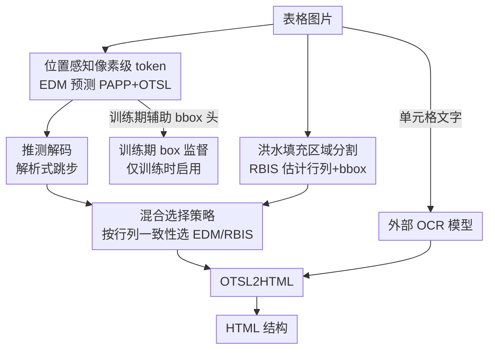

# PIX-TAB: Efficient PIXel-Precise TABle Structure Recognition Approach with Speculative Decoding and Region-Based Image Segmentation

**会议**: CVPR 2026  
**论文**: [CVF Open Access](https://openaccess.thecvf.com/content/CVPR2026/html/Zaytsev_PIX-TAB_Efficient_PIXel-Precise_TABle_Structure_Recognition_Approach_with_Speculative_Decoding_CVPR_2026_paper.html)  
**代码**: 待确认  
**领域**: 语义分割 / 文档智能  
**关键词**: 表格结构识别, 像素级 token, 推测解码, 区域分割, 端侧部署

## 一句话总结
PIX-TAB 用「直接把行列像素坐标编进序列」的 PAPP token 让一个轻量编码器-解码器在推理时不再需要独立的 bbox 头，再叠加一套纯解析的推测解码和基于洪水填充的区域分割兜底大表格，做出一个能在手机上跑、比全量版本快 3 倍多的表格结构识别模型。

## 研究背景与动机

**领域现状**：表格结构识别（Table Structure Recognition, TSR）要从文档图片里恢复出行、列、单元格的逻辑关系，是信息抽取和文档理解的基础环节。深度学习把这个领域从 CNN（Faster/Cascade R-CNN 系）推到了 Transformer 系（TableFormer、TATR、TABLET 等），近年又出现了 UniTable、OmniParser 这类直接上视觉-语言大模型的做法。

**现有痛点**：现状有两条都不理想的路。一条是「拆任务」流水线——检测、结构解析、内容识别各做各的，误差逐级累积、算力开销大。另一条是大一统的 VLM 方案，精度尚可但模型重，根本塞不进端侧设备。即便是端到端的多任务学习代表 MTL-TabNet，在长表格、复杂嵌套、合并单元格上仍然吃力，而且推理要靠独立的 bounding box 解码分支，慢且不稳。

**核心矛盾**：精度、速度、端侧可部署性三者之间存在 trade-off。想要像素级精确的单元格坐标，传统做法得专门训练并运行一个 bbox 解码器；想要快，又往往得牺牲结构精度；而真正企业文档里那些带完整边框、动辄几十行的密集大表，恰恰是逐 token 自回归解码最慢、最容易出结构错误的场景。

**本文目标**：做一个同时满足三点的 TSR 系统——(1) 给出像素级精确的单元格结构；(2) 推理足够快、能跑在手机上；(3) 与 OCR 解耦，换语言只换 OCR 模型而不动结构模型。

**切入角度**：作者注意到一个被忽视的点——如果把每条横线、竖线的像素坐标**直接写进结构序列本身**，那么单元格的 bounding box 就能从序列里解析重建出来，推理时根本不需要 bbox 解码器。同时，规范表格的 token 序列在行与行之间高度规律，这种规律可以用规则**解析地**预测未来 token，不必再训一个 draft 模型。

**核心 idea**：用「位置感知的像素级 token（PAPP）」把坐标编进序列以消掉推理期的 bbox 解码器，再用「解析式推测解码」吃掉行间冗余的解码步数，最后用「洪水填充区域分割 + 混合选择」给带边框的大表兜底。

## 方法详解

### 整体框架
PIX-TAB 接收一张归一化的表格图片，输出 HTML 形式的表格结构。系统由四部分协同：(1) 一个编码器-解码器模型（EDM），预测 PAPP token 和 OTSL 结构 token；(2) 一个区域分割模块（RBIS），用洪水填充在有完整边框的表上独立估计行列与 bbox；(3) 一个外部 OCR 模型，只负责把单元格里的文字识别出来；(4) 一个聚合模块，用混合选择策略在 EDM 与 RBIS 两套结果之间挑一个更一致的，再经 OTSL2HTML 转成最终 HTML。EDM 是主路、RBIS 是并行兜底路，OCR 与结构识别完全解耦——这正是「换语言只换 OCR」的来源。

### 关键设计

**1. 位置感知像素级 token（PAPP）：把坐标编进序列，推理期甩掉 bbox 解码器**

痛点很直接：传统 TSR 要像素级精确就得额外训练并运行一个 bbox 解码分支，慢且是误差来源。PIX-TAB 的做法是扩展 OTSL 表示，对一张归一化到 $X \times Y$ 的表，引入两类位置 token——行起始 token `<rYYY>`（$\text{YYY} \in [0, Y)$，标注每条水平表格线的纵向像素坐标）和列边界 token `<cXXX>`（$\text{XXX} \in [0, X)$，标注每条竖线的横向像素坐标）。这些位置 token 和四个 OTSL 结构 token 混排：`C`（cell，新单元格）、`L`（left-looking，向左合并）、`U`（up-looking，向上合并）、`X`（cross，交叉合并），序列以 `</table>` 结尾。注意它**砍掉了原始 OTSL 的 `NL`（换行）token**——因为新行的开始已经由 `<rYYY>` 隐式标出，省一个 token。

举例：一个单行表，横线在 $y=20, y=40$，竖线在 $x=10,30,50,70$，对应序列就是 `<r020><c010><c030><c050><c070><r040>CCC</table>`。关键在于：既然像素坐标已经显式写进 token，整套单元格 bounding box 就能从序列**直接解析重建**，推理时不再需要任何 bbox 解码器。这套表示比等价 HTML 紧凑得多（论文图 2 给的例子：PAPP+OTSL 序列长 50 vs HTML 长 95），只比纯 OTSL 略长一点点（多了首行的位置 token），却换来了后面推测解码加速的前提。

**2. 训练期 box 监督：只在训练时拉 bbox 头稳住空间定位**

既然推理时坐标从 token 里解析、不要 bbox 头，那空间定位怎么训稳？作者保留了一个轻量 BBoxDecoder，但**只在训练时启用、推理时整个移除**。模型用两项之和训练：$\mathcal{L}_{\text{total}} = \mathcal{L}_{\text{structure}} + \mathcal{L}_{\text{bbox}}$。结构项是标准的 teacher-forcing 自回归交叉熵 $\mathcal{L}_{\text{structure}} = -\frac{1}{T}\sum_{t=1}^{T}\log P(y_t \mid x, y_{<t})$；bbox 项只对「开启新单元格」的 token 计算，且用归一化 L1 让损失对框尺度不敏感：

$$\mathcal{L}_{\text{bbox}} = \frac{1}{|\mathcal{C}|}\sum_{c \in \mathcal{C}} \frac{\lVert \mathbf{b}_c - \mathbf{b}_c^{\text{gt}}\rVert_1}{\sum_{i=1}^{4}(\mathbf{b}_c^{\text{gt}})_i + \epsilon}.$$

这样做的巧妙之处在于：bbox 头像一个「训练期的副驾驶」，逼着共享解码器学出空间一致的特征，但不给推理增加任何负担。编码器是改过 block 配置的 ResNet-31-D（四个残差阶段分别含 1/2/5/3 个 basic block，每个 block 加了 Global Context Block），后接正弦位置编码；共享解码器 → StructDecoder（预测 PAPP+OTSL）与 BboxDecoder 两条头，架构都是标准 Transformer 解码器层。

**3. 解析式推测解码：用规则直接猜未来 token，砍掉规范表格的解码步数**

自回归逐 token 解码在长表上很慢，常规推测解码又得再养一个 draft 模型。作者抓住一个 TSR 独有的性质：因为推理时用的是 PAPP+OTSL token 而非 bbox，序列在**行与行之间高度规律**——第一行之后不再出现 `<cXXX>`，每行都以 `<rYYY>` 开头接一串 OTSL token。于是可以用**纯解析算法**生成推测块，完全不跑额外神经网络。

具体（Alg. 1，块大小 $K=10$）：记已解码的行为 $R_0,\dots,R_d$，对当前最后一行 $L$，向前回扫找到第一行前缀匹配的参考行 $A$，把 $A$ 的剩余部分接上、再重复 $K$ 份补到推测块里；同时用 `RefineRowStep` 从近期行距估出步长 step，把推测块里的行起始替换成 $y_{\text{last}} + \text{step}$（裁剪到 $[0, H-1]$、四舍五入到偶数，$H=480$）。解码器对「前缀 + 推测块」做一次前向，在推测段内逐 token 验证、命中就并入前缀，对 `<rYYY>` 允许 $\pm 1$ 像素容差（行距稳定时），遇到第一个不匹配就停、丢弃剩余推测尾。推测本身是纯 token 级操作，每次触发代价 $O(K \times N_{\text{cols}})$、不调模型，相比一次解码步可忽略，却能在规范表上一口气省掉大量解码步。实测在 FinTabNet 上加速约 1.5×、PubTabNet 上最高约 3×，精度几乎不掉。

**4. 区域分割 + 混合选择：给带边框大表兜底，按行列一致性二选一**

EDM 虽是主路，但在企业文档里那种「布局复杂、边框完整」的大表上常翻车。作者并行跑一个区域分割模块（RBIS，Alg. 2），在灰度图上用洪水填充 + BFS 三阶段工作：① **区域检测**——从每个未访问像素出发，把强度差在 5 个 level 以内的 8 邻域像素并进同一区域；② **区域分析**——边扩张边更新 bbox 与像素数，算出密度比 $\rho = \eta / A_{\text{box}}$（填充像素数占外接框面积的比例）衡量紧致度；③ **质量过滤**——只保留密度 $\rho \ge \rho_{\min}$（说明不是空心矩形框）且宽高都超过训练集最小单元格尺寸的区域。整个算法每个像素只访问一次，时间/空间复杂度都是 $O(n \times m)$。

两路结果都转成 HTML 后，聚合模块用混合选择准则 $\Psi$ 二选一，依据是行列计数一致性：

$$\Psi = \begin{cases} \text{RBIS}, & \text{若 } N_r^{\text{RBIS}} > \gamma \cdot N_r^{\text{EDM}} \ \text{且}\ N_c^{\text{RBIS}} > \gamma \cdot N_c^{\text{EDM}} \\ \text{EDM}, & \text{否则} \end{cases}$$

其中 $\gamma = 0.7$ 是经验阈值。直觉是：当 RBIS 在带边框大表上检出明显更多、更一致的行列时就信它的几何精度，否则回落到 EDM 的鲁棒性。这样把 EDM 的泛化能力和 RBIS 的几何精度拼起来，对大而复杂的布局也能给出可靠结构。

### 损失函数 / 训练策略
总损失为结构交叉熵 + 训练期归一化 L1 bbox 损失（见设计 2）。优化器用 Ranger（RAdam + LookAhead + 梯度中心化），$\beta_1=0.9, \beta_2=0.95$，权重衰减 0.1，全局 batch size 128，峰值学习率 0.001，在训练到 64% epoch 时降 10 倍，200 步 warm-up，约训 50 epoch。训练数据覆盖 PubTabNet（470K）、FinTabNet（405K）及二者用本文表格生成器扩展出的合成版 PubTabNetSynth（612K）、FinTabNetSynth（540K）。合成数据由扩展 Wikipedia 表格、改 CSS 样式增加视觉多样性、再全分辨率截图缩放到统一高度（600–1000px）生成，可自动造出超百万张唯一表格。

## 实验关键数据

### 主实验
在 FinTabNet 上与近年只用图像输入的方法横向对比（FPS 归一化、A100 40GB 单卡）：

| 方法 | 图像尺寸 | Norm.FPS | TEDS_struct |
|------|---------|---------|-------------|
| RobusTabNet | 1024 | 5.19 | 97.00 |
| VAST | 608 | 1.38 | 98.63 |
| UniTable | - | - | 98.89 |
| MuTabNet | - | - | 98.87 |
| TABLET | 960 | 18.01 | 98.71 |
| **PIX-TAB (✓RBIS)** | **480** | **7.23** | **98.65** |
| **PIX-TAB (✗RBIS)** | **480** | **7.96** | **98.72** |

PIX-TAB 在 **480 的小输入尺寸**下做到 98.72 的 TEDS_struct，精度与一众重模型同档，但输入分辨率最小、且面向端侧。合成数据增强带来稳定小幅提升（PubTabNet：TEDS_struct 95.2%→95.5%，TEDS 89.3%→89.6%）。

端侧对比（Samsung Fold 5 / Snapdragon 8 Gen 2，LiteRT + OpenCV，C++ 工具）：

| 方法 | 模型 | TEDS_struct | TEDS | 平均耗时(s) |
|------|------|-------------|------|------------|
| PIX-TAB | Full | 97.26 | 96.63 | 19.9 |
| PIX-TAB | Optimized | 96.64 | 96.01 | 6.6 |
| NCGM | Original | - | 95.4 | 9.1 |

移动优化版以微小精度损失换来 3 倍多的加速（FinTabNet 3.66×、PubTabNet 3.01×）。

### 消融实验
逐组件拆解 RBIS（区域分割）与 SD（推测解码）（节选 PubTabNet / FinTabNet）：

| RBIS | SD | 测试集 | TEDS_struct / TEDS_struct100 | FPS |
|------|----|--------|------------------------------|-----|
| ✗ | ✗ | FinTabNet | 98.72 / 89.83 | 3.80 |
| ✗ | ✓ | FinTabNet | 98.72 / 89.84 | 7.96 |
| ✗ | ✓ | PubTabNet | 97.26 / 77.79 | 8.54 |
| ✓ | ✓ | FinTabNet | 98.65 / 89.81 | 7.23 |

在 SynthTabNet 的 MarketingStyle（密集带边框文本表）上单测 RBIS：

| 测试集 | RBIS | TEDS_struct100 | TEDS100 |
|--------|------|----------------|---------|
| MarketingStyle | ✗ | 56.14 | 35.08 |
| MarketingStyle | ✓ | 57.59 | 45.61 |

### 关键发现
- **推测解码几乎免费提速**：开启 SD 后 FPS 从 3.80→7.96（FinTabNet）、3.36→8.54（PubTabNet），TEDS_struct 几乎不变（98.72→98.72，差异在小数点后），印证了「解析式跳步不损精度」。
- **RBIS 的价值在密集大表**：常规 FinTabNet/PubTabNet 上 RBIS 反而略掉点（98.72→98.65），因为这两个集没有带完整边框的密集表；但到 MarketingStyle，TEDS100 从 35.08% 飙到 45.61%（+10 个点以上），说明它是对症下药的兜底而非通用增益。
- **小输入大效率**：480 的输入尺寸配合上述两招，让模型在精度不输大模型的前提下能压进手机。

## 亮点与洞察
- **「把坐标编进 token」一招两吃**：既让推理期省掉独立 bbox 解码器（省时间），又给推测解码创造了「行间高度规律」的前提（再省步数）。一个表示设计连带打通两个效率点，是全篇最巧的地方。
- **解析式推测解码，不养 draft 模型**：常规推测解码要一个小模型猜 token，这里直接用表格序列的结构规律写规则猜，代价 $O(K \times N_{\text{cols}})$ 近乎为零——领域先验用得很到位，可迁移到任何「输出序列高度规律」的结构化生成任务。
- **训练期 bbox 头、推理期丢弃**：用辅助监督稳定空间定位但不给推理加负担，是「训练换推理」trade-off 的干净示范。
- **OCR 与结构解耦做多语言**：换语言只换 OCR 模型、结构模型一字不改，工程上对多语言落地非常友好。

## 局限与展望
- 作者承认：整体精度高度依赖 OCR 质量，OCR 的框预测错了会连累结构识别。
- RBIS 只在边框清晰的表上有效，对高度不规则/无边框的复杂布局会失灵——它本质是个几何启发式兜底。
- 推测解码的收益完全建立在「行模式重复」上，若每行都独一无二，这套规则化推测就没有意义、白白增加验证开销。
- 自己看：混合选择阈值 $\gamma=0.7$ 是经验定的，没有自适应机制；TEDS_struct100/TEDS100 这类「全表完全正确率」指标虽然更严，但在 MarketingStyle 上 RBIS 版也才 57.59%/45.61%，说明密集大表整体仍远未解决。横向 FPS 对比跨了不同 GPU、且部分方法未说明测法，绝对数值不宜直接比大小。

## 相关工作与启发
- **vs MTL-TabNet**：本文架构受其启发（共享 CNN-Transformer 编码器 + 多任务解码头），但关键改动是把 bbox 信息编进 token 让推理期甩掉 bbox 解码器，并叠加推测解码与 RBIS，主打端侧效率，而 MTL-TabNet 仍依赖独立 bbox 分支且在长/复杂表上吃力。
- **vs OTSL / SPRINT**：复用了 OTSL 的五 token 极简词表理念，但扩展出 PAPP 位置 token、并砍掉 `NL`，把「结构 + 像素坐标」统一进一条序列，而 SPRINT 等仍是纯结构序列、坐标另算。
- **vs UniTable / OmniParser 等 VLM 方案**：那类大一统模型精度可观但模型重、上不了端侧；PIX-TAB 反其道而行，用紧凑模型 + 工程化加速换端侧可部署性，定位互补。
- **vs TABLET / TSRFormer 等 Transformer 方案**：精度同档（TEDS_struct ~98.7），但 PIX-TAB 用 480 的小输入和近乎免费的推测解码把效率和端侧落地做成了卖点。

## 评分
- 新颖性: ⭐⭐⭐⭐ PAPP token 消 bbox 解码器 + 解析式推测解码的组合很巧，但多是已有思想（OTSL、推测解码、洪水填充）的领域化重组。
- 实验充分度: ⭐⭐⭐⭐ 双数据集 + 端侧真机 + 逐组件消融 + 新指标，较完整；但 RBIS 增益依赖专门的 MarketingStyle 子集、横向 FPS 跨硬件可比性弱。
- 写作质量: ⭐⭐⭐⭐ 动机清晰、算法给了伪代码与公式；个别公式在 PDF 抽取中有断裂（以原文为准）。
- 价值: ⭐⭐⭐⭐ 把 TSR 做到手机端、与 OCR 解耦、3 倍多加速，工程落地价值明确。

<!-- RELATED:START -->

## 相关论文

- [\[CVPR 2026\] Structure-Aware Representation Distillation for Tiny-Dense Object Segmentation](structure-aware_representation_distillation_for_tiny-dense_object_segmentation.md)
- [\[CVPR 2026\] Beyond Appearance: Camouflaged Object Detection via Geometric Structure](beyond_appearance_camouflaged_object_detection_via_geometric_structure.md)
- [\[CVPR 2025\] 2DMamba: Efficient State Space Model for Image Representation with Applications on Giga-Pixel Whole Slide Image Classification](../../CVPR2025/segmentation/2dmamba_efficient_state_space_model_for_image_representation_with_applications_o.md)
- [\[CVPR 2026\] Mitigating Objectness Bias and Region-to-Text Misalignment for Open-Vocabulary Panoptic Segmentation](mitigating_objectness_bias_and_region-to-text_misalignment_for_open-vocabulary_p.md)
- [\[AAAI 2026\] JoDiffusion: Jointly Diffusing Image with Pixel-Level Annotations for Semantic Segmentation Promotion](../../AAAI2026/segmentation/jodiffusion_jointly_diffusing_image_with_pixel-level_annotations_for_semantic_se.md)

<!-- RELATED:END -->
