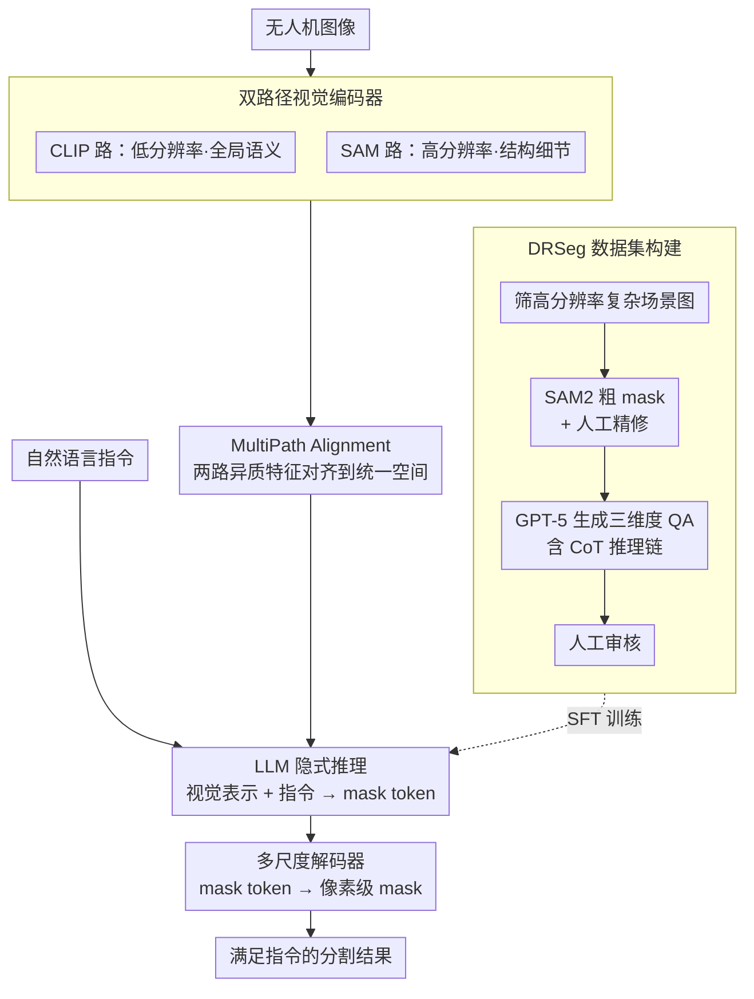

# PixDLM: A Dual-Path Multimodal Language Model for UAV Reasoning Segmentation

**会议**: CVPR 2026 Highlight  
**arXiv**: [2604.15670](https://arxiv.org/abs/2604.15670)  
**代码**: [https://github.com/XIEFOX/PixDLM](https://github.com/XIEFOX/PixDLM)  
**领域**: 语义分割  
**关键词**: 无人机推理分割, 多模态大模型, 双路径视觉编码器, 链式推理, 像素级预测

## 一句话总结

本文定义了 UAV Reasoning Segmentation 任务，构建了包含 10K 高分辨率无人机图像和链式推理标注的 DRSeg 基准，并提出了双路径像素级多模态大模型 PixDLM 作为基线。

## 研究背景与动机

**领域现状**：推理分割（Reasoning Segmentation）旨在根据自由文本指令识别图像中满足条件的区域。LISA、PixelLM 等模型已在地面视角场景中展示了多模态大模型进行隐式推理和像素级分割的能力。

**现有痛点**：现有推理分割模型和数据集主要基于地面视角或天底视角图像，其视觉假设（中等分辨率、有限尺度变化、稳定相机方向、较大目标尺寸）在无人机图像中完全不适用。无人机图像面临三个独特挑战：（1）高空斜视角持续改变透视几何；（2）极端尺度变化和密集小目标，许多关键目标仅占几十个像素；（3）超高分辨率场景需要同时推理全局语义和微小高频细节。

**核心矛盾**：现有 MLLM 通常使用低分辨率视觉 token 化，导致细粒度无人机细节在压缩过程中丢失。同时缺乏专门针对无人机场景的推理分割基准数据集，阻碍了系统性的研究进展。

**本文目标**：（1）正式定义 UAV Reasoning Segmentation 任务并构建专门的基准数据集；（2）提出能同时处理全局语义和局部细节的基线模型。

**切入角度**：将无人机推理语义需求组织为三个维度——空间推理、属性推理和场景级推理，分别对应位置关系、视觉状态和全局上下文。

**核心 idea**：通过双路径视觉编码器（全局低分辨率 + 高分辨率结构路径）保留小目标和边界线索，结合 LLM 驱动的推理进行像素级分割。

## 方法详解

### 整体框架

PixDLM 想解决的核心难题是：无人机图像里关键目标常常只占几十个像素，而主流 MLLM 把视觉 token 压到低分辨率后，这些小目标和细边界就在压缩里被抹掉了。它的做法是给视觉端铺两条互补的路——一条看全局语义、一条死守高分辨率结构细节，再把两路特征对齐后喂给 LLM 做指令推理，最后由解码器还原像素级 mask。

整体流程是：无人机图像同时进双路径视觉编码器，CLIP 路抓全局语义、SAM 路保结构细节；MultiPath Alignment 把两路特征对齐成一套统一表示；LLM 读这套视觉表示加上自然语言指令做隐式推理，吐出一个 mask token；最后多尺度解码器把这个 token 解码成满足指令的分割 mask。训练数据则来自专门为这个任务从头构建的 DRSeg 基准。

### 关键设计

**1. 双路径视觉编码器：用两个现成编码器分头管语义和细节**

无人机场景里单条路径都不够用——只用低分辨率编码器，密集小目标在 token 压缩中就丢了；只用高分辨率编码器，算力又扛不住。PixDLM 干脆把任务拆给两个互补的现成模型：全局路径用 CLIP 视觉编码器吃低分辨率输入、负责语义理解，结构路径用 SAM 编码器吃高分辨率输入、负责保住小目标轮廓和边界线索。CLIP 擅长「这是什么」，SAM 擅长「边在哪里」，两路并行既拿到了语义又没牺牲细节，同时避免了从头训练一个昂贵的高分辨率编码器。

**2. MultiPath Alignment 模块：把两路异质特征对齐到同一空间**

CLIP 和 SAM 两路产出的特征处在不同的尺度和语义层次上，直接拼给 LLM 它没法同时用好。这个轻量模块的职责就是把语义特征和结构特征对齐、整合进一套统一的表示空间，让后续 LLM 在推理时能一并调用全局语义和局部结构两方面的线索，而不是只偏向其中一路。

**3. DRSeg 数据集构建流程：半自动造出带推理链的无人机分割基准**

现有无人机数据集既缺细粒度 mask 标注，又没有推理导向的文本监督，撑不起系统性的推理分割研究。DRSeg 在 CODrone 数据集基础上用四阶段半自动流程补上这块：先人工筛出尺度变化大、目标密集、含遮挡和斜视角的复杂高分辨率图像；再把 CODrone 的旋转框经 SAM2 转成粗 mask、用 ISAT 工具半自动精修边界（尤其修小目标和细长结构）；接着用 GPT-5 结合图像、精修 mask 和类别，按三套定制 prompt 生成覆盖空间 / 属性 / 场景三个推理维度的 QA 对（每条含一段自然语言推理和蒸馏出的 CoT 推理链）；最后人工审核逻辑一致性与 mask 语义对齐。整套数据三个推理维度近乎均匀分布（各约 33.3%），分别对应位置关系、视觉状态和全局上下文，最终得到 10K 张高分辨率图像、10K 个实例 mask 及配套的链式推理 QA，按 3:2:5 划分训练 / 验证 / 测试集。

### 损失函数 / 训练策略

遵循标准的 LISA 训练范式，引入 mask token 配合 embedding-as-mask 解码器，把 LLM 输出的特殊 token 解码成分割结果，并支持在 DRSeg 上做 SFT 微调。

## 实验关键数据

### 主实验

| 模型 | Attribute gIoU | Scene gIoU | Spatial gIoU |
|------|---------------|------------|-------------|
| LISA-13B (zero-shot) | 52.65 | 47.08 | 42.85 |
| PixelLM-7B (zero-shot) | 46.87 | 43.07 | 41.28 |
| LISA-7B (SFT) | 59.22 | 54.45 | 57.33 |
| **PixDLM (Ours)** | **62.80** | **61.75** | **62.51** |

### 消融实验

| 配置 | Attr gIoU | Scene gIoU | Spatial gIoU |
|------|-----------|------------|-------------|
| DRSeg + RRSIS-D + CoT | 61.13 | 55.60 | 60.55 |
| DRSeg + CoT（无 RRSIS-D） | **62.80** | **61.75** | **62.51** |
| DRSeg（无 CoT） | 62.51 | 61.67 | 61.98 |

### 关键发现

- PixDLM 在三种推理维度上均显著超越 zero-shot 和 SFT 基线，场景推理提升尤为显著（+7.3 vs SFT LISA）
- 混合 RRSIS-D 数据反而降低了性能，说明无人机专用数据的领域适配更重要
- CoT 推理监督带来的提升相对有限，模型对噪声推理链具有鲁棒性

## 亮点与洞察

- **任务定义清晰**：将 UAV 推理分割的语义需求系统化为空间/属性/场景三个维度，为后续研究提供了清晰的框架
- **数据构建流程成熟**：GPT-5 + 人工审核的半自动标注流程在保证质量的同时具有较好的可扩展性
- **双路径设计简洁有效**：利用现成的 CLIP 和 SAM 编码器组合，避免从头训练高分辨率编码器

## 局限与展望

- 58% 的实例属于小目标（面积 < 2%），模型在极端小目标上的性能仍有较大提升空间
- 每张图像仅标注一个目标实例，无法评估多目标推理场景
- 双路径编码器的计算开销较大，对于实时无人机应用可能不够高效
- 数据集规模（10K）相对有限，更大规模的数据可能进一步提升性能

## 相关工作与启发

- **vs LISA**: LISA 用单一 CLIP 编码器，PixDLM 增加了 SAM 高分辨率路径，在无人机小目标场景优势明显
- **vs GeoPix/GeoPixel**: 这些遥感模型使用地理先验，但不具备开放词汇推理能力且对密集小目标效果有限
- **vs LLaVA-HR**: 同样使用双路径思路处理高分辨率，但 PixDLM 专门针对像素级输出设计

## 评分

- 新颖性: ⭐⭐⭐⭐ 首次正式定义 UAV 推理分割任务，数据集和任务定义有开创性
- 实验充分度: ⭐⭐⭐⭐ 多基线对比全面，消融设计合理
- 写作质量: ⭐⭐⭐⭐ 任务定义和数据构建描述详细清晰
- 价值: ⭐⭐⭐⭐ 为无人机视觉理解提供了重要的基准和基线

<!-- RELATED:START -->

## 相关论文

- [\[CVPR 2026\] Towards Streaming Referring Video Segmentation via Large Language Model](towards_streaming_referring_video_segmentation_via_large_language_model.md)
- [\[CVPR 2025\] GLUS: Global-Local Reasoning Unified into A Single Large Language Model for Video Segmentation](../../CVPR2025/segmentation/glus_global-local_reasoning_unified_into_a_single_large_language_model_for_video.md)
- [\[ACL 2026\] AnchorSeg: Language Grounded Query Banks for Reasoning Segmentation](../../ACL2026/segmentation/anchorseg_language_grounded_query_banks_for_reasoning_segmentation.md)
- [\[CVPR 2026\] Fast Reasoning Segmentation for Images and Videos](fast_reasoning_segmentation_for_images_and_videos.md)
- [\[ICCV 2025\] HiMTok: Learning Hierarchical Mask Tokens for Image Segmentation with Large Multimodal Model](../../ICCV2025/segmentation/himtok_learning_hierarchical_mask_tokens_for_image_segmentation_with_large_multi.md)

<!-- RELATED:END -->
