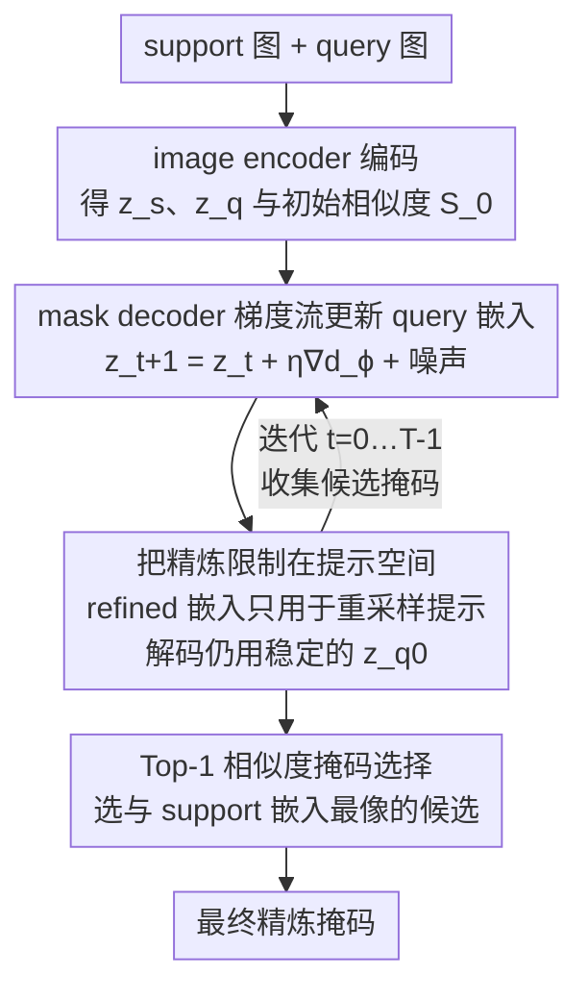

# PR-MaGIC: Prompt Refinement Via Mask Decoder Gradient Flow For In-Context Segmentation

**会议**: CVPR 2026  
**论文**: [CVF Open Access](https://openaccess.thecvf.com/content/CVPR2026/html/Lee_PR-MaGIC_Prompt_Refinement_Via_Mask_Decoder_Gradient_Flow_For_In-Context_CVPR_2026_paper.html)  
**代码**: [项目主页](https://postech-minjaelee.github.io/PR-MaGIC/)  
**领域**: 语义分割 / 上下文分割 / 提示精炼  
**关键词**: in-context segmentation, SAM, 自动提示, 梯度流, 测试时精炼

## 一句话总结
PR-MaGIC 是一个**免训练、测试时**的提示精炼框架，把 SAM mask decoder 的梯度当作"判别器梯度流"反传到 query 图像嵌入上，迭代地把自动生成的劣质提示点"挪到"更对的位置，再用 top-1 相似度从多步候选里挑出最稳的掩码，作为即插即用模块给 PerSAM-F、Matcher 这类 one/few-shot 分割框架稳定涨点。

## 研究背景与动机
**领域现状**：SAM 这类视觉基础模型（VFM）让"可提示分割"成为主流，但 SAM 本身需要人工给点/框/粗掩码作提示，且适配新任务要额外微调。为了去掉人工，一批 in-context（one/few-shot）分割方法应运而生：给一张带掩码的 support 图，靠 support↔query 的语义相似度自动采样提示点，再喂给 SAM 解码。代表是 PerSAM-F（微调 SAM 线性组合层级掩码）和 Matcher（用 DINOv2 算相似度 + SAM 当分割器，全程免训练）。

**现有痛点**：自动提示的质量完全取决于 support 和 query 之间的相似度图，而两张图在颜色、视角、形状上往往有差异，相似度图就会"指错地方"。结果是采样出来的提示点要么落在背景上（false positive），要么语义模糊，要么覆盖不全——这些坏点直接把 SAM 解码器带偏，掩码质量随之崩坏。论文 Fig.2 里 PerSAM-F / Matcher 把大象分成残缺一块就是典型。

**核心矛盾**：坏提示来自 encoder 端的相似度匹配，但真正"懂掩码好不好"的是 decoder——decoder 在 SAM 大规模预训练里和 encoder 联合训过，藏着丰富的"什么样的嵌入能解出好掩码"的信息。可现有方法只在 encoder 相似度层面打转，从没把 decoder 的反馈拉回来修提示。

**本文目标**：在**不训练、不改结构、不加数据**的前提下，让 decoder 的梯度信号反向指导提示的修正，把劣质自动提示在推理时就地精炼。

**切入角度**：作者借用"判别器梯度流"（discriminator gradient flow）的理论框架——把 query 嵌入看成一个分布 $\rho$，把"能解出最优掩码的理想嵌入"看成目标分布 $\mu$，用熵正则化 KL 散度的梯度流把 $\rho$ 推向 $\mu$；而这个梯度恰好可以用 SAM mask decoder 的 logit 来近似，完全免训练。

**核心 idea**：用 mask decoder 的 logit 梯度做一条"嵌入空间里的梯度流"，迭代更新 query 嵌入→重采样提示，并用 top-1 相似度从多步候选里选最稳的掩码兜底。

## 方法详解

### 整体框架
PR-MaGIC 是一个挂在已有 in-context 分割框架（PerSAM-F / Matcher）之上的即插即用精炼层。输入是一张 support 图 $I_s$（带 support 掩码）和一张 query 图 $I_q$，输出是一张精炼后的 query 分割掩码。整条流水线分三段：先用 image encoder $E_\theta$ 把两图编码成嵌入 $z^s_0, z^q_0$ 并算初始相似度采样初始提示；再进入核心的**梯度流精炼循环**——每一步用 mask decoder 的梯度更新 query 嵌入、重算相似度、重采样提示、解码出一张候选掩码，循环 $T$ 步得到候选集 $\{\hat m_t\}_{t=0}^{T}$；最后用 **top-1 support–query 相似度**从候选集里挑出最终掩码。

### 关键设计

**1. mask decoder 梯度流：把 decoder 的 logit 当判别器代理来更新 query 嵌入**

痛点是坏提示源自 encoder 相似度匹配错位，而 decoder 才知道哪种嵌入能解出好掩码。作者把这件事形式化成一条梯度流：设 $\rho$ 是 query 嵌入的当前分布、$\mu$ 是"能解出最优掩码的理想嵌入"分布，目标是最小化熵正则化的 KL 散度

$$\min_\rho \; F_\mu(\rho) = \min_\rho \big\{ \mathrm{KL}(\mu\Vert\rho) - \gamma\, H(\rho) \big\},$$

其中 $H(\cdot)$ 是熵、$\gamma>0$ 控制正则强度。这个泛函的梯度流 $\partial_t\rho = -\nabla F_\mu(\rho)$ 对应一个 Fokker-Planck 方程，可等价写成 SDE，再用 Euler-Maruyama 离散成

$$v_{t+1} = v_t - \eta\,\nabla_v \log\frac{\rho_t(v)}{\mu(v)} + \sqrt{2\gamma\eta}\,\xi_t,\quad \xi_t\sim\mathcal N(0,I).$$

关键一步是怎么算那个密度比 $\rho/\mu$——直接算不可行。作者借用判别器梯度流的结论：给一个判别器 $D_\phi(v)$（输出 $v$ 来自 $\mu$ 的概率），密度比可写成 $\rho_0(v)/\mu(v) = (1-D_\phi)/D_\phi = \exp(-d_\phi(v))$，其中 $d_\phi$ 是判别器的 logit。代入后更新式变得极其干净：

$$z^q_{t+1} = z^q_t + \eta\,\nabla_{z^q_t} d_\phi(z^q_t, P_t) + \sqrt{2\gamma\eta}\,\xi_t.$$

而这里的"判别器" $D_\phi$ 直接就用 **SAM 的 mask decoder**（它本质是个逐像素分类器），$d_\phi$ 就是它的 logit 输出——于是整条精炼**无需任何额外训练或参数**。作者也坦承用 mask decoder 当判别器是个轻量代理，理论上专门的判别器更严谨，但代价是要训练，与"免训练"目标冲突，故取舍如此。

**2. 把精炼限制在提示空间：refined 嵌入只用来重采样提示，解码仍用原始稳定嵌入**

如果直接拿被梯度流改过的 query 嵌入去解码，会有两个隐患：一是 feature-level 的改动会绑死到具体架构的表示，破坏方法的通用性；二是"初始嵌入已在 $\mu$ 邻域"的近邻假设现实里不总成立，直接动嵌入容易引入不稳定。作者的处理是**解耦**——梯度流更新出的 $z^q_{t+1}$ 只用于重算相似度 $S_{t+1}[i,j]=\mathrm{sim}(z^s_{0,i}, z^q_{t+1,j})$ 并重采样提示 $P_{t+1}$，而真正解码候选掩码时仍用**原始稳定的** $z^q_0$：

$$\hat m_{t+1} = D^{\mathrm{bin}}_\phi(z^q_0;\, P_{t+1}).$$

这样精炼只作用在"提示点位置"这个抽象层面，跨不同视觉提示框架都通用，又避开了直接改嵌入带来的崩坏，在鲁棒性和可调性之间取得平衡。换句话说，梯度流负责"把提示点挪对地方"，解码始终站在原始嵌入这块稳地上。

**3. Top-1 相似度掩码选择：用 support–query 相似度从多步候选里兜底挑最稳的**

理论上（命题 1）若初始分布 $\rho_0$ 落在 decoder 最优点 $\mu^\star$ 的邻域内，熵正则化 KL 梯度流会**指数级**收敛，几步就够。但作者的敏感性分析（Sec. 4.3）发现这个近邻假设现实里经常不成立：步长 $\eta=10^{-2}$ 早期涨得快但多迭代后失稳，$\eta\in\{10^{-4},10^{-5}\}$ 又收敛太慢欠精炼，mIoU 轨迹常常非单调，且最优迭代步在样本间方差很大（平均约第 3 步，但 std 接近 1.8，见 Tab. 2）。

为此作者不赌"哪一步最好"，而是把 $T$ 步里每一步的候选掩码都留下来组成候选集 $\mathcal M=\{\hat m_t\}$，再用一个简单可靠的选择器挑最终结果：对每个候选 $\hat m_t$，把 query 图按该掩码抠出来重新编码、做 masked average pooling 得代表向量 $\bar z'^q_t$，与 support 的代表向量 $\bar z'^s$ 算相似度 $s_t = \mathrm{sim}(\bar z'^s, \bar z'^q_t)$，取 top-1：

$$t^\star = \arg\max_{t\in\{0,\dots,T\}} s_t,\qquad \hat m^\star = \hat m_{t^\star}.$$

这一步是"实用安全网"：假设成立时保留精炼收益，假设失效时也能退回到没被带偏的那一步，把理论收敛和真实可用之间的鸿沟补上。

### 损失函数 / 训练策略
PR-MaGIC **完全免训练**，没有可学习参数、不改架构、不加数据，整条流水线只在推理时跑。关键超参：迭代步数 $T=5$；熵正则 $\gamma=0.1$（未调）；步长 $\eta$ 语义分割取 $0.001$、part 分割取 $0.0001$（从 COCO-20i / PACO-part 留出验证集各采 10 张图定的）；提示点数按 baseline 经验设定（语义：Matcher 8 点、PerSAM-F 5 点；part：Matcher 5 点、PerSAM-F 3 点）；梯度做了裁剪保稳定。全部实验在单张 NVIDIA RTX 6000 Ada 上完成。

## 实验关键数据

### 主实验
在 6 个数据集、2 个任务上评测，baseline 为 PerSAM-F 和 Matcher。报三类结果：B（baseline）、T（top-1 选择，实际可用版）、O（Oracle，从 $T=5$ 步里选真值 mIoU 最高的那张，作为上界）。下表为 1-shot mIoU(%)，加粗为 T 相对 B 涨点的项。

| 任务 | 数据集 | 方法 | B | T（本文） | O（上界） |
|------|--------|------|------|------|------|
| 语义 | FSS-1000 | PerSAM-F | 58.41 | **67.19** | 72.45 |
| 语义 | COCO-20i | PerSAM-F | 44.64 | **46.83** | 51.74 |
| 语义 | LVIS-92i | PerSAM-F | 42.37 | **44.48** | 47.29 |
| 语义 | COCO-20i | Matcher(1-shot) | 69.53 | **71.23** | 76.14 |
| 语义 | LVIS-92i | Matcher(1-shot) | 59.39 | **61.52** | 64.75 |
| part | PACO-Part | Matcher(1-shot) | 50.27 | **54.08** | 56.71 |
| part | Pascal-Part | Matcher(1-shot) | 54.76 | **58.28** | 61.13 |
| part | DIS5K | Matcher(1-shot) | 46.65 | **55.08** | 58.10 |
| part | DIS5K | PerSAM-F | 46.82 | **49.99** | 53.46 |

PerSAM-F 上语义分割涨点最猛：FSS +8.8、COCO +2.2、LVIS +2.1。part 分割上 Matcher(1-shot) 在 DIS5K 上暴涨 +8.4、PACO +3.8。Matcher 在 FSS-1000 上几乎不动（92.08→92.06），因为 baseline 已经饱和到 92%，没什么可修的——这也印证"baseline 越糟、精炼收益越大"。

### 消融 / 敏感性分析
| 配置 | 现象 | 含义 |
|------|------|------|
| $\eta=10^{-2}$ | 早期快速涨、多迭代后退化 | 步长过大失稳 |
| $\eta=10^{-4},10^{-5}$ | 收敛慢、饱和在次优 mIoU | 步长过小欠精炼 |
| 最优迭代步统计（Tab. 2） | 均值≈第 3 步，std≈1.7–1.8 | 最优步样本间方差大，$T=5$ 够用 |
| 去掉 top-1、靠固定步 | mIoU 轨迹非单调、依赖 $\eta/T$ | 必须有选择器兜底 |

### 关键发现
- **近邻假设是脆弱的**：若 $\rho_0$ 真的稳定接近 $\mu^\star$，mIoU 应随小 $T$ 单调上升，但实测频繁非单调且强依赖 $\eta$——这正是 top-1 选择被引入的根本原因。
- **Oracle 与 T 之间仍有可观差距**（如 FSS-1000 PerSAM-F：67.19 vs 72.45），说明候选集里常藏着更好的掩码，选择器还有提升空间。
- **语义差距过大时会失败**：当 support 和 query 视觉语义差异大、或 support 线索本身模糊时（Fig. 7 的自行车细部、托盘 vs 边界），精炼会跑偏甚至掉点，此时 top-1 选择主要起"别让它变更差"的保护作用。

## 亮点与洞察
- **把"判别器梯度流"嫁接到 SAM 上**：最巧的一点是发现 SAM mask decoder 的 logit 天然可以当判别器的 logit $d_\phi$ 用，于是一套本来需要训练判别器的梯度流理论，被改造成纯推理、零参数的提示精炼——理论包装 + 免训练落地结合得很顺。
- **"改提示不改解码"的解耦很聪明**：精炼后的嵌入只用于重采样提示、解码始终用原始稳定嵌入，既保住跨框架通用性又避开嵌入空间直接扰动的崩坏，是个可迁移到其他"test-time 精炼"任务的设计范式。
- **理论与现实的诚实对照**：作者没有用命题 1 的指数收敛粉饰一切，而是用敏感性分析主动暴露近邻假设的脆弱，并据此推出 top-1 选择——这种"理论给方向、经验补兜底"的叙事让方法更可信。
- **即插即用、零成本**：对 PerSAM-F / Matcher 不改一行结构、不加一条数据就能涨点，部署门槛极低，特别适合"baseline 不够好"的场景。

## 局限性 / 可改进方向
- **作者承认的局限**：support↔query 语义差距大或 support 线索模糊时，精炼难收敛甚至退化；近邻假设在现实中常不成立，top-1 选择只能缓解而非根治。
- **Oracle–T 差距明显**：top-1 相似度选择并不总能挑到候选集里最好的那张，选择器本身是上界与实际之间的瓶颈，换更强的掩码质量评估器可能进一步逼近 Oracle。
- **超参仍需按任务设**：$\eta$ 在语义/part 任务上差一个量级（0.001 vs 0.0001），且从敏感性看对 $\eta$ 不算鲁棒；一个自适应步长机制会让它更省心。
- **用 mask decoder 当判别器是代理**：作者自己指出专门的判别器更原则化，当前做法理论严谨性打了折扣，是"免训练"换来的妥协。
- **收益强依赖 baseline 质量**：baseline 已饱和（如 Matcher 在 FSS）时几乎无收益，方法本质是"修烂提示"，对好提示无能为力。

## 相关工作与启发
- **vs PerSAM / PerSAM-F**：PerSAM 用单张 support + 粗掩码靠相似度图定位目标，PerSAM-F 再微调 SAM 线性组合层级掩码消歧；但它们的提示一旦因 support–query 不一致而错位就无从挽回。PR-MaGIC 不替换它们，而是挂在上面用 decoder 梯度把错位提示拉回来，对 PerSAM-F 的语义分割涨点最大（FSS +8.8）。
- **vs Matcher**：Matcher 用 DINOv2 算语义相似度 + SAM 解码，免训练但同样受相似度图错位之苦。PR-MaGIC 作为 Matcher 的即插件，在 part 分割（DIS +8.4、PACO +3.8）上提升尤其明显，因为细粒度部件最吃提示精度。
- **vs SAM 微调变体（HQ-SAM / VRP-SAM / SAM-Adapter / MobileSAM）**：这些都要额外训练数据 + 改结构 + 精心标注的提示，限制了真实场景可用性。PR-MaGIC 走的是完全相反的路线——测试时、免训练、不改结构，把"提升提示质量"从训练阶段挪到了推理阶段。
- **启发**：把"decoder 的梯度反传去修上游输入/提示"这个思路，可迁移到任何"上游自动生成的条件信号质量不稳、但下游模型懂好坏"的 pipeline（如自动 caption 修 prompt、检索 query 重写），用下游模型当免训练判别器做 test-time 精炼。

## 评分
- 新颖性: ⭐⭐⭐⭐ 把判别器梯度流嫁接到 SAM mask decoder 做免训练提示精炼，视角新颖；理论框架虽借自既有工作，但落地组合很巧。
- 实验充分度: ⭐⭐⭐⭐ 6 数据集 2 任务 2 baseline，含敏感性与失败案例分析，诚实暴露假设脆弱；但缺与更多近期 in-context 方法的横向对比，且部分收益依赖 baseline 偏弱。
- 写作质量: ⭐⭐⭐⭐ 理论推导清晰、"理论给方向+经验补兜底"的叙事自洽，图示直观；公式密度偏高对非数学背景读者略吃力。
- 价值: ⭐⭐⭐⭐ 即插即用、零训练成本、对弱 baseline 稳定涨点，实用价值高；但对已饱和 baseline 和大语义差距场景收益有限。

<!-- RELATED:START -->

## 相关论文

- [\[AAAI 2026\] CtrlFuse: Mask-Prompt Guided Controllable Infrared and Visible Image Fusion](../../AAAI2026/segmentation/ctrlfuse_mask-prompt_guided_controllable_infrared_and_visible_image_fusion.md)
- [\[CVPR 2026\] PromptMoE: A Segmentation Refinement Framework Leveraging Mixture of Experts for Improved Prompting](promptmoe_a_segmentation_refinement_framework_leveraging_mixture_of_experts_for_.md)
- [\[CVPR 2026\] FlowDIS: Language-Guided Dichotomous Image Segmentation with Flow Matching](flowdis_language-guided_dichotomous_image_segmentation_with_flow_matching.md)
- [\[CVPR 2026\] Love Me, Love My Label: Rethinking the Role of Labels in Prompt Retrieval for Visual In-Context Learning](love_me_love_my_label_rethinking_the_role_of_labels_in_prompt_retrieval_for_visu.md)
- [\[CVPR 2026\] INSID3: Training-Free In-Context Segmentation with DINOv3](insid3_training-free_in-context_segmentation_with_dinov3.md)

<!-- RELATED:END -->
