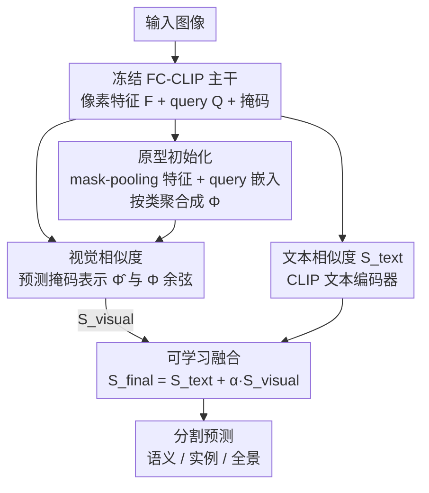

# PrAda: Few-Shot Visual Adaptation for Text-Prompted Segmentation

**会议**: CVPR 2026  
**arXiv**: [2605.19623](https://arxiv.org/abs/2605.19623)  
**代码**: https://github.com/FocoosAI/PrAda (有)  
**领域**: 分割 / 开放词表分割 / 少样本适配  
**关键词**: 文本提示分割、少样本视觉适配、类原型、FC-CLIP、参数高效

## 一句话总结
针对文本提示分割模型在专业域上"会画掩码却叫错名字"的现象，本文提出 PrAda：冻结 FC-CLIP，只用每类 5 张标注样本学一组类原型，把视觉相似度与原文本分类分数用一个可学习权重 α 融合，仅增 +0.02%~0.19% 参数就在 5 个 benchmark 上把 PQ/mIoU 拉高 4~10 个点。

## 研究背景与动机
**领域现状**：开放词表分割（如 FC-CLIP）靠 CLIP 文本编码器把 Mask2Former 的类无关掩码与"类别文字描述"对齐，从而不需要目标域标注就能分割新类别，文本提示比纯视觉提示效果更好，因为语言里编码了高层语义。

**现有痛点**：一旦目标域离 CLIP/COCO 预训练分布很远（街景、工业、医学等专业域），性能就大幅下滑。但下滑到底坏在哪一步——是掩码定位不准，还是分类叫错名字——以前没人系统查过。

**核心矛盾**：作者拿 FC-CLIP 在 28 个域专用数据集上做诊断，发现**掩码 IoU 大量集中在 [0.8, 1.0]**，即定位基本是对的；性能差距几乎全来自**误分类**——把 oracle 真值类别塞回去后各数据集 PQ 立刻暴涨。也就是说，类无关的 mask decoder 泛化得很好，瓶颈在"文本-视觉对齐的分类头"在陌生语义上不够判别。

**本文目标**：在不破坏 zero-shot 能力、不引发灾难性遗忘的前提下，只用目标域每类几张标注样本，专门修"分类"这一环。

**切入角度**：图像分类里"少样本视觉适配"（CoOp / CLIP-Adapter / Tip-Adapter）早就解决了类似问题，但它们都作用在 CLIP 输出的**单张全局特征**上；分割是 pixel/segment 级的，这些方法不能直接搬。作者由此提出全新任务 **FSVA-Seg（文本提示分割的少样本视觉适配）**。

**核心 idea**：用少量样本学一组**类原型**（visual prototypes），让原型给出的视觉相似度去补文本分类分数，二者用可学习标量自适应加权——只训原型和这个标量，主干全冻结。

## 方法详解

### 整体框架
PrAda 建在冻结的 FC-CLIP 之上：输入图像过冻结主干，得到像素特征 $F$、一组 query $Q$ 和它们预测的掩码 $\{\hat m_i\}$。离线阶段，用每类 5 张带掩码标注的样本，把"像素级 mask-pooling 特征"和"对应 query 嵌入"相加，按类聚合成类原型矩阵 $\Phi$。推理阶段，对每个预测掩码同样算出视觉表示 $\hat\Phi_i$，与原型做余弦相似度得到视觉分数 $S_{\text{visual}}$；同时 FC-CLIP 照常给出文本分数 $S_{\text{text}}$；最终分数是 $S_{\text{final}}=S_{\text{text}}+\alpha S_{\text{visual}}$。训练时只优化原型 $\Phi$ 和标量 $\alpha$，主干一概不动，因此既保留了文本提示有效的域上的 zero-shot 能力，又能在陌生域靠视觉原型纠偏。

### 关键设计

**1. 误分类诊断：先确诊瓶颈再开方**

不同于以往直接堆方法，作者先把 FC-CLIP 的失败拆成两种可能——掩码定位差 vs 分类差。在 28 个数据集上做 IoU 匹配，发现大量预测掩码与真值 IoU 在 0.8 附近（强证据：mask decoder 的类无关定位是稳的）；再做 oracle 实验，把预测类别换成真值类别后各数据集 PQ 显著跳升。这两个证据共同把矛头指向**分类**而非定位，且越是语义上远离预训练分布的域（如 SegInW 真实世界 benchmark）误分类越严重。这个诊断直接决定了后续设计——**冻结掩码侧，只修分类**，而不是去重训整个模型。

**2. 双源类原型初始化：像素细节 + query 语义互补**

原型要同时抓住"长什么样"和"是什么语义"。单看像素特征 $F$ 抓的是细粒度外观，但不专门编码类别语义；query $Q$ 在 transformer decoder 里被掩码预测和分类联合优化，携带高层语义但缺细节。作者把两者相加互补。对每个视觉样本 $v_i=(m_i,c_i)$，先用 mask average pooling 把像素特征压成向量：

$$\phi_i=\frac{\sum_{j=1}^{H\cdot W} m_{i,j} F_j}{\sum_{j=1}^{H\cdot W} m_{i,j}}$$

由于样本掩码和模型 query 之间没有现成对应，作者把参考图过一遍冻结 FC-CLIP 拿到 $N$ 个预测掩码，用 **IoU 匹配**给 $m_i$ 找到最佳匹配掩码所对应的 query $q_i$。最后每类原型是该类所有样本"query + pooling 特征"之和的均值：

$$\Phi_k=\frac{1}{|\mathcal{V}_k|}\sum_{i:\,v_i\in\mathcal{V}_k}\left(q_i+\phi_i\right),\quad k=1,\dots,|\mathcal{C}|$$

消融证实两源缺一不可：单用 query 或单用 mask-pooling 都不如二者相加（见消融表）。

**3. 原型视觉相似度：把分类换成"和原型比对"**

推理时对每个预测掩码 $\hat m_i$ 同样算 mask-pooling 表示 $\hat\phi_i$，与其 query 相加得 $\hat\Phi_i=q_i+\hat\phi_i$，再与原型矩阵做余弦相似度：

$$S_{\text{visual}}=\frac{\hat\Phi\cdot\Phi^{T}}{\|\hat\Phi\|_2\,\|\Phi\|_2}$$

为处理"无类别"（void）情况，原型集额外加一个 no-class 原型，故 $S_{\text{visual}}$ 实际是 $N\times(|\mathcal{C}|+1)$。这一步把陌生域上不可靠的文本-视觉对齐分类，换成"与目标域真实样本原型比对"，正好对症第 1 点诊断出的误分类。

**4. 可学习 α 融合 + 只训原型：参数高效且不遗忘**

文本提示和视觉样本谁更靠谱因域而异（语言清晰的域文本好，语义陌生的域视觉好），固定加权不合适。作者用一个**可学习标量 α** 自适应权衡：

$$S_{\text{final}}=S_{\text{text}}+\alpha S_{\text{visual}}$$

训练时**只优化 $\Phi$ 和 $\alpha$**、用 $S_{\text{final}}$ 上的交叉熵损失，主干全冻结。这避免了直接微调主干的灾难性遗忘（会拖垮原训练类别和泛化），同时参数开销极小——Cityscapes 仅 +0.02%、ADE20K 仅 +0.19%。冻结主干还保留了文本提示在其擅长域上的 zero-shot 能力。

### 损失函数 / 训练策略
仅在融合分数 $S_{\text{final}}$ 上用交叉熵损失（沿用 FC-CLIP），可训练参数只有类原型 $\Phi$ 与标量 $\alpha$。适配数据为每类随机抽 5 张训练图，5 个随机种子取平均报结果；backbone 用 CLIP-R50 与 ConvNeXt-L 两种（对应 PrAda-R50 / PrAda-L），主干和掩码/像素 decoder 全程冻结。

## 实验关键数据

### 主实验
在 ADE20K / Cityscapes / Mapillary（全景 PQ、语义 mIoU、实例 AP），每类 5 张样本，ConvNeXt-L 主干：

| 数据集 | 指标 | PrAda-L | FC-CLIP-L (zero-shot) | 最强 FSVA 基线 | 提升 |
|--------|------|---------|------------------------|----------------|------|
| ADE20K | PQ | 31.4 | 26.8 | CLIP-Adapter 31.1 | +4.6 / +0.3 |
| ADE20K | mIoU | 38.2 | 34.1 | TipAdapter-F 38.5 | +4.1 |
| Cityscapes | PQ | 49.8 | 44.0 | CLIP-Adapter 48.6 | +5.8 / +1.2 |
| Cityscapes | mIoU | 66.2 | 56.2 | CLIP-Adapter 64.3 | +10.0 / +1.9 |
| Mapillary | PQ | 23.6 | 18.2 | CLIP-Adapter 19.8 | +5.4 / +3.8 |
| Mapillary | mIoU | 38.1 | 27.9 | TipAdapter-F 31.0 | +10.2 / +9.4 |

域偏移越大（街景 Cityscapes/Mapillary）增益越明显；ADE20K 离 COCO 近，提升相对温和。实例 AP 上 PrAda-L（18.1）略逊 CLIP-Adapter（19.2），作者归因于 CLIP-Adapter 的分数校准更好。

更难的真实世界 benchmark：

| Benchmark | 指标 | PrAda-L | FC-CLIP-L | 最强 FSVA 基线 |
|-----------|------|---------|-----------|----------------|
| SegInW (25 实例数据集) | mAP | 43.3 | 41.6 | CLIP-Adapter 42.1 (+1.2) |
| ShowOrTell (14 语义数据集) | mIoU | 33.1 | 23.3 | TipAdapter-F 27.7 (+5.4) |

SoT 上 PrAda-L（33.1）追平需双基座（DINOv2+SAM）、逐类预测的 Matcher（33.5），但只需单次前向、更简架构。

### 消融实验
原型表示消融（ConvNeXt-L，可训练参数极少）：

| 配置 | ADE20K PQ | Cityscapes PQ | 说明 |
|------|-----------|---------------|------|
| 无原型 | 14.6 | 44.2 | 退化为纯 FC-CLIP |
| 随机原型 | 26.8 | 48.4 | 仅"有原型可学"就跳一大截 |
| 类嵌入 | 30.1 | 48.4 | 效果不错但参数翻 ~3 倍 (116K) |
| 仅 query | 31.7 | 49.3 | 语义源单独已很强 |
| 仅 mask-pooling | 28.9 | 49.3 | 外观源单独略弱 |
| Ours (query + pooling) | **32.2** | **50.1** | 双源互补、参数仍仅 39K |

适配样本量消融（PQ，随样本数变化）：

| 每类样本数 | ADE20K PQ | Cityscapes PQ |
|------------|-----------|---------------|
| 0 (zero-shot) | 14.6 | 44.2 |
| 1 | 24.5 | 47.2 |
| 2 | 28.7 | 48.1 |
| 5 | 31.4 | 49.8 |
| 10 | 33.2 | 50.7 |

### 关键发现
- **诊断驱动方法**：误分类（而非掩码质量）是文本提示分割在专业域失效的主因，这一确诊直接决定了"冻结掩码侧、只修分类"的设计。
- **双源原型互补**：query（语义）+ mask-pooling（外观）相加比任一单源都好，且比"类嵌入"省 ~3 倍参数。
- **极致样本效率**：每类仅 1 张样本，ADE20K PQ 就从 14.6 跳到 24.5、Cityscapes 从 44.2 到 47.2；超过 5 张后收益递减。
- **参数几乎可忽略**：可训练参数仅 ~39K，相对主干 +0.02%~0.19%，却换来 4~10 PQ/mIoU 的提升。

## 亮点与洞察
- **"先确诊再开方"的研究范式**：先用 IoU 分布 + oracle 实验锁定瓶颈在分类，再针对性地只动分类侧——避免了盲目重训主干，方法因此极轻。这套"诊断决定设计"的思路可迁移到任何"基座模型在新域掉点"的问题。
- **用目标域原型替代不可靠的文本对齐**：当 CLIP 文本-视觉对齐在陌生语义上不靠谱时，与目标域真实样本的原型比对是更直接的判别信号；可学习 α 让模型在"信文本"和"信视觉"之间按域自适应。
- **冻结主干 + 只训原型**：天然规避灾难性遗忘并保住 zero-shot，是把图像分类的少样本适配思想"正确移植"到分割（pixel/segment 级）的关键工程点——直接搬全局特征方法会失败。

## 局限性 / 可改进方向
- **依赖 FC-CLIP 特定架构**：原型初始化深度耦合 FC-CLIP 的 query + pixel-decoder 结构，迁移到非 Mask2Former 范式的分割模型需重新设计。
- **定位瓶颈未解**：方法只修分类，若某域掩码定位本身就差（诊断前提是定位 OK），PrAda 帮不上忙。
- **实例 AP 略逊**：在实例分割上不及 CLIP-Adapter，作者归因于分数校准，未深入解决。
- **与重型方法的差距**：SoT 上仍落后 GFSAM（DINOv2+SAM、逐类预测），换来的是更简单更快的单次前向——属于"效率换上限"的权衡。
- **改进思路**：把 α 从全局标量扩成 per-class / per-region 自适应；引入原型的轻量校准缓解 AP 偏差。

## 相关工作与启发
- **vs kNN-CLIP / Prompt-DINO**：同样想把文本与视觉提示结合用于分割，但两者都需**大量**标注数据；PrAda 是首个真正"少样本（每类 5 张）"的文本提示分割适配方法。
- **vs CoOp / CoCoOp / CLIP-Adapter / Tip-Adapter**：这些是图像分类的少样本适配，作者把它们改造到 FC-CLIP 当基线。它们作用于全局特征，PrAda 则在 segment 级建原型，全面超越（尤其域偏移大的街景）。
- **vs DINOv（视觉提示）**：DINOv 需每类 16 张视觉参考；PrAda 用更少样本（5 张）取得更高 PQ，说明融合文本+视觉比纯视觉提示更高效。
- **vs Matcher / GFSAM（SAM 系视觉少样本）**：它们靠 DINOv2+SAM 双基座、逐类前向，算力重；PrAda 单基座单次前向即可追平 Matcher。

## 评分
- 新颖性: ⭐⭐⭐⭐ 首次提出 FSVA-Seg 任务，并用"诊断→只修分类→原型融合"给出干净解法
- 实验充分度: ⭐⭐⭐⭐⭐ 5 benchmark（28+ 数据集）、3 种分割任务、多基座、5 种子、完整消融
- 写作质量: ⭐⭐⭐⭐ 动机由诊断实验驱动，逻辑顺，图表清晰
- 价值: ⭐⭐⭐⭐ 极低参数代价换显著增益，对低标注专业域部署很实用

<!-- RELATED:START -->

## 相关论文

- [\[CVPR 2026\] Cross-Domain Few-Shot Segmentation via Multi-view Progressive Adaptation](cross-domain_few-shot_segmentation_via_multi-view_progressive_adaptation.md)
- [\[CVPR 2026\] Bayesian Decomposition and Semantic Completion for Few-shot Semantic Segmentation](bayesian_decomposition_and_semantic_completion_for_few-shot_semantic_segmentatio.md)
- [\[CVPR 2026\] Selective, Regularized, and Calibrated: Harnessing Vision Foundation Models for Cross-Domain Few-Shot Semantic Segmentation](selective_regularized_and_calibrated_harnessing_vision_foundation_models_for_cro.md)
- [\[CVPR 2026\] Mitigating Objectness Bias and Region-to-Text Misalignment for Open-Vocabulary Panoptic Segmentation](mitigating_objectness_bias_and_region-to-text_misalignment_for_open-vocabulary_p.md)
- [\[CVPR 2026\] Beyond Text: Visual Description Assembly by Probabilistic Model for CLIP-based Weakly Supervised Semantic Segmentation](beyond_text_visual_description_assembly_by_probabilistic_model_for_clip-based_we.md)

<!-- RELATED:END -->
