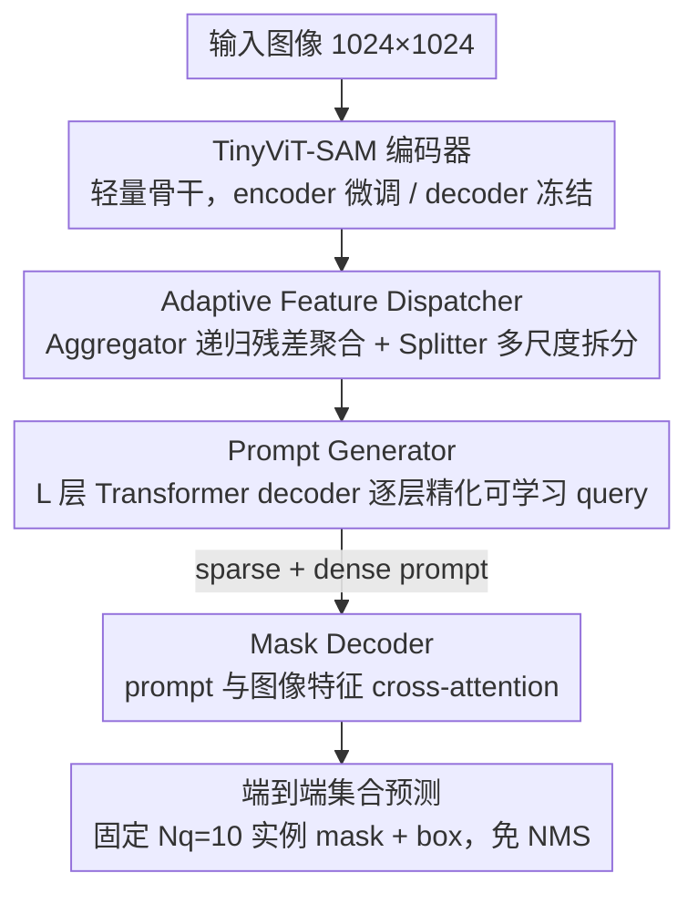

# Prompt-Driven Lightweight Foundation Model for Instance Segmentation-Based Fault Detection in Freight Trains

**会议**: CVPR 2026  
**arXiv**: [2603.12624](https://arxiv.org/abs/2603.12624)  
**代码**: [https://github.com/MVME-HBUT/SAM_FTI-FDet.git](https://github.com/MVME-HBUT/SAM_FTI-FDet.git)  
**领域**: 实例分割 / 工业检测 / 基础模型适配  
**关键词**: SAM, 自提示生成, 轻量化, 货运列车故障检测, 基础模型迁移  

## 一句话总结
提出SAM FTI-FDet，通过设计一个基于Transformer decoder的自提示生成器（Prompt Generator），让轻量化的TinyViT-SAM自动生成任务相关的query prompt，无需人工交互即可完成货运列车部件的实例级故障检测，在自建数据集上达到74.6 AP_box / 74.2 AP_mask。

## 背景与动机
货运列车的关键部件（闸瓦、轴承鞍座等）长期运行后容易磨损，传统人工巡检效率低且依赖经验。虽然基于CNN/Transformer的检测方法已被广泛部署，但面临三个核心痛点：（1）泛化差——在一个检测站训练的模型迁移到新站点时性能剧降；（2）边界不精确——传统目标检测只给bounding box，无法定量评估磨损程度（如闸瓦剩余厚度）；（3）部署受限——高精度模型计算量大，难以在铁路沿线的边缘设备上实时运行。SAM作为基础模型具有强大的分割泛化能力，但它依赖外部提示（点击、框）且对提示位置敏感，无法直接用于全自动工业场景。

## 核心问题
如何将SAM的通用分割知识迁移到货运列车故障检测这一特定领域，同时解决三个挑战：（1）消除SAM对人工提示的依赖，实现全自动化；（2）保持轻量化以满足边缘部署需求；（3）在结构复杂、遮挡频繁的工业场景中保证实例分割精度。

## 方法详解

### 整体框架

SAM FTI-FDet 想把 SAM 的通用分割能力搬到货运列车故障检测上，但 SAM 离不开人工点/框提示、又太重。整体仍是 SAM 的 encoder-decoder：输入图像（1024×1024）经 TinyViT-SAM 编码器提特征，Adaptive Feature Dispatcher 融合多尺度特征，Prompt Generator 自动生成 query prompt，Mask Decoder 结合 prompt 和图像特征输出实例掩码与 bounding box。推理时每张图预测最多 10 个实例，只取最后一层 decoder 输出，经形态学后处理得到最终 mask 和 box——全程不需要人工交互。下图按数据流自上而下展开这条 pipeline，下面的关键设计也按同一顺序逐个深潜（Mask Decoder 是 SAM 原生组件，本文不改其结构，故不单列设计点，其冻结策略并入下面第 1 点）：

### 关键设计

**1. TinyViT-SAM 轻量骨干 + 冻结 decoder 的迁移策略：小数据上防过拟合**

整条 pipeline 的入口是骨干换血加迁移策略。骨干用 MobileSAM 蒸馏出的 TinyViT 替掉原始 SAM 的 ViT-B/H，参数量和计算量都大降，满足边缘部署。迁移上最关键的发现是冻结 decoder、只微调 encoder（uf/f 配置）最好——微调 encoder 学领域特征，冻结 decoder 保住预训练的通用解码能力，在小数据集（仅 4410 张）上相当于一道强正则（全冻结掉 7.7 AP_box，全解冻掉 1.4 AP_box）。

**2. Adaptive Feature Dispatcher：补偿轻量 backbone 的特征表达力**

TinyViT 轻是轻，但特征表达力不够，紧接编码器要把多层特征重新整合。该模块由 Feature Aggregator 和 Feature Splitter 组成：Aggregator 把 TinyViT 各层特征用 1×1 降到 32 通道，再递归残差聚合 $m_i = m_{i-1} + \text{Conv2D}(m_{i-1}) + \tilde{F}_i$ 逐层融合，最后多层卷积恢复通道得到统一特征 $F_{agg}$；Splitter 再把它拆成多分辨率分支供下游不同尺度任务用。递归残差这一步用很小的代价把浅层细节和深层语义叠在一起。

**3. Prompt Generator：让模型自己生成 prompt，彻底甩掉人工点击**

这是全文的核心贡献（标题里的 "Prompt-Driven"）。SAM 的痛点是依赖外部提示且对提示位置敏感，工业全自动场景没法用。本文初始化一组可学习 query 向量 $Q_0$（长度 $N_q$），过 $L$ 层 Transformer Decoder 逐层精化：每层先 self-attention 建模 query 间语义依赖，再 cross-attention 与上一模块给出的图像特征交互。最终 query 同时充当 sparse 和 dense prompt 注入 Mask Decoder。和 RSPrompter 的 box-based prompt 不同，query prompt 直接编码目标语义先验而非空间约束，收敛更快、精度更高（消融里比 box prompt 的 AP_mask 高 16.5 个点）。

**4. 端到端集合预测：固定数量 query 免去 NMS**

Prompt Generator 一次性生成 $N_q=10$ 组 prompt、每组含 $K_p=4$ 个 point embedding，直接从全局图像特征里抽任务相关信息。这种固定数量 query 的设计借了 DETR 的思路，让模型一次性吐出固定个实例（推理时取最后一层 decoder 输出 + 形态学后处理），省掉 NMS 等后处理。$N_q$ 决定实例覆盖度（影响大），$K_p$ 影响小，消融里 $N_q=10$、$K_p=4$ 最优。

### 损失函数 / 训练策略
- AdamW优化器，初始lr=1e-4，cosine退火+线性warmup，训练150 epochs
- Batch size=4，双卡RTX 4090
- DeepSpeed ZeRO Stage 2 + FP16混合精度训练提升效率
- 数据增强：水平翻转 + 大尺度抖动
- Prompt Generator只使用Feature Splitter输出的最后3个最小分辨率特征图

## 实验关键数据

| 数据集 | 指标 | 本文 | 之前SOTA | 提升 |
|--------|------|------|----------|------|
| 货运列车 | AP_box | 74.6 | 74.3 (Mask2Former+Swin-T) | +0.3 |
| 货运列车 | AP_mask | 74.2 | 73.8 (Mask2Former+Swin-T) | +0.4 |
| 货运列车 | 模型大小(MB) | 148.2 | 739.5 (Mask2Former+Swin-T) | -80% |
| 货运列车 | 参数量(M) | 36.3 | 49.0 (Mask2Former+Swin-T) | -26% |
| MS-COCO | AP_box | 38.7 | 37.9 (FastSAM) | +0.8 |
| MS-COCO | AP_mask | 33.7 | 32.6 (FastSAM) | +1.1 |
| 噪声测试 | AP_box | 60.8 | 57.5 (Mask R-CNN) | +3.3 |
| 闸瓦磨损 | 严重磨损检测 | 97.5% | 93.9% (Mask R-CNN) | +3.6% |

### 消融实验要点
- **Prompt类型最关键**：query prompt vs box prompt，query prompt在AP_mask上比SAM-det的bbox prompt高16.5个点（74.2 vs 57.7），说明语义级prompt远优于空间级prompt
- **冻结策略**：encoder微调+decoder冻结（uf/f）最优，全冻结掉7.7 AP_box，全解冻掉1.4 AP_box
- **特征层选择**：使用最后两层[2,3]效果最好（74.6 AP_box），使用全部[0,1,2,3]反而掉0.8
- **通道数**：256 > 128 > 64，从64到256提升7.3 AP_box
- **Prompt形状**：N_q=10, K_p=4最优；N_q对性能影响大（覆盖度），K_p影响小（模型鲁棒）
- **预训练数据**：SA-1B预训练优于ImageNet预训练，TinyViT-5m在更小参数量下接近SAM-B性能

## 亮点
- **自提示思路可迁移**：把SAM从"需要人工点击"变成"自动生成prompt"的思路非常实用，适用于任何不允许人工交互的工业场景（如流水线检测、无人机巡检）
- **冻结decoder是好的正则化**：在小数据集上只微调encoder、冻结decoder的策略值得借鉴，本质是利用预训练decoder的通用解码能力防止过拟合
- **实例分割做定量评估**：论文不仅检测故障，还通过mask面积估算闸瓦磨损程度（轻微/中度/严重），比传统目标检测的框回归更有实际工业价值
- **递归残差特征聚合**简单有效：m_i = m_{i-1} + Conv(m_{i-1}) + F̃_i，在轻量级backbone上补偿了特征表达力

## 局限与展望
- 数据集规模小（4410张）且仅来自中国铁路系统，跨国跨类型泛化性未验证
- Query prompt固定数量N_q=10，对于密集场景（如一张图中有>10个目标实例）无法处理
- 对极小目标、低显著性缺陷仍有漏检（作者在Discussion中承认）
- 仅处理静态图像，未扩展到视频流的时序故障检测
- 训练仍需150 epoch + 双卡4090，并非真正的"即插即用"

## 与相关工作的对比
- **vs RSPrompter**：RSPrompter用box prompt引导SAM，本方法用query prompt。实验证明query prompt收敛更快（训练loss对比图）、精度更高（AP_mask 74.2 vs 71.9），因为query直接编码语义而非空间约束
- **vs Mask2Former**：精度接近（74.6 vs 74.3 AP_box），但模型体积小5倍（148MB vs 740MB），更适合边缘部署
- **vs FastSAM**：在轻量化方面FastSAM参数更少（9.1M），但AP_mask差2.2个点（72.0 vs 74.2），且FastSAM是通用模型缺乏领域适配

## 启发与关联
- 自提示生成器的思路可以推广：不仅生成点/框prompt，还可以生成频率域、文本域的prompt来适配不同困难场景
- 冻结decoder + 微调encoder的策略对医学SAM适配也有参考价值

## 评分
- 新颖性: ⭐⭐⭐ 自提示SAM的思路不算新（RSPrompter之前就有），但query-based prompt设计和工业场景适配有增量贡献
- 实验充分度: ⭐⭐⭐⭐⭐ 消融非常细致，覆盖了prompt类型、backbone、冻结策略、通道数、prompt形状、噪声鲁棒性、跨数据集泛化等10个方面
- 写作质量: ⭐⭐⭐⭐ 结构清晰，公式推导完整，但部分描述略显冗长
- 价值: ⭐⭐⭐ 工业场景的实际应用价值高，但学术新颖性一般

<!-- RELATED:START -->

## 相关论文

- [\[CVPR 2026\] PR-MaGIC: Prompt Refinement Via Mask Decoder Gradient Flow For In-Context Segmentation](pr-magic_prompt_refinement_via_mask_decoder_gradient_flow_for_in-context_segment.md)
- [\[CVPR 2026\] MV3DIS: Multi-View Mask Matching via 3D Guides for Zero-Shot 3D Instance Segmentation](mv3dis_multi-view_mask_matching_via_3d_guides_for_zero-shot_3d_instance_segmenta.md)
- [\[CVPR 2026\] TF-SSD: A Strong Pipeline via Synergic Mask Filter for Training-free Co-salient Object Detection](tf-ssd_a_strong_pipeline_via_synergic_mask_filter_for_training-free_co-salient_o.md)
- [\[CVPR 2026\] BiPA: Bilevel Prompt Adaptation for Underwater Instance Segmentation](bipa_bilevel_prompt_adaptation_for_underwater_instance_segmentation.md)
- [\[CVPR 2026\] Boxes2Pixels: Learning Defect Segmentation from Noisy SAM Masks](boxes2pixels_learning_defect_segmentation_from_noisy_sam_masks.md)

<!-- RELATED:END -->
