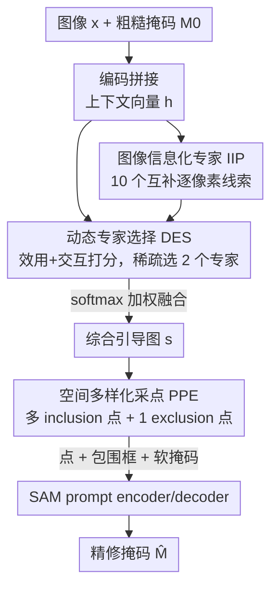

# PromptMoE: A Segmentation Refinement Framework Leveraging Mixture of Experts for Improved Prompting

**会议**: CVPR 2026  
**论文**: [CVF Open Access](https://openaccess.thecvf.com/content/CVPR2026/html/Price_PromptMoE_A_Segmentation_Refinement_Framework_Leveraging_Mixture_of_Experts_for_CVPR_2026_paper.html)  
**代码**: 无  
**领域**: 分割精修 / Segmentation Refinement  
**关键词**: 分割精修, 混合专家, SAM, prompt 生成, 模型无关

## 一句话总结
PromptMoE 把"给 SAM 出 prompt 来精修粗糙掩码"这件事，从固定启发式规则改成一个混合专家（MoE）问题：用 10 个互补的逐像素视觉线索当专家、一个稀疏路由器只挑出最相关的两个专家融合成引导图、再用一个空间多样化的采点模块在引导图上放置 prompt，在 5 个 benchmark 上相对最强基线平均提升 +6.24 IoU / +8.99 BIoU。

## 研究背景与动机
**领域现状**：分割精修（segmentation refinement）的目标是把某个基础预测器输出的粗糙掩码 $M_0$ 二次加工成边界更准的掩码。SAM 出现后，SAMRefiner、DualSight 等工作把精修重新定义成"给 SAM 生成合适的 prompt"问题——不再设计新的精修网络，而是想办法构造点/框/掩码 prompt，让冻结的 SAM 输出更干净的结果。这条路线的好处是模型无关（model-agnostic）：不绑定具体的基础预测器，也不用为每个任务重训。

**现有痛点**：当前的 prompt 式精修器都依赖**固定的 prompt 规则**，在四类失败模式上很脆。论文把它们归纳为 C1–C4：**C1 语义歧义**——SAM 优化的是"掩码与 prompt 的匹配度"而非类别语义，几乎相同的一个正点可能分出整个人、夹克、衬衫或领带，单个正点很难把目标约束住；**C2 prompt 内部干扰**——多个 prompt 组件各自单独表现都好，组合起来却可能偏向某个子区域（如车头中部）压制真实结构，所以不能简单堆 prompt；**C3 噪声输入**——粗糙掩码常有空洞、缺块、背景泄漏，固定的边缘距离启发式会被误导（如甜甜圈的假中心会被当成 inclusion 点）；**C4 图像特征多样**——指导 prompt 生成的图像线索高度依赖场景，在某些图上好用的线索换个场景就失效，而精修阶段又拿不到 ground truth 来挑线索。

**核心矛盾**：SAMRefiner 用固定的边缘距离启发式 + 单正点，在复杂/中空/细枝结构上很脆（C1/C3）；DualSight 用启发式多点最大化覆盖，却忽略初始掩码和 exclusion 点，还容易把点推到目标边缘的错误位置。两者的根本问题一致——**用一套与图像内容无关（content-agnostic）的固定策略去应对千变万化的失败模式**，失败模式或图像域一变就崩。

**本文目标 + 核心 idea**：与其押注一条固定启发式，不如准备一**组**互补的视觉线索专家，再**按图像动态地**挑选并融合最合适的专家来指导出 prompt。一句话概括：把 prompt 生成做成 prompt 级别的稀疏混合专家——**用图像信息化专家替代固定距离启发式（治 C3/C4），用稀疏路由动态选专家避免信号稀释（治 C4），用空间多样化采点平衡覆盖与置信度（治 C1/C2）**。

## 方法详解

### 整体框架
输入是一张图像 $x$ 和任意基础预测器给出的粗糙二值掩码 $M_0$，输出是精修后的掩码 $\hat{M}$。整个 pipeline 围绕一个叫 **Image-Informed Prompting (IIP)** 的框架展开，核心是三个协同模块。

先把图像和掩码各自编码、拼接成一个联合上下文向量 $h$，用它概括这张"图—掩码对"的整体特征。这个 $h$ 驱动 IIP 的两个关键模块：**Dynamic Expert Selector (DES)** 用 $h$ 预测每个专家对当前图—掩码对的期望效用、以及多个专家联用的额外增益，据此**只激活**少数几个既高效用又互补的专家，避免对全部专家做密集评估、也避免不相关线索稀释信号；被选中的专家各自产出一张逐像素引导图，按效用 softmax 加权融合成一张综合引导图 $s$。接着 **Prompt-Placement Explorer (PPE)** 拿这张融合引导图，迭代地把高分像素选成 inclusion 点、并强制点之间保持最小空间间隔以覆盖整个目标，再在低分背景区选一个 exclusion 点抑制背景泄漏。最后把这些点、$M_0$ 的紧致包围框、以及 $M_0$ 的软编码版本一起喂进 SAM 的 prompt encoder，解码出 $\hat{M}$。

### 关键设计

**1. Image-Informed Prompting：用一组互补视觉专家替代单一固定启发式**

针对的是 C3（噪声输入）和 C4（场景多样）——固定的边缘距离启发式在中空/细枝/噪声掩码上一旦判断错就全盘皆输。IIP 定义一组专家 $E = \{f_1, \dots, f_{|E|}\}$（共 10 个），每个专家 $e_i$ 从图像 $x$ 和掩码 $M_0$ 算一张归一化的逐像素引导图：

$$r_{e_i} = f_{e_i}(x, M_0) \in [0,1]^{H \times W}$$

其中数值越大表示该像素越可能属于目标。这组专家覆盖四类信号：(i) 外观（颜色、亮度、纹理），(ii) 几何（到边界的距离），(iii) 深度一致性（用 Marigold 单目深度），(iv) 区域/proposal 级结构（用 SAM 的区域提议）。它把传统图像处理线索（颜色、亮度、距离边界）和学习式模型信号（深度、区域提议）混在一起，从而对噪声鲁棒、跨任务跨域可泛化。关键在于"互补"——后面分析显示，最常被选为最优的专家也只在 16.06% 的样本上最优、最少的也有 7.45%，没有一个线索能通吃，所以需要一组而非一个。

**2. Dynamic Expert Selector：稀疏路由，只挑两个高效用且互补的专家**

C4 的延伸问题是：既然要一组专家，是不是把 10 个全融合就好？不行——密集评估全部专家既贵，错配的线索还会**稀释信号**反而掉点。DES 是一个轻量稀疏路由器，给定 $(x, M_0)$ 它不真去跑所有专家的图，而是先预测两类分数再决定激活谁。

**单专家效用** $U_{e_i}$：复用上下文向量 $h$，为每个专家学一个嵌入 $v_{e_i} \in \mathbb{R}^D$，把"上下文—专家对齐项 $h \odot v_{e_i}$、上下文 $h$、专家嵌入 $v_{e_i}$"拼成 $\omega_{e_i} \in \mathbb{R}^{3D}$，过一个小 MLP 得到归一化到 $[0,1]$ 的标量效用（值越大期望精修增益越大）：

$$U_{e_i} = \mathrm{MLP}_U(\omega_{e_i}) \in [0,1]$$

**成对交互** $I_{e_i,e_j}$：借鉴自然语言推理里的启发式匹配层，把两个专家嵌入的逐元素和、Hadamard 积、绝对差再加上下文 $h$ 拼成 $\varepsilon_{e_i,e_j} \in \mathbb{R}^{4D}$（分别捕捉聚合容量、共激活、对比），过第二个 MLP 得到联用相比单用的额外增益 $I_{e_i,e_j} = \mathrm{MLP}_I(\varepsilon_{e_i,e_j}) \in [0,1]$。最终的成对效用把单专家效用和交互合起来：

$$S_{e_i,e_j} = U_{e_i} + U_{e_j} + I_{e_i,e_j}$$

推理时遍历所有 $e_i < e_j$ 的无序对，取 $\arg\max$ 选出最佳一对 $(e_{i^*}, e_{j^*})$，再把两者效用做 softmax 当融合权重 $(w_{i^*}, w_{j^*})$，得到送给 PPE 的融合引导图：

$$r_{e_{i^*},e_{j^*}} = w_{i^*} r_{e_{i^*}} + w_{j^*} r_{e_{j^*}}$$

DES 分三阶段训练：阶段 1 用每个专家的 $q_e = \tfrac{1}{2}(\mathrm{IoU}_e + \mathrm{BIoU}_e)$ 算"遗憾" $r_e = q^* - q_e$（$q^*$ 是最佳单专家分），让效用头去拟合遗憾；阶段 2 冻结 $U$、训练交互头去预测成对增益 $\Delta_{e_i,e_j} = q_{e_i,e_j} - \max(q_{e_i}, q_{e_j})$；阶段 3 联合微调。为防早期专家坍缩，加了 gating 熵正则（样本级+批级）和对嵌入矩阵 $V$ 的软正交先验 $L_{\text{ortho}} = \lambda_{\text{ortho}} \lVert VV^\top - I \rVert_F^2$。实验里"选 2 个专家"恰好最优——1 个不够、3/4 个反而掉点，说明问题不是简单加专家能解，精挑才是关键。

**3. Prompt-Placement Exploration：形状自适应抑制半径，让点既覆盖全目标又不挤在一处**

针对 C1/C2——直接在引导图上取 top-k 高分像素会让点全挤在同一个高置信子区域，既无增量又会压制周边结构。PPE 先把第一个点放在融合引导图 $r_0 := r_{e_{i^*},e_{j^*}}$ 的全局最大处 $p_0 = \arg\max_p r_0(p)$，之后每放一个点就动态抑制其邻域。设抑制因子 $\tau \in (0,1]$，放下 $p_t$ 后取 $n = \lceil \tau |M_t| \rceil$（剩余可选像素里第 $\tau$ 分位的位置），令 $\rho_t = \mathrm{dist}_{M_t}(n, p_t)$ 为该分位距离，然后把 $p_t$ 的 $\rho_t$ 半径内全部像素排除并更新可选集：

$$E_{t+1} = E_t \cup \{ q \in M_t : \lVert q - p_t \rVert_2 \le \rho_t \}$$

下一个点 $p_{t+1}$ 选更新后引导图里的最高分像素（被排除处置 0）。用 $\tau$ 分位距离当半径的妙处是**形状自适应**：在细长/分叉结构上抑制半径自动扩张、在紧凑内部自动收缩，从而早期广覆盖、后期细放置，又不会过度抑制剩余细节。除 inclusion 点外，PPE 还在低分背景区放一个 exclusion 点抑制背景泄漏，最终配合 $M_0$ 的紧框和软掩码一起喂 SAM。

### 损失函数 / 训练策略
DES 全部预训练只在 VOC 2012 train（1464 张，80:20 划分）上做，粗糙掩码来自 DeepLabV3 / FCN-ResNet-50 / LR-ASPP-MobileNetV3。两个路由头都是 3 层 MLP（384 神经元，10% dropout），三阶段分别训 8 / 20 / 2 个 epoch，gating 熵权重 0.01/0.02，正交权重 $10^{-3}$。注意 SAM 本身全程冻结——PromptMoE 只学"怎么选专家、怎么放点"，不改 SAM 架构，这正是它模型无关的来源。

## 实验关键数据

### 主实验
五个 benchmark（BIG / DAVIS585 / ECSSD / MSRA-B / VOC）上报告相对未精修基础掩码的 $\Delta$IoU/$\Delta$BIoU（正值=改善），SAM 主干统一用 ViT-H：

| 方法 | BIG | DAVIS585 | ECSSD | MSRA-B | VOC | 平均 ΔIoU / ΔBIoU |
|------|-----|----------|-------|--------|-----|--------------------|
| 未精修（基线绝对值） | 78.25 / 70.11 | 80.05 / 83.00 | 81.41 / 70.23 | 75.15 / 61.88 | 66.73 / 60.08 | 76.32 / 69.06 |
| CascadePSP-Slow | +4.97 / +6.27 | −1.29 / −1.47 | +0.62 / +0.98 | +0.93 / +2.71 | +1.71 / +0.73 | +1.39 / +1.85 |
| SegRefiner-HR | +9.55 / +12.51 | −10.85 / −9.10 | −15.01 / −21.37 | −10.67 / −16.16 | −3.86 / −3.05 | −6.17 / −7.43 |
| DualSight | +3.89 / +4.63 | +1.48 / −0.57 | +1.99 / +4.50 | +2.08 / +6.79 | +3.29 / +6.29 | +2.55 / +4.33 |
| SAMRefiner | +6.84 / +9.50 | +3.33 / +2.03 | +5.10 / +9.69 | +4.67 / +10.35 | +7.05 / +9.74 | +5.40 / +8.26 |
| **PromptMoE（本文）** | +8.54 / +11.01 | **+3.64 / +2.35** | **+5.99 / +10.67** | **+5.10 / +10.48** | **+7.94 / +10.43** | **+6.24 / +8.99** |

PromptMoE 在 5 个数据集中的 4 个上全面最优，只在 BIG 上次于专为高分辨率细节微调过的 SegRefiner-HR（但仍有 +8.54/+11.01 的大幅增益）。相对最强通用基线 SAMRefiner，平均 +0.84/+0.73，即使在 SAMRefiner 自己的主力数据集 DAVIS585 上也有 +0.31/+0.32。自助法 95% 置信区间显示相对 SAMRefiner 的提升在全部数据集上统计显著（$\Delta\Delta$IoU 区间 [+0.38, +1.30]）。

### 消融实验
逐步去掉各组件，报告五数据集平均 $\Delta$IoU/$\Delta$BIoU（最后一行为完整模型）：

| 配置 | ΔIoU | ΔBIoU | 说明 |
|------|------|-------|------|
| 仅 1 正点 (PP) | −18.82 | −15.14 | 没框时单点远不够 |
| + 包围框 (B) | −0.71 | +3.62 | 框是最关键的标准组件 |
| + 粗糙掩码 (M) | +4.71 | +7.81 | 软掩码贡献大 |
| + 1 负点 (NP) | +5.48 | +8.42 | exclusion 点抑泄漏 |
| 5 正点 + NP + B + M | +5.63 | +8.50 | 多 inclusion 点 |
| + PPE | +6.00 | +8.83 | 空间多样化采点再涨 |
| + PPE + DES（完整） | +6.24 | +8.99 | 动态专家选择最后一跳 |

另一组 DES 路由策略对比（同样五数据集平均）：

| 路由策略 | 平均 ΔIoU | 平均 ΔBIoU |
|----------|-----------|------------|
| 最差单专家（oracle 下界） | +3.47 | +5.95 |
| 随机单专家 | +5.91 | +8.70 |
| 平均单专家（10 个均值） | +5.90 | +8.71 |
| 密集混合（全部专家） | +6.01 | +8.80 |
| DES（选 1） | +5.90 | +8.80 |
| **DES（选 2，本文）** | **+6.24** | **+8.99** |
| DES（选 3） | +5.92 | +8.68 |
| DES（选 4） | +5.87 | +8.66 |
| 最佳单专家（oracle 上界） | +7.90 | +11.13 |

### 关键发现
- **包围框是命门**：去掉框直接从 +6.24 暴跌到 −18.82，说明框提供了最强的空间约束；之后软掩码、exclusion 点、PPE、DES 依次叠加各贡献一档，DES+PPE 这两个本文创新合计带来 ~0.6 IoU 的额外增益。
- **专家不是越多越好**：选 2 个专家最优，密集混合全部 10 个反而（+6.01）不如精选 2 个，3/4 个也掉点——印证"信号稀释"的存在，精挑互补对 > 堆数量。即使最差单专家 oracle 也有 +3.47，说明这组专家整体质量高、选得好。
- **没有万能线索**：最常被选为最优的专家仅在 16.06% 样本上最优，且不同数据集选择分布差异显著，正是这种"按图换专家"的能力构成 PromptMoE 相对固定启发式的核心优势。
- **效率可调**：DES 只激活子集把精修耗时降约 59.9% 还顺带提精度；PromptMoE-Lite 限定 6 个最快专家几乎不掉点（+6.16 vs +6.24）、延迟再降 37.9%。换更大主干 SAM-HQ 可进一步到 +7.20/+9.74，且在 BIG 上反超 SegRefiner-HR。

## 亮点与洞察
- **把 MoE 用在 prompt 生成层而非模型架构层**：此前 MoSE、Sparse-MoE-SAM 都是往 SAM 内部塞专家块/形状字典来改架构、只在特定域有效；PromptMoE 让 SAM 全程冻结，MoE 路由的是"逐像素图像处理线索"，因此天然模型无关、跨任务跨域——这个切入点的迁移性最强。
- **路由器同时建模单专家效用和成对交互**：大多数稀疏 MoE 只学单专家 gating，这里额外用一个交互头预测"两个专家联用相比单用的增量"，并用三件套（和/积/绝对差）构造成对特征——这套从 NLI 匹配层借来的设计，恰好捕捉了 C2 里"组件单独好但组合会互相干扰"的本质。
- **形状自适应抑制半径**：PPE 用 $\tau$ 分位距离当抑制半径，让采点在细长结构上自动散开、紧凑区域自动收紧，是一个很轻量却优雅地解决"多点既要覆盖又不要扎堆"的 trick，可直接迁移到任何需要在显著性图上撒种子点的任务。

## 局限与展望
- **细薄多孔结构仍弱**：PromptMoE 依赖 SAM 的 mask decoder，继承了 SAM 在细薄/多孔结构上的固有短板；专门为高分辨率细结构微调的 SegRefiner-HR 在 BIG 上仍更强。
- **算力偏重**：完整版的密集专家评估 + 成对枚举本身不便宜，需要 DES 和 PromptMoE-Lite 来压延迟，相比单点启发式仍有 runtime 开销（Lite 版相对 SAMRefiner 平均 <20% 增量）。
- **专家集靠人工设计**：10 个专家是手工挑的传统/学习线索组合，⚠️ 论文把每个专家的具体实现放在补充材料，正文未展开；专家集本身是否最优、能否端到端学出新专家是开放问题。
- **DES 只在 VOC 上训**：路由器仅用 VOC train + 三种基础预测器掩码预训练，其余四个数据集是 OOD 评测；虽然结果好，但路由策略对训练分布的依赖程度值得进一步分析。

## 相关工作与启发
- **vs SAMRefiner**：SAMRefiner 用框+软掩码+一个距离引导的中心正点（外加可选负点）来抗噪，但单正点难解语义歧义、固定边缘距离启发式在中空/细枝上脆。PromptMoE 用动态专家替代固定距离、用多点+exclusion 替代单正点，全面治住 C1/C3，五数据集统计显著超越。
- **vs DualSight**：DualSight 也加多点但用启发式最大化点间隔，且忽略初始掩码和 exclusion 点，常把点推到目标边缘的错误位置（content-agnostic）。PromptMoE 的 PPE 是内容感知的——点放在融合引导图的高分处再做形状自适应抑制，既覆盖又准。
- **vs CascadePSP / SegRefiner**：这两个是传统精修器（级联边界细化 / 扩散去噪），模型无关但不走 prompt 路线，在多数 OOD 数据集上甚至掉点（SegRefiner-HR 因专为 BIG 微调而仅在 BIG 强）。PromptMoE 证明"prompt 生成 + 动态专家"在通用性上更稳。
- **vs 架构级 MoE-SAM（MoSE / Sparse-MoE-SAM）**：它们把 MoE 塞进 SAM 内部改架构、绑定特定域；PromptMoE 在 prompt 层路由图像处理专家、不动 SAM，模型无关性是本质区别。

## 评分
- 新颖性: ⭐⭐⭐⭐⭐ 首个在 prompt 生成层做 MoE 的精修框架，切入点（路由图像线索而非改 SAM 架构）干净且迁移性强。
- 实验充分度: ⭐⭐⭐⭐⭐ 五数据集三类任务、组件消融、路由策略对比、效率/主干可移植性、bootstrap 显著性检验都覆盖了。
- 写作质量: ⭐⭐⭐⭐ C1–C4 四个挑战 + 配图把动机讲得很清楚，但 10 个专家的具体定义全压进补充材料，正文略空。
- 价值: ⭐⭐⭐⭐ 模型无关、即插即用、跨任务跨域，对需要高边界精度的下游（医学、质检）有实际价值。

<!-- RELATED:START -->

## 相关论文

- [\[AAAI 2026\] Generalizable Slum Detection from Satellite Imagery with Mixture-of-Experts](../../AAAI2026/segmentation/generalizable_slum_detection_from_satellite_imagery_with_mixture-of-experts.md)
- [\[CVPR 2026\] M4-SAM: Multi-Modal Mixture-of-Experts with Memory-Augmented SAM for RGB-D Video Salient Object Detection](m4-sam_multi-modal_mixture-of-experts_with_memory-augmented_sam_for_rgb-d_video_.md)
- [\[CVPR 2026\] PR-MaGIC: Prompt Refinement Via Mask Decoder Gradient Flow For In-Context Segmentation](pr-magic_prompt_refinement_via_mask_decoder_gradient_flow_for_in-context_segment.md)
- [\[CVPR 2026\] Mixture of Prototypes for Test-time Adaptive Segmentation](mixture_of_prototypes_for_test-time_adaptive_segmentation.md)
- [\[CVPR 2025\] Spatio-Semantic Expert Routing Architecture with Mixture-of-Experts for Referring Image Segmentation](../../CVPR2025/segmentation/spatio-semantic_expert_routing_architecture_with_mixture-of-experts_for_referrin.md)

<!-- RELATED:END -->
