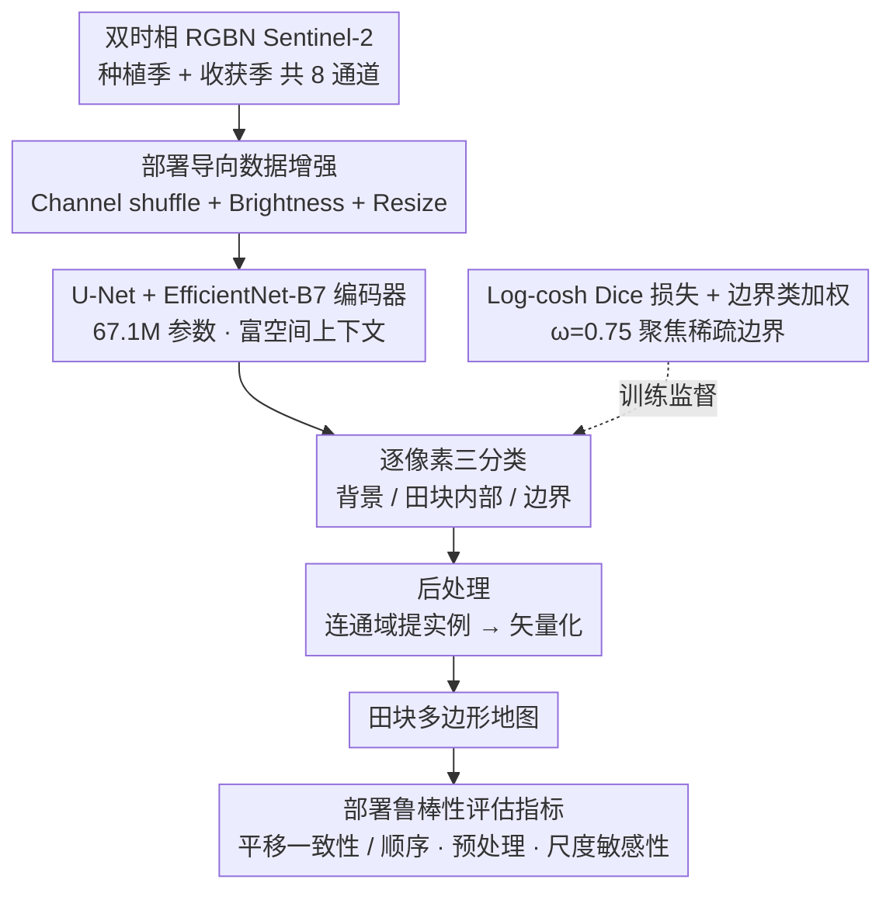

# PRUE: A Practical Recipe for Field Boundary Segmentation at Scale

**会议**: CVPR 2026  
**arXiv**: [2603.27101](https://arxiv.org/abs/2603.27101)  
**代码**: [https://github.com/fieldsoftheworld/ftw-prue](https://github.com/fieldsoftheworld/ftw-prue)  
**领域**: 语义分割 / 遥感  
**关键词**: 农田边界分割, 地理空间基础模型, U-Net, 部署鲁棒性, 大规模制图

## 一句话总结

本文对18个分割和地理空间基础模型（GFM）进行了系统性评估，提出PRUE——一种结合U-Net骨干、复合损失函数和针对性数据增强的农田边界分割方案，在FTW基准上达到76% IoU和47% object-F1，分别比baseline提升6%和9%，同时提出了一套评估部署鲁棒性的新指标。

## 研究背景与动机

1. **领域现状**：大规模农田边界地图对于农业监测至关重要，深度学习方法（尤其是U-Net语义分割）已成为卫星图像农田边界提取的主流。

2. **现有痛点**：现有方法对光照变化、空间尺度变化和地理位置迁移非常敏感。将最佳模型部署到大区域时会出现拼接伪影(tiling artifacts)、边界不连续等质量问题。

3. **核心矛盾**：传统评估只关注patch级的IoU/F1等指标，无法反映模型在大规模地图制作时的实际部署问题——包括平移一致性、输入顺序敏感性、预处理规范敏感性、空间尺度敏感性等。

4. **本文目标** 系统性找到最优的模型架构-损失函数-数据增强组合，同时提出一套部署导向的鲁棒性评估指标，使模型能可靠地进行国家级别的大规模农田边界制图。

5. **切入角度**：将问题建模为"bake-off"系统评测，对语义分割、实例分割和GFM三大类共18个模型进行统一实验对比，逐一消融架构、损失、增强等设计选择。

6. **核心 idea**：通过系统性的模型设计空间探索（而非架构创新），组合U-Net+EfficientNet-B7、log-cosh Dice损失、通道shuffle和亮度/缩放增强，实现精度与部署鲁棒性的共同优化。

## 方法详解

### 整体框架

PRUE 不引入新模块，而是把"哪种架构 + 哪种损失 + 哪种增强"这套设计空间系统性地搜了一遍，挑出对农田边界分割最稳的组合。输入是双时相 RGBN Sentinel-2 影像——种植季和收获季各 4 通道、共 8 通道，让模型既看到作物生长又看到收获后的裸地纹理。这 8 通道送进编码器-解码器，输出背景 / 田块内部 / 边界三类的逐像素概率；再用连通域分析把"内部"区域抠出来、按边界切开，最后多边形化成单个田块实例。整条链路是「分割 → 像素分类 → 连通域提实例 → 矢量化」，精度和大规模制图时的拼接质量都靠前半段的分割质量撑着。下图把这套 recipe 串起来：增强在输入端先抖、骨干编码、损失在训练时监督三分类输出，后处理出矢量地图，最后用部署鲁棒性指标量它好不好用。

### 关键设计

**1. U-Net + EfficientNet-B7 编码器：用更大的骨干换更丰富的空间上下文**

农田形态千变万化，尤其是不规则小农田，骨干表征能力不够就会把相邻田块糊成一片。作者把 FCN、UPerNet、FCSiam 和多种 U-Net 变体放在同一基准上对比，最后选了 U-Net 配 EfficientNet-B7 编码器：相比 FTW baseline 用的 B3，它把模型容量提了上来（67.1M 参数），捕获更大范围的空间上下文，但因为损失和增强都配合得当，并没有过拟合。这个 67.1M 的体量也正好落在精度-吞吐量权衡的甜点区——既比 GFM 小一个数量级，又能跑到 306.94 km²/s 的推理吞吐，满足国家级制图的速度要求。

**2. Log-cosh Dice 损失 + 边界类加权：把模型的注意力强行拉到稀疏的边界像素上**

农田边界像素在整图里占比极小，普通损失会被海量的背景和内部像素淹没，边界训不出来。作者对比了 CE、Dice、Focal、Tversky、Jaccard 等一圈损失，选定 log-cosh Dice：log-cosh 变换给 Dice 套了一层平滑，缓解了 Dice 在训练初期梯度剧烈震荡的毛病，优化 landscape 更稳。在此基础上再把三类的归一化权重设成 $[0.05, 0.20, 0.75]$，即边界权重 $\omega=0.75$，显式告诉模型边界这一类最值得抠。消融里这一步是涨点主力：加上 $\omega=0.75$ 后 IoU 从 0.68 跳到 0.74，再换 log-cosh Dice 进一步到 0.77。

**3. 部署导向的数据增强（Channel Shuffle + Brightness + Resize）：把真实部署里会变的东西，提前在训练里抖一遍**

实验室里 patch 精度再高，搬到大区域制图也可能翻车——用户喂进来的时相顺序、辐射预处理、影像分辨率都可能和训练时不一样，模型一旦对这些敏感，拼图就会出现接缝伪影。作者针对这三种变化各设计一种增强：Channel shuffle 随机交换种植/收获期的通道，逼模型对输入顺序不变；Brightness 增强模拟 Sentinel-2 不同辐射归一化下的明暗差异；Resize 增强模拟不同空间分辨率。三者作用互补——消融里单加 Channel shuffle 就把输入顺序敏感度从 0.07/0.11 压到 0.00/0.00，单加 Brightness+Resize 把尺度敏感度从 0.15/0.12 压到 0.00/0.01，组合起来所有鲁棒性指标几乎全部归零。

**4. 部署鲁棒性评估指标：给"地图好不好用"立一套传统 IoU 量不到的标尺**

传统评测只报 patch 级的 IoU/F1，但这些数字预测不了大规模拼图时的接缝质量。作者补了四个面向部署的指标：**平移一致性**衡量同一区域被 4 个角不同裁剪覆盖时，重叠处预测的一致率（越高说明拼接越无缝）；**输入顺序敏感性**测通道排列变化下的性能波动；**预处理不变性**测不同辐射归一化方案下的性能波动；**空间尺度敏感性**测不同分辨率输入下的性能波动。后三者都是"差异越小越好"，理想值趋近 0。正是这套指标让"哪个增强真正解决了哪种部署脆弱性"变得可量化，也成了 PRUE 区别于纯刷 IoU 工作的核心方法论贡献。

### 损失函数 / 训练策略

总损失为带类权重 $[0.05, 0.20, 0.75]$ 的 log-cosh Dice。训练用 Adam，学习率在 $\{10^{-4}, 3\times10^{-4}, 3\times10^{-3}, 10^{-2}, 3\times10^{-2}\}$ 中扫描后选定。对 presence-only 的国家（只标了正样本、没有负样本标注），训练时把未知标签像素 mask 掉，避免把"未标注"误当成"背景"惩罚模型。

## 实验关键数据

### 主实验

| 模型 | 类别 | IoU ↑ | Object-F1 ↑ | AP0.5 ↑ | 参数量(M) | 吞吐量(km²/s) |
|------|------|-------|-------------|---------|-----------|---------------|
| **PRUE (ours)** | 语义分割 | **0.76** | **0.47** | 0.40 | 67.1 | 306.94 |
| FTW-Baseline | 语义分割 | 0.70 | 0.38 | 0.39 | 13.2 | 623.28 |
| Mask2Former | 实例/全景 | 0.68 | 0.39 | 0.44 | 68.8 | 26.66 |
| Clay (ViT-L) | GFM | 0.67 | 0.36 | 0.41 | 363.8 | 10.98 |
| Galileo (ViT-B) | GFM | 0.66 | 0.32 | 0.37 | 119.0 | * |
| SAM (fine-tuned) | 实例分割 | 0.45 | 0.37 | 0.19 | 642.7 | 0.17 |
| Del-Any (zero-shot) | 实例分割 | 0.37 | 0.09 | 0.10 | 56.9 | 87.32 |

### 消融实验

| 配置 | Object-F1 ↑ | IoU ↑ | 输入顺序Δ↓ | 亮度Δ↓ | 尺度Δ↓ | 一致性↑ |
|------|------------|-------|-----------|--------|--------|---------|
| FTW-Baseline | 0.39 | 0.68 | 0.07/0.11 | 0.04/0.05 | 0.15/0.12 | 0.93 |
| +Brightness+Resize | 0.38 | 0.66 | 0.06/0.10 | 0.02/0.03 | 0.00/0.01 | 0.95 |
| +Channel shuffle | 0.39 | 0.68 | 0.00/0.00 | 0.04/0.05 | 0.17/0.14 | 0.94 |
| +ω=0.75 | 0.42 | 0.74 | 0.08/0.11 | 0.07/0.07 | 0.29/0.15 | 0.95 |
| +log-cosh Dice | 0.44 | 0.77 | 0.09/0.13 | 0.06/0.05 | 0.36/0.20 | 0.94 |
| **PRUE (全组合)** | **0.47** | **0.76** | **0.00/0.00** | **0.00/0.00** | **0.01/0.01** | **0.95** |

### 关键发现

- GFM尽管参数量大3-10倍，仍全面落后于精心优化的U-Net，最好的Clay (ViT-L, 363.8M) IoU仍比PRUE低9%。这说明对于此任务，GFM的粗粒度patch嵌入分辨率不足
- 系统性的设计优化（损失+增强+权重）比架构选择更重要——同一U-Net架构通过组合优化提升了9% F1
- 各增强手段效果互补：Channel shuffle消除输入顺序依赖，Brightness+Resize消除亮度和尺度依赖，组合后所有鲁棒性指标近乎完美
- 实例分割模型（SAM、Delineate Anything）在零样本设置下效果较差，因为农田边界不符合典型目标检测的包围框假设

## 亮点与洞察

- **部署导向评估指标体系**：首次为地理空间分割提出了系统性的部署鲁棒性评估指标，包括平移一致性、输入顺序/预处理/尺度敏感性。这套方法论可迁移到所有需要大规模拼图推理的遥感任务
- **"Recipe"思维优于"Architecture"思维**：论文证明，在成熟的分割架构上做系统性的工程优化（损失、增强、权重），效果远好于引入更复杂的架构或更大的基础模型。这对工业落地很有指导意义
- Channel shuffle实现输入顺序不变性的技巧非常简洁且零成本，可直接迁移到所有多时相遥感任务

## 局限与展望

- 仍依赖连通域后处理来提取实例，无法直接输出实例级别的分割，对相邻田块的分离能力受限于边界预测质量
- 模型仅使用双时相输入，未利用时间序列信息（如PASTIS用的时序Sentinel-2）
- 评估仅在Sentinel-2 10m分辨率上进行，向更高分辨率（如PlanetScope 3m）的迁移尚未充分验证
- 国家级地图仅覆盖5个国家，全球推广仍需验证更多地理和农业类型的泛化性

## 相关工作与启发

- **vs FTW Baseline**: 同为U-Net语义分割，PRUE通过系统优化损失/增强/编码器实现IoU +6%, F1 +9%的提升
- **vs GFMs (Clay/Galileo等)**：GFM有更强的通用表征但分辨率不足，在细粒度边界分割上显著落后，且推理吞吐量低1-2个数量级
- **vs Delineate Anything**: 专为田块分割设计的YOLOv11实例分割方法在FTW上零样本效果一般（IoU=0.37），说明任务特定训练仍然必要

## 评分

- 新颖性: ⭐⭐⭐ 方法上没有新模块，核心是系统性的工程优化，但部署鲁棒性指标有原创贡献
- 实验充分度: ⭐⭐⭐⭐⭐ 18个模型的大规模对比非常全面，消融实验覆盖损失/增强/架构/权重多个维度，还发布了5个国家的地图
- 写作质量: ⭐⭐⭐⭐ 论文结构清晰，实验组织合理，部署指标的动机阐述很有说服力
- 价值: ⭐⭐⭐⭐ 对遥感社区的实用价值很高，提供了可复现的最优实践方案和公开的模型/数据

<!-- RELATED:START -->

## 相关论文

- [\[CVPR 2026\] GABI: Geometry-Aware Boundary Integration for Spacecraft Segmentation](gabi_geometry-aware_boundary_integration_for_spacecraft_segmentation.md)
- [\[CVPR 2026\] FoV-Net: Rotation-Invariant CAD B-rep Learning via Field-of-View Ray Casting](fov-net_rotation-invariant_cad_b-rep_learning_via_field-of-view_ray_casting.md)
- [\[CVPR 2026\] XSeg: A Large-scale X-ray Contraband Segmentation Benchmark for Real-World Security Screening](xseg_a_large-scale_x-ray_contraband_segmentation_benchmark_for_real-world_securi.md)
- [\[CVPR 2026\] Unsupervised Multi-Scale Segmentation of 3D Subcellular World with Stable Diffusion Foundation Model](unsupervised_multi-scale_segmentation_of_3d_subcellular_world_with_stable_diffus.md)
- [\[CVPR 2026\] Making Training-Free Diffusion Segmentors Scale with the Generative Power](making_training-free_diffusion_segmentors_scale_with_the_generative_power.md)

<!-- RELATED:END -->
