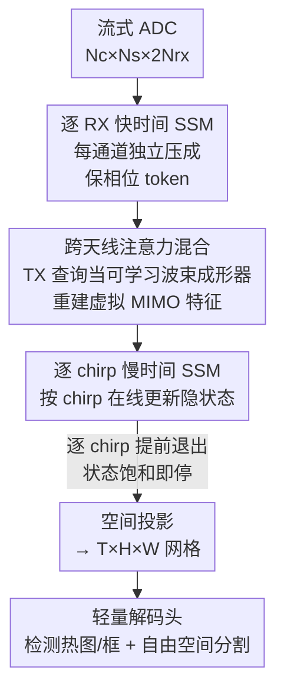

# RAVEN: Radar Adaptive Vision Encoders for Efficient Chirp-wise Object Detection and Segmentation

**会议**: CVPR 2026  
**论文**: [CVF Open Access](https://openaccess.thecvf.com/content/CVPR2026/html/Sen_RAVEN_Radar_Adaptive_Vision_Encoders_for_Efficient_Chirp-wise_Object_Detection_CVPR_2026_paper.html)  
**代码**: 待确认  
**领域**: 雷达感知 / 目标检测 / 自由空间分割  
**关键词**: FMCW 雷达、状态空间模型、虚拟 MIMO、流式逐 chirp 推理、提前退出

## 一句话总结
RAVEN 把毫米波 FMCW 雷达的原始 ADC 流当作"按 chirp 到达的时序"来处理：用每接收通道独立的状态空间模型保住 MIMO 阵列的相位结构，再用一个轻量 cross-attention 当"可学习波束成形器"重建虚拟天线特征，并通过逐 chirp 提前退出在一帧还没收完时就出检测/分割结果，最终在两个车载雷达数据集上拿到 SOTA，同时把计算量压低多达 170×、端到端延迟降 4×。

## 研究背景与动机
**领域现状**：毫米波雷达在恶劣天气/光照下比相机和 LiDAR 更鲁棒，还能靠多普勒直接测速、功耗体积更小，是自动驾驶/无人机的重要传感器。主流雷达感知流水线走的是"帧式（frame-based）"范式——先把一整帧所有 ADC 采样收齐，沿 range/angle/Doppler 三个维度做一连串 FFT 拼出高分辨的 RAD（range–angle–Doppler）张量，再用稠密 CNN/Transformer 去解码。

**现有痛点**：帧式范式有两个硬伤。一是**延迟被锁死**在至少一帧的间隔——必须等所有 chirp 收完才能动；二是 RAD 张量又大又贵（3TX×4RX 配置就是 256×64×12 这种 3D 网格），传输和推理成本随天线数、带宽迅速膨胀，在嵌入式平台和高速场景上根本跑不动。流式逐 chirp 模型（边收 chirp 边更新状态）是一条出路，但现有轻量序列方法在目标检测这种复杂任务上表现很差。

**核心矛盾**：作者点出现有流式方法掉点的两个根因。其一，它们往往**在流水线很早就把接收通道压缩/混合掉**（比如把每个 RX 通道降成标量再平均），这等价于施加一个固定均匀波束成形器，把 MIMO 阵列编码角度的相对相位差直接抹掉，下游层拿到的 token 失去了空间分辨能力。其二，在 DDM（多普勒分割复用）系统里，不同发射天线的回波在频域上交织、潜伏在每个接收流里，早期不显式分离会让不同 TX 的虚拟阵元混叠（aliasing），角度估计随之恶化、检测精度下降。

**本文目标**：要一个既**保持 MIMO 结构显式可用**、又**流式友好**的编码器，并且能在"还没收满一帧"时就提前出结果。

**切入角度**：作者不把 ADC 当通用时序，而是吃透 FMCW MIMO 的信号与阵列物理——每个目标产生与距离/多普勒绑定的拍频，$N_{rx}$ 元阵列通过天线间确定性相移编码角度（即 steering vector）。既然角度信息藏在通道间相位差里，就该先按通道独立处理、再显式跨天线混合，而不是指望深层网络隐式学出几何。

**核心 idea**：用"每 RX 独立 SSM（保相位）+ 可学习 TX 查询做 cross-attention（重建虚拟 MIMO，免 FFT/RAD）+ 逐 chirp SSM 配标定停止准则（提前退出）"这套物理启发的混合架构，替换掉早期通道混合的帧式/流式方案。

## 方法详解

### 整体框架
RAVEN 把流式 ADC 采样变成 BEV 检测框 + 自由空间分割图，整条管线分五段：① **快时间（fast-time）逐 RX SSM**——每个接收通道用一个独立小 SSM（Mamba 块）把该 chirp 的 I/Q 序列压成一个保留每天线距离/相位信息的紧凑 token；② **跨天线注意力**——把同一 chirp 的各 RX token 用轻量 attention 融合，重建虚拟 MIMO 特征；③ **慢时间（slow-time）逐 chirp SSM**——按 chirp 顺序读入、维护隐状态，支持在线/anytime 推理；④ **空间投影**——把序列特征映射成 $T\times H\times W$ 网格供 2D 解码；⑤ **轻量解码头**——浅层 CNN 解码出检测热图/框 + 自由空间分割图。配合训练时的多前缀监督和推理时的标定停止准则，模型能只用一帧里前一小段 chirp 就下决策。

输入记号：一帧是 $N_c$ 个 chirp（慢时间），每个 chirp 有 $N_s$ 个快时间采样，接收 $N_{rx}$ 通道、发射 $N_{tx}$ 通道，复数 I/Q 所以通道维是 $2N_{rx}$，整帧 $\mathbf{X}\in\mathbb{R}^{N_c\times N_s\times 2N_{rx}}$。

### 关键设计

**1. 逐 RX 并行快时间 SSM 编码器：先按天线独立处理，保住编码角度的相位差**

针对"早期通道混合抹掉空间分辨"这个痛点，RAVEN 拒绝在入口就把 RX 通道压成标量或共享 1×1 混合（那等价于固定均匀波束成形器，把 $N_{rx}$ 维阵列响应坍缩成一个值）。它给每个接收通道 $r$ 配一个**自己的**状态空间编码器 $\mathrm{SSM}_r:\mathbb{R}^{N_s\times2}\to\mathbb{R}^{N_s\times2}$（Mamba 实现），对第 $k$ 个 chirp 的快时间 I/Q 序列 $\mathbf{x}_{r,k}$ 编码后自适应池化成一个 2 维 token $\mathbf{f}_{r,k}=\mathrm{Pool}_1(\tilde{\mathbf{z}}_{r,k}^\top)\in\mathbb{R}^2$，把所有 RX 堆起来得到 $\mathbf{F}_k\in\mathbb{R}^{N_{rx}\times2}$。关键在于"独立"二字——因为不同 RX 看同一目标的相位轮廓由阵列几何决定，只有不提前跨通道混合，才能把每天线的相位/幅度结构原封不动留给下一阶段，让网络后面有机会恢复角度。SSM 的线性时间流式特性又保证这一步既紧凑又能边收边算。

**2. 跨天线注意力混合：用可学习 TX 查询当"波束成形器"重建虚拟 MIMO，绕开 FFT 和 RAD 张量**

这是全文最巧的设计，专治 DDM 系统里"不同 TX 回波频域交织、虚拟阵元混叠"的问题。对每个 chirp，先把各 RX 的 2 维摘要升维并加可学习的 RX 嵌入 $\mathbf{H}^{rx}_k=\mathbf{W}_{in}\mathbf{F}_k+\mathbf{E}^{rx}$；再引入一组**可学习的 TX 查询** $\mathbf{Q}\in\mathbb{R}^{N_{tx}\times d}$，以 query=TX、key/value=RX 做 cross-attention：

$$\mathrm{Attn}(\mathbf{q},\mathbf{k},\mathbf{v})=\mathrm{softmax}\!\left(\frac{\mathbf{q}\mathbf{k}^\top}{\sqrt{d}}\right)\mathbf{v}\in\mathbb{R}^{N_{tx}\times d}$$

加 TX 侧残差与 FFN 得到 $\mathbf{T}\in\mathbb{R}^{N_{tx}\times d}$。这些 TX 查询的作用就像在 RX token 场里搜索的可学习 steering vector，从交织的接收信号中把不同 TX 的贡献分离出来。然后对每个虚拟阵元对 $(r,t)$ 把对应 RX、TX token 拼接投影成紧凑 2 维特征 $\mathbf{p}_{r,t}=\mathbf{W}_{pair}[\mathbf{h}^{rx}_r;\mathbf{t}_t]\in\mathbb{R}^2$，堆叠并向量化、归一化后得到每 chirp 输出 $\mathbf{y}_k\in\mathbb{R}^{2N_{rx}N_{tx}}$。这等于**直接从流式信号重建虚拟阵列特征**——既不构造 RAD 张量，也不跑昂贵的 FFT 流水线，却保住了精确定位所需的空间信息，而且开销对 SSM 主干来说几乎可忽略。"成对融合"让网络能强调天线间相位一致的回波，天然兼容 DDM。

**3. 逐 chirp 慢时间 SSM + 子帧提前退出：用状态饱和度决定"何时该停"**

为了把延迟从"一帧"降到"子帧"，慢时间 SSM 按 chirp 顺序读入 $\mathbf{Z}=[\mathbf{z}_1,\dots,\mathbf{z}_{N_c}]$，维护紧凑隐状态支持 anytime 决策。它的依据是个物理观察：对匀速目标，多普勒 FFT 要 $N_c$ 个 chirp 才能达到速度分辨率 $\Delta v$，但检测往往容忍更粗的 $\Delta v$，所以相邻 chirp 主要贡献差分运动信息、检测性能在少量 chirp 后就饱和、再加 chirp 收益递减。

训练上用**多前缀深监督**（multi-prefix supervision）落地：取一组 chirp 前缀长度 $\mathcal{L}=\{L_1,\dots,L_M\}$（$L_M=N_c$），对每个前缀 $\mathbf{Z}^{(L)}_*$ 都过同一套投影和解码头出预测，并都用同一帧的真值监督，得到 $\mathcal{L}_{task}=\sum_{L\in\mathcal{L}}[\ell_{det}(\widehat{\mathrm{Det}}^{(L)},\mathrm{Det}^\star)+\ell_{seg}(\widehat{\mathrm{Seg}}^{(L)},\mathrm{Seg}^\star)]$，逼模型在更早的 chirp 上就收敛出可用结果。推理上用**标定停止准则**：对每个新 chirp 的隐状态 $\mathbf{z}_L$，量它相对此前各 chirp 的"新颖度"——最小余弦距离 $d_L=\min_{1\le j<L}(1-\frac{\mathbf{z}_L^\top \mathbf{z}_j}{\|\mathbf{z}_L\|\|\mathbf{z}_j\|})$。由于解码器按 $K$ 个池化 chirp 成块工作，再算块平均分 $\bar{d}_m=\frac1K\sum_{L=(m-1)K+1}^{mK}d_L$，取最早满足 $\bar{d}_m\le\tau$ 的块作为退出点 $L_{exit}=K\min\{m:\bar{d}_m\le\tau\}$。一旦潜在动态饱和（$d_L$ 跌破标定阈值 $\tau$，实测 $\tau=0.2$），后续 chirp 几乎无增益，就立刻停，省下编码器 FLOPs 和延迟。

### 损失函数 / 训练策略
RADIal 上联合训练自由空间分割 + 车辆检测：分割用 Jaccard(IoU) loss，检测用 Focal loss + Smooth L1 回归；Adam（lr $1\times10^{-4}$、weight decay $5\times10^{-6}$）、batch 8、200 epoch。RaDICaL 上训 BEV 占据分割，主损失用 BCE，batch 8、300 epoch。所有前缀共享真值的深监督目标是提前退出能力的关键。

## 实验关键数据

### 主实验
两个 77GHz 车载雷达数据集：RaDICaL（4RX×2TX TDM）和 RADIal（12TX×16RX DDM、192 虚拟天线）。效率用 MACs / 参数量 / RTX 4060 移动 GPU 上的单帧延迟衡量。

RaDICaL 占据分割（节选 Table 1）：

| 模型 | GMACs ↓ | Params(M) ↓ | Dice ↑ | Chamfer ↓ |
|------|---------|-------------|--------|-----------|
| FFT-RadNet | 41.74 | 4.25 | 0.996 | 0.076 |
| UNet | 15.14 | 17.27 | 0.996 | 0.078 |
| SSMRadNet | 0.108 | 0.566 | 0.996 | 0.086 |
| ChirpNet-Attn | 0.350 | 3.761 | 0.991 | 0.091 |
| **RAVEN (Ours)** | **0.053** | **0.347** | **0.997** | 0.082 |

RAVEN 用 0.053 GMACs 拿到 0.997 Dice，相对 FFT-RadNet（41.74 GMACs/4.25M）约 **790× 更低计算、12× 更少参数**，边界质量近 SOTA。

RADIal 分割+检测（节选 Table 2）：

| 模型 | mIoU ↑ | F1 ↑ | mAP ↑ | RE(m) ↓ | GMACs ↓ | Params(M) ↓ | Lat.(ms) ↓ |
|------|--------|------|-------|---------|---------|-------------|-------------|
| FFT-RadNet | 0.74 | 0.88 | 0.97 | 0.14 | 146.82 | 3.80 | 53.59 |
| TransRadar | 0.82 | 0.93 | 0.95 | 0.15 | 171.50 | 3.70 | — |
| T-FFTRadNet | 0.79 | 0.87 | 0.88 | 0.16 | 97.00 | 9.60 | 52.90 |
| SSMRadNet | 0.79 | 0.77 | 0.83 | 0.14 | 1.67 | 0.31 | 14.20 |
| **RAVEN (Sub-frame)** | 0.85 | 0.89 | 0.88 | 0.17 | **0.27** | 1.51 | **9.15** |
| **RAVEN (Full Frame)** | **0.90** | **0.93** | 0.95 | **0.12** | 1.02 | 1.51 | 20.08 |

全帧版 mIoU 0.90、F1 0.93、最低距离/角度误差（RE 0.12m、AE 0.10°），仅 1.02 GMACs——比 TransRadar（171.5）约 **170× 更省算**、比 T-FFTRadNet（97）约 95× 更省，精度还匹配甚至超过它们。

### 消融实验
论文用提前退出/chirp 预算分析充当核心消融（Figure 6 + 子帧 vs 全帧对比）：

| 配置 | 表现 | 说明 |
|------|------|------|
| Full Frame（256 chirp） | mIoU 0.90 / 20.08ms | 收满一帧，精度上限 |
| Sub-frame（自适应退出） | mIoU 0.85 / 9.15ms / 0.27 GMACs | 提前退出，延迟≈减半、算力降到 1/4 |
| chirp 预算 256→32~64 | >2× 加速、精度损失极小 | 验证集上 32→64 有增益、之后基本持平 |

### 关键发现
- **跨天线注意力是检测能涨上去的关键**：保住虚拟 MIMO 结构让 RAVEN 在 mAP/角度误差上能和重型 FFT/Transformer 模型掰手腕，而早期混合通道的轻量序列模型（如 ChirpNet GRU mIoU 仅 0.64）就上不去。
- **chirp 信息有明确"膝点"**：训练集余弦距离聚合显示新 chirp 贡献快速饱和、出现拐点，催生 $\tau=0.2$ 这个自然阈值；性能在约 64 个 chirp 后就趋平，而内存和延迟却随 chirp 数线性涨，所以砍 chirp 几乎免费提速。
- **场景质量决定提前退出可靠性**：结构化多车场景里早期 chirp 形成粗假设、后续精修且抑制幻觉；但杂乱/噪声场景下 chirp 相似度信号变得不稳，分割可能始终不可靠——这是提前退出的天然边界。

## 亮点与洞察
- **把"波束成形"做成可学习的注意力**：TX 查询当 steering vector 在 RX token 场里搜索、成对融合重建虚拟阵列，等于用 attention 替代了 FFT + RAD 张量这整套重流水线，既省算又对 DDM 友好——这个"注意力即波束成形器"的视角可迁移到任何需要从多通道相位里恢复几何的传感任务。
- **用隐状态余弦距离做提前退出判据**：不另挂重的辅助置信度头，直接拿慢时间 SSM 状态的"新颖度饱和"当停止信号，工程上极简且物理可解释（对应多普勒信息饱和）。
- **物理先验换来数量级效率**：不把 ADC 当通用时序、而是按 FMCW MIMO 的相位/阵列物理设计编码器，让一个 0.35M~1.5M 参数的小模型在边缘 GPU 上匹敌几百 GMACs 的帧式大模型，是"领域物理 > 暴力堆参数"的好例子。

## 局限与展望
- **DDM 的 TX 分离靠学习而非显式匹配滤波**：cross-attention 只是"近似"分离潜伏 TX 结构，论文未给出分离质量的直接量化，复杂多目标/强杂波下能否稳定解混存疑。
- **提前退出在噪声场景失效**：作者自己承认杂乱场景里 chirp 状态信号变得 erratic、分割不可靠，自适应退出此时反而可能过早停；缺一个"不确定就别提前退"的兜底机制。
- **评测仅两个数据集、标签来自相机/LiDAR 投影**：RaDICaL 真值由 RetinaNet 相机检测合成、RADIal 自由空间来自 LiDAR，标签噪声可能高估/低估雷达本身能力；跨更广驾驶条件、多模态融合的泛化是作者列出的未来工作。
- **延迟在 RTX 4060 mobile 上测**：是否能在真正的车载/嵌入式 SoC（无 GPU）上保持 4× 优势未验证。

## 相关工作与启发
- **vs 帧式 RAD 流水线（FFT-RadNet / TransRadar）**：它们先 FFT 拼 RAD 张量再稠密解码，精度高但算力上百 GMACs、延迟锁死一帧；RAVEN 流式逐 chirp、免 FFT，用 1/170 算力达到相当精度，本质区别是"显式重建虚拟阵列特征"替代"显式构造 RAD 网格"。
- **vs 轻量流式/SSM 编码器（ChirpNet / SSMRadNet）**：它们也走流式省内存，但早期混合 RX 通道丢掉空间局部性，检测掉得厉害（ChirpNet mIoU 0.64~0.66）；RAVEN 的差异正是先逐 RX 独立、再用 cross-antenna attention 显式保 MIMO，这一步把检测精度从"上不去"救回到 SOTA。
- **vs 通用提前退出（MSDNet / DeeBERT / FastBERT）**：那些方法靠中间分类头 + 置信度/熵阈值在样本级权衡算力；RAVEN 不挂重辅助头，而是对慢时间 SSM 状态用标定的余弦距离停止准则，更轻且贴合雷达"多普勒信息随 chirp 饱和"的物理。

## 评分
- 新颖性: ⭐⭐⭐⭐⭐ "注意力即可学习波束成形器"+ SSM 状态饱和提前退出，把雷达物理优雅地编进流式架构，思路很新。
- 实验充分度: ⭐⭐⭐⭐ 两个数据集、对比基线覆盖 CNN/Transformer/RNN/SSM 各路，效率指标完整；但缺独立的逐模块消融（去掉 cross-attention/去掉提前退出各掉多少未单列）。
- 写作质量: ⭐⭐⭐⭐⭐ 动机—物理—设计—实验逻辑链清晰，公式记号规范，图示（注意力混合、提前退出）直观。
- 价值: ⭐⭐⭐⭐⭐ 边缘可部署、数量级省算且 SOTA，对车载/无人机雷达感知落地很实用。

<!-- RELATED:START -->

## 相关论文

- [\[CVPR 2026\] Efficient Video Object Segmentation and Tracking with Recurrent Dynamic Submodel](efficient_video_object_segmentation_and_tracking_with_recurrent_dynamic_submodel.md)
- [\[CVPR 2026\] MARSS: Radar Semantic Segmentation via Modular Attention and State Space Models](marss_radar_semantic_segmentation_via_modular_attention_and_state_space_models.md)
- [\[CVPR 2026\] Training-Free Open-Vocabulary Camouflaged Object Segmentation via Fine-Grained Object Binding and Adaptive Hybrid Prompt](training-free_open-vocabulary_camouflaged_object_segmentation_via_fine-grained_o.md)
- [\[CVPR 2026\] RDNet: Region Proportion-Aware Dynamic Adaptive Salient Object Detection Network in Optical Remote Sensing Images](rdnet_region_proportion-aware_dynamic_adaptive_salient_object_detection_network_.md)
- [\[CVPR 2026\] MPM: Mutual Pair Merging for Efficient Vision Transformers](mpm_mutual_pair_merging_for_efficient_vision_transformers.md)

<!-- RELATED:END -->
