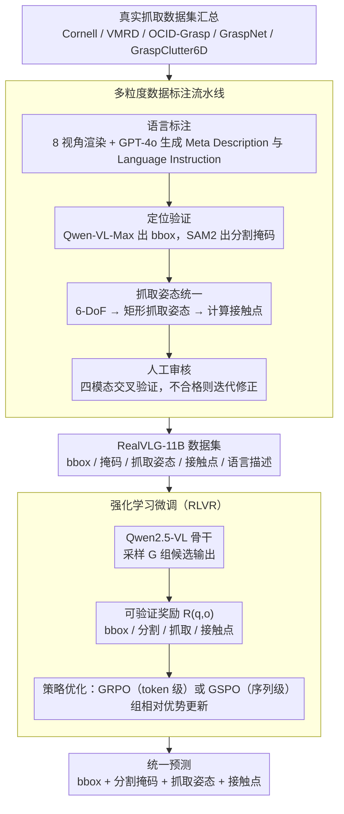

<!-- 由 src/gen_stubs.py 自动生成 -->
# RealVLG-R1: A Large-Scale Real-World Visual-Language Grounding Benchmark for Robotic Perception and Manipulation

**会议**: CVPR2026  
**arXiv**: [2603.14880](https://arxiv.org/abs/2603.14880)  
**代码**: [lif314/RealVLG-R1](https://github.com/lif314/RealVLG-R1)  
**领域**: 语义分割  
**关键词**: 视觉语言定位, 机器人抓取, 强化学习微调, 多粒度标注, 零样本泛化, 大规模视觉语言模型

## 一句话总结

提出 RealVLG 框架，包含 11B 级真实世界多粒度标注数据集 RealVLG-11B 和基于强化学习微调的统一模型 RealVLG-R1，首次将视觉语言定位（VLG）与机器人抓取统一到同一范式中，实现从自然语言指令到 bounding box、分割掩码、抓取姿态和接触点的端到端预测，并展现出零样本泛化能力。

## 研究背景与动机

**VLG 与抓取的脱节**：现有视觉语言定位研究聚焦于粗粒度的目标级定位（bounding box / 分割掩码），而传统机器人抓取方法依赖几何线索，缺乏语言语义引导，二者之间存在明显鸿沟。

**合成数据质量不足**：Grasp-Anything 等数据集使用 diffusion 模型生成低分辨率合成场景，抓取标注由 RAGT-3/3 自动生成质量有限，语言描述仅覆盖场景或物体类别级别。

**缺少细粒度语言描述**：现有抓取数据集的语言标注粗糙，缺乏对目标物体属性、空间关系的精细描述，无法支持语言驱动的细粒度操作。

**SFT 难以处理多解问题**：抓取姿态本质上存在多种可行解，但监督微调会强制拟合单一标签，导致"均值化"预测，物理上不可行。

**真实世界数据集规模不足**：已有真实世界抓取数据集标注不统一，缺乏分割、检测、语言描述等多模态对齐标注。

**零样本能力缺失**：基于闭合环境训练的抓取方法可扩展性差，无法在未见过的真实场景中直接部署。

## 方法详解

### 整体框架

RealVLG 想把"视觉语言定位（VLG）"和"机器人抓取"这两件一直脱节的事统一进一个模型，让自然语言指令能一路映射到 bbox、分割掩码、抓取姿态和接触点。它由两部分组成：数据集 RealVLG-11B——整合 Cornell、VMRD、OCID-Grasp、GraspNet、GraspClutter6D 等真实抓取数据集，经一条标注流水线统一补齐 bbox、分割掩码、矩形抓取姿态、接触点和自然语言描述，覆盖约 16.5 万张图像、800+ 物体实例、130 万标注、约 110 亿抓取示例；模型 RealVLG-R1——以 Qwen2.5-VL 为骨干，用强化学习微调（RLVR）靠可验证奖励驱动，统一预测上述四类输出。下图把"数据集构建"和"模型训练"两条流水线串起来，分别对应下面的两个关键设计。

### 关键设计

**1. 多粒度数据标注流水线：用四模态交叉验证产出高质量真实世界标注**

现有抓取数据要么是低质量合成（Grasp-Anything 用 diffusion 生成、抓取标注靠 RAGT-3/3 自动生成），要么语言描述只到场景/类别级，撑不起语言驱动的细粒度操作。本文用四步流水线把质量做扎实：(1) **语言标注**——从 8 个视角渲染物体 3D 模型，GPT-4o 生成 Meta Description，再结合图像为每个目标生成含类别、颜色、形状、空间关系的 Language Instruction；(2) **定位验证**——Qwen-VL-Max 对 image + language 做 grounding 输出 bbox，SAM2 生成分割掩码；(3) **抓取姿态统一**——把 6-DoF 抓取姿态转成统一矩形表示，并基于掩码算接触点；(4) **人工审核**——交叉验证四模态一致性，不合格则迭代修正。

**2. 强化学习微调（RLVR）：用可验证奖励解决抓取的多解问题**

抓取姿态本质上有多个可行解，SFT 强行拟合单一标签会"均值化"出物理上不可行的结果。本文改用 RLVR 范式，用可验证奖励函数 $R(q,o)$ 替代固定标签：先从旧策略采样 $G$ 组候选输出，按可验证奖励算出组内相对优势 $\hat{A}_i$，再据此更新策略。策略优化给出两种可互换的算法——GRPO 做 token 级重要性加权，GSPO 则在序列级引入长度归一化的重要性权重 $s_i(\theta) = \left(\frac{\pi_\theta(y_i|x)}{\pi_{\theta_{old}}(y_i|x)}\right)^{1/|y_i|}$ 来压低长序列的方差；二者并非串行叠加，而是作为不同配置（实验中 3B 用 GRPO 抓取精度更高、7B 用 GSPO 更稳定）。实验里 RL 微调比 SFT 在抓取上多涨 30%+，正是因为奖励允许"多个解都对"而不逼模型收敛到一个均值。

### 损失函数 / 训练策略

奖励按任务分别设计，统一要求 `<think>...</think><answer>...</answer>` 格式：

- **Bbox 奖励**：基于 IoU 阈值的二值奖励 $R_{Bbox} = \mathbf{1}(\text{IoU}(B_p, B_{gt}) \geq \tau)$
- **分割奖励**：IoU 粗定位 + S-measure 细粒度掩码质量 $R_{Seg} = \mathbf{1}(\text{IoU}) + S_\alpha(M_p, M_{gt})$
- **抓取奖励**：对 $(x, y, \cos\theta, \sin\theta, w)$ 五个分量分别算 Huber 损失之和取负
- **接触点奖励**：矩形对齐 IoU 二值奖励 + 两个接触点的 L2 距离惩罚

## 实验

### 数据质量评估

| 数据集 | MTLD ↑ | CLIP Score ↑ | $R_s$ ↑ | $R_g$ ↑ | $R_c$ ↑ |
|--------|--------|-------------|---------|---------|---------|
| Grasp-Anything | 27.45 | 0.54 | – | 0.38 | 0.69 |
| Grasp-Anything++ | 15.14 | 0.52 | – | 0.31 | 0.62 |
| **RealVLG-11B** | **36.49** | **0.65** | **0.99** | **0.69** | **0.87** |

RealVLG-11B 在语言多样性（MTLD）、视觉-语言对齐（CLIP Score）和空间一致性上全面超越合成数据集。

### RealVLG Benchmark 主实验

| 模型 | Seen Bbox (gIoU) | Seen Grasp (mIoU/gAcc) | Novel Bbox (gIoU) | Novel Grasp (mIoU/gAcc) |
|------|-----------------|----------------------|-----------------|----------------------|
| Qwen-VL-Max | 92.3 | 16.0/16.7 | 88.4 | 8.1/5.4 |
| Qwen2.5VL-3B + SFT | 56.4 | 3.4/1.7 | 57.2 | 4.4/1.5 |
| RealVLG-R1-3B (GRPO) | 87.2 | **34.7/40.3** | 78.5 | 16.3/17.1 |
| RealVLG-R1-7B (GSPO) | **89.0** | 33.6/32.8 | **88.5** | 16.5/18.3 |

### 消融与关键发现

1. **SFT vs RL 微调**：SFT 相比 base 模型仅提升约 5% gIoU，而 GRPO/GSPO 提升超过 30%，证明强化学习在多解抓取任务上的显著优势。
2. **GRPO vs GSPO**：GRPO 在小模型上抓取精度更高（3B: mIoU 34.7 vs 29.2），GSPO 在大模型上稳定性更好且输出 Rv 率达 100%。
3. **零样本泛化**：在 Novel（全新物体）场景下，RealVLG-R1-7B (GSPO) 的 Bbox gIoU 仍达 88.5%，抓取 mIoU/gAcc 为 16.5/18.3%，展示出非平凡的泛化能力。
4. **输出有效率**：闭源 Qwen-VL-Max 的 Rv 仅 60-70%，而 RealVLG-R1 所有配置均达 96-100%，说明 RL 微调显著提升了结构化输出的一致性。
5. **仅用 10% 训练数据**：RealVLG-R1 和 SFT 仅使用训练集 10% 的数据训练 10 个 epoch，说明方法在数据效率上表现优异。

## 亮点

- **首个统一 VLG + 抓取的框架**：将语义定位和物理交互推理统一到同一模型中，是基于 LVLM 的首个端到端机器人感知模型
- **高质量数据标注流水线**：GPT-4o 自动生成 + Qwen-VL-Max 验证 + SAM2 分割 + 人工审核四重保障
- **110 亿级真实世界抓取数据集**：规模最大的同时包含语义和视觉信息的真实世界感知数据集
- **强化学习解决多解问题**：巧妙地用可验证奖励替代固定标签，优雅解决了抓取姿态多可行解的核心难题
- **零样本部署能力**：无需针对新场景微调即可在真实世界未见环境中执行感知和操作

## 局限性

- 当前仅支持 2D 矩形抓取姿态，未扩展到 3D 空间和 6-DoF 抓取
- Novel 场景下抓取精度（mIoU ~16%）仍有较大提升空间，与检测性能差距明显
- 分割完全依赖 SAM2 作为 frozen 模块，模型自身不直接生成掩码
- 实验未报告在真实机器人上的闭环操作成功率
- 数据集主要覆盖桌面场景，对复杂工业和户外环境的泛化性未验证
- 推理时需采样 G 组响应计算优势估计，推理效率可能受限

## 相关工作

- **视觉语言定位**：GLIP、Shikra、GroundingDINO 等聚焦 Bbox/Seg 定位，未涉及抓取推理
- **抓取数据集**：Cornell、GraspNet-1Billion 提供真实世界标注但缺乏语言模态；Grasp-Anything 有语言但为低质量合成数据
- **语言驱动抓取**：现有方法多依赖预分割输入，多阶段误差累积严重，且在开放世界场景泛化性差
- **强化学习微调 LLM**：DeepSeek-R1 提出 RLVR 范式用于推理任务，本文将其扩展到视觉定位和机器人抓取领域

## 评分

- 新颖性: ⭐⭐⭐⭐ — 首次统一 VLG 与抓取，将 RLVR 范式从 NLP 推理迁移到具身感知
- 实验充分度: ⭐⭐⭐⭐ — 数据质量评估 + Benchmark + 多基线对比完备，但缺少真实机器人闭环实验
- 写作质量: ⭐⭐⭐⭐ — 论文结构清晰，数据集构建流程详尽，公式推导完整
- 价值: ⭐⭐⭐⭐ — 数据集和 Benchmark 对社区有长期价值，统一框架思路值得跟进

<!-- RELATED:START -->

## 相关论文

- [\[CVPR 2026\] XSeg: A Large-scale X-ray Contraband Segmentation Benchmark for Real-World Security Screening](xseg_a_large-scale_x-ray_contraband_segmentation_benchmark_for_real-world_securi.md)
- [\[ICCV 2025\] RAGNet: Large-scale Reasoning-based Affordance Segmentation Benchmark towards General Grasping](../../ICCV2025/segmentation/ragnet_large-scale_reasoning-based_affordance_segmentation_benchmark_towards_gen.md)
- [\[ICCV 2025\] Advancing Visual Large Language Model for Multi-granular Versatile Perception](../../ICCV2025/segmentation/advancing_visual_large_language_model_for_multi-granular_versatile_perception.md)
- [\[CVPR 2026\] UnrealPose: Leveraging Game Engine Kinematics for Large-Scale Synthetic Human Pose Data](unrealpose_leveraging_game_engine_kinematics_for_large-scale_synthetic_human_pos.md)
- [\[ICCV 2025\] Learning Precise Affordances from Egocentric Videos for Robotic Manipulation](../../ICCV2025/segmentation/learning_precise_affordances_from_egocentric_videos_for_robotic_manipulation.md)

<!-- RELATED:END -->
