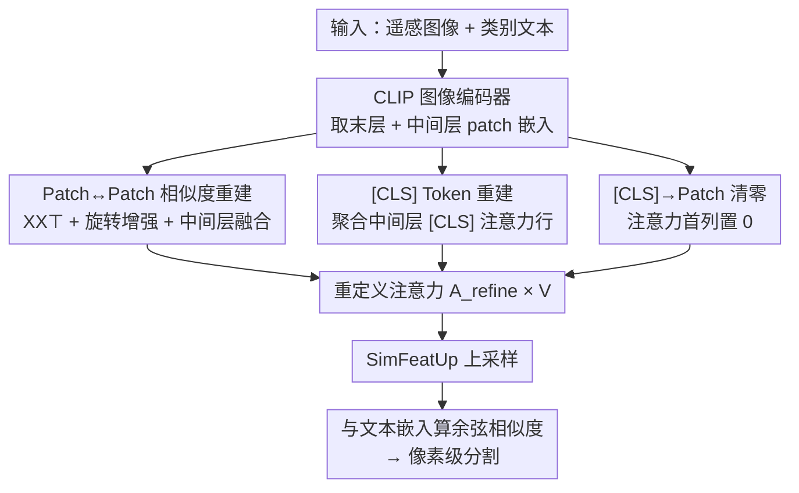

# ReAttnCLIP: Training-Free Open-Vocabulary Remote Sensing Image Segmentation via Re-defined Attention in CLIP

**会议**: CVPR 2026  
**论文**: [CVF Open Access](https://openaccess.thecvf.com/content/CVPR2026/html/Niu_ReAttnCLIP_Training-Free_Open-Vocabulary_Remote_Sensing_Image_Segmentation_via_Re-defined_Attention_CVPR_2026_paper.html)  
**代码**: 待确认  
**领域**: 语义分割 / 开放词表 / 遥感  
**关键词**: 开放词表分割, 遥感, CLIP, 免训练, 注意力重定义

## 一句话总结
ReAttnCLIP 把 CLIP 最后一层的注意力图拆成「patch↔patch、[CLS]→patch、patch→[CLS]」三块分别动手术——用原始 patch 嵌入相似度（外加旋转增强与中间层融合）替换 patch 间注意力、用中间层注意力重建更有信息量的 [CLS] 全局表示、并把 [CLS] 对 patch 的那一列直接清零，从而无需任何训练就在 10 个遥感数据集上取得开放词表分割的 SOTA（开放词表平均 +1.7%、地物提取 +1.1%）。

## 研究背景与动机

**领域现状**：遥感图像分割是灾害监测、精准农业、城市规划的基础任务。传统做法依赖大量像素级标注训练封闭词表模型；为摆脱固定类别约束，开放词表分割兴起，但多数方法仍要在精选数据上微调，部署成本高。于是「免训练」路线成为新范式——直接复用 CLIP 这类大规模预训练模型抽取可迁移特征，零额外训练开销。

**现有痛点**：CLIP 的预训练目标是**图像级**的图文对齐（靠 [CLS] token 算全局相似度），而分割需要的是**像素级**的判别性 patch 表示，两者根本错位。已有的免训练适配方法（如把 query-key 注意力换成 query-query 的 SCLIP、key-key 的 SCSA/SegEarth-OV）都是**把注意力图当成一个整体来重构**，并没有去拆解注意力图内部不同区域各自承担什么角色。在遥感这种尺度极端变化、地物异质、目标分布复杂的场景下，这种"整体重构"难以同时兼顾全局语义和局部细节，导致表示次优。

**核心矛盾**：CLIP 最后一层注意力图 $A\in\mathbb{R}^{197\times197}$ 里，每个 patch 输出 $x_i = A_{i0}v_{\text{CLS}} + \sum_{j=1}^{196}A_{ij}v_j$ 实际上同时接收两路信息——来自 [CLS] 的全局信息（$A_{i0}$）和来自其它 patch 的信息（patch-patch 子矩阵）。把这两路混在一起、当作铁板一块去改，必然顾此失彼。

**切入角度**：作者第一次把注意力图按语义**分解成三个可解释的部分**：(i) patch↔patch（建模区域间关系）、(ii) patch→[CLS]（[CLS] 如何被构造）、(iii) [CLS]→patch（[CLS] 对局部表示的影响），然后对每一块单独诊断、单独下药。

**核心 idea**：与其重构整张注意力图，不如**逐分量重定义注意力**——patch 间用最朴素的原始嵌入相似度 $XX^\top$ 替代带投影偏置的 QK，[CLS] 用中间层注意力重建得更具类别多样性，[CLS]→patch 的偏置则直接清零。

## 方法详解

### 整体框架
ReAttnCLIP 是一个**纯推理期**的方法：拿现成的 CLIP ViT-B/16 图像编码器，只改它**最后一个 transformer block 的注意力图**，把改造后的注意力与 value 相乘得到稠密 patch 特征，再用 SegEarth-OV 同款的 SimFeatUp 上采样模块提分辨率，最后和 CLIP 文本编码器的类别嵌入算余弦相似度得到像素级分割图。整条链路不训练任何新参数（SimFeatUp 沿用已训练好的权重）。

核心在于把原始注意力图 $A$ 重写成一个「重定义注意力」$A_{\text{refine}}$，它由三块拼成（对应论文 Eq.15）：

$$A_{\text{refine}}=\begin{pmatrix}\bar A^{(l)}_{0,0} & \bar A^{(l)}_{0,1:196}\\[2pt] \mathbf{0} & S\end{pmatrix}$$

其中右下角 $S\in\mathbb{R}^{N\times N}$ 是重新设计的 patch↔patch 相似度、第一行 $\bar A^{(l)}_{0,:}$ 是用中间层重建的 [CLS] 行、左下角整列被置零。三块各自对应一个关键设计。

### 关键设计

**1. Patch↔Patch 相似度重建：用原始嵌入相似度 + 旋转增强替代带偏置的 QK 注意力**

痛点在于标准 QK 注意力 $A=\mathrm{softmax}(QK^\top/\sqrt d)$ 里，$Q,K$ 经过两套独立的投影矩阵 $W^Q,W^K$，会引入"投影偏置"——同类 patch 之间的关系被投影扭曲，不利于稠密预测。SCLIP/SegEarth-OV 已意识到这点，改用对称的 $QQ^\top$、$KK^\top$、$VV^\top$ 加权和（$A=\alpha QQ^\top+\beta KK^\top+\gamma VV^\top$）来减少这种偏置。作者把这个思路推到极致：**索性把所有可学习投影都去掉**，直接量度原始 patch 嵌入之间的相似度

$$\text{Attention}^{\text{raw}}_{i,j}=\frac{x_i^\top x_j}{\sqrt d}$$

这给出一个最干净、可解释的基线，反映嵌入空间里 patch 之间内在的几何关系，可视化上 $XX^\top$ 比 RCS/SCSA 更聚焦同类区域。

在此之上叠两层增强应对遥感特性。其一是**旋转增强**：遥感目标朝向千变万化，于是把图像旋转 $0^\circ/90^\circ/180^\circ/270^\circ$，对每个旋转 $r$ 和选定层 $k$ 算 $S^{(r,k)}=X^{(r,k)}X^{(r,k)\top}$，再加权聚合并跨层平均得到旋转增强相似度 $S_{\text{rot}}=\frac{1}{|K|}\sum_{k\in K}\sum_r \lambda_r S^{(r,k)}$（实现里 $\lambda_0=1$、其余 $\lambda_i=0.4$，$K$ 取第 9–11 层）。其二是**中间层融合**：把旋转增强项与若干中间层的 QK 注意力图融合 $S=\alpha S_{\text{rot}}+\sum_{l\in L}\beta_l A^{(l)}$（$\alpha=0.2$），让最终相似度既有原始嵌入的几何结构、又补回 QK 注意力的语义。消融显示单 $XX^\top$ 在 UDD5 上就 +2.8%，叠旋转和 QK 进一步涨。

**2. [CLS] Token 重建：用中间层注意力聚合出信息更丰富的全局表示**

把 CLIP 用于稠密预测时通常丢掉 [CLS]、只留 patch；但 patch 在预训练时和 [CLS] 充分交互，编码了大量全局上下文，会污染局部判别力。SegEarth-OV 的做法是直接拿**末层** [CLS] 嵌入从每个 patch 里减掉（$\tilde x_i = x_i - x_{\text{cls}}$）。问题是作者发现**末层 [CLS] 携带的类别信息很少**：通过可视化 [CLS] 注意力图在各层的熵（图 5），随层数加深熵单调下降，说明深层 [CLS] 的注意力越来越收缩到少数 patch 上，全局信息其实很贫乏；用它做去偏参照并不理想。

因此作者改成**从中间层重建** [CLS]。对每个选定中间层 $l\in L$，取注意力图的整条第一行 $A^{(l)}_{0,:}\in\mathbb{R}^{N+1}$（即 [CLS] 到所有 token 含自身的注意力权重），跨层求平均

$$\bar A^{(l)}_{0,:}=\frac{1}{|L|}\sum_{l\in L}A^{(l)}_{0,:}$$

这条复合注意力向量整合了网络不同深度的空间与语义信息，可视化上比末层 [CLS] 含**更多样的类别信息**，作为下游去偏的参照更鲁棒。层 $l$ 在 6–9 层之间、按每个数据集的 [CLS] 熵图自适应选取。

**3. [CLS]→Patch 影响清零：直接切断全局 token 对局部 patch 的残余偏置**

注意力矩阵的**第一列** $A_{i0}$ 表示 [CLS] 对第 $i$ 个 patch 的贡献，是一条 global→local 的通道，会给 patch 表示注入不必要的全局偏置。既然预训练阶段 [CLS] 已经把 patch 带偏过一次，作者干脆把这一列整列置零

$$A_{\text{refine}}[i,0]=0,\quad i=1,\dots,N$$

这是三块里最简单也最直接的一刀：与设计 2「重建 [CLS]」互补——重建是为了得到更好的去偏参照（减法的减数），清零是为了切断 [CLS] 在注意力前向里对 patch 的直接污染（乘法的通道）。两者一减一切，共同压住全局偏置。消融中三块各自单独开启都能涨点，全开最优。

### 损失函数 / 训练策略
本方法**无训练**，没有任何损失函数。推理设定：backbone 为 CLIP ViT-B/16，输入缩放到 $448\times448$，用 $224\times224$ 滑窗推理后拼接；文本侧按 OpenAI 做法平均 80 个模板的嵌入；全部实验单卡 V100 即可。

## 实验关键数据

### 主实验

8 个开放词表遥感分割数据集（mIoU），ReAttnCLIP 在全部 8 个上刷新 SOTA，平均 40.9 vs SegEarth-OV 的 39.2（+1.7）：

| 方法 | OpenEarthMap | LoveDA | iSAID | Potsdam | UDD5 | VDD | Average |
|------|------|------|------|------|------|------|------|
| MaskCLIP (ECCV22) | 25.1 | 27.8 | 14.5 | 31.7 | 32.4 | 32.9 | 27.2 |
| SCLIP (ECCV24) | 29.3 | 30.4 | 16.1 | 36.6 | 38.7 | 37.9 | 31.1 |
| ClearCLIP (ECCV24) | 31.0 | 32.4 | 18.2 | 40.9 | 41.8 | 39.3 | 33.4 |
| ResCLIP (CVPR25) | 34.3 | 29.6 | 8.8 | 42.6 | 41.9 | 39.6 | 32.6 |
| SegEarth-OV (CVPR25) | 40.3 | 36.9 | 21.7 | 47.1 | 50.6 | 45.3 | 39.2 |
| **Ours** | **41.1** | **37.0** | **23.2** | **48.7** | **53.7** | **49.7** | **40.9** |

地物提取（建筑/道路，mIoU），同样领先：

| 方法 | WHUSAT.II | Massachusetts | Average |
|------|------|------|------|
| SegEarth-OV | 28.4 | 11.5 | 20.0 |
| **Ours** | **29.7** | **12.4** | **21.1** |

增益最大的是 VDD（+4.4）和 UDD5（+3.1，小目标多、受益于旋转增强）；LoveDA 仅 +0.1，因其图像偏模糊、小目标多，而 backbone 是自然图像预训练的 ViT，自然↔遥感的域差限制了效果。

### 消融实验

模块拆解（三数据集 mIoU）：

| P-P | CLS | CLS-Patch | UDD5 | VDD | WHUSAT.II |
|------|------|------|------|------|------|
| | | | 50.4 | 45.3 | 28.4 |
| ✓ | | | 53.1 | 47.8 | 29.0 |
| | ✓ | | 52.5 | 46.8 | 28.9 |
| | | ✓ | 51.5 | 46.7 | 28.8 |
| ✓ | ✓ | ✓ | **53.7** | **49.7** | **29.5** |

P-P 模块内部策略消融：

| $XX^\top$ | $QK^\top$ | Rotation | UDD5 | VDD | WHUSAT.II |
|------|------|------|------|------|------|
| | | | 50.4 | 45.3 | 28.4 |
| ✓ | | | 53.2 | 46.7 | 29.1 |
| ✓ | | ✓ | 53.4 | 48.8 | 29.3 |
| ✓ | ✓ | ✓ | **53.7** | **49.7** | **29.5** |

### 关键发现
- **P-P 模块贡献最大**：单开它在 UDD5 上从 50.4→53.1，三块里涨幅最高；其中 $XX^\top$ 是主力（单项 +2.8），旋转增强对 VDD 等小目标场景增益尤其明显。
- **三块互补、全开最优**：CLS 重建与 CLS-Patch 清零各自单开也都涨，三者叠加在所有数据集上取到最高分，验证"逐分量重定义"的分解假设。
- **层选择鲁棒**：XXT Fusion 在 7→9 到 10→11 不同层区间结果几乎不变（UDD5 53.4–53.8、VDD 49.6–49.8），最终取 9→11 平衡精度与开销。
- **代价**：精度换来一定开销，推理 52.3 ms、60.2 GFLOPs，高于 SegEarth-OV（22.8 ms / 27.8 GFLOPs），属"中等可接受"区间。

## 亮点与洞察
- **把注意力图"拆开看"而非"整体换"**：以往工作都在重构整张注意力图，本文第一次把它按 patch↔patch / [CLS]→patch / patch→[CLS] 三块分别诊断、分别开方，是个干净且可解释的视角，三个改动各自都能涨点正好印证分解的合理性。
- **用熵证明"末层 [CLS] 信息贫乏"**：通过逐层画 [CLS] 注意力熵发现深层熵下降→注意力收缩，从而论证应该用中间层重建 [CLS] 而非沿用末层，这个由现象到设计的推导链很有说服力。
- **去投影到极致的 $XX^\top$**：沿着 SCLIP「对称相似度减投影偏置」的逻辑直接把投影全删掉，既更可解释又更强，是个可迁移的小 trick。
- **即插即用**：作为 plug-and-play 模块挂到 MaskCLIP/SCLIP/ClearCLIP 上，遥感平均最高 +9.5、自然图像 +9.7，说明它改的是 CLIP 稠密化的通用病灶，不止对遥感有效。

## 局限与展望
- **域差是天花板**：backbone 用自然图像预训练的 CLIP ViT，在偏模糊/小目标的 LoveDA 上几乎不涨（+0.1），作者自己也归因于自然↔遥感域差；换遥感专用预训练 backbone 或许能突破。
- **开销偏高**：旋转增强（4 个角度各跑一遍）+ 多中间层融合让 FLOPs 翻倍、延迟翻倍多，对实时/大幅面遥感推理不友好；旋转角度数、融合层数都还有压缩空间。
- **超参手工痕迹重**：$\lambda$、$\alpha$、融合层 $L$、中间层 $l$（按每数据集熵图选）等不少超参靠经验/逐数据集调，泛化到全新传感器数据时需要重新调，削弱了"免训练即插即用"的便利。
- **仅 ViT-B/16 单尺度验证**：没看更大 backbone 或多尺度滑窗的表现，三块改动在更强 CLIP 上是否仍互补未知。

## 相关工作与启发
- **vs SegEarth-OV (CVPR25)**：同为免训练遥感开放词表分割、共用 SimFeatUp 上采样。SegEarth-OV 把注意力当整体、并用**末层** [CLS] 做减法去偏；本文把注意力拆三块、改用**中间层重建** [CLS] 并对 [CLS]→patch 列清零，平均 +1.7。是直接的 SOTA 超越对象。
- **vs SCLIP / SCSA（query-query / key-key）**：它们用对称相似度（$QQ^\top$/$KK^\top$）减投影偏置但仍保留投影；本文进一步删光投影用 $XX^\top$，并叠旋转与中间层融合，可视化更聚焦同类区域。
- **vs ResCLIP (CVPR25)**：ResCLIP 表明中间层注意力图能增强 patch 表示；本文把"中间层"思路同时用到 patch 相似度（$S_{\text{rot}}$ 跨层）和 [CLS] 重建两处，用得更系统。
- **vs ClearCLIP (ECCV24)**：ClearCLIP 删末层残差连接降噪；二者都在"末层动手术"，但 ClearCLIP 改的是残差、本文改的是注意力图的分量结构。

## 评分
- 新颖性: ⭐⭐⭐⭐ 把注意力图分解成三分量逐一重定义的视角清晰新颖，但每个分量的"原料"（中间层注意力、去投影相似度、CLS 减法）多沿用既有工作，属高质量的系统性整合。
- 实验充分度: ⭐⭐⭐⭐ 10 数据集 3 任务 + 模块/层/复杂度/即插即用/自然图像多组消融，相当扎实；缺更大 backbone 与多尺度验证。
- 写作质量: ⭐⭐⭐⭐ 从注意力分解到熵分析的"现象→设计"推导清楚，公式与图配合好；部分超参选择交代略简。
- 价值: ⭐⭐⭐⭐ 免训练、即插即用、刷新遥感开放词表 SOTA 且对自然图像也涨点，实用价值高，代价是推理开销翻倍。

<!-- RELATED:START -->

## 相关论文

- [\[CVPR 2026\] Test-Time Multi-Prompt Adaptation for Open-Vocabulary Remote Sensing Image Segmentation](test-time_multi-prompt_adaptation_for_open-vocabulary_remote_sensing_image_segme.md)
- [\[CVPR 2026\] Looking Beyond the Window: Global-Local Aligned CLIP for Training-free Open-Vocabulary Semantic Segmentation](looking_beyond_the_window_global-local_aligned_clip_for_training-free_open-vocab.md)
- [\[CVPR 2026\] PEARL: Geometry Aligns Semantics for Training-Free Open-Vocabulary Semantic Segmentation](pearl_geometry_aligns_semantics_for_training-free_open-vocabulary_semantic_segme.md)
- [\[CVPR 2026\] Direct Segmentation without Logits Optimization for Training-Free Open-Vocabulary Semantic Segmentation](direct_segmentation_without_logits_optimization_for_training-free_open-vocabular.md)
- [\[CVPR 2026\] The Power of Prior: Training-Free Open-Vocabulary Semantic Segmentation with LLaVA](the_power_of_prior_training-free_open-vocabulary_semantic_segmentation_with_llav.md)

<!-- RELATED:END -->
