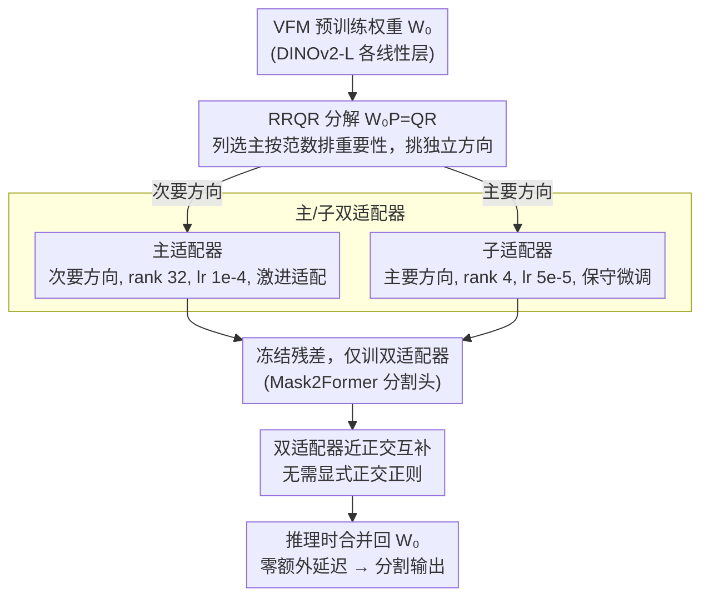

# RecycleLoRA: Rank-Revealing QR-Based Dual-LoRA Subspace Adaptation for Domain Generalized Semantic Segmentation

**会议**: CVPR 2026  
**arXiv**: [2603.28142](https://arxiv.org/abs/2603.28142)  
**代码**: [https://github.com/chanseul01/RecycleLoRA.git](https://github.com/chanseul01/RecycleLoRA.git)  
**领域**: 语义分割 / 域泛化 / 参数高效微调  
**关键词**: 域泛化语义分割, LoRA, RRQR分解, 双适配器, 子空间结构

## 一句话总结

提出 RecycleLoRA，利用 Rank-Revealing QR 分解(RRQR)系统性地"回收"Vision Foundation Model预训练权重中的子空间结构，通过对次要方向和主要方向分别初始化主/子双适配器，显著提升 LoRA 的表示多样性和参数利用效率，在合成到真实和真实到真实的域泛化语义分割任务上均达到 SOTA（平均 mIoU 68.95 / 72.10）。

## 研究背景与动机

1. **领域现状**：域泛化语义分割（DGSS）旨在让模型在未见目标域上保持鲁棒性能。随着 DINOv2、CLIP 等视觉基础模型（VFM）的出现，DGSS 的重点已从数据增强转向如何高效适配 VFM 的丰富多域知识。
2. **现有痛点**：
    - 现有 SVD 方法（如 SoMA）虽然通过关注次要奇异值方向取得了不错效果，但 SVD 优先保持方差，不一定是下游适配最有效的分解方式；
    - SoMA 只调整次要方向而完全冻结主要方向，限制了模型处理复杂新任务的能力；
    - 许多 LoRA 方法的基向量之间存在**表示冗余**，导致参数利用效率低下（Effective Rank 远低于目标 Rank）。
3. **核心矛盾**：如何同时解决"更好地利用 VFM 子空间结构"和"增强 LoRA 表示多样性"这两个问题。
4. **本文目标**：(1) 找到比 SVD 更适合 VFM 适配的分解策略；(2) 消除 LoRA 基向量间的表示冗余；(3) 充分利用预训练权重中的主要和次要方向。
5. **切入角度**：RRQR 通过贪心列选主（column pivoting）从原始权重矩阵中直接选择信息量最大的列，天然保证方向独立性和结构多样性。
6. **核心 idea**：用 RRQR 分解 VFM 权重，将次要方向初始化主适配器、主要方向初始化子适配器，构建无需额外正则化的互补双适配器结构。

## 方法详解

### 整体框架

输入是 VFM（DINOv2-Large）的预训练权重矩阵 $\mathbf{W}_0 \in \mathbb{R}^{d \times k}$，对每个线性层执行 RRQR 分解得到正交矩阵 $\mathbf{Q}$ 和排列矩阵 $\mathbf{P}$。利用分解结果，把次要方向（minor directions）初始化主适配器（rank 32、大学习率）、主要方向（major directions）初始化子适配器（rank 4、小学习率）；再构建残差矩阵（原始权重减去适配器初值）冻结，只训练两个适配器，以 Mask2Former 作为分割头。由于两个适配器从一开始就落在不同子空间、又各配匹配自身方向的更新步长，训练后保持近正交互补，**无需任何显式正交正则**。推理时双适配器合并回原始权重，**不引入额外推理延迟**。

### 关键设计

**1. 用 RRQR 而非 SVD 来"回收"预训练子空间：从原始权重列里直接挑方向**

前作 SoMA 用 SVD 把权重分解成一组全新的正交基，再挑方差最小的次要方向去适配。问题是 SVD 优先保方差，找出来的是"重建权重最高效"的基，未必是"下游适配最有用"的方向，而且这组基是全新构造的、丢掉了原始权重列之间的局部结构。RecycleLoRA 改用 Rank-Revealing QR 带列选主的分解：$\mathbf{W}_0 \mathbf{P} = \mathbf{Q}\mathbf{R}$，其中每一步都贪心地挑出"在已选方向上正交投影后范数最大"的那一列。

$$\mathbf{W}_0 \mathbf{P} = \mathbf{Q}\mathbf{R}$$

这个贪心准则天然让选出的方向彼此独立、冗余最小：$\mathbf{Q}$ 的列给出正交基方向，排列矩阵 $\mathbf{P}$ 则记录了各列的重要性排序。主适配器的 $\mathbf{B}$ 用 $\mathbf{Q}$ 的最后 $r$ 列初始化（即次要方向），$\mathbf{A}$ 则用稀疏初始化——把 $\mathbf{P}$ 选中的列索引位置置 1、其余置 0，从而把"该往哪几个原始权重列上加增量"的先验直接编进初始化里。和 SVD 重建新基相比，RRQR 是从原始权重列中**挑选**，保留了局部结构和维度对应关系。训练后分析印证了这一初始化偏置确实被保留：稀疏初始化位置的列范数平均比零初始化的列高 1.22×、最高 1.63×。

这个贪心列选主还从源头抑制了 LoRA 基向量间的表示冗余——这正是 RRQR 相对 SVD 的另一大收益，也是它能提升参数利用效率的根因。很多 LoRA 方法名义上 rank=16，实际有效秩（Effective Rank）远不到，参数花了表示能力却没拿满；而 RRQR 选出的方向彼此独立，直接把有效秩顶上去。论文用 Rank Efficiency（有效秩 / 目标秩）量化：rank=16 时 RecycleLoRA 是 0.850、SoMA 只有 0.611；rank=32 时分别是 0.770 和 0.650；余弦相似度热力图也吻合——RecycleLoRA 的 $\mathbf{A}$ 行间、$\mathbf{B}$ 列间相似度都明显低于 SoMA。有效秩越高，意味着每个低秩分量捕获的是更独立、更独特的特征，这正是域泛化场景下抗分布偏移最需要的表示多样性。

**2. 主/子双适配器：让两条增量天然学到互补的子空间，省掉显式正交正则**

光有好的初始化还不够——SoMA 只动次要方向、把主要方向完全冻结，模型应对复杂新任务的能力就被限制住了。RecycleLoRA 索性同时用上主、次两个方向：主适配器吃 RRQR 的次要方向（rank=32、lr=1e-4），子适配器吃主要方向（rank=4、lr=5e-5）。这里有一个关键观察是初始化方向和最优学习率存在内在绑定——主要方向编码的是 VFM 的核心知识，动它要保守，所以子适配器配更小的学习率；次要方向是相对安全的"可塑空间"，主适配器就可以更激进地适配。

正因为两个适配器从一开始就落在不同的子空间、又用了匹配各自方向的更新步长，它们在训练后仍然保持接近正交，**不需要再加任何显式的正交约束损失**。论文用 Grassmann 距离量化验证了这点：双适配器训练后子空间相似度远低于 Kaiming 随机初始化的双适配器；PCA 可视化进一步显示两者修改的是互补区域——主适配器聚焦前景物体，子适配器覆盖背景。

### 损失函数 / 训练策略

- 采用标准语义分割损失，冻结 VFM backbone，仅训练双适配器
- 为保持预训练权重的初始输出，构建残差矩阵（原始权重减去适配器初始值），冻结残差矩阵
- 主适配器和子适配器的学习率分别为 1e-4 和 5e-5（学习率乘子 1.0 和 0.5）

## 实验关键数据

### 主实验

**合成到真实泛化（GTAV → 真实域）**

| 方法 | Backbone | →Citys. | →BDD | →Map. | Avg. |
|------|----------|---------|------|-------|------|
| SoMA (CVPR'25) | DINOv2-L | 71.82 | 61.31 | 71.67 | 68.27 |
| MFuser (CVPR'25) | EVA02-L | 70.19 | 63.13 | 71.28 | 68.20 |
| **RecycleLoRA** | DINOv2-L | **73.01** | **61.77** | **72.07** | **68.95** |

**真实到真实泛化（Cityscapes → BDD/Map.）**

| 方法 | →BDD | →Map. | Avg. |
|------|------|-------|------|
| SoMA | 67.02 | 76.45 | 71.74 |
| MFuser | 65.81 | 77.93 | 71.87 |
| **RecycleLoRA** | 66.65 | **77.54** | **72.10** |

### 消融实验

| 配置 | Params | →Citys. | →BDD | →Map. | Avg. |
|------|--------|---------|------|-------|------|
| 仅 Sub Adapter | 1.6M | 70.64 | 60.56 | 71.11 | 67.44 |
| 仅 Main Adapter | 12.6M | 72.92 | 61.22 | 71.75 | 68.63 |
| Main + Sub (完整) | 14.2M | **73.01** | **61.77** | **72.07** | **68.95** |

### 关键发现

- **仅 Main Adapter 就已超越所有现有 SOTA**（68.63 vs SoMA 68.27），证明 RRQR 初始化策略本身的强大效果
- Sub Adapter 在额外仅 1.6M 参数下进一步提升 0.32 mIoU，证实双适配器的互补性
- 学习率分析证实了假设：Sub Adapter（主要方向）在低学习率 5e-5 下最优（↑1.81），Main Adapter（次要方向）在标准 1e-4 下最优，降低学习率反而掉点 1.99
- 在 EVA02-L backbone 上同样有效（66.35 avg），证明方法的通用性

## 亮点与洞察

- **RRQR 替代 SVD 的洞察非常巧妙**：SVD 找方差最大的新基，RRQR 直接从原始列中选择信息最丰富的方向，保留了局部结构信息。这种"回收"思路比"重建"更适合 LoRA 适配场景。
- **初始化方向与学习率的内在关联**是一个具有广泛迁移价值的发现——主要方向需要保守更新，次要方向可以激进适配，这一原则可以指导其他 PEFT 方法的超参设计。
- **无需额外正则化就能实现互补学习**：仅通过初始化和学习率差异就让双适配器在近正交子空间中工作，避免了显式正交约束的复杂性。

## 局限与展望

- 仅在 DINOv2 和 EVA02 上验证，尚未测试更多 VFM（如 SAM、SigLIP）
- RRQR 分解本身有计算开销，论文未讨论预处理时间
- Sub Adapter 的 rank 选择（4 vs 2）是手动设定的，可以探索自适应 rank 分配
- 未与 VLM 方法（如 MFuser、tqdm）的文本信息结合，可能进一步提升性能

## 相关工作与启发

- **vs SoMA**: 同样基于矩阵分解初始化 LoRA，但 SoMA 用 SVD 只关注次要方向，RecycleLoRA 用 RRQR 同时利用主/次方向，Effective Rank 高 40%
- **vs PiSSA**: PiSSA 用 SVD 的主要方向初始化，RecycleLoRA 的子适配器类似但用 RRQR，且结合了次要方向的主适配器
- **vs Rein**: Rein 用可学习 token 逐层细化特征，RecycleLoRA 通过 LoRA 适配器工作，更参数高效

## 评分

- 新颖性: ⭐⭐⭐⭐ RRQR 替代 SVD 的思路新颖，但双适配器结构是已有思路的扩展
- 实验充分度: ⭐⭐⭐⭐⭐ 合成到真实、真实到真实、多源训练、多 backbone、详细消融一应俱全
- 写作质量: ⭐⭐⭐⭐⭐ 动机推导清晰，分析（Effective Rank、Grassmann距离、PCA可视化）丰富且令人信服
- 价值: ⭐⭐⭐⭐ 对 PEFT 初始化策略的理解有实质性贡献，方法简洁实用

<!-- RELATED:START -->

## 相关论文

- [\[CVPR 2026\] CA-LoRA: Concept-Aware LoRA for Domain-Aligned Segmentation Dataset Generation](ca-lora_concept-aware_lora_for_domain-aligned_segmentation_dataset_generation.md)
- [\[CVPR 2026\] The Golden Subspace: Where Efficiency Meets Generalization in Continual Test-Time Adaptation](the_golden_subspace_where_efficiency_meets_generalization_in_continual_test-time.md)
- [\[CVPR 2025\] Universal Domain Adaptation for Semantic Segmentation](../../CVPR2025/segmentation/universal_domain_adaptation_for_semantic_segmentation.md)
- [\[CVPR 2026\] Low-Data Supervised Adaptation Outperforms Prompting for Cloud Segmentation Under Domain Shift](low_data_supervised_adaptation_outperforms_prompting_for_cloud_segmentation.md)
- [\[CVPR 2025\] Semantic Library Adaptation: LoRA Retrieval and Fusion for Open-Vocabulary Semantic Segmentation](../../CVPR2025/segmentation/semantic_library_adaptation_lora_retrieval_and_fusion_for_open-vocabulary_semant.md)

<!-- RELATED:END -->
