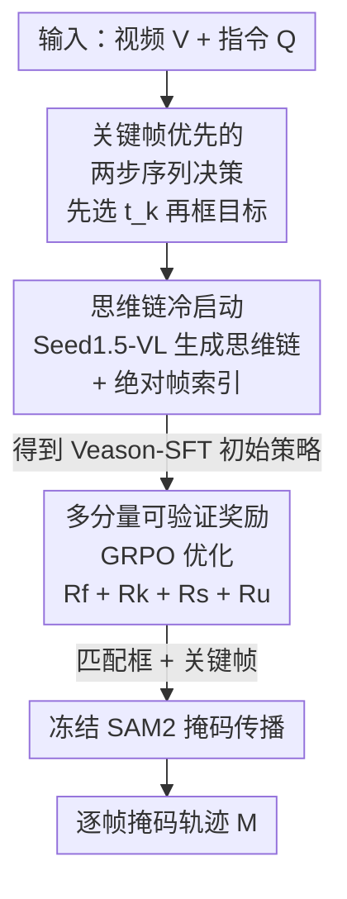

# Reinforcing Video Object Segmentation to Think before it Segments

**会议**: CVPR 2026  
**论文**: [CVF Open Access](https://openaccess.thecvf.com/content/CVPR2026/html/Gong_Reinforcing_Video_Object_Segmentation_to_Think_before_it_Segments_CVPR_2026_paper.html)  
**代码**: 无  
**领域**: 视频理解 / 视频目标分割 / 强化学习  
**关键词**: 视频推理分割, 关键帧选择, GRPO, 思维链, 可验证奖励

## 一句话总结
Veason-R1 把"视频推理分割（VRS）"重新建模成「先选关键帧、再在该帧定位目标」的两步序列决策，用思维链 SFT 冷启动 + GRPO 强化学习（配套时序/空间/一致性三类可验证奖励）训练单一策略，仅用 ReVOS 一个数据集就在 ReVOS、ReasonVOS、MeViS 上刷到 SOTA，并显著提升抗幻觉鲁棒性。

## 研究背景与动机

**领域现状**：视频推理分割（Video Reasoning Segmentation, VRS）要根据一句自然语言指令，在整段视频里输出目标的逐帧像素掩码轨迹。和指代视频分割（RVOS，指令里明确点名"踩滑板的人"）不同，VRS 的指令往往是隐式的——"门打开后进来、然后交出钥匙的那个人"——需要世界知识和序列级因果/溯因推理。主流做法是用大视觉语言模型（LVLM）把整段视频的语义压进一个特殊的 `<SEG>` token，再交给分割头解码出掩码。

**现有痛点**：这条"token 中心"的路线有两个硬伤。其一，把视频级信息塞进单个 `<SEG>` token 缺乏结构化的推理轨迹，在长视频、频繁遮挡、动态场景里语义高度模糊，行为脆弱，掩码经常对错目标；其二，为了让这个专用 token 和图像 embedding 对齐，这些方法普遍要靠 MeViS/ReVOS/Ref-COCO/Video-VQA 等多源大规模语料混训，数据成本高且仍难处理运动、遮挡等时空难点。

**核心矛盾**：分割结果的好坏，根子上取决于"在哪一帧定位"——选错关键帧，后面 grounding 再准也白搭。但 token 化方案把"选帧"和"定位"耦合在一个不可解释的 token 里，既没有显式的关键帧决策，也没有可验证的中间信号去约束推理过程。

**切入角度**：作者注意到 RL 微调（尤其是 DeepSeek-R1 引入的 GRPO）已经能用"可验证奖励 + 组内相对优势"在 LLM 里激发结构化推理，且在图像级推理分割上也奏效。那么能不能把 VRS 显式拆成"先决策关键帧、再做细粒度 grounding"的序列决策，让每一步都接受可验证奖励的监督？

**核心 idea**：提出 Veason-R1——一个"先思考再分割（think before it segments）"的视觉强化学习框架：先用思维链模仿（CoT-SFT）给策略注入"视频级语义 → 帧级定位"的层级先验，再用 critic-free 的 GRPO 配合时序定位、空间对齐、跨帧一致性三类可验证奖励做偏好优化，把时序决策和细粒度视觉 grounding 真正耦合起来。

## 方法详解

### 整体框架
给定 $T$ 帧视频 $V=\{v_t\}_{t=1}^T$ 和推理指令 $Q_{txt}$，VRS 的目标是输出掩码序列 $M\in[0,1]^{T\times H\times W}$。Veason-R1 不再把目标语义纠缠进特殊 token，而是把任务显式拆成两步序列决策：(i) 模型分析 $(V,Q_{txt})$，预测一个关键帧索引 $t_k$——目标在该帧最显著；(ii) 在 $t_k$ 上做空间 grounding，预测一组框 $B_{t_k}=\{b_i\}_{i=1}^{N_k}$，每个框 $b_i=(x_1,y_1,x_2,y_2)$。最终掩码由把这些框喂进冻结的 SAM2 做标准传播得到。"关键帧 = 目标视觉最突出的那一帧"这个定义在 CoT 监督和 RL 两个阶段共享。

整套训练是两阶段：以 Qwen2.5-VL 为底座，**阶段 1（Veason-SFT）**构造思维链语料做监督微调，让模型获得视频级推理 + 粗定位能力；**阶段 2（Veason-R1）**用 GRPO 配可验证奖励做强化，换来更紧的时空 grounding 和更连贯的推理链。

### 关键设计

**1. 关键帧优先的两步序列决策：把"先看哪一帧"从黑箱里解放出来**

痛点直接来自 `<SEG>` token：它把"选哪一帧定位"这个决策隐式吞进了一个不可解释的向量，长视频遮挡场景下经常对错目标。Veason-R1 的做法是把 VRS 显式建模成"先选关键帧 $t_k$、再在该帧 grounding"的两步决策，并让两步都进入推理链和奖励监督。这个分解之所以有效，是因为它把一个原本纠缠的时空问题拆成了"时序决策（哪一帧）"和"空间定位（帧内哪里）"两个边界清晰、各自可验证的子问题——消融里把关键帧固定为"第一个含目标的帧"再做 grounding，J&F 在 referring/reasoning 子集上分别掉 4.7 和 5.5；反过来只训关键帧检测、不训 grounding 又掉 8.4 和 5.8。两边都掉点恰恰说明：时序和空间必须联合建模，缺一不可，而显式分解正好让二者都能被单独监督。

**2. 思维链冷启动 + 绝对帧索引：先让策略学会"怎么想"，再去强化**

直接对 LVLM 上 RL，在复杂时序动态和隐式指令下非常脆弱，奖励信号太稀疏、策略容易崩。所以作者先做一个 CoT 监督冷启动（Veason-SFT）：用 Seed1.5-VL 自动生成分步推理轨迹——为每个视频从"目标面积 top-5 帧"里随机选一个伪关键帧（避免索引过拟合），让模型 (i) 分析场景、(ii) 论证为什么这帧最能体现指代目标、(iii) 在该帧定位目标。推理链包进 `<think>...</think>`、最终关键帧索引和框坐标放进 `<answer>...</answer>`，再用标准自回归 next-token 预测、配 LoRA（rank=8）微调 Qwen2.5-VL。配套一个看似不起眼但关键的 trick——**绝对帧索引**：给每个采样帧标上它在视频里的全局绝对编号（如 `<0>`、`<7>`、`<23>`），而不是片段内相对编号（永远是 `<0>...<3>`）。相对编号在不同视频里复用同一组标签，会诱导模型走捷径、塌缩到固定的关键帧索引；绝对索引则像"实例专属的时间锚点"，缓解位置歧义、稳住定位。消融显示去掉 CoT 推理后 J&F 直接掉 12.8/8.5，绝对索引相比相对索引也有 1.3/0.1 的稳定收益。

**3. 多分量可验证奖励 + GRPO：用四个"能算出来"的信号塑造推理质量**

冷启动只给了初始化，真正把时空 grounding 拧紧的是 GRPO 阶段的奖励设计。每轮策略采样 $G$ 个候选补全，用组内 Z-score 标准化把原始奖励转成相对优势 $A_i=(r(o_i)-\mu_r)/\sigma_r$（满足 $\sum_i A_i=0$，对奖励尺度不敏感），再用 PPO 式重要性加权目标更新，并对 SFT 参考模型加 KL 惩罚防止策略漂移和奖励过优化。总奖励是四项之和，系数全设 1.0：

$$R_{total}=\alpha_f R_f+\alpha_k R_k+\alpha_s R_s+\alpha_u R_u$$

四项各管一条互补的"轴"：$R_f$ 是格式合规奖励，强制 `<think>`/`<answer>` 结构和严格的字典输出 schema（含 `keyframe_timestamp` 整数和 `bbox_2d_list`）；$R_k$ 是时序定位奖励，鼓励选目标最显著的帧，定义为预测关键帧 $t_k$ 上目标掩码面积与所有采样帧最大掩码面积之比 $R_k=C_{t_k}/\max_{t\in S}(C_t)$；$R_s$ 是空间对齐奖励，先用 IoU 构造代价矩阵 $C_{i,j}=1-\text{IoU}(b_i,b_j^{gt})$、再用匈牙利算法做一对一匹配（支持多目标），奖励取匹配 IoU 的归一化和 $R_s=\frac{1}{\max(N_k,N_k^{gt})}\sum_{(i,j)\in C'}\text{IoU}(b_i,b_j^{gt})$；$R_u$ 是统一一致性奖励，把匹配后的框 $B'_{t_k}$ 连同关键帧时间戳喂进冻结 SAM2 生成视频级掩码 $M=\text{SAM2}(B'_{t_k},V_S,t_k)$，再算与 GT 掩码跨帧平均 IoU $R_u=\frac{1}{\hat T}\sum_{t\in S}\text{IoU}(m_t,m_t^{gt})$。$R_u$ 是把"关键帧选得对不对"和"框得准不准"真正耦合起来的那一项——它直接用下游传播质量去反推上游决策，让两步决策不再各自为政。消融显示去掉 $R_s$ 掉点最猛（2.0/2.9），去掉 $R_u$ 也掉 0.6/0.7。

### 损失函数 / 训练策略
SFT 阶段：Qwen2.5-VL + LoRA（rank=8），用 LLaMA-Factory，学习率 $1\times10^{-4}$ 余弦衰减、梯度累积 8 步、1 个 epoch，仅训 adapter、其余冻结。RL 阶段：用 VERL，全局 batch 16，每个 prompt 采 8 个候选构造偏好，1 个 epoch、学习率 $1\times10^{-6}$，4 张 A100。训练样本全部来自 ReVOS——SFT 用自建 CoT 语料，GRPO 阶段按 ReVOS 指代/推理子集比例采样 10,000 条。

## 实验关键数据

### 主实验
评测采用区域相似度 $\mathcal{J}$、轮廓精度 $\mathcal{F}$ 及其均值 $\mathcal{J}\&\mathcal{F}$ 为主指标，另用鲁棒性分数 $\mathcal{R}$ 衡量抗幻觉能力。

| 数据集 | 指标 | Veason-R1-7B | 之前SOTA | 提升 |
|--------|------|------|----------|------|
| ReVOS (Overall) | $\mathcal{J}\&\mathcal{F}$ | 61.3 | 60.0 (VRS-HQ-13B) | +1.3 |
| ReVOS | 鲁棒性 $\mathcal{R}$ | 27.0（3B 为 28.5） | 19.7 (VRS-HQ-7B) | +8.8（对 3B） |
| ReasonVOS | $\mathcal{J}\&\mathcal{F}$ | 59.9 | 49.9 (GLUS-7B) | +10.0 |
| MeViS（零样本） | $\mathcal{J}\&\mathcal{F}$ | 52.2 | 51.3 (GLUS-7B) | +0.9 |

值得强调的是：Veason-R1-3B 仅用 ReVOS 单数据集，就能在 ReVOS 上追平参数量是其 4 倍多的 VRS-HQ-13B（59.9 vs 60.0），7B 版再超 1.3；在 MeViS 上完全零样本（别人是把 MeViS 混进训练的）仍超 SOTA 0.9，说明"先想再分割"学到的是可迁移的归纳偏置。

### 消融实验
| 配置 | Referring $\mathcal{J}\&\mathcal{F}$ | Reasoning $\mathcal{J}\&\mathcal{F}$ | 说明 |
|------|------|------|------|
| Ours (Full) | 63.0 | 56.8 | 完整模型（基于 3B） |
| w/o $R_s$ | 61.0 | 53.9 | 去空间对齐奖励，掉点最猛（−2.0 / −2.9） |
| w/o $R_k$ | 61.6 | 54.9 | 去时序定位奖励 |
| w/o $R_u$ | 62.4 | 56.1 | 去一致性奖励（−0.6 / −0.7） |
| Pure GRPO | 60.0 | 54.2 | 不做 CoT-SFT 直接 RL，差 3.0 / 2.6 |
| CoT-SFT only | 51.1 | 41.6 | 只 SFT 不 RL |
| Grounding-only（固定关键帧） | 58.3 | 51.3 | 不选帧直接定位，−4.7 / −5.5 |
| Qwen2.5-VL（base） | 20.9 | 19.5 | 未微调底座 |

### 关键发现
- **空间对齐奖励 $R_s$ 贡献最大**：去掉它在两个子集分别掉 2.0/2.9，说明帧内精确定位是分割质量的命门；$R_u$ 这种耦合奖励虽然单去掉只掉 0.6/0.7，但它是把关键帧决策和掩码传播质量串起来的关键。
- **CoT 与 GRPO 互补**：纯 GRPO 已比 CoT-SFT 高 8.9/12.6，但 CoT-SFT + GRPO 再比纯 GRPO 高 3.0/2.6——结构化推理链做初始化，能让后续偏好优化收敛得更好。
- **关键帧必须先选**：固定关键帧再 grounding 掉 4.7/5.5，只训选帧不训定位掉 8.4/5.8，两头都掉证明时序与空间需联合建模。
- **关键帧显著性与精度正相关但有数据集差异**：Pearson R 在 MOSE/OVIS 约 0.55/0.52，UVO 约 0.49，LV-VIS 仅约 0.26，说明杂乱/运动/遮挡会削弱这种相关性，也正是设计时序+空间+一致性多项奖励的动机。

## 亮点与洞察
- **把"选哪一帧"提升为一等公民的显式决策**：传统方法让 `<SEG>` token 隐式背锅，这篇把关键帧选择拆出来当作可监督、可奖励的独立步骤，既提升可解释性（输出带 `<think>` 推理轨迹），又让时序错误能被单独纠正——这是从"端到端黑箱"到"可验证序列决策"的范式切换。
- **统一一致性奖励 $R_u$ 是点睛之笔**：用冻结 SAM2 把预测框传播成视频级掩码、再回算 IoU，等于用下游真实分割质量去反向监督上游的关键帧+框决策，把两步决策的耦合做成了可奖励信号，思路可迁移到任何"先定位锚点再传播"的视频任务。
- **数据效率惊人**：单 ReVOS 训练就追平 13B 多源混训模型，并零样本泛化到 MeViS，提示"可验证推理"比"堆数据对齐 token"更省、更稳。
- **绝对帧索引这个小 trick 很实用**：用全局绝对编号替代片段相对编号，直击"模型塌缩到固定关键帧索引"的捷径学习问题，几乎零成本，任何做视频帧定位的工作都能借鉴。

## 局限与展望
- **依赖伪 CoT 轨迹和外部分割信号**：CoT 标注由 Seed1.5-VL 自动生成（伪关键帧从 top-5 面积帧里随机选），掩码靠冻结 SAM2 传播，作者也承认这两处是潜在误差源——奖励质量受教师模型和 SAM2 上限制约。
- **关键帧策略的误差会向下传播**：两步决策是串行的，选错关键帧后空间 grounding 和掩码传播都会跟着错，缺少端到端的纠错回路。
- **单关键帧假设的适用边界**：方法默认"目标在某一帧最显著"，对目标在多个时段都重要、或需要跨多帧联合定位的指令可能不够。作者展望未来探索无 oracle 的端到端掩码级奖励、在线/流式低延迟策略、更强的时序逻辑约束，以及更长、开放世界视频上的评测。

## 相关工作与启发
- **vs VRS-HQ / VISA / VideoLISA / HyperSeg（token 中心 VRS）**：它们都把视频级语义压进专用分割 token 再解码掩码，可解释性弱、需多源大规模语料；Veason-R1 改用显式"选帧→定位"序列决策 + 可验证奖励，单数据集就追平甚至超过它们，且产出可读的推理轨迹。
- **vs Omni-R1（同样用 GRPO 做 VRS）**：Omni-R1 把时序和空间推理拆成级联双系统、靠多源训练和更强的 Sa2VA 底座；Veason-R1 是单一端到端策略、仅 ReVOS 训练，却拿到更高的总体 $\mathcal{J}\&\mathcal{F}$，说明"统一策略 + 耦合奖励"比"级联子系统"更高效。
- **vs Seg-Zero / VisionReasoner / PixelThink（图像级 RL 分割）**：它们在图像层面设计任务对齐奖励，Veason-R1 把这套可验证奖励思路扩展到视频，新增了时序定位奖励 $R_k$ 和跨帧一致性奖励 $R_u$ 来处理图像没有的时序维度。

## 评分
- 新颖性: ⭐⭐⭐⭐⭐ 首个用 GRPO + 结构化 SFT 联合做关键帧选择和空间 grounding 的 VRS 框架，"先想再分割"范式清晰。
- 实验充分度: ⭐⭐⭐⭐⭐ 三大 benchmark + 五张消融表 + 关键帧显著性相关性分析，奖励/训练策略/选帧/索引逐项拆解，证据链完整。
- 写作质量: ⭐⭐⭐⭐ 公式与奖励定义交代清楚、动机递进自然，仅图注与正文偶有图序号对应小瑕疵。
- 价值: ⭐⭐⭐⭐⭐ 单数据集追平多源 13B、零样本泛化、显著抗幻觉，可验证奖励范式对视频时序定位类任务有较强迁移价值。

<!-- RELATED:START -->

## 相关论文

- [\[CVPR 2026\] InterRVOS: Interaction-Aware Referring Video Object Segmentation](interrvos_interaction-aware_referring_video_object_segmentation.md)
- [\[CVPR 2026\] Efficient Video Object Segmentation and Tracking with Recurrent Dynamic Submodel](efficient_video_object_segmentation_and_tracking_with_recurrent_dynamic_submodel.md)
- [\[CVPR 2026\] SAMIX: Reinforcing SAM2 with Semantic Adapter and Reference Selecting Policy for Mix-Supervised Segmentation](samix_reinforcing_sam2_with_semantic_adapter_and_reference_selecting_policy_for_.md)
- [\[CVPR 2026\] Long-RVOS: A Comprehensive Benchmark for Long-term Referring Video Object Segmentation](long-rvos_a_comprehensive_benchmark_for_long-term_referring_video_object_segment.md)
- [\[CVPR 2026\] DeRVOS: Decoupling Consistent Trajectory Generation and Multimodal Understanding for Referring Video Object Segmentation](dervos_decoupling_consistent_trajectory_generation_and_multimodal_understanding_.md)

<!-- RELATED:END -->
