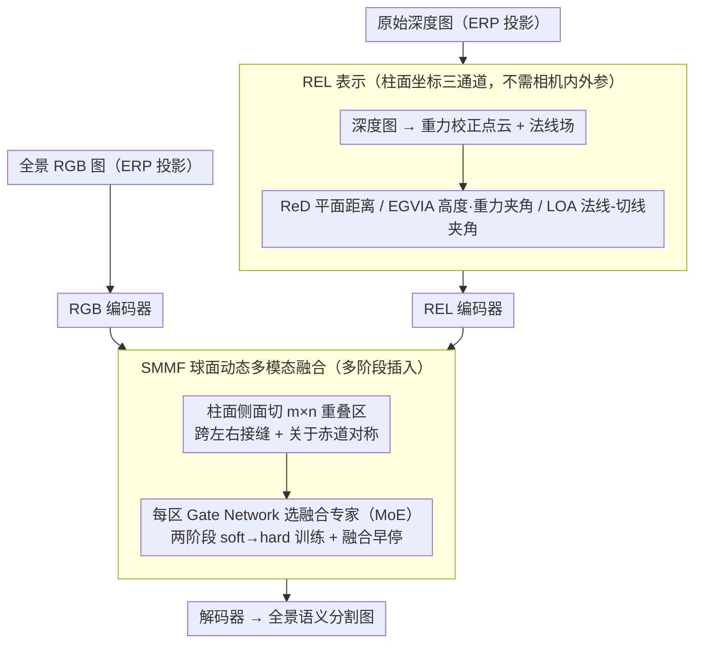

# REL-SF4PASS: Panoramic Semantic Segmentation with REL Depth Representation and Spherical Fusion

**会议**: CVPR 2026  
**arXiv**: [2601.16788](https://arxiv.org/abs/2601.16788)  
**代码**: 无  
**领域**: 语义分割  
**关键词**: 全景语义分割, 深度表示, 多模态融合, 柱面坐标, RGB-D

## 一句话总结

提出 REL 深度表示（基于柱面坐标系的 Rectified Depth + EGVIA + LOA 三通道）和球面动态多模态融合（SMMF），用于全景语义分割，在 Stanford2D3D 上实现 63.06% 平均 mIoU（比 HHA 基线提升 2.35%），并将面对 3D 扰动时的性能方差降低约 70%。

## 研究背景与动机

**领域现状**: 全景语义分割（PASS）旨在基于 360°×180° 超广角视野实现完整场景感知，在自动驾驶、AR/VR 等领域应用广泛。主流方法采用等距柱面投影（ERP）将球面数据转换为 2D 图像进行处理。

**现有痛点**: RGB-D 方法中广泛使用的 HHA 表示存在两个关键缺陷：(a) 其法线方向的第二自由度（侧向方位角）缺失，信息不完整；(b) HHA 计算依赖相机姿态和内参（如焦距），处理纯图像数据不够便捷。

**核心矛盾**: 全景图像基于 ERP 投影，不同区域的畸变和局部特征差异很大，但现有多模态融合策略对所有区域使用相同方式，缺少区域自适应能力。同时柱面展开会破坏场景结构的连续性。

**本文目标**：设计更完整的全景深度表示方案并实现区域自适应多模态融合，提升全景场景的语义分割精度和鲁棒性。

**切入角度**: 利用 ERP 投影本身使用的柱面几何，设计基于柱面坐标的三通道表示 REL，并通过在柱面侧面上采样重叠区域来实现球面感知的区域级自适应融合。

**核心 idea**: 用柱面坐标 ρθz 完整表示 3D 位置和法线方向（REL），并通过球面动态 MoE 融合（SMMF）实现不同区域不同融合策略。

## 方法详解

### 整体框架

REL-SF4PASS 要解决的是全景（360°×180°）RGB-D 分割里「深度表示不完整 + 融合不分区域」两个痛点，对应两个核心设计：REL 表示和 SMMF 融合。它是一个双分支结构：RGB 一支、REL 深度一支并行编码；前端先把原始深度图转成柱面坐标下的三通道 REL 表示，编码过程中再在多个阶段插入 SMMF 融合单元，让每个空间区域自己决定该不该融合、怎么融合，最后由解码器输出语义分割图。

### 关键设计

**1. REL 表示：用柱面坐标补回 HHA 丢掉的那一维**

全景图是用等距柱面投影（ERP）展开的，沿用平面 RGB-D 的 HHA 表示有两个硬伤：法线方向缺了侧向方位角这第二自由度、且 HHA 要靠相机姿态和焦距才能算。REL 直接顺着 ERP 自带的柱面几何 ρθz 重建深度，三个通道各管一件事：Rectified Depth（ReD）取平面距离 $\rho = d\cos\varphi$，剥掉高度方向的干扰；EGVIA 抓住了一个统计观察——全景图里归一化高度 $H$ 和法线-重力夹角 $A$ 高度线性相关，于是对水平面区域用 $\lambda A + (1-\lambda)H$ 融合两者、对垂直面只用 $A$；LOA 取法线与切线 $\hat{T}$ 的夹角，正好补上 HHA 缺的法线第二自由度。整套表示只需要原始深度图、不依赖任何相机内外参，因此换设备也能直接用，对 3D 扰动也更稳。

**2. SMMF：让每个区域自己决定怎么融合**

ERP 展开后不同区域畸变差异很大，对所有位置用同一种 RGB-深度融合方式显然不合理。SMMF 不在原始图上切区，而是直接在柱面侧面上采样 $m\times n$ 个相互重叠的区域——水平方向允许区域跨越全景图左右接缝、垂直方向从赤道（φ=0°）向上下对称扩展，从而减轻柱面展开对场景结构的割裂。每个区域配一个 Gate Network，用 MoE 架构在 $B$ 个专家融合操作里独立挑一种，其中包含「不融合、只用 RGB」这一选项（因为纯深度单独用于分割效果差，故深度不单独使用）。训练沿用 DynMM 的两阶段 soft-hard 调度：先 soft 阶段让各专家以软概率参与、再 hard 阶段强制 one-hot 选定单一专家，兼顾训练稳定与推理时的明确选择。在此之上再加一条「融合早停」约束——只要某一级融合单元选了「不融合」，后面所有融合单元就强制都不融合，避免在确实不需要深度信息的区域反复做无谓融合、省掉冗余计算。

### 损失函数 / 训练策略

训练用标准语义分割交叉熵损失，配合 SMMF 的两阶段调度：soft training 阶段各专家概率非零、共同学习；hard training 阶段概率收敛为 one-hot，固定每个区域的融合专家。

## 实验关键数据

### 主实验（Stanford2D3D 全景数据集）

| 方法 | 模态 | 3-fold 平均 mIoU | Fold1 mIoU |
|---|---|---|---|
| Trans4PASS+ (2024) | RGB | 53.7% | 53.6% |
| SGTA4PASS (2023) | RGB | 55.3% | 56.4% |
| Twin (2025) | RGB | 55.85% | - |
| SFSS (2024) | RGB-HHA | 60.60% | - |
| CMX* (复现) | RGB-HHA | 60.71% | 63.98% |
| **REL-SF4PASS (Ours)** | **RGB-REL** | **63.06%** | **67.37%** |

### 3D 扰动鲁棒性（SGA 验证，16 种旋转组合）

| 表示 | 平均 mIoU 范围 | 性能方差 |
|---|---|---|
| HHA + SMMF | 59.13~65.85% | 高方差 |
| REL + SMMF (Ours) | 63.39~67.37% | **方差降低约 70%** |

### 关键发现

- REL 比 HHA 在所有 16 种 3D 扰动配置下均更优，验证了柱面坐标表示对旋转的鲁棒性
- SMMF 区域级融合比统一融合有效，赤道附近区域语义更丰富、需要更精细的融合
- REL 不依赖相机参数，更容易泛化到不同采集设备
- RGB-REL 达到 63.06% 平均 mIoU，超越包括 RGB-HHA 在内的所有已知方法

## 亮点与洞察

- **柱面坐标的自然适配**: 全景图本身由柱面投影产生，用柱面坐标表示深度信息在几何上自洽
- **平面-法线关系的发现**: H 和 A 在全景图中高度相关的统计发现是设计 EGVIA 的关键洞察
- **不依赖相机参数**: REL 仅需深度图即可计算，大大简化了数据处理流程
- **70% 方差降低**: 对 3D 扰动的鲁棒性提升具有实际工程价值

## 局限与展望

- 仅在 Stanford2D3D 单一数据集上验证，缺少室外场景的评估
- SMMF 的区域数目 m×n 需要手动设定，自适应确定可能更优
- 未与最新的 DINOv2 或大规模预训练 backbone 结合
- LOA 通道在近垂直面场景的信息增益是否稳定需要更多分析

## 相关工作与启发

- **HHA 表示** 是 RGB-D 分割的经典设计（Gupta et al.），REL 是直接的升级替代方案
- **CMX** 提出的跨模态特征修正和融合模块是 SMMF 的设计灵感来源
- **DynMM** 的样本自适应融合被 SMMF 扩展到区域级，粒度更细

## 评分

- 新颖性: ⭐⭐⭐⭐ (REL 表示设计严谨，柱面坐标思路自然)
- 实验充分度: ⭐⭐⭐ (单一数据集，但鲁棒性分析详尽)
- 写作质量: ⭐⭐⭐⭐ (数学推导清晰，物理意义解释充分)
- 价值: ⭐⭐⭐⭐ (全景分割领域的实用贡献，可直接替换 HHA)

<!-- RELATED:START -->

## 相关论文

- [\[CVPR 2026\] Unified Spherical Frontend: Learning Rotation-Equivariant Representations of Spherical Images from Any Camera](unified_spherical_frontend_learning_rotation-equivariant_representations_of_sphe.md)
- [\[CVPR 2026\] Seeing Beyond: Extrapolative Domain Adaptive Panoramic Segmentation](seeing_beyond_extrapolative_domain_adaptive_panoramic_segmentation.md)
- [\[CVPR 2026\] Denoise and Align: Towards Source-Free UDA for Robust Panoramic Semantic Segmentation](denoise_and_align_towards_source-free_uda_for_robust_panoramic_semantic_segmenta.md)
- [\[CVPR 2026\] GeomPrompt: Geometric Prompt Learning for RGB-D Semantic Segmentation Under Missing and Degraded Depth](geomprompt_rgbd_segmentation.md)
- [\[CVPR 2026\] GeoSURGE: Geo-localization using Semantic Fusion with Hierarchy of Geographic Embeddings](geosurge_geo-localization_using_semantic_fusion_with_hierarchy_of_geographic_emb.md)

<!-- RELATED:END -->
