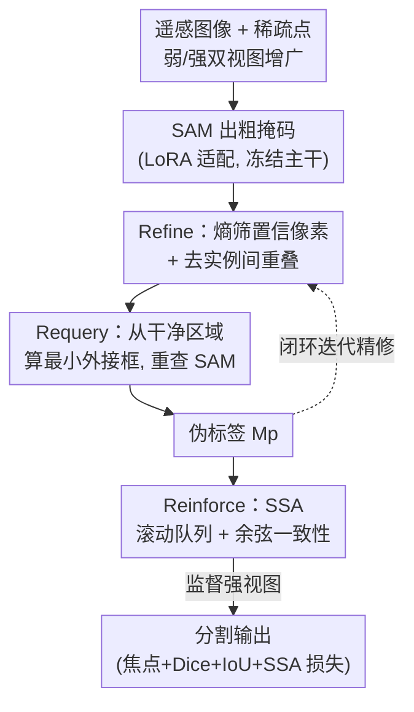

# ReSAM: Refine, Requery, and Reinforce: Self-Prompting Point-Supervised Segmentation for Remote Sensing Images

**会议**: CVPR 2026  
**论文**: [CVF Open Access](https://openaccess.thecvf.com/content/CVPR2026/html/Subhani_ReSAM_Refine_Requery_and_Reinforce_Self-Prompting_Point-Supervised_Segmentation_for_Remote_CVPR_2026_paper.html)  
**代码**: https://github.com/MNaseerSubhani/ReSAM.git  
**领域**: 遥感分割 / 弱监督  
**关键词**: 点监督分割、SAM 自适应、自提示、遥感图像、语义对齐

## 一句话总结
ReSAM 把每个实例的稀疏点击通过 SAM 先得到粗掩码，再从掩码反推紧致框作为「自提示」重新查询 SAM，并用一个轻量的滚动队列做跨增广语义对齐，让 SAM 仅靠 1 个点标注就在三个遥感数据集上逼近全掩码监督（与全监督差距压到 1.3% / 4.9% / 8.5%），同时比原型对齐方法省 84% 显存。

## 研究背景与动机

**领域现状**：高分辨率遥感影像（RSI）的实例分割对农业、城市规划、环境监测都很关键，但一张 10k×10k 卫星图可能含上千个细粒度目标，逐像素标注成本极高。SAM 这类基础分割模型在自然图像上零样本能力惊人，于是一条主流路线是把 SAM 适配到遥感：ROS-SAM 用 LoRA 微调 + 多尺度/边界增强，RS-Prompter 学习生成遥感类别的 prompt 嵌入——但它们仍然是**全监督**，需要密集像素标签。

**现有痛点**：要省标注就得用点级监督，可点标注本身不完整——它没有目标轮廓和空间范围信息。更糟的是 SAM 的掩码解码器在只给点击时**语义模糊**：密集场景里一个点可能让附近多个目标粘连成一块掩码。SAM 又是「每个 prompt 独立预测掩码、互相不知道对方存在」，于是在杂乱遥感场景里会产生**重叠或碎裂**的掩码——论文 Fig.2 展示的「overlap region」并不对应真实目标，而是掩码泄漏。SAM 的预测可能局部准确，但全局不一致。

**核心矛盾**：现有点监督方法（以 PointSAM 为代表）靠**原型库**做特征对齐来纠正噪声伪标签，效果不错，但原型库内存重、难扩展——它从固定数量样本生成原型，并假设这个采样量足以代表特征分布，这一假设在大规模或异质数据集上会崩。于是「对齐质量」和「内存/可扩展性」之间存在硬 trade-off。

**本文目标**：在**只有稀疏点标注**的前提下，(1) 把不可靠的点监督转成结构化、互不重叠的区域线索；(2) 在不堆原型库的情况下抑制伪标签噪声的误差累积。

**切入角度**：点标注本身弱，但 SAM 接受框 prompt 时质量明显更高——那能不能让模型**自己**把点先变成粗掩码、再从粗掩码反推出框、用框去「自我重问」SAM？同时用一个只存最近若干嵌入的滚动队列替代庞大原型库来做一致性正则。

**核心 idea**：一个闭环的 **Refine–Requery–Reinforce（R³）**——点→精修去重叠掩码（Refine）→自构框 prompt 重查 SAM（Requery）→软语义对齐稳住嵌入（Reinforce），用自提示而非密集标签逐步提升 SAM 的分割质量与域鲁棒性。

## 方法详解

### 整体框架

ReSAM 在「弱-强双视图」自训练框架里运行：每张训练图被增广两次，弱视图 $I_w$（仅水平翻转等简单操作）负责生成伪掩码，强视图 $I_s$（颜色/亮度/对比度/阴影等强扰动）负责接受监督，目标是让二者预测一致 $\phi_m(\phi_i(I_w),\phi_p(p^*)) \approx \phi_m(\phi_i(I_s),\phi_p(p))$。SAM 的图像编码器、prompt 编码器、掩码解码器在三个阶段**共享且冻结**，只在图像编码器的 query/key/value 投影上插入 LoRA（秩 4）来学域特定注意力。

整条 pipeline 是一个闭环：给定弱视图和稀疏正点 $P^+=\{p_i\}$，先用 SAM 出粗掩码 → **Refine** 用熵图筛置信像素 + 去实例间重叠，得到干净的实例区域；**Requery** 从每个干净区域算最小外接框，把框当新 prompt 重查 SAM，得到更准的伪标签 $M_p$；**Reinforce** 在训练中用 Soft Semantic Alignment（SSA）把弱/强视图的实例嵌入拉近，抑制误差漂移。最终用 $M_p$ 作为伪真值监督强视图。

### 关键设计

**1. Refine：用熵置信度 + 重叠抑制把粗掩码洗成互不打架的实例区域**

痛点很直接：SAM 从点出的掩码会泄漏、会让相邻目标粘连，直接拿来当伪标签会把错误一路传下去。Refine 分两步治这个病。第一步是**逐实例置信筛选**：对每个实例 $k$ 的概率图 $\hat{M}^{(k)}_{ij}$ 算 Shannon 熵 $H^{(k)}_{ij}=-[\hat{M}^{(k)}_{ij}\log\hat{M}^{(k)}_{ij}+(1-\hat{M}^{(k)}_{ij})\log(1-\hat{M}^{(k)}_{ij})]$ 并归一化到 $[0,1]$——熵低=模型有把握，熵高=像素模糊。然后只保留既高概率又低熵的像素：$C^{(k)}_{ij}=1$ 当且仅当 $\hat{M}^{(k)}_{ij}(1-H^{(k)}_{ij})>\epsilon$（取 $\epsilon=0.2$）。

第二步是**显式去重叠**：算重叠图 $O_{ij}=1$ 当 $\sum_{k}C^{(k)}_{ij}>1$（即一个像素被多个实例同时认领），再把重叠区从每个实例里剜掉，得到精修掩码 $M^{\text{ref},(k)}_{ij}=C^{(k)}_{ij}(1-O_{ij})$。这一步保证每个像素只属于一个实例，从根上掐断跨目标泄漏。之所以有效，是因为它不去「猜」目标边界，而是把 SAM 自己都不确定（高熵）或自相矛盾（被多实例争抢）的像素先剔除，留下的才是干净、实例专属、适合当区域线索去重问的部分。

**2. Requery：把点监督升级成框监督的「自我重问」**

SAM 在框 prompt 下的掩码质量远好于点 prompt，但遥感里没人给框。Requery 的做法是让模型**自己造框**：对每个精修区域 $M^{\text{ref},(k)}$ 取最小外接框 $B=\text{Box}(M^{\text{ref},(k)})$，组成新 prompt $P_B=\{B\}$，在弱视图下重查 SAM 得到 $M_p=\Phi_m(\Phi_i(I_w),\Phi_p(P_B))$。这一步把「不确定的点监督」转成「结构化区域查询」，产出更精、更带上下文的掩码作为伪真值。它有效的关键在于：第一阶段 Refine 已经把粗掩码洗干净了，所以反推出来的框紧致、不含泄漏，框比点携带了目标的空间范围信息，SAM 在框引导下自然给出更连续、更贴边界的掩码——相当于用 SAM 自己的高质量模式去纠正 SAM 自己的低质量模式，整个过程不需要任何人工框/掩码标注。

**3. Reinforce（SSA）：用滚动队列 + 软余弦对齐替代重原型库，稳住伪标签**

即便重问提升了空间精度，伪标签自训练仍易受**确认偏差**之害——早期噪声会顺着「目标嵌入控制掩码生成」这条路放大。PointSAM 用原型库对齐来压噪声，但内存重、扩展差。SSA 给出一个轻量替代：把弱/强增广的实例嵌入 $s_i,h_i$ 各自 L2 归一化（$\hat{s}_i=s_i/\|s_i\|$，$\hat{h}_i=h_i/\|h_i\|$），分别压进长度 $q$ 的 FIFO 队列 $\mathcal{Q}_s,\mathcal{Q}_h$（实现里 $q=128$），损失就是让对应嵌入余弦相似度趋近 1：

$$\mathcal{L}_{\text{SSAL}}=\frac{1}{q}\sum_{i=1}^{q}\big(1-\hat{s}_i^\top\hat{h}_i\big)$$

它和对比学习的本质区别是**不需要负样本也不需要 margin**——只给一个「软」语义引导信号，正则化表示流形、降低梯度方差、改善收敛。之所以省内存还有效：滚动队列只维护最近若干嵌入而非整个数据集的原型库（实测在 WHU 上比 PointSAM 省 84% 显存），又因为它对齐的是「同一目标在弱/强两个视图下应当一致」这一不变性，所以保留了特征对齐抗噪的好处，同时保持实例感知（instance-aware）。论文称设计灵感来自 MoCo 的动量对比思路。

### 损失函数 / 训练策略

总损失把分割质量与语义稳定性合在一起：$\mathcal{L}_{\text{total}}=\mathcal{L}_{\text{focal}}+\mathcal{L}_{\text{dice}}+\mathcal{L}_{\text{iou}}+\beta\,\mathcal{L}_{\text{SSAL}}$，其中前三项做逐像素掩码监督，$\mathcal{L}_{\text{SSAL}}$ 做特征一致性，$\beta=0.1$。骨干用 SAM(ViT-B) 与 SAM2(Hiera-B+)，LoRA 秩 4、只更新 A/B 两个低秩矩阵，Adam（lr $5\times10^{-4}$、weight decay $1\times10^{-4}$），batch size 1，A100 80GB，嵌入队列 128，并用 EMA 稳定参数更新。注意是 1/2/3 点的稀疏正负点采样，训练全程**不给**任何全掩码或框标注。

## 实验关键数据

### 主实验

在 NWPU VHR-10、WHU、HRSID-Inshore 三个遥感基准上对比 Direct test（裸 SAM）、Self-Training、DePT、Tribe、WeSAM、PointSAM，并报告全监督 LoRA 微调作上界。下表取 1-point / SAM-based 设置（mIoU / F1）：

| 数据集 | Direct SAM | PointSAM（前 SOTA） | ReSAM（本文） | 全监督上界 | 与上界差距 |
|--------|-----------|---------------------|---------------|-----------|-----------|
| WHU | 61.03 / 70.69 | 72.63 / 80.39 | **75.86 / 83.80** | 77.15 / 84.55 | 1.3% IoU |
| HRSID-Inshore | 46.56 / 56.06 | 56.06 / 68.38 | **58.40 / 70.11** | 63.29 / 75.32 | 4.9% IoU |
| NWPU VHR-10 | 58.06 / 68.80 | 66.66 / 76.03 | **70.25 / 79.80** | 78.73 / 86.74 | 8.5% IoU |

在 NWPU 上 ReSAM 对 PointSAM 最高 +3.5 IoU / +3.7 F1，且 1→3 点单调提升，把与全监督的差距压到 9 IoU 点以内。WHU 上几乎所有设置都拿最佳；HRSID 在 1-point 和 3-point 领先，2-point 与 PointSAM 接近（论文归因于杂乱背景 + 小目标）。

### 消融实验

WHU、1-point，逐组件拆解（$\Delta$ 为相对裸 SAM 的 mIoU 增益）：

| 配置 | mIoU | $\Delta$ | 说明 |
|------|------|---------|------|
| Baseline（Direct SAM） | 61.0 | – | 裸 SAM 点 prompt |
| Self-Training only | 64.9 | +3.9 | 仅师生自训练、无正则 |
| ReSAM w/o Requery | 69.4 | +8.4 | 去掉自构框重问 |
| ReSAM w/o SSA | 71.1 | +10.1 | 去掉软语义对齐 |
| Full ReSAM (R³) | **75.8** | **+14.8** | 完整模型 |

### 关键发现
- **Requery 是最大单点贡献**：从 Self-Training(64.9) 到加上 Requery 后（对比完整模型 75.8 与 w/o Requery 69.4 的落差）可见，自构框重问比单纯自训练带来更大跃升，因为它反复消解不确定区域、减少边界冲突。
- **SSA 提供互补稳定性**：w/o SSA 是 71.1，加上后到 75.8（约 +4.7）。Fig.5 显示去掉 SSA 时 NWPU 早期能冲到高点但后期掉到约 65% IoU（噪声伪标签导致不稳定），SSA 把这种后期退化抹平、维持上升趋势；队列 128 与 256 都稳，太小则不够。
- **显存优势显著**：在 WHU 上 ReSAM 比 PointSAM 省 84% 训练显存——用滚动队列换掉原型库是省内存的直接来源。
- **点数越多越好但收益递减**，1 点已足够逼近上界，这正是「便宜标注」的价值所在。

## 亮点与洞察
- **「自提示」把弱 prompt 升级成强 prompt 的闭环很巧**：核心洞察是 SAM 在框下比在点下强，而高质量框可以从自己洗干净的掩码里免费反推出来——用模型的强模式纠正模型的弱模式，零额外标注。这套「先净化再反推 prompt」的思路可迁移到任何 promptable 基础模型（如交互式检测、医学图像点标注）。
- **熵 × 概率的双重置信筛选 + 显式去重叠**：不靠学一个额外的过滤网络，而是用 $\hat{M}(1-H)>\epsilon$ 这种无参数判据 + 重叠图相减，简单、可解释、即插即用，是处理「实例掩码互相泄漏」的轻巧 trick。
- **用 FIFO 队列 + 无负样本余弦损失替代原型库**：把对比学习里「跨增广一致性」的精髓抽出来、丢掉负样本和 margin，既保留抗噪又省 84% 显存——对大规模异质遥感数据的可扩展性是实打实的工程价值。

## 局限与展望
- **作者承认**：在高度密集的图像里伪标签噪声仍会拖累性能；HRSID 2-point 设置只与 PointSAM 持平，说明密集杂乱小目标场景尚未完全攻克。
- **双阶段开销**：Refine→Requery 是「出粗掩码→反推框→再查」的两次前向，推理/训练成本高于一次性方法；作者把「消除双阶段设置」列为未来工作。
- **自己发现**：(1) 评测是 class-agnostic 实例分割且 NWPU 只用正子集，迁移到含大量负样本/多类语义的真实遥感任务时表现未知；(2) $\epsilon=0.2$、$\beta=0.1$、队列 128 等超参的最优值是否随数据密度变化没有充分扫描；(3) SAM2 骨干在部分设置（如 WHU 3-point）反而被 SAM 反超，双骨干优势不稳定，缺乏解释。
- **改进思路**：把 Requery 从「一次性反推框」改成置信度驱动的多轮迭代、只对高熵实例重问，或引入更丰富的 prompt（点+框+粗掩码混合）以减少双阶段开销。

## 相关工作与启发
- **vs PointSAM**：同为点监督 SAM 自训练，PointSAM 靠 FINCH 聚类 + 负 prompt 校准 + **原型库**做特征对齐；ReSAM 用「自构框重问」替代原型纠错、用滚动队列 SSA 替代原型库，结果是多数设置点数更高 + 省 84% 显存，且不受「固定采样原型代表整分布」假设的束缚。
- **vs WeSAM / DePT / Tribe（source-free 域适应）**：它们在训练中做 prompt 引导但无显式重叠抑制与跨视图嵌入对齐，ReSAM 在三个基准上普遍领先，差距主要来自 Refine 的去泄漏和 SSA 的稳定性。
- **vs ROS-SAM / RS-Prompter（全监督 SAM 适配）**：那些方法靠密集像素标签 + 多尺度/prompt 嵌入增强，精度高但标注贵；ReSAM 只用 1 点就把与全监督差距压到 1.3%（WHU），证明点级自提示是一条可扩展的廉价适配路线。
- **vs MoCo / ProDA / WDASS（对齐与一致性正则）**：SSA 借鉴 MoCo 的动量对比与队列思想，但去掉负样本、改成软余弦，定位在「弱-强视图一致性」而非实例判别，更适合伪标签去噪而非表示预训练。

## 评分
- 新颖性: ⭐⭐⭐⭐ 「自洗掩码→反推框自提示」的闭环 + 滚动队列替代原型库，组合清晰且解决了真实的内存/可扩展痛点，但单个组件（熵筛、框 prompt、队列对齐）都有先例。
- 实验充分度: ⭐⭐⭐⭐ 三数据集 × 双骨干 × 1/2/3 点 + 逐组件消融 + 显存对比 + SSA 队列扫描，相当扎实；缺多类语义、负样本场景与超参敏感性的系统分析。
- 写作质量: ⭐⭐⭐⭐ 动机与 R³ 框架讲得清楚、图示到位；公式排版（缓存里）有 OCR 噪声，2-point 偶尔落后的现象解释偏简。
- 价值: ⭐⭐⭐⭐ 点监督 + 省 84% 显存的组合对大规模遥感标注瓶颈很实用，且「自提示纠错」范式可迁移到其他 promptable 基础模型。

<!-- RELATED:START -->

## 相关论文

- [\[AAAI 2026\] S5: Scalable Semi-Supervised Semantic Segmentation in Remote Sensing](../../AAAI2026/segmentation/s5_scalable_semi-supervised_semantic_segmentation_in_remote_sensing.md)
- [\[CVPR 2026\] F2Net: A Frequency-Fused Network for Ultra-High Resolution Remote Sensing Segmentation](f2net_a_frequency-fused_network_for_ultra-high_resolution_remote_sensing_segment.md)
- [\[CVPR 2026\] RDNet: Region Proportion-Aware Dynamic Adaptive Salient Object Detection Network in Optical Remote Sensing Images](rdnet_region_proportion-aware_dynamic_adaptive_salient_object_detection_network_.md)
- [\[CVPR 2026\] SGMA: Semantic-Guided Modality-Aware Segmentation for Remote Sensing with Incomplete Multimodal Data](sgma_semantic-guided_modality-aware_segmentation_for_remote_sensing_with_incompl.md)
- [\[CVPR 2026\] Test-Time Multi-Prompt Adaptation for Open-Vocabulary Remote Sensing Image Segmentation](test-time_multi-prompt_adaptation_for_open-vocabulary_remote_sensing_image_segme.md)

<!-- RELATED:END -->
