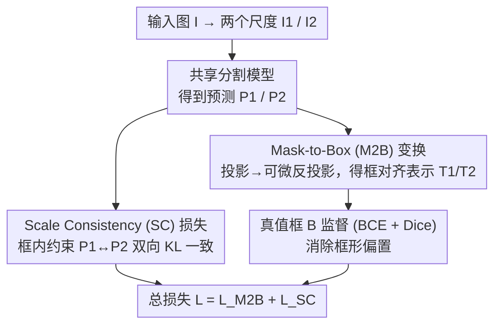

# Rethinking Box Supervision: Bias-Free Weakly Supervised Medical Segmentation

**会议**: CVPR 2026  
**论文**: [CVF Open Access](https://openaccess.thecvf.com/content/CVPR2026/html/Wei_Rethinking_Box_Supervision_Bias-Free_Weakly_Supervised_Medical_Segmentation_CVPR_2026_paper.html)  
**代码**: 待确认  
**领域**: 语义分割 / 弱监督学习 / 医学图像  
**关键词**: 弱监督分割、边界框监督、医学图像、可微变换、尺度一致性

## 一句话总结
针对边界框弱监督医学分割中"框形偏置导致预测趋于矩形"的痛点，作者提出 WeakMed 框架，用一个可微的 Mask-to-Box（M2B）变换把预测掩码投影到与框对齐的表示上做监督以消除框形偏置，再用一个 Scale Consistency（SC）尺度一致性损失补偿 M2B 丢掉的细粒度信息，两个组件均只在训练时启用、不改网络结构、零推理开销，在 9 任务/9 数据集/6 模态上稳超已有弱监督方法并逼近全监督。

## 研究背景与动机
**领域现状**：医学图像分割主流仍依赖全监督，从 U-Net 及其变体（UNet++、nnU-Net、SANet）到 TransFuse、MedT 等 CNN-Transformer 混合/纯 Transformer 架构，都需要密集的像素级标注。为降标注成本，弱监督逐渐兴起，用涂鸦、点、边界框等稀疏信号训练；其中**边界框**因标注最廉价、可复用大规模检测数据而最有吸引力。

**现有痛点**：① 像素级标注昂贵且主观——病灶边界模糊、与周围组织相似，标注噪声大、泛化受损；② 边界框虽便宜却**天生缺乏形状信息并引入结构性偏置**，常导致预测过度矩形化；③ 已有框监督方法（BoxInst、DiscoBox、BoxLevelSet）仍受框的粗糙性影响，边界定位欠佳；④ 医学领域的框监督方法（如 BoxPolyp、WeakPolyp）多依赖启发式伪标签生成 + 迭代精化，易误差累积、训练不稳，且常是任务专用（如只做息肉）、不支持单图多目标。

**核心矛盾**：边界框提供了可靠的**空间定位**约束，却同时强加了错误的**形状先验**（框形偏置）——如何"留下定位、去掉框形"，把定位约束与形状学习解耦，是问题的根本。

**本文目标**：造一个通用、即插即用、不改架构的框监督框架，既消除框形偏置、又补偿框监督的欠约束与歧义，并能天然支持多目标、跨任务跨模态泛化。

**切入角度**：与其用非可微的紧框提取或启发式伪标签去"硬套"框，不如把"框约束"重新表述为一个**可微的投影操作**——只要求预测在"投影到框对齐空间后"与框一致，而不直接逼迫预测变成矩形；再用一致性正则补回投影损失的信息。

**核心 idea**：用可微 **Mask-to-Box 变换**做"去形状、留空间"的框对齐监督（消偏置），再用 **Scale Consistency 损失**做跨尺度像素级正则（补歧义），两者互补即可在纯框标注下逼近全监督。

## 方法详解

### 整体框架
WeakMed 分"分割 + 监督"两阶段。分割阶段用一个标准骨干（PVTv2-B2）提多尺度特征并融合出预测，**本文不动这部分**。核心在监督阶段：给定输入图 $I$，先生成两个不同尺度的缩放版本 $I_1, I_2$，分别独立喂进同一分割模型得到预测 $P_1, P_2$（再统一到同一分辨率）；对两个预测各做 M2B 变换得到框对齐表示 $T_1, T_2$，用真值框 $B$ 监督它们（消除框形偏置）；由于 M2B 是多对一映射、会造成欠约束，再用 SC 损失约束 $P_1$ 与 $P_2$ 在框内一致，提供互补的像素级正则。两个组件都只在训练时用、推理时丢弃，零额外开销、可无缝接入现有分割架构。

### 关键设计

**1. Mask-to-Box（M2B）可微变换：用"投影到框空间"消除框形偏置**

直接拿真值框去监督预测掩码会逼着预测变矩形（框缺形状信息），传统紧框提取又依赖非可微几何操作、对碎片化/噪声预测敏感。M2B 的做法是不监督原始预测、而监督它的**框对齐表示** $T$，整个过程可微，分三步：① **投影**——给定预测 $P\in[0,1]^{H\times W}$ 与框 $[x,y,w,h]$，先抠出框内局部区域 $P'$，沿水平、垂直方向做**最大池化**得到两个一维描述子 $P_w=\max(P',\dim{=}0)$、$P_h=\max(P',\dim{=}1)$，它们编码物体的行/列占据范围、丢弃细粒度形状；② **反投影**——把两个一维描述子扩展回二维：$\hat{P}_w = \mathbf{1}_h\cdot P_w$（按列扩展占据）、$\hat{P}_h = P_h\cdot\mathbf{1}_w^\top$（按行扩展占据），取交 $T' = \min(\hat{P}_w,\hat{P}_h)$ 即恢复出一个框对齐支撑区，再把它替换回 $P$ 的对应区域得到 $T$，多目标时对每个框独立施加；③ **监督**——因 $T$ 与框掩码 $B$ 处于同一"框对齐空间"，用 BCE + Dice 监督即可减小密集预测与粗框之间的失配：$L_{M2B}=0.5[L_{BCE}(T_1,B)+L_{BCE}(T_2,B)]+0.5[L_{Dice}(T_1,B)+L_{Dice}(T_2,B)]$。本质上 M2B 是把密集预测投影进"框约束空间"的算子——去掉形状歧义、保留空间支撑，因此在满足框约束的同时**不强行**输出矩形，给后续形状细化留了自由度。这也是它区别于伪标签类方法（无需生成伪掩码、无迭代精化、天然支持多目标）的关键。

**2. Scale Consistency（SC）尺度一致性损失：补偿 M2B 的欠约束歧义**

M2B 的代价是投影时丢了细粒度信息——**多个不同预测可能映射到同一个框对齐表示**（多对一），导致监督欠约束、存在歧义。SC 损失提供互补的像素级正则：把同一图缩放成两个尺度送进模型得到 $P_1, P_2$，**在框内区域 $\Omega_B$** 强制两者预测分布一致，用对称 KL 散度度量分歧：

$$L_{SC} = \sum_{(i,j)\in\Omega_B}\frac{KL(P_1^{i,j}\,\|\,P_2^{i,j}) + KL(P_2^{i,j}\,\|\,P_1^{i,j})}{2|\Omega_B|}$$

与普通一致性正则不同，SC 是**专门为补偿 M2B 信息损失而设计**——它在不引入任何额外标注的前提下，用"同一物体跨尺度预测应一致"这一自监督约束，把 M2B 留下的歧义空间收紧，鼓励稳定连贯的预测。总损失等权相加 $L_{Total}=L_{M2B}+L_{SC}$（$\lambda_{M2B}=\lambda_{SC}=1$）。消融显示 SC 单独用几乎无效（框监督本身仍欠约束），只有与 M2B 配合时才带来 +2.7% Dice 的增益，印证两者"M2B 先消歧义、SC 再补像素正则"的互补关系。

### 损失函数 / 训练策略
真值框由分割掩码生成，训练时**不使用掩码**。PyTorch 实现，单张 V100；SGD（动量 0.9、权重衰减 $1\times10^{-4}$），初始学习率 0.01、batch 16，训 16 个 epoch、每 3 epoch 学习率乘 0.5。推理时对概率图以 0.5 阈值二值化。两损失仅训练时启用、推理丢弃，零推理开销。

## 实验关键数据

### 主实验
在息肉分割数据集 SUN-SEG 上与一众弱监督方法对比（Dice / IoU，%；BoxSup 为去掉 M2B 与 SC 的同架构基线）：

| 方法 | 监督 | 验证 Dice | 验证 IoU | 测试 Dice | 测试 IoU |
|------|------|------|------|------|------|
| BoxLevelSet | 框 | 72.4 | 63.0 | 72.5 | 63.6 |
| DiscoBox | 框 | 75.2 | 65.3 | 72.8 | 63.3 |
| BoxTeacher | 框 | 77.3 | 66.9 | 78.1 | 68.2 |
| CDSP | 框 | 77.9 | 67.1 | 79.1 | 69.4 |
| BoxSup-pvt（基线） | 框 | 77.3 | 65.3 | 77.7 | 66.0 |
| **WeakMed-pvt（本文）** | 框 | **85.6** | **78.2** | **85.9** | **79.0** |

用 PVTv2-B2 时 WeakMed 测试 Dice 达 85.9%，比 BoxSup 高 8.2%、比 BoxLevelSet 高 13.4%。换 Res2Net-50 骨干同样领先（82.4 vs BoxSup 75.2），证明跨架构鲁棒。

跨 8 个数据集（6 模态）的平均结果（Dice / IoU，%）：

| 方法 | Avg Dice | Avg IoU |
|------|------|------|
| BoxInst | 64.5 | 53.5 |
| DiscoBox | 77.6 | 69.0 |
| BoxLevelSet | 67.0 | 56.6 |
| BoxSup | 76.9 | 64.1 |
| **WeakMed（本文）** | **90.9** | **84.7** |

在 Nuclei、WBC、ISIC、X-ray、REFUGE、Spleen、LiTS、KiTS 上 WeakMed 全面领先，平均 Dice 90.9% 远超次优，展现跨病灶/器官/模态的强泛化。

### 消融实验
SUN-SEG 上逐组件消融（PVTv2-B2 骨干，测试集 Dice）：

| 配置 | 测试 Dice | 说明 |
|------|------|------|
| BoxSup（基线） | 77.7 | 仅框监督，无 M2B/SC |
| + M2B | 83.2 | 加 M2B，消框形偏置，+5.5% |
| + SC（单独） | 77.9 | SC 单用几乎无效（框监督仍欠约束） |
| + M2B + SC（完整） | 85.9 | 两者互补，再 +2.7% |

### 关键发现
- **M2B 是主力**：去掉 M2B 时 Dice 从 83.2% 掉到 77.7%，证明它对消除框形偏置贡献最大；SC 单独几乎无增益，必须与 M2B 配合才有效（+2.7%），二者互补——M2B 先减歧义，SC 才能提供有效的像素级正则。
- **逼近甚至超越全监督**：仅用框标注，WeakMed 在 SUN-SEG 上达到与 UNet/UNet++/PraNet/SANet/PNS+ 等全监督方法相当、个别超越的水平——作者推测在标注模糊/有噪的医学场景，粗框监督反而提供更稳定、对边界不确定性不敏感的学习信号。
- **数据效率与可扩展性更好**：在 KiTS/LiTS 上随训练数据增大，BoxSup 很快饱和，而 WeakMed 持续提升，说明它在大规模数据上更可扩展。
- **小病灶鲁棒**：在六个归一化病灶尺度区间上，WeakMed 对 <0.5 的小病灶仍保持强性能；大病灶（>0.5）因前景背景边界更复杂略有下降，但各区间整体稳健。

## 亮点与洞察
- **把"框约束"重写成可微投影算子**：M2B 用沿轴最大池化 + 取交的方式把掩码投影到框对齐空间，全程可微、无需非可微几何操作或伪标签，是一个干净优雅、可即插即用接进任意分割网络的设计。
- **"去形状、留空间"的解耦思想**：明确把定位约束与形状学习拆开——框只负责空间支撑、形状交给网络自由学，从根上回避了框形偏置，这一视角对其它框/弱监督任务（含自然图像实例分割）都有借鉴价值。
- **互补正则的设计逻辑清晰**：先识别 M2B 的多对一欠约束副作用，再针对性地用跨尺度一致性补偿，消融实证两者"单用无效、合用才强"的协同关系，是教科书式的"问题→副作用→对症补丁"。
- **零推理开销 + 不改架构**：两组件只在训练时启用、推理丢弃，迁移成本极低，9 任务 6 模态的广覆盖也说明其通用性强。

## 局限与展望
- **不建模时序**：未利用视频/纵向影像的时序一致性线索，对动态成像任务可能错失额外约束（作者列为未来方向）。
- **大目标场景受限**：当物体占图比例很大时，框监督提供的空间多样性和背景对比都弱，限制细粒度边界学习。
- **极细/高度不规则结构困难**：框监督的粗糙性难以为极细长或形状极不规则的结构提供足够几何约束。
- **依赖框质量**：松垮或不准的框会引入噪声/偏置，导致监督信号次优——本质仍受标注质量上限约束。
- 展望：引入时序建模、框 + 点/涂鸦的混合监督、形状先验/几何约束、以及不确定性感知监督来提升对复杂结构和噪声标注的鲁棒性。

## 相关工作与启发
- **vs BoxInst / DiscoBox / BoxLevelSet（自然图像框监督）**: 它们仍受框粗糙性影响、边界定位欠佳；WeakMed 用可微 M2B 显式消框形偏置 + SC 补歧义，在医学多模态上平均 Dice 大幅领先。
- **vs WeakPolyp / BoxPolyp（医学任务专用框监督）**: 前者依赖伪掩码生成 + 迭代精化、易误差累积且常任务专用（如只做息肉、不支持多目标）；WeakMed 无伪标签、无迭代、天然支持单图多目标并跨 9 任务泛化。
- **vs 全监督 U-Net 系（UNet/UNet++/PraNet/SANet/PNS+）**: 它们需密集像素标注；WeakMed 仅用框就达到相当甚至更优，且在标注模糊场景反而更稳，凸显弱监督作为低成本替代的实用潜力。

## 评分
- 新颖性: ⭐⭐⭐⭐ 可微 M2B 投影 + 针对性 SC 补偿的组合新颖、解耦视角清晰；但单个组件（沿轴投影、一致性正则）在弱监督里有先例。
- 实验充分度: ⭐⭐⭐⭐⭐ 9 任务 / 9 数据集 / 6 模态 + 跨骨干 + 逐组件消融 + 数据效率/病灶尺度分析，覆盖全面且对比充分。
- 写作质量: ⭐⭐⭐⭐ 动机—副作用—补丁的逻辑链清楚、公式与消融自洽；个别公式在 OCR 文本中略有噪声。
- 价值: ⭐⭐⭐⭐⭐ 即插即用、零推理开销、不改架构、跨模态强泛化且逼近全监督，对降低医学分割标注成本有很高实用价值。

<!-- RELATED:START -->

## 相关论文

- [\[CVPR 2026\] Weakly-Supervised Referring Video Object Segmentation through Text Supervision](wsrvos_weakly_supervised_rvos.md)
- [\[CVPR 2026\] Hierarchical Action Learning for Weakly-Supervised Action Segmentation](hierarchical_action_learning_for_weakly-supervised_action_segmentation.md)
- [\[CVPR 2026\] Frequency-Aware Affinity for Weakly Supervised Semantic Segmentation](frequency-aware_affinity_for_weakly_supervised_semantic_segmentation.md)
- [\[CVPR 2026\] Leveraging Class Distributions in CLIP for Weakly Supervised Semantic Segmentation](leveraging_class_distributions_in_clip_for_weakly_supervised_semantic_segmentati.md)
- [\[CVPR 2026\] Beyond Text: Visual Description Assembly by Probabilistic Model for CLIP-based Weakly Supervised Semantic Segmentation](beyond_text_visual_description_assembly_by_probabilistic_model_for_clip-based_we.md)

<!-- RELATED:END -->
