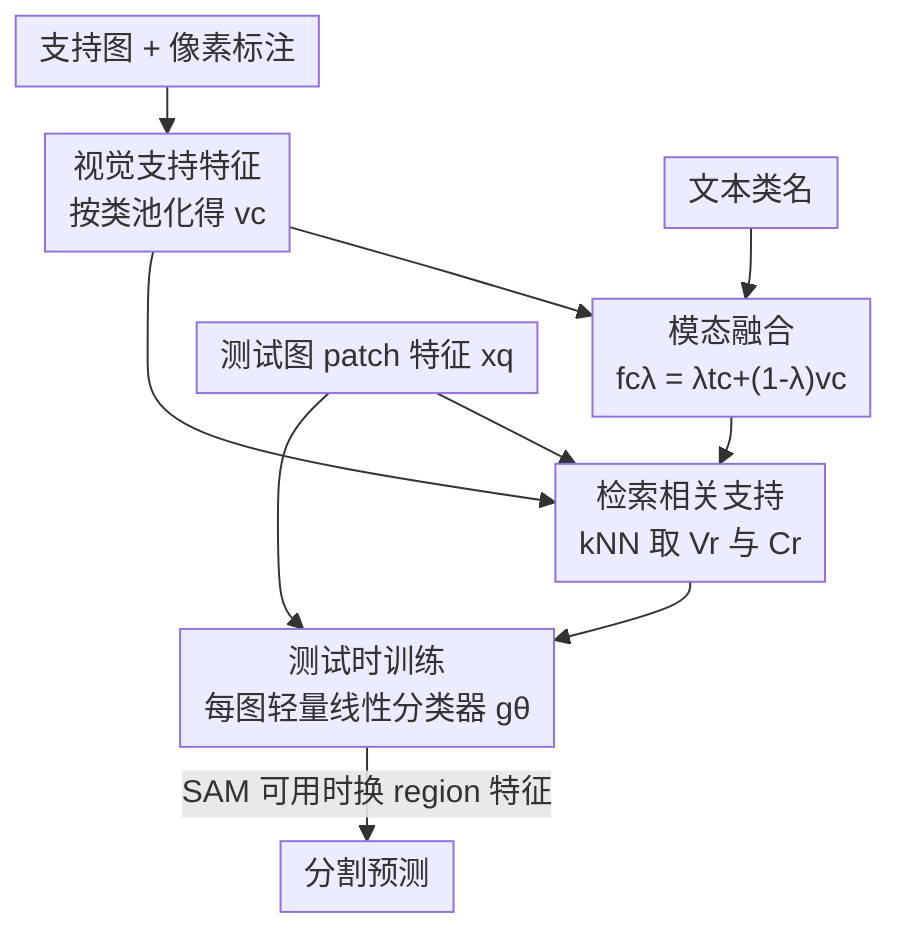

# Retrieve and Segment: Are a Few Examples Enough to Bridge the Supervision Gap in Open-Vocabulary Segmentation?

**会议**: CVPR 2026  
**论文**: [CVF Open Access](https://openaccess.thecvf.com/content/CVPR2026/html/Aravanis_Retrieve_and_Segment_Are_a_Few_Examples_Enough_to_Bridge_CVPR_2026_paper.html)  
**代码**: 无  
**领域**: 分割 / 开放词表分割  
**关键词**: 开放词表分割, 检索增强, 测试时适配, 少样本, 模态融合

## 一句话总结
针对开放词表分割（OVS）落后于全监督模型的现状，本文用「几张带像素标注的支持图」补充文本提示，提出 RNS——一个检索增强的测试时适配器：为每张测试图临时训练一个轻量线性分类器，把检索来的视觉支持特征和文本支持特征做「学习式逐图融合」，在 A100 上不到 1 秒就把零样本到全监督的差距缩小到 11.5 mIoU。

## 研究背景与动机

**领域现状**：开放词表分割（OVS）的主流做法，是借助 CLIP 这类视觉-语言模型（VLM）在共享嵌入空间里把图像 patch 特征和类别文本特征对齐，从而在测试时用任意文本提示（类名/描述）给每个像素分类，不需要预先固定类别表。这条路把 VLM 的零样本识别能力从「图像级」推进到了「像素级」。

**现有痛点**：但 OVS 离全监督分割仍有一大截差距，而且近年的提升开始出现「平台期」。差距的两个根因：（i）VLM 是用「图像级」的图文对训练出来的，这种粗粒度监督和分割需要的「细粒度像素预测」之间存在天然错配；（ii）自然语言本身有语义歧义——只给一个类名，模型常把「骑手」误判成「摩托车」、在背景里幻觉出「盆栽」。

**核心矛盾**：文本提供了开放词表的泛化能力，却给不出像素级所需的精度；纯靠视觉示例又会在「某些类别没有支持图」时彻底失效，并且容易混淆视觉相似的物体（摩托车 vs 自行车）。两种模态各有死角，而既有方法（kNN-CLIP、FREEDA）用的是**手工设计的「晚期融合」**——把两路独立预测拍在一起，融合权重靠手调，支持图一多就开始帮倒忙。

**本文目标**：在保住开放词表能力的前提下，用「少量」像素标注的视觉示例去填补监督鸿沟，并且要能处理真实开放世界里的各种残缺：有的类只有文本、有的类只有视觉、支持集还会随时间动态扩张。

**切入角度**：现代大规模 VLM 的特征已经足够强、足够可泛化，所以根本不必重训骨干网——只要在冻结特征之上「引导」预测即可。既然如此，与其训一个全局分类器，不如**为每张测试图单独、临时地训一个极轻量分类器**，并且只喂给它跟这张测试图真正相关的支持样本（靠检索筛出来）。

**核心 idea**：把检索增强 + 测试时训练结合——按测试图 patch 去支持集里 kNN 检索相关视觉特征，再和文本特征做**学习式逐图融合**（而非手工晚期融合），用交叉熵在线训出一个每图专属的线性分类器。

## 方法详解

### 整体框架
RNS（Retrieve and Segment）的任务设定是：给定测试图和一组测试时才定义的类别 $C$，每个类要么有文本示例（类名/描述），要么有少量带像素标注的视觉示例（支持图），目标是给每个像素分类。整条管线分三段：**支持构建**（离线把支持图压成紧凑的「视觉类特征」并和文本类特征融合，得到两个支持特征集合）、**测试时训练**（对每张测试图，检索出相关支持特征，用交叉熵训一个轻量线性分类器 $g_\theta$）、**推理**（把这个每图专属的分类器套到测试图的 patch/region 特征上出分割图）。骨干网全程冻结，只训那个线性头，所以在 A100 上一张图的测试时训练不到 1 秒。

### 关键设计

**1. 视觉支持特征：把每张支持图压成「按类池化的原型」，而非存原图**

痛点是支持集要能动态扩张、内存还得小，所以不能囤原图或全 patch 特征。做法是：对支持图 $I^i$ 提 patch 特征矩阵 $X^i\in\mathbb{R}^{n\times d}$，把全分辨率的像素标注下采样、reshape 成 patch 级标签（插值后不再是 0/1），按类做 L1 归一化得到 $P^i\in[0,1]^{n\times C}$，再用它把 patch 特征加权池化成「每图视觉类特征」

$$v^i_c=\sum_{j=1}^{n}P^i_{jc}\,x^i_j.$$

所有支持图的 $v^i_c$ 取并集就是**视觉支持特征集** $V$。每来一张新支持图，只需增量更新 $V$、聚合类特征 $v_c$ 和后面的融合特征，整套支持集天然可在线扩张。这样存的只是一小撮类原型向量，内存占用极小，却保留了视觉模态的判别信息。

**2. 学习式模态融合：用混合系数 λ 把文本和视觉拧成一束「融合类特征」**

痛点是 VLM 里视觉和文本特征之间有「模态间隙」，而本文要分类的是图像 patch 特征，所以**直接把文本特征当视觉分类器用效果很差**（实验证实）。做法是对类 $c$ 先把它在所有支持图里的视觉类特征聚合 $v_c=\sum_{i\in I_c}v^i_c$，再和文本类特征 $t_c$ 线性混合：

$$f_{c\lambda}=\lambda\,t_c+(1-\lambda)\,v_c,\quad\lambda\in[0,1].$$

关键是**不只用一个 λ**，而是对一组系数 $\Lambda\subseteq[0,1]$ 各算一份，得到**融合支持特征集** $F=\{f_{c\lambda}\}$——这样既能捕捉文本侧的语义先验、又能捕捉视觉侧的精细判别，且让两边在不同比例下都有代表。实验显示用多个 λ 明显优于单个（如固定 $\lambda=0.8$ 在低样本时掉 5 个点）。区别于 kNN-CLIP/FREEDA 把两路独立预测「晚期手工融合」，这里融合发生在特征层、并被后面的训练真正学进分类器。

**3. 检索驱动的测试时适配：只喂相关支持，在线训每图专属分类器**

痛点是支持集可能很大、且大部分类跟当前测试图无关，全喂进去既慢又会被无关类干扰。做法是对测试图每个 patch 特征 $x^q_j$，从视觉支持集里取 $k$ 近邻并取并集，得到**检索后的视觉支持集**

$$V_r=\bigcup_{j=1}^{n}\text{kNN}(V,\,x^q_j).$$

然后训线性分类器 $g_\theta$，目标含两项。**视觉支持损失**让分类器对每个检索到的视觉特征预测出其真实类：$L_v=\sum_{v\in V_r}w_{l(v)}\,\text{CE}(g_\theta(v),\mathbf{1}_{l(v)})$。**融合支持损失**则把文本信号注进来——只对「检索集里出现过的类」$C_r$ 用其融合特征训练：$L_f=\sum_{c\in C_r}w_c\sum_{\lambda\in\Lambda}\text{CE}(g_\theta(f_{c\lambda}),\mathbf{1}_c)$，总损失 $L=L_v+\beta_f L_f$。训完即把 $g_\theta$ 套到测试图 patch 特征上出低分辨率预测再上采样。这种「检索筛相关 + 每图临时训」相比离线训一个全局分类器，能针对每张测试图挑出最相关的视觉类特征，实验里把检索集换成随机子集会大幅掉点，证明「检索相关性」是性能关键。

**4. 类相关权重 wc：用图文相似度压住检索进来的无关类**

痛点是 kNN 检索难免捞进一些跟测试图无关的支持特征，它们会污染训练。做法是给每个类一个相关权重 $w_c$，由测试图全局特征 $x^q$（patch 特征全局平均池化）与文本类特征做点积再 softmax 估出：

$$w_c=s_C\big((x^q)^\top t_c\big),\qquad x^q=\frac1n\sum_{j=1}^{n}x^q_j,$$

并把它乘进 $L_v$、$L_f$ 的每个样本上。这相当于用「这张图整体看上去像不像类 $c$」给检索结果重新加权，抑制无关类、放大真正出现在测试图里的类。消融显示去掉 $w_c$ 在所有样本数下都掉点（B=1 掉 0.39、B=10 掉 0.48），它是检索容错的安全垫。

**5. 残缺支持的统一处理：缺视觉用伪标签补、缺文本用平均文本顶替**

痛点是开放世界里支持总是残缺的，而 RNS 想用「一套目标」吃下所有设定。**缺视觉支持的类**（只有类名、$C_d$）：先用零样本预测 $\hat P^q$ 把测试图每个 patch 硬分到最可能类、L1 归一化得 $\tilde P^q$，对其中确实被预测到的类 $C_d\cap C_q$ 用伪标签池化出视觉类特征 $v_c=\sum_j\tilde P^q_{jc}x^q_j$，再走融合（4）；由于伪标签不确定，额外加一项 KL 伪标签损失 $L_p=\sum_{c\in C_d\cap C_q}w_c\sum_\lambda \text{KL}(\hat p_{c\lambda}\,\|\,g_\theta(f_{c\lambda}))$，总损失变 $L=L_v+\beta_f L_f+\beta_p L_p$——消融里去掉这项会在「缺视觉」设定下陡降。**缺文本支持的类**：直接用「有名字的类的平均文本特征」当中性语义先验顶上，保证所有类平等参与损失、不偏向双模态都有的类；若全员无文本，则退化为 $\Lambda=\{0\}$、$w_c=1$ 的纯视觉基线。此外当 SAM 给出区域提议时，把 patch 特征按掩码 L1 归一化池化成 region 特征 $x^q_r=\sum_j\bar S_{jr}x^q_j$，在区域级而非 patch 级分类，进一步提精度。

## 实验关键数据

数据集：6 个 OVS benchmark（VOC、Context、COCO Object、COCO-Stuff、Cityscapes、ADE20K）报平均 mIoU，外加 C-59、FoodSeg103、CUB 做与全监督的对比。骨干用 OpenCLIP ViT-B/16（MaskCLIP trick）和 DINOv3.txt ViT-L/16；区域提议用 SAM 2.1 Hiera-L。对比对象是零样本、kNN-CLIP、FREEDA（均改成用真实支持图）。

### 主实验：OVS vs 全监督（Table 2，DINOv3.txt + SAM）

| 方法 | 像素标注量 | VOC | City | ADE | C-59 | Food | CUB | Avg |
|------|-----------|-----|------|-----|------|------|-----|-----|
| 零样本 DINOv3.txt+SAM | 0 | 31.3 | 39.3 | 27.7 | 36.3 | 27.2 | 5.8 | 27.9 |
| CAT-Seg（OVS，训 COCO） | 118k | 82.5 | 47.0 | 37.9 | 63.3 | 33.3 | 22.9 | 47.8 |
| **+ RNS (B=1)** | 66 | 73.2 | 59.1 | 37.3 | 52.7 | 42.8 | 34.0 | 49.9 |
| **+ RNS (B=20)** | 964 | 82.1 | 61.7 | 47.8 | 62.5 | 52.2 | 65.2 | **61.9** |
| 全监督（逐数据集最优） | 20k | 90.4 | 87.0 | 63.0 | 70.3 | 45.1 | 84.6 | 73.4 |

RNS（B=20）把零样本的 27.9 拉到 61.9（+34），与全监督的差距缩到 11.5，且用的像素标注（964）比 CAT-Seg（118k）少两个数量级，平均还反超 CAT-Seg 14.1。在远离 COCO 域的细粒度数据集（CUB 5.8→65.2、Food 27.2→52.2）增益尤其惊人。

### 消融实验（Table 1，平均 mIoU，括号为相对完整 RNS 之差）

| 配置 | B=1 | B=5 | B=10 | 说明 |
|------|-----|-----|------|------|
| RNS（完整） | 41.59 | 47.87 | 49.02 | 全组件 |
| w/o $w_c$ | 41.20 (−0.39) | 47.43 (−0.44) | 48.54 (−0.48) | 去类相关权重 |
| w/o $w_c$, $\Lambda=\{0.8\}$ | 36.40 (−5.19) | 46.55 (−1.32) | 48.38 (−0.64) | 再固定单一 λ |
| w/o text | 34.11 (−7.48) | 45.71 (−2.16) | 48.00 (−1.02) | 完全丢掉文本 |

### 关键发现
- **文本在「样本稀疏」时最值钱**：B=1 时丢掉文本掉 7.48 个点，B=20 时几乎与 w/o-text 持平——文本先验补的是视觉支持不足的缺口，支持图一多视觉自然主导。
- **学习式融合 > 手工晚期融合**：kNN-CLIP 的融合启发式在 B=1 有用，但 B=5 之后反而帮倒忙，说明手调融合对支持规模敏感；RNS 在更强骨干（DINOv3）上与 kNN-CLIP 的差距进一步拉大，说明它更能吃到表示红利。
- **检索相关性是命门**：把检索集 $V_r$ 换成 $V$ 的随机子集大幅掉点；从「检索到的类」里取随机子集又明显好于从全集随机取，证明「限定在语义相关类上适配」确有收益；取最远样本则比随机还差。
- **残缺支持的容错靠伪标签损失**：缺视觉设定下去掉 $L_p$ 会陡降；kNN-CLIP/FREEDA 因不处理缺失类，很快跌到零样本以下。
- **测试时检索 vs 离线全训**：离线在视觉类特征上训线性分类器在 B=1~3 与 RNS(w/o text) 相当，但样本一多就退化；把全监督预训骨干 + RNS 测试时适配结合能拿到最佳，印证「在测试图相关支持上在线训」优于「在整个支持集上离线训」。

## 亮点与洞察
- **「检索 + 每图临时训分类器」这套范式很轻**：骨干冻结、只训线性头、A100 上 <1 秒，却把零样本到全监督的差距砍掉一大半——它把「需要多少标注」从十万级压到百级，是数据效率上的实打实跃进。
- **多 λ 融合是个被低估的小设计**：不锁死一个混合比例、而是让一组 λ 都进训练集，等于把「文本主导 vs 视觉主导」的多种可能都摆给分类器自己挑，消融里固定 λ=0.8 在低样本直接掉 5 个点，说明这步性价比很高。
- **一套损失吃下四种支持设定**：full / 缺视觉 / 缺文本 / 纯文本零样本都用同一框架，靠伪标签损失和「平均文本顶替」两个小机制平滑过渡，工程上很优雅，可直接迁到「类别表随时间增长」的持续学习场景。
- **个性化分割零改动复用**：往支持集里追加某个特定实例（如「带翠鸟的盘子」）的几个样本，就能把该实例从泛类里分出来——动态可扩张支持集天然支持个性化，这个能力几乎是「白送」的。

## 局限与展望
- **依赖检索质量与骨干特征**：整套方法建立在「VLM 特征足够强、kNN 能检到相关支持」之上，若骨干在某个域上 patch 特征对齐很差，检索和融合都会失灵；论文也坦言 region 提议（SAM）虽提精度但显著增加推理开销。
- **伪标签会传播零样本的错误**：缺视觉类靠零样本预测做伪标签，零样本本身的幻觉/混淆会被一并学进分类器，作者举的失败案例（把橙色毛巾错分成泳衣、过度依赖颜色线索）正是这类上下文不足导致的误判。
- **每张测试图都要在线训一遍**：虽然单图 <1 秒，但相比一次训好的全局模型，大规模批量推理时累计开销不小；且超参（学习率、迭代数）在闭集对比里是用支持集划验证集调出来的，开放设定下如何稳健设超参没充分讨论。
- **可改进方向**：可探索把多 λ 融合换成可学习的逐类 λ、或把类相关权重 $w_c$ 做成可微地参与端到端，减少手工设定；也可研究跨测试图共享/缓存分类器以摊薄在线训练成本。

## 相关工作与启发
- **vs kNN-CLIP**：两者都用「像素标注图导出的类向量支持集」做检索，但 kNN-CLIP 是非参数地按 k 近邻给区域贴标签、且文本与视觉做晚期手工融合；RNS 改成「检索 + 学习式逐图融合 + 在线训分类器」，在支持图增多时不像 kNN-CLIP 那样融合启发式失效，且更能吃到强骨干红利。
- **vs FREEDA**：FREEDA 概念上相近，但原版靠「生成的」视觉示例把文本扩成视觉分类器再与零样本文本分类器拼；本文把它改用真实支持图做公平对比后，发现它从文本+视觉的结合中获益很有限，说明非参数 + 手工融合的天花板低。
- **vs Power-of-One（并行工作）**：后者对每个类做 one-shot 微调文本嵌入和部分骨干层，需要访问原图、且要微调 VLM 内部层；RNS 只在预提取特征上训一个测试时线性头，更轻、更不动骨干。
- **vs CAT-SAM / COSINE**：CAT-SAM 用条件微调做 SAM 的少样本适配但不结合文本与视觉支持；COSINE 统一文本提示与图像提示分割，但在多类别 OVS 上只用单模态提示评测。RNS 的差异在于「文本+视觉双支持 + 单一目标 + 残缺鲁棒」。

## 评分
- 新颖性: ⭐⭐⭐⭐ 「检索增强 + 测试时训每图分类器 + 学习式多 λ 融合」组合新颖，相比手工晚期融合是范式升级。
- 实验充分度: ⭐⭐⭐⭐⭐ 6 个 benchmark、两种骨干、四种支持设定、检索机制/离线基线/个性化分割全覆盖，消融扎实。
- 写作质量: ⭐⭐⭐⭐ 公式与设定交代清晰，残缺支持几个分支稍显密集，但整体可读。
- 价值: ⭐⭐⭐⭐⭐ 用百级标注把零样本到全监督差距缩到 11.5，数据效率和开放世界动态扩张能力都很实用。

<!-- RELATED:START -->

## 相关论文

- [\[CVPR 2026\] Semantic Alignment in Hyperbolic Space for Open-Vocabulary Semantic Segmentation](semantic_alignment_in_hyperbolic_space_for_open-vocabulary_semantic_segmentation.md)
- [\[CVPR 2026\] S2C2Seg: Semantic-Spatial Consistency and Category Optimization for Open-Vocabulary Segmentation](s2c2seg_semantic-spatial_consistency_and_category_optimization_for_open-vocabula.md)
- [\[CVPR 2026\] MARIS: Marine Open-Vocabulary Instance Segmentation](maris_marine_open-vocabulary_instance_segmentation.md)
- [\[CVPR 2026\] ReAttnCLIP: Training-Free Open-Vocabulary Remote Sensing Image Segmentation via Re-defined Attention in CLIP](reattnclip_training-free_open-vocabulary_remote_sensing_image_segmentation_via_r.md)
- [\[CVPR 2026\] Conversational Image Segmentation: Grounding Abstract Concepts with Scalable Supervision](conversational_image_segmentation_grounding_abstract_concepts_with_scalable_supe.md)

<!-- RELATED:END -->
