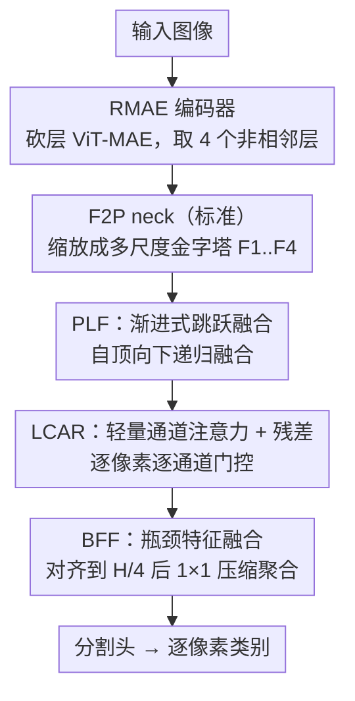

# RMAE-ProGRess: Advancing Semantic Segmentation in Unstructured Environments

**会议**: CVPR 2026  
**论文**: [CVF Open Access](https://openaccess.thecvf.com/content/CVPR2026/html/Bhurtel_RMAE-ProGRess_Advancing_Semantic_Segmentation_in_Unstructured_Environments_CVPR_2026_paper.html)  
**代码**: https://gitlab.com/coeaiml/rmae-progress  
**领域**: 语义分割  
**关键词**: 非结构化环境, 越野分割, 轻量级解码器, 多尺度融合, MAE 编码器

## 一句话总结
针对越野/非结构化场景的语义分割，本文用一个砍掉一半层数的 ViT-MAE 编码器（RMAE）抽取非相邻多层特征，再配一个由渐进式跳跃融合（PLF）、轻量通道注意力（LCAR）、瓶颈特征融合（BFF）三块组成的轻量解码器 ProGRess，在 RELLIS-3D / RELLIS-3DC / RUGD 三个越野数据集上以更小的参数量刷到 57.41% / 78.95% / 45.63% mIoU 的 SOTA。

## 研究背景与动机
**领域现状**：语义分割的主流研究几乎都围绕结构化城市场景（Cityscapes、ADE20K）展开，靠强大的 encoder-decoder 架构把像素级理解做到很高水平。但自动驾驶之外的越野导航、搜救、防务机器人、行星探测这些场景，面对的是非结构化环境——地形不规则、边界模糊、缺乏几何一致性。

**现有痛点**：非结构化分割同时存在两个缺口。一是**缺乏标准化基准**：现有越野工作（RELLIS-3D、RUGD 上的若干方法）评测协议不统一、指标披露不清，互相之间没法直接比，导致后来者无从对齐。二是**架构没有针对性设计**：直接把城市场景的 decoder（UPerNet、DeepLabV3+、OCRNet 等）搬到越野数据上，既没人系统验证过效果，又往往参数臃肿——而越野部署常常是算力受限、资源紧张的边缘场景，需要的是「高精度 + 计算可控」兼顾的模型。

**核心矛盾**：通用分割模型要么精度够但太重（ViT-Base 系骨干 86M+、UPerNet 解码器 32M+），要么轻但精度掉得厉害；越野场景的视觉线索（落叶、碎石、阴影、模糊边界）异质性又强，简单的多尺度融合压不住。

**本文目标**：(1) 把 16 个主流 CNN/Transformer 分割模型在越野数据上重新训练评测，建立可复现的标准基准；(2) 设计一个精度、计算效率、模块化三者平衡的分割框架。

**核心 idea**：编码器侧——既然 ViT 相邻层特征高度冗余，那就**直接砍掉一半 transformer 层**得到轻量 RMAE，并只在非相邻间隔层取特征；解码器侧——用三个 1×1 卷积为主、几乎不引入重计算的轻量模块（PLF/LCAR/BFF）做渐进式多尺度融合，替代笨重的 FPN 式解码器。

## 方法详解

### 整体框架
整个 RMAE-ProGRess 是一个标准的 encoder-neck-decoder 流水线，但每一段都为「轻量 + 越野」重新设计。输入一张图像 $I \in \mathbb{R}^{B \times C' \times H \times W}$，先过 **RMAE 编码器**——一个把 ViT-MAE-Base 从 12 层削到 8/6/4 层的瘦身 ViT，从四个**非相邻**层抽出 4 张分辨率均为 $\frac{H}{16} \times \frac{W}{16}$ 的特征图 $f_i = \{f_1, f_2, f_3, f_4\}$，分别对应早期结构、中层模式、深层语义。接着 **F2P（Feature-to-Pyramid）neck** 把这 4 张同分辨率特征按因子 $r_i \in \{4, 2, 1, 0.5\}$ 缩放成一个真正的多尺度金字塔（$\frac{H}{4}$ 到 $\frac{H}{32}$ 四档），通道维 $C$ 全程保持不变。最后是本文核心的 **ProGRess 解码器**，由 PLF→LCAR→BFF 三块串起来：PLF 自顶向下渐进融合金字塔特征，LCAR 逐像素逐通道做门控加权，BFF 把所有尺度对齐到 $\frac{H}{4}$ 后压缩聚合，送入分割头出像素级类别概率。

其中 F2P 是沿用的标准做法（转置卷积上采样 + 最大池化下采样），不算本文贡献点；真正的创新集中在 RMAE 编码器和 ProGRess 的三个解码模块。

### 关键设计

**1. RMAE 编码器：砍掉一半 ViT 层，只取非相邻特征**

针对「ViT-Base 太重、相邻层特征冗余」这个痛点，作者把 ViT-MAE-Base 的 12 个 transformer 层直接削到 8/6/4 层，分别得到 RMAE-8L（58.5M）、RMAE-6L（44.2M）、RMAE-4L（29.9M）三个变体——参数量相比原版的 86M 大幅下降，且全部加载 MAE 自监督预训练权重以保住表示能力。关键在取特征的方式：因为 ViT 相邻层经过增量 token mixing 后高度相关，逐层取会引入冗余、增内存、还让融合更复杂，所以作者只在**规则间隔的非相邻层**取特征（如 RMAE-8L 取索引 $\{1,3,5,7\}$、RMAE-4L 取 $\{0,1,2,3\}$），刚好覆盖早期结构 / 中层模式 / 深层语义三个层次。实验显示即便是 4 层的浅变体也能压过很多更重的基线，验证了「深度可以砍、但要取对层」这个判断。

**2. PLF（Progressive Leapwise Fusion）：自顶向下递归融合非相邻特征**

F2P 给出的 4 张金字塔特征来自编码器的非相邻层（leapwise），分辨率和语义层级都不连续，直接相加会丢信息。PLF 用一个**自顶向下的递归级联**来融合：先对最深层做自融合 $\tilde{F}_4 = \mathrm{Fuse}(F_4, F_4)$ 增强语义，再逐级把深层上采样后与浅层拼接融合 $\tilde{F}_3 = \mathrm{Fuse}(F_3, \tilde{F}_4)$、$\tilde{F}_2 = \mathrm{Fuse}(F_2, \tilde{F}_3)$、$\tilde{F}_1 = \mathrm{Fuse}(F_1, \tilde{F}_2)$。每个融合算子 $\mathrm{Fuse}(F_i, F_j) = \phi(\mathrm{BN}(W_{ij} * [F_i \| U(F_j, \text{size of } F_i)]))$，其中 $U$ 是最近邻插值（消融选出）、$\|$ 是拼接、$W_{ij}$ 是把拼接特征投回 $C$ 通道的可学习 $1\times1$ 卷积。作者还给出一个「信息保全」命题：递归结构保证每个 $\tilde{F}_i$ 都显式包含 $\{F_i, F_{i+1}, \dots, F_4\}$ 所有更深层的信息——这正是它和普通 FPN 横向连接的区别：FPN 是一次性横向相加，PLF 是递归携带，全局上下文能一路渗透到高分辨率分支。

**3. LCAR（Lightweight Channel Attention with Residuals）：无池化的逐像素门控 + 选择性残差**

越野场景里落叶、碎石、阴影这些异质线索混杂，简单融合后该突出的通道没突出。常规通道注意力（如 SE）靠全局平均池化 + 全连接压缩空间信息，会丢掉空间细节。LCAR 改用一个**无池化的 $1\times1$ 卷积**直接生成逐像素逐通道的注意力图：$\mathrm{LCA}(X) = X \odot \sigma(W_c * X)$，其中 $W_c \in \mathbb{R}^{C\times C\times 1\times 1}$ 在恒定通道维上混合通道、$\sigma$ 是 sigmoid、$\odot$ 逐元素相乘——既保住了空间细节，开销又极小。在此基础上加一个**带二值开关的残差**：$\mathrm{LCAR}(X) = \mathrm{LCA}(X) + \alpha X$，$\alpha \in \{0,1\}$ 逐层经验选择。实测最优配置是 $\alpha_1=\alpha_2=\alpha_3=0$、$\alpha_4=1$——即只在最深层 $\tilde{F}_4$ 开残差，因为深层语义丰富但分辨率低、表示脆弱，残差能稳住梯度流。

**4. BFF（Bottleneck Feature Fusion）：对齐到统一分辨率后瓶颈压缩聚合**

前面 LCAR 输出的 4 张特征还在不同尺度上，需要一个紧凑的末端聚合块。BFF 先把所有 $\hat{F}_i$ 上采样对齐到目标分辨率 $\frac{H}{4} \times \frac{W}{4}$ 得到 $\bar{F}_i$，再一次性拼接、用一个 $W_{bff} \in \mathbb{R}^{C\times 4C\times 1\times 1}$ 的 $1\times1$ 卷积把通道从 $4C$ 压回 $C$：$Z = \phi(\mathrm{BN}(W_{bff} * [\bar{F}_1\|\bar{F}_2\|\bar{F}_3\|\bar{F}_4]))$。最终预测 $Y = \mathrm{softmax}(W_{cls} * Z)$，再 argmax 出类别。整个解码器从头到尾只靠 $1\times1$ 卷积 + 插值，没有任何重型注意力或 ASPP，这正是 ProGRess「轻量」的来源——以 ViT-B16 为骨干时解码器仅 4.86M 参数，对比 UPerNet 的 32.27M 砍了 85%。

### 损失函数 / 训练策略
基于 MMSegmentation 框架，所有模型统一训练 160K 迭代，取训练期最佳 mIoU。编码器加载 MAE 预训练权重并采用 ViTMAE-B 的逐层学习率（layer-wise LR）配置。上采样默认用最近邻插值（消融验证它精度最高且无额外计算）。

## 实验关键数据

### 主实验
在 RELLIS-3D / RUGD 上对 16 个主流分割模型重新训练建立基准，ProGRess 各变体全面领先（512×512）：

| 数据集 | 方法 | 骨干 | 参数(M) | mIoU | mAcc |
|--------|------|------|---------|------|------|
| RELLIS-3D | Swin-UPerNet（最强基线） | Swin-B | 121.2 | 53.86 | 63.33 |
| RELLIS-3D | **ProGRess** | RMAE-4L | 46.5 | 53.23 | 63.04 |
| RELLIS-3D | **ProGRess** | RMAE-8L | 75.0 | 57.14 | 68.53 |
| RELLIS-3D | **ProGRess** | ViTMAE-Base | 103.6 | **57.41** | **69.21** |
| RUGD | Segformer（最强基线） | MiT-B5 | 82.0 | 43.69 | 56.45 |
| RUGD | **ProGRess** | ViTMAE-Base | 103.6 | **45.63** | **57.80** |

亮点是轻量的 RMAE-4L 变体（46.5M、128 GFLOPs）就拿到 53.23% mIoU，几乎压过所有更重的基线。RELLIS-3DC（粗粒度 6 类）上 ProGRess[RMAE-8L] 达 78.95% mIoU，比之前最好的 GA-Nav-r8（74.44%）高出 4% 以上，且在 Smooth / Forbidden / Obstacle / Background 四类拿到最佳单类 IoU。

### 消融实验
**解码器组件逐块叠加**（RMAE-8L，RELLIS-3D 测试集）：

| BFF | PLF | Self-Fusion | LCAR | mIoU(冻结) | mIoU(微调) |
|-----|-----|-------------|------|-----------|-----------|
| ✗ | ✗ | ✗ | ✗ | 49.02 | 52.52 |
| ✓ | ✗ | ✗ | ✗ | 49.01 | 54.56 |
| ✓ | ✓ | ✗ | ✗ | 52.60 | 56.15 |
| ✓ | ✓ | ✓ | ✗ | 52.81 | 56.56 |
| ✓ | ✓ | ✓ | ✓ | **53.18** | **56.90** |
| ✗ | ✓ | ✓ | ✗ | 51.51 | 56.78 |
| ✗ | ✗ | ✗ | ✓ | 51.03 | 54.51 |

**解码器跨骨干通用性**（RELLIS-3D，仅解码器参数）：

| 编码器 | 解码器 | 解码器参数(M) | mIoU |
|--------|--------|--------------|------|
| ViT-B16 | UPerNet | 32.27 | 48.03 |
| ViT-B16 | **ProGRess** | 4.86 | **55.68** |
| Swin | UPerNet | 33.25 | 51.01 |
| Swin | **ProGRess** | 4.41 | **52.16** |
| MiT-B5 | SegFormer | 0.53 | 51.51 |
| MiT-B5 | **ProGRess** | 1.12 | **54.11** |
| RMAE-4L | DeepLabV3+ | 14.4 | 49.30 |
| RMAE-4L | **ProGRess** | 9.46 | **53.23** |

### 关键发现
- **PLF 贡献最大**：在 BFF 基础上加 PLF，冻结/微调分别从 49.01/54.56 跳到 52.60/56.15（+3.6/+1.6），是涨点主力；LCAR 和 Self-Fusion 各贡献零点几个点的稳定增益。单独留 PLF 或单独留 LCAR 都会明显掉点，说明几块是互补的。
- **跨骨干普适**：换成 ResNet101 / Swin / MiT / ViT 各种编码器，ProGRess 解码器都能涨点，且参数普遍只有 UPerNet 的几分之一（ViT-B16 上少 85%），证明轻量设计不挑骨干。
- **对插值不敏感**：bicubic/bilinear/nearest 三种插值差异 <0.42 mIoU，最近邻反而最高（57.14%）且无数学运算开销，所以默认选它，省算力不掉点。
- **零样本跨域**：RELLIS-3D→RUGD 的严格零微调迁移上，ProGRess[RMAE-8L] 也优于所选的 CNN/Transformer 强基线（⚠️ 完整表格在 RUG-REL-Common 14 类，整体 mIoU 数值较低，属域差很大的难设定）。

## 亮点与洞察
- **「砍 ViT 层数」而非「砍宽度」**：以往轻量 ViT（ViT-Tiny、MAE-Tiny）都在缩 embedding 维和宽度但保留 12 层深度；本文反其道——保宽度、砍深度，配合非相邻取层避开冗余，这是个干净且反直觉的轻量化路线。
- **解码器全靠 1×1 卷积**：PLF/LCAR/BFF 三块没有一个重算子，把多尺度融合做成「递归拼接 + 1×1 投影 + 逐像素门控」，4.86M 参数干翻 32M 的 UPerNet，是很好的「轻量分割解码器」模板，可直接迁到其他资源受限的分割任务。
- **逐层二值残差开关**：$\alpha$ 只在最深层开残差这个细节很巧——把残差当成「按层级选择性使用」的工具，而非无脑全开，针对深层低分辨率表示脆弱的特性对症下药。
- **PLF 的信息保全命题**：用一个简单的归纳证明把「递归融合保留所有更深层信息」讲清楚，给「为什么比 FPN 横向连接更好」提供了形式化依据。

## 局限与展望
- **绝对精度仍不高**：RELLIS-3D 57% / RUGD 46% mIoU，反映越野分割本身极难（边界模糊、稀有类多），离实用还有距离；零样本跨域整体 mIoU 更低，泛化是硬伤。
- **F2P 是沿用而非创新**：金字塔 neck 直接用标准转置卷积/池化，未针对越野特性优化，可能是后续提升空间。
- **RMAE 取层索引靠经验**：每个变体的非相邻取层索引（如 8L 取 {1,3,5,7}）是按规则间隔人为定的，没有自动搜索或学习机制，最优取层组合可能因数据集而异。
- **评测规模**：基准虽覆盖 16 个模型，但仍限于 RELLIS/RUGD 两个数据系，越野场景多样性（雪地、沙漠、夜间）未充分覆盖。

## 相关工作与启发
- **vs 轻量 ViT（MobileViT / ViT-Tiny / MAE-Tiny）**: 它们缩宽度保深度，本文砍深度保宽度并加载 MAE 预训练权重——在越野数据上浅变体反而压过更重的模型，说明「深度冗余」比「宽度冗余」更值得砍。
- **vs FPN 式解码器（UPerNet / FPN）**: 都做自顶向下多尺度融合，但 UPerNet 是横向连接 + 金字塔池化、参数臃肿（32M+）；ProGRess 用递归级联（PLF）携带全层信息，4.86M 参数精度更高，区别在「递归 vs 一次性横向」。
- **vs 通道注意力（SE-Net）**: SE 靠全局平均池化压空间，LCAR 用无池化 1×1 卷积保留逐像素空间信息，更适合边界模糊的越野场景。
- **vs 越野专用方法（GA-Nav）**: GA-Nav 用 group-wise attention 做可通行性分割，本文在 RELLIS-3DC 上以 78.95% vs 74.44% 超出 4%+，且强调计算平衡。

## 评分
- 新颖性: ⭐⭐⭐⭐ 「砍深度 + 非相邻取层」的 RMAE 和全 1×1 卷积的轻量解码器组合务实且有反直觉处，但单个模块（通道注意力、FPN 式融合）多为已有思想的轻量化重组。
- 实验充分度: ⭐⭐⭐⭐⭐ 重训 16 个基线建标准、4 个骨干通用性、逐块消融、插值消融、零样本跨域，覆盖很全。
- 写作质量: ⭐⭐⭐⭐ 公式与流程清晰，PLF 信息保全命题是加分项；部分关键结果（per-class、完整零样本表）放在补充材料。
- 价值: ⭐⭐⭐⭐ 为非结构化/越野分割建立了可复现基准 + 一个轻量高效的强基线，对防务/搜救等算力受限场景有实用价值。

<!-- RELATED:START -->

## 相关论文

- [\[CVPR 2026\] Bayesian Decomposition and Semantic Completion for Few-shot Semantic Segmentation](bayesian_decomposition_and_semantic_completion_for_few-shot_semantic_segmentatio.md)
- [\[CVPR 2026\] Semantic Alignment in Hyperbolic Space for Open-Vocabulary Semantic Segmentation](semantic_alignment_in_hyperbolic_space_for_open-vocabulary_semantic_segmentation.md)
- [\[ICCV 2025\] Advancing Visual Large Language Model for Multi-granular Versatile Perception](../../ICCV2025/segmentation/advancing_visual_large_language_model_for_multi-granular_versatile_perception.md)
- [\[CVPR 2026\] LEMMA: Laplacian Pyramids for Efficient Marine Semantic Segmentation](lemma_laplacian_pyramids_for_efficient_marine_semantic_segmentation.md)
- [\[CVPR 2026\] Unlocking 3D Affordance Segmentation with 2D Semantic Knowledge](unlocking_3d_affordance_segmentation_with_2d_semantic_knowledge.md)

<!-- RELATED:END -->
