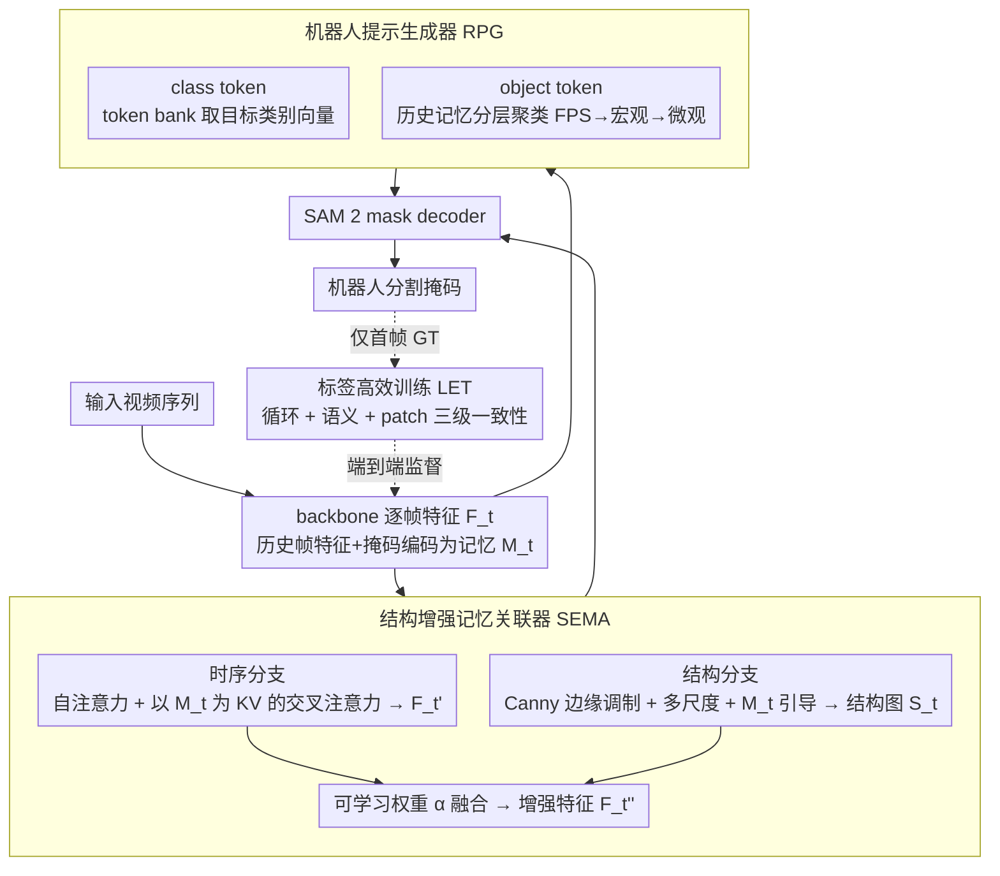

# RobotSeg: A Model and Dataset for Segmenting Robots in Image and Video

**会议**: CVPR 2026  
**arXiv**: [2511.22950](https://arxiv.org/abs/2511.22950)  
**代码**: [https://github.com/showlab/RobotSeg](https://github.com/showlab/RobotSeg)  
**领域**: 分割  
**关键词**: 机器人分割、SAM2、结构感知、自动分割、标签高效学习

## 一句话总结

本文提出 RobotSeg，第一个同时支持图像和视频的机器人分割基础模型，基于 SAM 2 引入结构增强记忆关联器（SEMA）、机器人提示生成器（RPG）和标签高效训练策略，仅需首帧标注即可训练，在自动模式下 Whole Robot 分割达到 85.1 J&F，比 SAM 2.1 微调版高 4.9 分，同时参数仅 41.3M（远小于现有 638M+ 方案）。

## 研究背景与动机

1. **领域现状**：机器人分割是机器人感知的基础能力，应用于视觉伺服（VLA 系统）、跨体型数据增强、真实到仿真迁移、安全监控等。现有方案要么基于语言条件分割（CLIPSeg/LISA/EVF-SAM），要么用 SAM 2 的通用提示分割。
2. **现有痛点**：(a) 机器人形态多样（Franka/Fanuc/Sawyer/UR5 等），外观易与背景混淆；(b) 关节结构复杂，现有模型常产生碎片化分割；(c) 操作过程中形状变化剧烈导致时序不一致。SAM 2 虽然通用能力强，但缺乏关节机器人的结构先验、依赖手动提示、需要逐帧标注。
3. **核心矛盾**：机器人分割需要结构感知（关节几何）、自主性（无需手动提示）和标注效率（大规模视频标注成本高），这三个需求同时得不到满足。
4. **本文目标** 构建专用模型和数据集，实现结构感知、自动、标签高效的视频机器人分割。
5. **切入角度**：在 SAM 2 基础上定向增强——用 Canny 边缘和多尺度感知注入结构先验，用可学习 token bank + 历史聚类生成自动提示，用循环一致性+语义一致性+patch 一致性实现仅首帧监督。
6. **核心 idea**：在 SAM 2 上嫁接三个专门针对机器人特性的模块（结构感知、自动提示、标签高效），以仅 41M 参数实现 SOTA 机器人分割。

## 方法详解

### 整体框架

输入为视频序列，backbone 提取逐帧视觉特征。SEMA 模块从历史帧特征和分割结果构建记忆，结合边缘结构信息增强当前帧特征。RPG 模块从可学习 token bank 和历史记忆中生成语义先验和时序线索作为分割提示，替代手动点击/框提示。增强后的特征和提示输入 SAM 2 的 mask decoder 生成机器人分割掩码。训练时仅需首帧 GT 标注，通过三级一致性损失实现端到端学习。

### 关键设计

**1. 结构增强记忆关联器（SEMA）：让当前帧同时"记得过去"又"看清关节"**

关节机器人最难分的地方是连接处——操作时形状剧变，纯靠当前帧外观容易把一条机械臂切成碎片，而历史帧又能提供"它本来连在一起"的时序线索。SEMA 用两条并行分支把这两类信息揉进当前帧特征。上分支负责时序关联：把历史帧的特征和掩码编码成记忆 $M_t$，当前帧特征 $F_t$ 依次过自注意力、以 $M_t$ 为 KV 的交叉注意力和 MLP，得到时序增强特征 $F_t'$，相当于让当前帧"回看"前几帧确认机器人的整体形状。

下分支负责结构增强，关键是把边缘当成零成本的关节探测器：先用 Canny 滤波器提取当前帧边缘图 $E_t$，对特征做边缘调制 $F_t^{edge} = F_t \odot (1 + E_t)$ 放大轮廓响应；再过多尺度特征提取器（粗尺度盯住大关节、细尺度抠末端）和以 $M_t$ 为 KV 的交叉注意力，得到结构图

$$S_t = \sigma(\text{CrossAttn}(F_t^{ms}, M_t)).$$

最后用可学习权重 $\alpha$ 把两条分支融合成 $F_t'' = F_t' \odot (1 + \alpha S_t)$。Canny 不需要额外训练却能给出强结构先验，多尺度感知保证粗关节和细末端都不漏，这正是通用 SAM 2 在关节机器人上缺的那块结构归纳偏置。

**2. 机器人提示生成器（RPG）：把"该分哪个机器人"的提示自己生成出来**

SAM 2 强但依赖人手点击或画框，逐帧给提示在视频里不现实。RPG 的思路是用两类自动生成的 robot token 替代手动输入。一类是 class token，从一个可学习的 token bank 里按目标类别（机器臂 / 夹爪 / 整体）取出对应向量，告诉模型"我要分割的是机器人的哪个部件"，提供类级语义先验。

另一类是 object token，从历史记忆里通过分层聚类提取，刻画"上一帧这台机器人长什么样"：先用 Farthest Point Sampling 撒出 $R$ 个宏观区域中心，K-Means 聚类得到区域掩码勾出粗轮廓，再在每个区域内分出 $S$ 个微观子簇保留末端细节，把所有原型向量拼起来就是 object token。两类 token 一起喂进 mask decoder 引导分割——class token 管语义、object token 管外观，宏观到微观的两层聚类让外观剧变的关节机器人既不丢整体也不糊掉指尖。

**3. 标签高效训练策略（Label-Efficient Training）：只标首帧就能训整段视频**

视频逐帧标注成本高得离谱，本文把监督压缩到只用首帧 GT 掩码，靠三级一致性把信号传播到其余帧。循环一致性 $\mathcal{L}_{cyc}$ 利用时间对称性：从帧 0 前向传到帧 $t$ 再反向传回帧 0，两次回到首帧的预测掩码都用首帧 GT 以 focal+dice loss 监督，等于把唯一的标注当成自监督的锚点。语义一致性 $\mathcal{L}_{sem}$ 约束中间帧预测掩码内的平均特征与首帧物体语义保持余弦相似，堵住"无论哪帧都输出同一张不变掩码"这种作弊捷径。Patch 一致性 $\mathcal{L}_{patch}$ 借 DINOv3 的 patch 相似度把首帧 GT 传播到中间帧生成伪标签，掩码下采样 16× 对齐 patch 粒度后用 IoU loss 监督，补上像素级的细粒度信号。三项合成

$$\mathcal{L}_{mask} = w_{cyc}\mathcal{L}_{cyc} + w_{sem}\mathcal{L}_{sem} + w_{patch}\mathcal{L}_{patch},$$

分别覆盖视频级、物体级、patch 级，把一张首帧标注撑成一套完整的层次监督。

### 损失函数 / 训练策略

联合在 RoboEngine-Train（3532 张图）和 VRS-Train（2707 个视频，131K 帧）上训练 25 个 epoch。AdamW 优化器，图像编码器 lr=3×10⁻⁴，其余 lr=6×10⁻⁵，余弦衰减。结构图 $S_t$ 有额外监督。8 × NVIDIA A5000 训练 15 小时。

## 实验关键数据

### 主实验

**VRS 视频数据集（Whole Robot J&F）**

| 方法 | 参数量 | 自动 (AU) | 1-click | 3-click | BBox | 交互 (OI) |
|------|--------|----------|---------|---------|------|----------|
| RoboEngine (微调) | 898.4M | - | - | - | - | - |
| SAM 2.1 (原始) | 39.0M | - | 38.2 | 69.0 | 60.4 | 73.6 |
| SAM 2.1 (微调) | 39.0M | - | 73.6 | 82.1 | 82.5 | 85.1 |
| **RobotSeg** | **41.3M** | **85.1** | **85.1** | **86.3** | **85.8** | **86.7** |

**RoboEngine 图像数据集（Whole Robot J&F）**

| 方法 | 参数量 | 自动 (AU) | 1-click | 3-click | BBox |
|------|--------|----------|---------|---------|------|
| RoboEngine (微调) | 898.4M | 86.6 | - | - | - |
| SAM 2.1 (微调) | 39.0M | - | 78.0 | 90.2 | 86.0 |
| **RobotSeg** | **41.3M** | **87.9** | **88.8** | **93.5** | **89.4** |

### 消融实验

| 配置 | AU | 1C | 增加的组件 |
|------|----|----|-----------|
| (a) SAM 2.1 原始 | - | 38.2 | - |
| (b) 微调 | - | 73.6 | 机器人数据 |
| (e) +LET 全部 | - | 77.4 | 循环+语义+patch |
| (g) +RPG 全部 | 83.1 | 83.3 | class+object token |
| (i) +SEMA 全部（完整） | **85.1** | **85.1** | 多尺度+记忆引导 |

### 关键发现
- **自动分割能力**：RobotSeg 是唯一能在无任何提示下自动分割的高精度方案（85.1 J&F），且自动模式和 1-click 模式几乎无差异（85.1 vs 85.1），说明 RPG 的自动提示足够好
- **参数效率**：41.3M 参数显著小于 RoboEngine (898.4M)、LISA (13993M)，适合机器人部署
- **标签效率**：LET 用仅首帧标注从 73.6 提升到 77.4（+3.8），消解了逐帧标注的沉重负担
- **结构增强的价值**：SEMA 相比仅有 RPG 的版本再提升 2.0 分（83.1→85.1），边缘感知和多尺度建模对关节机器人至关重要
- **细粒度分割**：RobotSeg 不仅分割整体机器人，还能分别分割机器臂（75.6 AU）和夹爪（76.0 AU），为部件级数据增强和运动分析提供支持

## 亮点与洞察
- **VRS 数据集**是首个视频级机器人分割基准（2812 视频、138K 帧、10 种机器人类型），比 RoboEngine 大 38 倍，是该领域的重要基础设施贡献。
- **标签高效训练三级损失设计**巧妙：循环一致性利用时间对称性自监督、语义一致性防止退化、DINOv3 patch 传播提供伪监督——这套策略可直接迁移到其他只有首帧标注的视频分割场景。
- **结构增强的工程实现**很实际：Canny 边缘 + 多尺度感知 + 记忆引导调制，几乎不增加计算量但稳定提升关节区域分割质量。
- RPG 的分层聚类策略（FPS 初始化 → K-Means 宏观 → K-Means 微观）提供了从粗到细的物体表征，对外观变化剧烈的关节机器人特别有效。

## 局限与展望
- 仅关注机器人分割，未探索扩展到其他关节物体（如人手、工具）的泛化能力
- Canny 边缘是固定算子，在低纹理或运动模糊场景下可能失效，可考虑学习型边缘检测
- 首帧标注仍需人工，可以探索与 VLM 结合实现完全零标注的自动分割
- VRS 数据集中 testing set 仅 105 个视频，扩大测试集能更可靠地评估

## 相关工作与启发
- **vs RoboEngine**: RoboEngine 只做图像级分割且依赖 EVF-SAM (898M)，RobotSeg 以 41.3M 参数同时支持图像和视频，AU 模式下高 0.7-5.0 分
- **vs SAM 2.1**: 通用 SAM 2.1 即使微调后在自动模式仍不可用（需手动提示），而 RobotSeg 通过 RPG 实现自动分割
- **vs LISA/EVF-SAM**: 语言条件分割模型参数量巨大（14B/898M），自动模式下 AU 仅 42-64 J&F，远不如 RobotSeg 的 85.1

## 评分
- 新颖性: ⭐⭐⭐⭐ 在 SAM 2 上的三个改进各自不够颠覆性但组合得当，数据集贡献重要
- 实验充分度: ⭐⭐⭐⭐⭐ 5 种评估设置、图像+视频、细粒度部件、完整消融、多方法对比
- 写作质量: ⭐⭐⭐⭐ 结构清晰、图示丰富，但部分模块描述稍显冗长
- 价值: ⭐⭐⭐⭐⭐ 数据集和模型对机器人感知社区有直接实用价值

<!-- RELATED:START -->

## 相关论文

- [\[CVPR 2026\] RS-SSM: Refining Forgotten Specifics in State Space Model for Video Semantic Segmentation](rs-ssm_refining_forgotten_specifics_in_state_space_model_for_video_semantic_segm.md)
- [\[CVPR 2026\] VidEoMT: Your ViT is Secretly Also a Video Segmentation Model](videomt_your_vit_is_secretly_also_a_video_segmentation_model.md)
- [\[AAAI 2026\] Tracking and Segmenting Anything in Any Modality](../../AAAI2026/segmentation/tracking_and_segmenting_anything_in_any_modality.md)
- [\[CVPR 2026\] Live Interactive Training for Video Segmentation](live_interactive_training_for_video_segmentation.md)
- [\[CVPR 2026\] CA-LoRA: Concept-Aware LoRA for Domain-Aligned Segmentation Dataset Generation](ca-lora_concept-aware_lora_for_domain-aligned_segmentation_dataset_generation.md)

<!-- RELATED:END -->
