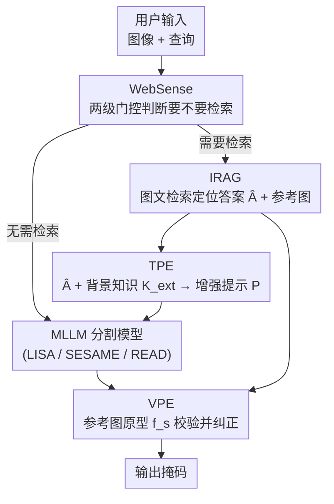

# ROSE: Retrieval-Oriented Segmentation Enhancement

**会议**: CVPR 2026  
**arXiv**: [2604.14147](https://arxiv.org/abs/2604.14147)  
**代码**: https://henghuiding.com/ROSE/ (项目主页)  
**领域**: 分割 / 多模态VLM  
**关键词**: 推理分割, 新兴实体, 检索增强生成, MLLM, 即插即用

## 一句话总结
针对基于多模态大模型（MLLM）的分割模型「认不出训练截止日期之后才出现的实体」这一硬伤，本文提出新任务 NEST（新兴实体分割）+ 自动数据引擎，并设计即插即用的 ROSE 框架——用互联网检索把文本答案和参考图实时灌进 MLLM 分割模型，在 NEST 上把 gIoU 比基于 Gemini-2.0 Flash 的强检索基线提升 19.2%。

## 研究背景与动机
**领域现状**：LISA、SESAME、READ 这类基于 MLLM 的分割模型，靠大模型的推理能力和世界知识做「推理分割」（reasoning segmentation）——给一句 "请分割 SpaceX 的创始人"，模型能在图里圈出对应的人，还自带零样本能力。

**现有痛点**：MLLM 训练成本极高（数据收集、清洗、训练都烧资源），没法频繁更新，于是都有一个「知识截止日期」。现实世界的知识却在飞速演化：截止 2023 的 LLaMA 3 根本不知道 2025 才发布的 iPhone 17 Pro Max 长什么样；LISA 虽然分别认识拜登和特朗普，却答不出「现任美国总统是谁」。结果是只要查询涉及新近出现的实体，分割就直接失败。

**核心矛盾**：MLLM 的知识是「冻结的快照」，而分割任务面对的是「持续演化的开放世界」——两者之间存在根本的时效性鸿沟。靠重训练去追这个鸿沟既慢又贵，不现实。

**本文目标**：让 MLLM 分割模型能处理两类它本来搞不定的实体——(i) **新颖实体（novel）**：完全没在训练数据里出现过（如 iPhone 17 Pro Max、小米 SU7）；(ii) **新兴实体（emerging）**：知识库里有这个概念但随时间演变、需要当下上下文才能正确指认（如「现任美国总统」）。

**切入角度**：既然重训练不可行，那就借鉴 RAG（检索增强生成）的思路——推理时从互联网实时检索最新信息，把外部知识「即插即用」地接进任意 MLLM 分割模型，而不动模型本身。但分割是多模态任务，单纯检索文本答案不够：新颖实体连「长什么样」都得从网络图片补。

**核心 idea**：用「互联网多模态检索」把缺失的知识补到 MLLM 分割模型的输入端——文本侧补答案+背景知识（治新兴实体），视觉侧补参考图原型（治新颖实体），并用一个轻量门控决定何时才真的去检索。

## 方法详解

### 整体框架
ROSE 的目标是把原模型受限于训练知识空间 $K$ 的分割能力，扩展到 $S = K \cup E$（$E$ 为外部知识库）。给定输入图像 $x_{img}$ 和用户查询 $x_{query}$，流程是：先由 **WebSense** 判断这条查询到底要不要联网（省算力/省延迟）；若需要，**IRAG**（互联网检索增强生成）模块用图文输入去网上检索，产出确定的文本答案 $\hat{A}$ 和相关参考图 $\hat{x}_{img}$；接着 **TPE**（文本提示增强器）把 $\hat{A}$ 加上背景知识 $K_{ext}$ 拼成增强提示 $P=f(x_{query}, \hat{A}, K_{ext})$，喂给 MLLM 分割模型先出一版结果；**VPE**（视觉提示增强器）再用 $\hat{x}_{img}$ 提取的原型特征去校验/纠正这版结果。最终由底层 MLLM 分割模型（如 LISA）输出掩码。整套东西不改原模型权重，是「即插即用」的外挂。

### 关键设计

**1. IRAG：用图文联合检索把「答案候选」压缩成唯一答案**

文本检索单独用会有个致命问题：一个问题的答案往往不唯一（检索回来一堆候选 $\{A_j\}_{j=1}^m$），到底图里画的是哪个说不准。IRAG 基于 LangChain 实现，先用 LLM 把 $x_{query}$ 改写成优化过的搜索词 $q$，检索网页内容并切成块 $\{C_i\}_{i=1}^n$，向量化 $E(C_i)\in\mathbb{R}^d$ 存进向量库 $D=\{(E(C_i),C_i)\}$，再用 map-reduce + 专用提示抽取最相关信息、汇总成答案候选摘要 $\{A_j\}$。关键的「消歧」一步靠图像：用 **Google Cloud Vision**（而非 MLLM——因为 MLLM 恰恰认不出新颖实体）从 $x_{img}$ 抽出图中实体 $\{E_k\}_{k=1}^l$，拿候选答案和图中实体做匹配确定唯一答案 $\hat{A}$；若图里没匹配上，就取候选里置信度最高的。最后以 $\hat{A}$ 为关键词再去网上抓参考图 $\hat{x}_{img}$。这一步同时产出「文本答案」和「视觉参考」，是后面 TPE/VPE 的共同输入源。

**2. TPE：把检索到的答案织进提示词，治「新兴实体」**

光有一个答案词不够，MLLM 还得「理解」这个目标才能分割准。TPE 把三样东西融成一条增强提示 $P=f(x_{query}, \hat{A}, K_{ext})$：原始查询 $x_{query}$、IRAG 给出的答案 $\hat{A}$、以及以 $\hat{A}$ 为搜索词再抓回来的目标介绍/背景知识 $K_{ext}$。这样提示既有明确指向（告诉模型要找谁）又有丰富语境（告诉模型这个目标是什么），让 MLLM 把「检索到的新知识」和「原始指令」对齐。消融显示它主要提升新兴实体——这类实体模型本来沾点边，补上当下信息和背景就能认对。

**3. VPE：用网络参考图的原型特征校验并纠正，治「新颖实体」**

新兴实体靠文字能救，但完全没见过的新颖实体光给文字描述 MLLM 还是抓瞎——它脑子里没有这个东西的视觉概念。VPE 走「先验证、不行再纠正」的路子：把 IRAG 抓回的参考图 $\hat{x}_{img}$ 聚类、只留最大簇，提 CLIP 特征得到原型 $f_s$；再对 MLLM 当前分割出的前景区域提 CLIP 特征，和 $f_s$ 算相似度——相似度低就说明 MLLM 认错了。此时启动纠正：用目标检测器在 $x_{img}$ 里框出候选实体 $\{E_i\}_{i=1}^n$，逐个裁剪提 CLIP 特征 $f_i$ 与原型 $f_s$ 比相似度，选最高的那个；若超过置信阈值 $\tau$ 就认定为目标，把它的边界框喂进 **SAM 的 mask decoder** 生成高质量掩码 $\hat{M}$。这一步把「视觉原型匹配 + 检测框 + SAM」串起来，绕开了 MLLM 对新颖实体的认知盲区。消融里 VPE 对新颖实体 cIoU 提升高达 +24.5%，是治新颖实体的主力。

**4. WebSense：两级门控决定「要不要真去联网」**

不是每条查询都需要联网——很多用内部知识就能答，无脑全检索会徒增算力和延迟。WebSense 采用两级决策：第一级是轻量规则过滤器，用预定义启发式（如时效敏感词规则）快速筛；对那些模糊或语义复杂、规则判不准的查询，第二级再上一个 LLM 做深层语义分析、判定是否需要检索。这让检索只在真有必要时触发，是 ROSE「资源感知」的关键。（注：消融实验里为保证每条样本都需检索，会主动关掉 WebSense。）

### 一个完整示例
以图中问题「2025 年 5 月 9 日哪位 MLB 球员为道奇队打出关键的三分本垒打？请分割他」为例：① WebSense 检测到「2025-05-09」这种时效词，判定需联网；② IRAG 改写搜索词检索新闻，map-reduce 汇总出候选球员名单，再用 Google Cloud Vision 识别图中多个人物、与候选匹配，锁定唯一答案 $\hat{A}$=该球员；③ TPE 把答案+该球员背景介绍拼成提示，LISA 据此先分割；④ VPE 用该球员的网络参考图原型校验 LISA 的前景——若 LISA 圈错了人（相似度低），就用检测框逐人比对原型、选中正确球员的框送进 SAM 出最终掩码。对照实验里 LISA 单独会分错人，ROSE 则能圈对。

## 实验关键数据

实现细节：基础语言模型用 Llama-3-8B（知识截止 2023-12，确保对 NEST 无知识泄漏），原型特征用 CLIP-ViT-L/32，检测器用 YOLOv8，掩码用 SAM；单张 A6000 48G 评测。评测指标 gIoU、cIoU（标准分割指标）+ Acc.（评 RAG 的问答能力）。NEST 数据集含 1,548 条评测样本，每图平均 2.7 个有效实体、1.6 个不同问题。

### 主实验：NEST 数据集

| 方法 | RAG | Acc. | Novel gIoU | Emerging gIoU | Overall gIoU | Overall cIoU |
|------|-----|------|-----------|---------------|--------------|--------------|
| LISA-7B（原模型） | ✗ | - | 38.4 | 56.5 | 48.7 | 39.3 |
| Grounded-SAM | ✗ | - | 39.0 | 53.8 | 47.4 | 36.7 |
| LISA-7B + GPT-4o mini Search | ✓ | 68.1 | 35.4 | 67.0 | 53.5 | 49.0 |
| LISA-7B + Gemini-2.0 Flash Search | ✓ | 69.6 | 35.2 | 67.8 | 53.8 | 49.3 |
| **LISA-7B + ROSE（本文）** | ✓ | **73.4** | **67.0** | **77.5** | **73.0** | **68.6** |
| **READ-7B + ROSE（本文）** | ✓ | 74.2 | 67.1 | 76.0 | 72.2 | 68.3 |

关键对比：商用检索基线（两阶段：先让 GPT-4o/Gemini 联网答题，再把答案塞进 "Please segment {answer}" 给分割模型）在**新兴实体**上能涨到 ~67 gIoU，但在**新颖实体**上几乎原地踏步（35 左右）——因为它只给了文字答案，分割模型仍不知道新东西长啥样。ROSE 把新颖实体直接拉到 67.0，整体 gIoU 比最强的 Gemini 基线高 73.0 vs 53.8（+19.2%），印证了「视觉补全」的必要性。

### 混合数据集 NEST+（泛化性）

| 方法 | NEST gIoU | ReasonSeg gIoU | RefSeg gIoU | Overall gIoU |
|------|-----------|----------------|-------------|--------------|
| LISA-7B | 51.1 | 42.5 | 54.9 | 50.9 |
| LISA-7B + ROSE | 75.3 | 42.2 | 54.4 | 67.6 |
| READ-7B + ROSE | 71.6 | 50.3 | 64.7 | 67.9 |

把 NEST 和 ReasonSeg、RefCOCO/+/g 混在一起评测：ROSE 在 NEST 分项大幅提升的同时，ReasonSeg 和 RefSeg 上几乎不掉点（得益于 WebSense 对这类无需检索的传统任务直接跳过检索），说明外挂不破坏原能力。

### 消融实验（NEST，LISA-7B 基线，关掉 WebSense）

| 配置 | Novel gIoU | Novel cIoU | Emerging gIoU | Overall gIoU | Overall cIoU |
|------|-----------|-----------|---------------|--------------|--------------|
| LISA-7B | 38.4 | 28.5 | 56.5 | 48.7 | 39.3 |
| + IRAG only | 40.4 | 30.9 | 67.1 | 55.7 | 49.1 |
| + IRAG + TPE | 41.3 | 31.6 | 73.3 | 59.6 | 51.8 |
| + IRAG + VPE | 64.9 | 61.7 | 71.7 | 68.7 | 63.8 |
| + Full（IRAG+TPE+VPE） | 68.6 | — | 79.4 | 74.7 | 70.1 |

### 关键发现
- **VPE 是分水岭**：只加 IRAG+VPE，新颖实体 gIoU 从 40.4 飙到 64.9（cIoU +24.5%），整体 gIoU +13.0%——证明新颖实体的瓶颈是「没有视觉概念」，文字怎么描述都不够，必须给视觉原型。
- **TPE 专治新兴实体**：IRAG→IRAG+TPE 让新兴实体 gIoU +6.2%、cIoU +4.5%，对新颖实体几乎无改善——两个增强器分工明确，恰好对应两类实体的不同缺口。
- **IRAG 是地基**：单加 IRAG 整体 gIoU 就 +7.0%，但新颖实体几乎不动（38.4→40.4）——光检索文本答案救不了「没见过」的实体，呼应了为何还要 VPE。

## 亮点与洞察
- **「文本治新兴、视觉治新颖」的二分诊断**：把 MLLM 分割失败拆成两类缺口（缺当下信息 vs 缺视觉概念），并用 TPE/VPE 分别对症，消融数据干净地验证了这个分工——这是全文最清晰的「啊哈」点。
- **用 Google Cloud Vision 而非 MLLM 做图像实体抽取**：作者明确指出 MLLM 恰恰认不出新颖实体，所以消歧环节故意绕开 MLLM 用专用视觉 API——一个很务实的「不要让有病的人当医生」式设计。
- **VPE 的「验证-纠正」二段式**：先用原型相似度判断 MLLM 有没有翻车，翻车了才启动「检测框+SAM」纠正，避免对本来就对的样本瞎改，可迁移到任何「外挂校验」场景。
- **自动数据引擎对抗数据泄漏**：用 Google Trends + 时间窗去持续抓最新图文新闻自动造评测集，而非建固定数据集（固定集迟早被未来 MLLM 吃进训练、造成泄漏）——这个「持续滚动的 benchmark」思路对评测时效性任务很有启发。
- **即插即用**：ROSE 同样能挂到 LISA / SESAME / READ 三个不同底座上且都大涨，说明它是真正模型无关的外挂而非针对某一模型调参。

## 局限性 / 可改进方向
- **强依赖外部服务链路**：IRAG 依赖搜索引擎、Google Cloud Vision、LangChain，VPE 依赖 CLIP/YOLOv8/SAM——整条链路任一环检索失败或网络抖动都会拖累结果，且推理延迟和成本远高于纯本地模型，作者主要靠 WebSense 缓解但未给端到端延迟数据。
- **消歧的脆弱点**：IRAG 的答案唯一化靠「候选答案 ↔ 图中实体」匹配，当图里没匹配上时退化为「取置信度最高候选」，对答案本就多义或检索噪声大的查询可能选错；VPE 的纠正也强依赖目标检测器能否把正确实体框出来。
- **评测范围偏窄**：NEST 主要聚焦人物和产品（Google Trends 天然偏体育/娱乐/政治），抽象概念、场景级新兴实体未覆盖；阈值 $\tau$、聚类等超参的敏感性正文未充分分析。
- **改进方向**：把「检索-消歧-纠正」做成可端到端学习/可反馈的闭环，而非当前各模块串行的工程拼装；引入对检索置信度的不确定性估计来决定是否触发 VPE 纠正。

## 相关工作与启发
- **vs LISA / SESAME / READ（MLLM 推理分割）**：它们靠模型内部的世界知识做零样本推理分割，但知识冻结在训练截止日期；ROSE 不改它们、把外部实时知识接到输入端，是对这一系工作的「时效性补丁」，三者挂上 ROSE 都能大涨。
- **vs 商用检索基线（GPT-4o mini / Gemini-2.0 Flash Search + 分割模型）**：商用基线是「两阶段拼装」——先联网答题再分割，只传递文本答案；ROSE 优势在于同时传文本+视觉参考，并对结果做原型校验纠正，因此在新颖实体上 67.0 vs ~35 gIoU 碾压。
- **vs 传统 RES（CRIS / GRES / Grounded-SAM / SEEM）**：传统指代分割假定目标在训练分布内、靠图文对齐定位，遇到训练后才出现的实体直接失效（NEST 上 gIoU 多在 40 上下）；ROSE 把「检索 + 分割」结合，开辟了「面向开放世界时效实体」的分割新设定。
- **vs RAG for LLM**：本文把纯文本 RAG 扩展到「多模态 RAG for 分割」——不只检索文本知识，还检索视觉参考并用于像素级输出，是 RAG 思想向密集预测任务的一次落地。

## 评分
- 新颖性: ⭐⭐⭐⭐⭐ 提出 NEST 新任务 + 自动滚动 benchmark + 首个把多模态互联网检索接进 MLLM 分割的即插即用框架，问题和方法都新。
- 实验充分度: ⭐⭐⭐⭐ 三个底座 + 两数据集 + 干净的逐模块消融，但缺延迟/成本量化和超参敏感性分析。
- 写作质量: ⭐⭐⭐⭐ 动机清晰、模块分工讲得明白，唯消融表 Full 行排版疑似错位。
- 价值: ⭐⭐⭐⭐⭐ 直击 MLLM 分割「知识冻结」的现实痛点，即插即用、可挂任意底座，对需要时效感知的感知系统有实用价值。

<!-- RELATED:START -->

## 相关论文

- [\[CVPR 2026\] Task-Oriented Data Synthesis and Control-Rectify Sampling for Remote Sensing Semantic Segmentation](task-oriented_data_synthesis_and_control-rectify_sampling_for_remote_sensing_sem.md)
- [\[CVPR 2026\] HOPS: Hierarchical Open-vocabulary Part Segmentation with Attention-Aware Filtering and Affinity-Guided Enhancement](hops_hierarchical_open-vocabulary_part_segmentation_with_attention-aware_filteri.md)
- [\[CVPR 2026\] Follow the Saliency: Supervised Saliency for Retrieval-augmented Dense Video Captioning](follow_the_saliency_supervised_saliency_for_retrieval-augmented_dense_video_capt.md)
- [\[ECCV 2024\] General and Task-Oriented Video Segmentation](../../ECCV2024/segmentation/general_and_task-oriented_video_segmentation.md)
- [\[CVPR 2026\] Love Me, Love My Label: Rethinking the Role of Labels in Prompt Retrieval for Visual In-Context Learning](love_me_love_my_label_rethinking_the_role_of_labels_in_prompt_retrieval_for_visu.md)

<!-- RELATED:END -->
