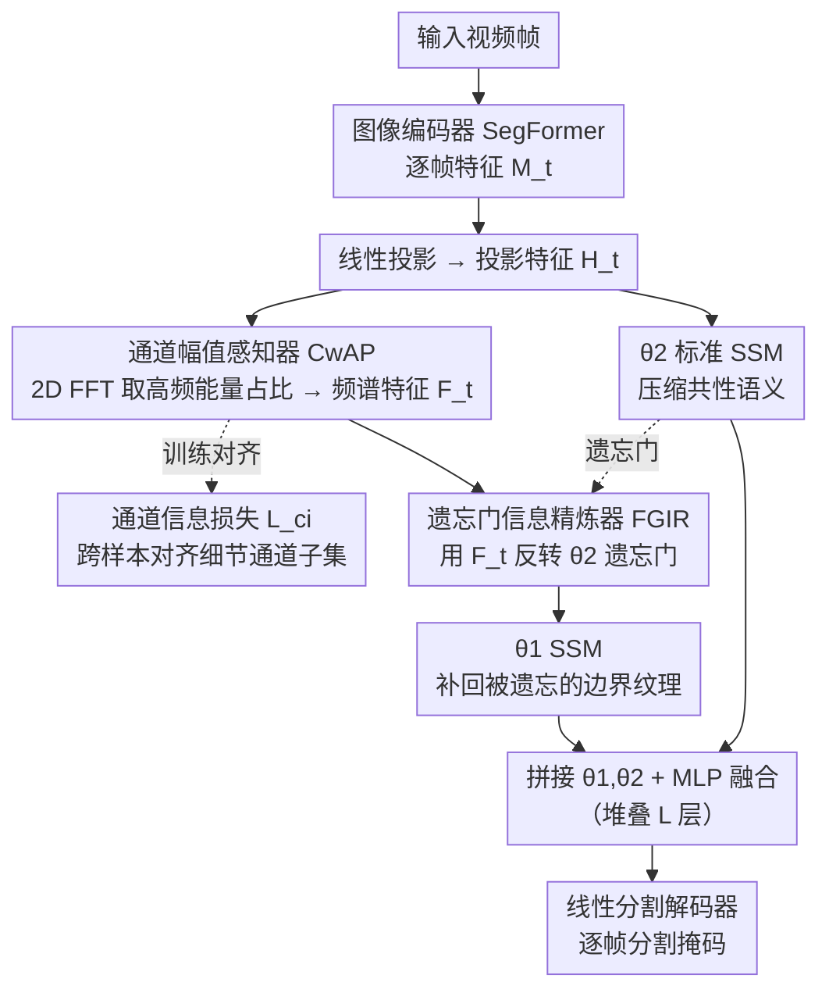

# RS-SSM: Refining Forgotten Specifics in State Space Model for Video Semantic Segmentation

**会议**: CVPR 2026  
**arXiv**: [2603.24295](https://arxiv.org/abs/2603.24295)  
**代码**: [https://github.com/zhoujiahuan1991/CVPR2026-RS-SSM](https://github.com/zhoujiahuan1991/CVPR2026-RS-SSM)  
**领域**: 语义分割 / 视频理解  
**关键词**: 视频语义分割, 状态空间模型, 遗忘门精炼, 频域分析, Mamba

## 一句话总结

提出 RS-SSM，通过频域分析提取各通道的特定信息分布特征（CwAP），并自适应反转遗忘门矩阵来补充性精炼 SSM 状态空间压缩时丢失的时空细节（FGIR），在 4 个视频语义分割基准上达到 SOTA 且保持高效率。

## 研究背景与动机

1. **领域现状**：视频语义分割（VSS）要求对视频每帧每像素赋予语义标签，并保持时序一致性。早期方法用光流建模帧间运动但计算昂贵且噪声大，Transformer 方法通过全局注意力聚合时空信息但复杂度为二次方。近年来，基于状态空间模型（SSM）的方法以线性复杂度高效压缩和传播时空语义信息。

2. **现有痛点**：SSM 通过固定大小的状态空间压缩序列信息，这在保留共性语义（全局结构、平滑区域）时是有效的，但不可避免地丢失了特定信息（边界、纹理、局部变化），导致分割结果仅能粗略定位物体位置，细节模糊。

3. **核心矛盾**：状态空间压缩的本质是用有限维隐状态表示无限长序列，遗忘门 $\bar{A}_d = \exp(\Delta_d A_d)$ 决定了对历史信息的衰减程度。较小的遗忘门值导致激进的压缩，而接近 1 的值保留更多信息——对于像素级 VSS，标准遗忘门的衰减策略会系统性地丢失高频细节。

4. **本文目标** 在保持 SSM 线性复杂度优势的同时，补偿其状态空间压缩过程中遗失的时空特定信息。

5. **切入角度**：观察到不同通道的隐状态包含不同量的特定信息，可以通过频域分析量化各通道的高频能量占比，然后反转遗忘门来重点精炼高频信息丰富的通道。

6. **核心 idea**：通过频域分析定位"特定信息丰富"的通道，自适应反转遗忘门来补偿性恢复被压缩遗忘的时空细节。

## 方法详解

### 整体框架

输入视频帧 $\{I_t\}_{t=1}^T$ 经图像编码器提取特征 $\{M_t\}$，送入 $L$ 层双路径 SSM 层。每层先做权重共享的线性投影得到投影特征 $H_t$，再分两路：$\theta_2$ 是标准 SSM，照常压缩共性语义；$\theta_1$ 则负责补偿——通道幅值感知器（CwAP）对 $H_t$ 做频域分析得到频谱特征 $F_t$（并用通道信息损失 $\mathcal{L}_{ci}$ 跨样本对齐细节通道），遗忘门信息精炼器（FGIR）拿 $F_t$ 反转 $\theta_2$ 的遗忘门去引导 $\theta_1$ 重点恢复被遗忘的特定信息。两路输出拼接后经 MLP 融合，逐层堆叠后最终送入线性分割解码器生成逐帧分割掩码。

### 关键设计

**1. 通道幅值感知器 CwAP：用频域高频能量占比定位"细节丰富"的通道**

要补回被遗忘的细节，第一步得知道细节藏在哪些通道里——但 SSM 的隐状态没有标签告诉你"这一维存的是边界还是平滑区域"。CwAP 的做法是借频域来量化：把投影特征 $H_t \in \mathbb{R}^{D \times H \times W}$ 做 2D FFT 变换到频域，取幅值谱 $H_t^m$，再按归一化频率半径把频谱切成 $K$ 个同心频带，低频带对应全局结构、平滑区域这类共性语义，高频带对应边界、纹理、局部突变这类特定信息。对每个通道，统计它落在最高 $k_h$ 个高频带上的归一化能量占比，汇成频谱特征 $F_t \in \mathbb{R}^D$。$F_t$ 里数值大的维度，就是"高频含量高、细节丰富"的通道。这个度量的好处是完全无监督、且只需一次 FFT（$O(n\log n)$），不引入额外标注或可学习参数，就给后续精炼提供了一张"哪些通道值得救"的地图。

**2. 通道信息损失 $\mathcal{L}_{ci}$：把不同样本的细节分布对齐到相似的通道子集**

CwAP 给出的频谱特征若在不同样本间各跑各的——这帧的细节集中在第 3、7 通道、那帧却在第 12、20 通道——FGIR 就没法用一套统一策略去精炼，训练方向会前后打架、不稳定。$\mathcal{L}_{ci}$ 用来强制这种一致性：先把每帧的频谱特征做 L2 归一化，再对 batch 内所有帧对计算余弦相似度矩阵 $\mathbf{S}_{i,j}$，损失取

$$\mathcal{L}_{ci} = 1 - \frac{1}{|\mathcal{B}|^2} \sum_i \sum_j \mathbf{S}_{i,j}$$

即最大化全体帧对的平均余弦相似度。优化它会把"特定信息"逐渐挤进一个跨样本稳定的通道子集，于是 FGIR 每次都精炼相近的那几维，精炼方向一致、收敛更稳。

**3. 遗忘门信息精炼器 FGIR：反转遗忘门，让第二条路专门捞回第一条路丢掉的细节**

SSM 之所以高效，正是因为遗忘门 $\bar{A}_d = \exp(\Delta_d A_d)$ 会主动衰减历史信息——但这也是细节丢失的根源。直接调大遗忘门去"少遗忘"会破坏压缩优势，得不偿失。FGIR 换了个思路：用双路径，$\theta_2$ 当标准 SSM 照常压缩、负责共性语义，$\theta_1$ 则专门做补偿。关键操作是"反转遗忘门"——$\theta_2$ 的遗忘门本身就标出了哪些通道被衰减得最狠（细节丢得最多），FGIR 拿 CwAP 的频谱特征 $F_t$ 作权重，把这些被重压缩的通道在 $\theta_1$ 里反向保留更多信息，让 $\theta_1$ 集中火力在"$\theta_2$ 丢得最多、又确实是高频"的那批通道上做恢复。两路输出拼接融合后，$\theta_2$ 守住全局语义、$\theta_1$ 补上边界纹理，关注点互补而非冗余。比起简单增大状态维度去硬扛遗忘，这种"一条路遗忘、一条路专补遗忘"的分工显然更省、也更对症。

### 损失函数 / 训练策略

总损失包括标准的语义分割交叉熵损失和通道信息损失 $\mathcal{L}_{ci}$。图像编码器使用 SegFormer 预训练权重。输入分辨率 480×853 计算 GFLOPs 和 FPS。双路径 SSM 层数 $L$ 为超参数。频带数 $K$ 和高频带数 $k_h$ 是 CwAP 的关键超参。

## 实验关键数据

### 主实验

在 VSPW、NYUv2、CamVid 三个数据集上与现有方法对比。根据论文摘要和方法描述，RS-SSM 在保持高效率（线性复杂度）的同时达到最佳或次佳分割精度：

| 数据集 | 指标 | RS-SSM 表现 | 说明 |
|--------|------|-------------|------|
| VSPW | mIoU | SOTA | 大规模视频语义分割基准 |
| NYUv2 | mIoU | SOTA | 室内场景分割 |
| CamVid | mIoU | SOTA | 驾驶场景视频分割 |
| 4 基准整体 | mIoU + GFLOPs + FPS | 精度最优且效率保持 | 线性复杂度 vs Transformer 二次复杂度 |

（注：缓存文件中实验数据表格截断，具体数值需参见原文 Table 1）

### 消融实验

根据方法设计，消融实验应包括：

| 配置 | 说明 |
|------|------|
| Full RS-SSM | 完整模型，CwAP + FGIR + $\mathcal{L}_{ci}$ |
| w/o CwAP | 去掉频域通道分析，FGIR 无频谱特征引导 |
| w/o FGIR | 去掉遗忘门反转，仅做标准双路径 SSM |
| w/o $\mathcal{L}_{ci}$ | 去掉通道对齐损失 |
| Single-path SSM | 去掉双路径，退化为标准 SSM（如 TV3S） |

### 关键发现

- **遗忘门反转是核心贡献**：通过可视化更新门 $\bar{B}_d$ 可以看到，标准 SSM $\theta_2$ 在细节区域信息量严重衰减，而反转遗忘门后的 $\theta_1$ 能有效恢复这些被遗忘的边界和纹理细节。
- **CwAP 频域分析提供了有效的通道选择信号**：高频能量占比高的通道确实对应更多的边界和纹理信息，频谱特征是一个无监督且计算高效的通道重要性度量。
- **通道信息损失的对齐效果**：跨样本对齐使得 FGIR 可以一致地精炼相似的通道子集，避免了每个样本的精炼方向不一致导致的训练不稳定。
- **线性复杂度优势**：相比 Transformer 方法在长视频上的二次复杂度瓶颈，RS-SSM 保持了 SSM 的线性效率。

## 亮点与洞察

- **"遗忘的反面即精炼"的思想非常巧妙**：不是试图阻止 SSM 遗忘（这会破坏其压缩优势），而是用一个互补的 SSM 专门恢复被遗忘的内容。这种"分工互补"的双路径设计比简单增大状态空间维度更优雅。
- **频域作为通道分析工具**：用 FFT 幅值谱的高频能量占比来量化"特定信息量"，原理直观（高频=边界/纹理）、计算高效（FFT 是 O(n log n)）、无需标签。这种频域分析可迁移到任何需要区分"粗粒度 vs 细粒度"信息的场景。
- **SSM 在视觉领域的系统性改进**：识别了 SSM 在像素级任务中的关键瓶颈（遗忘细节），并提供了针对性解决方案，对 Mamba 在视觉领域的进一步发展有指导意义。

## 局限与展望

- 双路径设计增加了参数量和计算量（虽然仍是线性复杂度），需要验证在更大分辨率/更长视频下的效率优势是否仍然成立
- CwAP 的频带数 $K$ 和高频带数 $k_h$ 需要手动设定，对不同数据集可能需要调整
- 仅在预定义的 4 个 VSS 基准上验证，未在 panoptic/instance 级别的视频分割上测试
- 遗忘门反转是否会导致某些长距离依赖信息的过度保留，造成"信息过载"
- 可以探索可学习的频域选择机制，替代固定的频带划分

## 相关工作与启发

- **vs TV3S**: TV3S 是首个将 SSM 应用于 VSS 的方法，但忽略了状态空间压缩导致的细节丢失。RS-SSM 直接针对这一问题，通过遗忘门反转实现补偿精炼
- **vs Transformer VSS (CFFM/MRCFA)**: Transformer 方法通过全局注意力天然保留细节，但复杂度为二次方。RS-SSM 在线性复杂度下通过双路径+频域引导达到可比甚至更优的精度
- **vs VideoMamba**: VideoMamba 是通用视频骨干，RS-SSM 专门为像素级分割任务设计了遗忘门精炼策略，是任务特定的 SSM 改进

## 评分

- 新颖性: ⭐⭐⭐⭐ 遗忘门反转+频域通道分析的组合是新颖的，"在 SSM 中精炼被遗忘细节"的视角有启发性
- 实验充分度: ⭐⭐⭐⭐ 4 个基准覆盖面广，但缓存中具体数值截断，更新门可视化提供了直观验证
- 写作质量: ⭐⭐⭐⭐ 数学推导严谨，双路径架构和频域分析的可视化清晰
- 价值: ⭐⭐⭐⭐ 为 SSM 在像素级视觉任务中的应用提供了系统性解决方案，对 Mamba 在视觉领域的发展有推动作用

<!-- RELATED:START -->

## 相关论文

- [\[CVPR 2025\] Exploiting Temporal State Space Sharing for Video Semantic Segmentation](../../CVPR2025/segmentation/exploiting_temporal_state_space_sharing_for_video_semantic_segmentation.md)
- [\[CVPR 2025\] DefMamba: Deformable Visual State Space Model](../../CVPR2025/segmentation/defmamba_deformable_visual_state_space_model.md)
- [\[CVPR 2025\] MV-SSM: Multi-View State Space Modeling for 3D Human Pose Estimation](../../CVPR2025/segmentation/mv-ssm_multi-view_state_space_modeling_for_3d_human_pose_estimation.md)
- [\[CVPR 2026\] MARSS: Radar Semantic Segmentation via Modular Attention and State Space Models](marss_radar_semantic_segmentation_via_modular_attention_and_state_space_models.md)
- [\[CVPR 2025\] GroupMamba: Efficient Group-Based Visual State Space Model](../../CVPR2025/segmentation/groupmamba_efficient_group-based_visual_state_space_model.md)

<!-- RELATED:END -->
