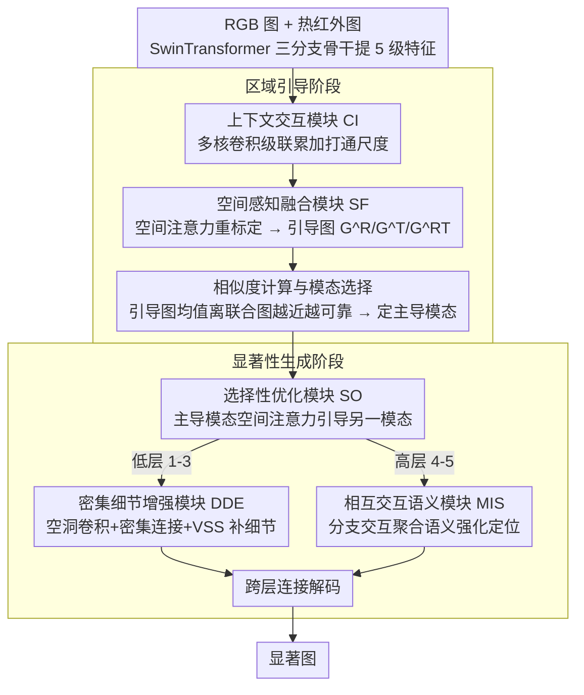

<!-- 由 src/gen_stubs.py 自动生成 -->
# RSONet: Region-guided Selective Optimization Network for RGB-T Salient Object Detection

**会议**: CVPR2026  
**arXiv**: [2603.12685](https://arxiv.org/abs/2603.12685)  
**代码**: 待确认  
**领域**: 语义分割 / 显著性目标检测  
**关键词**: RGB-T 显著性检测, 区域引导, 选择性优化, 多模态融合, SwinTransformer, 视觉状态空间模型

## 一句话总结

提出两阶段 RGB-T 显著性检测网络 RSONet：先通过区域引导阶段计算 RGB/热红外引导图与联合引导图的相似度，选出更可靠的模态；再在显著性生成阶段利用选择性优化融合双模态特征，配合密集细节增强和相互交互语义模块生成高质量显著图，在三个 RGB-T 基准上取得 SOTA 性能。

## 研究背景与动机

**RGB 单模态局限**：复杂背景、低对比度、模糊边界等场景下，纯 RGB 方法性能下降严重，需引入辅助模态信息。

**深度信息不足**：RGB-D 中深度图在物体与背景空间相邻时难以区分，深度质量受采集设备和距离影响较大。

**热红外模态引入**：热图不受光照变化影响，可有效补充 RGB 在夜间/低光场景的缺陷，但自身也受环境温度与材料属性影响。

**双模态不一致问题**（核心动机）：RGB 与热图中显著区域分布经常不一致——有的样本 RGB 清晰但热图模糊，有的相反。直接拼接/相加/注意力融合会引入大量噪声。

**现有融合策略的局限**：加法、乘法、拼接或注意力机制隐含地假设双模态等重要，无法适应信息质量差异大的情况。

**缺乏模态选择机制**：大多数方法没有显式判断哪个模态更可靠，本文提出"区域引导 + 相似度计算"实现自适应模态主导选择。

## 方法详解

### 整体框架

RSONet 想解决的核心问题是：RGB 图和热红外图里的显著区域常常对不上——同一个样本，有时 RGB 清楚而热图糊，有时反过来。既然两个模态的可靠程度因样本而异，那就先判断哪个更可信，再让它来主导融合，而不是无脑等权拼接。

整个网络因此拆成前后两个阶段。**区域引导阶段**用三路并行的编码-解码分支，分别从 RGB、热图、以及二者联合输入提特征；每路特征先过上下文交互模块（CI）打通多尺度信息，再过空间感知融合模块（SF）在空间维度做重标定，输出三张引导图 $\mathbf{G}^R$、$\mathbf{G}^T$、$\mathbf{G}^{RT}$；其中联合引导图 $\mathbf{G}^{RT}$ 当作"参考答案"，谁离它更近就说明谁更可靠，由此选出主导模态。**显著性生成阶段**拿着这个选择结果，用选择性优化模块（SO）把双模态特征做选择性融合，再对低层特征走密集细节增强模块（DDE）、高层特征走相互交互语义模块（MIS），分别补细节和补定位，最后跨层连接解码出显著图。两个阶段的骨干都用 SwinTransformer，统一提取 5 级多尺度特征。

### 关键设计

**1. 上下文交互模块（CI）：让不同尺度的特征互相通气**

骨干提取的 5 级特征分辨率差异很大，低层分辨率高、细节多，高层分辨率低、语义强，用同一套卷积核处理并不合适。CI 因此按层级设了三种变体，越往低层用越大的感受野去覆盖密集细节：低层 $\mathbf{F}_1$ 用 1×1/3×3/5×5/7×7 四种核，中层 $\mathbf{F}_{2/3}$ 用 1×1/3×3/5×5，高层 $\mathbf{F}_{4/5}$ 只用 1×1/3×3。关键在于这些分支不是各算各的——采用级联累加策略，把上一分支的输出加到当前分支的输入上，让相邻尺度的信息先打通再沿通道维拼接，避免不同感受野各说各话。

**2. 空间感知融合模块（SF）：把"哪里重要"显式标出来**

CI 解决了尺度间通气，但还没回答空间上哪些位置更值得关注。SF 接在 CI 之后，先做两层 3×3 卷积，再经全局最大池化 → 1×1 卷积 → Sigmoid 生成一张空间权重图，乘加回原特征上做空间维度的重标定。这个过程自顶向下逐层进行，最终输出每一路分支的引导图。正是这一步把三路编码-解码的输出收敛成可比较的 $\mathbf{G}^R$、$\mathbf{G}^T$、$\mathbf{G}^{RT}$，为下一步的模态选择做准备。

**3. 相似度计算与模态选择：用引导图均值判断谁更可信**

这是整篇方法的题眼。前面假设"双模态可靠度因样本而异"，这里就要给出一个可计算的判据。具体做法很朴素：对三张引导图分别求空间均值 $M^R$、$M^T$、$M^{RT}$，然后比较两个差值 $|M^R - M^{RT}|$ 与 $|M^T - M^{RT}|$——把联合引导图当作两模态协同后的参考，谁的单模态引导图离它更近，就说明谁提供的信息更接近"正确答案"，那个模态便在后续融合中占主导。这样模型每个样本都能自适应地选边站，而不像加法/拼接那样隐含地认定两模态永远等重。

**4. 选择性优化模块（SO）：让主导模态去引导另一个**

选出主导模态后，怎么把这份"谁更可靠"的判断落到特征融合上，就是 SO 的工作。它先用联合引导图 $\mathbf{G}^{RT}$ 对双模态特征做乘加增强，把引导信息注入特征；但引导图本身也可能带噪，于是接一层通道注意力把这些干扰压下去。最关键的一步是跨模态引导：取更可靠模态的空间注意力，去优化另一模态的特征——相当于让"看得清的那只眼睛"帮"看不清的那只"对焦，最后两路优化后的特征相加输出。这正是论文标题里 selective optimization 的落点，也是消融里贡献最大的模块。

**5. 密集细节增强模块（DDE）：给低层特征补回空间结构**

低层特征（1-3 层）分辨率高、富含边界与纹理，但单层卷积的感受野不足以串起这些密集细节。DDE 用四路并行空洞卷积（膨胀率 1/3/5/7）覆盖多个尺度，再用密集连接让各分支共享彼此的多尺度感受野信息，而不是孤立地各采各的样。每个分支后面还接一个 VSS（Visual State Space）块，借状态空间模型进一步建模长程空间关系，最后沿通道拼接。低层走 DDE 是因为这一层最需要的是把细节"织"得连贯。

**6. 相互交互语义模块（MIS）：给高层特征强化定位**

高层特征（4-5 层）分辨率低但语义强，决定目标"在哪"。MIS 用膨胀率 1/2/3 的 3×3 卷积搭三个主分支，每个主分支内部又分三个子分支互相交互后输出，三个主分支拼接后再加一层通道注意力压噪。与 DDE 偏重细节不同，MIS 通过分支间的反复交互聚合语义上下文，强化的是目标位置的判别力——两者一低一高、一细节一定位，正好互补。

### 一个完整示例

设想一张夜间街景的 RGB-T 样本：RGB 图里行人因为低光几乎和背景融成一片，但热图里人体因体温明显发亮。

输入先分三路过编码-解码，CI + SF 输出三张引导图。求均值后假设得到 $M^R \approx 0.30$、$M^T \approx 0.52$、$M^{RT} \approx 0.50$（⚠️ 具体数值仅为示意，以原文为准）。比较差值：$|M^R - M^{RT}| = 0.20$，$|M^T - M^{RT}| = 0.02$——热图侧明显更接近联合引导图，于是这个样本判定**热图主导**。

进入 SO，模型便取热图特征的空间注意力去引导 RGB 特征：原本糊成一团的 RGB 行人区域，被热图"高亮人体"的注意力拉回焦点，通道注意力再把热图引入的背景热噪声压掉。融合后的特征分流——低层走 DDE 把行人的轮廓边界织清晰，高层走 MIS 锁定行人在画面里的位置。跨层解码后，即便 RGB 单看几乎检测不到行人，最终显著图依然能把人完整勾出来。换成一个白天高对比度样本，相似度判据则会自动反转为 RGB 主导，整套流程不变。

### 损失函数

联合损失 = BCE + BIoU + F-measure，对 5 个尺度的显著图施加深度监督：

$$L_{total} = \frac{1}{N}\sum_{i=1}^{N}(L_{bce} + L_{iou} + L_{fm})$$

## 实验

### 数据集与设置

- **训练集**：VT5000 训练集（2500 张）
- **测试集**：VT5000 测试集（2500 张）、VT1000（1000 张）、VT821（821 张）
- 输入分辨率 384×384，RMSprop 优化器，学习率 1e-4，单张 RTX 4080 GPU

### 主要结果

| 数据集 | $\mathcal{M}$↓ | $F_\beta$↑ | $S_\alpha$↑ | $E_\xi$↑ |
|--------|------|------|------|------|
| VT5000 | **0.020** | **0.910** | **0.926** | **0.963** |
| VT1000 | **0.014** | 0.923 | 0.946 | 0.972 |
| VT821 | 0.021 | 0.883 | 0.921 | 0.946 |

对比 27 种 SOTA 方法，VT5000 上 $F_\beta$ 较 PATNet 提升 3.4%，$E_\xi$ 提升 1.2%，$S_\alpha$ 提升 1.1%。

### 模型效率

| 指标 | 值 |
|------|-----|
| 参数量 | 88M |
| FLOPs | 143.8G |
| 推理速度 | 9.4 FPS |

参数量处于中等水平（得益于三分支权重共享），但两阶段设计导致推理速度偏低。

### 消融实验

| 设置 | $\mathcal{M}$↓ | $F_\beta$↑ | $S_\alpha$↑ | $E_\xi$↑ |
|------|------|------|------|------|
| w/o SO（加法替代） | 0.0217 | 0.8883 | 0.9213 | 0.9523 |
| w/o SO（乘法替代） | 0.0208 | 0.8948 | 0.9231 | 0.9587 |
| w/o SO（拼接替代） | 0.0215 | 0.8896 | 0.9224 | 0.9558 |
| w/o SO（逐像素软门控） | 0.0203 | 0.8951 | 0.9239 | 0.9605 |
| R→T（无区域引导） | 0.0215 | 0.8898 | 0.9230 | 0.9561 |
| T→R（无区域引导） | 0.0216 | 0.8896 | 0.9233 | 0.9554 |
| w/o DDE | 0.0203 | 0.9082 | 0.9213 | 0.9631 |
| w/o MIS | 0.0203 | 0.8997 | 0.9241 | 0.9593 |
| w/o DDE & MIS | 0.0217 | 0.9053 | 0.8995 | 0.9556 |
| **完整 RSONet** | **0.0197** | **0.9071** | **0.9261** | **0.9632** |

### 骨干网络消融

SwinTransformer 远优于 ResNet-18/34/50，也优于冻结的 SAM/DINO（大模型未适配 RGB-T 域，缺少 adaptor 导致性能反降）。

### 关键发现

- 去掉 SO 模块（用简单融合替代）性能显著下降，说明区域引导+选择性融合是核心贡献。
- 固定 R→T 或 T→R 方向融合不如自适应选择，验证了模态选择的必要性。
- DDE 和 MIS 各自贡献了细节和定位信息，同时去掉两者 $S_\alpha$ 降至 0.8995。

## 亮点

- 明确建模"双模态显著区域不一致"问题，提出区域引导 + 相似度选择的模态主导策略，动机清晰。
- CI 模块根据不同层级特征分辨率使用不同大小卷积核，设计合理。
- DDE 中密集连接 + VSS 块的组合有效挖掘低层空间结构信息。
- 消融实验充分，对 SO/DDE/MIS 均有详尽的对比和可视化分析。

## 局限性

- 推理速度仅 9.4 FPS，两阶段三分支设计导致计算开销大，难以实时部署。
- 相似度计算仅基于引导图均值的全局比较，对局部区域差异不敏感。
- 实验仅在 VT5000/VT1000/VT821 三个 RGB-T 数据集上验证，缺少 RGB-D 或视频 SOD 的泛化实验。
- 当极小目标或双模态同时质量低时检测效果不佳（论文自身给出的 failure cases）。
- 冻结大模型（SAM/DINO）作为骨干效果反降，但未尝试微调或设计 adaptor。

## 相关工作

- **RGB-D SOD**：利用深度信息增强检测，代表方法 EMTrans、Fang et al. 的 Group Transformer。
- **RGB-T SOD**：MCFNet（模态互补融合）、HRTransNet（高分辨率Transformer）、WaveNet（频域视角）、Samba（纯 Mamba 框架）、SAMSOD（基于 SAM 的方法）。
- **单模态 SOD**：AttFeedback、DenseAttFluid、BilateralExtreme 等经典方法。
- 本文与 ContriNet（TPAMI25）、Samba（CVPR25）、SAMSOD（TMM26）为最新竞争方法。

## 评分

- 新颖性: ⭐⭐⭐ — 区域引导+相似度选择模态的想法有一定新意，但各子模块（CI/SF/DDE/MIS）设计较常规
- 实验充分度: ⭐⭐⭐⭐ — 27 种方法对比 + 详尽消融 + 骨干网络分析 + 可视化 + 失败案例
- 写作质量: ⭐⭐⭐ — 公式和模块描述详细，但行文较冗长，符号繁多
- 价值: ⭐⭐⭐ — 在 RGB-T SOD 子领域取得 SOTA，但实时性不足限制实际应用

<!-- RELATED:START -->

## 相关论文

- [\[CVPR 2026\] RDNet: Region Proportion-Aware Dynamic Adaptive Salient Object Detection Network in Optical Remote Sensing Images](rdnet_region_proportion-aware_dynamic_adaptive_salient_object_detection_network_.md)
- [\[CVPR 2026\] Efficient RGB-D Scene Understanding via Multi-task Adaptive Learning and Cross-dimensional Feature Guidance](efficient_rgb-d_scene_understanding_via_multi-task_adaptive_learning_and_cross-d.md)
- [\[CVPR 2026\] ConceptPrism: Concept Disentanglement in Personalized Diffusion Models via Residual Token Optimization](conceptprism_concept_disentanglement_in_personalized_diffusion_models_via_residu.md)
- [\[AAAI 2026\] SAM-DAQ: Segment Anything Model with Depth-guided Adaptive Queries for RGB-D Video Salient Object Detection](../../AAAI2026/segmentation/sam-daq_segment_anything_model_with_depth-guided_adaptive_queries_for_rgb-d_vide.md)
- [\[CVPR 2026\] Concept-Guided Fine-Tuning: Steering ViTs away from Spurious Correlations to Improve Robustness](concept-guided_fine-tuning_steering_vits_away_from_spurious_correlations_to_impr.md)

<!-- RELATED:END -->
