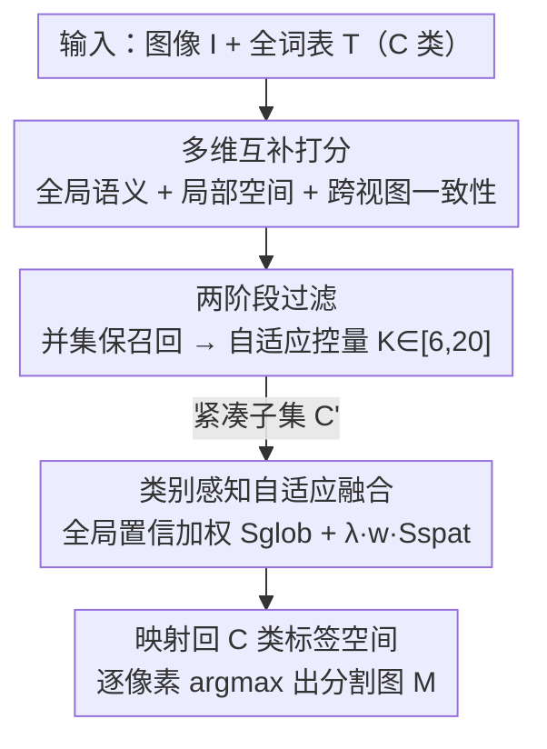

# S2C2Seg: Semantic-Spatial Consistency and Category Optimization for Open-Vocabulary Segmentation

**会议**: CVPR 2026  
**论文**: [CVF Open Access](https://openaccess.thecvf.com/content/CVPR2026/html/Qing_S2C2Seg_Semantic-Spatial_Consistency_and_Category_Optimization_for_Open-Vocabulary_Segmentation_CVPR_2026_paper.html)  
**代码**: 待确认  
**领域**: 开放词表分割  
**关键词**: 开放词表分割, 训练无关, 类别子集筛选, 全局-局部融合, CLIP

## 一句话总结
S2C2Seg 是一个免训练、可插在任意 CLIP-based 分割方法上的即插即用框架，它先用「全局语义 + 局部空间 + 跨视图一致性」三路打分把超大词表裁成一个紧凑的候选类别子集（CSS），再用类别置信度加权把 CLIP 全局特征和 CLIPSeg 局部预测自适应融合（CSG），在 8 个 benchmark 上给 SCLIP / ProxyCLIP / CorrCLIP 分别带来 +9.7 / +6.8 / +3.4 mIoU 提升，把平均 mIoU 推到 51.2% 的新 SOTA。

## 研究背景与动机

**领域现状**：开放词表语义分割（OVSS）要把像素级识别推广到任意文本描述的类别。主流免训练做法是直接拿 CLIP 这类视觉-语言模型做密集预测——CLIP 靠对比预训练学到了强大的全局图文对齐，零样本分类很准。近两年的工作（SCLIP、ProxyCLIP、CorrCLIP 等）大多在 CLIP 的自注意力上做空间细化，或引入 DINO、扩散模型等互补先验来补空间细节。

**现有痛点**：CLIP 的预训练目标是「全局图文对齐」，天生不擅长密集预测，于是出现两个老大难：一是注意力图的空间定位很粗；二是当词表规模一大，语义相近（airplane / aircraft）或共现（road / vehicle）的类别激活会互相重叠、彼此污染。现有两条路线各自只顾一头：**空间细化派**（attention refinement、特征去噪、引入互补模型）把所有候选类别一视同仁，不管它们语义上像不像、预测可不可信，结果把全局特征里那点模糊激活原封不动传到最终预测；**消歧派**（CaR、FLOSS、CDAM）靠相似度排序或熵来裁类别，但只用单一维度的全局相似度，完全不看空间预测一致性。

**核心矛盾**：「粗定位」和「类别重叠」这两个问题其实是耦合的——词表越大、相似类别越多，模糊的全局激活就越容易在空间上散开。但现有方法把它们当成两个独立问题分头处理，于是顾此失彼：只裁类别不修空间，或只修空间不裁类别。

**本文目标**：在一个免训练框架里同时解决「词表消歧」和「空间细化」，而且要能直接插到现有 baseline 上、不增加训练成本。

**切入角度**：作者观察到图像级模型（CLIP）和像素级模型（CLIPSeg）的能力恰好互补——CLIP 全局语义稳但空间糙，CLIPSeg 空间细但跨类别预测不一致。把两者的「语义、空间、一致性」三种线索联合起来，既能筛掉冗余类别，又能在融合时按类别可信度分配信任。

**核心 idea**：先用多维打分把词表裁成紧凑子集（减少混淆源），再用类别感知的置信加权融合全局与局部特征（对语义强的类别给更强的全局正则、对弱类别保留局部空间精度）——用「裁词表 + 按类别可信度融合」一套组合拳同时治冗余和糙定位。

## 方法详解

### 整体框架
S2C2Seg 把现有 baseline 的密集预测当作「空间线索源」，自己只在外面套两个免训练模块串成两阶段流水线。给定图像 $I \in \mathbb{R}^{H \times W \times 3}$ 和 $C$ 个文本类别 $\mathcal{T}=\{t_1,\dots,t_C\}$，标准 OVSS 会对每个像素独立评估全部 $C$ 个类别，导致预测在视觉相似类别间散开（冗余）、像素预测缺乏全局语义约束（全局-局部不一致）。S2C2Seg 第一阶段 **CSS（Category Subset Selection）** 把 $C$ 类筛成一个紧凑子集 $\mathcal{C}' \subset \mathcal{C}$（$K=|\mathcal{C}'|$，受 $K_{\min}=6$、$K_{\max}=20$ 约束）；第二阶段 **CSG（Consistent Semantic Guidance）** 在这个子集上把 CLIP 全局特征与局部空间预测自适应融合，得到最终分割：$\mathbf{M}=\mathrm{CSG}(\mathbf{I}, \mathcal{C}', \mathbf{S}_{\text{spat}})$，其中 $\mathbf{S}_{\text{spat}}$ 是筛选后子集的像素级空间预测（由 baseline 或 CLIPSeg 给出）。

### 关键设计

**1. 多维互补打分：用语义、空间、一致性三路线索给每个类别投票**

裁词表最容易踩的坑是「只看一个维度」——CaR 只用 CLIP 全局相似度，会漏掉那些全局对齐弱但局部存在感强的类别。CSS 的做法是给每个候选类别 $c_i$ 同时算三种互补分数。**全局语义对齐** $s^{(i)}_{\text{glob}}$ 用 CLIP 把文本嵌入 $\mathbf{T}\in\mathbb{R}^{C\times d}$ 和全局图像特征 $v_{\text{glob}}\in\mathbb{R}^d$ 做 L2 归一化后的余弦相似度，衡量图像级匹配。**局部空间存在度** $s^{(i)}_{\text{spat}}$ 把密集模型产生的逐像素激活图 $P^{(i)}\in[0,1]^{H'\times W'}$ 在空间上取均值，值越高说明该类别在画面里的细粒度证据越强。**跨视图一致性**则更巧：先把两路分数 L1 归一化成分布 $\bar{s}_{\text{glob}}$、$\bar{s}_{\text{spat}}$，用它们内积过 sigmoid 得到融合权重

$$\alpha = \sigma\!\left(\sum_{i=1}^{C}\bar{s}^{(i)}_{\text{glob}}\cdot\bar{s}^{(i)}_{\text{spat}} - 0.5\right),$$

两个视图一致时 $\alpha$ 高、冲突时 $\alpha$ 低，再加权重归一得到融合分布 $p^{(i)}$。关键是作者用「条件熵」量化每个类别被选中的确定性：选中 $c_i$ 后算残差分布 $p^{(j|i)}_{\text{res}}=p^{(j)}/(1-p^{(i)})$，归一化条件熵 $H^{(i)}=-\frac{1}{\log(C-1)}\sum_{j\neq i}p^{(j|i)}_{\text{res}}\log p^{(j|i)}_{\text{res}}$，最终一致性分数

$$s^{(i)}_{\text{conf}} = p^{(i)}\,(1-H^{(i)}) \in [0,1],$$

同时奖励「出现概率高 $p^{(i)}$」和「选择确定性高 $1-H^{(i)}$」——一个类别只有既可能存在、又不和其他类别纠缠不清，才拿高分。这样三路线索互补，避免任何单一指标的盲区。

**2. 两阶段过滤：先用并集保召回，再用统一打分自适应控量**

有了三种分数，怎么裁才能既不漏真类别、又不留冗余？CSS 用先放后收的两阶段策略。**第一阶段 Multi-aspect Aggregation 保召回**：对三个分数向量各自取 Top-$\lfloor\tau C\rfloor$（统一保留比例 $\tau\in(0,1]$）得到索引集 $\mathcal{I}_k$，然后取**并集** $\mathcal{C}_{\text{init}}=\{c_i: i\in\mathcal{I}_{\text{glob}}\cup\mathcal{I}_{\text{spat}}\cup\mathcal{I}_{\text{conf}}\}$——只要在任一维度有强证据就保留，最大化召回率。**第二阶段 Adaptive Size Control 控精度**：对 $\mathcal{C}_{\text{init}}$ 里每个类别把三种分数各自 min-max 归一化到 $[0,1]$，求和得统一排序分 $s^{(i)}_{\text{final}}=\hat{s}^{(i)}_{\text{glob}}+\hat{s}^{(i)}_{\text{spat}}+\hat{s}^{(i)}_{\text{conf}}$，取 Top-$K$，且 $K$ 被夹在 $K_{\min}=6$ 到 $K_{\max}=20$ 之间。下界保证简单场景也有足够类别多样性、不至于裁过头，上界防止复杂场景塞进太多冗余类别。这种「并集放、reranking 收」的设计让最终子集既覆盖全又干净，从源头上掐掉了相似类别互相污染的混淆源。

**3. 类别感知自适应融合：按全局语义强弱给局部预测分配信任**

裁完词表，剩下的问题是怎么把 CLIP 的全局语义和 CLIPSeg 的局部空间预测合在一起。简单相加会让所有类别一视同仁，但不同类别的可信度其实差很多。CSG 先做双流特征抽取：CLIP 视觉编码器给出 patch 级特征算出 patch-文本相似度矩阵 $\mathbf{S}_{\text{glob}}=\bar{\mathbf{V}}\bar{\mathbf{T}}'^{\top}$，双线性上采样到原图分辨率；CLIPSeg 给出局部空间预测 $\mathbf{S}_{\text{spat}}=F_{\text{dense}}(\mathbf{I},\mathcal{T}')$。融合时的关键是**类别置信加权**：先对每个类别在空间上平均全局相似度 $g^{(i)}=\frac{1}{HW}\sum_{h,w}\mathbf{S}^{(i)}_{\text{glob}}(h,w)$，再把 $g=[g^{(1)},\dots,g^{(K)}]^\top$ 过温度缩放的 softmax 得到置信权重 $w$，最终融合 logits 为

$$\mathbf{S}^{(i)}_{\text{fused}} = \mathbf{S}^{(i)}_{\text{glob}} + \lambda\cdot w^{(i)}\cdot\mathbf{S}^{(i)}_{\text{spat}},$$

其中 $\lambda$ 平衡全局与局部贡献。这个 $w^{(i)}$ 是设计精髓：全局语义证据强的类别拿到更高权重、更多吸收局部空间细节（局部更可信，放心用细定位）；语义弱的类别被下调权重，避免引入噪声。换句话说，对「CLIP 已经很确信」的类别施加更强的局部细化，对「CLIP 拿不准」的类别保守一点、靠全局语义兜底纠偏。最后把 $K$ 个子集类别映射回完整 $C$ 类标签空间——子集内的类别填 $\mathbf{S}^{(i)}_{\text{fused}}$、子集外的填 $-\infty$ 直接排除，逐像素 argmax 得到分割图 $\mathbf{M}(h,w)=\arg\max_j \mathbf{S}^{(j)}_{\text{final}}(h,w)$。

### 损失函数 / 训练策略
本方法完全免训练，没有任何可学习参数和损失函数。实现上用 ViT-B/16 CLIP 做视觉-语言骨干、CLIPSeg 做密集预测，每类用 80 个 prompt 模板算文本嵌入。关键超参：CSS 的保留比例 $\tau=0.3$、子集大小界 $K_{\min}=6$/$K_{\max}=20$；CSG 的融合权重 $\lambda=0.6$。图像短边在 VOC/Context 上 resize 到 336、在 ADE20K/Cityscapes/COCO-Stuff 上 resize 到 448。

## 实验关键数据

### 主实验
在 8 个 benchmark（VOC20/21、Context59/60、COCO-Object、COCO-Stuff、ADE20K、Cityscapes）上报告 mIoU。S2C2Seg 作为即插即用模块挂在三个代表性 baseline 上都稳定涨点：

| 配置 | 平均 mIoU | 提升 | 备注 |
|------|-----------|------|------|
| SCLIP (ECCV'24) | 38.2 | — | 注意力细化派 |
| SCLIP + Ours | 47.9 | **+9.7** | baseline 越弱涨得越多 |
| ProxyCLIP (ECCV'24) | 42.3 | — | 引入自监督模型 |
| ProxyCLIP + Ours | 49.1 | **+6.8** | — |
| CorrCLIP (ICCV'25) | 47.8 | — | 当前 SOTA baseline |
| CorrCLIP + Ours | **51.2** | **+3.4** | 刷新 SOTA |
| Trident (ICCV'25) | 45.8 | — | 之前最佳之一 |
| CASS (CVPR'25) | 44.4 | — | — |

S2C2Seg+CorrCLIP 的 51.2% 比 Trident 高 5.4 点、比 CASS 高 6.8 点。提升幅度与 baseline 复杂度成反比——baseline 越简陋，框架补的空间越大。在含背景的 VOC21 上，CSG 利用 CLIP 全局判别力纠正背景干扰带来的局部偏差，单数据集涨 +11.5 点。

### 消融实验
组件消融（ProxyCLIP / CLIPSeg 为 baseline）和 CSS 三维打分消融：

| 配置 | VOC21 mIoU | 8-bench 平均 | 说明 |
|------|-----------|--------------|------|
| ProxyCLIP baseline | 61.3 | — | 原始 baseline |
| + CSS only | 64.3 | — | 仅裁词表，VOC21 +3.0 |
| Ours (w/o CSG) | 70.4 | — | 裁词表 + 均匀加权，VOC21 +9.1 |
| Ours (w/o CSS) | 68.0 | — | 全词表 + 自适应融合，VOC21 +6.7 |
| **Ours (Full)** | **72.8** | — | VOC21 +11.5（>3.0+6.7，超可加） |

| CSS 打分维度 | 8-bench 平均 mIoU | 说明 |
|--------------|-------------------|------|
| w/o Sel.（不裁词表） | 45.9 | 基线 |
| $S_{\text{glob}}$ only | — | 仅全局相似度 |
| $S_{\text{glob}}+S_{\text{spat}}$ | 47.7 | 加空间存在度 |
| $S_{\text{glob}}+S_{\text{conf}}$ | 47.8 | 加一致性 |
| **Full CSS（三维）** | **49.1** | 三路互补最优 |
| Oracle (GT 类别) | 61.9 | 上界，留有空间 |

CSG 融合策略对比（Table 4，与 additive/multiplicative/weighted-avg/min-max 比）：类别感知融合拿到 49.1% 平均 mIoU，比直接相加（Add. 70.4/VOC21）高 +2.4，在 Context59（+4.6）、ADE（+2.7）、VOC21（+2.4）上提升尤其明显。

### 关键发现
- **两模块互补且超可加**：VOC21 上 CSS 单独 +3.0、CSG 单独 +6.7，但合起来 +11.5 > 两者之和，说明裁干净词表后融合才能发挥最大威力——先消歧再融合是有协同的。
- **三维打分缺一不可**：去掉任何一维都掉点（单 $S_{\text{glob}}$ 不如三维全开），跨视图一致性 $S_{\text{conf}}$ 和空间存在度 $S_{\text{spat}}$ 对全局相似度是真补充而非冗余。
- **混淆矩阵实证消歧效果**：CSS 主要降低语义相近类别的混淆（bicycle/motorbike、car/bus），CSG 主要降低空间相邻类别的混淆（person/chair、person/table），两者打击的混淆类型不同、互补。
- **超参稳健**：$\lambda\in\{0.4,0.8\}$ 时 mIoU 稳定在 48.0–49.5%，$\tau\in\{0.2,0.5\}$、$K_{\max}\in\{15,25\}$ 表现都鲁棒，说明不靠精调超参。
- **Oracle 上界 61.9%** 距 Full CSS 的 49.1% 还有 12.8 点，说明类别筛选离完美还有不小空间。

## 亮点与洞察
- **免训练 + 即插即用**：不引入任何可学习参数，挂在 SCLIP/ProxyCLIP/CorrCLIP 上都涨，这种「外挂式」设计迁移成本极低，对任何 CLIP-based OVSS 方法几乎都能套用。
- **「裁词表」这件事被系统化了**：以往要么只用全局相似度（CaR）、要么只用熵（FLOSS），本文把全局语义、局部空间、跨视图一致性三种正交线索拧成一股，并用条件熵量化「选择确定性」，这个 $s_{\text{conf}}=p^{(i)}(1-H^{(i)})$ 的设计很可借鉴——把「存在概率」和「不纠缠」两件事一起编码。
- **类别置信加权的融合思路可迁移**：「对模型已经确信的类别施加更强的局部细化、对拿不准的类别保守兜底」这种按可信度分配信任的融合，本质是一种自适应正则，能迁到任何「全局粗语义 + 局部细预测」需要合并的密集任务（如开放词表检测、referring segmentation）。
- **两阶段「并集放、reranking 收」**：先 union 保召回、再统一打分控量并夹在 $[K_{\min},K_{\max}]$，这种「宁可多选再精修」的过滤范式比一刀切阈值更稳。

## 局限与展望
- **作者承认**：Oracle 用真值类别能到 61.9%，说明类别筛选远未饱和，CSS 的召回/精度权衡还有提升空间（gap 分析放在补充材料）。
- **依赖外部密集模型**：方法把 CLIPSeg 当作局部空间预测源，整体性能受 CLIPSeg 质量天花板制约；若密集模型本身在某域上很差，局部线索会失真。
- **超参虽稳但仍需设定**：$\tau$、$K_{\min}/K_{\max}$、$\lambda$ 是手工设定的全局常量，对类别数差异极大的数据集（19 类 Cityscapes vs 171 类 COCO-Stuff）用同一套界 $[6,20]$ 可能不是最优，自适应地按场景调 $K$ 范围是个方向。
- **条件熵打分的计算开销**：对每个候选类别都要算残差分布的条件熵，在超大词表（数千类）下打分阶段的开销值得关注，论文主要在 ≤171 类规模上验证。
- **改进思路**：可把 CSS 的固定 $K$ 界换成按图像复杂度（如全局熵）动态决定的上下界；或让 CSG 的温度/λ 也类别自适应而非全局常量。

## 相关工作与启发
- **vs CaR (CVPR'24)**：CaR 只用 CLIP 全局相似度裁类别，会低估「全局对齐弱但局部存在感强」的类别；本文 CSS 加入局部空间存在度和跨视图一致性两维，召回更全、消歧更准。
- **vs FLOSS / CDAM**：FLOSS 用预定义模板的文本熵、CDAM 用 JS 散度量空间注意力分布，都是单维度准则；CSS 在一个两阶段框架里平衡召回与精度，做动态类别过滤。
- **vs 空间细化派（SCLIP/ProxyCLIP/CorrCLIP）**：这些方法把所有候选类别一视同仁地细化空间，不管语义关系和置信度；本文不替换它们，而是套在外面同时补「类别消歧」和「类别感知融合」，因此能给它们都涨点而非竞争。
- **vs 语义引导密集预测（DenseCLIP 等）**：以往把 CLIP 特征当固定语义先验注入；CSG 引入类别感知动态加权，按每类全局置信度调制局部预测，在强语义先验下仍保留空间精度。

## 评分
- 新颖性: ⭐⭐⭐⭐ 把「类别筛选」和「全局-局部融合」两条独立路线用三维打分 + 置信加权耦合起来，CSS 的条件熵置信分和 CSG 的类别感知融合都有巧思，虽然组件多为已有思想的组合但整合角度新。
- 实验充分度: ⭐⭐⭐⭐⭐ 8 个 benchmark、3 个 baseline、组件/三维打分/融合策略/超参四类消融齐全，还有混淆矩阵、打分空间可视化、Oracle 上界分析，相当扎实。
- 写作质量: ⭐⭐⭐⭐ 框架清晰、公式完整、消融解释到位；CSS 部分符号较密集，初读需要对照公式才能理顺三路打分。
- 价值: ⭐⭐⭐⭐ 免训练、即插即用、对多个 SOTA baseline 都稳定涨点并刷新 51.2% mIoU，实用价值高，类别置信加权融合的思路可迁移到其他开放词表密集任务。

<!-- RELATED:START -->

## 相关论文

- [\[CVPR 2026\] Direct Segmentation without Logits Optimization for Training-Free Open-Vocabulary Semantic Segmentation](direct_segmentation_without_logits_optimization_for_training-free_open-vocabular.md)
- [\[CVPR 2026\] Semantic Alignment in Hyperbolic Space for Open-Vocabulary Semantic Segmentation](semantic_alignment_in_hyperbolic_space_for_open-vocabulary_semantic_segmentation.md)
- [\[CVPR 2026\] PEARL: Geometry Aligns Semantics for Training-Free Open-Vocabulary Semantic Segmentation](pearl_geometry_aligns_semantics_for_training-free_open-vocabulary_semantic_segme.md)
- [\[CVPR 2026\] ReAttnCLIP: Training-Free Open-Vocabulary Remote Sensing Image Segmentation via Re-defined Attention in CLIP](reattnclip_training-free_open-vocabulary_remote_sensing_image_segmentation_via_r.md)
- [\[CVPR 2026\] Seeing Both Sides: Towards Bidirectional Semantic Alignment for Open-Vocabulary Camouflaged Object Segmentation](seeing_both_sides_towards_bidirectional_semantic_alignment_for_open-vocabulary_c.md)

<!-- RELATED:END -->
