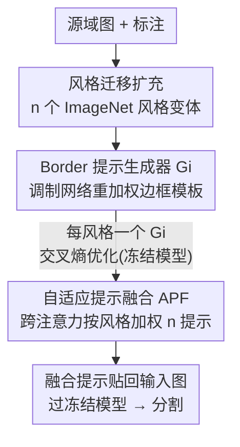

# SAGE: Style-Adaptive Generalization for Privacy-Constrained Semantic Segmentation Across Domains

**会议**: CVPR 2026  
**论文**: [CVF Open Access](https://openaccess.thecvf.com/content/CVPR2026/html/Li_SAGE_Style-Adaptive_Generalization_for_Privacy-Constrained_Semantic_Segmentation_Across_Domains_CVPR_2026_paper.html)  
**代码**: 无  
**领域**: 语义分割 / 域泛化  
**关键词**: 域泛化语义分割, 隐私约束, 视觉提示, 风格迁移, 跨注意力融合

## 一句话总结
针对"分割模型被冻结、不能碰内部参数"的隐私部署场景，SAGE 不微调骨干网络，而是为每种风格学一个生成 border 形视觉提示的生成器，再用跨注意力按输入风格自适应融合这些提示贴回输入图，让冻结模型在五个 DGSS benchmark 上既超越同类隐私方法、又在所有设置下打败全量微调。

## 研究背景与动机
**领域现状**：域泛化语义分割（DGSS）的目标是只在源域训练、却能泛化到天气/光照/城市风貌都不同的未见目标域。当前主流做法是借助 Transformer 等基础模型的强特征能力，**微调一个在大规模数据上预训练好的骨干网络**（如 ISW、SAW、FAMix），通过风格解耦或风格增强来抹掉域相关的风格成分。

**现有痛点**：这些方法都默认一件事——**模型参数可改**。但真实部署里，分割模型常因隐私保护、知识产权、部署安全（IP 加密、沙箱）被**冻结成黑盒**，内部参数根本拿不到，传统的微调/适配直接失效。于是只剩"输入级"这一条路：在不动模型权重的前提下，靠改输入来提升泛化。

**核心矛盾**：冻结模型的"风格不变性"是死的，而目标域的"风格多样性"是活的。已有的外部视觉提示工作（如 Bahng 等、A2XP）虽然只改输入、不碰内部，但它们大多只在单一域上训练，学出来的是一个**风格固定（style-fixed）的提示**——只对和源域长得像的图有效，一换风格就崩。更糟的是提示只在推理时贴上去，没有测试期再优化的机会。

**本文目标**：在不访问模型内部参数的前提下，让冻结分割模型跨域泛化，且要解决两个具体挑战——(1) 参数不可达；(2) 目标域风格高度多样，单一固定提示覆盖不住。

**切入角度**：作者注意到训练时虽然拿不到参数，但**输入端的梯度是可得的**（黑盒可回传到输入），这就给了"只优化输入侧提示"的可行空间；同时单张图往往混合多种风格、且不同内容关注的提示区域也不同，所以提示必须既**多风格**又**随实例自适应**。

**核心 idea**：用风格迁移把源域扩成 n 个风格变体、为每个风格训一个**内容自适应的 border 提示生成器**，推理时用**跨注意力按输入风格动态融合**这些提示贴回输入图——以输入级对齐替代骨干微调。

## 方法详解

### 整体框架
SAGE 要解决的是：给定一个冻结的预训练分割模型 $\Phi$ 和带标注的源域 $D_s=\{(x_i,y_i)\}$，在**不改 $\Phi$ 任何参数/结构**的条件下，让它在未见目标域 $D_t$ 上也能分割准。整条管线分成两段串行的训练阶段，外加一次推理：

第一阶段 **风格提示生成（SPG）**：先用风格迁移把源域图渲染成 n 个不同风格的版本，为每个风格单独训练一个生成器 $G_i$，让它学会针对该风格产出最合适的提示；提示贴到输入图后喂进冻结模型，用分割交叉熵反传来优化 $G_i$（梯度只更新生成器，不碰 $\Phi$）。第二阶段 **自适应提示融合（APF）**：把一张输入图同时过完所有 n 个生成器拿到 n 个提示，再用跨注意力按这张图的风格给每个提示打权重、加权融合成一个统一提示。推理时直接把融合提示贴回未见域的查询图，过冻结模型出分割结果。

### 关键设计

**1. 多风格扩充 + border 形提示生成器：用边框模板编码风格先验，再按内容自适应调制**

针对"目标域风格多样、单提示覆盖不住"的痛点，作者先从 ImageNet 随机采 n 个类别当**风格参考**，用图到图翻译把源图渲染成 n 个风格版本，从而让提示能覆盖更宽的视觉分布。但即使同一风格，不同物体/场景关注的提示区域也不同，所以每个风格不能只给一个死提示。为此每个生成器 $G_i$ 维护一个**可学习的 border 形提示模板** $T_i=\{P_t,P_b,P_l,P_r\}$——可学参数只分布在图像四条边框，中心区域填零。这种"只在边框、中间留白"的结构既能高效编码风格先验，又最小化对原图内容的干扰。

关键在于"自适应"：给定输入图 $X$，一个轻量**调制网络** $M$（由若干带残差的 ModulatorBlock 级联组成，$f_{block}(X;\theta_i)=F(X;\theta_i)+S(X;\phi_i)$，主路 $F$ 是 $BN_2(Conv_2(\sigma(BN_1(Conv_1(X)))))$）逐级扩通道、降分辨率，提取风格相关的高层特征 $X_{mod}\in\mathbb{R}^{B\times D\times \frac{H}{8}\times \frac{W}{8}}$，再经 1×1 卷积 + 全局池化压成一个紧凑表示，重组成四组边框调制系数 $\alpha=[\alpha_t,\alpha_b,\alpha_l,\alpha_r]$。每组系数与对应边框逐元素相乘 $P'_t=P_t\odot\alpha_t$ 等，实现**内容感知的边框调制**——同一风格下也能按当前图的语义增强或抑制特定边框提示。调制后的边框拼上零中心区凑成全尺寸提示，加到 $X$ 上喂冻结模型，用交叉熵 $L_{CE}(\hat M,M)=-\frac{1}{N}\sum_i\sum_c M_{i,c}\log(\hat M_{i,c})$ 训练 $G_i$。消融证实"自适应"是必需的：A-Border / A-Full 都明显优于各自的固定版本，且 A-Border 又优于 A-Full，因为边框提示提供辅助信息的同时最少干扰原图内容。

**2. 自适应提示融合（APF）：跨注意力按输入风格加权组合 n 个提示，tanh 压权防过度自信**

SPG 给了 n 个各擅长一种风格的生成器，但推理时一张未见域图到底该用哪个风格提示是未知的，而且单图常混合多种风格、各占比例不同——手工指定风格不现实。APF 用**跨注意力**自动选择并组合。先对每个提示做 L2 归一化 $P_i=G_i(X)/\|G_i(X)\|_2$，让各提示数值尺度一致、贡献更均衡。再用一个预训练**共享编码器** $E$ 把输入图与各提示投到同一特征空间，配两个独立线性头 $W_x,W_p$ 分别学输入与提示的专用表示；以输入图特征为 Query、提示特征为 Key、提示本身为 Value 算注意力分 $A_i=W_x(E(X))W_p(E(P_i))^T$。最终融合提示为

$$P_{fused}=\sum_{i=1}^{n}\tanh\!\left(\frac{e^{A_i}}{\sum_{j=1}^{n}e^{a_j}}\right)P_i$$

这里 softmax 把注意力分转成概率分布、聚焦最相关的提示；外面再套一层 **tanh 压缩**，防止某个权重逼近 1、模型过度自信地偏向单一提示。值得注意的是，这一阶段**只优化两个线性头**，共享编码器已预训练好保持冻结，保证整体轻量。消融（表 3）显示 PN→+softmax→+tanh 逐级有效（40.63→41.85→42.17→43.90），而单独用 softmax 不归一化反而更差，因为提示尺度不均会扭曲加权求和。

### 损失函数 / 训练策略
两阶段都用分割**交叉熵**作监督。SPG 阶段每个生成器训 10,000 步、batch=2、SGD（momentum 0.9）、初始 lr 1e-4，提示模板 padding=30。APF 阶段共享编码器用 ImageNet 预训练的 ResNet18、加两个线性头，训 40,000 步、batch=2、AdamW、lr 1e-4，单卡 RTX 4090。隐私模型固定为在 ADE20K 上预训练的 SegFormer-B5，全程冻结。提示模板初始化上消融发现 **Meta 初始化**（先在各风格子集上预训练少量步获得基础提示能力，再在 SPG 微调）明显优于 zero/uniform/normal，因为它让提示从语义上有意义的状态出发，收敛更快、更贴合风格特征。

## 实验关键数据

### 主实验
五个数据集：GTAV (G)、SYNTHIA (S) 为合成，Cityscapes (C)、BDD-100K (B)、Mapillary (M) 为真实；三种跨域设置取平均 mIoU(%)。✓ 表示隐私（冻结骨干）方法。

| 设置 | 指标 | Baseline(冻结) | Full Fine-Tuning | A2XP(隐私) | SAGE(隐私) |
|------|------|------|------|------|------|
| G→{C,B,M,S} | Avg mIoU | 36.16 | 39.14 | 29.50 | **42.09** |
| C→{B,M,G,S} | Avg mIoU | 37.56 | 41.07 | 30.96 | 43.90 |
| S→{C,B,M,G} | Avg mIoU | 34.19 | 35.98 | 27.40 | **37.58** |
| — | #可训练参数 | 0.01M | 84.61M | 1.21M | 1.53M |

SAGE 仅用 1.53M 可训练参数（约为全量微调的 1/55），在 G→ 与 S→ 两组取得所有方法最高平均，C→ 组为隐私方法最佳；整体比冻结 baseline 高 3–5%、比同为隐私视觉提示的 A2XP 高约 12–14%，并在三组设置下全部超过全量微调。⚠️ 注：作者注明对比方法成绩部分直接引自前人工作，跨表数值绝对可比性需留意。

### 消融实验（APF 各组件，Cityscapes 源域）
| 配置 | Avg mIoU | 说明 |
|------|---------|------|
| 无任何组件 | 40.63 | APF 裸 baseline |
| + Prompt Norm | 41.85 | L2 归一化让各提示尺度均衡 |
| 仅 Softmax(无归一化) | 40.49 | 尺度不均反而拖累 |
| PN + Softmax | 42.17 | 概率化聚焦最相关提示 |
| PN + Softmax + tanh（Full） | **43.90** | tanh 防过度自信，较裸 baseline +3.27% |

### 关键发现
- **自适应调制是涨点主力**：A-Border / A-Full 均优于固定提示，说明同一风格内不同图也需差异化提示；A-Border 又优于 A-Full，边框形提示在"给信息"和"少干扰原图"间更优。
- **tanh 压权是 APF 的点睛**：单加 tanh 带来 1.73% 增益，防止模型把权重压到单一提示上；而 softmax 离开归一化会因尺度失衡变差。
- **风格注意力确有区分度**：四个风格提示（lakeside/pier/valley/volcano）在不同目标域上注意力分布明显不同，验证了"按域风格自适应选提示"的假设。
- **合成→真实迁移稳健**：S→C 达 40.87%、G→C 达 51.38%，说明输入级风格对齐在大域差下仍保住语义一致性。

## 亮点与洞察
- **把"黑盒约束"当成正式研究设定**：首次在 DGSS 中点明"隐私冻结模型"这一现实场景，并利用"参数不可达但输入梯度可得"的缝隙，把问题彻底搬到输入侧——视角本身就有价值。
- **border 形提示模板很巧**：只在四条边框放可学参数、中心填零，既编码风格先验又几乎不破坏原图内容，是"提示要有效又要少副作用"的优雅折中，可迁移到其他黑盒视觉适配任务。
- **softmax 外再套 tanh 的小 trick**：用一个有界函数压住注意力权重、防止退化成"独宠单一提示"，这种"软化注意力分布以保多样性"的思路在任何多专家/多提示融合里都能复用。
- **两阶段分工 + 只训轻量头**：SPG 学多风格、APF 学如何挑，且融合阶段冻住共享编码器只训两个线性头，把可训练量压到 1.53M 还能超全量微调，参数效率很有说服力。

## 局限与展望
- **依赖外部风格源与超参 n**：风格参考来自随机采样 ImageNet 类别，风格数 n、模板 padding 等需预设，论文未充分讨论 n 取多少最优、风格选择是否敏感。
- **绝对精度仍偏低**：DGSS 任务本身难，最佳平均 mIoU 仍在 37–44% 区间，离实用分割尚远；且部分对比数值引自他文，跨设置绝对可比性有保留。
- **推理需过 n 个生成器**：每张图都要跑完所有 n 个生成器再融合，n 大时推理开销上升，论文未给出延迟/吞吐分析。
- **改进思路**：可探索测试期对融合权重做无监督自适应（当前提示推理时固定），或让风格参考随目标域统计自动挑选而非随机采样。

## 相关工作与启发
- **vs ISW / SAW（风格解耦/增强类 DGSS）**：它们靠白化、随机化在**特征/骨干层面**抹风格，必须能改模型参数；SAGE 完全不碰骨干，只在输入级贴自适应提示，因此能用于冻结黑盒，且以 1.53M 参数超过这些 25M 量级方法。
- **vs A2XP（隐私视觉提示）**：A2XP 同样面向冻结模型、用跨注意力整合多专家提示，但其提示偏 style-fixed 且原为分类设计；SAGE 引入内容自适应的 border 调制 + 多风格扩充，在分割上大幅领先（平均高约 12–14%）。
- **vs VPT / X-Prompt（视觉提示微调）**：这类方法把提示注入模型内部 token/层，需访问并改动架构，在黑盒设定下不可行；SAGE 把提示作为输入图的外部扰动，绕开了对内部结构的依赖。

## 评分
- 新颖性: ⭐⭐⭐⭐ 首次把隐私冻结模型作为 DGSS 正式设定，border 自适应提示 + 跨注意力融合组合新颖。
- 实验充分度: ⭐⭐⭐⭐ 五数据集三种跨域设置 + 组件/初始化/注意力多角度消融，但缺推理开销与风格数敏感性分析。
- 写作质量: ⭐⭐⭐⭐ 动机推导清晰、图示到位，部分公式记号略简。
- 价值: ⭐⭐⭐⭐ 面向真实黑盒部署，参数效率高、思路可迁移到其他冻结模型适配任务。

<!-- RELATED:START -->

## 相关论文

- [\[CVPR 2026\] SAQN: Semantic-based Adaptive Query Network for 3D Referring Expression Segmentation](saqn_semantic-based_adaptive_query_network_for_3d_referring_expression_segmentat.md)
- [\[CVPR 2026\] Heuristic Self-Paced Learning for Domain Adaptive Semantic Segmentation under Adverse Conditions](heuristic_self-paced_learning_for_domain_adaptive_semantic_segmentation_under_ad.md)
- [\[CVPR 2026\] Masked Representation Modeling for Domain-Adaptive Segmentation](mrm_masked_representation_modeling_domain_adaptive.md)
- [\[CVPR 2026\] Mixture of Prototypes for Test-time Adaptive Segmentation](mixture_of_prototypes_for_test-time_adaptive_segmentation.md)
- [\[CVPR 2026\] Generalizable Co-Salient Object Detection via Mixed Content-Style Modulation](generalizable_co-salient_object_detection_via_mixed_content-style_modulation.md)

<!-- RELATED:END -->
