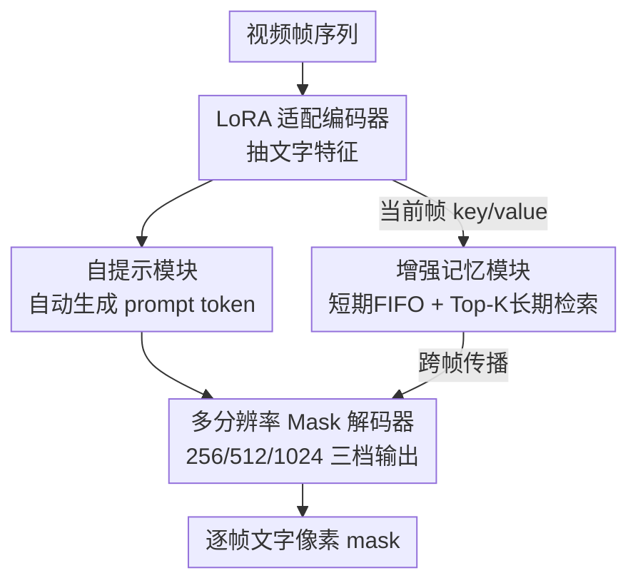

# SAM2Text: Towards Prompt-Free and Multi-Resolution Video Scene Text Segmentation

**会议**: CVPR 2026  
**论文**: [CVF Open Access](https://openaccess.thecvf.com/content/CVPR2026/html/Zhang_SAM2Text_Towards_Prompt-Free_and_Multi-Resolution_Video_Scene_Text_Segmentation_CVPR_2026_paper.html)  
**代码**: https://github.com/insuper-zhang/SAM2Text/  
**领域**: 视频理解 / 语义分割  
**关键词**: 视频场景文字分割, SAM2, 自提示, 多分辨率解码, 记忆机制

## 一句话总结
把 SAM2 系统性改造成专做视频场景文字分割（video STS）的 SAM2Text：用 LoRA 让编码器学到文字特征、加一个自提示模块去掉外部 prompt、给解码器补 512/1024 高分辨率分支保住笔画细节、再用「短期 FIFO + Top-K 长期检索」的双层记忆稳住跨帧抖动，并配套发布两个像素级视频文字数据集（STS-SynthV / STS-RealV），在图像和视频多个基准上都刷到 SOTA。

## 研究背景与动机
**领域现状**：场景文字分割（Scene Text Segmentation, STS）在图像上已经做得不错，从 CNN 系（DeepLabV3、HRNet、TexRNet）到 Transformer 系（SegFormer、TFT、EAFormer），再到把 SAM 扩成分层文字分割的 Hi-SAM，像素级精度一路往上走。视频侧则有 SAM2 这种自带流式处理 + 分层记忆的视频分割基座。

**现有痛点**：把图像 STS 方法直接搬到视频会同时撞上三堵墙——① 现有文字分割模型在复杂真实场景（多变字体、版式、背景干扰）下泛化不够；② 绝大多数 SOTA 是为单图设计的，没法以流式方式高效吃连续帧，满足不了延迟要求；③ 缺乏抑制 mask 闪烁/抖动的机制，跨帧时间一致性差。而 SAM2 虽然天生支持视频，但它是类别无关、通用分割的，对文字这种细笔画结构既不敏感、输出分辨率又只有 256×256，细节糊掉；并且它依赖外部 prompt，没法 prompt-free 自动跑。

**核心矛盾**：SAM2 的「通用视频分割能力（流式 + 记忆）」和「文字分割的特殊需求（细结构、高保真、prompt-free、时序稳）」之间存在领域鸿沟——直接用泛化能力在，但文字精度上不去；为文字重训又会丢掉 SAM2 宝贵的流式与记忆特性。另外这个方向还有个底层障碍：视频文字**像素级**标注数据几乎是空白（现有视频文字数据集只有 word-level 框，没有 mask）。

**本文目标**：在尽量保留 SAM2 原生流式/记忆优势的前提下，分别补齐「文字特征、自动提示、细节分辨率、时序稳定」四块短板，并造出能训练/评测的像素级视频文字数据集。

**切入角度**：不另起炉灶，而是把 SAM2 当骨干做**外科手术式**的最小侵入改造——冻结主干、只在关键位置插轻量模块，这样既省训练成本又不破坏流式推理。

**核心 idea**：用 LoRA + 自提示 + 多分辨率解码 + 增强记忆四个组件，把通用的 SAM2 "调教" 成 prompt-free、保细节、时序稳的视频文字分割专家。

## 方法详解

### 整体框架
SAM2Text 在 SAM2 的四大件（ViT 图像编码器、prompt 编码器、mask 解码器、记忆模块）基础上动了四处刀。输入是视频帧序列，输出是每一帧中每个文字实例的高分辨率像素 mask，且全程不需要人给框/点。

整条管线这样转：每帧先过 **LoRA 适配的图像编码器** 抽出带文字偏好的特征；这份特征喂给 **自提示模块**，模块自己生成一组稀疏 prompt token（取代外部 prompt）；prompt token 和图像特征一起进 **多分辨率 mask 解码器**，并行吐出 256/512/1024 三档 mask logits，高档分支专门保住笔画边缘；同时当前帧的 key/value 进 **增强记忆模块**，由「短期 FIFO 缓存 + 长期 Top-K 检索」组成的有效记忆集对解码做跨帧 cross-attention，把上一帧的 mask 稳稳传播到当前帧。系统支持两种模式：AMG（Automatic Mask Generation，全帧自动分割）和 PS（Promptable Segmentation，交互式），端到端在 STS-SynthV / STS-RealV 上训练。

### 关键设计

**1. LoRA 域适配编码器：让通用 SAM2 学会"看文字"，又不丢流式能力**

SAM2 编码器是类别无关的通用分割器，对文字这种细长笔画结构建模不足；但如果全量微调，训练成本高还会破坏它原生的流式推理。作者用 LoRA 做参数高效适配：对线性层 $y = Wx$ 加一个低秩增量，变成 $y = Wx + \Delta W x$，其中 $\Delta W = \frac{\alpha}{r} BA$，$A \in \mathbb{R}^{r \times d_{in}}$、$B \in \mathbb{R}^{d_{out} \times r}$ 是可训练低秩矩阵，$r$ 为秩、$\alpha$ 为缩放系数。初始化上 $A$ 用 Kaiming 均匀分布、$B$ 置零，保证训练初期输出与原模型一致（增量从 0 开始长）；输入加 0.1 dropout 防过拟合。插入位置很讲究：注意力分支里给 Q/K/V 投影和输出投影都加 adapter，去调制特征相关性建模；FFN 分支里给 MLP 两个线性层都加，专门增强对**局部笔画纹理和细长几何结构**的提取。原始权重全程冻结，只有低秩参数回传梯度。这样改的好处是：文字精度提上来，同时 SAM2 的流式推理一字未动。

**2. 自提示模块：去掉外部 prompt，自动把注意力压到文字区域**

SAM2 要靠外部 prompt 才能分割，无法在视频里自动地全帧找文字。本模块让模型自己生成 prompt。先用四级**深度可分离卷积**对编码特征 $F \in \mathbb{R}^{B \times C \times H \times W}$ 生成空间注意力图 $S = \mathrm{Sigmoid}(D_4(D_3(D_2(D_1(F)))))$，每级 $D_i$ 是 3×3 depthwise + 1×1 pointwise，省参数又保住感受野。$S \in \mathbb{R}^{B \times L \times H \times W}$（$L$ 是 prompt 长度）作为权重对图像特征做空间加权平均，得到稀疏 prompt token：$P_{b,l,:} = \frac{1}{H \cdot W} \sum_{h}\sum_{w} S_{b,l,h,w} F_{b,:,h,w}$。再对原特征做一次 $F' = \mathrm{GELU}(\mathrm{Conv2D}(F))$ 强化边缘/笔画等局部纹理作为细粒度先验。最后用**双路注意力协同**精炼 prompt：先自注意力建模 token 间长程依赖 $P' = \mathrm{LayerNorm}(P + \mathrm{Dropout}(\mathrm{SelfAttn}(P)))$，再让增强特征 $F'$ 序列化后做交叉注意力 $P'' = \mathrm{LayerNorm}(P' + \mathrm{Dropout}(\mathrm{CrossAttn}(P', F')))$。产出的 $P''$ 作为高质量提示送入解码，等于模型"自己给自己画提示框"，实现真正 prompt-free。

**3. 多分辨率 Mask 解码器：用并行高分辨率分支保住笔画细节**

SAM2 解码器只出 256×256，文字这种小字符、细笔画一糊就丢。作者在原解码器上扩出两条额外分支。设 Transformer 解码输出 $F^{dec} \in \mathbb{R}^{C \times H \times W}$（$H=W=64$），先经两级转置卷积上采到 256×256 的共享基特征 $F^{dec}_{256}$；中分辨率分支再上采一步到 512×512 得 $F^{dec}_{512}$；高分辨率分支在此基础上再上采到 1024×1024 并接一串 3×3 卷积细化，得 $F^{dec}_{1024}$。每级上采后接 LayerNorm2d + GELU 保训练稳。mask 生成用**超网络**机制：给定 mask token $t$，每个尺度专属 MLP $g_s(\cdot)$ 动态生成卷积权重 $w_s = g_s(t)$，mask logits 由特征图与动态权重内积得到 $M_s(x,y) = \langle w_s, F^{dec}_s(x,y)\rangle$，$s \in \{256,512,1024\}$。训练时 256/512 分支支持多 mask 输出，1024 分支默认用主 mask token 出单张高分辨率预测，在算力和质量间折中。这条设计直接把文字轮廓的高保真度补回来。

**4. 双层增强记忆（短期 FIFO + Top-K 长期检索）：稳住时序又不让记忆随帧数线性膨胀**

传统记忆机制存下所有历史帧的 key-value，显存随视频长度线性涨；而视频文字又必须时序一致才不闪烁。本模块拆成两块：**短期记忆** $M_s$ 用 FIFO 维护最近 $L$ 帧的 key-value，$M^t_s = \mathrm{FIFO\text{-}Update}(M^{t-1}_s, k_t, v_t, L)$，超过 $L$ 就丢最老的，专管局部时序连续性；**长期记忆池** $M_g$ 存更早帧的紧凑表示、容量有界。检索时给历史条目打分 $r_j = \cos(q_t, k_j) + \lambda \cdot \mathrm{qual}_j$，既看当前帧 query 与历史 key 的余弦相似度、又加权历史条目的质量分 $\mathrm{qual}_j$（$\lambda$ 平衡），取 Top-K 得 $M^t_h = \mathrm{TopK}(M_g, r, K)$。最终 cross-attention 只在有效记忆集 $U_t = M^t_s \cup M^t_h$ 上做标准注意力 $\mathrm{Attention}(Q,K,V) = \mathrm{Softmax}(\frac{QK^\top}{\sqrt{d_k}})V$。这把注意力代价从 $O(T)$ 降到 $O(L+K)$，长视频里既保住有用的长程上下文、又显著压住 mask 闪烁抖动。

### 损失函数 / 训练策略
模型基于 SAM2 架构端到端训练。LoRA 秩 16、$\alpha=32.0$，加在注意力的 QKV 投影与交叉注意力层。用 AdamW 训 80 epoch，学习率 3e-5、batch size 1，bfloat16 混合精度。数据增强用随机水平翻转、仿射变换、颜色抖动、灰度化。帧 resize 到 1024×1024，按 8 帧一段处理；合成与真实视频数据分开训练。

## 实验关键数据

### 主实验

图像基准（Total-Text / TextSeg，per-image 计算 fgIOU 与 F-score）：

| 数据集 | 指标 | SAM2Text | Hi-SAM（之前最佳） | 提升 |
|--------|------|----------|----------|------|
| Total-Text | fgIOU | **85.50** | 84.59 | +0.91 |
| Total-Text | F-score | **89.84** | 88.69 | +1.15 |
| TextSeg | fgIOU | **89.52** | 88.96 | +0.56 |
| TextSeg | F-score | **94.33** | 93.87 | +0.46 |

视频基准（STS-SynthV / STS-RealV，全局聚合计算）：

| 数据集 | 指标 | SAM2Text | Hi-SAM | SAM2.1 原版 | 对 Hi-SAM 提升 |
|--------|------|----------|--------|------------|------|
| STS-SynthV | fgIOU | **93.25** | 91.67 | 90.85 | +1.58 |
| STS-SynthV | F-score | **94.83** | 94.15 | 93.52 | +0.68 |
| STS-RealV | fgIOU | **80.71** | 78.34 | 77.45 | +2.37 |
| STS-RealV | F-score | **87.45** | 85.92 | 84.98 | +1.53 |

值得注意：原版 SAM2.1 在视频文字任务上反而打不过专为文字设计的 Hi-SAM（STS-RealV 上 77.45 vs 78.34 fgIOU），说明通用视频分割基座虽稳，但不做文字专门适配就上不了天花板。SAM2Text 相对 SAM2.1 在合成/真实上分别 +2.40 / +3.26 fgIOU。

### 消融实验
在 STS-RealV 上从 SAM2.1 baseline 逐组件累加（baseline、+LoRA、+自提示这几行用 GT 框作 oracle prompt，完整模型则在自动 prompt-free 设置下评测）：

| 配置 | fgIOU(%) | F-score(%) | 说明 |
|------|---------|-----------|------|
| SAM2.1 Baseline | 77.45 | 84.98 | 起点 |
| + LoRA 适配 | 78.92 | 86.23 | fgIOU +1.47，文字域适配贡献最大 |
| + 自提示模块 | 79.64 | 86.87 | fgIOU +0.72，无外部引导自动出提示 |
| + 多分辨率解码 | 80.15 | 87.21 | fgIOU +0.51，保细节 |
| + 增强记忆模块 | 80.71 | 87.45 | fgIOU +0.56，补齐时序稳定 |

### 关键发现
- **LoRA 适配贡献最大**：单组件就贡献 +1.47 fgIOU，印证"先把通用模型拉进文字域"是最关键的一步；其余三个组件分别再补 +0.72 / +0.51 / +0.56，累加 +3.26 fgIOU。
- 四个组件分别针对不同子问题（特征/提示/细节/时序），累加是协同增益而非简单相加，说明拆解方向选对了。
- 真实视频（STS-RealV）比合成视频（STS-SynthV）难得多（80.71 vs 93.25 fgIOU），且 SAM2Text 在真实视频上对 Hi-SAM 的领先更大（+2.37 vs +1.58），说明专门适配在 domain gap 大的真实场景更吃香。

## 亮点与洞察
- **"最小侵入改造基座"的范式很实用**：冻结 SAM2 主干、只在 Q/K/V/FFN 插 LoRA，既保住流式推理这一原生杀手锏、又省训练成本，这套"保留基座优势 + 补领域短板"的思路可迁移到任何想把 SAM2 适配到细分领域（医学、遥感、文档）的任务。
- **自提示模块把"prompt-free"落到实处**：用深度可分离卷积生成空间注意力 → 加权平均成稀疏 token → 双路注意力精炼，等于让模型自己产出 SAM 风格的 prompt，省掉外部依赖，这个"自造提示"模块设计可复用到其他需要 prompt-free 的 SAM 衍生任务。
- **双层记忆把复杂度从 $O(T)$ 压到 $O(L+K)$**：短期 FIFO 抓连续性 + 长期 Top-K（相似度 + 质量分双权重）抓长程上下文，是长视频时序一致性与显存可控之间一个很干净的折中方案。
- **数据贡献本身就是硬通货**：在视频文字像素标注几乎空白的背景下，造出 1,410 段合成（STS-SynthV）+ 660 段真实（STS-RealV，含中/英/中英混）像素级数据集，填了实打实的空白。

## 局限与展望
- 真实视频上 fgIOU 仅 80.71，离图像基准（85~89）还有不小差距，复杂真实场景（密集小字、强背景干扰、剧烈运动）仍是瓶颈。
- 消融表里 baseline / +LoRA / +自提示这几行用了 **GT 框作 oracle prompt**，而完整模型是 prompt-free，二者评测协议不完全对齐，单看逐行增量需注意这个 caveat（⚠️ 以原文为准，原文已在表注里说明）。
- 自提示模块的 prompt 长度 $L$、记忆的 $L$/$K$/$\lambda$ 等超参对性能与显存的敏感性，文中未给系统性扫描，实际部署时可能需要按视频长度/场景调。
- 真实数据靠 CHSAM 半自动 + 人工 Photoshop 精修 + 多轮迭代生成，pipeline 重、扩展到更大规模成本高。

## 相关工作与启发
- **vs Hi-SAM**：Hi-SAM 把 SAM 扩成分层文字分割但本质是图像级方法，搬到视频要逐帧独立处理、无时序传播；SAM2Text 直接基于自带记忆的 SAM2，原生支持流式 + 跨帧传播，在视频基准上全面领先（STS-RealV +2.37 fgIOU）。
- **vs 原版 SAM2.1**：SAM2.1 通用视频分割强但类别无关、只出 256 分辨率、依赖外部 prompt，在视频文字任务上甚至输给图像专用的 Hi-SAM；SAM2Text 用 LoRA + 自提示 + 多分辨率 + 增强记忆四件套补齐文字短板，相对 SAM2.1 真实数据上 +3.26 fgIOU。
- **vs 其他 SAM2 适配工作（SurgicalSAM2 / SAM2Long / SAMURAI 等）**：它们多面向通用物体跟踪或医学影像，没碰文字特有的细结构保真、复杂场景稳定跟踪、prompt-free 这几个难点；本文是 SAM2 生态里第一个系统性面向视频文字的适配。
- **vs FlowText**：FlowText 是合成视频文字的开创性工作但只产 word-level 框；本文改造其合成 pipeline 输出像素级 mask（STS-SynthV），把它从检测数据升级到分割数据。

## 评分
- 新颖性: ⭐⭐⭐⭐ 首个面向视频场景文字分割的 SAM2 系统性适配，四组件组合清晰但每个单独看较为常规（LoRA/自注意力提示/多分辨率/记忆检索均有先例）。
- 实验充分度: ⭐⭐⭐⭐ 图像+视频多基准、逐组件消融齐全，但消融协议（oracle prompt vs prompt-free 混用）与超参敏感性分析略欠。
- 写作质量: ⭐⭐⭐⭐ 结构清晰、公式完整、动机推导顺畅。
- 价值: ⭐⭐⭐⭐⭐ 既给框架又补上像素级视频文字数据集这块空白，对后续视频文字理解研究有实打实的资源价值。

<!-- RELATED:START -->

## 相关论文

- [\[CVPR 2026\] V²-SAM: Marrying SAM2 with Multi-Prompt Experts for Cross-View Object Correspondence](v2-sam_marrying_sam2_with_multi-prompt_experts_for_cross-view_object_corresponde.md)
- [\[CVPR 2026\] Test-Time Multi-Prompt Adaptation for Open-Vocabulary Remote Sensing Image Segmentation](test-time_multi-prompt_adaptation_for_open-vocabulary_remote_sensing_image_segme.md)
- [\[CVPR 2026\] SPOT: Spatiotemporal Prompt Optimization for Motion-Stabilized MLLM-Guided Video Segmentation](spot_spatiotemporal_prompt_optimization_for_motion-stabilized_mllm-guided_video_.md)
- [\[CVPR 2026\] M4-SAM: Multi-Modal Mixture-of-Experts with Memory-Augmented SAM for RGB-D Video Salient Object Detection](m4-sam_multi-modal_mixture-of-experts_with_memory-augmented_sam_for_rgb-d_video_.md)
- [\[CVPR 2026\] Training-Free Open-Vocabulary Camouflaged Object Segmentation via Fine-Grained Object Binding and Adaptive Hybrid Prompt](training-free_open-vocabulary_camouflaged_object_segmentation_via_fine-grained_o.md)

<!-- RELATED:END -->
