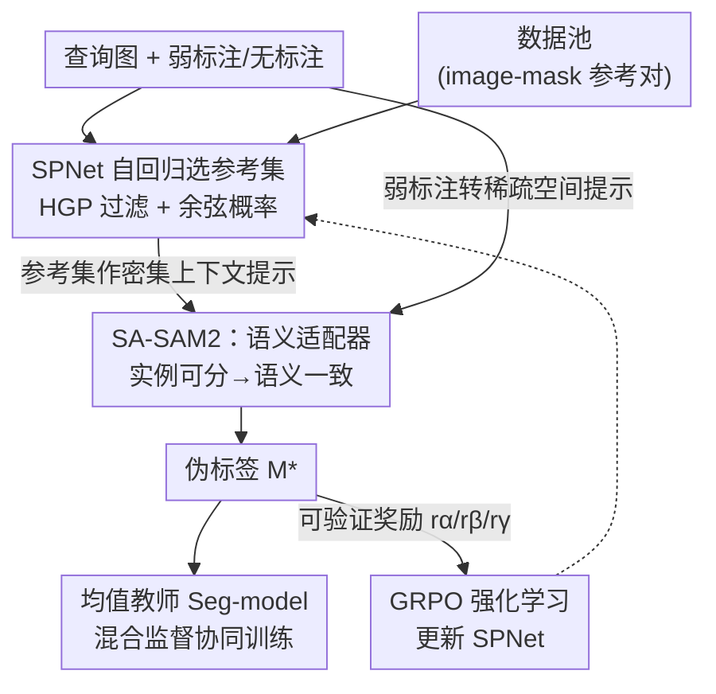

# SAMIX: Reinforcing SAM2 with Semantic Adapter and Reference Selecting Policy for Mix-Supervised Segmentation

**会议**: CVPR 2026  
**论文**: [CVF Open Access](https://openaccess.thecvf.com/content/CVPR2026/html/Hu_SAMIX_Reinforcing_SAM2_with_Semantic_Adapter_and_Reference_Selecting_Policy_CVPR_2026_paper.html)  
**代码**: https://github.com/Huster-Hq/SAMIX  
**领域**: 语义分割  
**关键词**: 混合监督分割, SAM2, 语义适配器, 强化学习, 伪标签生成

## 一句话总结
SAMIX 把 SAM2 的视频"实例追踪"记忆机制改造成跨图像的"语义追踪"，用一个轻量语义适配器 + 强化学习训练的参考选择网络，为每张弱标注/无标注图像挑出一组同语义参考图作为密集上下文提示，生成高质量伪标签来统一监督混合标注（mask/box/scribble/point/class/无标注）训练，在 VOC、Cityscapes、伪装目标检测、息肉分割四个数据集上全面 SOTA。

## 研究背景与动机
**领域现状**：像素级标注昂贵，半监督/弱监督分割（box、scribble、point、class 标签）被广泛研究。更进一步的混合监督（mix-supervised）希望把多种异构标注塞进一个统一框架训练。近期一类强方法直接把 SAM/SAM2 当伪标签生成器——把弱标注当作稀疏空间提示（点/框）喂给 SAM 生成伪 mask。

**现有痛点**：这条路有两个硬伤。其一，在边界模糊的场景（医学病灶、伪装目标），仅靠稀疏空间提示根本框不准目标；其二，完全没有空间标注的图像（class 标签、无标注）因为给不出 prompt 而被直接排除在训练之外，数据利用率低。更深一层，无论优化式还是 SAM 式方法，都**孤立地学每个样本**，忽视了跨异构数据协同学习的潜力。

**核心矛盾**：稀疏空间提示信息量不够，但 SAM 这类提示式模型又离不开 prompt。要让无 prompt 的数据也能被 SAM2 用起来，必须引入一种新的提示形式——**密集上下文提示**，即用"一组同语义、带可靠 mask 的参考图"来引导分割，而不只靠当前图自己的几个点/框。

**切入角度**：作者注意到 SAM2 的 memory 机制天生支持上下文学习——原版用它在视频帧间存历史信息做实例追踪。那么能不能把"帧间实例追踪"重新解释为"图间语义追踪"，用 memory 存同语义的 image–mask 参考对？但有个障碍：vanilla SAM2 的特征是为区分实例而学的（instance-distinct），同类不同实例的特征并不一致，直接拿来做跨图语义匹配会失效。

**核心 idea**：用一个轻量语义适配器把 SAM2 特征从"实例可分"扭转为"语义一致"（得到 SA-SAM2），再用一个强化学习训练的参考选择网络 SPNet 为每张查询图主动挑出能最大化伪标签质量的参考组合，从而让弱标注甚至无标注数据都能产出可靠伪标签。

## 方法详解

### 整体框架
SAMIX 由三个部件协同：**SA-SAM2**（语义适配后的 SAM2，做伪标签生成器）、**SPNet**（参考选择策略网络）、**Seg-model**（均值教师分割模型）。每来一张查询图（带任意类型或无标注），SPNet 从存了全部已标注/已伪标注样本的数据池里，自回归地挑出一组同语义参考图；这组参考图经 SAM2 记忆编码器编成参考嵌入 $\mathcal{S}_{ref}$，作为**密集上下文提示**；查询图特征 $\mathbf{F}$（经语义适配器调整后）通过记忆注意力 $\mathtt{MemAtt}(\mathbf{F}, \mathcal{S}_{ref})$ 吸收这些上下文，再可选地融合弱标注转成的稀疏空间提示 $\mathbf{P}$，由 mask decoder 解码出分割 mask 与置信度：

$$\mathcal{M}, s = \mathtt{MaskDec}\big(\mathtt{MemAtt}(\mathbf{F}, \mathcal{S}_{ref}), \mathbf{P}\big)$$

生成的高质量伪标签再去监督 Seg-model；而 SPNet 本身没有 GT 可学，作者把"选参考"建模成强化学习问题，用可验证奖励驱动训练。整个框架里 SAM2 全部冻结，只训语义适配器和 SPNet。

### 关键设计

**1. 语义适配器：把 SAM2 从实例追踪改造成语义追踪（SA-SAM2）**

vanilla SAM2 的图像编码器（Hiera，4 阶段层级 ViT）是为视频里区分不同实例而训练的，提出的特征"实例可分"——同一类的不同实例特征差异大，因此查询图特征 $\mathbf{F}$ 和参考嵌入 $\mathcal{S}_{ref}$ 不在同一语义空间，记忆注意力 $\mathtt{MemAtt}(\mathbf{F}, \mathcal{S}_{ref})$ 会失真。作者在每个 ViT block 的 MLP 旁以残差方式插入一个 AdaptFormer 适配器（下投影—ReLU—上投影），把特征朝语义级对齐方向微调：

$$\tilde{x} = \mathtt{ReLU}(x \cdot \mathbf{W}_{down}) \cdot \mathbf{W}_{up}$$

其中 $\mathbf{W}_{down}\in\mathbb{R}^{d\times\hat{d}}$、$\mathbf{W}_{up}\in\mathbb{R}^{\hat{d}\times d}$，且 $\hat{d}\ll d$（取 384）保证参数高效（仅 ~10M 可训练参数）。这一步是整个框架成立的地基——只有特征语义一致了，"同语义的参考图当密集提示"这件事才有意义，所以消融里单加 SPNet 而不加适配器收益很小（见下）。值得注意的是，SAM2 冻结、仅靠轻量适配器就能激活其语义一致表征能力，说明这种能力本就潜藏在 SAM2 里。

**2. SPNet：自回归地为每张查询图挑参考集**

光有语义一致的特征还不够，"给哪几张参考图"直接决定伪标签质量。作者先按**层级引导原则 HGP（Hierarchical Guidance Principle）**缩小候选：只保留监督强度比查询图更细的样本（如查询是 point 标注，候选只取 mask/box/scribble 标注的样本），直觉是"标注更细的样本 mask 更可靠、更适合当老师"，从而让强监督样本去引导弱监督样本、实现跨异构数据的协同。数据池里每个样本存一对表示 $\{E, e\}$：空间记忆嵌入 $E$ 和紧凑语义嵌入 $e=\mathtt{AvgPool}(E)+\mathtt{MaskPool}(E,M)$。SPNet 是一个两阶段 Transformer：编码器先对候选嵌入建模全局关系，解码器以查询图嵌入 $f=\mathtt{AvgPool}(\mathbf{F})$ 初始化，**自回归**地逐步预测 $T$ 个选择 token（每步都看已选的参考，避免冗余、追求互补）；第 $t$ 步对候选 $k$ 的选择概率按余弦相似度归一化：

$$p_{t,k} = \frac{\cos(\mathbf{d}_t, \mathbf{e}_k)}{\sum_{k=1}^{K}\cos(\mathbf{d}_t, \mathbf{e}_k)}$$

与基于固定规则（RGB/DINO/特征相似度）独立选样本相比，自回归建模捕捉了样本间互补关系，挑出的参考组合更多样也更有信息量。

**3. 可验证奖励 + GRPO：用强化学习训练 SPNet**

SPNet 没有 GT 标签可监督，作者把"选参考"当成策略学习，用 GRPO（group relative policy optimization）训练。每次用随机束搜索（stochastic beam search）从 SPNet 采样 $N$ 组多样的参考集 $\{\mathcal{S}_{ref,i}\}$，每组送进 SA-SAM2 得到 mask $M_i$ 和置信度 $s_i$，再用三类**可验证奖励**打分：质量奖励 $r_{\alpha,i}=s_i$（置信度），一致性奖励 $r_{\beta,i}=\mathrm{Dice}(M_i, M^*_{seg})$（与 Seg-model 输出的 Dice），监督奖励 $r_{\gamma,i}=-L_{typ}(M_i, Y_{typ})$（与可得弱标注的监督损失，无标注图忽略）。每类奖励在组内做标准化后相加得优势 $A_i = A_{\alpha,i}+A_{\beta,i}+A_{\gamma,i}$，再按 GRPO 的裁剪目标更新策略。最后选优势最高的那组产出最终伪标签 $\mathcal{M}^*=\mathcal{M}_{i^*},\ i^*=\arg\max_i A_i$，并重新编码成记忆嵌入动量更新进数据池。这套"采样—评估—择优"让 SPNet 主动探索能最大化伪标签质量的参考组合，而不是套用启发式规则。

**4. 均值教师协同训练，串起混合监督**

SA-SAM2 的伪标签需要落到一个真正的分割模型上。作者用均值教师范式把 Seg-model 与 SA-SAM2/SPNet 协同训练：Seg-model 对增强视图预测 $M^*_{seg}$，其 EMA 副本对原图产出 $M_{seg}$。Seg-model 受三类损失约束——按标注类型定制的监督损失 $L_{typ1}$（class/无标注样本跳过）、$M^*_{seg}$ 与 $M_{seg}$ 一致性正则 $L_{reg}$、以及 SA-SAM2 伪标签 $M^*$ 提供的伪标签损失 $L_{pseudo}$（mask 样本跳过）；同时语义适配器也被 $L_{pseudo}$ 和监督损失反向优化。Seg-model 的输出又回流成 SPNet 一致性奖励 $r_\beta$ 的参照，形成"伪标签更好→Seg-model 更好→奖励更准→参考选得更好"的闭环。这种 plug-and-play 设计使 SAMIX 能接任意分割模型（论文用 Mask2Former / Polyp-PVT / PFNet）。

### 损失函数 / 训练策略
SAM2 全冻结，仅训语义适配器（AdaptFormer，~10M 参数）与 SPNet；AdamW，学习率 $1\times10^{-4}$；参考集长度 $T=4$，GRPO 采样数 $N=4$，适配器投影维 $\hat{d}=384$；SPNet 编解码各 3 层 Transformer；4×NVIDIA 4090 训练。

## 实验关键数据

### 主实验
四个数据集（VOC 2012、Cityscapes、伪装目标 COD 的 CAMO/COD10K、息肉 IPS），统一数据设置下（mask/box/scribble/point/class/无标注全用）SAMIX 全面 SOTA，且在仅 5% 全标注下逼近全监督上界。

| 数据集 / 指标 | 全监督上界 | MixSegNet | SAM-COD | WISH | **SAMIX** |
|--------|------|------|------|------|------|
| VOC val mIoU ↑ | 77.3 | 68.0 | 71.3 | 71.8 | **75.9** |
| Cityscapes mIoU ↑ | 79.4 | 72.0 | 74.5 | 75.0 | **78.3** |
| COD10K $S_m$ ↑ | 80.0 | 73.1 | 76.4 | 75.0 | **79.1** |
| COD10K $M$ ↓ | 4.0 | 6.8 | 5.0 | 5.4 | **4.1** |
| IPS mDice ↑ | 83.3 | 72.5 | 75.9 | 76.6 | **80.1** |

（统一设置下相比次优 WISH，VOC +4.1、Cityscapes +3.3 mIoU；在 class/无标注样本上对 MixSegNet 领先 8.4%，即 71.1 vs 62.7。）

### 消融实验
两大组件缺一不可，且二者强互补（COD10K 用 $S_m$）：

| Adapter | SPNet | VOC mIoU | Cityscapes mIoU | COD10K $S_m$ |
|------|------|------|------|------|
| ✘ | ✘ | 66.5 | 69.3 | 71.8 |
| ✔ | ✘ | 72.5 | 75.7 | 75.3 |
| ✘ | ✔ | 68.7 | 71.0 | 73.9 |
| ✔ | ✔ (SAMIX) | **75.9** | **78.3** | **79.1** |

参考选择策略对比（SPNet vs 启发式），以及 HGP / 动量更新（MU）的增量：

| 选择策略 | VOC mIoU | Cityscapes mIoU | COD10K $S_m$ |
|------|------|------|------|
| Random | 70.4 | 73.6 | 72.9 |
| Similarity (DINO) | 72.0 | 75.2 | 75.9 |
| Similarity sim(F,E) | 72.7 | 75.8 | 77.0 |
| SPNet w/o HGP | 74.4 | 77.0 | 78.2 |
| SPNet w/o MU | 75.3 | 77.9 | 78.4 |
| **SPNet (Ours)** | **75.9** | **78.3** | **79.1** |

三类奖励逐步叠加（$r_\alpha\to r_\alpha r_\beta\to$ 全部），VOC mIoU 73.5→75.0→75.9，三者协同增益。

### 关键发现
- **语义适配器是地基**：单加 SPNet（68.7）几乎追不上单加适配器（72.5），因为特征若仍"实例可分"，再会选参考也匹配不上；两者合起来才有 75.9 的跃升。
- **学到的选择 > 任何启发式**：即便是最强的启发式（query 特征与记忆嵌入相似度 sim(F,E) 72.7）也明显落后 SPNet（75.9），印证"独立选样本、忽略样本间关系"的局限。
- **适配器选型**：AdaptFormer 以最少参数（10M）取得最佳（VOC 75.9），优于 Naive Adapter/LoRA/Med-SA，侧面说明 SAM2 的语义一致能力只需轻量激活。
- **数据利用率**：在 class/无标注这类原本 SAM 式方法用不上的数据上提升最显著，验证"密集上下文提示"补上了"无 prompt 数据"的短板。

## 亮点与洞察
- **机制复用的巧思**：把 SAM2 为视频实例追踪设计的 memory 机制，原封不动地复用为"跨图语义追踪"，只用一个轻量适配器扭转特征语义——这是"老模块新解释"的典范，几乎零额外结构代价。
- **密集上下文提示这个概念**：跳出"必须给点/框"的 prompt 思维，改用"一组同语义参考图"当提示，直接解锁了无标注数据，思路可迁移到任何 SAM 系弱监督任务。
- **用 RL 解"无 GT 的检索"**：参考选择没有监督信号，作者用可验证奖励（置信度 + Dice + 监督损失）+ GRPO 把它变成可学策略，这套"verifiable reward"配方对各种"挑数据/挑样本"的子问题都通用。
- **闭环自提升**：伪标签质量、Seg-model 质量、奖励准确度、参考选择质量四者互相拉动，形成正反馈。

## 局限与展望
- 作者承认：SA-SAM2 和 SPNet 在特定数据集上训练后**跨域泛化有限**，需要扩大训练数据规模才能缓解。
- 自己观察：流程偏重——每张查询图都要 GRPO 采样 $N$ 组参考、各跑一次 SA-SAM2 推理来算奖励，训练开销不低；论文未报训练时长/显存代价。
- 数据池存全部样本的 $\{E,e\}$，数据规模放大时检索与存储成本如何 scale 未充分讨论。
- HGP 假设"标注更细=mask 更可靠"，但若细标注本身有噪声，层级引导可能反向传播错误，论文未做鲁棒性分析。

## 相关工作与启发
- **vs SAM-COD / WISH（SAM 式混合监督）**：它们只用 SAM 的稀疏空间提示、孤立地处理每个样本；SAMIX 引入密集上下文提示 + 跨样本协同，弥补了无 prompt 数据无法训练、模糊边界框不准两大短板，统一设置下全面领先。
- **vs MixSegNet / MixPolyp（优化式混合监督）**：它们靠为每种标注定制损失联合优化；SAMIX 走"统一伪标签生成器"路线，把异构标注都转成 mask 监督信号，灵活性与数据利用率更高。
- **vs 纯相似度检索（DINOv2 / RGB / sim(F,E)）**：这些是启发式、独立选样本；SPNet 用自回归 + RL 建模选择间关系并直接优化伪标签质量，是"可学检索"对"规则检索"的升级。

## 评分
- 新颖性: ⭐⭐⭐⭐⭐ 把 SAM2 视频记忆复用为跨图语义追踪，并用可验证奖励 RL 解参考选择，视角新颖且自洽
- 实验充分度: ⭐⭐⭐⭐⭐ 4 数据集 + 多套监督配置 + 组件/选择策略/奖励/适配器四组消融，证据扎实
- 写作质量: ⭐⭐⭐⭐ 动机—矛盾—方法链条清晰，但部分符号（$L_{typ}$ 各变体）需查附录
- 价值: ⭐⭐⭐⭐⭐ 显著提升异构标注数据利用率，plug-and-play 可接任意分割模型，落地价值高

<!-- RELATED:START -->

## 相关论文

- [\[ICCV 2025\] Correspondence as Video: Test-Time Adaption on SAM2 for Reference Segmentation in the Wild](../../ICCV2025/segmentation/correspondence_as_video_test-time_adaption_on_sam2_for_reference_segmentation_in.md)
- [\[CVPR 2026\] Reinforcing Video Object Segmentation to Think before it Segments](reinforcing_video_object_segmentation_to_think_before_it_segments.md)
- [\[CVPR 2026\] Frequency-Aware Affinity for Weakly Supervised Semantic Segmentation](frequency-aware_affinity_for_weakly_supervised_semantic_segmentation.md)
- [\[CVPR 2026\] Leveraging Class Distributions in CLIP for Weakly Supervised Semantic Segmentation](leveraging_class_distributions_in_clip_for_weakly_supervised_semantic_segmentati.md)
- [\[CVPR 2026\] From Softmax to Dirichlet: Evidential Learning for Semi-supervised Semantic Segmentation](from_softmax_to_dirichlet_evidential_learning_for_semi-supervised_semantic_segme.md)

<!-- RELATED:END -->
