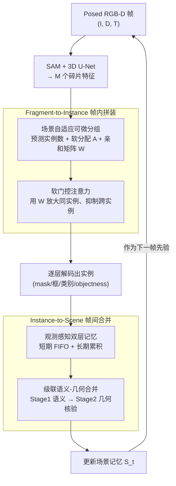

# SAMosaic3D: Modular Scene Assembly for Real-Time 3D Segment Anything

**会议**: CVPR 2026  
**论文**: [CVF Open Access](https://openaccess.thecvf.com/content/CVPR2026/html/Wang_SAMosaic3D_Modular_Scene_Assembly_for_Real-Time_3D_Segment_Anything_CVPR_2026_paper.html)  
**代码**: 无（仅有项目页 https://penk1ng.github.io/SAMosaic3D/）  
**领域**: 3D视觉 / 语义分割  
**关键词**: 在线3D实例分割, SAM提升, 可微分组, 时序关联, 具身感知

## 一句话总结
把 SAM 切碎的 2D mask 当成"马赛克碎片"，用一个端到端可微的框架先把同一物体的碎片在帧内拼成完整实例、再在帧间把实例并进场景记忆，实现 11.2 FPS 的在线 3D 实例分割，在 ScanNet/ScanNet200/SceneNN/3RScan 上达到 online 方法的 SOTA 并具备零样本跨数据集泛化。

## 研究背景与动机
**领域现状**：具身智能体（AR、机器人）在动态环境里导航需要"在线"3D 实例分割——边走边发现物体、跨视角维持同一身份、随新观测增量更新场景。但主流 3D 实例分割研究都是"离线"范式：假设拿到完整场景重建或整段视频再批处理，靠重量级 backbone 和全局优化把质量做满，根本不适合实时、只有局部观测的具身场景。

**现有痛点**：一个自然的在线思路是借力 2D 基础模型 SAM——它不需要 3D 监督和类别先验就能给出密集高质量 mask，再用深度把 2D mask "提升"到 3D。但直接搬有两个会互相级联的硬伤：① **空间碎裂**——SAM 给的是 part 级 mask 而非完整物体，一把椅子被切成"座面 / 靠背 / 腿"几块，被当成几个独立碎片，遮挡时尤其严重；现有方法靠几何聚类去补救，但碎片在空间上断开或被挡住时就失效。② **时序漂移**——在线重建下实例从"残缺"逐渐长成"完整"，新检测的几何稀疏、3D 框重叠低，基于 IoU 的匹配很不可靠；而已累积的实例结构丰富、本该用几何来核验。现有方法即便意识到 SAM 过分割，仍用统一规则（纯 IoU 阈值或固定启发式），无视这种"观测成熟度"差异。

**核心矛盾**：两个问题会复合——帧 $t$ 里被切成几块的椅子，根本无法匹配到帧 $t{+}1$ 里那个"残缺但已统一"的表示，于是身份持续漂移。根因在于：**把 SAM 的 part 级 mask 当成最终物体，再用分离的、手工设计的规则去合并**。

**核心 idea**：与其用几何启发式去"修补"SAM 的输出，不如把它的细碎 mask 看成**马赛克瓷砖**，让模型学着把它们**拼装**起来——把在线 3D 分割重构成一个端到端可学习的"组合问题"，让空间分组和时序关联都从数据里学。

## 方法详解

### 整体框架
SAMosaic3D 在每个时刻 $t$ 接收一帧观测 $x_t=(I_t, D_t, T_t)$（RGB 图、深度图、相机位姿）以及上一帧的全局场景记忆 $S_{t-1}$，输出更新后的记忆 $S_t$ 作为后续帧的先验。整个流程是一个**双层、基于 query 的推理范式**，把"空间分组"和"时序合并"解耦但两端联合可训：

- **帧内（空间）**：先用 3D 稀疏 U-Net 编出点云特征 $F_{point}\in\mathbb{R}^{N_p\times C}$，再在每个 SAM mask 内对点特征做 max-pooling 得到 $M$ 个碎片特征 $F_{frag}\in\mathbb{R}^{M\times C}$。**Fragment-to-Instance Adaptive Assembly** 通过场景自适应分组 + 软门控注意力，把过分割的碎片聚成实例级 query。
- **帧间（时序）**：**Instance-to-Scene Online Merging** 把当前帧实例与场景记忆关联——记忆按观测新鲜度切成短期/长期两层，再用级联的"语义→几何"两阶段匹配，在不完整观测下保持身份一致。

配 FastSAM 时整体跑到 11.2 FPS，满足实时。

### 关键设计

**1. 场景自适应可微分组：让"分几个实例、怎么分"也能被梯度优化**

把 $M$ 个过分割碎片聚成实例的传统做法（PointGroup 等）依赖 `arg max` 硬聚类，会切断梯度，导致分组决策无法和下游分割目标一起端到端学。本文改成全程可微：先把 $F_{frag}$ 经 max/avg pooling 压成全局描述子 $g\in\mathbb{R}^{2C}$，它同时干两件事——用 MLP 把实例数 $\hat N$ 当成 $N_{max}$ 个离散类别来分类预测，并生成固定大小的中心库 $\bar C=\mathrm{MLP}_{center}(g)\in\mathbb{R}^{N_{max}\times C}$；中心生成器永远吐 $N_{max}$ 个候选 query，计数头只激活前 $\hat N$ 个，其余 mask 掉，得到活跃中心 $C=\{c_k\}_{k=1}^{\hat N}$。

分组用软分配矩阵 $A\in\mathbb{R}^{M\times\hat N}$，对碎片-中心的平方距离做 softmax：

$$A_{ik}=\frac{\exp(-\|f_i-c_k\|_2^2/\tau)}{\sum_{j=1}^{\hat N}\exp(-\|f_i-c_j\|_2^2/\tau)}$$

再由它构造一个**同实例亲和矩阵** $W\in\mathbb{R}^{M\times M}$，$W_{ij}=\sum_{k=1}^{\hat N}A_{ik}A_{jk}$（碎片 $i$、$j$ 越倾向同一中心，$W_{ij}$ 越大）。因为 $W$ 只在当前帧可见碎片上算，开销随当帧复杂度而非整段历史增长；又因 $A$、$W$ 都依赖可学中心 $C$，下游分割损失的梯度能回流，联合优化"怎么聚"和"中心长什么样"。

**2. 软门控注意力：用亲和矩阵当"门"，只让同一实例的碎片互通**

碎片特征要精炼才能预测准实例，但标准 self-attention 一视同仁，会把不同实例的信息混在一起。本文让 $L$ 层解码器（初始化 $Q^0_{frag}=F_{frag}$）每层先做点-碎片 cross-attention 把 query 锚在完整几何上，再做**软门控 self-attention**，用 $W$ 在 log 空间给 attention logits 加偏置：

$$Q^l_{frag}=\mathrm{softmax}\!\left(\frac{(Q^l_{ca}W^Q_l)(Q^l_{ca}W^K_l)^\top}{\sqrt{d_k}}+\beta\log(W+\epsilon)\right)Q^l_{ca}$$

其中 $\beta$ 控制偏置强度、$\epsilon=10^{-8}$ 保稳。同实例概率低 → 负偏移在 softmax 后被指数级压低，跨物体混合（哪怕相邻同类物体）被抑制；同实例概率高 → 得到温和正偏置去聚合互补信息。由于 $W$ 依赖可学中心，梯度同样联合优化分组和特征精炼。每层还会把碎片按 $A$ 加权聚成实例 query $Q^l_{instance}=A^\top Q^l_{frag}$ 并解码出 mask/框/类别/objectness 做**逐层监督**，浅层先立粗边界、深层逐步精修。

**3. 观测感知双层记忆：给可学习注意力一个有界预算**

场景越探越大，累积实例可能上百，对全部记忆统一做可学习注意力在算力上吃不消。本文按观测新鲜度把记忆切成两层 $S_t=S^{short}_t\cup S^{long}_t$：短期记忆是定长 FIFO（$N_{short}=50$ 个最近被观测/合并的实例），满了就把"最久未合并"的降级进长期；长期记忆动态增长、只进不删，但成功重新合并的长期实例会**升级**回短期（同时挤掉最新的短期项）。这个双向升降级让可学习注意力阶段始终被 $N_{short}$ 界住，又能把注意力集中在当前活跃的物体上；室内场景实例数有界，长期记忆规模可控。

**4. 级联语义-几何合并：按观测成熟度分而治之**

针对"稀疏新检测 vs 累积完整实例"的几何不对称，做两阶段合并。**Stage 1（语义合并，面向不完整观测）**：当前帧实例 $I_t$ 与短期记忆 $S^{short}_t$ 之间，用空间加权 cross-attention（受 3D 框邻近度和语义类别相容性引导）学一个合并矩阵 $M^{short}\in[0,1]^{\hat N\times N_{short}}$，靠学到的特征相似度而非几何重叠建立对应；推理时贪心离散化，$M^{short}_{(L),ij^*}>\tau_{merge}$ 才合并。**Stage 2（几何核验，面向完整观测）**：Stage 1 没合上的实例，拿其被短期语义上下文**精炼过**的表示 $I^{t,merged}_i$ 去长期记忆里找，满足 $\mathrm{IoU_{3D}}(b^{t,merged}_i, b^{t-1}_k)>\tau_{IoU}$ 就合并并把该长期实例升级回短期——让重新出现的物体从"几何跟踪"切回"语义关联"。两阶段都没合上的算"新生"实例，追加进短期记忆。这种级联让最近观测的语义信息去辅助长期实例的几何重识别，物体长时间遮挡后重现时更鲁棒。

### 损失函数 / 训练策略
采用渐进式训练解耦空间与时序：先在单帧上用 $\mathcal{L}_{inst}+\mathcal{L}_{count}$ 训 Fragment-to-Instance 模块，再开 $\mathcal{L}_{merge}$ 训整框架的时序关联；两阶段各 128 epoch、4×RTX 4090。

帧内监督用二分图匹配 $\mathcal{L}_{query}=\lambda_{mask}\mathcal{L}_{mask}+\lambda_{box}\mathcal{L}_{box}+\lambda_{cls}\mathcal{L}_{cls}+\mathcal{L}_{obj}$，但标准 loss 对所有预测一视同仁、对分配矩阵 $A$ 只有间接梯度，无法区分"自信 vs 弥散"的分组。于是引入**分配加权实例监督** $\mathcal{L}^{l,t}_{inst}=\sum_j w_j\cdot\mathcal{L}_{query}(j,\sigma(j))$，权重 $w_j=\max_i A_{ij}$，把监督信号主要导向负责高置信分组的中心。时序侧引入**显式合并监督** $\mathcal{L}^t_{merge}=\mathrm{BCE}(M^{short}_{(L)}, G^t)$，$G^t$ 是按实例 ID 构造的二值对应（同 ID 为 1），防止注意力学到"靠空间邻近"的伪关联。总损失跨 $T$ 帧、$L$ 层聚合：$\mathcal{L}=\frac{1}{T}\sum_t\big(\lambda_{count}\mathcal{L}^t_{count}+\sum_l\mathcal{L}^{l,t}_{inst}+\lambda_{merge}\mathcal{L}^t_{merge}\big)$。关键超参：$N_{max}=50$、$\tau=0.1$、$\beta=1.0$、$\tau_{merge}=0.5$、$\tau_{IoU}=0.3$、EMA $\alpha=0.9$、$\lambda_{count}=1.0$、$\lambda_{merge}=2.0$，阈值在 ScanNet val 上选定后跨数据集不再调。

## 实验关键数据

### 主实验
四个室内 benchmark：ScanNet（1513 场景 / 20 类）、ScanNet200（200+ 细粒度类）、SceneNN（12 场景子集）、3RScan（46 个快速运动相机场景）。指标按 ScanNet 协议报 AP（IoU 0.5–0.95）、AP50、AP25。对比 6 个代表性 baseline（离线 SAMPro3D/Open3DIS/SAI3D，在线 SAM3D/ESAM/AutoSeg3D）。

**ScanNet200 类无关分割（FPS 含 VFM）**：

| 方法 | VFM | AP | AP50 | AP25 | FPS |
|------|-----|----|------|------|-----|
| SAI3D（离线）| SemanticSAM | 28.2 | 47.2 | 67.9 | – |
| SAM3D（在线）| SAM | 20.2 | 35.7 | 55.5 | 0.4 |
| ESAM | SAM | 42.2 | 63.7 | 79.6 | 0.7 |
| ESAM-E | FastSAM | 43.4 | 65.4 | 80.9 | 10.6 |
| AutoSeg3D | SAM | 45.5 | 66.7 | 81.0 | 0.7 |
| AutoSeg3D-E | FastSAM | 46.2 | 67.9 | 81.7 | 10.1 |
| **SAMosaic3D** | SAM | 46.1 | 68.5 | 84.2 | 0.7 |
| **SAMosaic3D** | FastSAM | **48.7** | **69.3** | **85.4** | **11.2** |

同样用 SAM，比 AutoSeg3D 高 +0.6 AP；用 FastSAM 达 48.7 AP，比 AutoSeg3D-E 高 +2.5 AP，且 11.2 FPS 实时。这说明提升来自学到的碎片拼装 + 时序合并，而非单纯换 VFM。

**ScanNet / SceneNN 同分布评测（在线方法节选）**：

| 方法 | ScanNet AP | ScanNet AP50 | SceneNN AP | SceneNN AP50 |
|------|-----------|--------------|-----------|--------------|
| AutoSeg3D | 43.4 | – | 33.1 | – |
| **SAMosaic3D** | 45.3 | 65.9 | 33.2 | 56.5 |
| **SAMosaic3D†(FastSAM)** | 46.5 | 67.7 | 35.1 | 58.2 |

⚠️ AutoSeg3D 在 ScanNet/SceneNN 的具体数值原表较散，此处据正文"分别高 +1.9 / +0.1 AP"反推，以原文表 1 为准。**零样本跨数据集**（ScanNet200→SceneNN/3RScan，不微调）：SAMosaic3D 在 SceneNN 31.7 AP，比 AutoSeg3D-E 高 +1.5、比 ESAM-E 高 +3.1（AP50 高 +2.7）；在快速运动的 3RScan 16.3 AP，与 AutoSeg3D-E（16.8）相当、比 ESAM 高 +2.2。

### 消融实验
整体系统消融（ScanNet25K val，从"硬聚类 + 几何合并"的最小 baseline 逐步加组件）：

| F2I | I2S | $\mathcal{L}_{count}$ | $\mathcal{L}_{merge}$ | AP | AP50 | AP25 |
|-----|-----|------|------|----|------|------|
| ✗ | ✗ | ✗ | ✗ | 40.5 | 60.2 | 78.5 |
| ✓ | ✗ | ✓ | ✗ | 44.8 | 65.3 | 82.1 |
| ✓ | ✓ | ✓ | ✗ | 48.2 | 68.9 | 85.0 |
| ✓ | ✓ | ✓ | ✓ | **49.1** | **69.8** | **85.7** |

可微分 Fragment-to-Instance（含 $\mathcal{L}_{count}$）带来 +4.3 AP，双层记忆 + 级联合并的 Instance-to-Scene 再 +3.4 AP，显式合并监督 $\mathcal{L}_{merge}$ 又 +0.9 AP，累计 +8.6 AP。

### 关键发现
- **空间拼装和时序合并都不可省**：去掉任一模块都掉点明显，端到端学的 pipeline 全面碾压 AutoSeg3D 这类启发式方案。
- **可微 vs 硬聚类**：在 Fragment-to-Instance 内部，用可微软分配替换硬聚类（42.5 AP）带来 +2.1 AP——能端到端优化分组是核心收益来源。
- **计数头很稳**：分类式计数头在 ScanNet val 上 MAE 仅 0.53，且性能在很宽的 $N_{max}$ 范围内稳定。
- **双层记忆对快速运动尤为关键**：3RScan 上靠短期记忆跟住快速视角变化、长期记忆维持稳定场景上下文。

## 亮点与洞察
- **"修补 → 拼装"的范式切换**：最 aha 的一点是不再把 SAM mask 当成品去后处理，而是当成可学习的"瓷砖"，让 over-segmentation 从 bug 变成 feature——碎片越细，可微分组反而越有空间去学正确的组合。
- **用亲和矩阵当注意力的软门**：$W=AA^\top$ 既是分组结果又直接 $\beta\log W$ 注入 attention，分组与特征精炼共享一套梯度，省掉了"先聚类再细化"的两段式割裂。这个"亲和当门控偏置"的 trick 可迁移到任何需要"组内通信、组间隔离"的 set-to-set 任务。
- **按观测成熟度分流匹配**：稀疏新检测走"语义关联"、累积完整实例走"几何核验"，并让前者的语义上下文去辅助后者的重识别——这套"级联"显式承认了在线感知中观测是逐步成熟的，比统一 IoU 阈值更贴合物理。

## 局限与展望
- **只处理自运动、不处理独立运动物体**：作者明说 3RScan 主要测的是 ego-motion 鲁棒性，独立运动的物体（如走动的人）超出当前范围。
- **依赖深度与位姿**：需要 posed RGB-D 序列，纯 RGB 或位姿噪声大的场景未验证。
- **室内有界假设**：长期记忆"只进不删"靠的是"室内实例数有界"这一前提，大尺度/室外开放场景下长期记忆规模和检索开销可能失控。
- **改进思路**：把独立运动建模进 query（如给实例 query 配运动状态）、给长期记忆加遗忘/合并机制以支持更大场景，是自然的下一步。

## 相关工作与启发
- **vs ESAM / EmbodiedSAM**：ESAM 也把 SAM mask 提升成 3D query、用 dual-level decoder 精炼、靠 Hungarian + 几何度量跨帧关联；但它仍把 mask 当近似最终单元、用统一匹配规则。本文把"分组"做成可微（软分配 + 亲和门控），并把跨帧匹配拆成"语义 + 几何"两阶段，针对观测成熟度差异分流，因而在 ScanNet200 上 +2.5 AP 且保持 11+ FPS。
- **vs AutoSeg3D**：AutoSeg3D 用实例跟踪 + 记忆模块 + 可学习空间一致性来缓解过分割，但合并仍是统一 IoU/启发式。本文的优势在于分组和合并都端到端可学、且记忆按新鲜度分层，跨数据集泛化更稳。
- **vs 离线方法（OneFormer3D / SAI3D / SAMPro3D）**：它们靠完整重建和无限算力做出质量上界（OneFormer3D ScanNet 59.3 AP），但不能实时、不能在局部观测下维护身份；SAMosaic3D 牺牲一点上界换来在线可用性与零样本跨域能力。

## 评分
- 新颖性: ⭐⭐⭐⭐⭐ 把在线 3D 分割从"启发式修补"彻底重构成"端到端可学习拼装"，亲和门控注意力 + 观测感知双层记忆是扎实的新机制
- 实验充分度: ⭐⭐⭐⭐ 四数据集 + 同分布/跨域 + 多 VFM + 逐组件消融，覆盖全面；但部分对比数值需对照原表、独立运动场景未覆盖
- 写作质量: ⭐⭐⭐⭐⭐ "马赛克瓷砖"的隐喻贯穿全文，痛点→insight→方法的逻辑链非常清晰
- 价值: ⭐⭐⭐⭐⭐ 11.2 FPS 实时 + SOTA + 零样本泛化，对具身/AR 在线感知有直接落地价值

<!-- RELATED:START -->

## 相关论文

- [\[AAAI 2026\] Segment Anything Across Shots: A Method and Benchmark](../../AAAI2026/segmentation/segment_anything_across_shots_a_method_and_benchmark.md)
- [\[ICML 2026\] Segment Anything with Robust Uncertainty-Accuracy Correlation](../../ICML2026/segmentation/segment_anything_with_robust_uncertainty-accuracy_correlation.md)
- [\[AAAI 2026\] Segment and Matte Anything in a Unified Model (SAMA)](../../AAAI2026/segmentation/segment_and_matte_anything_in_a_unified_model.md)
- [\[CVPR 2026\] MARSS: Radar Semantic Segmentation via Modular Attention and State Space Models](marss_radar_semantic_segmentation_via_modular_attention_and_state_space_models.md)
- [\[CVPR 2025\] Golden Cudgel Network for Real-Time Semantic Segmentation](../../CVPR2025/segmentation/golden_cudgel_network_for_real-time_semantic_segmentation.md)

<!-- RELATED:END -->
