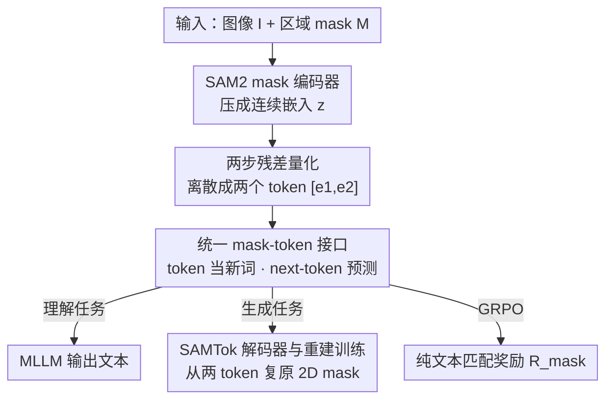

# SAMTok: Representing Any Mask with Two Words

**会议**: CVPR 2026  
**论文**: [CVF Open Access](https://openaccess.thecvf.com/content/CVPR2026/html/Zhou_SAMTok_Representing_Any_Mask_with_Two_Words_CVPR_2026_paper.html)  
**代码**: 无（项目页 https://zhouyiks.github.io/projects/SAMTok/）  
**领域**: 分割 / 像素级多模态 VLM  
**关键词**: mask tokenizer, 残差向量量化, 像素级 MLLM, 指代分割, 文本奖励 RL

## 一句话总结
SAMTok 把任意区域 mask 压成两个离散文本 token，让普通 MLLM（如 QwenVL）只靠 next-token prediction 就能像处理文字一样理解和生成 mask，无需任何分割解码头或定制损失，并因为 mask 变成了"文字"而首次可以用纯字符匹配的奖励做强化学习。

## 研究背景与动机
**领域现状**：让 MLLM 具备像素级能力（理解某个区域、按指令分割出某个物体）是构建交互式视觉系统的关键。现有像素级 MLLM 通常给模型外挂两套专门模块——理解侧用 ROI 池化 / 区域编码器把 mask 喂进去，生成侧用 SAM 之类的分割解码头把隐藏状态解码成 mask。

**现有痛点**：这套"外挂模块"范式有四个具体毛病。(1) mask 输入和输出无法统一建模，理解走区域池化、生成走分割解码器，两条路互不相通；(2) 生成侧用连续 embedding 连接 MLLM 和分割头，导致没法直接、干净地对 mask 生成做 RL（奖励要先把连续特征经 SAM 解成 mask 再算 IoU）；(3) 这些专门模块必须和 MLLM 联合训练，分割损失、前向流程都和标准 VQA 训练不一样，扩训练规模时极其麻烦；(4) 少数工作把 mask 当图像或用 RLE / 多边形文本表示，但一个 mask 要几十上百个 token，推理成本爆炸。

**核心矛盾**：理解和生成之所以分裂、RL 之所以难做，根子在于 mask 一直被当成"需要专用模块处理的连续几何对象"，而不是 MLLM 原生就会处理的"文本符号"。只要 mask 还是连续 embedding，就摆脱不了分割头、定制损失和复杂的奖励链路。

**本文目标**：让任意 mask 能在 MLLM 里像普通文字一样被读写——理解时当输入符号、生成时当输出符号，整个学习过程退化成 SFT 的 next-token prediction + 简单 RL，不动 MLLM 架构、不加专门损失。

**切入角度**：作者注意到三类模型各有一项关键能力——VAE 擅长在图像与隐表示间互转、SAM 这类感知模型擅长用单个 embedding 精确分割物体、向量量化擅长把连续隐表示离散成紧凑码。把它们缝起来，就能得到一个"既能编码 mask、又能从一个高度浓缩 embedding 重建 mask、还是离散形式"的 mask tokenizer。

**核心 idea**：用 SAM 当编解码骨架 + 残差向量量化，把任意 mask 压成两个离散 token，再把这两个 token 当成 MLLM 词表里的两个新"单词"，从而把 mask 理解与生成全部转写成纯文本的 next-token prediction。

## 方法详解
### 整体框架
SAMTok 本身是一个"mask 版的离散 VAE"：输入是一张图像 $I$ 和图上一块区域 mask $\mathcal{M}$，编码器把这块 mask 压成一个连续嵌入 $z$，量化器把 $z$ 离散成两个 token $[e_1, e_2]$，解码器再从这两个 token 把 2D mask 还原回来。训练目标只有一个——mask 重建。一旦这个 tokenizer 练好，"两个 token ↔ 一块 mask"的双向映射就固定下来。

接着是关键一跳：把这两个 token 当成 MLLM 词表里两个新增的特殊词。于是任何一块区域都能写成"一对 mask 单词"。理解任务（如区域描述）就是把 mask 编码成这对单词、插进文本指令里；生成任务（如指代分割）就是让 MLLM 直接预测出这对单词、再用 SAMTok 解码器还原成 mask。所有任务因此被改写成纯"图像 + 文本"的语料，可以用标准 next-token prediction 损失一起 co-train。更妙的是，因为 mask 现在是离散文字，对 mask 生成做 RL 时奖励可以直接靠字符匹配算，不再需要任何外部工具把特征解成 mask。

### 关键设计

**1. SAM2 mask 编码器：把任意区域 mask 压成一个连续嵌入**

要把 mask 当"语言"用，第一步得有一个能把任意形状区域精确编码成定长表示的编码器。作者直接拿一个 SAM 模型 $f_{\text{enc}}$ 改造：去掉 SAM mask decoder 最后的 mask 预测头，让它输出特征而不是 mask。类比交互式分割，SAM 的 prompt encoder $f_{\text{prm}}$ 把 2D mask $\mathcal{M}$ 编成与图像特征同分辨率的 dense prompt embedding，加到 SAM image backbone $f_{\text{img}}$ 编出的图像特征上，一起送进 SAM mask decoder $f_{\text{msk}}$，与一个预初始化的 mask embedding 交互后，得到一个 $d$ 维连续 mask 嵌入：

$$\mathbf{z} = f_{\text{enc}}(\mathcal{I}, \mathcal{M}) = f_{\text{msk}}\big(f_{\text{img}}(\mathcal{I}),\, f_{\text{prm}}(\mathcal{M})\big) \in \mathbb{R}^{d}$$

这样得到的 $z$ 借了 SAM"用单个 embedding 表征一个物体"的能力，把一整块 mask 浓缩进一个向量，为后面离散成极少 token 打好基础。

**2. 两步残差量化：一个嵌入离散成两个 token**

光有连续 $z$ 还不够，MLLM 要的是离散符号，而且 token 越少推理越省。作者用残差向量量化（RQ）做两步离散：先在码本 $\mathcal{C}$ 里给 $z$ 找最近邻得到第一个码 $e_1$，算出残差 $r_1 = z - e_1$；再给残差 $r_1$ 找最近邻得到第二个码 $e_2$。两步合起来就是这块 mask 的离散表示 $q=[e_1, e_2]$：

$$\mathbf{e}_1 = \operatorname*{argmin}_{\mathbf{e}\in\mathcal{C}} \|\mathbf{z}-\mathbf{e}\|_2^2,\quad \mathbf{r}_1 = \mathbf{z}-\mathbf{e}_1,\quad \mathbf{e}_2 = \operatorname*{argmin}_{\mathbf{e}\in\mathcal{C}} \|\mathbf{r}_1-\mathbf{e}\|_2^2,\quad \mathbf{q}=[\mathbf{e}_1,\mathbf{e}_2]$$

之所以用残差量化而不是普通 VQ，是因为它能用一个相对小的码本就做到高保真——第二步专门去补第一步留下的残差，于是只用两个 token 就能把 mask 压得既紧凑又信息足，这正是标题"two words"的来源。

**3. SAMTok 解码器与重建训练：从两个 token 复原 mask**

tokenizer 要双向可逆，才能既当输入又当输出。解码器 $f_{\text{dec}}$ 是一个完整的 SAM 模型：把离散 mask 嵌入 $[e_1, e_2]$ 当成当前图像的特殊"语言 prompt"，在 SAM prompt encoder 里把它们直接求和成 sparse prompt embedding，送进 mask decoder 与预初始化 mask embedding 做 self-attention、再与图像特征做 cross-attention，恢复出连续嵌入 $z$ 的特征，最后过 mask 预测头还原 2D mask $\hat{\mathcal{M}}$：

$$\hat{\mathcal{M}} = f_{\text{dec}}(\mathcal{I}, [\mathbf{e}_1, \mathbf{e}_2]) = f_{\text{msk}}\big(f_{\text{img}}(\mathcal{I}),\, f_{\text{prm}}([\mathbf{e}_1, \mathbf{e}_2])\big)$$

整个 SAMTok 在 209M 张 mask 上只用重建任务训练，损失是重建项加上量化承诺项：重建项 $\mathcal{L}_{\text{recon}} = \mathcal{L}_{\text{CE}}(\mathcal{M},\hat{\mathcal{M}}) + \mathcal{L}_{\text{DICE}}(\mathcal{M},\hat{\mathcal{M}})$，承诺项 $\mathcal{L}_{\text{commit}} = \|\mathbf{z}-\operatorname{sg}(\mathbf{e}_1)\|_2^2 + \|\mathbf{r}_1-\operatorname{sg}(\mathbf{e}_2)\|_2^2$，其中 $\operatorname{sg}(\cdot)$ 是 stop-gradient，$\lambda$ 控制承诺权重，总损失 $\mathcal{L}=\mathcal{L}_{\text{recon}}+\lambda\mathcal{L}_{\text{commit}}$。基于 SAM2 初始化是为了加速收敛、借用其强分割先验，让两个 token 还原出的 mask 在各种视觉域上都贴合原始边界。

**4. 统一 mask-token 接口 + 纯文本奖励 RL：把 mask 当新语言**

有了可逆 tokenizer，作者把码本大小对应数量的 mask 特殊词加进 MLLM 词表，于是任意区域 = 一对特殊词。理解时把 mask 编码成特殊词插进指令（类比文本框但更省更易懂），生成时让 MLLM 预测特殊词、再由 SAMTok 解码成 mask；mask-to-text、text-to-mask、交错生成、交互式分割等全部预处理成纯文本语料，用统一的 next-token prediction 一起 co-train，不需任何定制损失或架构改动。

更关键的是 RL 变得异常干净。以往像素级 MLLM 用连续特征连接分割头，RL 时奖励要先把特征经 SAM 解成 mask 再算 IoU，链路长、工具多；SAMTok 把 mask 写成离散文字后，奖励可以直接做字符匹配。具体地，从 rollout 回答里抽出所有 mask 特殊词、去重，逐个检查是否出现在 ground-truth 答案串里，命中记一个 true positive，奖励为：

$$\mathcal{R}_{\text{mask}} = \mathcal{N}_{\text{TP}} / \max(\mathcal{N}_{pred}, \mathcal{N}_{gt})$$

其中 $\mathcal{N}_{\text{TP}}$ 是预测命中的 mask 数，$\mathcal{N}_{pred}$ 是去重前的预测 mask 数（用来惩罚重复预测），$\mathcal{N}_{gt}$ 是真值 mask 数。这个奖励完全不需要 detokenize、不依赖外部模型，直接套 GRPO 就能跑，把 mask 生成的天花板往上顶。

### 损失函数 / 训练策略
SAMTok 阶段：209M mask 上做重建预训练，损失为 $\mathcal{L}=\mathcal{L}_{\text{recon}}+\lambda\mathcal{L}_{\text{commit}}$（CE + Dice + 承诺项）。MLLM 阶段：约 5M 条 SAMTok 化的对话数据（覆盖区域描述、区域问答、指代分割、交错生成、场景图解析等），统一 next-token prediction 做 SFT；之后对 mask 生成任务用 GRPO 做 RL，奖励为上面的纯文本匹配 $\mathcal{R}_{\text{mask}}$。

## 实验关键数据

### 主实验
text-to-mask（GRES，三 split 平均）。3B 的 QwenVL-SAMTok 经 SFT 微调已超过 8B 的专家模型，再叠加纯文本奖励的 GRPO 后进一步把 gIoU/cIoU/N-acc 全线拉高，且全程没有分割头、没有分割损失：

| 方法 | 规模 | gIoU | cIoU | N-acc |
|------|------|------|------|------|
| LISA | 7B | 62.2 | 63.6 | 52.2 |
| MLLMSeg | 8B | 73.9 | 72.3 | 70.4 |
| ARGenSeg | 8B | 73.6 | 72.1 | – |
| Qwen2.5VL-SAMTok (ft) | 3B | 74.3 | 71.1 | 72.9 |
| **Qwen2.5VL-SAMTok (rl)** | 3B | **76.7** | **73.7** | **77.1** |

交错文本-mask 生成（GCG，val split）。同样是 3B 模型，叠加 RL 后 AP50 / mIoU / Recall 相比 8B 的 Sa2VA 全面领先：

| 方法 | 规模 | AP50 | mIoU | Recall |
|------|------|------|------|------|
| GLaMM | 7B | 30.8 | 66.3 | 41.8 |
| Sa2VA | 8B | 33.2 | 67.7 | 45.1 |
| Qwen2.5VL-SAMTok (ft) | 3B | 37.0 | 71.7 | 47.7 |
| **Qwen2.5VL-SAMTok (rl)** | 3B | **41.5** | **73.5** | **53.5** |

### 分析实验
mask-to-text（DLC-Bench 区域描述，Avg）。不改任何架构，4B 的 Qwen3VL-SAMTok 逼近专家模型 DAM，并把同尺寸通用 MLLM 远远甩开——后者即便被喂了类别名等更丰富先验，分数仍低得多，说明两个 mask token 提供了更精确无歧义的区域定位：

| 方法 | 规模 | Avg |
|------|------|------|
| GPT-4o | – | 61.5 |
| Qwen2.5VL | 7B | 41.2 |
| DAM（专家） | 3B | 67.3 |
| Qwen3VL-SAMTok | 4B | 65.6 |

### 关键发现
- **纯文本奖励的 RL 是涨点主力**：GRES val 上 3B 模型从 SFT 的 gIoU 70.5 / N-acc 60.5 经 GRPO 提到约 79.4 / 81.5（gIoU +8.9、N-acc +21.0），证明"把 mask 写成文字"让 RL 链路从"特征→SAM→mask→IoU"简化到"字符匹配"后，确实能把生成天花板顶上去。
- **小模型反超大专家**：3B / 4B 的 SAMTok 系列在指代分割、交错生成、区域描述上普遍追平或超过 7B–8B 的专用分割 MLLM，说明性能来自"统一 token 范式"而非堆参数或定制损失。
- **强零样本泛化**：GroundingSuite 上零样本 gIoU 67.8 vs 其他区域 MLLM 62.6，MDVP-Bench 上四项指标三项超过专家 DAM，表明显式 mask 监督并非有效 text-to-mask 推理的必要条件。

## 亮点与洞察
- **"两个词表示任意 mask"**：把一整块分割 mask 压到两个离散 token，是全文最"啊哈"的点——它让 mask 第一次以 MLLM 原生符号的形态存在，理解/生成/RL 三件事一下子全部统一进 next-token prediction。
- **离散化解锁纯文本 RL**：以往 mask 生成做 RL 卡在"奖励要把连续特征解成 mask 才能算"，SAMTok 用字符匹配奖励绕开了整条 detokenize 链路，这个"把几何监督换成字符串监督"的思路可迁移到框/点/关键点等其他结构化输出。
- **复用 SAM 当编解码骨架**：编码器是去掉预测头的 SAM、解码器是完整 SAM，把交互式分割的 prompt 机制反过来当"token↔mask"的可逆通道，省去从零训练一个 mask VAE，也借到 SAM 的强边界先验。

## 局限与展望
- 多了一个 SAMTok 编解码器（双 SAM）作为外部 tokenizer，虽与 MLLM 解耦、但推理时理解要先编码、生成要解码可视化 mask，仍有额外计算与工程开销 ⚠️。
- 两个 token 的容量上限可能限制极复杂/极精细 mask 的重建保真度，论文未在文中给出重建质量随 token 数变化的定量结果（消融在附录），细粒度边界的退化情况存疑 ⚠️。
- 字符匹配奖励本质是"特殊词是否命中"，对接近但不完全重合的 mask 缺乏平滑梯度，可能在边界细调上不如连续 IoU 奖励精细；作者也将其定位为简单有效而非最优。

## 相关工作与启发
- **vs 分割解码头式像素 MLLM（LISA / Sa2VA / OMG-LLaVA）**：它们靠专门分割头 + 分割损失 + 联合训练，本文把 mask 离散成文字、用统一 next-token prediction，区别在于把"几何解码"挪进了一个解耦的 tokenizer；优势是无架构改动、可干净 RL，代价是多一个外部编解码器。
- **vs 把 mask 当图像/RLE/多边形文本（ARGenSeg / HiMTok 等）**：同样想用文本范式，但这些方法一个 mask 要几十上百 token、推理昂贵；SAMTok 只用两个 token，紧凑度是数量级差异。
- **vs 框/点辅助信号 + SAM 做 RL（SAM4MLLM 等）**：它们仍需 SAM 把框/点转成 mask 算 IoU 奖励，本文用纯字符匹配奖励彻底去掉了奖励侧的外部工具依赖。

## 评分
- 新颖性: ⭐⭐⭐⭐⭐ 用两个离散 token 表示任意 mask、把像素级理解/生成/RL 统一进 next-token prediction，范式级创新
- 实验充分度: ⭐⭐⭐⭐⭐ 覆盖指代分割、交错生成、区域描述等多任务多 benchmark，含 SFT/RL 与零样本对比
- 写作质量: ⭐⭐⭐⭐ 动机与方法清晰，但消融与重建质量分析多放附录，正文略简
- 价值: ⭐⭐⭐⭐⭐ 给 MLLM 装像素级能力提供了可扩展、语言原生的简洁范式，易复用易扩展

<!-- RELATED:START -->

## 相关论文

- [\[ICCV 2025\] Refer to Any Segmentation Mask Group With Vision-Language Prompts](../../ICCV2025/segmentation/refer_to_any_segmentation_mask_group_with_vision-language_prompts.md)
- [\[CVPR 2026\] SPAR: Single-Pass Any-Resolution ViT for Open-Vocabulary Segmentation](spar_single-pass_any-resolution_vit_for_open-vocabulary_segmentation.md)
- [\[CVPR 2026\] GenMask: Adapting DiT for Segmentation via Direct Mask Generation](genmask_adapting_dit_for_segmentation_via_direct_mask_generation.md)
- [\[CVPR 2026\] VideoMaMa: Mask-Guided Video Matting via Generative Prior](videomama_mask-guided_video_matting_via_generative_prior.md)
- [\[CVPR 2026\] From 2D Alignment to 3D Plausibility: Unifying Heterogeneous 2D Priors and Penetration-Free Diffusion for Occlusion-Robust Two-Hand Reconstruction](from_2d_alignment_to_3d_plausibility_unifying_heterogeneous_2d_priors_and_penetr.md)

<!-- RELATED:END -->
