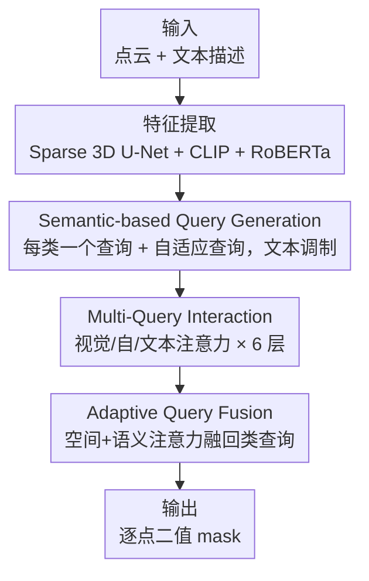

# SAQN: Semantic-based Adaptive Query Network for 3D Referring Expression Segmentation

**会议**: CVPR 2026  
**论文**: [CVF Open Access](https://openaccess.thecvf.com/content/CVPR2026/html/Huang_SAQN_Semantic-based_Adaptive_Query_Network_for_3D_Referring_Expression_Segmentation_CVPR_2026_paper.html)  
**代码**: 无  
**领域**: 3D视觉 / 多模态分割  
**关键词**: 3D指代分割, 语义级查询, 自适应查询, 点云分割, 视觉语言

## 一句话总结
SAQN 把 3D 指代分割里"按点生成查询"的做法换成"每个语义类一个可学习查询"，用极少的查询（21 类 + 10 个自适应查询，共 31 个）取代过去上百个查询，并用 Adaptive Query Fusion 模块化解"一个类查询要代表场景里所有同类物体"带来的歧义，在 ScanRefer 与 Multi3DRefer 上同时刷到 3D-RES / 3D-GRES 的 SOTA。

## 研究背景与动机

**领域现状**：3D Referring Expression Segmentation（3D-RES）的目标是：给定一段自然语言描述和一个点云场景，把描述指代的目标物体从点云中分割出来。早期是两阶段（先生成 proposal 再与文本匹配），效率低且受 proposal 质量限制；近期主流转向单阶段 query-based 方法。其中 MDIN、IPDN 这类 **instance-based（基于实例/点）查询**框架取得了明显增益——它直接从 3D 点生成查询，让查询和 superpoint 一一对应，从而绕开了 2D 里那套昂贵又不稳定的匈牙利匹配（Hungarian matching）。

**现有痛点**：instance-based 查询有两个绕不开的毛病。其一是**查询数量爆炸**：点云里点非常多，直接由点派生的查询也极多（MDIN 里多达 128 个），为了压数量只能再设计采样模块。其二是**采样随机性**：这些采样算法是非确定性的，必须在计算开销和信息损失之间权衡，结果是既保留了大量查询，又因为随机采样**可能根本没采到目标所在的点**——论文 Figure 1 里就给了反例：保留了 128 个查询却仍漏掉了上方那把椅子。

**核心矛盾**：把查询和"原始的点"硬绑在一起，就注定要面对"点很多 → 查询很多 → 必须采样 → 采样可能漏目标"这条死链。

**本文目标**：在保留"不需要匈牙利匹配"这个好处的前提下，既大幅减少查询数量，又彻底消除"采样漏目标"的风险。

**切入角度**：作者注意到一个关键事实——**点云里每个点都自带语义标签**。既然如此，与其给每一把椅子（每个实例）一个查询，不如给"椅子"这个**语义类**一个查询。查询数量从"几百"直接降到"语义类数量"（ScanRefer 上只有 21 类）；而且因为每个点都能可靠地归到对应的类查询，不存在"采样没采到目标类"的问题。

**核心 idea**：把查询从**实例级（per-point）**上移到**语义类级（per-class）**——每个语义类一个可学习查询；再用少量"自适应查询"补回类内多目标的区分能力。

## 方法详解

### 整体框架
SAQN 输入是点云（坐标 $F_P\in\mathbb{R}^{N_p\times3}$ + RGB $F_C$）和一段文本描述，输出是指代目标的逐点二值 mask。整条管线分四步：先用 Sparse 3D U-Net + 多视角 CLIP 特征 + RoBERTa 抽取视觉/文本特征；再用 **Semantic-based Query Generation** 生成"每类一个 + 少量自适应"的固定长度查询，并用文本调制查询优先级；查询经过 6 层 **Multi-Query Interaction** 解码器反复与视觉、文本特征以及彼此交互；最后由 **Adaptive Query Fusion** 模块把自适应查询的 mask 按空间和语义注意力融回语义类查询，得到精细 mask。整套设计的核心是把"查询锚定到语义类而非原始点"，从而既保留无需匈牙利匹配的便利，又摆脱了实例级查询的数量与采样问题。

### 关键设计

**1. Semantic-based Query Generation：把查询锚定到语义类，告别按点采样**

这一步直接针对"查询太多 + 采样漏目标"的死链。作者为 $k_1$ 个语义类各设一个可学习位置嵌入 $P_1\in\mathbb{R}^{k_1\times C}$（ScanRefer 上 $k_1=21$，其中含一个 "others" 类兜底训练时没见过的类别），再为自适应查询设 $k_2$ 个位置嵌入 $P_2\in\mathbb{R}^{k_2\times C}$，拼成 $P=\text{Concat}(P_1,P_2)$。问题是 $P$ 是 text-agnostic 的，无法根据这句话调整各类的优先级，于是用文本特征 $T$ 调制：先算 $A^r=\text{Softmax}(PW_{lp}(TW_{lt})^T)$，再得到最终语义查询 $Q=A^rT+P$。

这样查询长度固定、只与类别数挂钩，与文本复杂度和点数都无关，给解码器一个结构一致、稳定的输入。因为每个点都能可靠归到所属类查询，不再有"采样没采到目标点"的风险；又因为查询天然按类对齐（implicit class alignment），仍然不需要匈牙利匹配。代价是数量从上百降到几十——这是 SAQN 整篇文章的地基。

**2. Multi-Query Interaction：让类查询和自适应查询在解码器里反复对齐视觉与文本**

光有初始查询不够，要让它们吸收场景视觉信息、语言信息，并让"类查询"和"自适应查询"互相通气。每层解码器（共 6 层）依次做三种注意力：先用视觉注意力把查询对齐到 superpoint 视觉特征 $V$，$\hat Q^i=A^i_v V$，其中 $A^i_v=\text{Softmax}(Q^iW^i_{vq}(VW^i_{lv})^T)$；再做查询间自注意力，让语义查询 $\hat Q^i_s$ 与自适应查询 $\hat Q^i_a$ 建立联系，$\hat Q^i_q=A^i_q\hat Q^i$；最后用文本注意力把语言信息融进来，$\hat Q^i_t=A^i_tT$。

关键在于**语义查询和自适应查询走两条独立的 MLP 前向**更新：$Q^{i+1}_s=\text{MLP}^i_s(\hat Q^i_s+\hat Q^i_{t,s}+\hat Q^i_{q,s})$，$Q^{i+1}_a=\text{MLP}^i_a(\hat Q^i_a+\hat Q^i_{t,a}+\hat Q^i_{q,s})$，再拼回 $Q^{i+1}$。两类查询职责不同（一个管"类"，一个管"类内实例差异"），分开更新避免互相干扰。每层用 $M^i=Q^i(VW_m)^T$ 预测 mask；只对语义查询用 $\text{Prob}^i=\sigma(Q^i_sW_p)$ 预测"该类是否出现在目标里"，自适应查询不预测概率，只负责贴 mask、并跟随它最相关的类别。

**3. Adaptive Query Fusion：用自适应查询化解"一个类查询代表所有同类物体"的歧义**

语义级查询省了数量，却带来新麻烦——**cross-object ambiguity**：一个 "chair" 查询要代表场景里所有椅子，但它们形状、大小、位置各异，把所有椅子的特征压进一个向量会让特征糊掉，难以精确分割单个目标。AQF 的思路是：让自适应查询（不绑定固定类、on-the-fly 计算）去捕捉类内的细粒度差异，再有控制地融回类查询。

具体地，给定自适应查询预测的 mask $M^i_a\in\mathbb{R}^{k_2\times N_s}$，先算**空间注意力** $A^i_{spatial}=\text{Softmax}(M^i_a)$（把每个自适应查询精确指派到具体空间区域），再算**语义注意力** $A^i_{semantic}=(\text{Softmax}(Q^i_aW_q))^T\in\mathbb{R}^{k_1\times k_2}$（判断每个自适应查询归属哪个语义类）。最后融合：$\hat M^i_s=M^i_s+A^i_{semantic}(M^i_a\odot A^i_{spatial})$，其中 $\odot$ 是逐元素积，$\hat M^i_s$ 是最终 mask。空间注意力管"在哪"、语义注意力管"属于哪类"，两者结合让自适应查询同时考虑空间和语义地融进类查询，从而把类内不同实例/部件区分开，给类查询"减负"。

> ⚠️ 框架图与三个关键设计一一对应：特征提取与输入/输出是脚手架节点，未单列设计；自适应查询的 Adaptive Queries Intersection Loss 属于训练约束，归入下面"损失函数"小节。

### 损失函数 / 训练策略
总损失由三项组成：

- **概率损失** $\mathcal{L}_p=\text{BCE}(P,L^{tgt})$，其中 $L^{tgt}\in\{0,1\}^{k_1}$ 标注哪些语义类出现在目标中，监督类查询的"是否命中"。
- **mask 损失** $\mathcal{L}_m=\text{BCE}(\hat M^+,M^{tgt})+\text{DICE}(\hat M^+,M^{tgt})$，$\hat M^+$ 是与目标同语义类的查询 mask。对 no-target 样本，作者把 $\hat M^+$ 取概率最高语义类的 mask、$M^{tgt}$ 取零 mask，以增强模型对"负向文本描述"的判别力。
- **自适应查询交并损失（AQIL）** $\mathcal{L}_a=\frac{1}{k_2(k_2-1)}\sum_{i}\sum_{j\neq i}|M_{a,i}\cap M_{a,j}|$，惩罚不同自适应查询 mask 的重叠，逼它们各管一块、关注不同区域，提高查询利用率、进一步降低类内歧义。

最终 $\mathcal{L}=\mathcal{L}_m+\lambda_p\mathcal{L}_p+\lambda_a\mathcal{L}_a$，$\lambda_p=0.1$、$\lambda_a=1.0$。训练 70 epoch，batch 16，PolyRL 学习率从 0.0001 衰减（power 4.0），解码器 6 层，$k_1=21$、$k_2=10$，单对文本+点云推理约 30.7 ms（RTX 4090）。推理时 3D-RES 取概率最高查询并以 0.5 阈值二值化；3D-GRES 合并所有概率 >0.5 的查询 mask，若点数 <50 或无查询概率超 0.5 则判为 no-target。

## 实验关键数据

### 主实验

**3D-GRES（Multi3DRefer）**：mIoU 与高精度指标 Acc@0.5 全面领先，尤其在 zero-target（ZT）抗干扰场景优势明显。

| 方法 | Acc@0.25 All | Acc@0.5 All | mIoU |
|------|------|------|------|
| MDIN | 67.0 | 44.7 | 47.5 |
| IPDN | **71.5** | 50.0 | 51.7 |
| **SAQN** | 70.5 | **53.8** | **53.1** |

Acc@0.5 整体比最强的 IPDN 高 3.8；ZT 场景下含干扰物 +7.9%、无干扰物 +6.8%。Acc@0.25 略低于 IPDN——作者解释为 recall/precision 权衡：0.25 是宽松指标偏好高召回，而 SAQN 偏向高精度（体现在 Acc@0.5 领先），mIoU 53.1 仍确认其整体 mask 质量最优。

**3D-RES（ScanRefer）**：overall mIoU 最高，Acc@0.25 大幅领先。

| 方法 | Overall 0.25 | Overall 0.5 | Overall mIoU |
|------|------|------|------|
| MDIN | 58.0 | 53.1 | 48.3 |
| IPDN | 60.6 | **54.9** | 50.2 |
| **SAQN** | **68.3** | 53.4 | **51.1** |

在无干扰物的 "Unique" 设定与 Acc@0.25 上优势来自语义级查询——它擅长准确识别物体的大类别与空间范围。Acc@0.5 略低于 instance-based 方法，作者归因于后者查询更"丰富"、能贴出几何上更紧的 mask；而 SAQN 以最高 mIoU 体现整体 mask 质量更优。

### 消融实验

组件消融（Multi3DRefer，Acc@0.5 含干扰物 / mIoU）：

| IQ | SQ | AQF | AQIL | ZT | ST | MT | mIoU |
|----|----|-----|------|----|----|----|------|
| ✓ | | | | 37.1 | 32.5 | 51.2 | 50.3 |
| | ✓ | | | 54.9 | 37.8 | 49.6 | 52.1 |
| | ✓ | ✓ | | 55.2 | 38.2 | 51.1 | 52.5 |
| ✓ | | ✓ | ✓ | 36.9 | 33.6 | 51.9 | 50.9 |
| | | ✓ | ✓ | 33.6 | 34.2 | 49.9 | 50.4 |
| | ✓ | ✓ | ✓ | **55.8** | **39.8** | **52.3** | **53.1** |

超参消融（$k_2$ 与 $\lambda_a$）：

| 配置 | mIoU | 说明 |
|------|------|------|
| $k_2=5$ | 52.7 | ZT/ST 略好但 MT 与整体 mIoU 偏弱 |
| $k_2=10$ | **53.1** | MT 与 mIoU 最佳，最优平衡 |
| $k_2=15$ | 51.9 | 查询过多引入噪声，全指标下降 |
| $\lambda_a=0.1$ | 52.3 | 损失约束太弱 |
| $\lambda_a=1$ | **53.1** | 最优 |
| $\lambda_a=10$ | 49.9 | 过度强调该项，优化方向偏移、显著掉点 |

### 关键发现
- **SQ（语义级查询框架）是地基**：单加 SQ 就把 ZT Acc@0.5 从 37.1 拉到 54.9（+17.8），但 MT 反而从 51.2 降到 49.6——正是语义级查询引入的 cross-object ambiguity，验证了 AQF 存在的必要。
- **AQF 专补多目标**：在 SQ 上加 AQF 把 MT 从 49.6 回升到 51.1，AQIL 再补到 52.3，三者互补、缺 SQ 时（第 4、5 行）AQF/AQIL 几乎无效，说明语义框架是其他模块发挥作用的前提。
- **查询数量大降**：21+10=31 个查询 vs MDIN 的 128，且无需任何点采样机制，推理 30.7 ms。
- **自适应查询需带语义先验**：把 31 个自适应查询改成只分正/负、不按类别（消融第 5 行）后各指标下降，说明语义先验对查询很重要。

## 亮点与洞察
- **查询粒度的"降维"**：把"per-point/per-instance 查询"上移到"per-class 查询"，一举把"数量多 + 采样漏目标"两个问题连根拔掉——这是很干净的问题重定义，思路可迁移到其他"按点/按 proposal 生成查询又被数量拖累"的 3D 任务。
- **用辅助查询补回信息、再用注意力可控融回**：固定类查询负责"类"，少量自适应查询负责"类内差异"，并用空间×语义双注意力融合——这种"主查询稳、辅查询活"的分工，是兼顾稳定性与表达力的实用范式。
- **AQIL 是个轻量但有效的 trick**：仅用一个惩罚 mask 重叠的损失，就逼自适应查询各司其职、提升利用率，几乎零额外结构成本。

## 局限与展望
- 作者承认：当前用 "others" 类兜底开放词表目标，在类别数量很大的实际场景里能力有限。
- ⚠️ Acc@0.5（3D-RES ScanRefer）上 SAQN 仍略逊于 instance-based 的 IPDN，说明语义级查询在"贴出几何上极紧的 mask"这件事上不占优——它强在召回与整体 mIoU，对边界极致精度敏感的应用要权衡。
- $k_2$ 是敏感超参（5/10/15 表现差异明显），跨数据集是否仍 10 最优、是否需要自适应确定查询数，论文未深入。

## 相关工作与启发
- **vs MDIN / IPDN（instance-based 查询）**：它们从 3D 点生成查询、靠 superpoint 对应避开匈牙利匹配，但查询多（达 128）且依赖随机采样，可能漏目标；SAQN 改用语义类查询，数量降到 31、消除采样漏检风险，3D-GRES mIoU 反超（53.1 vs 51.7），代价是 3D-RES 的 Acc@0.5 略低。
- **vs RefMask3D（预定义可学习查询）**：RefMask3D 用 2D 风格的预定义查询，却又退回到昂贵不稳的匈牙利匹配；SAQN 的语义类查询天然按类对齐，无需匈牙利匹配。
- **vs 3D-STMN（文本作查询）**：3D-STMN 直接拿文本特征当查询，查询长度可变、受语言歧义影响、训练难度大；SAQN 用固定长度的类级查询给解码器稳定输入。

## 评分
- 新颖性: ⭐⭐⭐⭐ 把 3D-RES 查询从实例级上移到语义级是个干净且有效的问题重定义，AQF/AQIL 配套自洽
- 实验充分度: ⭐⭐⭐⭐ ScanRefer + Multi3DRefer 双任务 SOTA，组件/超参消融完整，但仅两个数据集、缺更多场景泛化
- 写作质量: ⭐⭐⭐⭐ 动机—方法—实验逻辑清晰，公式与图示到位
- 价值: ⭐⭐⭐⭐ 查询数大降 + 消除采样漏检，对 3D 指代分割的查询设计有实用借鉴

<!-- RELATED:START -->

## 相关论文

- [\[CVPR 2026\] Spatial Matters: Position-Guided 3D Referring Expression Segmentation](spatial_matters_position-guided_3d_referring_expression_segmentation.md)
- [\[CVPR 2026\] CompetitorFormer: Mitigating Query Conflicts for 3D Instance Segmentation via Competitive Strategy](competitorformer_mitigating_query_conflicts_for_3d_instance_segmentation_via_com.md)
- [\[CVPR 2026\] Unlocking 3D Affordance Segmentation with 2D Semantic Knowledge](unlocking_3d_affordance_segmentation_with_2d_semantic_knowledge.md)
- [\[CVPR 2026\] GeoGuide: Hierarchical Geometric Guidance for Open-Vocabulary 3D Semantic Segmentation](geoguide_hierarchical_geometric_guidance_for_open-vocabulary_3d_semantic_segment.md)
- [\[CVPR 2026\] Heuristic Self-Paced Learning for Domain Adaptive Semantic Segmentation under Adverse Conditions](heuristic_self-paced_learning_for_domain_adaptive_semantic_segmentation_under_ad.md)

<!-- RELATED:END -->
