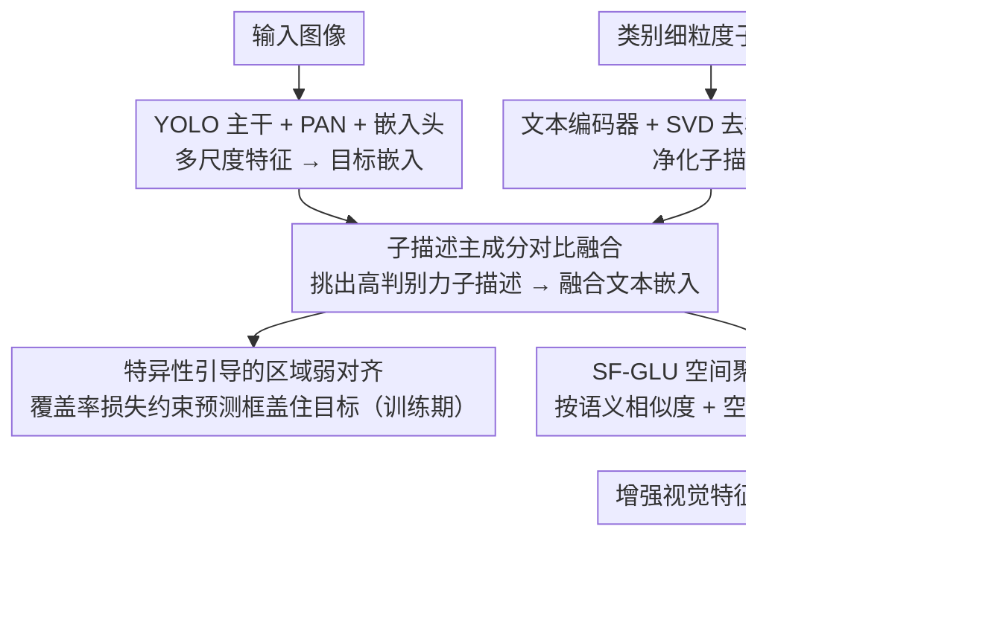

# SDDF: Specificity-Driven Dynamic Focusing for Open-Vocabulary Camouflaged Object Detection

**会议**: CVPR 2026  
**arXiv**: [2603.26109](https://arxiv.org/abs/2603.26109)  
**代码**: [https://github.com/Zh1fen/SDDF](https://github.com/Zh1fen/SDDF)  
**领域**: 图像分割  
**关键词**: 开放词汇目标检测, 伪装目标检测, 视觉语言模型, 细粒度描述, 动态聚焦

## 一句话总结

SDDF 提出开放词汇伪装目标检测（OVCOD）新任务，构建了 OVCOD-D 基准，通过子描述主成分对比融合策略去除冗余文本噪声，以及特异性引导的区域弱对齐和动态聚焦机制增强伪装目标与背景的区分能力，在开集设置下达到 56.4 AP。

## 研究背景与动机

开放词汇目标检测（OVOD）借助视觉语言预训练模型实现了强大的零样本泛化能力。但面对伪装目标时，检测器无法有效区分目标与背景——因为伪装目标的视觉特征与背景高度相似。

**两个核心问题**：(1) 文本嵌入冗余——由多模态大模型生成的细粒度描述中包含大量多余的修饰语，在跨模态学习中引入噪声，误导视觉特征提取。(2) 目标-背景嵌入高度相似——伪装目标与背景在嵌入空间中的决策边界难以学习。

**本文切入**：利用 SVD 分解去除文本描述中的噪声成分，利用目标特异性语义先验引导视觉特征聚焦于真正的目标区域。

## 方法详解

### 整体框架

SDDF 要解决的是开放词汇检测器一碰到伪装目标就失灵的问题：目标和背景在视觉上几乎一样，而多模态大模型生成的细粒度文本描述又夹带大量冗余修饰语，把跨模态对齐带偏。整篇方法围绕「先把文本洗干净、再用文本去引导视觉聚焦目标」展开。具体地，输入图像走轻量级 YOLO 主干 + PAN 拿到多尺度视觉特征、再经嵌入头得到目标嵌入；与此同时，每个类别的细粒度子描述先经文本编码器 + SVD 去相关 + Adapter 净化，再与目标嵌入做子描述主成分对比融合，得到一份纯净的融合文本嵌入。这份融合嵌入有两个去处：一是通过特异性引导的区域弱对齐，用覆盖率损失约束模型预测的特异性区域去盖住真实目标；二是作为条件输入 SF-GLU，在空间维度上动态放大目标响应，最终把增强后的特征送进 Box Head 预测检测框，使伪装场景下也能把目标从背景里分出来。

### 关键设计

**1. 子描述主成分对比融合：把细粒度描述里的噪声修饰语洗掉**

多模态大模型生成的描述看着细，实则词汇多样性偏低（论文 Figure 2 统计显示这些描述的 lexical diversity 与 avg_unique_ratio 都不高），大量重复的修饰语在对比学习里会把视觉特征往错误方向拽。SDDF 的做法是先把每个类别的属性描述拆成若干子描述、分别编码成子描述向量，再做 SVD 去相关 + 一个三层 MLP（text adapter）精炼：主成分张成的子空间代表这些描述共有的、稳定的语义结构，散落在小奇异值方向上的成分多半是冗余噪声，于是被抑制。光去噪还不够，它进一步用对比性来给每个子描述定权重——把子描述对**具体目标嵌入** $v_i$ 的相似度，减去它对**全局平均嵌入** $v_{\text{global}}$ 的相似度，作为重要性分数 $w_k$（公式 2）；某个子描述如果对具体目标的响应明显高于对全局平均的响应，说明它真正抓住了"这个目标和别处哪里不一样"的特异语义，经 softmax 归一化后被加重，再加权求和得到融合文本嵌入 $t_c^{\text{fused}}$。这样融合出的文本嵌入既去掉了噪声，又凸显了特异性，比直接平均所有子描述更能指导视觉编码器看对地方。

**2. 特异性引导的区域弱对齐：用区域级覆盖而非像素级标注来对齐特异性区域**

伪装目标的边界本身就模糊，逼模型做像素级精确对齐既不现实、标注成本也高。SDDF 改用一个基于覆盖率的损失：鼓励模型由文本特异性激活出的区域逐步覆盖住真实目标区域，只要求区域级别的"盖到"，不要求逐像素吻合。这种"弱"对齐在缺乏精细分割标注时依然能把视觉注意力引向真正的目标，而且对边界的模糊更宽容、训练更稳，比强制像素对齐更契合伪装检测的现实约束。

**3. 空间聚焦门控线性单元 SF-GLU：让目标描述在空间上动态放大目标域响应**

伪装目标的特征响应常被背景淹没，被动地提特征救不回来，得有一个主动增强的开关。SF-GLU 把融合后的目标文本嵌入 $t_c^{\text{fused}}$ 和区域匹配分数当作条件，为每个空间位置算一个门控增益，而增益由两项共同决定：一是该位置与目标描述的匹配相似度 $S_j$，二是它到"最可能的目标块" $i_t$ 的空间距离 $d_{j,i_t}$——既语义上像目标、又在空间上靠近目标的位置，增益最大（公式 9）。门控形式取 $\hat{z}\odot(1+\sigma(\cdot))$，其中 $1+\sigma$ 保证所有位置至少保留原始响应，只对目标域的位置在此基础上额外放大，而非把背景压到原值以下。于是在特征层面，原本和背景纠缠在一起的伪装目标被相对"拎"了出来，目标与背景在嵌入空间里的距离被拉开，决策边界随之更好学。这一步在消融里贡献最大，说明仅有干净文本和弱对齐还不够，最终把目标从背景里分出来的关键是这个动态聚焦门控。

### 损失函数 / 训练策略

以在大规模检测数据集上预训练的轻量级检测器为基线，在 OVCOD-D 上微调。总损失由三部分组成：常规检测损失、区域弱对齐的覆盖率损失、以及跨模态对比学习损失。

## 实验关键数据

### 主实验

| 方法 | 设置 | AP | 说明 |
|------|------|-----|------|
| YOLO-World-M | 开集 | 低 | 基线在OVCOD-D上显著下降 |
| SDDF | 开集 | 56.4 | OVCOD-D 基准上的新SOTA |
| SDDF | 闭集 | 强表现 | 在传统COD任务上也有竞争力 |

LVIS 数据集上重叠类别的 AP 与 OVCOD-D 上的巨大差距验证了伪装目标对 OVOD 的严峻挑战。

### 消融实验

| 配置 | AP | 说明 |
|------|-----|------|
| 基线（无SDDF） | 显著更低 | OVOD在伪装场景极弱 |
| + 子描述主成分融合 | 提升 | 文本去噪有效 |
| + 区域弱对齐 | 进一步提升 | 特异性引导生效 |
| + SF-GLU | 56.4 | 动态聚焦贡献最大 |

### 关键发现

- 开放词汇检测器在伪装目标上的性能显著下降，验证了OVCOD作为新研究方向的必要性
- 文本描述的去噪（SVD分解）对性能提升至关重要，说明盲目使用多模态大模型生成的描述可能适得其反
- 模型足够轻量，可在边缘设备部署

## 亮点与洞察

- **新任务定义的价值**：OVCOD 将开放词汇检测和伪装目标检测两个方向交叉，指出了现有 OVOD 方法的盲区
- **SVD 去噪文本嵌入**：用矩阵分解来识别和去除文本嵌入中的噪声成分，比简单的 prompt engineering 更数学化、更可控
- **弱对齐的实用性**：在标注成本高或边界模糊的场景中，弱对齐是比像素级对齐更实际的选择

## 局限与展望

- OVCOD-D 数据集规模有限，类别分布呈长尾
- 依赖多模态大模型生成描述，描述质量受限于大模型能力
- 对极端伪装（如完全融入背景的目标）可能仍然力不从心
- 未来可探索视频中的伪装目标检测，利用运动线索

## 相关工作与启发

- **vs YOLO-World/YOLO-UniOW**: 这些 OVOD 方法在常规目标上表现优异但对伪装目标无力，SDDF 通过特异性引导弥补了这一短板
- **vs 传统 COD (SINet/ZoomNet)**: 传统 COD 是闭集设置且需要像素级标注，OVCOD 更灵活
- **vs GLIP/Detic**: 通用开放词汇方法缺乏对伪装场景的特殊处理

## 评分

- 新颖性: ⭐⭐⭐⭐ 新任务定义+SVD去噪+弱对齐组合有新意
- 实验充分度: ⭐⭐⭐⭐ 开集闭集都有测试，消融完整
- 写作质量: ⭐⭐⭐ 内容较多，部分表述可以更简洁
- 价值: ⭐⭐⭐⭐ 定义了有意义的新方向，基准数据集有长期价值

<!-- RELATED:START -->

## 相关论文

- [\[CVPR 2026\] Beyond Appearance: Camouflaged Object Detection via Geometric Structure](beyond_appearance_camouflaged_object_detection_via_geometric_structure.md)
- [\[CVPR 2026\] Seeing Both Sides: Towards Bidirectional Semantic Alignment for Open-Vocabulary Camouflaged Object Segmentation](seeing_both_sides_towards_bidirectional_semantic_alignment_for_open-vocabulary_c.md)
- [\[CVPR 2026\] Training-Free Open-Vocabulary Camouflaged Object Segmentation via Fine-Grained Object Binding and Adaptive Hybrid Prompt](training-free_open-vocabulary_camouflaged_object_segmentation_via_fine-grained_o.md)
- [\[CVPR 2026\] DSS: Discover, Segment, and Select for Zero-shot Camouflaged Object Segmentation](discover_segment_and_select_a_progressive_mechanism_for_zero-shot_camouflaged_ob.md)
- [\[ECCV 2024\] Learning Camouflaged Object Detection from Noisy Pseudo Label](../../ECCV2024/segmentation/learning_camouflaged_object_detection_from_noisy_pseudo_label.md)

<!-- RELATED:END -->
