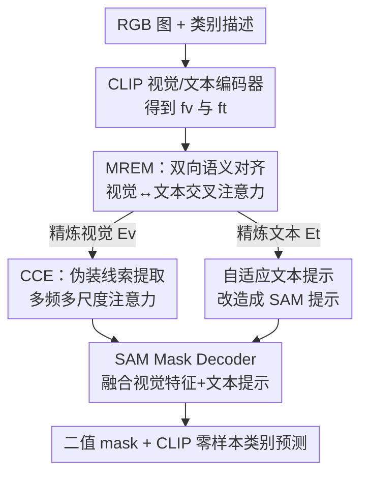

# Seeing Both Sides: Towards Bidirectional Semantic Alignment for Open-Vocabulary Camouflaged Object Segmentation

**会议**: CVPR 2026  
**论文**: [CVF Open Access](https://openaccess.thecvf.com/content/CVPR2026/html/Zhang_Seeing_Both_Sides_Towards_Bidirectional_Semantic_Alignment_for_Open-Vocabulary_Camouflaged_CVPR_2026_paper.html)  
**代码**: https://github.com/okmaybach/BaCLIP-CVPR2026  
**领域**: 开放词表分割 / 伪装目标分割  
**关键词**: 伪装目标分割, 开放词表, 双向跨模态对齐, CLIP, SAM

## 一句话总结
BaCLIP 用一个双向交叉注意力模块（MREM）让文本和视觉特征互相校准，再把精炼后的文本嵌入改造成 SAM 的语义化提示，从而在开放词表伪装目标分割（OVCOS）的 OVCamo 基准上以更轻量的结构刷到 SOTA，cIoU 比前 SOTA 高出 4.5 个点。

## 研究背景与动机

**领域现状**：伪装目标分割（COS）要从与背景高度融合的场景里抠出目标。传统 COS 是闭集范式，只认训练里见过的类别。随着 CLIP 这类视觉-语言预训练兴起，Pang 等人正式提出了开放词表伪装目标分割（OVCOS）任务，配套 OVCamo 基准和基于 CLIP 的基线 OVCoser，让模型靠自然语言（而非固定标签）去识别没见过的伪装类别。后续 SuCLIP 又加了语义一致性损失来缓解同一目标的不同部位被分到不同类别的问题。

**现有痛点**：无论 OVCoser 还是 SuCLIP，都共用一个根本缺陷——它们都是**单向交互**：文本特征单方面去增强、引导视觉特征的匹配（text-to-vision），视觉这边没有反馈回文本。这种单向设计忽略了 CLIP 的「图像级文本语义」和分割需要的「像素级精度」之间存在的语义鸿沟。

**核心矛盾**：CLIP 的文本描述天然是图像级、粗粒度的，而分割要的是像素级、细粒度的判别。单向引导让模型对「语义相关但视觉不同」的区域产生混淆——比如查询「趴在叶子上的绿色虫子」，模型会把同样是绿色的叶子误当成目标，因为它只让文本去拉视觉，却没让视觉把「形状、纹理、边界连续性」这些结构线索反向喂回去修正文本的注意力。论文把这种现象命名为「语义混淆」（semantic confusion）：视觉相似的背景被错配成伪装目标，导致分割破碎、类别误判。

**本文目标**：建立视觉与语言之间的**双向**引导机制，让视觉线索能反过来精炼、消歧文本语义，同时把这套对齐结果真正落到像素级的 mask 上。

**切入角度**：作者通过 t-SNE 可视化观察到，冻结 CLIP 提取的 24 个未见类特征类间边界模糊、类内松散；而引入双向对齐后特征聚成紧凑簇、决策边界更锐利。这个观察支撑了「双向交互能提升跨模态可分性」的假设。

**核心 idea**：用「双向交叉注意力」替代「单向 text-to-vision 匹配」来消除语义混淆，并把精炼后的文本嵌入转成 SAM 的自适应提示，把图像级语义接到像素级分割上。

## 方法详解

### 整体框架

BaCLIP 的输入是一张 RGB 图和一组类别描述，输出是伪装目标的二值 mask 加类别预测。整条管线可以这样转：视觉走 CLIP 视觉编码器拿到多尺度特征 $f_v$；文本侧把类别描述喂进 CamoPrompts 再过 CLIP 文本编码器得到文本嵌入 $f_t$。两路在 **MREM** 里做双向交叉注意力互相校准，产出精炼后的视觉特征 $E_v$ 和文本特征 $E_t$。视觉这边的 $E_v$ 进 **CCE**（Camo Clue Extractor，内部级联多个 MFMSA 模块）做频域+多尺度的细粒度增强，得到伪装敏感特征 $E_v^*$；文本这边的 $E_t$ 经自注意力和投影改造成 **自适应提示** $E_t^*$，喂进 SAM 冻结的 Prompt Encoder。最后 $E_v^*$ 和 $E_t^*$ 一起进 SAM 的 Mask Decoder 生成高分辨率 mask，再用 CLIP 的零样本能力预测 mask 的类别。

### 关键设计

**1. MREM：用双向交叉注意力消除语义混淆**

这是全文核心，直接针对「单向 text-to-vision 导致语义混淆」这个痛点。MREM 不再让文本单方面拉视觉，而是让两个模态互相注入信息、共同演化到一致的语义空间。具体做法是多头双向交叉注意力：给定视觉特征 $f_v \in \mathbb{R}^{H \times W \times C}$（经 Conv1 处理）和文本嵌入 $f_t \in \mathbb{R}^{N \times C}$（经 Linear 处理），分别投影成各自的 QKV 三元组。然后两个方向同时算——视觉用自己的 query 去查文本的 key/value，文本用自己的 query 去查视觉的 key/value：

$$F^{head}_{v,i} = \mathrm{Softmax}\!\left(\frac{Q_{v,i} k_{t,i}^{T}}{\sqrt{d_k}}\right) v_{t,i}, \qquad F^{head}_{t,i} = \mathrm{Softmax}\!\left(\frac{q_{t,i} K_{v,i}^{T}}{\sqrt{d_k}}\right) V_{v,i}$$

其中 $F^{head}_{v,i}$ 是被文本精炼过的视觉特征，$F^{head}_{t,i}$ 是被视觉精炼过的文本特征。各头拼接后再过线性投影得到最终的 $E_v$ 和 $E_t$。这一来一回的关键在于：文本 token 把类别语义注入视觉特征，视觉线索同时去精炼文本的注意力焦点。这样当背景里有「视觉相关但其实是背景」的区域（如同色的树叶、沙地）时，视觉反馈能把文本的注意力从这些误导区域上拉开，从而同时改善边界精度和类别判别——这正是单向匹配做不到的。消融里 w/o visual（只保留文本→视觉）和 w/o text（只保留视觉→文本）都只有小幅增益，唯有双向全开才拿到最佳，证明「互相精炼」本身才是关键，而不是任意单路增强。

**2. CCE + MFMSA：在频域和多尺度上挖伪装线索**

MREM 解决的是语义对齐，但伪装目标和背景在空间域上太接近，光对齐还不够细。CCE（Camo Clue Extractor）就负责把 MREM 出来的视觉特征 $E_v$ 做细粒度增强，核心是级联的 MFMSA（多频多尺度注意力）模块，每个 MFMSA 由两部分组成。**MFCA（多频通道注意力）**：先把 $E_v$ 用 Down2、Down4 下采样成三个尺度的特征 $E_1, E_2, E_3$，每个再用 DCT Bias 分解成多个频率分量，各分量过并行的全连接层后聚合成通道注意力图，乘回原特征得到频域精炼特征 $\chi_i$。这一步的直觉是：视觉上难分的伪装目标，换到频域往往就「现形」了。**MSDA（多尺度差分注意力）**：拿 $\chi_i$ 去强化跨尺度的边界线索，引入两个可学习参数 $\alpha_i, \beta_i$ 来控制前景/背景信息流：

$$\lambda_i = \mathrm{Conv3}\big(\alpha_i(\chi_i \otimes F_i) \oplus \beta_i(\chi_i \otimes B_i)\big)$$

其中 $F_i = \mathrm{Sigmoid}(\mathrm{Conv1}(\chi_i))$ 是前景注意力图，背景图直接取补 $B_i = 1 - F_i$。三个尺度上采样对齐后相加 $\chi = \lambda_1 \oplus \mathrm{Up2}(\lambda_2) \oplus \mathrm{Up4}(\lambda_3)$，再和原输入残差融合得到增强特征 $E_v^* = E_v \oplus \chi$。前景/背景分开建模、用可学习权重平衡，正好对应伪装场景里前背景界限模糊的难点。消融显示 MFCA 和 MSDA 各自有用、合用最好，且级联 3 个 MFMSA 是最优档位（再多反而掉点）。

**3. 自适应文本提示：把 SAM 改造成开放词表、语义驱动的分割器**

原版 SAM 只吃点、框、mask 这类空间提示，本身类别无关、缺高层语义。这个设计要解决的就是「怎么把跨模态语义对齐真正落到 SAM 的像素级 mask 上」。做法是把 MREM 精炼后的文本嵌入 $E_t$ 改造成 SAM 能用的提示：先过自注意力捕捉 token 间依赖 $P_t = \mathrm{SelfAttention}(E_t)$，再经投影层送进 SAM 冻结的 Prompt Encoder 得到语义化提示嵌入 $E_t^* = \mathrm{PromptEncoder}(\mathrm{Proj}(P_t))$。解码阶段，CCE 出来的增强视觉特征 $E_v^*$ 和这个文本提示 $E_t^*$ 一起喂进 SAM 的 Mask Decoder。这一步用「自适应文本提示」替代了 SAM 原本的手工空间提示，让 SAM 从一个空间提示驱动的工具变成语义驱动、能泛化到未见类别的分割器；而且因为复用 CLIP 视觉编码器替换了 SAM 原始 backbone，参数量明显下降、效率更高。消融里加 SA（自注意力）那一步（w/o SA → Ours）也带来稳定增益，说明在喂给 Prompt Encoder 前先精炼 token 依赖是有意义的。

### 损失函数 / 训练策略
分割监督用加权 BCE 损失加 Dice 损失：$L_{seg} = L_{BCE} + L_{Dice}$，Dice 用来缓解正负样本（目标/背景）的类别不平衡。训练时 CLIP 参数全程冻结，输入缩放到 $384 \times 384$，AdamW 优化器，batch size 4，学习率 $3 \times 10^{-5}$，30 个 epoch，余弦退火调度，单张 RTX 4090（24GB）即可训练，数据增强用随机翻转、旋转、颜色抖动。

## 实验关键数据

### 主实验
在 OVCamo 基准（14 个训练基类 / 61 个测试新类）上，与多种 OVSS 方法和 OVCOS 方法 OVCoser 比较，六个指标同时衡量分割和分类质量（cSm、cFωβ、cMAE、cFβ、cEm、cIoU，其中 cMAE 越低越好）：

| 方法 | VLM / Backbone | cSm ↑ | cFωβ ↑ | cMAE ↓ | cIoU ↑ |
|------|----------------|-------|--------|--------|--------|
| SuCLIP† | CLIP-ConvNeXt-L | 0.533 | 0.449 | 0.368 | 0.395 |
| OVCoser（前 SOTA） | CLIP-ConvNeXt-L | 0.579 | 0.490 | 0.336 | 0.443 |
| **BaCLIP（本文）** | CLIP-ConvNeXt-L | **0.589** | **0.540** | **0.327** | **0.488** |
| 提升 | — | +1.0% | +5.0% | +0.9% | +4.5% |

BaCLIP 在全部六个指标上都刷新 SOTA，且不依赖任何额外视觉 backbone（ResNet/Swin），靠 CLIP 视觉编码器替换 SAM 原始 backbone，结构更轻量。值得注意的是，多个 OVSS 方法在 OVCamo 上微调后反而比零样本更差，说明它们迁移到伪装专属数据时出现严重的知识遗忘。

### Hard Categories 分析
作者按 OVCoser 的 cIoU 排序取最难的 25%（15 个类）做针对性分析，验证 BaCLIP 在「最容易语义混淆」的场景上优势更明显：

| 子集 | 指标 | OVCoser | 本文 | 提升 |
|------|------|---------|------|------|
| 全部 61 类 | cIoU ↑ | 0.443 | 0.488 | +4.5% |
| 全部 61 类 | cFωβ ↑ | 0.490 | 0.540 | +5.0% |
| Hard 15 类 | cIoU ↑ | 0.382 | 0.445 | +6.3% |
| Hard 15 类 | cFωβ ↑ | 0.446 | 0.517 | +7.1% |
| Hard 15 类 | cMAE ↓ | 0.466 | 0.437 | +2.9% |

在难类上 cIoU 提升从全局的 +4.5% 放大到 +6.3%，cMAE 误差下降从全局的 +0.9% 放大到 +2.9%，说明增益主要来自 MREM 对语义混淆的针对性缓解——越难越混淆的场景，双向对齐越有用。

### 消融实验
组件逐步叠加（Tab.3）和 MREM 内部拆解（Tab.5）：

| 配置 | cSm ↑ | cIoU ↑ | 说明 |
|------|-------|--------|------|
| baseline（CLIP + 卷积解码器） | 0.528 | 0.311 | 起点较弱 |
| +SAM（Prompt Encoder + Mask Decoder） | 0.531 | 0.332 | 接入 SAM 打底 |
| +CCE | 0.555 | 0.428 | 比 SAM 基线 cIoU 相对涨 9.6% |
| +CCE+MREM（完整模型） | 0.589 | 0.488 | 再相对涨 6.0% |
| MREM: w/o visual（仅文本→视觉） | 0.559 | 0.432 | 单向，增益有限 |
| MREM: w/o text（仅视觉→文本） | 0.574 | 0.462 | 单向，增益有限 |
| MREM: w/o SA | 0.580 | 0.470 | 去掉自注意力精炼提示 |

### 关键发现
- **CCE 贡献最大**：从 SAM 基线（0.332）加到 CCE（0.428），cIoU 相对涨 9.6%，证明在频域+多尺度上挖伪装线索是分割质量的主要来源；MREM 在此之上再相对涨 6.0%，负责消除语义混淆/类别误判。
- **双向才是 MREM 的灵魂**：只保留单向的两个变体（w/o visual 0.432、w/o text 0.462）都明显低于双向全开（0.488），单路增强不够，互相精炼才能解歧义。
- **MFMSA 级联数有甜点**：级联 3 个 MFMSA 最优（cIoU 0.488），2 个不够、4/5 个反而掉到 0.470/0.466，说明不是越深越好。
- **backbone 偏好卷积**：ConvNeXt 系列稳压 ViT（ConvNeXt-L 0.488 > ViT-L/14 0.458 > ViT-B/16 0.437），作者归因于 ViT 只产单尺度特征，对密集分割不利；ConvNeXt-XXL 能到 0.530 但参数太大，故选 ConvNeXt-L 平衡。

## 亮点与洞察
- **「双向交叉注意力」这个切口很直白但有效**：把语义混淆归因为「视觉没法反向修正文本注意力」，再用一来一回的交叉注意力对症下药，t-SNE 可视化（类内更紧、类间更分）和注意力热图（噪声被压、激活聚焦目标）两个角度都给了直观证据，论证链条完整。
- **把 SAM 的提示接口「语义化」是个可复用思路**：SAM 本来只吃空间提示、类别无关，本文把 CLIP 文本嵌入经自注意力+投影改造成 Prompt Encoder 能消化的提示，等于给 SAM 装上了开放词表的语义入口。这套「VLM 文本嵌入 → SAM 提示」的改造可以迁移到其他需要语言引导的开放词表密集预测任务（如开放词表实例分割、指代分割）。
- **频域思路对付伪装很对路**：MFCA 用 DCT 把视觉上难分的伪装目标拆到频域去找判别线索，呼应了「伪装在像素域难、换个域就现形」的直觉，是伪装/反伪装任务里值得借鉴的角度。
- **轻量也是卖点**：复用 CLIP 视觉编码器替换 SAM backbone、不加额外 backbone，在单卡 4090 上就能训，对比那些靠 Swin/ViT-Adapter 堆参数的 OVSS 方法更实用。

## 局限与展望
- **强依赖 OVCamo 单一基准**：全部主结果和消融都在 OVCamo 上，没有跨数据集或真实开放场景的泛化验证，未见类的「开放」程度仍受限于这个基准的 61 个测试类。
- **CLIP 零样本分类是上限瓶颈**：最终类别预测靠 CLIP 的零样本能力，论文展示的误分类例子（如 rabbit→dog）部分根源可能在 CLIP 本身的类别可分性，而 MREM 缓解但未根除这一问题。
- **MFMSA 级联数、ConvNeXt 规模都是经验调出来的**：3 个 MFMSA、ConvNeXt-L 都是在该基准上试出来的甜点，换数据集是否仍最优未知；ConvNeXt-XXL 明显更强（cIoU 0.530）但被参数量劝退，说明性能-效率折中还有空间。
- **改进方向**：可以探索把双向对齐做成多轮迭代（而非单次交叉注意力）、引入更强的开放词表分类头替代 CLIP 零样本、或在更多伪装/通用开放词表分割基准上验证泛化。

## 相关工作与启发
- **vs OVCoser**：OVCoser 是 OVCOS 的开山基线，靠手工结构线索（边缘、深度）增强类别无关分割，但仍是单向 text-to-vision。本文用双向 MREM 替代单向引导，在所有六个指标上超过它，尤其在难类上优势放大，核心区别就在「让视觉反馈回文本」。
- **vs SuCLIP**：SuCLIP 用 Context-Aware Prompt 加语义一致性损失来缓解同一目标不同部位被分到未定义类别，但本质还是单向语义传播。本文从交互方向（单向→双向）而非损失约束的角度切入，更治本。
- **vs SEEM / OVSAM / OpenSeg-SAM**：这些工作把 SAM 和 VLM 结合（统一视觉文本提示、引入 CLIP 嵌入桥接类别语义），但提示影响视觉解码仍是单向的。本文的差异在于双向语义对齐+把文本嵌入显式改造成 SAM 自适应提示，同时拿到语义引导和像素级精度。

## 评分
- 新颖性: ⭐⭐⭐⭐ 「单向→双向」的切口清晰、对症，把 SAM 提示语义化也算实用创新，但交叉注意力本身是成熟机制，属于在特定任务上的巧妙组合而非全新范式。
- 实验充分度: ⭐⭐⭐⭐ 主表覆盖多 OVSS 方法和多训练设置，消融拆到 MREM/CCE 内部并配 t-SNE、注意力热图，难类分析很有说服力；扣分在只用 OVCamo 单基准。
- 写作质量: ⭐⭐⭐⭐ 动机-观察-方法-验证链条完整，图（框架/MREM/MFMSA/热图）和公式都到位，叙述清楚。
- 价值: ⭐⭐⭐⭐ 在 OVCOS 上确立新 SOTA 且结构轻量，「VLM 文本嵌入→SAM 提示」的改造和频域挖伪装线索的思路对相关开放词表密集预测任务有迁移价值。

<!-- RELATED:START -->

## 相关论文

- [\[CVPR 2026\] Training-Free Open-Vocabulary Camouflaged Object Segmentation via Fine-Grained Object Binding and Adaptive Hybrid Prompt](training-free_open-vocabulary_camouflaged_object_segmentation_via_fine-grained_o.md)
- [\[CVPR 2026\] Semantic Alignment in Hyperbolic Space for Open-Vocabulary Semantic Segmentation](semantic_alignment_in_hyperbolic_space_for_open-vocabulary_semantic_segmentation.md)
- [\[CVPR 2026\] SDDF: Specificity-Driven Dynamic Focusing for Open-Vocabulary Camouflaged Object Detection](sddf_specificity-driven_dynamic_focusing_for_open-vocabulary_camouflaged_object.md)
- [\[CVPR 2026\] S2C2Seg: Semantic-Spatial Consistency and Category Optimization for Open-Vocabulary Segmentation](s2c2seg_semantic-spatial_consistency_and_category_optimization_for_open-vocabula.md)
- [\[CVPR 2026\] PEARL: Geometry Aligns Semantics for Training-Free Open-Vocabulary Semantic Segmentation](pearl_geometry_aligns_semantics_for_training-free_open-vocabulary_semantic_segme.md)

<!-- RELATED:END -->
