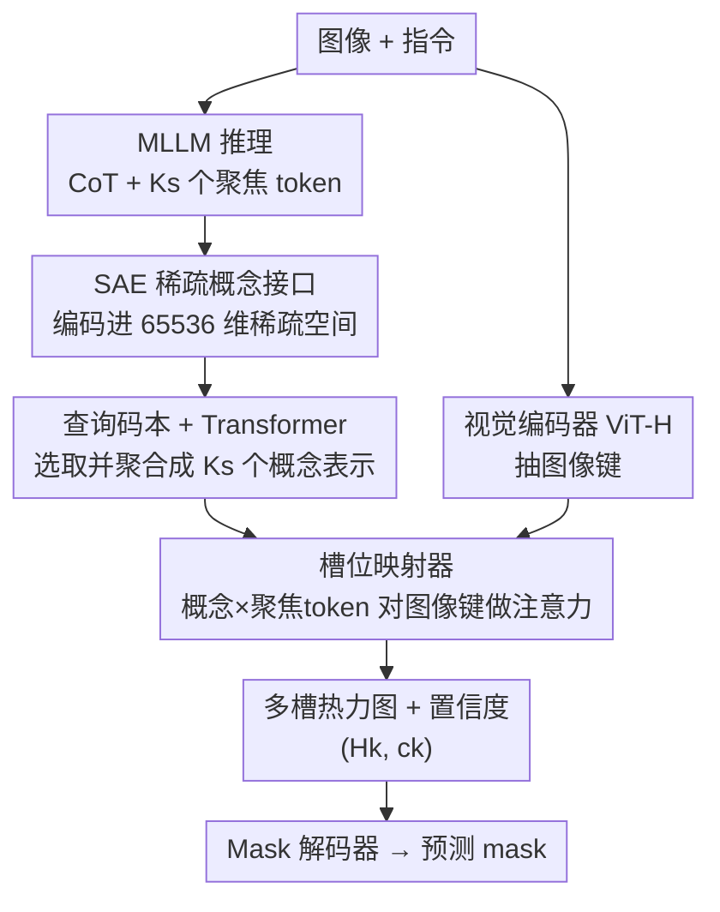

# SegCompass: Exploring Interpretable Alignment with Sparse Autoencoders for Enhanced Reasoning Segmentation

**会议**: CVPR 2026  
**arXiv**: [2605.22658](https://arxiv.org/abs/2605.22658)  
**代码**: https://github.com/ZhenyuLU-Heliodore/SegCompass (有)  
**领域**: 推理分割 / 多模态VLM / 可解释性  
**关键词**: 推理分割、稀疏自编码器、CoT、可解释对齐、GRPO

## 一句话总结
SegCompass 用稀疏自编码器（SAE）把 MLLM 的链式推理（CoT）和视觉 token 投到一个共享的高维稀疏概念空间里，再经码本聚合、槽位映射生成可观察的多槽热力图来引导分割，从而把"推理→分割"这条原本是黑盒/事后拼接的通路改造成可逐步检视的"白盒"对齐，在 5 个基准上达到或超过 SOTA。

## 研究背景与动机

**领域现状**：推理分割（reasoning segmentation）要求模型根据复杂的、多步的自然语言指令（如"分割那个颜色和盘子匹配、且离水槽最近的杯子"）定位并分割目标。主流做法是把大语言模型的组合推理能力接到一个分割模块上，目前有两条技术路线。

**现有痛点**：第一条路线是**潜在查询对齐（latent query alignment）**，代表是 LISA 系列——把 LLM 的隐状态映射成 latent query 去和视觉特征交互预测 mask。它确实端到端，但中间决策被封装在不透明的向量里，是个**黑盒**：你看不到模型究竟"想"了什么、又是凭什么定位到那块区域的。第二条路线是**文本定位读出（textual localization readout）**，代表是 Seg-Zero / VisionReasoner / Text4Seg——先用 CoT 生成离散的定位 token（框坐标、patch 索引），再当作一个独立后处理步骤喂给 SAM。它的推理过程**可读但不可解释**：CoT 不受约束、空间线索的推导过程不透明、文本 token 本身又承载不了足够的语义细节，本质是事后拼接。

**核心矛盾**：两条路线都没能在"推理过程"和"最终 mask"之间建立一条**既可解释又可验证**的连接——要么端到端但不透明，要么可读但割裂。可解释性和端到端可微之间存在缺口。

**本文目标**：造一个机制，让"推理→感知"这条通路变成白盒：每一步用了哪些语义概念、这些概念落在图像的哪块区域，都能被检视，而且整条通路可微、可端到端训练。

**切入角度**：作者注意到稀疏自编码器（SAE）学到的特征是**离散、高维、且语义可解释**的——SAE 本就是为了把 LLM 内部叠加在一起的特征解纠缠成单个可命名的概念而设计的。既然 SAE 天生擅长"把激活拆成可解释概念"，那它正好可以充当推理与分割之间的可解释桥梁。

**核心 idea**：用 SAE 当接口，把 CoT 和视觉 token 都编码进同一个稀疏概念空间，再把被激活的稀疏概念显式地接地（grounding）成多槽热力图去引导分割，用稀疏概念这个"可命名的中间表示"替代不透明的 latent query 和割裂的文本 token。

## 方法详解

### 整体框架
SegCompass 要解决的是"如何让 MLLM 的推理透明地落到分割上"。整体是一条端到端的稀疏概念通路：输入一张图 + 一条指令，MLLM 策略 $\pi_{\bm{\theta}}$ 先生成一段 CoT 推理和 $K_s$ 个"聚焦 token"（concentration tokens）；接着 SAE 在某一层把图像 token、文本 token 和 CoT 的隐状态一起编码进一个超高维稀疏空间（$d_{\text{sae}}=65536$，而 LLM 隐维 $d_\pi=4096$）；一个可学习的查询码本（query codebook）从被激活的稀疏概念里挑出显著概念、再用 Transformer 编码块聚合成 $K_s$ 个概念表示；聚焦 token 嵌入和概念表示融合成 $K_s$ 个槽位查询，去和视觉编码器（ViT-H，即 SAM 的图像编码器）抽出的图像键做注意力，由槽位映射器（slot mapper）产生可观察的多槽热力图 $(\mathcal{H}_k, c_k)$；最后 mask 解码器把热力图转成预测 mask。训练时把推理路径（用 GRPO 强化学习）和分割路径（用监督）统一在一个目标里联合优化。

### 关键设计

**1. SAE 稀疏概念接口：把推理和视觉投到可命名的共享概念空间**

这是整篇论文的核心，针对的就是 latent query "不透明"和文本 token "割裂"的痛点。SAE 把某一层的 token 隐状态 $\bm{z}\in\mathbb{R}^{T\times d_\pi}$ 经编码器 $\mathcal{E}_{\text{sae}}$ 做一次线性映射加稀疏激活，得到超完备的高维稀疏激活 $h(\bm{z})\in\mathbb{R}^{T\times d_{\text{sae}}}$（$d_{\text{sae}}\gg d_\pi$，文中取 65536）。这个空间里**每一维都像一个字典原子，只在它对应的概念出现时才激活**，因此支持集 $\mathcal{S}(\bm{z})=\{j: h_j(\bm{z})\neq 0\}$ 远小于 $d_{\text{sae}}$，得到的是稀疏、解纠缠的概念。关键在于这一编码**对文本和视觉 token 统一适用**——CoT 里提到"白色陶瓷碗"这个概念，和图像里碗那块区域的 token，会落到同一套稀疏概念基上，从而天然把"推理说了什么"和"图像哪里有"对齐起来。相比把推理压成一个不可读的 latent 向量，这里激活了哪些字典原子、激活强度多少都是显式的索引—激活对 $(j, h_j(\bm{z}))$，可做概念级归因。SAE 在主训练前用 OBELICS 的 200K 样本单独预训练（每个 backbone 各训一个），目标是重建+稀疏：

$$\mathcal{L}_{\text{sae}}(\bm{z})=\|\bm{z}-\hat{\bm{z}}\|_2^2 + \alpha\|h(\bm{z})\|_1$$

其中 $\hat{\bm{z}}=\mathcal{D}_{\text{sae}}(h(\bm{z}))$ 是线性解码重建，$\ell_1$ 项把大部分坐标压到 0、逼出紧凑的概念基，$\alpha$ 控制稀疏强度。

**2. 查询码本 + 概念聚合：从一堆稀疏激活里挑出并攒成 Ks 个槽位概念**

SAE 给出的是一大堆零散的索引—激活对，还不能直接拿去分割。这一步针对"如何把散乱的稀疏概念组织成对应若干目标的紧凑表示"。先过滤出非零激活得到 $\{(j, h_j(\bm{z}))\}_{j\in\mathcal{S}(\bm{z})}$，再用码本 $\bm{C}\in\mathbb{R}^{d_{\text{sae}}\times d_c}$ 把这些被激活的稀疏概念解码回稠密空间；然后初始化 $K_s$ 个概念表示，连同 $\{\bm{C}(h_j(\bm{z}))\}$ 一起送进带自注意力的 Transformer 编码块，聚合出 $K_s$ 个概念表示 $(\bm{r}_k)_{k=1}^{K_s}$。这一步的妙处是**保留了来源（provenance）**：哪些来自 $\mathcal{S}(\bm{z})$ 的索引、以多大权重贡献给了某个概念表示都是可追溯的，所以聚合后依然可解释。$K_s$ 是超参（槽位上限设为 6），对应一条指令里可能涉及的多个目标。

**3. 槽位映射器：把概念接地成可观察的多槽热力图**

有了概念表示，还要把它"落"到图像的具体位置上——这是连接推理与像素的最后一跳。聚焦 token 嵌入 $\bm{e}_k$ 和概念表示 $\bm{r}_k$ 先经一个轻量 MLP 拼成槽位查询 $\bm{Q}\in\mathbb{R}^{K_s\times d_q}$；视觉骨干把图像编码成图像键 $\bm{K}\in\mathbb{R}^{h\times w\times d_k}$。槽位映射器对二者做多头注意力，对每个头算注意力分数 $\bm{S}=[(\bm{Q}\bm{W}_i^Q)(\bm{K}\bm{W}_i^K)^\top/\sqrt{d_h}]_{i=1}^{N_h}$，再分两个头分别产出空间热力图和置信度：

$$(\mathcal{H}_k)_{k=1}^{K_s}=\mathcal{F}_{\text{map}}(\bm{S}),\quad (c_k)_{k=1}^{K_s}=\mathcal{F}_{\text{conf}}(\bm{S})$$

热力图 $\mathcal{H}_k$ 是每个槽位在图像上的空间足迹、$c_k$ 是该槽位的可靠性。这一步让"第 k 个概念落在图像哪块、靠不靠谱"**直接可视、可检视**，正是论文所谓"白盒"的落点。最后 mask 解码器先用三层 2D 卷积把热力图重采样到解码分辨率，再用 SAM 风格的 Two-Way Transformer 在图像键和特征图之间做双向交叉注意力，输出最终 mask $\hat{\bm{M}}=\mathcal{F}_{\text{dec}}(\bm{K},(\mathcal{H}_k,c_k))$。

### 损失函数 / 训练策略
整体目标把语言路径的强化学习和视觉路径的分割监督耦合在一起：

$$\mathcal{L}=\mathcal{L}_{\text{grpo}}+\lambda_{\textsc{s}}\mathcal{L}_{\text{seg}}+\lambda_{\textsc{c}}\mathcal{L}_{\text{conf}}$$

- **GRPO（推理路径）**：策略对每个输入采一组 $G$ 个回答，按优势算 GRPO 损失。奖励由两部分组成——**分割奖励**（对预测 mask 和 GT 做二分图匹配，每个匹配对给一个结合置信度和 mask IoU 的分数）和**格式奖励**（用一组正则检查 CoT 格式），二者归一化到 $[0,1]$，权重 0.7（分割）+ 0.3（格式）。
- **分割监督（视觉路径）**：$\mathcal{L}_{\text{seg}}=\mathcal{L}_{\text{bce}}((\mathcal{H}_k),\bm{M}_{\text{gt}})+\lambda_{\textsc{d}}\mathcal{L}_{\text{dice}}(\hat{\bm{M}},\bm{M}_{\text{gt}})$，BCE 作用在多槽热力图上鼓励空间证据集中、Dice 直接监督 mask 质量。
- **置信度损失**：$\mathcal{L}_{\text{conf}}=\frac{1}{K_s}\sum_k\mathcal{L}_{\text{bce}}(c_k,y_k)$，二值目标 $y_k$ 表示该槽位是否匹配到某个 GT 实例。所有分割/置信度损失只在匹配对上计算。
- **超参**：$\lambda_{\textsc{s}}=1.0$、$\lambda_{\textsc{c}}=0.2$、$\lambda_{\textsc{d}}=0.6$；MLLM 基础学习率 2e-6，码本/槽位映射器/mask 解码器分别乘 25×/80×/10×；AdamW（weight decay 0.01）+ OneCycleLR；8×A100 80GB。

## 实验关键数据

backbone 用三个 MLLM：Qwen2.5-VL-7B、LLaVA-1.5-7B、LLaVA-1.5-13B。在 RefCOCO(+/g)、gRefCOCO 上训练，ReasonSeg 做零样本评测。指标：RefCOCO 系列报 cIoU，gRefCOCO/ReasonSeg 报 cIoU + gIoU。

### 主实验

RefCOCO 系列（cIoU），与 27 个对比方法的代表对比：

| 数据集/split | 本文 SegCompass | 强基线 | 说明 |
|--------|------|------|------|
| RefCOCO val (13B) | 86.3 | HiMTok-8B 85.9 / X-SAM 85.1 | 几乎全 split 最优 |
| RefCOCO+ val (13B) | 80.5 | HiMTok-8B 80.5 | 持平最强 |
| RefCOCOg val (13B) | 84.0 | X-SAM-3.8B 83.8 | 略超 SOTA |
| RefCOCO+ testB (13B) | 76.9 | HiMTok-8B 76.4 | 超 SOTA |

gRefCOCO（多目标，val，13B）：gIoU 76.8 / cIoU 72.2，超过 RAS-13B（74.6/70.5）、Text4Seg-13B（74.8/69.8）。

ReasonSeg（**零样本**，test，13B）：gIoU 64.2 / cIoU 66.5，超过 VisionReasoner-7B（63.6）、HiMTok-8B（60.8/66.2）。论文还指出：用 RL 训练的方法（Seg-Zero、SAM-R1、VisionReasoner、本文）在零样本上普遍优于其他方法，说明 RL 带来泛化收益。

### 消融实验（SegCompass-13B，RefCOCOg / gRefCOCO / ReasonSeg）

| 配置 | RefCOCOg | gRefCOCO | ReasonSeg | 说明 |
|------|---------|---------|-----------|------|
| 仅 RL | 65.9 | 63.0 | 40.1 | 只有推理、无分割监督，掉得最狠 |
| 仅分割监督 | 77.9 | 74.0 | 59.3 | 有 mask 但推理弱 |
| RL + 分割监督（Full） | 81.3 | 77.3 | 66.5 | 二者互补，最优 |

视觉骨干：ViT-B(0.09B)→ViT-L(0.31B)→ViT-H(0.64B) 在 ReasonSeg 上 58.8→63.9→66.5，越大越好。

奖励配比（格式:分割）：1.0:0.0→0.5:0.5→0.3:0.7 在 ReasonSeg 上 63.9→66.2→66.5，**分割奖励贡献更大**（与分割质量直接相关，格式奖励只规范行为）。

### 关键发现
- **RL 与分割监督是强互补**：单看 ReasonSeg，仅 RL 只有 40.1、仅监督 59.3，合起来跳到 66.5——RL 强化推理、监督强化 mask 生成，复杂推理分割两者缺一不可。
- **稀疏概念质量 ↔ mask 精度强相关**（可解释性分析）：实例 token 和 CoT token 激活的稀疏特征最多，问题 token 次之，背景 token 最少，说明激活有语义选择性、聚焦在被分割对象和推理过程上；且 Qwen2.5-VL-7B 激活数更多、token 类型间分离更大，恰好对应它更强的下游结果。
- **实例覆盖率分析**：尽管 SAE 只预训练、从未见过分割监督，按激活幅度排序的 top-K% token 对实例像素的覆盖率显著高于随机 K% 基线，说明 SAE 激活天然就对所指实体敏感。
- **GRPO 组大小**：组越大性能越好（组内正负样本差异更明显），且不同组大小收敛所需总采样数差别不大，所以增大组大小近乎"免费"提分。

## 亮点与洞察
- **把 SAE 从"分析工具"变成"可微接口"**：以往 SAE 主要用来事后分析 LLM 内部机制、控制不安全输出；本文第一次把它接进下游分割任务、端到端训练，让稀疏概念既能解释推理又能引导分割头——这个"用解释器当桥梁"的思路很巧。
- **统一推理与视觉两条异质优化路径**：语言侧用 GRPO（无可微监督信号）、视觉侧用监督 Dice/BCE，二者在一个目标里联合优化且互补提分，给"RL 推理 + 监督感知"的混合训练提供了一个干净范式。
- **可解释性不是花瓶，而是和精度挂钩的**：论文用激活模式、实例覆盖率两组分析定量证明"学到的稀疏概念质量越好、mask 越准"，把"可解释"从定性口号做成了可测的相关性——这点对后续做可信视觉系统很有借鉴。
- **多槽热力图天然支持多目标**：$K_s$ 个槽位 + 置信度 + 二分图匹配，让 gRefCOCO 这类"一条指令多个目标"的场景有了自然的输出结构，可迁移到任意需要"一指令多实例"接地的任务。

## 局限与展望
- **依赖逐 backbone 预训练 SAE**：每个 MLLM backbone 都要单独用 200K OBELICS 样本预训一个 65536 维 SAE，换 backbone 成本不低，且 SAE 质量上限会卡住整体可解释性。
- **稀疏概念"可解释"的程度仍偏定量**：论文证明了激活有语义选择性、和 mask 精度相关，但单个字典原子是否真对应人能命名的概念（如"白色陶瓷碗"），主要靠可视化举例，缺乏大规模的概念命名/一致性评估。
- **GRPO 训练开销**：每个输入要采一组 $G$ 个回答 + 8×A100，rollout 成本对复现不友好；group size 虽提分但也增加采样负担。
- **槽位上限固定为 6**：超过 6 个目标的指令如何处理、$K_s$ 设定对超多目标场景的影响，文中未充分讨论。

## 相关工作与启发
- **vs 潜在查询对齐（LISA / GLaMM / RAS / X-SAM 等）**：它们把 LLM 隐特征解码成 mask，端到端但中间是黑盒；SegCompass 用 SAE 把中间表示摊成可命名的稀疏概念，**同样端到端却可逐步检视**，且在 RefCOCO/gRefCOCO 上多数 split 持平或更优。
- **vs 文本定位读出（Seg-Zero / VisionReasoner / Text4Seg / SAM4MLLM）**：它们先用 CoT 生成框/patch 文本 token 再喂 SAM，是割裂的事后步骤、空间线索推导不透明；SegCompass 的稀疏概念→热力图通路是可微、连贯的，且同样用 GRPO 训练却因稀疏概念接口表现更好。
- **vs SAE-V 等 SAE 可解释性工作**：SAE-V 把 SAE 范式扩展到多模态 LLM 做解纠缠分析，本文在此基础上更进一步——**把可解释表示对齐到下游分割任务**，让 SAE 从"看懂模型"走向"参与决策"。

## 评分
- 新颖性: ⭐⭐⭐⭐⭐ 首次把 SAE 作为可微接口接进推理分割，开辟"白盒对齐"第三条路线
- 实验充分度: ⭐⭐⭐⭐ 5 基准 + 27 对比方法 + 训练模式/骨干/奖励/组大小消融，但 SAE 概念命名的人工评估偏弱
- 写作质量: ⭐⭐⭐⭐ 三路线对比清晰、pipeline 公式完整，部分模块（slot mapper 维度变换）需对照图才好懂
- 价值: ⭐⭐⭐⭐ 给"可解释 + 高性能可兼得"提供了可测的范式，对可信视觉系统有借鉴

<!-- RELATED:START -->

## 相关论文

- [\[CVPR 2026\] DPAD: Discriminative Perception via Anchored Description for Reasoning Segmentation](discriminative_perception_via_anchored_description_for_reasoning_segmentation.md)
- [\[CVPR 2026\] Fast Reasoning Segmentation for Images and Videos](fast_reasoning_segmentation_for_images_and_videos.md)
- [\[ECCV 2024\] ColorMAE: Exploring Data-Independent Masking Strategies in Masked AutoEncoders](../../ECCV2024/segmentation/colormae_exploring_data-independent_masking_strategies_in_masked_autoencoders.md)
- [\[CVPR 2026\] VIRST: Video-Instructed Reasoning Assistant for SpatioTemporal Segmentation](virst_video-instructed_reasoning_assistant_for_spatiotemporal_segmentation.md)
- [\[CVPR 2026\] VGGT-Segmentor: Geometry-Enhanced Cross-View Segmentation](vggt-segmentor_geometry-enhanced_cross-view_segmentation.md)

<!-- RELATED:END -->
