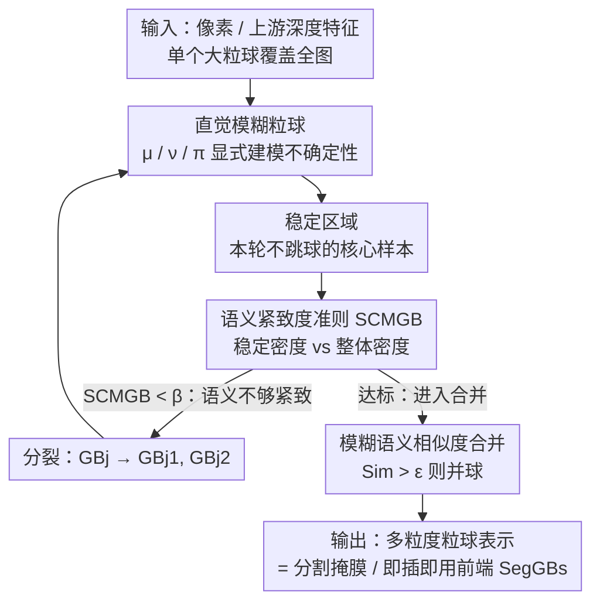

# SegGBC: Justifiable Coarse-to-Fine Granular-Ball Computing for Enhancing Clustering Image Segmentation

**会议**: CVPR 2026  
**论文**: [CVF Open Access](https://openaccess.thecvf.com/content/CVPR2026/html/Chong_SegGBC_Justifiable_Coarse-to-Fine_Granular-Ball_Computing_for_Enhancing_Clustering_Image_Segmentation_CVPR_2026_paper.html)  
**代码**: 无  
**领域**: 语义分割（无监督聚类分割 / 粒球计算）  
**关键词**: 粒球计算, 无监督分割, 聚类分割, 直觉模糊集, 多粒度表示

## 一句话总结
SegGBC 第一次把"粒球计算（Granular-Ball Computing）"这套粗到细的多粒度聚类范式搬到图像分割上，用直觉模糊集显式建模图像里的内在不确定性、用一个语义感知的"语义紧致度准则（SCMGB）"指导粒球的分裂与合并，既能独立做无监督分割、又能当即插即用前端把已有聚类分割方法的 SA / mIoU 各拉高 3% 以上。

## 研究背景与动机

**领域现状**：像素级密集标注代价太高，于是无监督的"聚类分割方法（Clustering-based Segmentation Method, CSM）"很受欢迎——它无需训练、表示显式，直接按特征相似度把图像元素聚成几个区域。CSM 主要有两条路线：**像素级**（把每个像素当独立样本，按色调/位置聚类，常再加空间约束保持物体内相关性）和**簇级**（在中间表示上聚类，或直接约束像素簇、或借预训练深度特征隐式编码语义）。

**现有痛点**：无论像素级还是簇级，这些 CSM 都被钉死在**单一、固定的粒度**上分析。像素级计算量爆炸、又抓不住高阶语义；簇级则受困于单尺度语义、鲁棒性差、对形态变化带来的高不确定性束手无策。固定粒度导致分割经常欠优——要么过分割、要么把语义不同但视觉相似的区域并到一起。

**核心矛盾**：图像分割天然需要**多尺度**地看问题（大区域要粗、边界细节要细），而传统聚类只在一个粒度上迭代更新质心和"点到质心距离"，无法兼顾粗细。粒球计算（GBC）恰好用"全局优先"原则——从覆盖整个数据集的一个大粒球出发，靠质量准则驱动递归"分裂—合并"得到最终簇，天然是多粒度、低开销的。但 GBC 此前只用在传统数据挖掘里，迁到图像上有两个硬骨头没人啃：**i) 怎么刻画图像内部的不确定性（噪声、低对比、模糊边界）以免精度崩**；**ii) 怎么设计一个对齐图像属性、可辩护（justifiable）、语义感知的质量准则**——纯几何指标（纯度、半径）根本编码不了语义连贯性。

**本文目标 / 切入角度**：作者主张，把 GBC 用到分割上，必须同时补上"不确定性表示"和"语义质量准则"两块短板。观察是：图像的不确定性既有几何上的（粒球能处理），也有源于噪声/低对比/模糊边界的**认知不确定性**——后者正好是直觉模糊集（IFS）的强项（用犹豫度 π 显式建模"说不清属不属于"的部分）。

**核心 idea**：用 IFS 把每个粒球升级成"直觉模糊粒球"显式量化不确定性，再设计语义紧致度准则 SCMGB（结合粒球的"稳定区域"和整体密度）来裁决粒球该不该分裂，最后用融合几何+模糊语义的相似度来决定合并——构成首个面向分割的 GBC 框架 SegGBC，且可即插即用增强已有 CSM。

## 方法详解

### 整体框架
SegGBC 输入是图像的特征向量集 $X=\{x_1,\dots,x_n\}\in\mathbb{R}^d$（可以是原始像素，也可以是上游深度特征），输出是图像的多粒度粒球表示与最终聚类（即分割掩膜）。整条流水线是一个"粗到细"的过程：先用一个大粒球覆盖全图，然后反复地"按质量准则分裂、按相似度合并"，直到所有粒球都达标。

四个核心环节串起来是：(1) 把每个粒球做成**直觉模糊粒球**，用隶属/非隶属/犹豫三度显式编码球内不确定性，并据此修正球的半径与中心；(2) 在每个球里界定一个**稳定区域**——区域内的样本本轮铁定不会跳到邻球，既给后续准则提供稳健的"原型核心"，又省掉大量冗余计算；(3) 用**语义紧致度准则 SCMGB**（结合稳定区域密度与整体密度）判断一个球是否语义足够紧致，不达标就分裂；(4) 用**模糊语义相似度**判断相邻球是否该合并。分裂把粒度变细、合并把语义相近的区域抱团，二者拉锯到收敛。

### 关键设计

**1. 直觉模糊粒球：用犹豫度把图像的内在不确定性写进粒球**

传统粒球只有 $GB(c, r)$——中心 $c_j=\frac{1}{|GB_j|}\sum_i x_i$、半径 $r=\max_i \|x_i-c_j\|_2$，纯几何，对噪声、低对比、模糊边界这类图像不确定性完全无感，强行套到图像上精度就崩。SegGBC 把直觉模糊集（IFS）嵌进粒球：对球内样本 $x_i$ 相对中心 $c_j$，用两个不同尺度的高斯衰减算出隶属度和非隶属度

$$\mu_{GB_j}(x_i)=\exp\!\left(-\frac{\|x_i-c_j\|_2}{\sigma_m^2}\right),\quad \nu_{GB_j}(x_i)=1-\exp\!\left(-\frac{\|x_i-c_j\|_2}{\sigma_n^2}\right),$$

再得犹豫度 $\pi_{GB_j}(x_i)=1-\mu_{GB_j}(x_i)-\nu_{GB_j}(x_i)$。关键约束是 $\sigma_m\neq\sigma_n$ 且 $\sigma_m>\sigma_n$——一旦 $\sigma_m=\sigma_n$，模型就退化成普通模糊集，犹豫度恒为零、不确定性建模就废了。作者用最大粒球半径 $r_{max}$ 把这两个尺度参数化：$\sigma_m=\alpha\cdot r_{max}$、$\sigma_n=(1-\alpha)\cdot r_{max}$，取 $\alpha\in(0.5,1)$ 才能保证非对称、真正建模不确定性。

有了犹豫度，球的半径和中心也被改写得更鲁棒：$r_{max}=\max_i(\|x_i-c_j\|_2+\pi_{GB_j}(x_i))$、$c_j=\frac{1}{|GB_j|}\sum_i(x_i+\theta[\pi_{GB_j}(x_i)])$，其中 $\theta[\cdot]$ 把犹豫度这个标量广播成向量。这样几何距离和"说不清"的不确定性被同时纳入分裂—合并决策，相比纯距离的粒球，能把模糊边界、噪声点处理得稳得多。这是它补上 GBC 第一块短板（不确定性表示）的核心。

**2. 稳定区域：用一个"铁定不跳球"的核心区同时换来鲁棒性和效率**

直接用最大距离当半径对离群点极其敏感，改用平均半径 $r_{avg}=\frac{1}{|GB_j|}\sum_i(\|x_i-c_j\|_2+\pi_{GB_j}(x_i))$ 虽不敏感，却又带来两个新问题：计算量大、且仍然没有语义感知。SegGBC 的破法是定义一个**稳定区域**——以中心 $c_j$ 为心、半径 $r_{sta}$ 的球形区，区内样本"簇隶属高度稳定"。作者用 Theorem 1 给了可辩护的依据：稳定区内的样本本轮迭代铁定不会被重分配到任一相邻粒球。其半径为

$$r_{sta}=\frac{1}{2}\min_{GB_a\in N\{GB_j\}}\!\left(\|c_j-c_a\|_2+\Delta\pi_{ja}\right),\quad \Delta\pi_{ja}=\pi_{GB_j}(x)+\pi_{GB_a}(x),$$

即取到所有邻球的"距离+犹豫度之和"的最小值再折半。直觉上，当一个样本把几何距离和犹豫度合起来看时，它对本球 $GB_j$ 的不确定性低于对所有邻球的不确定性，就不会跑。这一招的妙处是一箭双雕：稳定区内的样本是更具代表性的"原型"，能抓住簇的核心密度与语义结构，于是后续准则只在这个可信核心上算就够了——既排除了不确定区域的冗余运算（大幅省时），又让度量更稳。

**3. 语义紧致度准则 SCMGB：一个落在 [0,1]、语义感知、可辩护的分裂裁判**

GBC 迁到图像最缺的就是"该不该分裂"的语义准则——纯半径/纯纯度准则只看分布、不看语义，会过早收敛或过度分裂。SCMGB 同时考虑半径和密度，用三种粒球密度来刻画：最大半径密度 $\rho^{max}_{GB_j}=|GB_j|/r_{max}^d$、平均半径密度 $\rho^{avg}_{GB_j}$（落在 $r_{avg}$ 内的样本数除以 $r_{avg}^d$）、以及结合稳定区的稳定密度 $\rho^{sta}_{GB_j}$（落在 $r_{sta}$ 内的样本数除以 $r_{sta}^d$）。准则定义为

$$SCMGB=\frac{\min(\rho^{avg}_{GB_j},\rho^{max}_{GB_j})\cdot\min(\rho^{sta}_{GB_j},\rho^{max}_{GB_j})}{\max(\rho^{avg}_{GB_j},\rho^{max}_{GB_j})\cdot\max(\rho^{sta}_{GB_j},\rho^{max}_{GB_j})}.$$

作者用 Theorem 2 证明它恒在 $[0,1]$：分子分母都是 min/max 配对，必然 $\le 1$。语义上，当稳定密度 $\rho^{sta}$ 越接近整体（平均）密度 $\rho^{avg}$，SCMGB 越趋近 1，说明球内分布越稳定、语义越一致；反之偏小说明球里混了语义不同的区域，需要分裂。算法据此设阈值 $\beta$（默认 0.8）：只要还存在 $SCMGB_j<\beta$ 的球就把它一分为二，直到全部达标。它强制"球内一致 + 球间分离"，既减少过分割、又锐化边界，是 SegGBC 补上第二块短板（语义质量准则）的核心。

**4. 模糊语义相似度合并：让"视觉像但语义不同"的区域不再被错并**

光分裂会把图切得过碎，还需要合并把语义相近的相邻球抱团。传统合并只看几何距离，常把视觉相似但语义不同的区域并到一起。SegGBC 改用融合"模糊语义"的相似度：

$$Sim(GB_i,GB_j)=\frac{1}{2}\left[\frac{\sum \mu_{GB_i}(x)\mu_{GB_j}(x)}{\sqrt{\sum\mu_{GB_i}^2}\sqrt{\sum\mu_{GB_j}^2}}+(1-\Delta\pi_{ij})\right],$$

前一项是两球隶属度的余弦相似（语义对齐），后一项 $(1-\Delta\pi_{ij})$ 奖励犹豫度低、即关系明确的配对。当 $Sim>\varepsilon$（默认 0.75）且满足几何邻接条件时才合并。把语义相似度摆在几何距离之前，就有效压住了"过度合并"。分裂（变细）与合并（抱团）一推一拉，最终收敛出语义连贯的分割。

### 一个例子：粒球从 23 个收敛到语义分区
作者在 NI 3 上可视化了整个粗到细过程：初始阶段有 23 个大小不一的异质粒球（SA=53.69%），这是多尺度粒化策略的直接体现；随后在合并准则驱动下，语义相似区域被整合，粒球数骤降到 9 个（SA 升到 77.86%）——这一步对应分割精度的大幅跃升；最终收敛（SA=95.87%），得到语义上有意义的图像分区。这个"23 → 9 → 收敛"的轨迹很直观地说明了 SCMGB 分裂 + 相似度合并是怎么一步步把图割对的。

### 损失函数 / 训练策略
SegGBC 是**无需训练、training-free** 的聚类方法，没有可学习参数，整套流程由 Algorithm 1 驱动：初始化直觉模糊粒球（式 6–9）→ 算 $r_{avg}$、$r_{sta}$（式 10–11）→ 算 SCMGB（式 13–16）→ while 仍有 $SCMGB_j<\beta$ 就分裂 → 最后对满足 $Sim(GB_i,GB_j)>\varepsilon$ 的相邻球做合并。关键超参为分裂阈值 $\beta=0.8$、合并阈值 $\varepsilon=0.75$、模糊非对称系数 $\alpha\in(0.5,1)$。当它作为即插即用前端 SegGBs 增强别的 CSM 时，则不用自带的相似度合并，而是把多粒度粒球表示喂给下游方法各自的分类/聚类流程。

## 实验关键数据

数据集与协议：单图协议用自然图像 BSD500、DUST 与遥感图像 LoveDA 做像素级 CSM 评测；图像集协议把图缩到 2/3 再裁成 128×128 patch，在 COCO-Stuff 与 COCO-Stuff-3 上做簇级 CSM 评测。指标含 SA（分割精度）、F1、NMI、mIoU、PixelAcc 与时间消耗 mTC/TC。

### 主实验：自然图像 7 张（7-NI）
SegGBC 在所有像素级、簇级、以及其他粒球方法（Ball k-means、MGNR）上全面领先，且耗时最低。

| 方法 | 类型 | 7-mIoU(%)↑ | mTC(s)↓ | 备注 |
|------|------|-----------|---------|------|
| DeepCut [ICCV'23] | 簇级(隐式) | 52.73 | 11.60 | 深度特征聚类 |
| FLRSC [TFS'23] | 簇级(超像素) | 49.36 | 7.69 | — |
| Ball k-means [TPAMI'22] | 粒球 | 59.50 | 2.87 | 此前最强粒球法 |
| MGNR [TPAMI'24] | 粒球 | 57.32 | 3.76 | — |
| **SegGBC (本文)** | 粒球+IFS | **68.76** | **2.06** | 7-mIoU 超次优 9.26 点，耗时最低 |

在单图指标上，SegGBC 在 NI 6 / NI 7 的 SA 分别领先 8.53 / 8.79 点，NI 1 的 NMI 领先达 31.8 点；遥感图（3-RSI）上 3-mIoU 达 62.10%、超次优 4.41 点，且同样耗时最低。作者也指出多数粒球方法在 RSI 上掉点明显（RSI 范围大、目标分布复杂，挑战粒球稳定性），而 SegGBC 仍稳住。

### 即插即用增强：SegGBs 当前端
把 SegGBs 当数据表示前端接到已有方法上，普遍涨点，且越弱的方法涨得越猛。

| 基线 + SegGBs | 数据/指标 | 提升 |
|---------------|-----------|------|
| DFKM + SegGBs | NI 2 / SA | **+38.22** 点 |
| RLFCM + SegGBs | NI 7 / SA | +18.79 点 |
| PiCIE+H + SegGBs | COCO-Stuff-3 / mIoU | 52.51→**79.93**（+27 点以上）|
| DeepClu + SegGBs | COCO-Stuff-3 / PixelAcc | +17.61 点 |
| IRCIS + SegGBs | COCO-Stuff / PixelAcc | +13.45 点 |

摘要给出的保守下界是：在标准图像与 COCO-Stuff 上至少 +3.25% SA、+3.92% mIoU。"每个被接入的方法都涨"这一点，是它即插即用通用性的有力证据。

### 消融实验（NI 7 / RSI 3，SA(%) / TC(s)）
| 配置 | IFS/FS | 稳定区 SCMGB | NI 7 SA | RSI 3 SA |
|------|--------|--------------|---------|----------|
| 传统粒球 w/ $r_{max}$ | — | ✗ | 63.34 | 53.69 |
| 传统粒球 w/ $r_{avg}$ | — | ✗ | 69.20 | 60.60 |
| 传统粒球 w/ $r_{sta}$ | — | ✓ | 76.97 | 62.34 |
| 模糊粒球 w/ $r_{avg}$ | IFS | ✗ | 72.80 | 67.29 |
| 模糊粒球 FS+$r_{sta}$ | FS | ✓ | 80.86 | 74.65 |
| **SegGBC：IFS+$r_{sta}$** | IFS | ✓ | **96.83** | **82.91** |

### 关键发现
- **IFS 与 SCMGB 缺一不可且高度协同**：单看 IFS，相比传统模糊在 NI 7 / RSI 3 的 SA 至少提升 15.97 / 8.26 点；单看 SCMGB（稳定区准则），把 SA 从 72.80% 拉到约 94.83%（+22.03 点）、RSI 3 上 +15.62 点。两者叠加（完整 SegGBC）才打到 96.83 / 82.91，远超任一单项。
- **稳定区不仅提精度还省时**：对比 $r_{max}$/$r_{avg}$ 配置，带 $r_{sta}$ 的版本 TC 普遍更低（如 NI 7 从 3.16/3.91 降到 2.09/2.72），印证"排除不确定区冗余运算"带来的效率收益——这在多数方法"精度上去时间也上去"的背景下尤为难得。
- **粗到细收敛清晰可见**：NI 3 上粒球数 23→9→收敛、SA 53.69%→77.86%→95.87%，直观验证分裂+合并机制的有效性。
- **遥感是软肋也是亮点**：多数粒球法在 RSI 上崩盘，SegGBC 仍领先（RSI 3 上 SA 至少 +11.79、NMI +6.66 点），但作者也承认高分辨率 RSI 上开销不小。

## 亮点与洞察
- **把两类不确定性显式拆开建模**：粒球本身处理几何不确定性，IFS 的犹豫度 $\pi$ 专管图像噪声/低对比/模糊边界这类认知不确定性——两者互补而非重复，这个分工很干净，也是它能稳住模糊边界的根因。
- **"稳定区域"是性价比极高的一招**：一个有定理（Theorem 1）兜底的"本轮不跳球"核心区，同时换来鲁棒原型、语义密度估计、和算力节省三件事，是典型的"一个机制解决多个问题"的好设计，值得迁移到其他需要在线维护簇成员的聚类/分割任务。
- **SCMGB 的"可辩护性"**：作者刻意强调 justifiable——准则不是拍脑袋设的相似度，而是有 $[0,1]$ 闭区间证明、有明确语义解读（稳定密度 vs 整体密度越接近越稳定）的度量，这比很多工程化的启发式准则更扎实。
- **training-free 还能当即插即用前端**：无需训练、无可学习参数，却能把别人训练好的深度聚类方法（PiCIE 等）再拉高一大截，说明"好的多粒度表示"本身就是稀缺资源，这个定位很聪明。

## 局限与展望
- **作者自承**：依赖手工调的超参（$\alpha,\beta,\varepsilon$），语义准则是固定、非学习的；对强局部变化敏感；在高分辨率遥感图上开销不小。展望是把 SCMGB 做成可微、可在深度网络里学习的模块，让参数与梯度、纹理一起优化以提升语义保真度、鲁棒性与效率。
- **评测规模偏小**：主表只用 7 张自然图 + 3 张遥感图做单图比较，虽然作者解释"很多 CSM 本就按单图测、全数据集不可行"，但 7 张图上动辄 8 点、31 点的领先，统计意义和泛化性需保留态度；COCO-Stuff 的增强实验则更有说服力。
- **超参敏感性留给了补充材料**：$\beta=0.8$、$\varepsilon=0.75$、$\alpha\in(0.5,1)$ 的选取与敏感性分析没在正文展开，而这些阈值直接决定分裂/合并行为，复现时可能踩坑。
- **依赖上游特征质量**：当输入是深度特征时，分割上限实际被特征提取器锁定；纯像素输入时又只能靠颜色/位置，复杂纹理场景下语义能力有限。

## 相关工作与启发
- **vs 传统粒球聚类（Ball k-means / GB-spectral / MGNR）**：它们把粒球用在传统数据挖掘，质量准则只看分布（半径、纯度），迁到图像就因"无不确定性建模、无语义准则"而掉点（RSI 上尤甚）。SegGBC 用 IFS 补不确定性、用 SCMGB 补语义，是首个真正面向图像分割的 GBC 框架，主表上对 Ball k-means/MGNR 三指标平均领先 10 点以上。
- **vs 像素级 CSM（RLFCM / MK-SPCM）**：它们在单一像素粒度加空间约束，计算重且抓不住高阶语义；SegGBC 的多粒度粒球既粗能成片、又细到边界，且耗时反而最低。
- **vs 簇级深度 CSM（PiCIE / DeepCut / DeepClu / I2Clu / IRCIS）**：它们靠预训练深度特征隐式编码语义但仍是单尺度。SegGBC 不与它们正面竞争，而是当即插即用前端把它们再拉高（PiCIE+H 的 mIoU +27 点），定位互补而非替代。
- **启发**：把"显式不确定性度量（IFS 犹豫度）+ 可辩护的语义密度准则"嵌进任何"分裂—合并"型层次聚类，可能是无监督结构化预测（分割、超像素、点云聚类）通用的提质路径；"稳定区域"这种带定理保证的成员稳定子集，也可推广到在线聚类的加速。

## 评分
- 新颖性: ⭐⭐⭐⭐ 首次把粒球计算系统性迁到图像分割，IFS 不确定性 + SCMGB 语义准则两个补丁都对症，组合新颖。
- 实验充分度: ⭐⭐⭐ 增强实验与消融扎实、协同效应清晰，但主表只用 7+3 张图做单图比较，规模偏小、超参敏感性藏在补充材料。
- 写作质量: ⭐⭐⭐⭐ 动机—痛点—方法逻辑顺、两个定理给准则兜底，公式与算法完整，可读性好。
- 价值: ⭐⭐⭐⭐ training-free 且即插即用、跨方法普遍涨点、耗时最低，对无监督分割与粒球计算社区都有实际价值。

<!-- RELATED:START -->

## 相关论文

- [\[CVPR 2026\] Universal 3D Shape Matching via Coarse-to-Fine Language Guidance](universal_3d_shape_matching_via_coarse-to-fine_language_guidance.md)
- [\[ECCV 2024\] Active Coarse-to-Fine Segmentation of Moveable Parts from Real Images](../../ECCV2024/segmentation/active_coarsetofine_segmentation_of_moveable_parts_from_real.md)
- [\[CVPR 2026\] High-Precision Dichotomous Image Segmentation via Depth Integrity-Prior and Fine-Grained Patch Strategy](high-precision_dichotomous_image_segmentation_via_depth_integrity-prior_and_fine.md)
- [\[CVPR 2026\] SouPLe: Enhancing Audio-Visual Localization and Segmentation with Learnable Prompt Contexts](souple_enhancing_audio-visual_localization_and_segmentation_with_learnable_promp.md)
- [\[CVPR 2026\] CDICS: Delving Into Fine-Grained Attribute for In-Context Segmentation via Compositional Prompts and Phased Decoupling](cdics_delving_into_fine-grained_attribute_for_in-context_segmentation_via_compos.md)

<!-- RELATED:END -->
