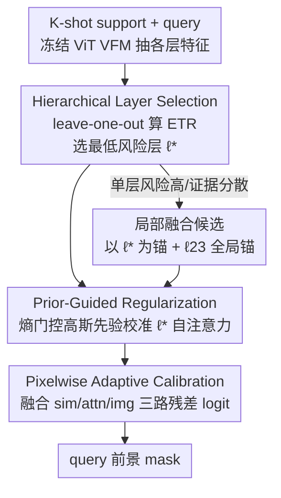

# Selective, Regularized, and Calibrated: Harnessing Vision Foundation Models for Cross-Domain Few-Shot Semantic Segmentation

**会议**: CVPR 2026  
**arXiv**: [2605.19340](https://arxiv.org/abs/2605.19340)  
**代码**: https://zhiyuan624.github.io/HERA-CDFSS/ (项目主页)  
**领域**: 语义分割 / 跨域小样本 / 视觉基础模型  
**关键词**: 跨域小样本分割, 视觉基础模型, 测试时自适应, 层选择, 注意力正则

## 一句话总结
HERA 把视觉基础模型（VFM）用于跨域小样本分割时的失败拆成「层敏感 + 注意力噪声 + 像素误差」三层问题，提出 select-regularize-calibrate 三阶段框架：先按 episode 自适应选出最稳的那一层（HLS），再用熵门控高斯先验正则该层的自注意力（PGR），最后融合多路残差校准像素预测（PAC），全程冻结 backbone、测试时只微调 <2.7% 参数、不碰源数据，就在四个 CD-FSS benchmark 上超过 SOTA 4.1+ mIoU。

## 研究背景与动机
**领域现状**：小样本语义分割（FSS）靠 support–query 对学习类无关的对应关系，从 base 类迁移到 novel 类，在同分布下泛化很好。跨域小样本分割（CD-FSS）则要求在「未见目标域 + novel 类 + 只有几张标注 support」三重约束下做像素级预测。现有 CD-FSS 方法几乎全是 CNN backbone，要么在源数据上做域泛化训练，要么挖跨图对应关系。

**现有痛点**：CNN 路线代价高、依赖源数据，卷积归纳偏置限制长程推理，分布偏移下稀疏标注容易过拟合。直觉上换成 VFM（DINOv3、SAM、CLIP 这类大规模预训练 ViT）能拿到更强更可迁移的表征，但直接用 VFM 做 CD-FSS 会撞上两个新麻烦：(1) novel 类只有几张标注，相对 VFM 的预训练规模实在太少，重训极易过拟合且需要源数据；(2) 目标域分布在预训练里覆盖不足，导致**跨域不一致**和**层间敏感性**——VFM 不同层在分布偏移下的可迁移性差异巨大，要么整体冻结、要么所有层一起微调都不可靠。

**核心矛盾**：作者实证发现（DINOv3 为例），ViT 的 0–11 层强调低信噪比的边缘纹理，12–23 层给出更锐利边界的类无关 objectness，语义在 11–12 层附近发生跃迁；但**最优层会随 episode 和域漂移**，任何固定层选择都很脆弱。问题的根因不是 VFM 表征能力不够，而是**层级可迁移性波动 + head 级交互噪声**没被处理好。

**本文目标**：在「不访问源数据、不做源/目标域重训、只用 episode 内几张 support」的 source-free 测试时自适应设定下，让冻结的 VFM 稳定迁移到新域。子问题拆成：选对工作层、净化该层注意力、校准最终像素预测。

**切入角度**：既然误差是从表征逐级级联到预测的，就按「表征 → 交互 → 像素」自顶向下逐级修正，而不是单点打补丁。每个 episode 用 leave-one-out 从 support 自己造伪查询来估计风险，把「选层」变成有数据依据的可计算量，而非启发式打分。

**核心 idea**：用「逐 episode 选最低风险层（select）→ 熵门控先验正则注意力（regularize）→ 多路残差校准像素（calibrate）」的层级流水线，引导冻结 VFM 适配新域，测试时只更新 <2.7% 参数。

## 方法详解

### 整体框架
HERA（Hierarchical Exemplar Representation Adaptation）输入是一个 episodic $K$-shot 任务——$K$ 张带 mask 的 support $\mathcal{S}=\{(I_s^i,M_s^i)\}_{i=1}^K$ 加一张 query $I_q$，输出是 query 的前景 mask。整条管线在**冻结的 ViT VFM**（默认 DINOv3）上做测试时自适应，分三阶段自顶向下：

第一阶段 **HLS** 解决「用哪一层」：对候选层（限定在 12–23 这个语义稳定带）逐 episode 计算一个数据依赖的 Exemplar Transfer Risk（ETR），选风险最低的层 $\ell^\star$（可以是单层，也可以是以最优单层为锚的局部融合），并只在该层微调极少参数。第二阶段 **PGR** 解决「这层注意力很脏」：在 $\ell^\star$ 上用 head-wise、熵门控的高斯先验校准自注意力，强化局部性、压掉远场虚假峰，同时保留必要的全局覆盖。第三阶段 **PAC** 解决「像素还有残差」：把选中表征、净化后的注意力图、query 原型对比图融成几路轻量残差 logit，加到基础 logit 上校准像素预测，专门修薄边界和低对比区。三阶段串成一条从表征到预测的 select–regularize–calibrate 层级路径，全程 backbone 冻结、峰值显存仅 4.2GB、可训练参数 <2.7%。

### 关键设计

**1. Hierarchical Layer Selection（HLS）：用数据依赖的迁移风险逐 episode 选层**

针对「VFM 层级可迁移性随 episode/域剧烈波动、固定层很脆」这个根因痛点。HLS 不用启发式打分（语义/结构/复杂度分），而是直接用任务对齐的指标：在每个 episode 内用 leave-one-out 把 support 自己当伪查询。第 $i$ 次迭代把 $(I_s^i,M_s^i)$ 当伪查询，其余 support 算原型 $\mathbf{P}_s^i$，在候选层 $\ell$ 抽伪查询特征 $\mathbf{F}_q^i$，定义 Exemplar Transfer Risk 为「1 减去平均伪查询 mIoU」：

$$\mathcal{R}_{\text{layer}}(\ell)=1-\frac{1}{K}\sum_{i=1}^{K}\mathrm{mIoU}\big(\cos(\mathbf{P}_s^{i},\mathbf{F}_q^{i}),M_q^{i}\big),\qquad \ell^\star=\arg\min_{\ell\in\mathcal{C}}\mathcal{R}_{\text{layer}}(\ell)$$

其中伪查询 ground truth $M_q^i$ 就是该 support 自己的 mask $M_s^i$。候选集 $\mathcal{C}$ 限定在语义稳定带 $\{12,\dots,23\}$。选定 $\ell^\star$ 后冻结 backbone，只用同样的 leave-one-out 构造、以二元分割 BCE loss 微调一个极小参数集 $\phi$（单层路由只更新该层 `mlp.fc`，融合路由只更新 `fusion-mlp.fc`），$\mathcal{L}_{\text{TTA}}=\frac{1}{K}\sum_i\mathrm{BCE}(\cos(\mathbf{P}_s^{i,\ell^\star},\mathbf{F}_q^{i,\ell^\star}),M_q^i)$。这一步是整个框架贡献最大的（消融里单独加 HLS 就涨 +13.6 mIoU），因为它把「选层」从拍脑袋变成有 episode 证据支撑、且和最终分割任务对齐的最小化问题。

**2. 局部融合候选：单层易碎时用近邻加权融合补稳**

针对「单层路由在薄结构、遮挡、杂乱场景下脆弱，且最优层会在域内 episode 间抖动」。HLS 不止挑一个最优单层 $\ell_{\text{single}}$，还以它为中心构造一个紧凑的局部融合候选池 $\mathcal{U}$，并强制把最后一层 $\ell_{23}$ 纳入每个融合候选当全局上下文锚（补偿遮挡和碎裂形状）。融合权重综合「单层风险 $r_\ell$」和「到 $\ell_{23}$ 的距离」：

$$w_\ell=\frac{\exp(-\beta r_\ell-\mathrm{dist}(\ell,\ell_{23})/\tau)}{\sum_{j\in U}\exp(-\beta r_j-\mathrm{dist}(j,\ell_{23})/\tau)},\qquad F^U=\sum_{\ell\in U}w_\ell F^\ell$$

$\beta$ 控制对风险证据的依赖、$\tau$ 是偏好深层语义聚合的局部带宽：$\beta\to\infty$ 退化为单层 argmin，$\tau\to\infty$ 则局部项消失。当证据分散在相邻几层时，适中的 $\tau$ 在「证据」和「聚合」间折中，降低路由不稳定。所有候选（单层 + 融合）统一用 ETR 评估，开销可忽略。

**3. Prior-Guided Regularization（PGR）：熵门控高斯先验逐 head 校准注意力**

针对「选对层后，head 级自注意力在分布偏移下仍很脏——有远场虚假长程连接、近邻覆盖不足、边界细、且 head 间异质性强，统一的 head-agnostic 先验不够用」。PGR 给每个 head 注入一个以 query 为中心的高斯先验 $\phi(p_j;p_i,\sigma)=\exp(-\|p_j-p_i\|^2/2\sigma^2)$，并用一个**熵门控**自适应决定该 head 用多锐的先验。令 $\bar H_q^{(h)}$ 是 $QK^\top$ logits 的平均行熵（衡量全局分散度）、$\bar H_k^{(h)}$ 是 $KK^\top$ 的（衡量局部稳定性），用温度 $\alpha$ 的 logistic 门 $g(\cdot)$：

$$\gamma_h=g(\alpha(\bar H_q^{(h)}-\bar H_k^{(h)})),\qquad \sigma_h=(1-\gamma_h)\sigma_{\text{glo}}+\gamma_h\sigma_{\text{loc}}$$

局部性强、置信度高的 head（$\bar H_q^{(h)}-\bar H_k^{(h)}$ 大）拿到更锐的先验（$\sigma$ 小），全局分散的 head 拿到更弥散的先验。先验被注入到 $QK^\top$ logits 上，强化局部性、压掉远场峰值，同时保留全局覆盖——这比一刀切地全部局部化更聪明，因为它尊重了 ViT 各 head 在空间尺度和语义上的分工。

**4. Pixelwise Adaptive Calibration（PAC）：多路残差校准像素预测**

针对「层和注意力都稳了，但像素级决策在薄边界和低对比区仍有残差伪影」。PAC 从选中表征 $F^{\ell^\star}$ 和净化后的注意力出发，算三路轻量线索——特征相似度 $\ell_{\text{sim}}$、一跳注意力传播 $\ell_{\text{attn}}$、图像外观 $\ell_{\text{img}}$，以固定标量权重加到基础 logit $\ell_0$ 上：

$$\ell_{\text{final}}(x)=\ell_0(x)+w_{\text{sim}}\ell_{\text{sim}}(x)+w_{\text{attn}}\ell_{\text{attn}}(x)+w_{\text{img}}\ell_{\text{img}}(x)$$

并用一个单步 refine-vote 门控：只在估计增益为正时才施加残差，几乎零额外开销。三路分别从「特征语义、邻域传播、原始外观」补不同的修正信号，专治细边界和低对比泄漏，让 mask 更干净。它和 PGR 互补——PGR 在表征层正则注意力，PAC 在像素层校准预测。

### 损失函数 / 训练策略
测试时自适应只优化一个二元分割损失 $\mathcal{L}_{\text{TTA}}$（leave-one-out 的 BCE）。优化器 Adam（lr $=1.3\times10^{-3}$，$\beta_1=0.9,\beta_2=0.999$）。few-shot head 用 SSP，backbone 默认 DINOv3 全程冻结。每个目标 episode：(i) HLS 选层；(ii) 对 $K$ 张 support 做 leave-one-out，跑 $K-1$ 次轻量更新。1-shot 时用 soft copy–paste 从单张 support 合成两个增强视图来稳住 TTA。单卡 A100，峰值显存 4.2GB（约 5%），可训练参数 8.39M（2.69%）。

## 实验关键数据

### 主实验
四个目标域（DeepGlobe 卫星、ISIC2018 皮肤镜、Chest X-ray 胸片、FSS-1000 自然图），统一 episode 采样 + 预处理 + $400\times400$ 输入，报 1-/5-shot 平均 mIoU。HERA 是 source-free、不做源/目标训练，对比方法几乎都需要源端预训练（部分还需目标端重训）。

| 方法 | 训练范式(S/T) | 1-shot mIoU | 5-shot mIoU |
|------|------|------|------|
| SSP (ECCV22, no-retrain baseline) | ✓/× | 57.3 | 63.1 |
| DATO (CVPR25, CNN, 需源训练) | ✓/× | **70.3** | 73.8 |
| IFA (CVPR24) | ✓/✓ | 67.8 | 71.4 |
| LoEC‡ (CVPR25, ViT) | ✓/✓ | 65.0 | 70.4 |
| SDRC‡ (ICML25, ViT) | ✓/✓ | 63.2 | 67.3 |
| **HERA‡ (DINOv3)** | **∅ source-free** | 68.3 | **77.9** |

HERA(DINOv3) 取 68.3/77.9（1-/5-shot），5-shot 超 LoEC +7.5、超 SDRC +10.6、超 no-retrain baseline SSP +14.8；即便对比需要源训练的 CNN 方法 DATO，5-shot 也领先 +4.1。1-shot 虽略低于专门为之优化的 CNN 方法 DATO（70.3），但仍超 TVGTANet +5.3、DFN +4.3 等需源+目标双训的方法。Chest X-ray 上拿到 85.8/87.9 最佳，印证 select-regularize-calibrate 对低对比、薄边界的医学影像尤其有效。

### 消融实验
**组件累加（5-shot mIoU）**：

| 配置 | DeepGlobe | ISIC | Chest X-ray | FSS-1000 | 均值 | Δ vs SSP |
|------|------|------|------|------|------|------|
| SSP Baseline | 49.6 | 48.2 | 74.5 | 80.2 | 63.1 | +0.0 |
| + HLS | 61.7 | 71.4 | 87.7 | 86.0 | 76.7 | **+13.6** |
| + HLS + PGR | 62.6 | 72.0 | 88.0 | 86.5 | 77.3 | +14.2 |
| + HLS + PAC | 62.1 | 71.6 | 88.3 | 86.6 | 77.2 | +14.1 |
| + HLS + PGR + PAC | 63.4 | 73.6 | 87.9 | 86.7 | **77.9** | +14.8 |

**PAC 内部三路残差（在 HLS+PGR=77.27 基础上）**：

| 变体 | 5-shot 均值 | Δ |
|------|------|------|
| + $\ell_{\text{sim}}$ | 77.57 | +0.30 |
| + $\ell_{\text{attn}}$ | 77.49 | +0.22 |
| + $\ell_{\text{img}}$ | 77.45 | +0.18 |
| 三路全开 | **77.91** | +0.64 |

**选层规则对比（5-shot 均值）**：Static-Max（语义/结构/复杂度启发式）71.9、Grad-Max（梯度幅值）73.1、GradΔ-Max（梯度变化）73.2、**HLS(ETR) 76.7**——HLS 超最强梯度代理 +3.5、超 Static-Max +4.8。

### 关键发现
- **HLS 是绝对主力**：单独加 HLS 就贡献 +13.6/+14.8 的绝大部分，说明 CD-FSS 用 VFM 的瓶颈真不是表征能力，而是「选对工作层」。
- **PGR 与 PAC 互补不冗余**：单加 PGR(+0.6)、单加 PAC(+0.5)，两者同开(+1.2) 略高于两者之和 1.1，证明一个在表征层、一个在像素层，方向不重叠。
- **PAC 三路各有贡献且可叠加**：sim/attn/img 分别 +0.30/+0.22/+0.18，全开 +0.64，量级虽小但稳定（专修薄边界/低对比的残差）。
- **极致轻量**：单 episode 仅 HLS 0.202s + 更新 0.280s + 推理 0.243s，可训练参数 2.69%、显存 5%，相比动辄几十上百 GPU-hour 的重训方法部署成本几乎可忽略。

## 亮点与洞察
- **把「选层」做成可计算的风险最小化**：ETR = 1 − 伪查询 mIoU，用 leave-one-out 在 support 内部自造监督，既任务对齐又不需额外参数/代理损失——这个「用 support 自己当伪 query 估风险」的思路可迁移到任何需要逐 episode 自适应选模块/选层/选 prompt 的小样本场景。
- **熵门控决定先验锐度**：用 $QK^\top$ 与 $KK^\top$ 行熵之差判断一个 head 是局部型还是全局型，再据此调高斯带宽，是个很优雅的「让注意力先验随 head 自适应」的小工具，可直接搬到其它需要正则 ViT 注意力的任务。
- **source-free + frozen backbone + <2.7% 参数**：在隐私/工程约束严的跨机构医学部署里特别实用，把 VFM 的强表征「即插即用」到新域而不动源数据。
- **诊断式贡献**：论文先做 layerwise 热图分析定位「11–12 层语义跃迁、最优层随 episode 抖」，再对症下药，方法动机扎实而非堆模块。

## 局限性 / 可改进方向
- **1-shot 仍不及专门优化的 CNN 方法 DATO**（68.3 vs 70.3）：单张 support 的 leave-one-out 退化为「合成两个增强视图」，伪查询监督信号弱，HLS 的风险估计方差大。
- **候选层硬限定在 12–23**：基于 DINOv3 的观察，换 backbone（如 SAM/CLIP/MAE）这个稳定带是否还成立、是否需要重新标定，论文未充分讨论。
- **PAC 增益偏小（全开仅 +0.64）**：三路残差权重是固定标量，refine-vote 门控也较简单，像素级校准的天花板有限；自适应权重或更强的边界建模可能进一步提升。
- **依赖 SSP head**：整体表现和所选 few-shot head 绑定，换更强 head 时三阶段的相对贡献是否变化未知。

## 相关工作与启发
- **vs CNN 路线 CD-FSS（PATNet / IFA / APM / DATO）**：他们靠源端域泛化训练或跨图对应挖掘，需要源数据且重训成本高、卷积偏置限制长程推理；HERA 用冻结 VFM + source-free TTA，无源数据、长程推理强，5-shot 全面反超，但 1-shot 略逊于最强 CNN 方法。
- **vs ViT-based CD-FSS（APSeg / SDRC / LoEC）**：他们仍假设源域预训练，和「不访问源数据」的约束直接冲突、小样本下易过拟合；HERA 彻底 source-free，逐 episode 选层而非固定层或统一微调。
- **vs 通用 TTA / PEFT**：TTA 多优化 query 上的熵/一致性代理损失、需较大可训练子集或逐图长更新，与 CD-FSS 的 episode 性耦合弱；PEFT 多针对单层级代理、缺 episode 感知对齐。HERA 把两者统一成「冻结 backbone + 稳定表征选择引导下的小参数子集更新」。

## 评分
- 新颖性: ⭐⭐⭐⭐⭐ 把 VFM 用于 CD-FSS 的失败精准归因为层敏感+注意力噪声，用 ETR 风险选层是首创且优雅。
- 实验充分度: ⭐⭐⭐⭐ 四 benchmark + 1/5-shot + 组件/分支/选层规则多重消融充分，但 1-shot 短板和换 backbone 的鲁棒性讨论稍欠。
- 写作质量: ⭐⭐⭐⭐⭐ 「诊断 → select-regularize-calibrate 对症」叙事清晰，公式与热图证据扎实。
- 价值: ⭐⭐⭐⭐⭐ source-free + 2.69% 参数 + 5% 显存的强跨域分割，对隐私敏感的医学/卫星部署有直接落地价值。

<!-- RELATED:START -->

## 相关论文

- [\[CVPR 2026\] Cross-Domain Few-Shot Segmentation via Multi-view Progressive Adaptation](cross-domain_few-shot_segmentation_via_multi-view_progressive_adaptation.md)
- [\[CVPR 2026\] GKD: Generalizable Knowledge Distillation from Vision Foundation Models for Semantic Segmentation](gkd_generalizable_knowledge_distillation_vfm.md)
- [\[CVPR 2026\] Bayesian Decomposition and Semantic Completion for Few-shot Semantic Segmentation](bayesian_decomposition_and_semantic_completion_for_few-shot_semantic_segmentatio.md)
- [\[AAAI 2026\] Bridging Granularity Gaps: Hierarchical Semantic Learning for Cross-Domain Few-Shot Segmentation](../../AAAI2026/segmentation/bridging_granularity_gaps_hierarchical_semantic_learning_for_cross-domain_few-sh.md)
- [\[CVPR 2025\] The Devil is in Low-Level Features for Cross-Domain Few-Shot Segmentation](../../CVPR2025/segmentation/the_devil_is_in_low-level_features_for_cross-domain_few-shot_segmentation.md)

<!-- RELATED:END -->
