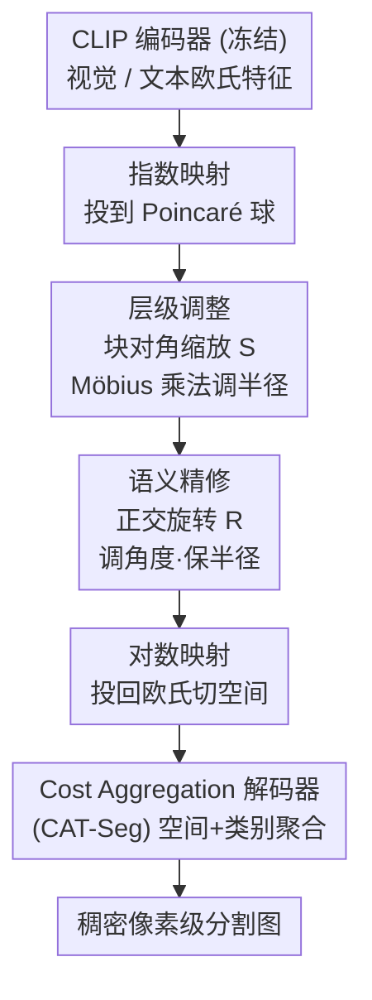

# Semantic Alignment in Hyperbolic Space for Open-Vocabulary Semantic Segmentation

**会议**: CVPR 2026  
**arXiv**: [2605.08874](https://arxiv.org/abs/2605.08874)  
**代码**: https://tmhoanggg.github.io/HyRo/ (项目页)  
**领域**: 开放词表语义分割 / 双曲几何 / 视觉语言模型  
**关键词**: 开放词表分割, Poincaré 球, 正交旋转, CLIP 微调, 语义对齐

## 一句话总结
HyRo 把 CLIP 微调搬到双曲空间，发现"层级"由半径编码、"语义相似度"由角度编码这两件事被前人混在一起调，于是用 Cayley 变换构造的正交旋转矩阵**只调角度、不动半径**，在保住层级结构的前提下精修跨模态语义对齐，开放词表语义分割在 6 个 benchmark 上有 4 个刷到 SOTA。

## 研究背景与动机

**领域现状**：开放词表语义分割要把 CLIP 这种 image-level 的视觉语言模型适配到 pixel-level 的稠密预测。主流路线已从"先出 mask proposal 再用冻结 CLIP 分类"（有 closed-set 偏置）转向"在共享表示空间里直接微调 CLIP + cost aggregation 解码"（如 CAT-Seg、SED）。最近又有一支用**双曲几何**来建模视觉概念的层级结构，代表作 HyperCLIP 观察到微调时图像 embedding 的层级会从 image-level 漂移到 pixel-level，于是在 Poincaré 球里学一个对角缩放矩阵去调文本 embedding 的**双曲半径**，让它匹配 pixel-level 粒度。

**现有痛点**：HyperCLIP 这类方法只调半径，**完全没有对 embedding 之间的语义对齐施加约束**。结果是：两个语义上毫不相干的概念，可能被放到差不多的半径（层级对了）但角度错了，导致类别之间难以区分。论文 Figure 1 给的例子很直观——一张"人躺在椅子上"的图，HyperCLIP 把人和椅子都判成同一个"chair"，因为它丢掉了语义朝向。

**核心矛盾**：层级（hierarchy）和语义（semantics）其实对应**两种不同的几何属性**——层级由**径向距离**（半径）编码，语义相似度由**角度朝向**编码。前人把这两者耦合在半径缩放这一个操作里调，自然顾此失彼：调半径对齐了粒度，却动不了角度去分开近似类别。

**本文目标**：在 Poincaré 球里把这两件事**解耦**，半径管层级、角度管语义，各调各的、互不干扰。

**切入角度**：Poincaré 球有个关键性质——**共形性（conformality）**，即在原点处测的角度与欧氏空间完全一致。这意味着如果能找到一个"绕原点旋转"的操作，它就能在改变角度（语义）的同时**严格保持半径不变**（层级），从而实现真正的解耦。正交变换正是这样的操作。

**核心 idea**：用正交旋转矩阵 $\mathbf{R}$ 在双曲空间里只调 embedding 的角度、不动其半径——半径缩放（沿用前人）负责把 embedding 摆到正确的层级，旋转负责精修语义角对齐，两者职责正交。

## 方法详解

### 整体框架

HyRo 是一个**只微调少量双曲变换参数、冻结整个 CLIP** 的轻量适配框架。给定一个来自 CLIP 编码器的欧氏特征 $\mathbf{x}\in\mathbb{R}^d$（视觉或文本），整条管线是：先用**指数映射**把它从欧氏切空间投到 Poincaré 球得到双曲 embedding；然后做两步解耦对齐——**层级调整**用一个块对角缩放矩阵 $\mathbf{S}$ 通过 Möbius 乘法调半径，把粒度对齐到 pixel-level；**语义精修**用一个块对角正交旋转矩阵 $\mathbf{R}$ 调角度、严格保半径；最后用**对数映射**把精修后的 embedding 投回欧氏切空间，送进 cost aggregation 解码器出稠密分割图。整条变换可以写成一个嵌套式：

$$\mathbf{x}' = \log_{\mathbf{0}}^{\mathbb{D},c}\!\left(\mathbf{R}\cdot\left(\mathbf{S}\otimes_c \exp_{\mathbf{0}}^{\mathbb{D},c}(\mathbf{x})\right)\right)$$

其中 $\exp_{\mathbf{0}}$ 进球、$\mathbf{S}\otimes_c$ 调半径（Möbius 矩阵-向量乘）、$\mathbf{R}\cdot$ 旋转调角度、$\log_{\mathbf{0}}$ 出球。视觉和文本两路各自走一遍这个精修，再算 cost volume。

### 关键设计

**1. 双曲旋转：用正交矩阵把"调角度"和"调半径"彻底拆开**

这是全文的核心。前人只调半径会让近似类别"语义坍缩"，而要单独调角度又不能破坏已经调好的层级。论文的洞察是：在共形的 Poincaré 球里，绕原点的**正交变换**恰好是理想的"旋转"——它改角度但保范数。给定双曲 embedding $\mathbf{q}\in\mathbb{D}_c^d$ 和正交矩阵 $\mathbf{R}$，精修后的 embedding 就是简单的 $\mathbf{v}=\mathbf{R}\mathbf{q}$。论文还给了理论证明（Sec 3.2）：把切空间向量 $\mathbf{v_x}=\log_{\mathbf{0}}^c(\mathbf{x})$ 旋转成 $\mathbf{R}\mathbf{v_x}$ 再 exp 回流形，由于正交性 $\|\mathbf{R}\mathbf{v_x}\|=\|\mathbf{v_x}\|$，最终等价于直接对坐标做矩阵乘 $\mathbf{x}'=\mathbf{R}\mathbf{x}$，且双曲半径严格不变 $\text{Rad}_{\mathbf{x}'}=\text{Rad}_{\mathbf{x}}$，而原点角度变成 $\cos(\alpha')=\frac{\langle\mathbf{R}\mathbf{x},\mathbf{y}\rangle}{\|\mathbf{x}\|\|\mathbf{y}\|}$。这就在数学上保证了"角度可学、半径冻结"，使语义对齐（角）和层级深度（半径）能被独立控制。

**2. Cayley 变换 + 块对角结构：让旋转矩阵严格正交且算得起**

要保证 $\mathbf{R}$ 严格满足 $\mathbf{R}^\top\mathbf{R}=\mathbf{I}$，论文用 **Cayley 变换**参数化一个无约束可学矩阵 $\mathbf{\Theta}$：先取反对称部分 $\mathbf{A}=\mathbf{\Theta}-\mathbf{\Theta}^\top$，再令 $\mathbf{R}=(\mathbf{I}+\mathbf{A})(\mathbf{I}-\mathbf{A})^{-1}$，这样无论 $\mathbf{\Theta}$ 怎么学，$\mathbf{R}$ 都恒正交。但 Cayley 变换里那个矩阵求逆对完整 $d\times d$ 矩阵是 $\mathcal{O}(d^3)$，对 CLIP 的高维 embedding（ViT-B/16 视觉 768、文本 512）太贵，而且两模态维度不同也没法共用一个全矩阵。于是把 $\mathbf{R}$ 拆成 $K_{\mathbf{R}}=d/n$ 个独立块 $\mathbf{R}=\text{diag}(\mathbf{R}_1,\dots,\mathbf{R}_{K_{\mathbf{R}}})$，每块 $\mathbf{R}_i\in\mathbb{R}^{n\times n}$ 各自做 Cayley 变换，求逆开销从 $\mathcal{O}(d^3)$ 降到 $\mathcal{O}(d^3/n^2)$ 还能并行。块大小 $n$ 是个表达力旋钮：$n=d$ 退化成完整旋转，$n$ 越小约束越强、参数越少，论文实测 $n=256$ 最优。

**3. 块对角半径缩放：沿用 HyperCLIP 把粒度摆到 pixel-level**

层级这一步直接复用 HyperCLIP 的可学对角矩阵 $\mathbf{S}$，但在双曲空间里线性变换要走 Möbius 矩阵-向量乘 $\mathbf{q}=\mathbf{S}\otimes_c\mathbf{h}$ 来实现半径缩放。同样为了效率，$\mathbf{S}$ 也做块对角拆分 $\mathbf{S}=\text{diag}(\mathbf{S}_1,\dots,\mathbf{S}_{K_{\mathbf{S}}})$，每块 $\mathbf{S}_k\in\mathbb{R}^{b\times b}$，让不同特征子空间学各自的缩放因子。它和旋转是互补的：缩放负责把 embedding 放到正确的抽象层级（pixel vs image），旋转负责在同一层级内把近似类别在角度上分开——消融证明两者缺一不可。

**4. Cost Aggregation 解码器：把精修后的双曲特征接回稠密预测**

解码器直接沿用 CAT-Seg：不直接预测像素标签，而是先在视觉 embedding $D^V\in\mathbb{R}^{(H\times W)\times d}$ 和文本 embedding $D^L\in\mathbb{R}^{N_\mathcal{C}\times d}$ 之间算余弦相似度构 cost volume $C(i,n)$，再卷积升维。聚合拆成**空间聚合**（用带移位窗口注意力的 Swin block 在每个类别的 cost map 上强化空间一致性、压背景噪声）和**类别聚合**（不带位置编码的 transformer 在类别 token 间建模关系，类别多时换线性 transformer），并把原始 $D^V/D^L$ 投影后拼进注意力当 guidance。最后轻量上采样头从 $24\times24$ 渐进融合 CLIP 中间层（如 ViT-B/16 的第 4、8 层）上采到 $96\times96$ 出分割图。

### 损失函数 / 训练策略

训练目标就是标准的**逐像素交叉熵**，无额外正则：

$$\mathcal{L}=-\frac{1}{H\times W}\sum_{i=1}^{H\times W}\log\frac{\exp(\hat{Y}_{i,y_i})}{\sum_{n=1}^{N_\mathcal{C}}\exp(\hat{Y}_{i,n})}$$

关键在于**只微调双曲变换参数**（半径缩放 $\mathbf{S}$ 和旋转 $\mathbf{R}$），CLIP 编码器冻结以保住其零样本泛化。优化器 AdamW，双曲参数 lr $2\times10^{-4}$、CLIP 编码器 lr $1\times10^{-6}$；两个矩阵块大小都设 256；曲率默认 $c=0.01$；batch size 仅 8（8 卡 A100 各 1 样本，刻意小 batch 保泛化），训练 40k 步约 8 小时。

## 实验关键数据

训练集 COCO-Stuff，跨数据集零样本评测 ADE20K（A-150 / A-847）、PASCAL-Context（PC-59 / PC-459）、PASCAL VOC（PAS-20 / PAS-20b），指标 mIoU。Backbone 统一 CLIP ViT-B/16，无额外 backbone。

### 主实验

| 数据集 | HyRo (本文, H) | HyperCLIP (H) | SED (E) | SAN (E) | 提升 vs HyperCLIP |
|--------|------|------|------|------|------|
| A-847 | **12.0** | 11.9 | 11.4 | 10.1 | +0.1 |
| PC-459 | **18.9** | 18.2 | 18.6 | 12.6 | +0.7 |
| A-150 | 31.2 | **31.7** | 31.6 | 27.5 | −0.5 |
| PC-59 | **57.3** | 57.1 | 57.3 | 53.8 | +0.2 |
| PAS-20 | **95.0** | 94.9 | 94.4 | 94.0 | +0.1 |
| PAS-20b | 76.7 | **77.1** | — | — | −0.4 |

（"E"=欧氏空间，"H"=双曲空间。）HyRo 在 6 个 benchmark 中 4 个拿到最好。增益最明显的是**大词表**设置——A-847（847 类）和 PC-459（459 类），印证旋转精修角度对"区分大量视觉相似类别"特别有用；而小词表/已饱和的 A-150、PAS-20b 上与 HyperCLIP 互有胜负，提升空间本就很小。

### 消融实验

| Radius | Rotation | A-847 | PC-459 | A-150 | PC-59 | PAS-20 | PAS-20b |
|--------|----------|-------|--------|-------|-------|--------|---------|
| ✗ | ✗ | 11.4 | 17.6 | 29.8 | 56.2 | 94.8 | 75.9 |
| ✓ | ✗ | 11.9 | 18.2 | **31.7** | 57.1 | 94.9 | 76.4 |
| ✗ | ✓ | 11.6 | 18.3 | 30.6 | 56.5 | **95.4** | **76.7** |
| ✓ | ✓ | **12.0** | **18.9** | 31.2 | **57.3** | 95.0 | **76.7** |

曲率 $c$ 与旋转块大小 $n$ 的消融：

| 配置 | A-847 | PC-459 | A-150 | 说明 |
|------|-------|--------|-------|------|
| $c=0.01$（默认） | 12.0 | 18.9 | 31.2 | "更平缓"曲率，保 CLIP 零样本泛化 |
| $c=1.0$ | 11.2 | 17.6 | 30.1 | 曲率过大，把欧氏 CLIP 空间扭曲太狠 |
| $n=32$ | 11.4 | 17.6 | 29.8 | 旋转容量不足 |
| $n=128$ | 11.6 | 18.3 | 30.6 | 中等 |
| $n=256$（默认） | **12.0** | **18.9** | **31.2** | 容量与泛化最佳平衡 |

### 关键发现
- **旋转是开放词表泛化的主驱动力**：在大词表 A-847 上，单加旋转就把 baseline 从 11.4 提到 11.6，且旋转防止了近似类别的"语义坍缩"；半径缩放则负责把 embedding 摆到正确层级（A-150 上单加半径从 29.8 跳到 31.7）。两者互补、组合最优。
- **曲率要"温柔"**：$c=0.01$ 整体最好，$c=1.0$ 虽在 PAS-20b 上稍高（77.8），但在多样化的 A-847 上把预训练欧氏空间扭曲得太狠反而掉点；作者不试 <0.01，因为太小就近似欧氏、失去双曲优势。
- **大词表更吃旋转容量**：块越大（$n$ 越大）在 A-847 这种细粒度大词表上增益越显著，小词表 PAS-20 则对块大小不敏感。
- 注意力可视化显示，加 HyRo 后"person/building/window"等目标类的注意力从弥散到集中，背景噪声被压住，直观印证角度精修改善了跨模态语义对应。

## 亮点与洞察
- **把"语义 vs 层级"翻译成"角度 vs 半径"这个几何直觉是全文最漂亮的地方**：一旦把问题摆到 Poincaré 球的极坐标视角，"解耦"就有了天然的数学载体——正交变换保范数动方向，恰好对应"保层级、调语义"，理论与动机严丝合缝。
- **Cayley 变换 + 块对角是个可复用的工程 trick**：想要"严格正交又可学又算得起"的旋转矩阵时，Cayley 参数化保正交、块对角把 $\mathcal{O}(d^3)$ 砍到 $\mathcal{O}(d^3/n^2)$ 并能并行，这套组合可迁移到任何需要正交约束的高维表示学习（如旋转式位置编码、正交解耦表示）。
- **极致轻量的适配范式**：冻结整个 CLIP，只学两个块对角矩阵，8 卡 8 小时即可，对算力有限又想保零样本泛化的场景很有借鉴价值。
- 这套"先半径后角度"的两段式解耦，本质是把一个纠缠的对齐目标分解成两个正交子目标分别优化，思路可迁移到任何"层级 + 相似度"双重约束的检索/对齐任务。

## 局限性 / 可改进方向
- **绝对增益很小**：相比 HyperCLIP 多数 benchmark 只 +0.1~0.7 mIoU，且在 A-150、PAS-20b 上甚至略降，说明在已经饱和的双曲方法上"再解耦角度"的边际收益有限，更多是验证几何洞察而非大幅刷点。
- **只在 ViT-B/16 这一种 backbone、一种解码器（CAT-Seg）上验证**，没看更大 backbone（如 ConvNeXt-L）或换解码器后旋转是否还稳定增益。
- **半径缩放完全沿用 HyperCLIP**，本文真正新增的只有旋转分支，创新点比较聚焦；旋转和缩放是否真的"互不干扰"主要靠理论保证 + 消融间接支撑，缺少对两者交互的更深入分析。
- 作者承认目前只做静态图像，未来想扩到开放词表**视频分割**（MOSE、MeViS 等），那里时序一致性会给双曲精修带来新挑战。

## 相关工作与启发
- **vs HyperCLIP**：两者都在 Poincaré 球里微调 CLIP，HyperCLIP 只学半径缩放对齐 pixel-level 粒度，但放任角度（语义）失准导致近似类别坍缩；本文在其基础上加正交旋转专门修角度，且理论证明旋转不动半径，是对 HyperCLIP 的"补半边"——半径管层级它已做好，角度管语义本文补上。
- **vs CAT-Seg / SED 等欧氏 cost-aggregation 方法**：它们在欧氏空间直接微调 CLIP + cost 聚合，本文复用 CAT-Seg 解码器但把特征精修搬到双曲空间，论证非欧几何能更好建模视觉概念的层级 + 语义双重结构。
- **vs 早期 mask-proposal 路线（OVSeg/ZSseg 等）**：那类先出 proposal 再分类的方法有 closed-set 偏置、泛化受限；本文走直接稠密微调路线，无 proposal、对未见类更友好。
- **vs 一般双曲视觉语言学习（MERU 类）**：前人多用双曲半径建模"文本比视觉更抽象"的模态层级，本文则首次明确把**角度**单列为语义维度并设计专门的正交旋转去优化它，填补了"双曲方法只调半径、不管角度"的空白。

## 评分
- 新颖性: ⭐⭐⭐⭐ "层级=半径、语义=角度"的几何解耦视角清晰，正交旋转 + Cayley 参数化有理论支撑，但半径分支沿用前人、创新较聚焦
- 实验充分度: ⭐⭐⭐⭐ 6 个标准 benchmark + 组件/曲率/块大小三组消融 + 注意力可视化都到位，但只在单一 backbone/解码器上验证、绝对增益偏小
- 写作质量: ⭐⭐⭐⭐⭐ 动机→几何直觉→理论证明→实验一气呵成，Figure 1 失败案例点题精准
- 价值: ⭐⭐⭐⭐ 轻量（冻结 CLIP 只学两矩阵）、可复用的 Cayley+块对角 trick，对开放词表分割和双曲表示学习都有借鉴意义

<!-- RELATED:START -->

## 相关论文

- [\[CVPR 2026\] Seeing Both Sides: Towards Bidirectional Semantic Alignment for Open-Vocabulary Camouflaged Object Segmentation](seeing_both_sides_towards_bidirectional_semantic_alignment_for_open-vocabulary_c.md)
- [\[CVPR 2026\] S2C2Seg: Semantic-Spatial Consistency and Category Optimization for Open-Vocabulary Segmentation](s2c2seg_semantic-spatial_consistency_and_category_optimization_for_open-vocabula.md)
- [\[CVPR 2026\] The Power of Prior: Training-Free Open-Vocabulary Semantic Segmentation with LLaVA](the_power_of_prior_training-free_open-vocabulary_semantic_segmentation_with_llav.md)
- [\[CVPR 2026\] GeoGuide: Hierarchical Geometric Guidance for Open-Vocabulary 3D Semantic Segmentation](geoguide_hierarchical_geometric_guidance_for_open-vocabulary_3d_semantic_segment.md)
- [\[CVPR 2026\] MARIS: Marine Open-Vocabulary Instance Segmentation](maris_marine_open-vocabulary_instance_segmentation.md)

<!-- RELATED:END -->
