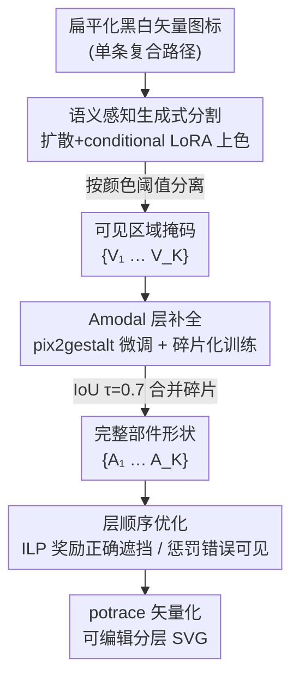

# SemLayer: Semantic-aware Generative Segmentation and Layer Construction for Abstract Icons

**会议**: CVPR 2026  
**arXiv**: [2603.24039](https://arxiv.org/abs/2603.24039)  
**代码**: [https://xxuhaiyang.github.io/SemLayer/](https://xxuhaiyang.github.io/SemLayer/)  
**领域**: 分割 / 矢量图形  
**关键词**: 矢量图层构建, 语义分割上色, 遮挡补全, 图标编辑, 扩散模型

## 一句话总结

提出 SemLayer，一个基于生成模型的流水线，将扁平化的矢量图标恢复为语义化分层结构——先通过扩散模型将分割重新定义为上色任务，再进行遮挡区域的语义补全，最后用整数线性规划确定层级顺序，实现 mIoU +5.0、PQ +16.7 的分割提升。

## 研究背景与动机

1. **领域现状**：矢量图标是现代设计工作流的基石，设计师通常将语义有意义的图形元素组织在多个可编辑层中。但图标在发布和分发时经常被"扁平化"，所有层合并为单个复合路径，丢失了原始的语义层级结构。

2. **现有痛点**：一旦语义结构丢失，重新着色、动画、局部编辑等下游操作变得极其困难。设计师不得不手动重新分割和重建图标。现有方法如 SAM 在高度抽象的黑白图标上表现不佳（缺少纹理、阴影、颜色等线索），优化方法往往生成过多碎片层。

3. **核心矛盾**：图标的高度抽象性意味着传统的视觉理解线索（纹理、阴影、深度）几乎完全缺失，同时需要恢复包括被遮挡区域在内的完整几何形状以及正确的堆叠顺序。

4. **本文目标**：从扁平化的单路径/复合路径矢量图标恢复出可编辑的语义分层表示。

5. **切入角度**：利用生成模型（扩散模型）内含的丰富形状先验来弥补图标领域数据稀缺和特征缺失的问题。

6. **核心 idea**：将语义分割重新定义为上色任务（用扩散模型将黑白图标上色使不同语义部件可视化分离），然后利用扩散模型补全遮挡区域，最后用 ILP 确定层顺序。

## 方法详解

### 整体框架

SemLayer 要做的事很具体：拿到一个已经被"扁平化"成单条复合路径的黑白矢量图标，把它还原成设计师当初那种一层一层、可单独编辑的语义结构。难点在于图标几乎没有纹理、阴影、颜色这些常规视觉线索，而且被压扁后部件之间互相遮挡、谁压谁的层级也丢了。

整条流水线分三步顺着走：先把单色图标喂进扩散模型，让它"上色"——不同语义部件被染成不同颜色，再按颜色阈值切出一组可见区域掩码 $\{V_1, ..., V_K\}$；接着对每个部件用另一个扩散模型补全被遮挡的完整形状 $\{A_1, ..., A_K\}$；最后用整数线性规划（ILP）反推这些部件的上下堆叠顺序，把结果重新矢量化成 SVG。三步分别对应下面三个关键设计。

### 关键设计

**1. 语义感知生成式分割：把"分割"重写成"上色"**

抽象图标上 SAM 这类分割器会直接翻车，因为它们依赖的颜色、纹理、深度线索在黑白图标里几乎不存在。SemLayer 换了个思路：与其逼分割模型在缺线索的输入上硬切边界，不如把任务改成生成模型更擅长的形式——上色。模型在保持原图结构不变的前提下，给每个语义部件刷上一种不同的颜色，于是"哪些像素属于同一部件"这个分割问题，就变成了"哪些像素被染成同一颜色"。

实现上基于 EasyControl 框架，在扩散 Transformer 上接 conditional LoRA：以二值轮廓作为条件控制编码、用文本 prompt 引导上色，训练目标是 flow-matching 损失 $\mathcal{L}_{\text{FM}} = \mathbb{E}_{t,\epsilon} \|v_\theta(z_n, t, z_c) - (\epsilon - x_0)\|_2^2$。推理时把输出的每个颜色通道按阈值分离，就得到一组二值掩码 $\{V_1, ..., V_K\}$。训练数据是 8,567 个图标-上色对，来自真实 SVG 加 GPT-4o + gpt-image-1 合成。这样做之所以有效，是因为扩散模型本身就带着丰富的形状语义和颜色分配先验，上色对它来说是个"顺手"的任务，绕开了传统分割在图标域上的硬骨头。

**2. Amodal 层补全：把每个部件被压扁时挡掉的部分长回来**

上一步切出来的只是部件的"可见部分"，但设计师要的是完整形状——一个圆被另一个图形压住一角，还原时得把那一角补回去，否则重排层级后会露出破洞。自然图像上的 amodal 补全模型不能直接拿来用，黑白图标和真实照片之间有巨大的域差异，所以这里在 pix2gestalt 潜在扩散模型上做了针对图标风格的微调。

补全模型吃两路条件：CLIP 图像嵌入给高层语义，VAE 编码的遮挡 patch 与掩码拼接给几何约束。关键的训练技巧是"碎片化可见性"——一个部件被遮挡后可能被切成几块互不连通的碎片 $\{V^{(i)}\}$，训练时让每个碎片单独作为输入、但都监督模型恢复出同一个完整形状，形成多对一的补全映射，逼模型学会"只看一小块也能脑补整体"。推理时再用一个 IoU 阈值 $\tau=0.7$ 的合并步骤，把同属一个对象的多个补全结果并到一起。补全数据集 SemLayer-Completion 含 50,000 个训练三元组。

**3. 层顺序优化：用 ILP 精确推回谁压谁**

补全后所有部件都是完整形状，但"谁在上、谁在下"的堆叠顺序还没定，而这恰恰是恢复可编辑结构的最后一块拼图。论文把它形式化成一个整数线性规划：用二值变量 $x_{ij}$ 表示部件 $i$ 是否压在部件 $j$ 上方，并要求这些变量满足反对称和传递性约束（即合法的全序）。

判断顺序好坏靠两个像素级覆盖变量：$y_i=1$ 表示部件补出来的额外区域 $E_i = A_i \setminus I$（即不在原图里的那部分）确实被上层盖住了——这是"对的遮挡"，该奖励；$z_i=1$ 表示部件本该可见的区域 $V_i$ 反被错误遮挡——这是"错的遮挡"，该惩罚。目标函数

$$\max_{x,y,z} \sum_i y_i - \lambda \sum_i z_i$$

就在"补出来的部分应被盖住"和"原本可见的部分不该被盖住"之间权衡，$\lambda=1$。组合优化交给 ILP 求解器精确求解，因为这两个指标（遮挡一致性 vs 可见性保持）定义得足够清晰，能直接写成线性约束。

### 一个完整示例

以一张"信封 + 信纸"的图标为例走一遍（示意场景，便于理解流程）：输入是一条把信封和信纸合并的复合黑白路径。**第一步**分割模型上色，把信封外壳染成蓝、露出的信纸染成黄，按颜色阈值切出两个可见掩码——其中信纸 $V_{\text{纸}}$ 只是露在信封口外的一小条。**第二步**补全：把这条碎片喂进补全模型，靠 amodal 先验把整张被信封挡住的信纸补成完整矩形 $A_{\text{纸}}$；信封 $A_{\text{封}}$ 本就基本完整。**第三步** ILP 判序：信纸补出来的那块矩形 $E_{\text{纸}}$ 应当被信封盖住（$y$ 奖励），而信封自身的可见区不该被信纸压掉（$z$ 惩罚），于是解出"信封在上、信纸在下"。最后 potrace 矢量化，得到两个可单独重着色、移动、做动画的图层。

### 损失函数 / 训练策略

分割模型从头训练 40,000 步（lr $1 \times 10^{-4}$，CFG scale 4.5），推理 25 步，分辨率 $512 \times 512$。补全模型微调 50,000 步（lr $1 \times 10^{-5}$），推理 50 步，分辨率 $256 \times 256$。所有实验在 8 张 A100 上进行。矢量化使用 potrace，采用曲线复用策略最大化保留原始 Bézier 线段。

## 实验关键数据

### 主实验

分割性能对比（48 个真实 SVG 测试集）：

| 方法 | mIoU (%) | PQ (%) | 补全 mIoU (%) | 补全 CD ↓ |
|------|----------|--------|--------------|----------|
| gpt-image-1 | 25.4 | 6.20 | 60.9 | 71.4 |
| SAM2 | 51.1 | 26.2 | 69.2 | 61.7 |
| SAM2* (微调) | 79.3 | 59.4 | 80.7 | 49.1 |
| **SemLayer (本文)** | **84.3** | **76.1** | **85.2** | **46.6** |

补全模型对比（固定本文分割输入）：

| 方法 | mIoU (%) ↑ | CD ↓ |
|------|-----------|------|
| gpt-image-1 | 10.7 | 98.6 |
| MP3D | 70.5 | 79.4 |
| MP3D-finetuned | 75.3 | 68.9 |
| **SemLayer (本文)** | **85.2** | **46.6** |

### 消融实验

Refined 分割指标提升：

| 配置 | mIoU_Refined (%) | PQ_Refined (%) |
|------|-----------------|----------------|
| gpt-image-1 | 57.2 | 39.3 |
| SAM2 | 62.2 | 37.8 |
| SAM2* | 85.3 | 78.0 |
| **SemLayer** | **86.4** | **78.3** |

### 关键发现

- **分割即上色的策略显著优于直接分割**：比微调后的 SAM2* 仍高出 +5.0 mIoU 和 +16.7 PQ
- **gpt-image-1 在图标分割上表现很差**：mIoU 仅 25.4%，说明通用生成模型难以理解图标的语义结构
- **补全模型的域适配至关重要**：通用 MP3D 模型 mIoU=70.5%，微调后提升到 75.3%，本文专门的图标补全训练达 85.2%
- **碎片化训练策略有效**：多对一补全训练使得模型能从单个碎片恢复完整形状
- **端到端流水线产出可直接编辑的分层 SVG**：支持局部重着色、旋转、缩放和简单动画

## 亮点与洞察

- **分割即上色的范式转换极其巧妙**：当传统分割方法在特定领域失败时，不要硬套分割方法，而是想"什么任务形式化对生成模型更友好"。上色对生成模型来说是一个更自然的任务——这个 insight 可以迁移到其他难以直接分割的领域。
- **数据构建流水线实用**：利用 LayerPeeler 的真实 SVG + GPT-4o/gpt-image-1 合成，以少量人工成本构建了 8,567 个训练样本的分割数据集和 50,000 个补全三元组。
- **ILP 求层顺序直觉清晰**：奖励正确遮挡覆盖、惩罚错误可见性遮挡的目标函数设计简洁优雅。

## 局限与展望

- **仅处理黑白线条图标**：彩色和填充图标尚未覆盖（虽然作者指出颜色本身就是强语义线索，扩展相对容易）
- **高度缠绕/遮挡的图标可能失败**：论文承认存在失败案例（Fig. 9）
- **测试集仅 48 个图标**：评估规模偏小，可能不够代表所有图标风格
- **生成模型的随机性**：需要多次运行取均值来稳定结果

## 相关工作与启发

- **vs LayerPeeler**：LayerPeeler 提供了现有分层 SVG 数据源，但缺乏分割方法；SemLayer 在其数据基础上构建了完整的分割-补全-排序流水线
- **vs SAM2**：SAM2 即使微调后仍有碎片化和对齐问题，因为其设计假设了丰富的视觉线索；上色范式避免了这些问题
- **vs 优化式矢量化方法**：DiffVG 等可微渲染方法视觉保真但生成过多碎片层，缺乏语义一致性

## 评分

- 新颖性: ⭐⭐⭐⭐⭐ 将分割重定义为上色任务的 insight 非常有创意，整个流水线三阶段设计干净利落
- 实验充分度: ⭐⭐⭐ 定量评估在 48 个测试图标上进行稍显不足，但定性可视化充分展示了效果
- 写作质量: ⭐⭐⭐⭐ 问题形式化清晰，四个挑战逐一对应解决方案
- 价值: ⭐⭐⭐⭐ 对设计工具领域有实际应用价值，数据集和方法可为矢量图形理解奠定基础

<!-- RELATED:START -->

## 相关论文

- [\[CVPR 2026\] MatchMask: Mask-Centric Generative Data Augmentation for Label-Scarce Semantic Segmentation](matchmask_mask-centric_generative_data_augmentation_for_label-scarce_semantic_se.md)
- [\[CVPR 2026\] Conversational Image Segmentation: Grounding Abstract Concepts with Scalable Supervision](conversational_image_segmentation_grounding_abstract_concepts_with_scalable_supe.md)
- [\[CVPR 2026\] Frequency-Aware Affinity for Weakly Supervised Semantic Segmentation](frequency-aware_affinity_for_weakly_supervised_semantic_segmentation.md)
- [\[CVPR 2026\] Making Training-Free Diffusion Segmentors Scale with the Generative Power](making_training-free_diffusion_segmentors_scale_with_the_generative_power.md)
- [\[CVPR 2026\] SGMA: Semantic-Guided Modality-Aware Segmentation for Remote Sensing with Incomplete Multimodal Data](sgma_semantic-guided_modality-aware_segmentation_for_remote_sensing_with_incompl.md)

<!-- RELATED:END -->
