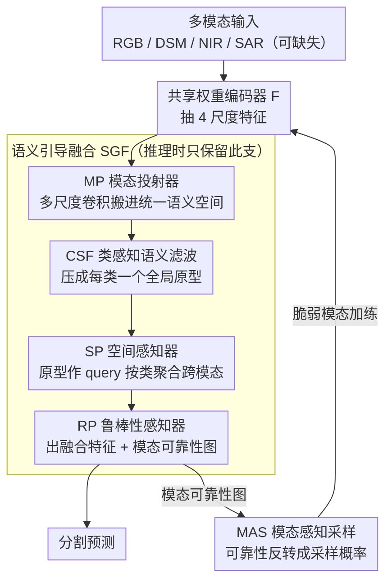

# SGMA: Semantic-Guided Modality-Aware Segmentation for Remote Sensing with Incomplete Multimodal Data

**会议**: CVPR 2026  
**arXiv**: [2603.02505](https://arxiv.org/abs/2603.02505)  
**代码**: 无  
**领域**: 语义分割  
**关键词**: 不完整多模态语义分割, 遥感, 模态不平衡, 语义原型, 自适应融合

## 一句话总结

提出 SGMA 框架，通过语义引导融合（SGF）模块构建全局语义原型实现自适应跨模态融合，并通过模态感知采样（MAS）模块动态提升脆弱模态的训练频率，解决遥感场景下不完整多模态语义分割中的模态不平衡、类内方差大和跨模态异质性三大挑战。

## 研究背景与动机

### 1. 领域现状

多模态语义分割（MSS）整合 RGB、NIR、DSM、SAR 等多源传感器信息，在遥感地球观测中实现更准确的场景理解。但实际应用中传感器故障或覆盖不完整导致模态缺失十分常见，由此催生了不完整多模态语义分割（IMSS）研究。

### 2. 痛点

IMSS 面临三大挑战：

- **模态不平衡**：优势模态（如 RGB）在训练中主导学习，压制脆弱模态（如 DSM/NIR/SAR）的特征学习
- **类内方差大**：同一语义类别在不同尺度、方向和形状上差异巨大（如不同大小的建筑物）
- **跨模态异质性**：不同模态对同一语义区域产生矛盾的响应（如屋顶和地面在 RGB 中颜色相似但 DSM 高度不同）

### 3. 核心矛盾

现有方法依赖对比学习或联合优化，但强制对齐会丢弃模态特有信息（over-alignment），不平衡训练会偏向鲁棒模态。Modality dropout 不能充分训练脆弱模态，MAE 方法侧重低层重建而非高层语义。

### 4. 要解决什么

设计一个统一框架，在任意模态缺失场景下保持鲁棒性能，同时显式解决模态不平衡、类内方差和跨模态异质性。

### 5. 切入角度

通过类级语义原型建立跨模态语义锚点，绕开逐像素对比对齐的弊端；用注意力权重量化模态鲁棒性，指导自适应融合与采样。

### 6. 核心 idea

将多模态特征压缩到全局语义原型（每类一个向量），作为 query 通过注意力自适应聚合各模态特征。注意力权重同时反映模态可靠性，驱动 MAS 模块提高脆弱模态的训练频率，实现平衡学习。

## 方法详解

### 整体框架

SGMA 要在任意模态缺失的遥感场景下做稳健分割，核心思路是不再逐像素硬对齐各模态，而是先把每个模态各自的特征"翻译"到一个共同的语义空间，用每类一个的全局语义原型当锚点，再让注意力机制围绕这些锚点完成融合与可靠性评估。整条流水线是：所有模态共享同一个权重编码器 $F$，各自抽出 4 个尺度的特征 → 模态投射器（MP）把它们映射进统一语义空间 → 类感知语义滤波（CSF）把特征压成每类一个全局原型 → 两次注意力（SP / RP）以原型为 query 聚合跨模态信息，并顺带吐出每个模态的可靠性图 → 这张可靠性图反过来驱动 MAS 决定下一轮该多练哪个模态。

整体被组织成两个即插即用、并行优化的分支：语义引导融合（SGF，含 MP/CSF/SP/RP）负责减少类内方差、调和跨模态矛盾并产出分割预测；模态感知采样（MAS）则借用 SGF 算出的可靠性评分动态调整采样概率，专治模态不平衡。两条分支在训练时各自出一份分割预测联合优化，推理时只保留 SGF 分支，因此额外开销几乎全在训练侧。

### 关键设计

**1. Modality-specific Projector（MP）：把异质模态搬进同一个语义空间**

不同模态的物理含义天差地别（RGB 是颜色、DSM 是高度、SAR 是回波），直接拼接会让后续融合在"鸡同鸭讲"的特征上做。MP 给每个模态先用三个不同尺寸的深度可分离卷积（11×11、7×7、3×3）并联捕获多尺度上下文，再用 1×1 卷积投影到统一语义维度。多尺度并联是关键：同一语义类别（如建筑物）在遥感影像里尺度差异极大，单一感受野会丢掉大目标的整体或小目标的细节，三档感受野让投影后的特征既对齐到共同空间、又各自保住了原模态的尺度信息。

**2. Class-aware Semantic Filter（CSF）+ 全局语义原型：用类中心锚定打散的像素**

类内方差大是 IMSS 第二个痛点——同类目标在不同尺度方向形状上长得很不一样，逐像素表示天然分散。CSF 先把模态特征从 $C_i$ 通道压到 $K$（类别数）通道，得到每类的紧凑响应，再与语义特征做矩阵乘法聚出全局原型：

$$\{p_{se}^{i,k}\}_{k=1}^K = [c_m^i] \otimes [f_{m \to se}^i]^T, \quad p_{se}^{i,k} \in \mathbb{R}^{C}$$

这里每个 $p_{se}^{i,k}$ 是模态 $i$ 下类别 $k$ 的全局原型向量，享有整张图的感受野。它的作用相当于把四散的像素表示统一拉向各自的类别中心：后续融合不再去对齐成千上万个像素，而是围绕 $K$ 个稳定的类锚点展开，从源头压住类内方差，也避免了逐像素对比对齐那种容易抹掉模态特有信息的 over-alignment。

**3. Spatial Perceptron（SP）：让每个像素按自己的类别去挑跨模态信息**

有了类原型还得回到空间——每个像素到底该信哪个模态、信多少，取决于它属于哪一类。SP 把全局原型当 query 广播到每个空间位置，用多头注意力查询重排后的多模态特征：

$$a_{se}^{i,k} = \text{MHA}_{SP}(q_i, k_i, v_i)$$

其中 $q_i$ 是广播到各位置的原型、$k_i = v_i$ 是重排的多模态特征。这样每个像素都按"我是哪一类"去选择性聚合最相关的跨模态信号，而不是全图一刀切地平均融合，融合后的特征类别一致性更强。

**4. Robustness Perceptron（RP）：同一次注意力既出融合特征、又量化模态可不可靠**

跨模态异质性是第三个痛点——屋顶和地面在 RGB 里颜色相近，DSM 却高度迥异，不同模态对同一区域给出矛盾响应。RP 以 SP 的语义引导特征为 query 再做一次多头注意力，同时吐出两样东西：融合特征 $f_{SGF}^i$ 和模态鲁棒性图 $\{r_m^i\}_{m \in \mathcal{M}}$。关键在于注意力权重本身就编码了"各模态与语义原型对齐得多好"——对齐越好，说明该模态在这个空间位置、这个语义类别上越可靠。于是一套注意力机制顺带产出了类别依赖 + 尺度依赖的可靠性评估：DSM 在建筑结构类拿到高权重，NIR 在植被上更可靠，且随网络深浅自适应调整。这张可靠性图正是连接 SGF 与 MAS 的桥梁。

**5. Modality-Aware Sampling（MAS）：把"谁不可靠"翻译成"多练谁"**

模态不平衡的根源在于优势模态（RGB）在联合 loss 里主导梯度，脆弱模态（DSM/NIR/SAR）总是练不透。MAS 不让所有模态在同一个 loss 里竞争，而是把 RP 算出的鲁棒性分数反转成采样概率，每个训练迭代按概率单抽一个模态独立训练：

$$\hat{r}_m^i = \frac{1/r_m^i}{\sum_{m'} 1/r_{m'}^i}$$

鲁棒性越低的模态被抽中的概率越高，于是脆弱模态自动获得更多单独训练机会，不再被优势模态淹没。这一步在实现上还很省：对 softmax 后的鲁棒性值直接取倒数再归一化，等价于对原始 pre-softmax 值做一次 SoftMin，无需额外保存中间量。这种"解耦单练"的思路从根本上把不平衡问题从梯度竞争里解了出来。

### 一个完整示例：DSM 模态如何被一步步救回来

以 ISPRS（RGB+DSM+NIR）训练为例，看一个属于"建筑物"类的像素和脆弱模态 DSM 怎样在一次迭代里流动：

1. **投射对齐**：RGB/DSM/NIR 经共享编码器与各自 MP，被搬进统一语义空间，DSM 的高度信息以多尺度形式保留下来。
2. **锚定类中心**：CSF 把三模态特征压成每类一个的全局原型，"建筑物"类拿到一组稳定的类锚点向量。
3. **按类聚合**：SP 用"建筑物"原型当 query 去查这个像素的三模态特征——对建筑物而言，DSM 的高度落差是强判别信号，注意力会更偏向 DSM。
4. **量化可靠性**：RP 再做一次注意力，输出融合特征的同时给出可靠性图，比如该位置 DSM 对齐得好、可靠性 $r_{DSM}$ 偏高；但在全局统计上 DSM 整体仍弱于 RGB。
5. **反转采样**：MAS 看到 DSM 的整体鲁棒性低，按 $\hat{r}$ 把它的采样概率抬高，于是下一批迭代里更可能单独拿 DSM 训练一遍，DSM 分支得到一次"加练"。

正是这条闭环让消融里"仅 SGF"只小涨、而"SGF+MAS"把脆弱模态的 Last-1 mIoU 暴涨 +50%——SGF 负责把每个像素融得对、MAS 负责把每个模态练得够。

### 损失函数 / 训练策略

- SGF 和 MAS 各自输出分割预测，分别用交叉熵损失，按权重相加：$\mathcal{L}_{IMSS} = \lambda_{SGF} \mathcal{L}_{SGF} + \lambda_{MAS} \mathcal{L}_{MAS}$，其中 $\lambda_{SGF} = 2$、$\lambda_{MAS} = 1$
- 训练时用模态 dropout 模拟缺失场景，所有模态组合都参与训练
- AdamW 优化器，lr = 6e-5，多项式衰减（power 0.9），200 epochs，前 10 epochs warm-up

## 实验关键数据

### 主实验

**数据集**：ISPRS Potsdam（RGB+DSM+NIR，5类）、DFC2023（RGB+DSM+SAR，建筑）、DELIVER（RGB+Depth+Event+LiDAR，25类）

**表1：ISPRS 数据集 mIoU (%) — PVT-v2-b2 backbone**

| 方法 | R | D | N | R+D | R+N | D+N | R+D+N | Average | Last-1 |
|------|------|------|------|------|------|------|-------|---------|--------|
| MuSS | 40.21 | 17.13 | 1.36 | 83.75 | 57.71 | 31.52 | 86.50 | 45.45 | 1.36 |
| M3L | 30.72 | 10.41 | 20.99 | 81.31 | 78.54 | 72.76 | 84.07 | 54.12 | 10.41 |
| IMLT | 69.57 | 38.78 | 69.82 | 80.03 | 81.29 | 67.82 | 85.12 | 70.35 | 38.78 |
| MAGIC | 81.39 | 34.34 | 46.97 | 83.27 | 77.99 | 63.30 | 84.75 | 67.43 | 34.34 |
| **SGMA** | **83.51** | **57.05** | **76.06** | **86.62** | **84.25** | **82.56** | **86.84** | **79.55** | **57.05** |

Average mIoU 提升 +9.20%，Last-1（最差模态）提升 **+18.26%**。

**表2：DFC2023 数据集 mIoU (%) — PVT-v2-b2 backbone**

| 方法 | R | D | S | R+D | R+S | D+S | R+D+S | Average | Last-1 |
|------|------|------|------|------|------|------|-------|---------|--------|
| IMLT | 90.54 | 53.73 | 32.53 | 90.81 | 90.61 | 49.98 | 91.12 | 71.33 | 32.53 |
| MAGIC | 88.98 | 65.96 | 37.51 | 89.20 | 83.29 | 43.75 | 81.93 | 70.09 | 37.51 |
| **SGMA** | **90.84** | **76.70** | **53.13** | **91.95** | **90.98** | **77.47** | **92.29** | **81.91** | **53.13** |

Average mIoU 提升 +7.66%，Last-1 提升 **+15.54%**（SAR 单模态）。

### 消融实验

**表3：SGF 和 MAS 模块渐进消融 — ISPRS (PVT-v2-b2)**

| 变体 | SGF | MAS | Average mIoU | Last-1 mIoU |
|------|-----|-----|-------------|-------------|
| (a) 基线 | ✗ | ✗ | 46.51 | 2.61 |
| (b) 仅 SGF | ✓ | ✗ | 49.13 | 7.01 |
| (c) SGF+MAS | ✓ | ✓ | **79.55** | **57.05** |

- 仅 SGF 相对基线提升有限（+2.62%），主要因为没有 MAS 时脆弱模态训练不充分
- 加入 MAS 后 Average 暴涨 **+30.42%**，Last-1 暴涨 **+50.04%**，验证了 MAS 对脆弱模态训练的关键作用

### 关键发现

1. **脆弱模态提升显著**：在所有数据集上，脆弱模态（DSM/SAR/Event/LiDAR）的单模态性能提升最大（+10~+18%），甚至脆弱+脆弱组合超越单鲁棒模态
2. **模态越多越好**：SGMA 是唯一随模态增加而性能一致提升的方法，baseline 方法加模态后反而可能下降（MAGIC 加 NIR 后掉 3.4%）
3. **跨 backbone 泛化**：ResNet-50 上同样有效，ISPRS Average +10.21%，验证了即插即用特性
4. **计算效率**：额外仅增加 9.47 GFLOPs 和 4.79M 参数（相对 backbone 的 1.1% 和 1.7%），远低于 MAGIC（98.11G/22.29M）
5. **鲁棒性图可解释**：可视化显示不同尺度模态贡献自适应变化——浅层 RGB/DSM/NIR 较均衡，深层 RGB 主导（0.66）

## 亮点与洞察

1. **语义原型作为跨模态锚点**的 idea 非常巧妙：不做逐像素对齐，而是通过类级原型建立语义桥梁，既减少类内方差又避免 over-alignment
2. **注意力权重的双重用途**：RP 的注意力权重同时用于加权融合和鲁棒性评估，一个机制解决两个问题
3. **SoftMin 的高效实现**：直接对 softmax 后的值取倒数等价于对原始值做 SoftMin，无需保存 pre-softmax 值
4. **MAS 的解耦训练思路**：不是让所有模态在同一 loss 里竞争，而是单独抽样脆弱模态训练，从根本上解决不平衡
5. **脆弱+脆弱组合的成功**：DSM+SAR、Event+LiDAR 这些全脆弱组合竟然能产生有意义分割，展示了互补信息的极致利用

## 局限与展望

1. **可解释性不足**：作者自述缺乏显式量化模态学习动态的机制，鲁棒性分数虽可视化但语义含义有限
2. **未考虑时序多模态**：遥感中时序变化（如季节变化、灾后变化）带来的模态可靠性动态变化未被建模
3. **原型质量依赖训练早期**：全局语义原型在训练初期可能不稳定，尤其对罕见类别；warm-up 策略可能不够
4. **推理时不用 MAS**：MAS 仅在训练时使用，推理时遇到完全未见过的脆弱模态组合时鲁棒性有限
5. **类别数 K 敏感**：CSF 压缩到 K 通道，粗粒度类别（如 DELIVER 25 类）和细粒度类别场景的表现差异未充分分析

## 相关工作与启发

- **IMLT [5]**：首个遥感 IMSS 方法，对比学习 + 掩码预训练，但强制对齐丢失模态特有信息
- **MAGIC [65]**：将模态分为 robust/fragile 组，联合优化 + cosine 对齐，但组划分是静态的
- **M3L [33]**：随机模态 dropout + 可学习参数保留模态表示，但无法充分训练脆弱模态
- **启发**：语义原型的思路可扩展到其他多模态任务（如医学影像中的 CT+MRI+PET 缺失场景），MAS 的鲁棒性引导采样策略可应用于任何存在数据不平衡的多模态学习问题

## 评分

⭐⭐⭐⭐ 系统性强且实用的 IMSS 框架。语义原型 + 鲁棒性引导采样的组合设计优雅，在三个数据集两个 backbone 上一致性显著提升。脆弱模态的巨幅改进（Last-1 +18%）有实际部署价值。计算开销极低的即插即用设计增加了工程可行性。略微遗憾的是 novelty 主要在组合而非单个组件，且对时序和更复杂缺失模式的扩展尚未涉及。

<!-- RELATED:START -->

## 相关论文

- [\[CVPR 2026\] Test-Time Multi-Prompt Adaptation for Open-Vocabulary Remote Sensing Image Segmentation](test-time_multi-prompt_adaptation_for_open-vocabulary_remote_sensing_image_segme.md)
- [\[CVPR 2026\] ReAttnCLIP: Training-Free Open-Vocabulary Remote Sensing Image Segmentation via Re-defined Attention in CLIP](reattnclip_training-free_open-vocabulary_remote_sensing_image_segmentation_via_r.md)
- [\[CVPR 2026\] Task-Oriented Data Synthesis and Control-Rectify Sampling for Remote Sensing Semantic Segmentation](task-oriented_data_synthesis_and_control-rectify_sampling_for_remote_sensing_sem.md)
- [\[CVPR 2026\] F2Net: A Frequency-Fused Network for Ultra-High Resolution Remote Sensing Segmentation](f2net_a_frequency-fused_network_for_ultra-high_resolution_remote_sensing_segment.md)
- [\[CVPR 2026\] Uncertainty-Aware Modality Fusion for Unaligned RGB-T Salient Object Detection](uncertainty-aware_modality_fusion_for_unaligned_rgb-t_salient_object_detection.md)

<!-- RELATED:END -->
