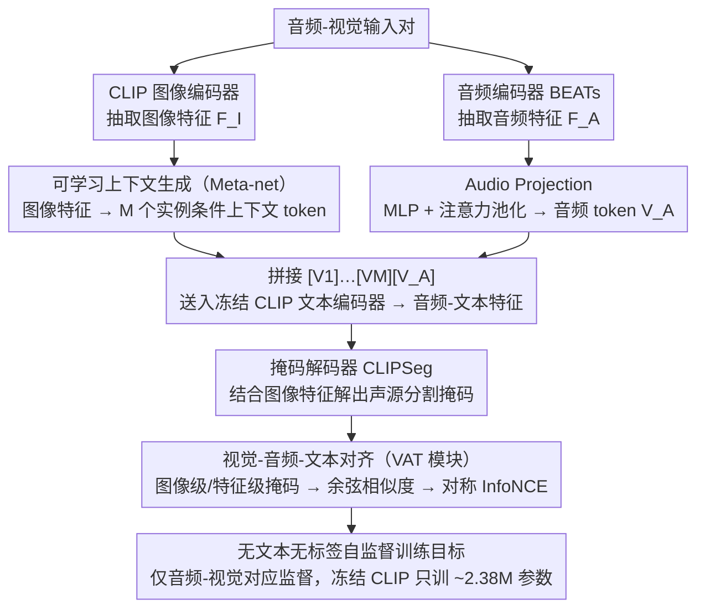

# SouPLe: Enhancing Audio-Visual Localization and Segmentation with Learnable Prompt Contexts

**会议**: CVPR 2026  
**arXiv**: [2603.22732](https://arxiv.org/abs/2603.22732)  
**代码**: 无  
**领域**: 分割 / 音频-视觉定位  
**关键词**: 音频视觉定位, 提示学习, CLIP适配, 声源分割, 对比学习

## 一句话总结

提出 SouPLe (Sound-aware Prompt Learning)，通过将CLIP中固定的文本提示替换为基于图像特征生成的可学习上下文tokens，增强音频嵌入token与视觉特征之间的语义对应，在VGG-SS上cIoU提升3.75、开放集设定下cIoU提升6.32，全面超越先前方法。

## 研究背景与动机

**领域现状**：音频-视觉声源定位旨在从视觉场景中定位发声物体。主流方法基于对比学习框架利用音频-视觉对应关系进行自监督学习。近年来，ACL-SSL 利用预训练的 CLIP 模型将音频信号转化为与 CLIP 文本编码器兼容的 token，取得了显著进展。

**现有痛点**：ACL-SSL 的核心问题在于其使用固定提示 "a photo of a $[V_A]$" 的方式存在两个缺陷：(1) 将分类token $[CLS]$ 替换为音频嵌入token $[V_A]$ 时，$[V_A]$ 缺乏可与视觉信息整合的语义信息；(2) "a photo of a" 这些固定 token 与 $[V_A]$ 之间缺乏有意义的语义连接，导致在某些场景中定位失败。

**核心矛盾**：CLIP 的文本编码器设计用于处理自然语言描述，但音频嵌入 token 不是自然语言——用固定的无语义提示来包裹它，本质上是一种不匹配，限制了音频-视觉跨模态对齐的质量。

**本文目标** 如何在CLIP框架下为音频嵌入token提供更好的上下文，使其能更有效地与视觉特征对齐来实现精准的声源定位和分割。

**切入角度**：受 CoCoOp 启发，将提示工程问题转化为提示学习问题——让提示 token 根据输入图像特征自适应生成，而非使用固定的人工设计提示。

**核心 idea**：用基于图像特征条件化的可学习上下文 token 替代固定文本提示，让音频嵌入 token 在丰富的视觉条件上下文中获得更好的语义对齐。

## 方法详解

### 整体框架

SouPLe 想解决的是：ACL-SSL 把音频塞进一个固定文本提示 "a photo of a $[V_A]$" 里，但这个壳子既无语义、又和音频 token 接不上，导致定位常常失败。它的做法是把这个固定壳子换成"看图说话"——根据当前图像现场生成一套上下文 token 来包裹音频。

整条流水线这样转：一对音频-视觉输入进来，CLIP 图像编码器先抽出图像特征，Meta-net 把它翻译成 $M$ 个实例条件化的上下文 token $[V_1][V_2]\dots[V_M]$；与此同时音频编码器（BEATs）抽出音频特征，经 Audio Projection 压成一个音频嵌入 token $[V_A]$。两者拼成 $[V_1]\dots[V_M][V_A]$ 送进冻结的 CLIP 文本编码器，得到一个"懂这张图"的音频-文本特征；最后它和图像特征一起进掩码解码器（CLIPSeg）解出声源分割掩码。VAT 模块再用这张掩码在图像级和特征级上算音频-文本与视觉的对比损失，整个过程只有 Meta-net 和解码器在学，CLIP 三个编码器全部冻结。

### 关键设计

**1. 可学习上下文生成（Meta-net）：让提示根据图像现场长出来**

痛点很直接——固定的 "a photo of a" 对所有图像都是同一句废话，而不同场景里声源的语义天差地别（厨房里的水流声和球场上的人声需要完全不同的上下文引导），一个万能模板没法适配。SouPLe 借 CoCoOp 的实例条件化思路，用一个 Meta-net 把图像特征 $F_I$ 翻译成提示。结构很轻：两层瓶颈 Linear-ReLU-Linear，隐层把维度缩小 16 倍，吐出 $M$ 个上下文 token 顶替原来那句固定提示。

一个容易忽略但实验证明很关键的细节是 token 的摆放顺序：把 $[V_A]$ 放在末位（$[V_1]\dots[V_M][V_A]$）比放在首位的 cIoU 高出约 3 个点。原因在 CLIP 文本编码器的因果注意力——它只能从左往右看，所以前面的上下文 token 先把语义空间铺好，末位的音频 token 才能站在这个已经搭好的语境里被解读；反过来音频 token 在最前面时，它身后的上下文还没建立，等于又回到了没有语境的老问题。

**2. 视觉-音频-文本对齐（VAT 模块）：在两个粒度上把音频和视觉拉到一起**

光生成提示还不够，得有信号告诉模型"这个音频对应图里哪块"。VAT 模块用 SouPLe 自己生成的声源掩码做两个版本的"圈重点"：图像级掩码 $M_I$ 把前景声源突出、背景遮暗，得到一张整体对应的图；特征级掩码 $M_F$ 则在空间视觉特征上强调声源区域，聚焦高相关的局部。两个版本各自和音频-文本特征算余弦相似度 $S^I$、$S^F$，再用对称 InfoNCE 优化。

之所以要双层而不是只做一层，是因为图像级和特征级抓的东西不同——图像级保证音频和整张图的全局对应不跑偏，特征级则把注意力收到真正发声的那一小块上，两者互补。此外还挂了一个面积正则项 $\mathcal{L}_{REG}$ 约束掩码别越界，只覆盖发声区域，防止它偷懒把整张图都圈进来。

**3. 无文本、无标签的自监督设计：只靠音频-视觉对应做监督**

声源定位本就没有现成的逐像素标签，SouPLe 索性整条流程不依赖任何文本标注或真值掩码，监督信号完全来自"哪段音频配哪张图"这种天然成对关系。配合上 CLIP 的三个编码器全部冻结，真正参与训练的只有 Meta-net、掩码解码器等约 2.38M 参数，不到全模型的 1%。这样既省掉了昂贵的标注，又因为没有被特定标签集绑死，在没见过的类别上泛化得更稳。整体训练目标为 $\mathcal{L} = \lambda_1 \mathcal{L}_{ACL_I} + \lambda_2 \mathcal{L}_{ACL_F} + \lambda_3 \mathcal{L}_{REG}$。

### 损失函数 / 训练策略

总训练损失由三项组成：图像级音频-文本对比损失、特征级音频-文本对比损失和面积正则化损失。使用 VGGSound-144K 训练，Adam 优化器，学习率 $10^{-3}$，权重衰减 $10^{-5}$，训练20个epoch，batch size 16。音频输入为16kHz采样的10秒clip，视频帧缩放到 $352 \times 352$。

## 实验关键数据

### 主实验

标准基准上的声源定位：

| 方法 | VGG-SS cIoU↑ | VGG-SS AUC↑ | SoundNet cIoU↑ | SoundNet AUC↑ |
|------|-------------|-------------|----------------|---------------|
| ACL-SSL | 49.46 | 46.32 | 80.80 | 64.62 |
| **SouPLe** | **53.21** | **48.15** | **84.80** | **67.64** |
| 提升 | +3.75 | +1.83 | +4.00 | +3.02 |

开放集定位（110 Heard + 110 Unheard类别）：

| 测试集 | ACL-SSL cIoU | SouPLe cIoU | 提升 |
|--------|-------------|-------------|------|
| Heard 110 | 48.44 | 54.76 | +6.32 |
| Unheard 110 | 41.98 | 48.40 | +6.42 |

AVSBench S4 (零样本)：mIoU 62.89 (+3.13), F-Score 71.47 (+2.44)

### 消融实验

| 消融项 | VGG-SS cIoU | AUC |
|--------|-------------|-----|
| ctx=4 (default) | 53.21 | 48.15 |
| ctx=8 | 52.01 | 47.32 |
| ctx=16 | 51.08 | 46.93 |
| $V_A$ 在首位 | 49.91 | 46.21 |
| $V_A$ 在末位 (default) | 53.21 | 48.15 |

### 关键发现

- 仅4个上下文 token 即可达到最优，增加参数量反而降低性能——关键在于质量而非数量
- $[V_A]$ 放在最末位效果最好，因为 CLIP 因果注意力让前面的上下文先建立语义空间
- 在 Extended VGG-SS/SoundNet 等包含静默/不可见声源的挑战性设定中，SouPLe 同样大幅领先
- 在 AVSBench MS3 多目标场景中性能下降，因为无标签监督导致方法倾向分割所有潜在物体

## 亮点与洞察

- **极小改动带来大提升**：仅引入约2.38M参数（< 1%），就在多个基准上实现稳定提升
- **CoCoOp思想迁移到音频-视觉领域**：将图像分类中的提示学习成功适配到跨模态定位任务
- **无文本、无标注的端到端框架**：纯粹依赖音频-视觉对应，工程简洁且易于部署
- $[V_A]$ 位置的消融实验揭示了因果注意力中token顺序的重要性

## 局限与展望

- 在多声源场景（AVSBench MS3）中效果不佳，因为缺乏标签引导导致过度分割
- 未考虑时间维度信息（如视频中的连续帧），可能遗失动态线索
- Meta-net 结构较为简单，更复杂的条件化机制（如跨注意力）可能进一步提升
- 未与 MaPLe 等多模态提示学习方法深入对比
- 可探索扩展到音频-视觉分离、事件定位等更多下游任务

## 相关工作与启发

- **CoOp/CoCoOp**：提示学习的核心灵感来源，CoCoOp 的实例条件化策略被成功迁移
- **ACL-SSL**：直接基线，SouPLe 在其基础上用可学习提示替换固定提示
- **CLIPSeg**：用作掩码解码器，可关注其他 CLIP 变体解码器的替换可能
- 提示学习在多模态对齐中的有效性值得在更多跨模态任务中推广

## 评分

- **新颖性**: ⭐⭐⭐ 核心思路是 CoCoOp 到音频-视觉的直接迁移，技术创新有限但迁移有效
- **实验充分度**: ⭐⭐⭐⭐ 5个数据集+开放集+零样本+扩展基准+充分消融，覆盖全面
- **写作质量**: ⭐⭐⭐⭐ 动机清晰，实验完整，but 方法部分可更精炼
- **价值**: ⭐⭐⭐⭐ 验证了提示学习在音频-视觉领域的有效性，为CLIP-based方法提供了通用改进思路

<!-- RELATED:START -->

## 相关论文

- [\[CVPR 2025\] Robust Audio-Visual Segmentation via Audio-Guided Visual Convergent Alignment](../../CVPR2025/segmentation/robust_audio-visual_segmentation_via_audio-guided_visual_convergent_alignment.md)
- [\[CVPR 2026\] GeoSURGE: Geo-localization using Semantic Fusion with Hierarchy of Geographic Embeddings](geosurge_geo-localization_using_semantic_fusion_with_hierarchy_of_geographic_emb.md)
- [\[CVPR 2026\] Love Me, Love My Label: Rethinking the Role of Labels in Prompt Retrieval for Visual In-Context Learning](love_me_love_my_label_rethinking_the_role_of_labels_in_prompt_retrieval_for_visu.md)
- [\[CVPR 2026\] BiPA: Bilevel Prompt Adaptation for Underwater Instance Segmentation](bipa_bilevel_prompt_adaptation_for_underwater_instance_segmentation.md)
- [\[CVPR 2026\] Bootstrap Your Own AV-Proxies: Adaptive Contrastive and Prototype Learning for Audio-Visual Segmentation](bootstrap_your_own_av-proxies_adaptive_contrastive_and_prototype_learning_for_au.md)

<!-- RELATED:END -->
