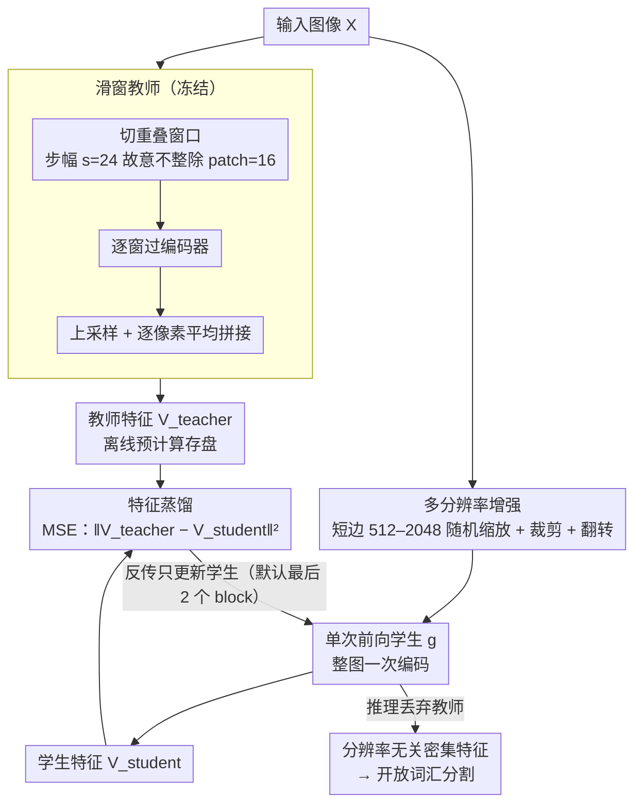

# SPAR: Single-Pass Any-Resolution ViT for Open-Vocabulary Segmentation

**会议**: CVPR 2026  
**arXiv**: [2604.02252](https://arxiv.org/abs/2604.02252)  
**代码**: [https://github.com/naomikombol/SPAR](https://github.com/naomikombol/SPAR)  
**领域**: 分割 / 开放词汇分割  
**关键词**: 开放词汇分割, 分辨率无关, 知识蒸馏, Vision Transformer, 滑窗推理

## 一句话总结

提出 SPAR，一种通过将细步幅滑窗教师的空间推理能力蒸馏到单次前向传递学生的方法，将 ViT 变为分辨率无关的密集特征提取器，在开放词汇分割中比单次前向基线提升 10.5 mIoU，同时比教师快 52 倍。

## 研究背景与动机

**领域现状**：基础 ViT（CLIP、SigLIP2、DINOv3）通过对比/自监督学习在图像级理解上表现出色，但由于固定分辨率预训练和粗糙的 patch 级表示，在需要细粒度空间理解的密集预测任务（如分割）上效果有限。开放词汇分割（OVS）要求模型仅凭文本即可分割任意类别，对高分辨率输入的精细像素级推理需求更高。

**现有痛点**：处理高分辨率图像有两种策略：(1) 插值位置编码后单次前向推理——高效但精度差，因训练-推理分辨率不匹配导致位置信息失真；(2) 滑窗推理——通过小步幅重叠窗口显著提升精度（因为每个 patch 出现在多个上下文中），但计算成本极高。例如步幅24的滑窗比单次推理慢约52倍。

**核心矛盾**：精度与效率之间存在严重的 trade-off——单次推理快但差，滑窗推理好但慢。现有的分辨率适应方案（如 NaFlex）在图像级任务上有效，但在密集预测上表现不佳。

**本文目标** 如何在保持单次前向推理效率的同时，获得接近甚至超越细步幅滑窗推理的分割精度。

**切入角度**：观察到滑窗推理的优势本质上来自子 patch 区域被暴露在不同上下文中、以及通过平均获得的鲁棒性——这种空间推理能力可以通过蒸馏转移到单次推理模型中。

**核心 idea**：用特征回归损失将细步幅滑窗教师的空间特征蒸馏到同架构的单次推理学生中，无需架构修改或像素级标注。

## 方法详解

### 整体框架

SPAR 想解决的核心矛盾是：滑窗推理精度高但慢 52 倍，单次推理快但精度差，二者似乎不可兼得。它的破局思路是把"贵但好"的滑窗结果当成监督信号，蒸馏给"便宜"的单次模型——既不改架构，也不要像素标注。整条流水线的主干分两步：先让一个冻结的**滑窗教师**（VLM 视觉编码器在滑窗模式下跑）对图像产出高质量的密集特征图，再用一个同架构的**单次前向学生**对整张图一次编码，用一条 MSE **特征蒸馏**损失让它的输出去逼近教师的特征图。为了让学生真正做到分辨率无关，训练时还对输入施加**多分辨率增强**，把位置编码学成随尺寸平滑变化。训练只跑学生的反传，推理时把教师丢掉、只留学生，于是得到一个"看一眼就给出滑窗级特征"的分辨率无关编码器。

### 关键设计

**1. 滑窗教师：用重叠窗口拼出蒸馏目标**

要蒸馏，先得有一个足够好的老师。直接把高分辨率图喂给固定分辨率预训练的 ViT 会因位置编码失真而糊掉，所以教师改走滑窗：把图像 $X \in \mathbb{R}^{3 \times H \times W}$ 切成 $m$ 个大小 $K \times K$ 的重叠窗口（$K$ 取预训练分辨率），每个窗口单独过编码器得到一张小特征图，再上采样（factor $r=2$）对齐后逐像素平均拼回整图：$V_\text{teacher}(X) = \text{stitch}(\{f(X_{w_i})\}_{i=1}^m)$。这里有个反直觉但关键的细节——步幅取 $s=24$，故意**不整除** patch size $P=16$。如果整除（比如 $s=32$），同一个子 patch 区域在每个窗口里都落在 patch 网格的相同相对位置，看到的上下文重复；而 $s=24$ 让同一块像素在不同窗口里落到不同的 patch 切分上，相当于把它暴露在多种上下文中再平均，得到类似 test-time augmentation 的鲁棒性。这也是滑窗精度高的真正来源，后面学生要学的正是这种"多上下文平均"出来的空间推理。

**2. 特征蒸馏：一条 MSE 把空间推理搬进单次前向**

有了教师特征，怎么把它的能力转移给单次学生，是整篇的落点。SPAR 没有用任何花哨的目标，学生 $g$ 对完整图像单次前向得到 $V_\text{student}(X) = g(X)$，训练目标就是逐像素回归教师特征：

$$\mathcal{L}_\text{distill} = \|V_\text{teacher}(X) - V_\text{student}(X)\|_2^2$$

之所以敢这么简单，是因为教师和学生同架构、特征空间天然对齐，MSE 直接拉近即可，既不需要像素级标注也不需要对比/注意力等额外结构。工程上还有一招省钱：教师特征可以离线预计算并存盘复用，于是训练只跑学生的反传——25k 张无标注 SA-1B 图、约 1.5 小时（2×A6000）就能收敛。一个值得注意的发现是并不需要全量微调：标准 OVS 设定下只解冻最后 2 个 block 就已经拿到大部分收益，只有当推理分辨率拉到极大时，放开全部参数才更稳。

**3. 多分辨率增强：让位置编码学会"任意分辨率"**

学生要做到 any-resolution，光给单一分辨率的样本是不够的，位置编码会再次过拟合到某个尺寸。SPAR 在训练时强制把输入尺度打散：短边在 512–2048 像素间随机缩放，再随机裁剪（边长从 512 到当前图允许的最大值）并水平翻转，所有图像双线性重采样到能被 patch size 整除的维度。这样学生在一次次见到不同分辨率和宽高比的过程中，把位置编码学成"随尺寸平滑变化"而非记死某个值。对比 SigLIP2 自带的 NaFlex——它也做变长 patch，但是在图像级预训练阶段一次性学的，本文实验里它在密集预测上反而打不过这种蒸馏期的多分辨率暴露。想支持更高分辨率推理时，扩展版把短边范围加宽到 512–2560 并训练全部参数即可。

### 损失函数 / 训练策略

纯特征回归损失（MSE），无需任何标注。AdamW 优化器，恒定学习率 $2 \times 10^{-5}$，权重衰减 $10^{-4}$，训练 10 个 epoch，默认只调最后 2 个 block。教师特征预计算存盘（~170GB）以免重复跑滑窗；因序列变长，batch size 固定为 1。

## 实验关键数据

### 主实验

SigLIP2 – ViT-B-16 在6个数据集上的平均 mIoU：

| 方法 | 推理模式 | Mean₆ |
|------|----------|-------|
| NaFlex | 单次 | 31.7 |
| Pre-trained | 单次 | 33.1 |
| Pre-trained | 滑窗(s=24) | 41.2 |
| **SPAR** | **单次** | **43.6** |
| SPAR + AnyUp | 单次 | 46.8 |
| SPAR + LPOSS | 单次 | 46.7 |

SPAR 比单次基线 +10.5 mIoU，甚至超过教师（滑窗s=24）+2.4 mIoU。

### 消融实验

不同 backbone 的提升：

| Backbone | 单次基线 | SPAR | 提升 |
|----------|----------|------|------|
| SigLIP2 ViT-B-16 | 33.1 | 43.6 | +10.5 |
| OpenCLIP ViT-B-16 | 27.7 | 34.4 | +6.7 |
| DINOv3 ViT-L-16 | 43.8 | 44.4 | +0.6 |

### 关键发现

- **NaFlex 不适合密集预测**：尽管 SigLIP2 专门设计了 NaFlex 进行分辨率适配，但在 OVS 上不如 SPAR 甚至不如标准滑窗，说明图像级分辨率适应不等于补丁级空间理解
- **步幅不整除 patch size 效果更好**：s=24 优于 s=32（整除16），因为子 patch 区域被暴露在更多样的上下文中
- **学生超越教师**：SPAR 在平均性能和大多数单个数据集上超过教师，可能因为蒸馏过程中的多分辨率训练起到了隐式正则化作用
- **DINOv3 提升较小**：因其已内置 RoPE 编码和高分辨率微调，单次推理本身就较好，但 SPAR 仍在 Cityscapes（大分辨率测试图）上将 mIoU 从 35.9 提升到 40.1
- SPAR 与 AnyUp、LPOSS 等方法互补，组合使用可进一步提升

## 亮点与洞察

- **极致简洁的方法**：no 架构修改、no 像素标注、no 复杂损失函数，仅靠 MSE 特征蒸馏实现巨大提升
- **52倍加速**：相比步幅24的滑窗推理，保持单次推理的效率是巨大的实用价值
- **通用性强**：在 SigLIP2、OpenCLIP、DINOv3 三种截然不同的 backbone 上均有效
- **训练成本极低**：25k 张无标注图像、1.5 小时训练时间即可完成
- 揭示了一个重要洞察：滑窗推理的优势可以被蒸馏，且蒸馏后甚至能超越原始教师

## 局限与展望

- DINOv3 等已经具备分辨率鲁棒性的模型提升空间有限
- 教师特征存储需 ~170GB，对存储有一定要求
- 仅在 training-free OVS 设定下验证，未在训练式方法或其他密集预测任务（检测、深度估计）上测试
- Batch size 限制为1（因变长序列），训练效率还有优化空间
- 可探索更高阶蒸馏策略（如注意力蒸馏）而非纯特征回归

## 相关工作与启发

- **FlexiViT / NaViT / ResFormer**：通过多分辨率预训练增强分辨率鲁棒性，但需要从头训练
- **SigLIP2 NaFlex**：统一灵活 patching 和变长序列，但本文证明其在密集预测上不够好
- **LPOSS**：训练无关的标签传播方法，与 SPAR 互补（+3.1 mIoU）
- 蒸馏思路可扩展到视频理解、3D 视觉等其他需要高分辨率密集推理的场景

## 评分

- **新颖性**: ⭐⭐⭐⭐ 将滑窗推理的优势通过蒸馏转移到单次推理是巧妙的洞察，虽然蒸馏本身不新
- **实验充分度**: ⭐⭐⭐⭐⭐ 3种backbone×6个数据集×多种分辨率×与多种方法组合，全面扎实
- **写作质量**: ⭐⭐⭐⭐ 动机清晰，trade-off图直观，方法描述简洁
- **价值**: ⭐⭐⭐⭐⭐ 实用性极高——简单、通用、高效、效果好，可广泛应用于所有需要 ViT 高分辨率推理的场景

<!-- RELATED:START -->

## 相关论文

- [\[CVPR 2026\] PCA-Seg: Revisiting Cost Aggregation for Open-Vocabulary Semantic and Part Segmentation](pca-seg_revisiting_cost_aggregation_for_openvocabulary_semantic_and_part_segmentat.md)
- [\[CVPR 2026\] GeoGuide: Hierarchical Geometric Guidance for Open-Vocabulary 3D Semantic Segmentation](geoguide_hierarchical_geometric_guidance_for_open-vocabulary_3d_semantic_segment.md)
- [\[CVPR 2026\] Direct Segmentation without Logits Optimization for Training-Free Open-Vocabulary Semantic Segmentation](direct_segmentation_without_logits_optimization_for_training-free_open-vocabular.md)
- [\[CVPR 2026\] PEARL: Geometry Aligns Semantics for Training-Free Open-Vocabulary Semantic Segmentation](pearl_geometry_aligns_semantics_for_training-free_open-vocabulary_semantic_segme.md)
- [\[ECCV 2024\] Diffusion Models for Open-Vocabulary Segmentation](../../ECCV2024/segmentation/diffusion_models_for_open-vocabulary_segmentation.md)

<!-- RELATED:END -->
