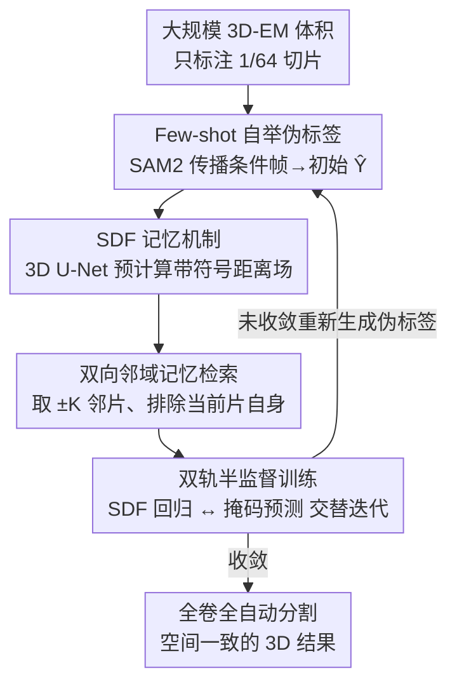

# Spatial-SAM: Spatially Consistent 3D Electron Microscopy Segmentation with SDF Memory and Semi-Supervised Learning

**会议**: CVPR 2026  
**论文**: [CVF Open Access](https://openaccess.thecvf.com/content/CVPR2026/html/Huang_Spatial-SAM_Spatially_Consistent_3D_Electron_Microscopy_Segmentation_with_SDF_Memory_CVPR_2026_paper.html)  
**代码**: https://github.com/Giluir/Spatial-SAM  
**领域**: 3D视觉 / 语义分割 / 医学图像  
**关键词**: 电镜分割、SDF记忆、SAM2、半监督学习、空间一致性

## 一句话总结
Spatial-SAM 把 SAM2 的「逐帧 2D logit 记忆」换成由轻量 3D U-Net 预计算的带符号距离场（SDF）记忆，再配一套「先用 SAM2 few-shot 自举伪标签、再交替训练 SDF 与掩码」的双轨半监督方案——只标注 1/64 的切片，就能在多个 3D 电镜数据集上逼近全监督 SOTA，同时显著改善切片间的 3D 形态一致性。

## 研究背景与动机

**领域现状**：电镜（EM）能提供纳米级的细胞超微结构图像，分割是把原始灰度转成可量化结构（线粒体、细胞核、突触）的入口。主流做法是 U-Net 及其 3D 变体、Transformer 分割网络做全监督训练；近年 SAM/SAM2 这类分割基础模型展示了强 zero/few-shot 能力，SAM2 还引入了流式记忆带来一定的切片间一致性。

**现有痛点**：两条路线各有硬伤。全监督的 3D 网络要海量逐体素标注，在大规模高分辨率 EM 上代价高得离谱；现有半监督方法（伪标签 + 一致性正则）大多基于 2D 切片，逐张看着合理，但拼回 3D 时会出现切片间不连续、厚度「闪烁」、锯齿状跳变。直接把 SAM2 套到 3D EM 上也不行——它的记忆是从过去若干帧的 2D 预测 logit 写出来的，没有显式的体积几何信息。

**核心矛盾**：SAM2 的记忆机制有三个结构性缺陷。① **方向依赖**：记忆只含传播方向上的过去帧，用不到未来帧，不同传播方向分割质量不一致；② **误差累积**：某一帧预测错了，错误结果会被写进记忆库并在后续帧被放大；③ **对切片选择敏感**：传播轴和条件帧的选择会明显影响最终结果。根子在于「记忆=历史 2D 预测」这个设定既缺几何、又会自我污染。

**本文目标**：在不放弃 SAM2 长程上下文与 few-shot 优势的前提下，给它注入「几何感知的体积结构引导」，并设计一套极省标注的训练配方，让方法从少量 2D 标注一路扩展到对整个大体积全自动分割。

**核心 idea**：用一次性预计算的 3D **SDF 记忆**替换 SAM2 的在线 logit 记忆（几何更完整、天然平滑、不会写入逐帧误差），再用 **SDF 回归 ↔ 掩码预测**的双轨交替一致性，把 1/64 的稀疏标注放大成全卷自动分割。

## 方法详解

### 整体框架
Spatial-SAM 把 SAM2 改造成一个空间连贯的 3D EM 分割工具，整体分两大块：**(A) 带 SDF 记忆的 Spatial-SAM 模型**——一个轻量 3D U-Net 先在低分辨率上把整卷预测成一个 SDF 网格，切片后作为「预置上下文」喂进 SAM2 的记忆编码器，使 SAM2 在推理时无需人工 prompt 即可自动分割；**(B) 双轨半监督训练**——从大数据集 $D_{all}$ 里选子集 $D$，只交互式标注 $m$ 张切片得到高质量掩码 $\{Y_j\}_{j=1}^m$，用这些切片当条件帧让 SAM2 传播出初始伪标签 $\tilde{Y}$，随后交替训练 SDF 轨与掩码轨迭代提纯，最终把训好的模型铺到全体 $D_{all}$ 做全自动分割。

整条流水线从「少量交互标注」走到「全自动分割」，关键在于两个模块（3D U-Net 给几何、SAM2 给掩码）通过 SDF 记忆和「掩码↔SDF」互转耦合在一起循环增强。

### 关键设计

**1. SDF 记忆机制：用预计算的带符号距离场替换 SAM2 的在线 logit 记忆**

这一条直接针对 SAM2 记忆「缺几何、会累积误差、方向依赖」的三宗罪。作者不再把过去帧的概率 logit 写进记忆，而是用一个带符号距离场（SDF）当记忆表征。对体积里任意点 $x\in\mathbb{R}^3$，SDF 定义为到目标边界的有符号最近距离：

$$\mathrm{SDF}(x)=\begin{cases}+\min_{y\in\partial\Omega_{obj}}\lVert x-y\rVert, & x\in\Omega_{obj}\\[2pt]-\min_{y\in\partial\Omega_{obj}}\lVert x-y\rVert, & x\notin\Omega_{obj}\end{cases}$$

其中 $\Omega_{obj}$ 是目标物体体积、$\partial\Omega_{obj}$ 是其边界；内部取正、外部取负以对齐 logit 的分布。相比 logit，SDF 有两个本质优势：其一，它是 3D 物体的隐式表达，对分割目标给出更完整的全局几何语义，让每张切片分割时具备更强的全局感知；其二，距离值天然空间平滑，即使记忆长度有限，模型也能借相邻帧的 SDF 捕捉跨切片的几何一致性，显著压住切片间不连续。最关键的是——**SDF 是分割前一次性预计算的**，单张切片的预测误差不会被写回记忆，从根上切断了误差累积链条。

SDF 由一个轻量 3D U-Net 产出：标准 4 层编码-解码 + skip connection，但输出不是逐体素类别概率，而是回归一个 SDF 网格。它吃下采样后的体积 $V'\in\mathbb{R}^{D'\times H'\times W'}$，预测低分辨率 SDF $\hat{S}'$ 再上采样回原分辨率 $\hat{S}$。$\hat{S}$ 与原体积 $V$ 沿同一轴切片，图像切片 $I_t$ 过 SAM2 图像编码器得 $\phi(I_t)$，对应的 SDF 切片连同 $\phi(I_t)$ 一起进记忆编码器生成该片记忆 $M_t$ 存入记忆库。

**2. 双向 + 排除自身的记忆检索：既用上未来帧，又不让粗糙 SDF 污染当前片**

logit 记忆只能单向（沿传播方向往回看），SDF 记忆因为是整卷预算的，天然支持双向取邻。分割目标片 $I_t$ 时，检索其前后各 $K$ 个邻片的记忆做记忆注意力：

$$\tilde{\phi}(I_t)=\mathrm{Attn}\big(\phi(I_t),\{M_\tau\}_{\tau\in N_t}\big),\quad N_t=\{t-K,\dots,t-1,t+1,\dots,t+K\}$$

注意邻域 $N_t$ **刻意排除 $t$ 自身**。原因是 3D U-Net 给的 SDF 只是粗预测，如果把当前片自己的粗糙 SDF 也喂进去，会和当前片分割形成自耦合、放大误差；只用邻片的 SDF，相当于让几何上下文来「夹住」当前片而不替它做主。消融里这一点很关键：把双向 SDF 记忆从单向升上来涨 0.83% Dice / 1.48% mIoU，而「不排除自身」反而从 94.45% 掉到 94.11% Dice，证明邻域专用策略确实在防自耦合。

**3. 双轨半监督训练：few-shot 自举初始伪标签 + SDF 回归与掩码预测交替提纯**

大规模 EM 跨样本、跨采集批次的外观差异极大，全监督训练代价不可承受。作者的半监督配方围绕两件事：(1) 用 SAM2 的 few-shot 能力以极小标注预算快速拿到高质量初始监督；(2) 通过 SDF 与掩码两轨交替，强制几何与语义在全卷上达成一致。

**初始化（few-shot 自举）**：不像传统伪标签流水线那样从头训一个模型来产标签，作者直接用 SAM2 的 few-shot 传播能力——把 $m$ 张标注切片当条件帧，经记忆库传播到邻近切片，仅用极少标注就生成高质量初始伪标签 $\tilde{Y}$，大幅降低优化难度、加速收敛。

**交替双轨**：此设计受 Dual-task Consistency（DTC）启发，但不同于 DTC 显式建两条并行分支，Spatial-SAM 的两轨是「内生」的——3D U-Net 回归 SDF、SAM2 解码掩码，二者顺序执行、通过 SDF 记忆和「掩码↔SDF」互转耦合，循环训练：① **SDF 训练**：把伪标签 $\tilde{Y}$ 转成 3D SDF $S$，监督 U-Net 回归 $\hat{S}$，等于把掩码里的语义线索蒸馏进一个平滑、方向无关的几何场；② **掩码训练**：把预测的 $\hat{S}$ 切片成 SDF 记忆，为缺真值的切片导出精修伪标签 $\tilde{Y}'$，用它连同少量真标注训 SAM2；③ **迭代精修**：在训练子集上重新推理 SAM2 得到更优伪标签 $\tilde{Y}^{(t+1)}$，重复。为防伪标签误差累积，训练时以概率 $p$ 采样标注切片及其邻片、以 $1-p$ 采样任意切片，确保真值被充分利用。

**损失函数**：U-Net 端用 MSE 对齐数值，外加 Eikonal 项约束梯度模长逼近 1 以保证 SDF 的几何合理性：

$$L_{\text{U-Net}}=L_{\text{MSE}}(\hat{S},S)+\lambda L_{\text{Eikonal}},\quad L_{\text{Eikonal}}=\frac{1}{|\Omega_{dom}|}\sum_{x\in\Omega_{dom}}\big(\lVert\nabla\hat{S}(x)\rVert-1\big)^2$$

SAM2 端保留多尺度掩码预测，但把交互 prompt 换成 SDF 记忆，逐片用混合目标 $Y_t^*$（标注片用真值 $Y_t$、否则用精修伪标签 $\tilde{Y}_t'$）算复合损失：

$$L_{\text{SAM2}}(\hat{Y}_t,Y_t^*)=\alpha L_{\text{Dice}}+\beta L_{\text{IoU}}+\gamma L_{\text{Focal}}$$

Dice 与 IoU 鼓励掩码重叠，Focal 处理前景/背景类别不平衡。这样 U-Net 专注学稳定的体积几何、SAM2 学几何条件下的精确掩码，两轨互相强化收敛到高质量全自动分割。

## 实验关键数据

### 主实验
四个 3D-EM 数据集（OOMLM/OOMLN 来自 OpenOrganelle 小鼠肝，MitoEM-R/H 为大鼠/人线粒体），Dice/mIoU(%)。全监督方法用全标注列在上方作上界，半监督方法统一只用 1/64 标注切片。

| 数据集 | 指标 | Spatial-SAM(1/64) | 最强半监督(CPS U-Net,1/64) | 最强全监督(SAM4EM,Full) |
|--------|------|------|------|------|
| OOMLM | Dice/mIoU | 96.51 / 93.25 | 95.74 / 91.84 | 96.75 / 93.70 |
| OOMLN | Dice/mIoU | 98.14 / 96.34 | 69.03 / 55.91 | 96.61 / 93.46 |
| MitoEM-R | Dice/mIoU | 94.45 / 89.51 | 93.38 / 87.60 | 95.12 / 90.71 |
| MitoEM-H | Dice/mIoU | 90.10 / 82.02 | 88.77 / 79.83 | 91.10 / 83.67 |

四数据集平均：相比最强半监督基线 CPS U-Net，Spatial-SAM 提升 **+8.07% Dice / +11.49% mIoU**；相比最强全监督基线 SAM4EM 仅差 **-0.09% Dice / -0.10% mIoU**——用 1/64 标注追平全监督。

### 不同标注比例（MitoEM-R）
| 方法 | 1/64 Dice/mIoU | 1/16 Dice/mIoU | 1/4 Dice/mIoU |
|------|------|------|------|
| CCT U-Net | 84.52 / 73.19 | 83.79 / 73.12 | 87.84 / 78.47 |
| GCT U-Net | 88.66 / 79.67 | 91.35 / 84.10 | 91.29 / 84.00 |
| CPS U-Net | 93.38 / 87.60 | 93.95 / 88.62 | 94.19 / 89.04 |
| **Spatial-SAM** | **94.45 / 89.51** | **94.91 / 90.33** | **95.35 / 91.12** |

Spatial-SAM 仅用 1/64 标注就超过所有对手用 1/4 标注的结果；标注从 1/64 加到 1/4 仍可继续涨（+0.90% Dice / +1.61% mIoU）。

### 消融实验（MitoEM-R）
| 记忆类型 | 方向 | 排除自身 | Dice | mIoU |
|------|------|------|------|------|
| SAM2(原始 logit) | 单向 | - | 92.62 | 86.31 |
| SDF | 单向 | - | 93.62 | 88.03 |
| SDF | 双向 | 否 | 94.11 | 88.90 |
| SDF | 双向 | 是 | **94.45** | **89.51** |

### 关键发现
- **SDF 编码是涨点主力**：单把记忆从 logit 换成 SDF（都单向）就涨 +1.00% Dice / +1.72% mIoU，证明连续有符号距离编码确实增强了更新时的空间一致性。
- **双向 + 排除自身缺一不可**：双向较单向 +0.83% Dice / +1.48% mIoU；但若不排除当前片自身 SDF，反而从 94.45 掉到 94.11 Dice，说明粗糙 SDF 自耦合会放大误差，邻域专用策略是对的。
- **迭代 3 轮即收敛**：得益于 SAM2 初始伪标签质量高，前几轮快速精修，3 轮后收益递减；后期 SDF 与掩码训练结果趋同，作者也坦言 SDF 在掩码训练中影响渐增、有轻微过拟合迹象。
- **空间一致性是质变而非数值**：x-z 平面可视化里，逐片方法有厚度「闪烁」和锯齿跳变，Spatial-SAM 在不做 z-filtering 等任何前后处理的情况下保持跨片厚度一致、抑制 zig-zag。在核（OOMLN）这种大体积上，3D U-Net 全监督才 92.91/86.80，Spatial-SAM 反而到 98.14/96.34，凸显「SAM2 长程上下文 + SDF 记忆」在稀疏监督下保住全局结构的优势。

## 亮点与洞察
- **把「记忆」从概率换成几何，是这篇最聪明的地方**：logit 记忆是「在线写、会污染、只能单向」，SDF 记忆是「离线算一次、几何完整、双向平滑」——一换表征同时解了方向依赖、误差累积、切片敏感三个问题，思路干净。
- **排除自身的小细节体现了对误差传播的理解**：粗糙的预计算 SDF 一旦自耦合就放大误差，宁可只让邻片几何来约束当前片，这个反直觉的设计被消融实打实验证。
- **few-shot 自举 + 双轨交替的组合拳很省**：用 SAM2 现成的传播能力直接出高质量初始伪标签，省掉「从头训一个产标签模型」的环节，再让几何/语义两轨互相蒸馏，1/64 标注追平全监督——对标注昂贵的连接组学/电镜领域价值很直接。
- **可迁移**：用 SDF/距离场当几何记忆来稳住序列预测的空间/时间一致性，这套思路可以搬到其它体数据分割（CT/MRI 器官）甚至视频对象分割里去替代纯 logit 记忆。

## 局限与展望
- **极端坏片仍是软肋**：作者承认采集导致的严重破损切片或曝光剧变会打断切片连续性，仍可能考验跨片稳定性。
- **训练时间偏长**：双轨交替（SDF 回归 + 掩码学习）每轮都要重新生成大规模伪标签集，训练开销高，作者把效率优化列为 future work。
- **SDF 后期影响过强**：消融里提到后期 SDF 对 SAM2 的影响渐增、有轻微过拟合，缺乏对两轨权重动态平衡的机制（如自适应调度 SDF 影响）。
- **自评补充**：所有结果都是语义（二值）分割口径，实例分割是把基线转二值掩码后用同指标评的，对线粒体「贴在一起」时的实例分裂能力没有直接评测；另外 $K=6$、$\lambda$、$p$ 等超参的敏感性正文未展开（推到补充材料）。

## 相关工作与启发
- **vs SAM4EM(Shah et al.)**：SAM4EM 也做 3D 记忆（动量更新 + LoRA 微调），但记忆仍来自先前 2D 切片结果，会传播局部误差；Spatial-SAM 把 3D 物体的几何表征（SDF）嵌进记忆编码，提供更连贯的空间上下文，且一次性预算避免在线污染。
- **vs µSAM / MedSAM**：这些把 SAM 微调到医学/电镜的工作本质是 2D 逐片处理，把体数据当独立切片，空间相关建模受限；Spatial-SAM 显式注入体积几何引导，保住 3D 连续性。
- **vs DTC（Dual-task Consistency）**：DTC 用两条显式并行分支做双任务一致性半监督；Spatial-SAM 的两轨是模型内生的（U-Net 出 SDF、SAM2 出掩码），顺序执行经 SDF 记忆耦合，既保留跨任务一致性收益又能迭代训练。
- **vs CPS/GCT/CCT U-Net**：这些经典半监督一致性正则方法基于 2D 切片，1/64 标注下在复杂线粒体（MitoEM-H）和大体积核（OOMLN）上严重退化（如 CPS 在 OOMLN 仅 69.03 Dice）；Spatial-SAM 借 SAM2 长程上下文 + SDF 几何，在同等标注下大幅领先且退化更小。

## 评分
- 新颖性: ⭐⭐⭐⭐ 用预计算 SDF 替换 SAM2 logit 记忆 + 双轨内生一致性，是对 SAM2 记忆机制有针对性的几何化改造，思路清晰且非堆模块。
- 实验充分度: ⭐⭐⭐⭐ 四个权威数据集、三族基线、不同标注比例 + 记忆消融齐全；但超参敏感性、实例分割口径、训练耗时量化偏弱。
- 写作质量: ⭐⭐⭐⭐ 问题→缺陷→对策的逻辑链顺畅，公式与图示到位，局限交代诚实。
- 价值: ⭐⭐⭐⭐ 对标注昂贵的大规模 3D 电镜分割（连接组学、细胞形态学）实用价值高，1/64 标注逼近全监督且代码开源。

<!-- RELATED:START -->

## 相关论文

- [\[CVPR 2026\] From Softmax to Dirichlet: Evidential Learning for Semi-supervised Semantic Segmentation](from_softmax_to_dirichlet_evidential_learning_for_semi-supervised_semantic_segme.md)
- [\[CVPR 2026\] M4-SAM: Multi-Modal Mixture-of-Experts with Memory-Augmented SAM for RGB-D Video Salient Object Detection](m4-sam_multi-modal_mixture-of-experts_with_memory-augmented_sam_for_rgb-d_video_.md)
- [\[CVPR 2026\] Spatial Matters: Position-Guided 3D Referring Expression Segmentation](spatial_matters_position-guided_3d_referring_expression_segmentation.md)
- [\[CVPR 2026\] Boxes2Pixels: Learning Defect Segmentation from Noisy SAM Masks](boxes2pixels_learning_defect_segmentation_from_noisy_sam_masks.md)
- [\[AAAI 2026\] S5: Scalable Semi-Supervised Semantic Segmentation in Remote Sensing](../../AAAI2026/segmentation/s5_scalable_semi-supervised_semantic_segmentation_in_remote_sensing.md)

<!-- RELATED:END -->
