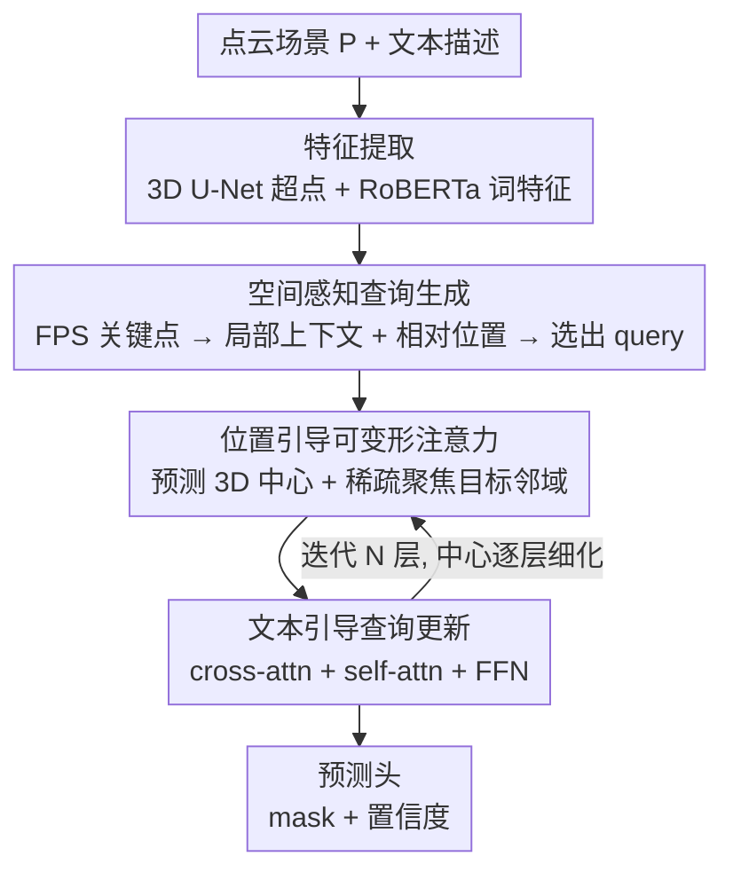

# Spatial Matters: Position-Guided 3D Referring Expression Segmentation

**会议**: CVPR 2026  
**论文**: [CVF Open Access](https://openaccess.thecvf.com/content/CVPR2026/html/Wang_Spatial_Matters_Position-Guided_3D_Referring_Expression_Segmentation_CVPR_2026_paper.html)  
**代码**: https://github.com/LiJiaBei-7/Position3D  
**领域**: 3D视觉 / 分割  
**关键词**: 3D指代分割, 空间关系建模, 可变形注意力, 点云, 查询生成

## 一句话总结
针对 3D 指代分割只看语义、忽略空间关系导致无法区分"多个同类相似物体"的痛点，Position3D 把空间相对位置显式注入两处——**空间感知的查询生成**（让 query 一出生就带几何关系）和**位置引导的可变形注意力解码器**（让 query 逐层把注意力从全局收缩到目标局部），在 ScanRefer 与 Multi3DRefer 上 mIoU 分别刷到 51.0 / 53.2，明显超过此前 SOTA IPDN。

## 研究背景与动机
**领域现状**：3D 指代表达分割（3D Referring Expression Segmentation, 3D-RES）要在点云场景里，根据一句自然语言描述（"靠窗那把椅子"）把目标物体的 mask 分割出来，是 AR/VR、具身智能、机器人操作的基础交互能力。早期是"先分割再匹配"的两阶段范式：先用 3D 实例分割网络产出候选 proposal，再拿文本去匹配——但严重依赖预分割质量、效率也差。近来主流转向 DETR 式的一阶段 encoder-decoder，用 object query 直接解码目标，拿到了 SOTA。

**现有痛点**：无论两阶段还是一阶段，现有方法几乎只盯着**语义线索**（外观、类别），基本不显式建模**空间关系**。当描述靠"这是黑色方形电视"这类语义就能区分时它们表现很好；可一旦场景里有多个视觉上几乎一样的实例（一排四把同款椅子、好几个工具箱），描述只能靠相对位置来锁定（"从左数第二把""红工具箱前面那个绿工具箱"），这些方法就抓瞎了。

**核心矛盾**：3D 场景比 2D 图像复杂得多——物体多、分布在整个空间里，指代往往是"目标 + 它和周围物体的空间关系"的组合。纯语义特征里缺乏"谁在谁旁边、谁在谁左边"这种几何信号，模型自然没法在一堆同类物体里挑对那一个。

**本文目标**：把空间关系**显式**地建进 3D-RES 的两个关键环节——查询怎么生成、解码器怎么聚焦——而不是指望注意力隐式学出来。

**核心 idea**：用"位置引导"贯穿全流程——查询生成阶段往 point proxy 里塞入成对相对位置，让 query 天生带空间感知；解码阶段为每个 query 预测一个 3D 中心并逐层细化，再用稀疏的可变形注意力让感受野从全局逐步收缩到目标邻域。

## 方法详解

### 整体框架
Position3D 是一个一阶段框架。输入是一段文本描述 + 一个点云场景 $P \in \mathbb{R}^{N_p \times 6}$（每点含 xyz 坐标和 rgb 颜色），输出是目标实例的 mask。整条流水线分三段：**特征提取 → 空间感知查询生成 → 位置引导解码器**。

特征提取先用预训练 RoBERTa 抽词级文本特征 $\bar{F}_t$；点云侧用稀疏 3D U-Net 抽逐点特征，再按 superpoint 池化成超点特征 $\bar{F}_s \in \mathbb{R}^{N_s \times D_p}$（沿用 IPDN 的做法，还把多视角 2D 特征加进来缓解 3D 表征的信息损失）。随后两条创新分支接力：先由空间感知查询生成模块把超点变成一批"既懂语义又懂几何"的 point proxy，挑出与文本最相关的若干个作为 decoder 的 query；再由位置引导解码器迭代 $N$ 层，每层都为 query 重新预测/细化 3D 中心、用稀疏可变形注意力聚焦、并与文本交互更新，最后送进预测头出 mask 和置信度。

### 关键设计

**1. 空间感知查询生成：让 query 一出生就带几何关系**

针对"query 只懂语义、不懂空间"这个根本痛点，作者不再直接拿 FPS 采样点当 query，而是先构造一批**空间感知的 point proxy**。第一步用最远点采样（FPS）从超点里选出空间上均匀分布的关键点 $F_{key} = \bar{F}_s[\text{FPS}(P_s)]$，保证几何覆盖广。但光是关键点本身上下文太薄，于是叠几个"空间上下文聚合块"，每块含两层：

- **局部上下文聚合层（LCA）**：对每个关键点用 KNN 找它在超点里的 $K_s$ 个最近邻 $F_n$，再用注意力式的自适应权重挑出信息量大的邻居：$S = F_{key} F_n^\top / \sqrt{D}$，$F_c = \text{Softmax}(S)\cdot F_n$，得到富含局部几何的上下文表示。
- **空间感知交互层（SAI）**：建模关键点之间的全局空间关系。先算两两相对位置并用 MLP 映射成高维嵌入 $\text{Rel}(F_{key})_{i,j} = \phi_r(x_i-x_j,\, y_i-y_j,\, z_i-z_j)$，再把这个相对位置嵌入**直接加到自注意力的打分项上**：$A_{spa} = \text{Rel}(F_{key}) + Q(F_{key})K(F_{key})^\top/\sqrt{d}$，让注意力同时考虑语义相似度和空间关系。

两层结果融合成 proxy：$F_{proxy} = \phi_{proxy}(F_c + F_{spa}) + F_{key}$。最后做**查询选择**——算文本表征和 proxy 的相似度 $S_{proxy} = \frac{1}{N_t}\sum_i \bar{F}_{t,i}\cdot F_{proxy}^\top$，TopK 选出最相关的 $N_q$ 个 proxy 当 decoder query。这样 query 从源头就编码了"语义 + 几何"双重信息，而不是进了 decoder 才慢慢学空间。

**2. 位置引导的可变形注意力：让注意力从全局逐层收缩到目标邻域**

针对"现有 decoder 用全局注意力、不显式建位置"的痛点，作者给每个 query 配一个会动的 3D 中心，并用稀疏注意力把算力集中到目标附近。先为每个 query 预测一个偏移并逐层迭代细化中心：$\Delta P^l = \phi_{offset}(Q^l)$，$C^l = C^{l-1} + \Delta P^l$，其中 $C^0$ 初始化为所选 proxy 的 3D 坐标。中心定下来后，把"query 中心↔超点"的几何关系编码成几何先验 $\text{Rel}(C^l, P_s) = \phi_g(c_i^x - x_j,\, c_i^y - y_j,\, c_i^z - z_j)$。

关键的"稀疏"体现在：对每个 query 只按欧氏距离选最近的 $m_l$ 个超点参与注意力，且 $m_l$ 随层数递减（$m_1 > m_2 > \cdots > m_L$，论文取 $\{128,64,32,16\}$）。中心逐层细化、参与点逐层变少，注意力的感受野就自然地从全局上下文收缩到越来越精确的局部邻域。注意力打分同样把几何先验加进去：$A_{pad}^l = \text{Rel}(Q^l, \tilde{F}_s^l) + Q(Q^l)K(\tilde{F}_s^l)^\top/\sqrt{d}$，输出再残差回 query。这一设计直接呼应了论文标题"Spatial Matters"——位置信息不是装饰，而是引导注意力聚焦的主线。

**3. 文本引导的查询更新：每层把语义重新对齐回 query**

空间聚焦之后，query 还要保证和语言描述对得上。每层 query 先和文本特征做 cross-attention $Q_t^l = \text{Attention}(\hat{Q}^l, F_t, F_t)$，聚焦到与描述语义对齐的 3D 区域；再做 query 间的 self-attention $Q_s^l = \text{Attention}(Q_t^l, Q_t^l, Q_t^l)$ 捕捉 query 之间的上下文依赖，最后过 FFN 产出下一层的 query 表示 $Q^{l+1}$。"空间聚焦（设计 2）+ 语义对齐（设计 3）"在每一层交替进行，让 query 既往目标的几何位置靠拢、又始终扣住文本语义，逐层逼近正确目标。

### 损失函数 / 训练策略
query 过两个 MLP 头分别产出 mask $M = Q\cdot\phi_m(\bar{F}_s)^\top$ 和置信度 $Prob = \phi_{prob}(Q)$。训练目标是四项加权和：mask 监督用 BCE + Dice（$L_{mask}$）；置信度（该 query 是否对应目标实例）用 BCE（$L_{cls}$）；中心定位用 L1 约束预测中心逼近目标质心（$L_{center} = \|C - C_{gt}\|_1$）；跨模态对齐沿用 EDA 的对比损失（$L_{contra}$）鼓励文本特征与匹配 query 对齐。总损失 $L = \lambda_{mask}L_{mask} + \lambda_{cls}L_{cls} + \lambda_{center}L_{center} + \lambda_{contra}L_{contra}$，权重取 $1.0 / 0.1 / 0.5 / 0.1$。实现上 proxy 数 256、query 数 128、4 层 decoder，$K_s = 32$，PolyRL 学习率 0.0001、衰减幂 4.0，batch 16。

## 实验关键数据

### 主实验
ScanRefer（51,583 条表达、800 个 ScanNet 场景）按 Unique / Multiple / Overall 三档评测，Multiple 子集（占约 81%，同类多实例的歧义场景）最考验空间推理：

| 数据集 | 指标 | Position3D | 之前SOTA (IPDN) | 提升 |
|--------|------|------------|-----------------|------|
| ScanRefer Overall | Acc@0.25 | 61.5 | 60.6 | +0.9 |
| ScanRefer Overall | Acc@0.5 | 56.1 | 54.9 | +1.2 |
| ScanRefer Overall | mIoU | 51.0 | 50.2 | +0.8 |
| ScanRefer Multiple | mIoU | 44.7 | 43.6 | +1.1 |
| Multi3DRefer All | Acc@0.25 | 72.3 | 71.5 | +0.8 |
| Multi3DRefer | mIoU | 53.2 | 51.7 | +1.5 |

Multi3DRefer（61,926 条表达，支持零/单/多目标）上整体同样领先，提升主要来自"多目标 + 干扰物"这类最难场景；唯一例外是"零目标 + 干扰物"子集略逊，作者也如实指出。

### 消融实验
在 ScanRefer 上拆解三大组件（LCA = 局部上下文聚合层、SAI = 空间感知交互层、SADA = 位置引导可变形注意力）：

| 配置 | Acc@0.25 | Acc@0.5 | mIoU | 说明 |
|------|---------|---------|------|------|
| 仅 LCA（FPS 点直接当 query） | 58.7 | 52.8 | 48.2 | 不构造 proxy，掉得最狠 |
| LCA + SAI | 58.6 | 53.3 | 48.5 | 缺位置引导解码 |
| LCA + SADA | 59.2 | 53.8 | 48.9 | 缺空间交互 |
| SAI + SADA | 59.5 | 54.4 | 49.4 | 缺局部上下文 |
| Full model | 61.5 | 56.1 | 51.0 | 完整模型 |

另有专门拆"空间关系建模 Rel(·)"的消融：去掉查询生成里的空间关系，Acc@0.25 掉 2.1%、mIoU 掉 1.8%；去掉解码器里的空间关系同样掉点——证明两处都需要显式空间建模。

### 关键发现
- **proxy 化是地基**：第一行直接拿 FPS 点当 query（不构造 proxy）性能崩得最明显，说明"先把关键点养成带语义+几何的 proxy 再选 query"这一步贡献最大。
- **递减的超点数最优**：可变形注意力里每层选多少超点很关键——全用（冗余）或固定太少（覆盖不足）都次优，递减 $\{128,64,32,16\}$ 在"空间覆盖"和"特征紧凑"间取得最佳平衡，对应注意力逐层精确聚焦的直觉。
- **$K_s$ 有甜点**：局部聚合的近邻数 $K_s=32$ 最好，太小（8）抓不到足够局部几何、太大（64）引入噪声。
- **空间建模在 Multiple 子集收益最大**：增益集中在同类多实例的歧义场景，正好印证"空间关系是区分相似物体的关键信号"这一动机。

## 亮点与洞察
- **"位置引导"贯穿首尾而非局部打补丁**：相对位置不是只塞进 decoder，而是从 query 生成（SAI 的相对位置嵌入）一路贯到解码（query 中心迭代细化 + 几何先验），两处都验证有效，思路干净自洽。
- **可变形注意力 + 递减超点数 = 显式的"由粗到精"**：把"感受野从全局收缩到局部"这种通常隐式的过程，用"每层中心细化 + 参与点逐层减半"做成了可控、可视化（论文 Layer1→4 注意力图肉眼可见聚焦）的机制，迁移性强——任何需要"逐步聚焦目标"的 3D query-based 任务（3D 检测、视觉定位）都能借鉴。
- **相对位置进注意力打分项**这一手（$A = \text{Rel} + QK^\top/\sqrt{d}$）轻量且通用，本质是把几何关系当成一种结构化的注意力 bias，比单纯拼接坐标更直接。

## 局限性 / 可改进方向
- **零目标场景是短板**：Multi3DRefer 上"零目标 + 干扰物"子集落后于 IPDN——强空间聚焦的设计可能在"本就没有目标"时反而过度自信，如何让位置引导在 negative 样本上保持克制值得研究。
- **提升幅度偏温和**：相对 IPDN 的 mIoU 增益在 ScanRefer 上约 +0.8，更多是稳态超越而非代际飞跃；空间建模的潜力可能还没被这套相对位置 MLP 完全释放。
- **依赖现成几何坐标**：方法吃的是干净的超点 3D 坐标，对真实传感器噪声/不完整点云下相对位置是否仍可靠，论文未做鲁棒性分析。⚠️ 这是笔者推测的适用边界，原文未讨论。
- **递减超点数 $\{m_l\}$ 是手调超参**：每层选多少点靠网格搜索定，换数据集/场景尺度可能要重调，能否自适应预测是一个改进点。

## 相关工作与启发
- **vs IPDN（此前 SOTA）**：IPDN 引入多视角 2D 特征来补 3D 信息损失，仍偏语义；本文复用了它的多视角特征，但额外把**空间相对位置**显式建进查询生成和解码两端，在最考验空间推理的 Multiple / 多目标场景拉开差距。
- **vs RG-SAN**：RG-SAN 把文本拆成 object-centric 表示来辅助定位与空间建模，是"从语言侧拆空间"；本文是"从视觉/几何侧建空间"（相对位置嵌入 + 位置引导注意力），两条路线互补。
- **vs MDIN / RefMask3D**：同属一阶段 DETR 式框架，但它们的 query 与 decoder 仍以语义交互为主；Position3D 的差异在于给 query 配可迭代的 3D 中心和稀疏可变形注意力，把"空间聚焦"做成显式、逐层的过程。

## 评分
- 新颖性: ⭐⭐⭐⭐ 把空间相对位置显式贯穿查询生成与解码两端、并配可迭代中心的稀疏可变形注意力，角度清晰但组件多为已知模块的巧妙组合。
- 实验充分度: ⭐⭐⭐⭐ 两大基准 + 五张消融表（组件/空间关系/超点数/近邻数）较扎实，但缺鲁棒性与失败案例的系统分析。
- 写作质量: ⭐⭐⭐⭐ 动机—方法—实验逻辑顺畅，公式完整，注意力可视化直观；个别处有笔误（relace/relation）。
- 价值: ⭐⭐⭐⭐ 给"同类相似物体歧义"这一真实痛点提供了可迁移的空间建模范式，对 3D 定位/检测类任务有借鉴意义。

<!-- RELATED:START -->

## 相关论文

- [\[CVPR 2026\] SAQN: Semantic-based Adaptive Query Network for 3D Referring Expression Segmentation](saqn_semantic-based_adaptive_query_network_for_3d_referring_expression_segmentat.md)
- [\[CVPR 2026\] Spatial-SAM: Spatially Consistent 3D Electron Microscopy Segmentation with SDF Memory and Semi-Supervised Learning](spatial-sam_spatially_consistent_3d_electron_microscopy_segmentation_with_sdf_me.md)
- [\[ICCV 2025\] Latent Expression Generation for Referring Image Segmentation and Grounding](../../ICCV2025/segmentation/latent_expression_generation_for_referring_image_segmentation_and_grounding.md)
- [\[CVPR 2026\] S2C2Seg: Semantic-Spatial Consistency and Category Optimization for Open-Vocabulary Segmentation](s2c2seg_semantic-spatial_consistency_and_category_optimization_for_open-vocabula.md)
- [\[CVPR 2026\] MV3DIS: Multi-View Mask Matching via 3D Guides for Zero-Shot 3D Instance Segmentation](mv3dis_multi-view_mask_matching_via_3d_guides_for_zero-shot_3d_instance_segmenta.md)

<!-- RELATED:END -->
