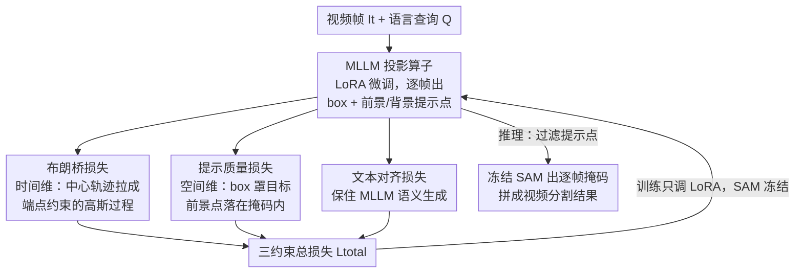

# SPOT: Spatiotemporal Prompt Optimization for Motion-Stabilized MLLM-Guided Video Segmentation

**会议**: CVPR 2026  
**论文**: [CVF Open Access](https://openaccess.thecvf.com/content/CVPR2026/html/Fan_SPOT_Spatiotemporal_Prompt_Optimization_for_Motion-Stabilized_MLLM-Guided_Video_Segmentation_CVPR_2026_paper.html)  
**代码**: 待确认  
**领域**: 视频理解 / 语义分割 / 多模态VLM  
**关键词**: 指代视频分割, 推理视频分割, 布朗桥, 提示点优化, MLLM+SAM

## 一句话总结
SPOT 不改架构、不做视频预训练，只靠两个新损失约束「图像预训练 MLLM 给 SAM 生成的提示点」的时空行为——用布朗桥损失把目标中心轨迹建模成端点受约束的高斯过程逼出时间平滑、用提示质量损失逼出空间几何一致——就让静态训练的基础模型在 Ref-YouTube-VOS、MeViS、ReVOS 等 6 个指代/推理视频分割基准上全面刷到 SOTA。

## 研究背景与动机
**领域现状**：指代视频分割（RVOS）和推理视频分割（ReasonVOS）的主流范式，是把多模态大语言模型（MLLM）和视觉基础模型 SAM 级联起来：MLLM 解析语言-视觉语义、为每一帧生成空间提示（bounding box + 前景/背景提示点），SAM 根据这些提示做像素级分割。这套组合在静态图像上表现极好。

**现有痛点**：问题出在「视频」上。现有方法用的 MLLM 几乎都是在静态图文对上预训练的，逐帧独立生成提示时完全不考虑视频运动的物理连续性。MLLM 没法建模目标轨迹，导致相邻帧的提示点突变，SAM 的掩码就跟着出现严重的非物理抖动（temporal jittering），时间一致性崩坏。

**核心矛盾**：现有补救分两条路——要么在大规模视频-文本数据上微调/预训练 MLLM 来注入时序能力（吃算力吃标注、难以适配现有基础模型生态），要么设计复杂的时序融合模块/记忆库（系统复杂度高、依赖任务定制、泛化差）。两条路都想给 MLLM「灌」显式时空理解能力，却忽略了视频动态本身的物理先验：物体轨迹天然遵循运动连续性，构成平滑的时空上下文流。

**本文目标**：在不改 MLLM 架构、不做视频预训练、不动 SAM 的前提下，同时拿到分割结果的时间平滑性与空间精确性。

**切入角度**：作者提出一个关键判断——静态预训练的 MLLM 其实已经潜在地具备时空推理能力，只需要通过物理运动约束去「规范它的输出行为」就能激活它，而不是去重训模型。换句话说，视频分割的时间不一致来源于「提示生成」环节，而非基础模型架构的局限。

**核心 idea**：把问题等价转化为「为黑盒 SAM 搜索最优提示序列」，再用两个互补损失（时间维的布朗桥损失 + 空间维的提示质量损失）约束 MLLM 这个「可学习投影算子」的输出空间，让提示点轨迹既平滑又落在目标几何上。

## 方法详解

### 整体框架
SPOT 把 MLLM 重新定位成一个可学习的投影算子 $\Pi_\theta:(I_t,Q)\mapsto(b_t,P_t)$，目标是把每帧图像 $I_t$ 和语言查询 $Q$ 映射到「最优提示集」$\mathcal{P}^*$ 的邻域。整条管线是两阶段：**提示生成阶段**——MLLM 对每帧预测一个 bounding box $b_t\in\mathbb{R}^4$ 和一组前景/背景提示点 $P_t=\{(x_{t,i},y_{t,i},l_{t,i})\}_{i=1}^K$（$l\in\{0,1\}$ 是前景/背景标签，所有点都约束在 $b_t$ 内）；**掩码生成阶段**——固定的 SAM 吃 $(I_t,b_t,P_t)$ 输出每帧掩码 $M_t=\mathrm{SAM}(I_t,b_t,P_t)$，拼成视频级结果 $M=\{M_t\}_{t=1}^T$。

关键观察是：SAM 是固定、不可微的黑盒，输出只取决于输入提示。所以「学好分割」就等价于「找一组最优提示序列 $\{(b_t,P_t)\}$ 使 SAM 输出逼近真值掩码」。作者把最优提示集 $\mathcal{P}^*$ 的两条几何性质拎出来作为优化靶子：**时间连续性**（相邻帧提示要平滑，避免突变引发 SAM 抖动）和**空间局部性**（$b_t$ 要罩住真值掩码、前景点落在掩码内、背景点落在掩码外）。这两条性质分别由布朗桥损失和提示质量损失来逼近，再加一个文本对齐损失保住 MLLM 原有的语义生成能力。整个 MLLM 用 LoRA 微调（低秩参数化自带隐式正则，抑制提示过拟合），SAM 全程冻结。

### 关键设计

**1. 布朗桥损失：把目标轨迹建成端点受约束的高斯过程，逼出时间平滑**

痛点直接对准逐帧独立生成导致的抖动：中间帧没有监督信号，MLLM 不知道该怎么连贯地动。作者把目标中心运动轨迹建模成一个**布朗桥**随机过程——布朗桥 $B(t)$ 是满足端点约束 $B(0)=a$、$B(T)=b$ 的高斯过程，它的路径在固定端点下最小化期望 Dirichlet 能量 $\int_0^T\|\dot B(t)\|^2 dt$，也就是说「缺中间监督时，最平滑的轨迹恰好是速度变化最小的那条」。这给「平滑」找到了一个有物理意义的数学定义。

具体做法：用视频片段 $[t_0,t_0+T_s-1]$ 首末两帧的真值掩码算出端点中心 $c_{t_0}^{gt}$、$c_{t_0+T_s-1}^{gt}$（掩码内像素坐标的均值），则任意中间时刻 $t$ 的轨迹服从条件高斯 $\mathcal{N}(\mu_t,\Sigma_t)$，其中 $\mu_t=(1-\alpha_t)c_{t_0}^{gt}+\alpha_t c_{t_0+T_s-1}^{gt}$、$\Sigma_t=\sigma^2\alpha_t(1-\alpha_t)I_2$，$\alpha_t=\frac{t-t_0}{T_s-1}$ 是归一化时间比。这个方差在中间帧最大、端点处收敛到 0，正好刻画了运动不确定性。损失把所有提示点拉向共享轨迹均值 $\mu_t$：

$$\mathcal{L}_{\text{BBridge}}^{[t_0,t_0+T_s-1]}=\sum_{t=t_0+1}^{t_0+T_s-2}\frac{1}{K}\sum_{k=1}^K\frac{\|P_{t,k}-\mu_t\|_2^2}{\max(\alpha_t(1-\alpha_t),\epsilon)}$$

分母 $\alpha_t(1-\alpha_t)$ 是**方差自适应加权**的精髓：靠近端点（$\alpha_t\to0$ 或 $1$）方差小、权重高，强制精确定位；中间帧方差大、权重低，允许合理的运动波动——这就在优化层面把抖动「绕过」了。作者还给了一个贝叶斯解释（Theorem 1）：在高斯假设下最小化该损失等价于以布朗桥为先验、逐帧高斯观测为似然，对真实轨迹做后验均值（MAP）估计，方差加权项恰好对应后验精度。一个额外好处是：它不仅约束前景点，连用于消歧的背景点也被隐式拉着和目标区域一起演化，保住整段提示集的语义一致性。

**2. 提示质量损失：用几何一致性硬监督，逼出空间局部性**

痛点是 SAM 对提示点的空间布局极其敏感——Kirillov 等人指出 SAM 对正样本（前景点）位置很敏感、对负样本相对宽容，所以提分的关键是「确保前景点真的落在目标内」。这个损失由两部分组成。其一是 **bounding box 损失**，用 SmoothL1 对齐 MLLM 预测框 $b^t$ 和真值掩码最小外接矩形 $b^t_{gt}$，做粗定位：$\mathcal{L}_{\text{bbox}}^t=\mathrm{SmoothL1}(b^t,b^t_{gt})$。

其二是**几何一致性硬监督**。它只监督「一个提示点该不该算有效前景」——即它的空间位置是否落在真值掩码内。训练时直接用 MLLM 输出的实值 logit $z_{t,i}$（推理时才离散成 $l_{t,i}\in\{0,1\}$ 喂给 SAM）来构造可微信号：先把点坐标 round+clip 到像素位置 $(u_{t,i},v_{t,i})$，再取真值掩码上的值作为监督目标 $y_{t,i}^{gt}=M^t_{gt}(u_{t,i},v_{t,i})\in\{0,1\}$（落在目标内则该为前景），最后用标准二元交叉熵：

$$\mathcal{L}_{\text{class}}^t=-\sum_{i=1}^K\left[y_{t,i}^{gt}\log\sigma(z_{t,i})+(1-y_{t,i}^{gt})\log(1-\sigma(z_{t,i}))\right]$$

两项合成 $\mathcal{L}_{\text{quality}}^t=\mathcal{L}_{\text{bbox}}^t+\mathcal{L}_{\text{class}}^t$。作者论证：若所有正点落在掩码内、box 罩住掩码，则 SAM 的 IoU 随正点增多或负点远离目标单调不减——也就是说最小化 $\mathcal{L}_{\text{quality}}$ 的优化方向和 SAM 分割性能提升方向一致，等于在「间接地」最大化 SAM 的分割质量。这一步把「SAM 是黑盒、不可微」的难题，巧妙转化成了一个可微的提示几何监督。

**3. 文本对齐损失 + 三约束总损失：保住语义能力，把时空目标拧成一个优化问题**

只压几何和时序，MLLM 原本的语言理解和生成能力会被磨掉。作者保留标准自回归语言建模目标作为文本对齐损失：MLLM 把帧 $I_t$ 和查询 $Q$ 当输入，生成包含 box 和提示点坐标的结构化文本（如 `<box>(120,145),(225,350)</box> (130,150,1) (200,300,-1)`），用交叉熵监督这段序列 $\mathcal{L}_{\text{text}}^t=-\sum_j\log p_\theta(w_j\mid I_t,Q,w_{<j})$。三者拧成一个三约束总损失：

$$\mathcal{L}_{\text{total}}=\sum_{t=t_0}^{t_0+T_s-1}\left(\mathcal{L}_{\text{quality}}^t+\lambda_{\text{text}}\mathcal{L}_{\text{text}}^t\right)+\lambda_{\text{bb}}\mathcal{L}_{\text{BBridge}}^{[t_0,t_0+T_s-1]}$$

其中 $\mathcal{L}_{\text{text}}$ 保语义、$\mathcal{L}_{\text{quality}}$ 保每帧空间有效、$\mathcal{L}_{\text{BBridge}}$ 保提示序列随时间平滑演化。三者各管一维、互不替代，这正是 SPOT 「只约束输出行为」就能同时拿到稳定性、精度、泛化性的关键。

### 损失函数 / 训练策略
backbone 用 Qwen-VL-7B-Chat（利用它原生的 box 生成能力），LoRA 微调、冻结大部分原参数；分割端用 EfficientViT-XL1-SAM 加速推理。MLLM 与 SAM 通过两轮对话连接：第一轮生成被指代物体的 box，第二轮在框内采 $5\times5$ 网格点判定前景/背景。推理时先按置信度阈值过滤提示点再喂给 SAM。关键超参经消融定在 $\lambda_{\text{bb}}=0.1$、$\lambda_{\text{text}}=0.5$、片段长度 $T_s=8$、扩散系数 $\sigma^2=1.0$。

## 实验关键数据

### 主实验
在指代视频分割上，SPOT 全面超过包括大参数 LLM 框架在内的所有前法（J&F 越高越好）：

| 数据集 | 指标 | SPOT-13B | 之前最好 | 提升 |
|--------|------|----------|----------|------|
| Ref-YouTube-VOS | J&F | 71.8 | 69.2 (SAMWISE) | +2.6 |
| Ref-DAVIS-2017 | J&F | 77.2 | 74.9 (DTOS-9B) | +2.3 |
| MeViS | J&F | 51.2 | 49.5 (SAMWISE) | +1.7 |
| A2D-Sentences | IoU(Overall) | 82.2 (7B) | 81.1 (DsHmp) | +1.1 |
| JHMDB-Sentences | IoU(Overall) | 75.0 (7B) | 73.9 (DsHmp) | +1.1 |

在更难的推理视频分割 ReVOS 上提升尤其明显，连衡量时间稳定性的 R 指标也大幅领先：

| 模型 | Overall J&F ↑ | 稳定性 R ↑ |
|------|---------------|-----------|
| VISA-13B | 50.8 | 15.1 |
| SPOT-7B | 52.7 | 16.5 |
| SPOT-13B | 54.8 | 18.0 |

值得注意的是 SPOT-7B 已经压过 VISA-13B，说明性能来自「约束输出行为」而非堆参数。

### 消融实验
核心约束组件消融（Ref-YouTube-VOS，SPOT-7B，J&F=70.5 为满配）：

| 配置 | J&F | 说明 |
|------|-----|------|
| Full Model | 70.5 | 完整模型 |
| w/o $\mathcal{L}_{\text{BBridge}}$ | 65.2 | 去时间约束掉 5.3% |
| w/o $\mathcal{L}_{\text{quality}}$ | 62.7 | 去空间约束掉 7.8%（最大） |
| w/o $\mathcal{L}_{\text{text}}$ | 67.8 | 去语义约束掉 2.7% |
| MLLM + SAM 2（无 Eq.10） | 66.9 | 换 SAM2 也不如完整 SPOT |

布朗桥损失设计变体消融：

| 变体 | J&F | 说明 |
|------|-----|------|
| Full（自适应加权） | 70.5 | 完整 |
| Constant Weighting | 68.7 | 均匀权重掉 1.8% |
| Endpoint-Only | 67.3 | 只监督端点、不管中间帧 |
| w/o Brownian Bridge | 65.2 | 完全去掉 |

### 关键发现
- **空间几何约束贡献最大**：去掉提示质量损失掉 7.8%，超过去掉布朗桥损失的 5.3%——印证了「SAM 对正点位置最敏感」的判断，把前景点逼进掩码内是提分第一要务。
- **架构不是瓶颈，提示生成才是**：用原版 SAM 的完整 SPOT（70.5）显著超过「MLLM + SAM 2」基线（66.9），直接验证了本文核心论点——时间不一致源于提示生成而非基础模型架构。
- **方差自适应加权确有必要**：换成常数权重掉 1.8%，只监督端点进一步下滑，说明对不同帧位置的不确定性差异化处理、并显式建模中间帧轨迹都不可省。
- **超参有明确甜点**：J&F 在 $\lambda_{\text{bb}}=0.1$、$\lambda_{\text{text}}=0.5$、$T_s=8$、$\sigma^2=1$ 处峰值；片段太短（2-4 帧）缺时序上下文，太长（16-32 帧）优化复杂度上升；$\sigma^2$ 太小限制运动灵活性、太大削弱时序约束。

## 亮点与洞察
- **把「黑盒不可微的 SAM」转成「可微的提示几何监督」**：核心洞察是 SAM 输出只取决于提示，于是学习目标从「学分割」转成「为 SAM 搜最优提示序列」，再证明提示质量损失的优化方向与 SAM 的 IoU 单调一致，绕开了不可微难题。这个「优化输入而非模型」的思路很值得迁移到其他「冻结基础模型 + 可控前端」的场景。
- **用布朗桥给「时间平滑」一个有物理意义的数学先验**：不是简单加个相邻帧 L2 平滑，而是把缺中间监督下的最平滑轨迹严格刻画为端点约束高斯过程，方差自适应权重天然实现「端点严、中间松」，还能用贝叶斯后验均值解释——比启发式平滑更有说服力。
- **「激活而非灌输」的范式判断**：作者主张静态 MLLM 已潜在具备时空推理力，只需约束输出行为去激活，这个判断由「不做视频预训练却超过视频预训练方法」的实验直接撑住，对整个 MLLM+基础模型级联范式有方法论意义。
- **轻量且不破坏泛化**：只 LoRA 微调 MLLM、全程冻结 SAM，既省算力又保住零样本泛化，工程上易接入现有基础模型生态。

## 局限与展望
- **端点中心依赖首末帧真值掩码**：布朗桥损失要从片段首末帧的真值掩码取端点中心，训练阶段依赖较准的端点标注；若端点帧本身遮挡/分割不准，整条桥的均值轨迹会被带偏。
- **中心轨迹假设运动连续**：布朗桥本质假设目标沿平滑路径运动，对快速变向、突然出现/消失、被遮挡后重现、或多个同类目标交错的场景，单一高斯桥可能不足以刻画真实轨迹。
- **片段长度固定为 8 帧**：长视频被切成定长片段独立优化，跨片段的长程一致性如何保证、片段边界是否引入接缝，论文未深入讨论。
- **稳定性指标 R 仍偏低**：ReVOS 上 R 最高仅 18.0，绝对值不高，说明推理类视频分割的时间稳定性整体仍是难题，远未饱和。
- **未开源代码（待确认）**：缓存中未见代码链接，复现细节（如提示点采样、置信度阈值、两轮对话 prompt 模板）需作者进一步公开。

## 相关工作与启发
- **vs 视频预训练类（VISA / VideoLISA / ViLLa）**：他们在大规模视频-文本上微调 MLLM 注入显式时序能力，吃算力吃标注；SPOT 不做任何视频预训练，只约束输出行为，却用 7B 压过它们的 13B，说明「时序能力」可被约束激活而非必须重训。
- **vs 复杂时序架构 / 记忆库（SAM 2 流式记忆、外部融合模块）**：他们靠改架构/加模块增强帧间关联，系统复杂、依赖任务定制；SPOT 用原版 SAM + 提示优化就拿到更好的时间一致性，实验里「MLLM+SAM2」还不如完整 SPOT，直指「问题在提示不在架构」。
- **vs 级联 MLLM+SAM（RefSAM / SAMWISE）**：同属「MLLM 出提示、SAM 出掩码」范式，但前者逐帧独立生成、不管运动连续性，导致掩码抖动；SPOT 在此范式上补了时间维（布朗桥）和空间维（几何硬监督）双约束，是对该范式的直接增强。
- **启发**：「冻结一个强大但不可微的基础模型，只学习可控的前端输入」这一思路，配合「为输出空间设计有物理/几何意义的可微约束」，可迁移到检测、关键点、可控生成等任何「下游模型固定、前端提示可学」的任务。

## 评分
- 新颖性: ⭐⭐⭐⭐⭐ 用布朗桥过程为提示轨迹时间平滑提供物理先验、把 SAM 不可微难题转成可微提示几何监督，视角新且自洽。
- 实验充分度: ⭐⭐⭐⭐ 覆盖 6 个 RVOS/ReasonVOS 基准 + 多组消融与超参分析，较完整；但缺时序稳定性可视化的更多定量指标，且 R 绝对值偏低。
- 写作质量: ⭐⭐⭐⭐ 动机推导清晰、公式与贝叶斯解释到位；个别表述略堆砌、代码未见。
- 价值: ⭐⭐⭐⭐⭐ 「约束输出而非重训模型」的范式判断有普适方法论意义，且轻量易接入现有 MLLM+SAM 生态。

<!-- RELATED:START -->

## 相关论文

- [\[CVPR 2026\] VIRST: Video-Instructed Reasoning Assistant for SpatioTemporal Segmentation](virst_video-instructed_reasoning_assistant_for_spatiotemporal_segmentation.md)
- [\[ICCV 2025\] MOVE: Motion-Guided Few-Shot Video Object Segmentation](../../ICCV2025/segmentation/move_motion-guided_few-shot_video_object_segmentation.md)
- [\[CVPR 2026\] SAM2Text: Towards Prompt-Free and Multi-Resolution Video Scene Text Segmentation](sam2text_towards_prompt-free_and_multi-resolution_video_scene_text_segmentation.md)
- [\[CVPR 2026\] VideoMaMa: Mask-Guided Video Matting via Generative Prior](videomama_mask-guided_video_matting_via_generative_prior.md)
- [\[CVPR 2026\] Moving Border Ownership for Event-based Motion Segmentation](moving_border_ownership_for_event-based_motion_segmentation.md)

<!-- RELATED:END -->
