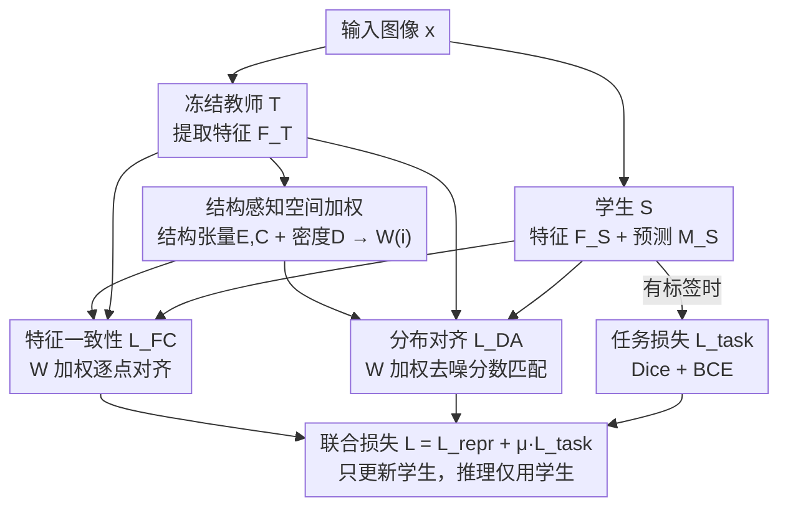

# Structure-Aware Representation Distillation for Tiny-Dense Object Segmentation

**会议**: CVPR 2026  
**论文**: [CVF Open Access](https://openaccess.thecvf.com/content/CVPR2026/html/Liu_Structure-Aware_Representation_Distillation_for_Tiny-Dense_Object_Segmentation_CVPR_2026_paper.html)  
**代码**: https://github.com/liuuuuuuxuesong/SARD  
**领域**: 语义分割 / 知识蒸馏  
**关键词**: 微小密集目标、表示蒸馏、结构张量、边界IoU、特征空间对齐

## 一句话总结
SARD 把分割知识蒸馏从"模仿 mask"改成"对齐特征空间几何"，用一张由边界、曲率、空间拥挤度合成的"结构重要度图" $W(i)$ 给特征蒸馏损失加权，让轻量学生把容量集中到边界和密集接触区，在 Cityscapes / ADE20K / 工业岩石碎裂 RockFrag 上一致提升 mIoU 和边界 IoU（RockFrag 上比 CWD 提 +4.3 mIoU / +6.7 bIoU），且推理零额外开销。

## 研究背景与动机
**领域现状**：在包含大量微小、密集排布目标的场景（医学显微、遥感、工业检测、矿山岩石碎裂分析）里，哪怕一个像素的偏差都会显著改变下游测量结果。SAM、Mask2Former 这类基础模型泛化强但太贵；FastSAM / MobileSAM / EfficientSAM 这些高效变体虽然便宜，却在"微小尺度图案占主导"的领域里掉点严重。于是"既轻量又保得住结构细节"成了实际部署的刚需，而知识蒸馏是把大教师压成小学生的主流手段。

**现有痛点**：传统蒸馏（logit 蒸馏、像素级对齐 SKD、通道蒸馏 CWD、解耦 logit DKD、masked 重建 MGD、多层 review）本质都在**模仿教师的输出 mask 或中间 logits**，并且对所有空间位置**一视同仁地均匀加权**。但微小密集场景的信息密度天然不均匀：岩石互相接触的边界、碎片之间的接缝点，需要的表示精度远高于均质的物体内部。均匀蒸馏把同样多的注意力倒给碎片内部和接触边界，结果学生学到的是"粗糙的语义对齐"，却丢掉了边界保真度——这正是微小密集任务里普遍存在的失效模式。

**核心矛盾**：现有方法假设"信息密度处处相等"，但几何复杂度在空间上根本不均衡。边界、交汇点、拥挤区承载了绝大部分关键几何信息，却被均匀损失稀释掉了学习信号。

**本文目标**：让蒸馏在不改架构、不加推理模块的前提下，自动把学习信号集中到"几何上重要"的位置。

**切入角度**：作者主张——成功的微小密集迁移需要的是**结构感知的表示对齐（structure-aware representation alignment）**，而不是输出模仿。与其直接匹配 mask，不如让学生去**复现教师特征空间里的几何**（细尺度边、边界、区域密度都编码在那里）。这把蒸馏重新表述成一个表示学习问题：保留空间结构与局部信息流，且与具体的教师架构无关。

**核心 idea**：构造一张结构重要度图 $W(i)$，融合边界显著性、结构复杂度、局部特征变化，用它去**加权特征级蒸馏损失**，从而把学生的特征空间整体"扳向"对微小密集特性敏感的方向。

## 方法详解

### 整体框架
SARD（Structure-Aware Representation Distillation）是一个"教师兼容"的单阶段蒸馏框架。输入一张图（可选 prompt），冻结的教师 $T$ 和可训练学生 $S$ 各自编码出 $C$ 通道、空间尺寸 $H\times W$ 的中间特征 $F_T=E_T(x)$、$F_S=E_S(x)$；学生解码器再用 $F_S$ 预测分割 mask $M_S=D_S(F_S,p)$。

标准蒸馏的目标是把学生特征逐位置对齐到教师特征：

$$\min_S \frac{1}{|\Omega|}\sum_{i\in\Omega} L_{repr}(F_S(i),F_T(i)) + \lambda L_{seg}(M_S,M_{gt})$$

SARD 的关键改动是给表示损失乘上一个**逐位置的结构权重** $W(i)$，把目标改写成：

$$\min_S L_{repr}(F_S,F_T;W) + \mu L_{seg}(M_S,M_{gt}),\quad W(i)=\frac{S(i)}{\sum_{j\in\Omega}S(j)},\ \sum_i W(i)=1$$

其中 $S(i)$ 量化位置 $i$ 的结构重要度。整条 pipeline 是：冻结教师只提供特征 → 从教师特征里**算出** $W(i)$（不需要标签）→ 用 $W(i)$ 加权两路表示损失（特征一致性 + 分布对齐）训练学生 → 有标签时再叠加标准分割损失。推理时只跑学生网络，零额外开销。

### 关键设计

**1. 结构重要度图 $W(i)$：把"信息密度不均匀"显式建模成蒸馏权重**

这是 SARD 的核心创新，直接针对"均匀蒸馏稀释关键信号"这个痛点。作者观察到，微小密集场景的分割失败来自两个层级的复杂度：**实例内结构**（单块岩石有多个切面和表面变化、细胞有核与不规则膜）和**实例间拥挤**（物体堆叠、接触、重叠，在接触点制造模糊边界）。SARD 把这两类信息合成一个标量分数

$$S(i)=\beta_e E(i)+\beta_c C(i)+\beta_d D(i)$$

再归一化成权重 $W(i)=S(i)/\sum_j S(j)$（全图和为 1）。其中 $E,C$ 刻画几何复杂度（边、角、切面），$D$ 刻画空间拥挤度。归一化保证学习信号自然集中到几何复杂且空间拥挤的位置。之所以有效，是因为它没有去单独造"边缘检测模块/区域模块"，而是把这些线索**直接嵌进表示空间的损失权重里**——放大这些关键位置的梯度，学生的特征表示就会自发演化出对微小密集特性的敏感性，而不是停留在通用特征上。

**2. 基于结构张量的几何复杂度 $E$、$C$：用特征梯度的二阶统计区分"取向边界"和"交汇点"**

针对"如何无监督地定位几何信息"，SARD 不用现成的边缘检测，而是从教师特征 $F_T\in\mathbb{R}^{C\times H\times W}$ 出发，对每个通道 $c$ 在位置 $i$ 算空间梯度 $\nabla F_T^{(c)}(i)=[\partial_x F_T^{(c)},\partial_y F_T^{(c)}]^\top$（用标准 Sobel 算子），然后累加梯度外积构成 $2\times 2$ 对称的**结构张量**：

$$J(i)=\sum_{c=1}^{C}\nabla F_T^{(c)}(i)\,\nabla F_T^{(c)}(i)^\top$$

对 $J(i)$ 做特征分解得到两个特征值 $\lambda_1\ge\lambda_2\ge 0$（分别是主方向和垂直方向的梯度强度），再导出两个互补的几何度量：

$$E(i)=\lambda_1(i)-\lambda_2(i),\qquad C(i)=\sqrt{\lambda_1(i)\lambda_2(i)}$$

特征值之差 $E$ 是标准的**各向异性度量**，量化梯度的方向偏置，对应有取向的过渡（边界、切面边）会很高；几何均值 $C$ 捕捉**多方向梯度强度**，对应复杂交汇点和接合点会很高，同时它与 $E$ 量纲一致、数值稳定。两者一起覆盖了几何复杂度的整个谱：高 $E$ 是边界、高 $C$ 是交汇点、表面不规则处两者都贡献。这套统一表述把"实例间边界（岩石接触）"和"实例内结构（表面切面）"等同对待，因为二者都是需要精确特征对齐的关键几何信息。

**3. 空间密度 $D(i)$：用特征离散度无监督地标记"拥挤区"**

几何度量本身在密集场景里还不够——一个区域里有很多小碎片时，即便单个边和角都检测到了，均匀对待所有几何特征仍无法优先处理"拥挤诱发混淆"的区域。SARD 因此估计局部实例密度：有标签时直接数与局部窗口 $W_r(i)$ 相交的实例数；无标签时用**特征离散度**作代理：

$$D(i)=\frac{1}{|W_r(i)|}\sum_{j\in W_r(i)}\|F_T(j)-\mu(i)\|_2,\quad \mu(i)=\frac{1}{|W_r(i)|}\sum_{j\in W_r(i)}F_T(j)$$

高离散度意味着窗口内有许多不同结构共现，正是密集目标区的特征。值得注意的是，作者**默认对所有数据集（包括有标签的）都用特征离散度版本**，以摆脱对实例图的依赖，让 SARD 同时兼容全监督和半监督设置（窗口半径 $r=7$，即 $15\times 15$ 邻域）。

**4. 特征一致性 $L_{FC}$ + 分布对齐 $L_{DA}$：逐点对齐 + 去噪分数匹配的互补双路损失**

有了 $W(i)$，需要把它接到具体的表示损失上。SARD 把表示目标拆成两项互补损失 $L_{repr}=\lambda_f L_{FC}+\lambda_d L_{DA}$。

**特征一致性 $L_{FC}$** 先把师生特征用可学习的 $1\times1$ 卷积投影到共享隐空间 $\hat F_T=P_T(F_T)$、$\hat F_S=P_S(F_S)$，再做结构加权的逐点匹配：

$$L_{FC}=\sum_{i\in\Omega}W(i)\,\|\hat F_S(i)-\hat F_T(i)\|_2^2$$

$W(i)$ 在这里放大几何重要位置的梯度，引导学生优先对齐边界和密集区。

**分布对齐 $L_{DA}$** 则要捕捉超出逐点值的**局部特征分布**，借鉴去噪分数匹配的思路：先给投影后的教师特征注入高斯噪声 $\tilde F_T=\sqrt{\alpha}\hat F_T+\sqrt{1-\alpha}\,\epsilon$（$\epsilon\sim\mathcal N(0,I)$），得到一个平滑的教师特征分布；然后训练一个轻量去噪头 $g_\theta$（两层卷积、隐维 128），让它**从学生特征里预测被注入的噪声**：

$$L_{DA}=\sum_{i\in\Omega}W(i)\,\|g_\theta(\hat F_S(i))-\epsilon(i)\|_2^2$$

预测扰动教师特征对应的噪声，等价于鼓励学生表示去逼近"含噪教师特征分布的分数（log-密度的梯度）"，这在密集目标簇内部、特征高度可变的区域尤其有用。两路损失一个管"点对齐"一个管"分布对齐"，正好互补。

### 损失函数 / 训练策略
SARD 采用**单阶段联合优化**：表示蒸馏与分割监督一起训。教师始终冻结，梯度只流过学生、投影头 $P_S$ 和去噪头 $g_\theta$。有标签 mask 时任务损失用 $L_{task}=\text{Dice}(M_S,M_{gt})+\text{BCE}(M_S,M_{gt})$，总目标为

$$\min_S \mathbb{E}_{(x,y)\in L}\big[L_{repr}(x)+\mu\,L_{task}(x,y)\big]$$

表示损失对每张训练图都算，任务损失用对应 GT mask。超参：$\beta_e=2.0,\beta_c=1.0,\beta_d=1.0$；$\lambda_f=1.0,\lambda_d=0.5,\mu=1.0$；分数匹配噪声 $\alpha=0.5$。训练 100 epoch，AdamW（lr $1\times10^{-4}$，weight decay 0.01）+ 余弦退火，batch 8 累积 2 步（等效 16），单张 RTX 4090，每配置跑 3 个随机种子取均值。结构图在第一个 epoch 后缓存、教师特征预计算，所以额外计算全部限制在训练阶段。

## 实验关键数据

### 主实验
同骨干 Swin 师生对，三个数据集对比各蒸馏基线（mIoU / bIoU，越高越好）：

| 数据集（Swin-L→Swin-T） | 指标 | Student(scratch) | CWD | MGD | SARD | ∆ vs CWD |
|------|------|------|------|------|------|------|
| Cityscapes | mIoU | 76.5 | 78.9 | 79.1 | **80.3** | +1.4 |
| Cityscapes | bIoU | 71.2 | 73.8 | 74.2 | **76.1** | +2.3 |
| ADE20K | mIoU | 42.1 | 44.8 | 45.1 | **46.9** | +2.1 |
| ADE20K | bIoU | 35.8 | 38.6 | 39.0 | **40.8** | +2.2 |
| RockFrag | mIoU | 52.3 | 55.9 | 56.3 | **60.2** | +4.3 |
| RockFrag | bIoU | 36.8 | 40.6 | 41.2 | **47.3** | +6.7 |

跨架构师生对（Avg. vs CWD），证明不改 loss 就能泛化到异构组合：

| 师生对 | mIoU 提升 | bIoU 提升 | RockFrag bIoU 提升 |
|------|------|------|------|
| ViT-L → ViT-T | +1.6 | +2.4 | +5.8 |
| SAM-H → EfficientSAM-Ti | +1.8 | +2.7 | +6.2 |
| Mask2Former-L → M2F-R50 | +1.5 | +2.3 | +5.5 |

### 消融实验
RockFrag 上隔离结构感知加权各分量（Swin-L 教师 → ResNet-50 学生）：

| 加权策略 | mIoU | bIoU | 说明 |
|------|------|------|------|
| Vanilla KD (logit) | 52.3 | 36.9 | logit 级蒸馏基线 |
| Uniform SARD ($W=1$) | 53.8 | 38.5 | 表示损失但均匀加权（受控参照） |
| Boundary-only ($W\propto E$) | 56.2 | 42.8 | 只用边界各向异性 |
| Density-only ($W\propto D$) | 55.4 | 41.6 | 只用空间密度 |
| Curvature-only ($W\propto C$) | 55.8 | 42.1 | 只用交汇点曲率 |
| E + C | 57.8 | 44.6 | 几何复杂度组合 |
| **SARD (full: E+C+D)** | **58.6** | **45.2** | +4.8/+6.7 vs Uniform SARD |

效率对比（RockFrag，1024×1024，RTX 4090）：

| 模型 | Params | GFLOPs | FPS | mIoU |
|------|------|------|------|------|
| Teacher (Swin-L) | 197M | 1014 | 9.8 | 62.4 |
| Student (R50, scratch) | 25.6M | 62 | 88.5 | 49.6 |
| Student + CWD | 25.6M | 62 | 88.5 | 54.1 |
| **Student + SARD** | 25.6M | 62 | 88.5 | **58.6** |

### 关键发现
- **结构加权是涨点主力**：从 Uniform SARD（53.8/38.5）到 full SARD（58.6/45.2），仅靠加权就 +4.8 mIoU / +6.7 bIoU；相比 vanilla KD 更是 +6.3/+8.3。说明"表示蒸馏"本身只是不错的基线，真正的增益来自"把信号压到结构重要位置"。
- **bIoU 提升一致大于 mIoU**：所有数据集上边界 IoU 的增幅都超过 mIoU（如 Cityscapes +2.3 bIoU vs +1.4 mIoU），印证了设计目标——结构感知加权主要增强的是几何精度而非整体区域重叠。
- **三个分量互补、联合最优**：边界(E)、曲率(C)、密度(D) 单独用都不如两两组合，E+C+D 全开最好，说明几何复杂度和空间拥挤捕捉的是结构的不同侧面。
- **越极端越受益**：在接触碎片最多的 RockFrag 上增益最大（+4.3 mIoU / +6.7 bIoU vs CWD），远超 Cityscapes / ADE20K，正好命中"微小密集"这个设计靶心。
- **零推理代价的压缩**：ResNet-50 学生达到教师 7.7× 参数压缩、9.0× 提速，恢复了约 70% 的师生性能差（62.4→49.6→58.6），且 Params/FLOPs/FPS 与 CWD 完全一致，结构加权只在训练时生效。

## 亮点与洞察
- **把"模仿 mask"重述成"复现特征几何"**：最让人"啊哈"的是视角转换——不直接匹配输出，而是让学生学教师特征空间里编码的边、界、密度。这绕开了任务特定的边界/多尺度专用架构，换来跨架构通用性。
- **结构张量当无监督的"重要度探测器"**：用教师特征梯度的二阶矩（$E$ 各向异性 + $C$ 几何均值）区分边界与交汇点，是经典图像处理工具在深特征上的巧妙复用，且全程不需要标签，天然兼容半监督。
- **去噪分数匹配进蒸馏**：$L_{DA}$ 让学生预测注入教师特征的噪声，等价对齐含噪教师分布的 score，比逐点 L2 更能抓密集簇内部的局部分布——这个"扩散式"分布对齐项可迁移到任何特征蒸馏任务。
- **结构图可缓存 → 训练几乎零额外开销**：第一个 epoch 后缓存结构图、预计算教师特征，把所有额外算力关进训练，推理只跑学生，工业实时部署友好。
- **可迁移 trick**：$W(i)$ 这种"用教师特征自算的空间重要度图"可以即插到任何 dense prediction 蒸馏（深度估计、光流、关键点）上当损失加权器。

## 局限与展望
- **RockFrag 不公开**：核心卖点几乎都建立在自建的工业岩石碎裂数据集上（最大增益来源），但论文未说明该数据集是否公开，可复现性与可比性打折扣。
- **超参偏多且固定**：$\beta_e/\beta_c/\beta_d$、$\lambda_f/\lambda_d$、$\alpha$、$r$ 都是手工设定，论文未给跨数据集敏感性分析，换域时可能需要重调。
- **结构信号来自教师特征**：$E/C/D$ 全部从教师特征导出，若教师本身在某域特征不佳，结构图会失真，方法上限受教师质量约束。
- **标准 benchmark 上增益温和**：Cityscapes/ADE20K 上 mIoU 仅 +1~2，方法的优势高度集中在"极端微小密集"场景，对一般分割任务性价比有限。
- **改进方向**：把 $\beta$ 系数做成可学习/自适应、或随训练动态调度结构图，可能进一步把增益泛化到普通场景；也可探索把 $L_{DA}$ 的去噪头扩展成多噪声尺度以更稳地对齐分布。

## 相关工作与启发
- **vs CWD（通道蒸馏）**：CWD 把激活图归一化成概率分布、最小化 KL 来聚焦显著区，但仍是**均匀空间加权**对待边界与内部；SARD 显式区分几何重要度并加权，正是在 CWD 之上 RockFrag 拿到 +4.3 mIoU / +6.7 bIoU 的来源。
- **vs DKD / MGD / 多层 review**：这些方法分别从解耦 logit、masked 特征重建、多层对齐入手，但都假设信息密度均匀；SARD 的差异是承认"空间非均匀性"并据此重分配学习信号。
- **vs 边界专用 / 多尺度架构**：边界增强、多尺度处理能提几何精度，但需任务特定设计、限制泛化；SARD 把这些线索嵌进表示损失权重而非架构，做到"换师生对不换 loss"。
- **vs 高效分割模型（FastSAM/MobileSAM/EfficientSAM/SegFormer）**：这些靠架构工程压参数；SARD 走蒸馏路线，在相近参数预算下 RockFrag 上 ViT-T 学生（5.7M）反超最好高效基线 SegFormer-B1（+4.3 mIoU / +5.3 bIoU），说明"更好的结构感知表示"比"单纯加容量"更划算。

## 评分
- 新颖性: ⭐⭐⭐⭐ 把蒸馏重述为"特征几何对齐"+结构张量加权+去噪分数匹配，组合新颖且动机扎实，但各零件多为已有工具的巧妙拼装
- 实验充分度: ⭐⭐⭐⭐ 三数据集 + 多师生对 + 细粒度分量消融 + 效率分析齐全，扣分在最大卖点依赖未公开的 RockFrag
- 写作质量: ⭐⭐⭐⭐ 逻辑链清晰、公式与 Algorithm 1 完整，符号略密集但可读
- 价值: ⭐⭐⭐⭐ 即插式、零推理开销、跨架构通用，对工业微小密集分割部署有实用价值

<!-- RELATED:START -->

## 相关论文

- [\[CVPR 2026\] Beyond Appearance: Camouflaged Object Detection via Geometric Structure](beyond_appearance_camouflaged_object_detection_via_geometric_structure.md)
- [\[CVPR 2026\] AFRO: Bootstrap Dynamic-Aware 3D Visual Representation for Scalable Robot Learning](bootstrap_dynamic-aware_3d_visual_representation_for_scalable_robot_learning.md)
- [\[CVPR 2026\] InterRVOS: Interaction-Aware Referring Video Object Segmentation](interrvos_interaction-aware_referring_video_object_segmentation.md)
- [\[CVPR 2026\] Masked Representation Modeling for Domain-Adaptive Segmentation](mrm_masked_representation_modeling_domain_adaptive.md)
- [\[ICML 2026\] Beyond Detection: A Structure-Aware Framework for Scene Text Tracking](../../ICML2026/segmentation/beyond_detection_a_structure-aware_framework_for_scene_text_tracking.md)

<!-- RELATED:END -->
